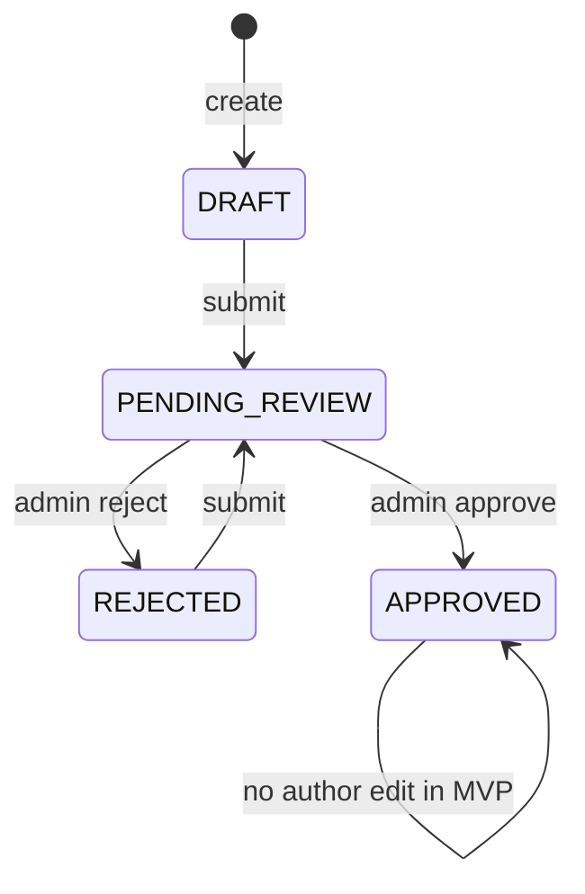

# Prani Doctor — Knowledge Hub / Tutorials (Task Card 14)

Scope: [Prani Doctor](https://pranidoctor.com/) only — no other products.

---

## 1. Current audit summary

### 1.1 Prisma / database

| Item | Finding |
|------|---------|
| **User model** | Single `User` with `UserRole` (`ADMIN`, `SUPER_ADMIN`, `DOCTOR`, `CUSTOMER`, …). `AdminProfile` / `DoctorProfile` hang off `User`. |
| **Knowledge Hub models** | `ContentCategory` + `ContentPost` with `ContentApprovalStatus` (`DRAFT` / `PENDING_REVIEW` / `APPROVED` / `REJECTED`), FK `categoryId`, `authorId` → `User`, `isPublished` + `publishedAt` for public visibility. |
| **Migrations** | PostgreSQL migrations under `prisma/migrations/` (e.g. `20260509120000_knowledge_hub_content`); use `prisma migrate dev` / `deploy` and `npm run seed` for categories. |

### 1.2 API layout

| Area | Pattern |
|------|---------|
| **Mobile** | `/api/mobile/*` — JSON `{ ok, data }` / `{ ok: false, error }` via `jsonOk` / `jsonError`. Some routes require customer auth; **tutorial read routes are public** (no Bearer required). |
| **Doctor** | `/api/doctor/*` — `requireDoctorApiActor()` (`src/lib/doctor-auth/api-guard.ts`), doctor session cookie. |
| **Admin** | `/api/admin/*` — `requireAdminPanelApiAccess()` or `requireAdminApiActor()` (`src/lib/admin-auth/api-guard.ts`), admin session cookie. |

### 1.3 Auth / roles

- **Doctor authoring**: active doctor user + `ProviderStatus.ACTIVE` (same rules as doctor panel login).
- **Admin authoring / moderation**: `ADMIN` or `SUPER_ADMIN` with `AdminProfile` and `UserStatus.ACTIVE`.
- **Author identity**: always `User.id` on `ContentPost.authorId` — no duplicate user system.

### 1.4 Docs / planning

- `docs/ANIMAL_PROFILE_PLAN.md` — example task plan format for this repo.
- `docs/DATABASE_SCHEMA_PLAN.md` — still mentions legacy `ContentStatus` on content; **Knowledge Hub now uses `ContentApprovalStatus`** (update that doc when convenient).

### 1.5 Admin dashboard (UI audit)

| Item | Finding |
|------|---------|
| **Layout** | `src/app/admin/(dashboard)/layout.tsx` — `ensureAdminDashboardAccess()`, `Noto_Sans_Bengali`, `AdminDashboardShell`. |
| **Protection** | `src/middleware.ts` — `/admin` HTML (excl. login) requires `ADMIN_SESSION_COOKIE` JWT. APIs unchanged (`/api/admin/*` use route guards). |
| **Patterns** | Client lists use `adminFetch` + `readAdminJson` (e.g. `DoctorsList`). Emerald / zinc Tailwind; no new UI kit. |
| **Knowledge Hub UI** | Implemented under `/admin/knowledge-hub/**` + sidebar nav **নলেজ হাব**. |

### 1.6 Doctor dashboard (UI audit)

| Item | Finding |
|------|---------|
| **Layout** | `src/app/doctor/(dashboard)/layout.tsx` — `ensureDoctorDashboardAccess()`, `DoctorDashboardShell` (teal accents). |
| **Protection** | `middleware.ts` — `/doctor` HTML (excl. login) requires `DOCTOR_SESSION_COOKIE`. |
| **Patterns** | `doctorFetch` + `readDoctorJson` (e.g. `DoctorServiceRequestsList`). |
| **Knowledge Hub UI** | `/doctor/knowledge-hub/**` + sidebar **নলেজ হাব**. |

---

## 2. Proposed models (implemented)

### 2.1 `ContentCategory`

| Field | Type | Notes |
|-------|------|--------|
| `id` | cuid | PK |
| `nameBn` | String | Primary display (Bangla) |
| `nameEn` | String? | Optional English |
| `slug` | String | Unique, URL-safe |
| `description` | String? | Optional |
| `sortOrder` | Int | Admin ordering |
| `isActive` | Boolean | Hide from public list when false |
| `createdAt` / `updatedAt` | DateTime | Standard |

### 2.2 `ContentPost`

| Field | Type | Notes |
|-------|------|--------|
| `id` | cuid | PK |
| `title` | String | |
| `slug` | String | Unique |
| `summary` | String? | Short blurb |
| `body` | Text | Main article |
| `coverImageUrl` | String? | Optional image URL |
| `categoryId` | FK | → `ContentCategory` |
| `authorId` | FK | → `User` |
| `approvalStatus` | `ContentApprovalStatus` | See workflow |
| `rejectionReason` | String? | Set when rejected |
| `publishedAt` | DateTime? | Set when first approved (preserved on later edits if needed) |
| `isPublished` | Boolean | Public visibility gate with `APPROVED` |
| `createdAt` / `updatedAt` | DateTime | Standard |

**Enum `ContentApprovalStatus`:** `DRAFT` | `PENDING_REVIEW` | `APPROVED` | `REJECTED`.

**Removed from MVP post shape:** legacy `ContentStatus`, string `category`, `animalType`, `videoUrl`, `imageUrl`, `authorUserId` (renamed to `authorId`).

**Migration note:** Existing rows were backfilled to `categoryId` = migration-only category slug `uncategorized` (`cmigrationhub00000001`). Seed then upserts the seven product categories.

---

## 3. API design

### 3.1 Public / mobile (read)

| Method | Path | Description |
|--------|------|-------------|
| `GET` | `/api/mobile/tutorials/categories` | Active categories (ordered). |
| `GET` | `/api/mobile/tutorials` | Published, approved posts. Query: `take`, `skip`, optional `categoryId` **or** `categorySlug` (not both). |
| `GET` | `/api/mobile/tutorials/[slugOrId]` | Detail by slug, or by id if value looks like a cuid. |

**Public filter:** `approvalStatus === APPROVED` and `isPublished === true`.

### 3.2 Doctor author

| Method | Path | Auth |
|--------|------|------|
| `GET` | `/api/doctor/tutorials` | Doctor session; **only own posts** (`authorId` = current user); query: `take`, `skip`, optional `categoryId`, `approvalStatus` |
| `GET` | `/api/doctor/tutorials/[id]` | Doctor session; **only if author** |
| `POST` | `/api/doctor/tutorials` | Doctor session |
| `PATCH` | `/api/doctor/tutorials/[id]` | Doctor session; only own posts; statuses `DRAFT`, `PENDING_REVIEW`, `REJECTED` |
| `POST` | `/api/doctor/tutorials/[id]/submit` | Doctor session; `DRAFT` or `REJECTED` → `PENDING_REVIEW` |

### 3.3 Admin — moderation + authoring

| Method | Path | Description |
|--------|------|-------------|
| `GET` | `/api/admin/tutorials` | List all with optional `approvalStatus`, `categoryId`, `authorId`, `take`, `skip` |
| `GET` | `/api/admin/tutorials/[id]` | **Single post** (full body) for admin UI detail |
| `POST` | `/api/admin/tutorials` | Admin session; create draft |
| `PATCH` | `/api/admin/tutorials/[id]` | Admin session; edit **own** post |
| `POST` | `/api/admin/tutorials/[id]/submit` | Submit own post for review |
| `POST` | `/api/admin/tutorials/[id]/approve` | `PENDING_REVIEW` → `APPROVED` |
| `POST` | `/api/admin/tutorials/[id]/reject` | Body `{ "reason" }`; → `REJECTED` |

### 3.4 Admin — content categories (Knowledge Hub)

| Method | Path | Description |
|--------|------|-------------|
| `GET` | `/api/admin/content-categories` | All categories (admin ordering) |
| `POST` | `/api/admin/content-categories` | Create (`createContentCategoryBodySchema`) |
| `GET` | `/api/admin/content-categories/[id]` | One category |
| `PATCH` | `/api/admin/content-categories/[id]` | Update (`updateContentCategoryBodySchema`) |

**Separation:** Doctors use **only** `/api/doctor/tutorials/*` for writes; admins use `/api/admin/tutorials/*` (each side requires the matching cookie).

### 3.5 Request / response shapes

- **Create / update body (JSON):** `title`, `slug` (kebab-case), optional `summary`, `body`, optional `coverImageUrl`, `categoryId`.
- **Success:** `{ ok: true, data: { tutorial: { … } } }` (aligned with existing API helpers).
- **List:** `{ tutorials: [...], total, take, skip }`.

Implementation modules:

- `src/lib/knowledge-hub/schemas.ts` — Zod
- `src/lib/knowledge-hub/service.ts` — Prisma
- `src/lib/knowledge-hub/dto.ts` — response mapping

---

## 4. Admin workflow

1. **Categories:** Open **নলেজ হাব → বিভাগসমূহ** (`/admin/knowledge-hub/categories`). List, search, **নতুন বিভাগ**, **সম্পাদনা**. API: `GET/POST /api/admin/content-categories`, `GET/PATCH /api/admin/content-categories/[id]`.
2. **Posts:** **টিউটোরিয়াল / পোস্ট** (`/admin/knowledge-hub/posts`). Filter by বিভাগ and অনুমোদন অবস্থা; paginate. **নতুন পোস্ট (অ্যাডমিন)** creates admin-authored drafts.
3. **Detail:** `/admin/knowledge-hub/posts/[id]` loads full content. Any admin can **অনুমোদন** / **প্রত্যাখ্যান** when status is `PENDING_REVIEW` (e.g. doctor-submitted). Author (`/api/admin/auth/me` match) sees **পর্যালোচনার জন্য জমা দিন** for own `DRAFT`/`REJECTED`, and **সম্পাদনা** when editable.
4. **Approve / reject:** Same as API — approve publishes; reject requires reason (form on detail page).

### 4.1 Admin UI route map (implemented)

| Route | Purpose |
|-------|---------|
| `/admin/knowledge-hub` | Hub home — links to categories & posts |
| `/admin/knowledge-hub/categories` | Category table + search |
| `/admin/knowledge-hub/categories/new` | Create category |
| `/admin/knowledge-hub/categories/[id]/edit` | Edit category |
| `/admin/knowledge-hub/posts` | Post list, filters, pagination |
| `/admin/knowledge-hub/posts/new` | New admin-authored post |
| `/admin/knowledge-hub/posts/[id]` | View body, moderation & author actions |
| `/admin/knowledge-hub/posts/[id]/edit` | Edit own post (when API allows) |

**Nav:** Sidebar item **নলেজ হাব** (`AdminDashboardShell`).

**Auth:** All routes live under `src/app/admin/(dashboard)/` → `ensureAdminDashboardAccess()` + middleware cookie check for `/admin/*` HTML (unchanged).

### 4.2 Admin UI components

- `src/components/admin/knowledge-hub/*` — lists, forms, detail view, status badges, shared styles (`styles.ts`).
- Client data loading uses `adminFetch` + `readAdminJson` (same pattern as `DoctorsList`).

---

## 5. Doctor workflow

### 5.1 API / panel

1. Log in to **ডাক্তার প্যানেল** (`/doctor/login`).
2. Open **নলেজ হাব** (`/doctor/knowledge-hub`) → **আমার পোস্ট** or **নতুন পোস্ট**.
3. **খসড়া সংরক্ষণ:** `POST` (new) or `PATCH` (edit) — remains `DRAFT` until submit.
4. **পর্যালোচনার জন্য জমা দিন:** confirm dialog, then `POST .../submit` (after save if new).
5. **অনুমোদিত** পোস্ট: read-only in UI; API `PATCH` returns `NOT_EDITABLE`.
6. **Reject reason:** shown on detail when `REJECTED`; edit and resubmit allowed.

### 5.2 Doctor UI routes (implemented)

| Route | Purpose |
|-------|---------|
| `/doctor/knowledge-hub` | Short intro + links |
| `/doctor/knowledge-hub/posts` | My posts (filtered list) |
| `/doctor/knowledge-hub/posts/new` | Create + draft / submit |
| `/doctor/knowledge-hub/posts/[id]` | Detail, status, rejection, submit if allowed |
| `/doctor/knowledge-hub/posts/[id]/edit` | Edit (blocked if `APPROVED`) |

**Nav:** Sidebar **নলেজ হাব** (`DoctorDashboardShell`).

### 5.3 Permission rules (doctor)

| Action | Allowed |
|--------|---------|
| List / read own posts | Yes (`authorId` enforced in API) |
| Create draft | Yes (active verified doctor) |
| Edit | Own posts only, not `APPROVED` |
| Submit for review | Own `DRAFT` or `REJECTED` |
| Approve / reject | **No** (admin only) |

---

## 6. Mobile workflow

1. **Browse categories:** `GET /api/mobile/tutorials/categories`.
2. **List articles:** `GET /api/mobile/tutorials?categorySlug=gorur-rog` (or `categoryId`).
3. **Open article:** `GET /api/mobile/tutorials/{slug}` (or id for deep links).
4. No login required for read paths (consistent with “public knowledge” use case).

---

## 7. Approval workflow (state machine)

- **Edit allowed:** `DRAFT`, `PENDING_REVIEW`, `REJECTED` (author only).
- **Submit allowed:** `DRAFT`, `REJECTED`.
- **Approve / reject allowed:** only from `PENDING_REVIEW`.

---

## 8. Testing checklist

**API**

- [ ] `GET /api/mobile/tutorials/categories` returns seven seeded slugs (after `npm run seed` in dev).
- [ ] `GET /api/mobile/tutorials` empty until one post is `APPROVED` + `isPublished`.
- [ ] Doctor `GET /api/doctor/tutorials` returns only the signed-in author's posts.
- [ ] Doctor `GET /api/doctor/tutorials/[id]` returns 404 for another user's post id.
- [ ] Doctor `POST /api/doctor/tutorials` → `DRAFT`; `submit` → `PENDING_REVIEW`.
- [ ] Admin `GET /api/admin/tutorials` lists all statuses.
- [ ] `GET /api/admin/tutorials/[id]` returns full `body` for moderators.
- [ ] `GET/POST /api/admin/content-categories` and `GET/PATCH .../[id]` (admin cookie).
- [ ] Admin `approve` makes post visible on mobile list + detail.
- [ ] Admin `reject` with reason → author can `PATCH` and `submit` again.
- [ ] Slug uniqueness returns `409 SLUG_TAKEN` (post + category).
- [ ] Invalid `categoryId` returns `404 CATEGORY_NOT_FOUND`.
- [ ] Query `categoryId` + `categorySlug` together returns `422` (mobile list).

**Admin UI (manual)**

- [ ] `/admin/knowledge-hub` loads; sidebar **নলেজ হাব** highlights correctly.
- [ ] Categories: create, edit, search table, `isActive` toggle saves.
- [ ] Posts: filters + pagination; detail shows **অনুমোদন** / **প্রত্যাখ্যান** for `PENDING_REVIEW`.
- [ ] Own draft: **জমা দিন** and **সম্পাদনা** visible; other users’ posts show moderation-only copy.

**Doctor UI (manual)**

- [ ] `/doctor/knowledge-hub` and sidebar link work when signed in as active doctor.
- [ ] List shows only own posts; filters apply.
- [ ] New post: draft save creates row; submit shows confirm then `PENDING_REVIEW`.
- [ ] Rejected post shows reason; edit + resubmit works.
- [ ] Approved post: no edit link on detail; edit URL shows blocked message.

---

## 9. Changed files log (cumulative)

| Area | Files |
|------|--------|
| **DB / seed** | `prisma/schema.prisma`, `prisma/migrations/20260509120000_knowledge_hub_content/migration.sql`, `prisma/seed.ts` |
| **Auth** | `src/lib/admin-auth/api-guard.ts` (`requireAdminApiActor`) |
| **Domain** | `src/lib/knowledge-hub/schemas.ts`, `service.ts`, `dto.ts` |
| **API** | `src/app/api/mobile/tutorials/**`, `src/app/api/doctor/tutorials/**`, `src/app/api/admin/tutorials/**`, `src/app/api/admin/content-categories/**` |
| **Admin UI** | `src/app/admin/(dashboard)/knowledge-hub/**`, `src/components/admin/knowledge-hub/**`, `AdminDashboardShell.tsx` |
| **Doctor UI** | `src/app/doctor/(dashboard)/knowledge-hub/**`, `src/components/doctor/knowledge-hub/**`, `DoctorDashboardShell.tsx` (nav) |
| **Doctor list/detail API** | `GET` on `src/app/api/doctor/tutorials/route.ts` and `[id]/route.ts`; `listTutorialsForDoctorAuthor`, `getTutorialForDoctorAuthor`, `doctorListTutorialsQuerySchema`, `slugify-latin.ts` |
| **Generated** | `src/generated/prisma/**` |

---

## 10. Current status (Task Card 14 — complete)

- **Database:** `ContentCategory`, `ContentPost`, `ContentApprovalStatus` in `prisma/schema.prisma`; seed upserts seven BN categories + optional demo content.
- **API:** Public mobile reads; doctor-scoped CRUD + submit; admin moderation + content categories + admin-authored posts.
- **Admin UI:** `/admin/knowledge-hub/**` — categories CRUD, posts list/filters/detail, approve/reject/submit, Bengali copy.
- **Doctor UI:** `/doctor/knowledge-hub/**` — own posts, draft/save, submit, rejection reason, approved read-only.
- **Mobile:** `pranidoctor_mobile` — `/tutorials` list (category chips) + `/tutorials/:slugOrId` detail via public mobile APIs.

---

## 11. Final implementation summary

Editorial workflow is enforced in Prisma + service layer: only **`APPROVED`** and **`isPublished === true`** posts are returned from **`/api/mobile/tutorials`** and **`/api/mobile/tutorials/[slugOrId]`**. Doctors and admins author through their respective cookies; moderation (approve/reject) is admin-only. Mobile uses the same `{ ok, data }` envelope as other mobile routes and does not require auth for tutorial reads.

---

## 12. End-to-end scenario checklist

Use a dev API base URL, seeded DB, and one browser session each for admin + doctor + mobile app.

- [ ] **Admin** creates a **category** (`/admin/knowledge-hub/categories` → API `POST /api/admin/content-categories`).
- [ ] **Admin** creates a **post** (draft) (`/admin/knowledge-hub/posts/new` → `POST /api/admin/tutorials`).
- [ ] **Doctor** creates a **draft** (`/doctor/knowledge-hub/posts/new` → `POST /api/doctor/tutorials`).
- [ ] **Doctor** **submits** for approval (`POST /api/doctor/tutorials/[id]/submit` → `PENDING_REVIEW`).
- [ ] **Admin** **approves** (`POST /api/admin/tutorials/[id]/approve`) → sets **`APPROVED`**, **`isPublished: true`**, and **`publishedAt`** (first time); post appears on mobile public APIs.
- [ ] **Admin** can **reject** with reason (`POST /api/admin/tutorials/[id]/reject`); doctor sees reason and can edit + resubmit.
- [ ] **Mobile** lists **approved + published** tutorials (`GET /api/mobile/tutorials`).
- [ ] **Mobile** **filters** by category (`categoryId` or `categorySlug` query).
- [ ] **Mobile** opens **detail** (`GET /api/mobile/tutorials/[slugOrId]`).
- [ ] **Rejected**, **draft**, and **pending** posts do **not** appear on public mobile list/detail (server filter).

---

## 13. Known limitations

- **Rich text:** Article `body` is plain text (textarea in web panels; mobile shows `SelectableText`). No Markdown/HTML renderer in MVP.
- **Pagination:** Mobile list requests a single page (`take` default 50); infinite scroll not implemented.
- **Offline:** No local cache of tutorials on mobile.
- **Approved edits:** Authors cannot edit **`APPROVED`** posts in MVP; admin moderation is the source of truth for published content.
- **Next.js:** Build may warn that **`middleware`** convention is deprecated in favor of **`proxy`** (framework-level; not Knowledge Hub–specific).

---

## 14. Changed files log (reference — web repo)

| Area | Paths |
|------|--------|
| **Schema / seed** | `prisma/schema.prisma`, `prisma/migrations/**`, `prisma/seed.ts` |
| **Domain** | `src/lib/knowledge-hub/schemas.ts`, `service.ts`, `dto.ts`, `slugify-latin.ts` |
| **API** | `src/app/api/mobile/tutorials/**`, `src/app/api/doctor/tutorials/**`, `src/app/api/admin/tutorials/**`, `src/app/api/admin/content-categories/**` |
| **Admin** | `src/app/admin/(dashboard)/knowledge-hub/**`, `src/components/admin/knowledge-hub/**`, `AdminDashboardShell.tsx` |
| **Doctor** | `src/app/doctor/(dashboard)/knowledge-hub/**`, `src/components/doctor/knowledge-hub/**`, `DoctorDashboardShell.tsx` |
| **Generated** | `src/generated/prisma/**` (after `prisma generate`) |

Mobile repo file list: see **`pranidoctor_mobile` / `docs/KNOWLEDGE_HUB_MOBILE_PLAN.md`**.

---

## 15. Verification (latest — Task Card 14 closure)

| Command | Result |
|---------|--------|
| `npx prisma format` | Pass |
| `npx prisma generate` | Pass |
| `npm run lint` | Pass |
| `npm run typecheck` | Pass |
| `npm run test` (`vitest`) | Pass (27 tests) |
| `npm run build` | Pass (middleware→proxy deprecation warning may appear) |

---

## 16. Next task — Task Card 15

**Notification system** for service-request status, Knowledge Hub approval status (optional future channel), and customer/doctor-facing updates — design push/in-app notifications on top of existing `Notification` / `NotificationType` patterns in Prisma and admin **বিজ্ঞপ্তি** area.

---

## 17. Historical note — earlier verification

Earlier migration work: `npx prisma migrate dev`, `npm run test` — pass as of development cycles before this closure doc update.
