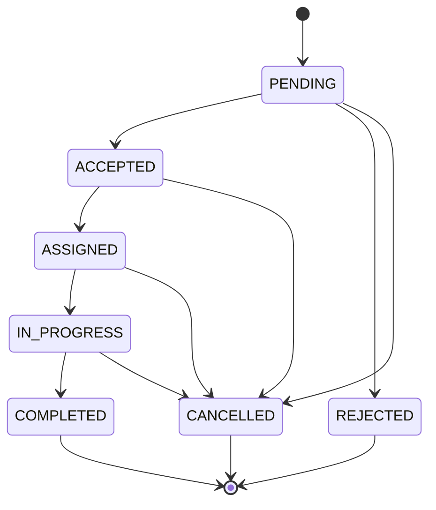

# Service request / booking — audit & implementation plan

**Project:** [Prani Doctor](https://pranidoctor.com/)  
**Scope:** Customer service requests (“bookings”), mobile customer app, admin panel, and APIs in `pranidoctor-web`.  
**Task card:** 11 — Booking / Service Request  
**Last updated:** 2026-05-09 (E2E audit — mobile + admin UI + APIs aligned; see §1.3–1.4, §14)

---

## 1. Current existing status

### 1.1 Prisma / data model (`prisma/schema.prisma`)

| Area | Status |
|------|--------|
| **`ServiceRequest`** | **Aligned with booking spec.** Prisma fields: `serviceType` (DB column `requestType`), `status` (lifecycle below), `problemOrSymptom` (`symptoms`), `description`, `preferredTime` (`preferredWindow`), `locationText` (`locationNotes`), `assignedTechnicianId` (`assignedAiTechnicianId`), `cancelReason`, plus existing `areaId`, `villageId`, `serviceCategoryId`, scheduling, emergency flags, timestamps. |
| **`ServiceRequestType` enum** | **`DOCTOR_HOME_VISIT`, `EMERGENCY_DOCTOR`, `AI_SERVICE`, `ONLINE_CONSULTATION_LATER`.** Migration renames legacy PostgreSQL enum labels. |
| **`ServiceRequestStatus` enum** | **`PENDING` (default), `ACCEPTED`, `ASSIGNED`, `IN_PROGRESS`, `COMPLETED`, `CANCELLED`, `REJECTED`.** Migration maps legacy values (`SUBMITTED`→`PENDING`, `PENDING_PAYMENT`/`DISPATCHED`→`IN_PROGRESS`/`ASSIGNED`, `NO_SHOW`→`REJECTED`). |
| **`AnimalProfile`** | **Present.** Used by `ServiceRequest.animal` with `onDelete: Restrict` (animals with requests cannot be hard-deleted). Mobile CRUD exists. |
| **`CustomerProfile`** | **Present.** `serviceRequests` relation. |
| **`DoctorProfile` / `AiTechnicianProfile`** | **Present.** `assignedRequests` relation; flags like `acceptsEmergency`, `acceptsOnlineConsultation` on doctors. |
| **`Area` / `Village`** | **Present.** `ServiceRequest` can link `areaId` (legacy) and/or `villageId` (preferred per schema comments). Unified `Area` tree + normalized `Division`→`Village` coexist. |
| **`ServiceCategory`** | **Present.** Catalog; **required** FK on every `ServiceRequest`. Seeded core slugs include `doctor-visit`, `emergency`, `ai-service`, `online-consultation` (`prisma/seed.ts`). |
| **`TreatmentCase`** | **Present** (table mapped as `TreatmentRecord`). Linked **required** to `serviceRequestId`; clinical documentation model, not the booking itself. |
| **`Notification`** | **Present.** `NotificationType` includes `REQUEST_UPDATE`; `metadataJson` can carry request ids for push/in-app later. **No code audited** that creates notifications on request changes. |

### 1.2 API routes (`src/app/api`)

| Layer | Status |
|-------|--------|
| **Mobile — service requests** | **Implemented.** `POST/GET /api/mobile/service-requests`, `GET /api/mobile/service-requests/[id]`, `POST` and `PATCH /api/mobile/service-requests/[id]/cancel`. Logic in `src/lib/mobile-service-requests/*`. |
| **Admin — service requests** | **Implemented.** `GET /api/admin/service-requests` (filters: `status`, `serviceType`, `areaId`, `limit`, `offset`), `GET /api/admin/service-requests/[id]`. Logic in `src/lib/admin-service-requests/*`. |
| **Auth patterns** | **Reusable:** `requireMobileCustomer` (`src/lib/mobile-auth/guard.ts`) for Bearer JWT, role `CUSTOMER`. `requireAdminPanelApiAccess` (`src/lib/admin-auth/api-guard.ts`) for admin session APIs. Responses: `jsonOk` / `jsonError` (`src/lib/api-response.ts`). |

### 1.3 Admin UI (`src/app/admin`)

| Item | Status |
|------|--------|
| **Nav** | **Present.** “Service requests” links to `/admin/service-requests` (`AdminDashboardShell.tsx`). |
| **List page** | **Implemented.** `/admin/service-requests` — `ServiceRequestsList` (`src/components/admin/service-requests/ServiceRequestsList.tsx`): table, pagination, filters (status, service type, area), `adminFetch` + `GET /api/admin/service-requests`. |
| **Detail page** | **Implemented.** `/admin/service-requests/[id]` — `ServiceRequestDetailPanel` (`src/components/admin/service-requests/ServiceRequestDetailPanel.tsx`), `GET /api/admin/service-requests/[id]`. |
| **Auth** | **Same as rest of admin dashboard:** `(dashboard)/layout.tsx` calls `ensureAdminDashboardAccess()`; APIs use `requireAdminPanelApiAccess()`. |

### 1.4 Mobile app (`pranidoctor_mobile`)

| Item | Status |
|------|--------|
| **Booking / request feature** | **Implemented.** Wizard, list, detail, cancel — see `pranidoctor_mobile/docs/SERVICE_REQUEST_BOOKING_PLAN.md`. |
| **Requests tab** | **`ServiceRequestsTabScreen`** in `HomeShellScreen`; FAB → `BookingWizardScreen` (`/booking/new`). |
| **Animals** | **Implemented** — wizard step 1 selects owned `animalId`. |
| **Provider finder** | **Implemented** (orthogonal to submit flow). |
| **Router** | **`/booking/new`**, **`/service-requests/:requestId`** (`router.dart`). |

### 1.5 Application code vs generated client

- **Service request** flows use `prisma.serviceRequest` from `src/lib/mobile-service-requests/service-request-service.ts` and `src/lib/admin-service-requests/service-request-admin-service.ts`. Apply migration `20260509120000_service_request_booking_enums_fields` before deploying.

---

## 2. Missing pieces

1. ~~**Product enums vs schema enums**~~ — **Resolved in Prisma + SQL migration** (§13).
2. ~~**Mobile REST API**~~ — **Done** (create, list, detail, cancel).
3. ~~**Admin REST API**~~ — **Done** (list + detail, filters).
4. **Validation & business rules** — Core rules in Zod + services; extend per-type location rules as product tightens.
5. ~~**Admin UI**~~ — **Done (MVP):** list + detail pages wired to admin APIs (`ServiceRequestsList`, `ServiceRequestDetailPanel`). Later: assign provider, status actions, treatment/billing links.
6. ~~**Mobile UI**~~ — **Done (MVP):** `BookingWizardScreen`, tab list, detail + cancel in Flutter (see mobile plan doc). **Gaps:** village/area picker, scheduled datetime pickers, push on status change.
7. **Notifications (optional follow-up)** — persist `Notification` rows on status changes (not blocking MVP read API).
8. **Treatment / billing coupling** — `TreatmentCase` expects `serviceRequestId`; booking completion flow should define when a `TreatmentCase` is created (likely **after** accept/assign, not at customer submit — document in phases).

---

## 3. Final booking flow (target UX)

**Customer (mobile)**

1. **Select animal** — from owned, active profiles (`GET /api/mobile/animals`).
2. **Select service type** — maps to **`ServiceRequestType`** (product/API names below); drive copy and which fields are shown (e.g. home visit vs online).
3. **Select problem / symptom** — structured (chips/tags) and/or free text; persist to `symptoms` (and optional future normalized table).
4. **Description** — free-text details; map to new field **`description`** (recommended) or combine with `symptoms` / `locationNotes` per §4.
5. **Area / location** — pick geography: prefer **`villageId`** (and/or `areaId` if product uses unified tree only); **`locationNotes`** for address / landmarks.
6. **Preferred time** — `preferredWindow` (human-readable) and/or `scheduledStart`/`scheduledEnd` once scheduling rules exist.
7. **Submit** — `POST` create → returns request id + initial status.
8. **Track status** — list + detail screen polling or pull-to-refresh.

**Admin**

1. **Request queue** — filter by status, type, date, area.
2. **Request detail** — customer, animal, category, location, timeline; actions (assign provider, advance status, reject/cancel) in later phases.

**Operational note:** Assignment to a specific doctor/technician may be manual (admin) or automatic (future); schema already supports `assignedDoctorId` / `assignedAiTechnicianId`.

---

## 4. Data model changes (if needed)

### 4.1 Request types (required by task)

| Product / API name | Current Prisma `ServiceRequestType` | Recommendation |
|--------------------|-------------------------------------|----------------|
| `DOCTOR_HOME_VISIT` | `DOCTOR_VISIT` | **Rename enum value** in Prisma (migration) **or** expose only API alias: API `DOCTOR_HOME_VISIT` ↔ DB `DOCTOR_VISIT`. |
| `EMERGENCY_DOCTOR` | `EMERGENCY` | Same pattern (rename or map). Keep `isEmergency` boolean for dispatch rules if still useful. |
| `AI_SERVICE` | `AI_SERVICE` | **Align** (name already matches). |
| `ONLINE_CONSULTATION_LATER` | `ONLINE_CONSULTATION` | **Rename or map** — “later” is scheduling intent; can be expressed via `preferredWindow` / `scheduledStart` without a separate enum if product agrees. |

### 4.2 Request statuses (required by task)

| Product / API status | Current Prisma `ServiceRequestStatus` | Notes |
|----------------------|----------------------------------------|-------|
| `PENDING` | `SUBMITTED` | **Map or rename** — same meaning for “customer submitted, not yet accepted.” |
| `ACCEPTED` | *(none)* | **Add** or map from an existing value (e.g. interim use of `DISPATCHED`) — **avoid overloading** ambiguous states. |
| `ASSIGNED` | `ASSIGNED` | Align. |
| `IN_PROGRESS` | `IN_PROGRESS` | Align. |
| `COMPLETED` | `COMPLETED` | Align. |
| `CANCELLED` | `CANCELLED` | Align. |
| `REJECTED` | *(none)* | **Add** (platform/admin/doctor declines before assignment). |

**Existing extra DB statuses:** `PENDING_PAYMENT`, `DISPATCHED`, `NO_SHOW` — either **retain** for billing/ops and expose only internally, or **deprecate** via migration after data backfill. Recommendation: **keep** in DB for backward compatibility until billing flows are unified; public mobile API can expose a simplified subset.

### 4.3 Optional scalar additions

| Field | Rationale |
|-------|-----------|
| `description String?` | Clear separation from `symptoms` (task asks for both). |
| `rejectionReason String?` | When status is `REJECTED`. |
| `acceptedAt DateTime?` | If `ACCEPTED` is distinct from assignment. |

### 4.4 Indexes / constraints

- Existing indexes on `status`, `customerId`, `requestType` are a good base.
- Add composite indexes if admin list filters become hot (e.g. `[status, submittedAt]`).

### 4.5 `serviceCategoryId` vs `requestType`

- Today both exist; **validation** should enforce consistency (e.g. `AI_SERVICE` type ↔ category slug `ai-service` or allowed set). Avoid contradictory pairs at create time.

---

## 5. API endpoints (planned)

**Conventions:** Same envelopes as existing mobile/admin APIs: `{ ok: true, data }` / `{ ok: false, error }`.

### 5.1 Mobile (customer, Bearer JWT)

| Method | Path | Purpose |
|--------|------|---------|
| `POST` | `/api/mobile/service-requests` | **Create request** — body: `animalId`, `requestType`, `serviceCategoryId`, optional `villageId`/`areaId`, `symptoms`, `description` (if added), `preferredWindow`, `scheduledStart`/`scheduledEnd`, `locationNotes`, `isEmergency`, `emergencyNotes`. |
| `GET` | `/api/mobile/service-requests` | **List my requests** — query: `status`, `cursor`/`page`, `limit`. Scope: `customerId` from session. |
| `GET` | `/api/mobile/service-requests/[id]` | **Request detail** — enforce ownership. |
| `POST` or `PATCH` | `/api/mobile/service-requests/[id]/cancel` | **Cancel** — idempotent; allowed only from safe states (e.g. `PENDING`/`ACCEPTED`, not `COMPLETED`). |

**Reuse (no new endpoints required for MVP if clients call existing):**

- Animals: `/api/mobile/animals*`
- Service categories catalog: consider **read-only** `GET /api/mobile/service-categories` if mobile should not hardcode slugs (admin already has `GET /api/admin/service-categories`).

### 5.2 Admin (session cookie)

| Method | Path | Purpose |
|--------|------|---------|
| `GET` | `/api/admin/service-requests` | **List** — filters: status, type, date range, `customerId`, `villageId`, search. |
| `GET` | `/api/admin/service-requests/[id]` | **Detail** — include customer, animal, category, assignment, timeline. |

**Later (out of minimal card but schema-ready):** assign doctor/technician, patch status, internal notes.

---

## 6. Mobile screens (planned)

| Screen | Responsibility |
|--------|----------------|
| **Animal picker** | List/select owned animal (reuse animals providers). |
| **Service type** | Four types per §4.1; show/hide fields. |
| **Problem / symptom** | Chips + text → `symptoms`. |
| **Description** | Long text → `description` or `symptoms` per decision. |
| **Location** | Village/area picker (depends on existing public geography API — if missing, plan `GET /api/mobile/areas` or reuse documented hierarchy from area system plan). |
| **Preferred time** | `preferredWindow` and/or datetime. |
| **Review & submit** | Summary + `POST` create. |
| **My requests list** | Cards with status badge, submitted time. |
| **Request detail / status** | Full timeline, cancel CTA if allowed. |

**Navigation:** Extend `go_router` with paths under e.g. `/home/requests`, `/home/requests/new`, `/home/requests/:id`; replace `_RequestsPlaceholderTab` with list or nested navigator.

---

## 7. Admin screens

| Page | Responsibility |
|------|----------------|
| **`/admin/service-requests`** | **Shipped (read-only queue).** Short id, customer name + phone/email, animal name/species/type, service type, problem snippet, area/location, preferred time, status, created; filters (status, type, area); View → detail. |
| **`/admin/service-requests/[id]`** | **Shipped (read-only).** Customer, animal, category, service type, problem, description, location ids + notes, preferred time, status, assigned doctor/technician, submitted + created/updated. **Follow-up:** related billing/treatment links when product defines URLs. |

Patterns match doctors list/detail: client components, `adminFetch` + `readAdminJson`, dashboard layout guard.

---

## 8. Validation rules (draft)

**Create (mobile)**

- **Auth:** `requireMobileCustomer`.
- **`animalId`:** Must belong to `customerProfileId` and `active === true`.
- **`serviceCategoryId`:** Must exist; should match allowed categories for `requestType` (config table or allow-list).
- **Location:** Define per type — e.g. home visit / emergency field visit require `villageId` or `areaId` + `locationNotes` minimum length; online consultation may omit village.
- **Emergency:** If `requestType === EMERGENCY_DOCTOR` or `isEmergency === true`, require `emergencyNotes` or `symptoms` (product decision).
- **Scheduling:** If using `ONLINE_CONSULTATION_LATER`, require `preferredWindow` or `scheduledStart`.
- **Rate limiting / abuse:** Consider per-customer daily cap (future).

**Cancel (mobile)**

- Only owner; status in cancellable set; set `cancelledAt`, status `CANCELLED`.

**Admin list/detail**

- `requireAdminPanelApiAccess`; no customer ownership check on list.

---

## 9. Status lifecycle

**Target lifecycle (product):**

**Mapping from current DB (until migrated):**

- `SUBMITTED` → treat as **`PENDING`** in API DTOs.
- Introduce **`ACCEPTED`** / **`REJECTED`** in DB or emulate (not recommended long-term).
- `PENDING_PAYMENT` / `DISPATCHED` / `NO_SHOW` — document transitions for internal/billing; hide or map in customer app.

**Suggested transition guards**

| Transition | Who | Precondition |
|------------|-----|--------------|
| → `ACCEPTED` | Admin or system | Was `PENDING` |
| → `REJECTED` | Admin / doctor policy | Was `PENDING` |
| → `ASSIGNED` | Admin / dispatch | Was `ACCEPTED`; set assignee fields |
| → `IN_PROGRESS` | Assigned provider or admin | Was `ASSIGNED` |
| → `COMPLETED` | Provider or admin | Was `IN_PROGRESS` |
| → `CANCELLED` | Customer (rules) / admin | Not terminal |

---

## 10. Testing checklist

Code-level mapping for Task Card 11 scenarios: **§14**. Use the rows below for **manual / QA** sign-off.

**API**

- [ ] Create request: happy path per type; 422 on invalid category/type/location.
- [ ] Create: 403/404 when `animalId` not owned.
- [ ] List: only current customer’s rows; pagination stable ordering (`submittedAt desc`).
- [ ] Detail: 404 other customer’s id.
- [ ] Cancel: allowed/blocked by status; sets `cancelledAt`.
- [ ] Admin list: auth required; filters return expected subsets.
- [ ] Admin detail: includes nested relations without leaking unrelated PII.

**Mobile**

- [ ] Wizard validation and back-stack behavior.
- [ ] Offline/error handling for `dio` failures.
- [ ] Status labels match API (including mapped enums).

**Admin**

- [ ] Table loads, empty state, error state.
- [ ] Detail deep link from list.

**DB / migration**

- [ ] If enums change: migration + backfill script; verify existing `ServiceRequest` rows.

---

## 11. Implementation phases

| Phase | Goal | Deliverables |
|-------|------|--------------|
| **0 — Decision** | Lock enum strategy | ADR or section sign-off: full Prisma enum migration vs API mapping layer; treatment of legacy statuses. |
| **1 — Schema** | Align model with product | **Done:** enums, `description`, `cancelReason`, Prisma field renames with `@map` on legacy columns; migration `prisma/migrations/20260509120000_service_request_booking_enums_fields`. |
| **2 — Mobile API** | Customer CRUD slice | **Done:** routes under `src/app/api/mobile/service-requests/`. |
| **3 — Admin API** | Operate queue | **Done:** routes under `src/app/api/admin/service-requests/`. |
| **4 — Admin UI** | Replace placeholders | **Done:** list + detail (`ServiceRequestsList`, `ServiceRequestDetailPanel`). |
| **5 — Mobile UI** | End-to-end booking | **Done:** wizard + tab list + detail/cancel. |
| **6 — Hardening** | Notifications, assignments | `Notification` on transitions; assign endpoints; integration tests. |

---

## 12. References in repo

- Prisma: `prisma/schema.prisma` — `ServiceRequest`, enums, `TreatmentCase` (`@@map("TreatmentRecord")`).
- Mobile auth guard: `src/lib/mobile-auth/guard.ts`.
- Admin API guard: `src/lib/admin-auth/api-guard.ts`.
- Seed categories: `prisma/seed.ts` (`doctor-visit`, `emergency`, `ai-service`, `online-consultation`).
- Mobile service requests: `src/lib/mobile-service-requests/`, `src/app/api/mobile/service-requests/`.
- Admin service requests: `src/lib/admin-service-requests/`, `src/app/api/admin/service-requests/`.
- Migration: `prisma/migrations/20260509120000_service_request_booking_enums_fields/migration.sql`.
- Mobile animals (precedent): `src/app/api/mobile/animals/route.ts`.
- Admin service request UI: `src/app/admin/(dashboard)/service-requests/`, `src/components/admin/service-requests/`.
- Mobile feature: `pranidoctor_mobile/lib/src/features/service_requests/`.

---

## 13. Backend implementation status (Task Card 11 — API)

**Applied:** Prisma schema + SQL migration + Next.js route handlers.

- **DB:** Run `npx prisma migrate deploy` (or `prisma migrate dev`) so enum and column changes apply. `npx prisma generate` refreshes `src/generated/prisma`.
- **Create (`POST /api/mobile/service-requests`):** Requires `animalId` (owned, `active`), `serviceCategoryId` whose **slug** matches `serviceType` (`doctor-visit`, `emergency`, `ai-service`, `online-consultation`), `problemOrSymptom`, and conditional `areaId` / `villageId` / `locationText` for field visit types; `preferredTime` required for `ONLINE_CONSULTATION_LATER`. Sets `isEmergency` when type is `EMERGENCY_DOCTOR`. Initial `status`: `PENDING`.
- **Cancel:** Customer-only; allowed for `PENDING`, `ACCEPTED`, `ASSIGNED`; blocked for `COMPLETED`, `CANCELLED`, and other statuses (409 `INVALID_STATE`).
- **Admin list filters:** `status`, `serviceType`, `areaId`, pagination `limit`/`offset`.

---

*§1.1–1.4 and §11 updated after full-stack delivery; automated checks: web `npm run lint` / `typecheck` / `build` / `prisma validate`; mobile `flutter analyze` / `flutter test`.*

---

## 14. E2E verification (code audit — Task Card 11)

The scenarios below were **verified against implementation** (not a live device run on this pass). Use as a manual QA script.

| # | Scenario | Implementation |
|---|----------|----------------|
| 1 | Customer creates with animal, type, problem, description, location, preferred time | `POST /api/mobile/service-requests` + Zod `createServiceRequestBodySchema`; mobile `BookingWizardScreen` builds body; category resolved by slug. |
| 2 | Customer lists own requests | `listServiceRequestsForCustomer` scopes `customerId`; `GET` mobile route uses `requireMobileCustomer`. |
| 3 | Customer opens detail | `GET .../[id]` + `getServiceRequestForCustomer` (same scope). |
| 4 | Customer cancels allowed request | `CUSTOMER_CANCELLABLE_STATUSES` + `cancelServiceRequestForCustomer`; mobile `PATCH .../cancel`; UI shows cancel only when `canCustomerCancel` (PENDING / ACCEPTED / ASSIGNED). |
| 5 | Cannot view another customer’s request | `findFirst` with `customerId` → 404 `NOT_FOUND`. |
| 6 | Cannot cancel completed / cancelled (and other non-cancellable) | Explicit `COMPLETED` / `CANCELLED` + remaining statuses vs allow-list → 409 `INVALID_STATE`. |
| 7 | Admin lists requests | `GET /api/admin/service-requests` + `requireAdminPanelApiAccess`; UI `/admin/service-requests`. |
| 8 | Admin opens detail | `GET /api/admin/service-requests/[id]` + `/admin/service-requests/[id]`. |
| 9 | Statuses in mobile & admin | Same enum strings from API; mobile BN labels in `ServiceRequestStatus.labelBn`; admin English `fmtEnum`. |
| 10 | Invalid payload → safe validation error | 422 `VALIDATION_ERROR` with message + Zod `details` in envelope; mobile surfaces `error.message`. |

**Remaining product gaps (not blockers for read path):** notifications on transition; admin assign/status actions; `TreatmentCase` creation timing; automated integration tests against a running DB.
