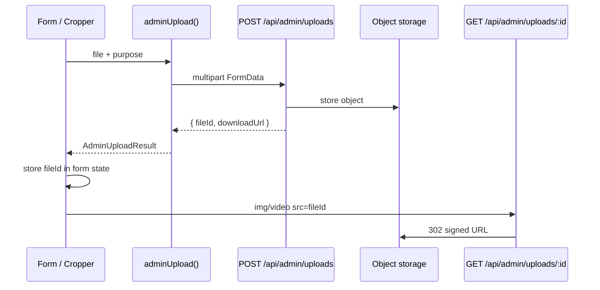

# Prani Doctor — Admin API Integration Plan

**Repositories:** `pranidoctor-web` (BFF + UI) · `pranidoctor-backend` (Express API)  
**Date:** 2026-05-22  
**Prerequisite:** [ADMIN_WEB_AUDIT.md](./ADMIN_WEB_AUDIT.md)

---

## Executive Summary

Admin APIs are served from **72 legacy handlers** in `pranidoctor-backend/src/legacy/web/routes/admin/`, mounted at `/api/admin/*` via compat-web. `pranidoctor-web` proxies **71 route files** (70 straight proxies + custom health wrapper).

**Current integration model:**

```
Client (adminFetch) ──► /api/admin/* (Next proxy) ──► BACKEND_URL/api/admin/*
Server (RSC)        ──► serverInternalJson ──► same path
```

| Layer | Today | Target (this plan) |
|-------|-------|---------------------|
| HTTP | `adminFetch` + `readAdminJson` | Typed service modules + shared client |
| Cache / sync | `useState` + `useEffect` | TanStack React Query v5 |
| Validation | Inline client checks; Zod on backend only | Shared Zod types (import from backend mirror or codegen) |
| Errors | Ad hoc `setError` strings | Central `AdminApiError` + toast + field mapping |
| Retry | `withRetry` (bootstrap only) | Query-level retry + mutation idempotency rules |
| Uploads | XHR FormData (semen templates only) | Unified `adminUpload()` helper |

**Gap summary:** ~85% of existing backend admin routes are integrated. **1 backend route** has no web proxy. **5 admin pages** have no backend APIs. **~12 sub-resource routes** exist on backend but are not called from UI (fees/availability/timeline/duplicates).

---

## Integration Architecture

### Response envelope (all admin routes)

```ts
// Success
{ ok: true, data: T }

// Failure
{ ok: false, error: { code: string; message: string; details?: unknown } }
```

### Auth model

| Mechanism | Detail |
|-----------|--------|
| Cookie | `prani_admin_token` (httpOnly JWT, 7 days) |
| Login body | `loginBodySchema`: `{ email \| identifier, password }` |
| Eligible roles | `ADMIN`, `SUPER_ADMIN` with active `AdminProfile` |
| Default guard | `requireAdminPanelApiAccess()` — all-or-nothing panel access |
| Capability guard | Service instances only — see permissions matrix below |

### Permissions matrix (service instances only)

| Capability | SUPER_ADMIN | ADMIN | SUPPORT* |
|------------|:-----------:|:-----:|:--------:|
| `serviceInstance.view` | ✅ | ✅ | ✅* |
| `serviceInstance.review` | ✅ | ✅ | ❌ |
| `serviceInstance.publish` | ✅ | ❌ | ❌ |

\*`SUPPORT` is in the registry but **cannot log in** to admin panel today (`resolveActor` rejects).

All other admin routes: **`admin.panel`** (any authenticated admin actor).

### Pagination conventions

| Pattern | Query params | Used by |
|---------|--------------|---------|
| Offset | `limit`, `offset` | doctors, technicians, areas, billing, service-requests, applications, complaints, semen lists |
| Take/skip | `take`, `skip` | tutorials (KH posts) |
| Cursor | `cursor`, `limit` | service-instances |
| Level list | `level`, `limit` | location QA reports |
| None | — | service-categories, content-categories list, location stats |

**Default page size in UI:** 20 (`PAGE_SIZE` constant in list components). Backend defaults vary (25–50).

---

## Master API Mapping Table

Columns: **Page** (admin UI) · **Route** (API path) · **Method** · **DTO** (Zod schema / type) · **Permission** · **Status** · **Missing**

Status legend: ✅ Integrated · ⚠️ Partial · ❌ Missing UI · 🚫 Missing API · 🔗 Embedded (no standalone page)

---

### Auth & shell

| Page | Route | Method | DTO | Permission | Status | Missing |
|------|-------|--------|-----|------------|--------|---------|
| `/admin/login` | `/api/admin/auth/login` | POST | `loginBodySchema` → `{ result, user }` | Public | ✅ | — |
| Shell | `/api/admin/auth/logout` | POST | — → `{ signedOut }` | Cookie | ✅ | — |
| Shell | `/api/admin/auth/me` | GET | — → `{ user }` | Cookie + actor | ✅ | — |
| — | `/api/admin/health` | GET | — → health snapshot | Public (web wraps) | ✅ | Web returns `mode: api-consumer` |

---

### Dashboard

| Page | Route | Method | DTO | Permission | Status | Missing |
|------|-------|--------|-----|------------|--------|---------|
| `/admin` | `/api/admin/dashboard/page-data` | GET | Query: `adminUserId?` → `AdminDashboardPageData` | `admin.panel` | ✅ | React Query hook; shared types file |

---

### Areas

| Page | Route | Method | DTO | Permission | Status | Missing |
|------|-------|--------|-----|------------|--------|---------|
| `/admin/areas` | `/api/admin/areas` | GET | Query: `q,type,isActive,parentId,limit,offset` → `{ areas, meta }` | `admin.panel` | ✅ | Service module |
| `/admin/areas/new` | `/api/admin/areas` | POST | `postBodySchema` → `{ area }` | `admin.panel` | ✅ | — |
| `/admin/areas/[id]/edit` | `/api/admin/areas/:id` | GET | — → `{ area }` | `admin.panel` | ✅ | — |
| `/admin/areas/[id]/edit` | `/api/admin/areas/:id` | PATCH | `patchBodySchema` → `{ area }` | `admin.panel` | ✅ | — |
| `/admin/areas` | `/api/admin/areas/:id` | DELETE | — → `{ deleted }` | `admin.panel` | ✅ | Confirm dialog pattern |

---

### Locations

| Page | Route | Method | DTO | Permission | Status | Missing |
|------|-------|--------|-----|------------|--------|---------|
| `/admin/locations` | `/api/admin/locations/stats` | GET | — → `LocationAdminStats` | `admin.panel` | ✅ | — |
| `/admin/locations` | `/api/admin/locations/import-report` | GET | — → import report JSON | `admin.panel` | ⚠️ | UI reads local file; should call API |
| `/admin/locations` | `/api/admin/locations/duplicates` | GET | `adminLocationListQuerySchema` | `admin.panel` | ❌ | No drill-down page |
| `/admin/locations/missing-coords` | `/api/admin/locations/missing-coords` | GET | `level,limit` → `{ items }` | `admin.panel` | ✅ | Migrate to `AdminTable` |
| `/admin/locations/pending-verification` | `/api/admin/locations/pending-verification` | GET | `level,limit` → `{ items }` | `admin.panel` | ✅ | Migrate to `AdminTable` |

---

### Doctors

| Page | Route | Method | DTO | Permission | Status | Missing |
|------|-------|--------|-----|------------|--------|---------|
| `/admin/doctors` | `/api/admin/doctors` | GET | `listDoctorsQuerySchema` → `{ doctors,total,limit,offset }` | `admin.panel` | ✅ | Strong types (currently `AdminDoctorListRow`) |
| `/admin/doctors/new` | `/api/admin/doctors` | POST | `createDoctorBodySchema` → `{ doctor }` | `admin.panel` | ✅ | — |
| `/admin/doctors/[id]` | `/api/admin/doctors/:id` | GET | — → `{ doctor }` serializeDoctorDetail | `admin.panel` | ✅ | — |
| `/admin/doctors/[id]/edit` | `/api/admin/doctors/:id` | PATCH | `patchDoctorBodySchema` | `admin.panel` | ✅ | — |
| `/admin/doctors` | `/api/admin/doctors/:id/{approve,reject,verify,activate,suspend}` | POST | — → `{ doctor }` | `admin.panel` | ✅ | — |
| `/admin/doctors/*/edit` | `/api/admin/doctors/:id/working-areas` | PUT | `workingAreasBodySchema` | `admin.panel` | ✅ | — |
| `/admin/doctors/*/edit` | `/api/admin/doctors/:id/service-categories` | PUT | `serviceCategoriesBodySchema` | `admin.panel` | ✅ | — |
| — | `/api/admin/doctors/:id/visit-fee` | POST | `visitFeeBodySchema` | `admin.panel` | ❌ | Backend route unused; fee may be in PATCH only |
| — | `/api/admin/doctors/:id/emergency-availability` | POST | `availabilityBodySchema` | `admin.panel` | ❌ | No UI for dedicated endpoint |
| — | `/api/admin/doctors/:id/online-consultation-availability` | POST | `onlineConsultationBodySchema` | `admin.panel` | ❌ | No UI for dedicated endpoint |

---

### AI technicians

| Page | Route | Method | DTO | Permission | Status | Missing |
|------|-------|--------|-----|------------|--------|---------|
| `/admin/ai-technicians` | `/api/admin/ai-technicians` | GET | `listTechniciansQuerySchema` | `admin.panel` | ✅ | — |
| `/admin/ai-technicians/new` | `/api/admin/ai-technicians` | POST | `createTechnicianBodySchema` | `admin.panel` | ✅ | — |
| `/admin/ai-technicians/[id]` | `/api/admin/ai-technicians/:id` | GET/PATCH | `patchTechnicianBodySchema` | `admin.panel` | ✅ | — |
| `/admin/ai-technicians` | `/api/admin/ai-technicians/:id/{approve,…}` | POST | — | `admin.panel` | ✅ | — |
| `/admin/ai-technicians/*/edit` | `…/working-areas` | PUT | `workingAreasBodySchema` | `admin.panel` | ✅ | — |
| `/admin/ai-technicians/*/edit` | `…/service-categories` | PUT | `serviceCategoriesBodySchema` | `admin.panel` | ✅ | — |
| — | `/api/admin/ai-technicians/:id/village-service-areas` | PUT | `villageServiceAreasBodySchema` | `admin.panel` | ❌ | Not wired in form |
| — | `/api/admin/ai-technicians/:id/service-fee` | POST | `serviceFeeBodySchema` | `admin.panel` | ❌ | Not wired |
| — | `/api/admin/ai-technicians/:id/emergency-availability` | POST | `availabilityBodySchema` | `admin.panel` | ❌ | Not wired |

---

### AI applications & complaints

| Page | Route | Method | DTO | Permission | Status | Missing |
|------|-------|--------|-----|------------|--------|---------|
| `/admin/ai-technicians/applications` | `/api/admin/ai-technician-applications` | GET | `listTechnicianApplicationsQuerySchema` | `admin.panel` | ✅ | — |
| `/admin/ai-technicians/applications/[id]` | `/api/admin/ai-technician-applications/:id` | GET | Application detail DTO | `admin.panel` | ✅ | — |
| `/admin/ai-technicians/applications/[id]` | `…/:id/transition` | POST | `applicationTransitionBodySchema` | `admin.panel` (actor) | ✅ | — |
| `/admin/ai-technician-complaints` | `/api/admin/ai-technician-complaints` | GET | `adminListAiTechnicianComplaintsQuerySchema` | `admin.panel` | ✅ | — |
| `/admin/ai-technician-complaints` | `…/:id/status` | POST | `adminUpdateAiTechnicianComplaintBodySchema` | `admin.panel` | ✅ | — |

---

### Enterprise service review

| Page | Route | Method | DTO | Permission | Status | Missing |
|------|-------|--------|-----|------------|--------|---------|
| `/enterprise/services/review` | `/api/admin/service-instances` | GET | `listServiceInstancesQuerySchema` (cursor) | `serviceInstance.view` | ✅ | React Query infinite scroll |
| `/enterprise/services/review` | `/api/admin/service-instances/:id` | GET | `{ instance, schema, mergedValues, mediaPreviews }` | `serviceInstance.view` | ✅ | — |
| `/enterprise/services/review` | `…/:id/status` | PATCH | `patchServiceInstanceStatusSchema` | `serviceInstance.view` | ✅ | — |
| `/enterprise/services/review` | `…/:id/review` | PATCH | `patchServiceInstanceReviewSchema` | `serviceInstance.review` | ✅ | Role-gated UI for publish |
| `/enterprise/services/review` | `…/:id/publish` | PATCH | `patchServiceInstancePublishSchema` | `serviceInstance.publish` | ✅ | SUPER_ADMIN only |

---

### Service requests

| Page | Route | Method | DTO | Permission | Status | Missing |
|------|-------|--------|-----|------------|--------|---------|
| `/admin/service-requests` | `/api/admin/service-requests` | GET | `adminListServiceRequestsQuerySchema` | `admin.panel` | ✅ | Types are `any` stubs |
| `/admin/service-requests/[id]` | `/api/admin/service-requests/:id` | GET | Service request detail | `admin.panel` | ✅ | — |
| `/admin/service-requests/[id]` | `…/:id/assign-doctor` | POST | `adminAssignDoctorBodySchema` | `admin.panel` | ✅ | — |
| `/admin/service-requests/[id]` | `…/:id/assign-technician` | POST | `adminAssignTechnicianBodySchema` | `admin.panel` | ✅ | — |
| — | `/api/admin/service-requests/:id/timeline` | GET | Timeline events | `admin.panel` | ❌ | **Backend exists; no web proxy route** |

---

### Service categories

| Page | Route | Method | DTO | Permission | Status | Missing |
|------|-------|--------|-----|------------|--------|---------|
| `/admin/service-categories` | `/api/admin/service-categories` | GET | — → `{ categories }` | `admin.panel` | ❌ | Full CRUD UI + nav link |
| `/admin/doctors/*/edit` | `/api/admin/service-categories` | GET | — | `admin.panel` | 🔗 | Embedded picker only |
| `/admin/ai-technicians/*/edit` | `/api/admin/service-categories` | GET | — | `admin.panel` | 🔗 | Embedded picker only |

---

### Semen / breeding

| Page | Route | Method | DTO | Permission | Status | Missing |
|------|-------|--------|-----|------------|--------|---------|
| `/admin/semen-providers` | `/api/admin/semen-providers` | GET/POST | `listSemenProvidersQuerySchema`, `createSemenProviderBodySchema` | `admin.panel` | ✅ | Logo upload not wired (`ADMIN_SEMEN_PROVIDER_LOGO`) |
| `/admin/semen-providers/[id]/edit` | `/api/admin/semen-providers/:id` | GET/PATCH | `patchSemenProviderBodySchema` | `admin.panel` | ✅ | — |
| `/admin/livestock-breeds` | `/api/admin/livestock-breeds` | GET/POST | `listLivestockBreedsQuerySchema`, `createLivestockBreedBodySchema` | `admin.panel` | ✅ | — |
| `/admin/livestock-breeds/[id]/edit` | `/api/admin/livestock-breeds/:id` | GET/PATCH | `patchLivestockBreedBodySchema` | `admin.panel` | ✅ | — |
| `/admin/semen-service-templates` | `/api/admin/semen-service-templates` | GET/POST | `listSemenTemplatesQuerySchema`, `createSemenServiceTemplateBodySchema` | `admin.panel` | ✅ | — |
| `/admin/semen-service-templates/[id]` | `/api/admin/semen-service-templates/:id` | GET/PATCH | `patchSemenServiceTemplateBodySchema` | `admin.panel` | ✅ | SSR via `templates-service.ts` |
| `/admin/semen-service-templates/[id]` | `…/:id/approve` | POST | `approveSemenTemplateBodySchema` | `admin.panel` | ✅ | — |
| `/admin/semen-service-templates/*/edit` | `/api/admin/uploads` | POST | multipart: `purpose`, `file` | `admin.panel` | ✅ | Extend to provider logo |

---

### Billing

| Page | Route | Method | DTO | Permission | Status | Missing |
|------|-------|--------|-----|------------|--------|---------|
| `/admin/billing` | `/api/admin/billing` | GET | `adminBillingListQuerySchema` | `admin.panel` | ✅ | Strong DTO types |
| `/admin/billing/[id]` | `/api/admin/billing/:id` | GET | Billing detail row | `admin.panel` | ✅ | — |
| `/admin/settings/billing` | `/api/admin/settings/billing` | GET/PUT | `adminBillingSettingsPutSchema` | `admin.panel` | ✅ | — |

---

### Knowledge hub

| Page | Route | Method | DTO | Permission | Status | Missing |
|------|-------|--------|-----|------------|--------|---------|
| `/admin/knowledge-hub/categories` | `/api/admin/content-categories` | GET/POST | `createContentCategoryBodySchema` | `admin.panel` | ✅ | — |
| `/admin/knowledge-hub/categories/*/edit` | `/api/admin/content-categories/:id` | GET/PATCH | `updateContentCategoryBodySchema` | `admin.panel` | ✅ | — |
| `/admin/knowledge-hub/posts` | `/api/admin/tutorials` | GET/POST | `adminListTutorialsQuerySchema`, `createTutorialBodySchema` | `admin.panel` | ✅ | take/skip vs limit/offset |
| `/admin/knowledge-hub/posts/[id]` | `/api/admin/tutorials/:id` | GET/PATCH | `updateTutorialBodySchema` | `admin.panel` | ✅ | — |
| `/admin/knowledge-hub/posts/[id]` | `…/{submit,approve,reject}` | POST | `rejectTutorialBodySchema` (reject) | `admin.panel` | ✅ | — |

---

### Notifications (cross-namespace)

| Page | Route | Method | DTO | Permission | Status | Missing |
|------|-------|--------|-----|------------|--------|---------|
| Shell / `/admin/notifications` | `/api/notifications` | GET | `limit,offset,unreadOnly` | Admin session | ✅ | Move under `/api/admin/notifications` or document shared API |
| `/admin/notifications` | `/api/notifications/:id/read` | PATCH | — | Admin session | ✅ | — |
| `/admin/notifications` | `/api/notifications/read-all` | PATCH | — | Admin session | ✅ | — |
| `/admin/notifications` | SMS logs API | GET | — | — | 🚫 | `AdminSmsLogsSection` is static empty |

---

### Dev tools

| Page | Route | Method | DTO | Permission | Status | Missing |
|------|-------|--------|-----|------------|--------|---------|
| `/admin/dev-tools/otp-logs` | `/api/admin/dev-tools/otp-logs` | GET | — → `{ otpMode, entries }` | `admin.panel` + `OTP_DEBUG_PANEL_ENABLED` | ✅ | Uses raw fetch, not `readAdminJson` |

---

### Stub pages (no backend admin API)

| Page | Route | Method | DTO | Permission | Status | Missing |
|------|-------|--------|-----|------------|--------|---------|
| `/admin/customers` | `/api/admin/customers` | — | TBD | `admin.panel` | 🚫 | **New backend module** + list/detail UI |
| `/admin/animals` | `/api/admin/animals` | — | TBD | `admin.panel` | 🚫 | **New backend module** (reference: `/api/mobile/animals`) |
| `/admin/reports` | `/api/admin/treatment-records` | — | TBD | `admin.panel` | 🚫 | **New backend module** |
| `/admin/prescriptions` | `/api/admin/prescriptions` | — | TBD | `admin.panel` | 🚫 | Reference: `/api/doctor/service-requests/:id/prescriptions` |

---

## 1. Service Layer Map

Introduce typed modules under `src/lib/admin-api/` (client-safe) and `src/lib/admin-api/server/` (RSC). Each module wraps paths, methods, and DTO types. **Do not** revive legacy `*-service.ts` Prisma files.

### Directory structure

```
src/lib/admin-api/
├── client.ts              # adminFetch + readAdminJson wrapper
├── errors.ts              # AdminApiError class
├── upload.ts              # FormData / XHR upload helper
├── query-keys.ts          # React Query key factory
├── auth.ts
├── dashboard.ts
├── areas.ts
├── locations.ts
├── doctors.ts
├── ai-technicians.ts
├── ai-applications.ts
├── ai-complaints.ts
├── service-requests.ts
├── service-instances.ts
├── service-categories.ts
├── semen-providers.ts
├── livestock-breeds.ts
├── semen-templates.ts
├── billing.ts
├── knowledge-hub.ts       # content-categories + tutorials
├── notifications.ts       # wraps /api/notifications
├── dev-tools.ts
└── server/                # serverInternalJson equivalents
    ├── dashboard.ts
    ├── locations.ts
    └── semen-templates.ts
```

### Module contract (example: `doctors.ts`)

```ts
// src/lib/admin-api/doctors.ts
import { adminFetchJson } from "./client";
import type { AdminDoctorListRow, AdminDoctorDetail } from "@/types/admin-doctors";

export const doctorsApi = {
  list: (params: ListDoctorsParams) =>
    adminFetchJson<{ doctors: AdminDoctorListRow[]; total: number; limit: number; offset: number }>(
      `/api/admin/doctors?${toSearchParams(params)}`,
    ),
  get: (id: string) =>
    adminFetchJson<{ doctor: AdminDoctorDetail }>(`/api/admin/doctors/${id}`),
  create: (body: CreateDoctorBody) =>
    adminFetchJson<{ doctor: AdminDoctorDetail }>("/api/admin/doctors", { method: "POST", body }),
  patch: (id: string, body: PatchDoctorBody) =>
    adminFetchJson<{ doctor: AdminDoctorDetail }>(`/api/admin/doctors/${id}`, { method: "PATCH", body }),
  action: (id: string, action: DoctorAction) =>
    adminFetchJson<{ doctor: AdminDoctorDetail }>(`/api/admin/doctors/${id}/${action}`, { method: "POST" }),
  setWorkingAreas: (id: string, body: WorkingAreasBody) =>
    adminFetchJson(`/api/admin/doctors/${id}/working-areas`, { method: "PUT", body }),
  setServiceCategories: (id: string, body: ServiceCategoriesBody) =>
    adminFetchJson(`/api/admin/doctors/${id}/service-categories`, { method: "PUT", body }),
};
```

### Migration mapping (current → target)

| Current | Target module | Notes |
|---------|---------------|-------|
| `adminFetch` + inline URLs in `*List.tsx` | `admin-api/{domain}.ts` | One import per component |
| `readAdminJson` | `adminFetchJson` in `client.ts` | Throws `AdminApiError` |
| `serverInternalJson` in page loaders | `admin-api/server/*.ts` | Keep server-only |
| `dashboard-stats.ts` | `admin-api/server/dashboard.ts` | Thin re-export |
| `location-master-admin-client.ts` | `admin-api/locations.ts` + server | Merge client/server |
| `templates-service.ts` | `admin-api/server/semen-templates.ts` | Keep SSR path |
| `semen-media-upload.ts` | `admin-api/upload.ts` | Generalize purposes |
| `lib/*/schemas.ts` | Re-export types from `@/types/admin-*` | Schemas stay backend-side; mirror types on web |

### New backend work → new service files

| New API (backend) | New service file |
|-------------------|------------------|
| `GET /api/admin/customers` | `admin-api/customers.ts` |
| `GET /api/admin/animals` | `admin-api/animals.ts` |
| `GET /api/admin/treatment-records` | `admin-api/treatment-records.ts` |
| `GET /api/admin/prescriptions` | `admin-api/prescriptions.ts` |
| `GET /api/admin/service-requests/:id/timeline` | Add to `service-requests.ts` + **web proxy route** |

---

## 2. React Query Plan

### Dependency

Add `@tanstack/react-query` v5 (not currently in `package.json`).

### Provider setup

```tsx
// src/app/admin/(dashboard)/providers.tsx
"use client";
import { QueryClient, QueryClientProvider } from "@tanstack/react-query";
import { useState } from "react";

export function AdminQueryProvider({ children }: { children: React.ReactNode }) {
  const [client] = useState(() => new QueryClient({
    defaultOptions: {
      queries: {
        staleTime: 30_000,
        gcTime: 5 * 60_000,
        retry: (count, err) => count < 2 && isRetryableError(err),
        refetchOnWindowFocus: true,
      },
      mutations: { retry: 0 },
    },
  }));
  return <QueryClientProvider client={client}>{children}</QueryClientProvider>;
}
```

Mount in `src/app/admin/(dashboard)/layout.tsx` inside `AdminLayoutShell`.

### Query key factory (`query-keys.ts`)

```ts
export const adminKeys = {
  all: ["admin"] as const,
  dashboard: (adminUserId?: string) => [...adminKeys.all, "dashboard", adminUserId] as const,
  doctors: {
    all: () => [...adminKeys.all, "doctors"] as const,
    list: (filters: Record<string, unknown>) => [...adminKeys.doctors.all(), "list", filters] as const,
    detail: (id: string) => [...adminKeys.doctors.all(), "detail", id] as const,
  },
  serviceInstances: {
    list: (tab: string, cursor?: string) => [...adminKeys.all, "service-instances", tab, cursor] as const,
    detail: (id: string, branch: string) => [...adminKeys.all, "service-instances", id, branch] as const,
  },
  // … mirror each admin-api module
};
```

### Hook mapping (page → hooks)

| Page / component | Hooks | Query type |
|------------------|-------|------------|
| `AdminDashboardView` | `useAdminDashboard()` | SSR prefetch + `useQuery` hydrate, or pure RSC keep |
| `DoctorsList` | `useDoctorsList(filters)` | `useQuery` + keepPreviousData |
| `DoctorProfileForm` | `useDoctor(id)`, `useAreas()`, `useServiceCategories()` | parallel queries |
| `DoctorDetailPanel` | `useDoctor(id)` + `useDoctorAction()` mutation | query + mutation |
| `ServiceInstancesReviewConsole` | `useInfiniteServiceInstances(tab)`, `useServiceInstance(id)` | **infinite query** (cursor) |
| `AreasList` | `useAreas(filters)` + `useDeleteArea()` | query + optimistic delete |
| `KnowledgeHubPostsList` | `useTutorials({ take, skip })` | offset via take/skip |
| `AdminNotificationsPanel` | `useNotifications(filters)` + mark-read mutations | invalidate on mutation |
| `AdminBillingSettingsForm` | `useBillingSettings()` + `useUpdateBillingSettings()` | query + mutation |
| Shell `AdminProfileMenu` | `useAdminMe()` | staleTime: 5 min |
| Shell `AdminNotificationsMenu` | `useUnreadNotificationCount()` | refetchInterval: 60s |

### SSR + client hybrid

Keep **server-first** for:

- `/admin` dashboard (prefetch in RSC, dehydrate optional)
- `/admin/locations` stats hub
- `/admin/semen-service-templates/[id]` detail (SEO/low TTFB)

Migrate **client lists** first (doctors, technicians, service-requests) — highest churn, most `useEffect` duplication.

### Invalidation rules

| Mutation | Invalidate |
|----------|------------|
| Doctor create/update/action | `adminKeys.doctors.list(*)`, `adminKeys.doctors.detail(id)`, `adminKeys.dashboard()` |
| Service instance review/publish | `adminKeys.serviceInstances.list(tab)`, detail |
| Area delete | `adminKeys.areas.list(*)` |
| Tutorial approve/reject | `adminKeys.tutorials.list(*)`, detail |
| Mark notification read | `adminKeys.notifications.*`, dashboard unread count |

### Pagination strategy

| API style | React Query pattern |
|-----------|---------------------|
| `limit/offset` | `useQuery` with `pageParam = offset`; `getNextPageParam` for "Load more" OR page number state |
| `take/skip` | Map UI page → `skip = page * take` |
| `cursor` | `useInfiniteQuery` with `cursor` from last page `nextCursor` |

Standardize UI on **page number + page size 20**; translate to backend params in service layer.

---

## 3. Error Handling

### Error class

```ts
// src/lib/admin-api/errors.ts
export class AdminApiError extends Error {
  constructor(
    public readonly code: string,
    message: string,
    public readonly status: number,
    public readonly details?: unknown,
  ) {
    super(message);
    this.name = "AdminApiError";
  }

  static fromResponse(status: number, body: { error?: { code?: string; message?: string; details?: unknown } }) {
    return new AdminApiError(
      body.error?.code ?? "UNKNOWN",
      body.error?.message ?? "Request failed",
      status,
      body.error?.details,
    );
  }

  get isUnauthorized() { return this.status === 401; }
  get isForbidden() { return this.status === 403; }
  get isValidation() { return this.status === 400 || this.code === "VALIDATION_ERROR"; }
  get isNotFound() { return this.status === 404; }
}
```

### Client parser (`adminFetchJson`)

Extend `readAdminJson`:

1. **401** → redirect to `/admin/login?next=` (keep current behavior)
2. **403** → throw `AdminApiError`; show "অনুমতি নেই" toast; for service instances, hide action buttons when `serviceInstance.publish` denied
3. **400 / VALIDATION_ERROR** → map `details` (Zod flatten) to form field errors
4. **404** → `AdminErrorState` with back link
5. **5xx / network** → retryable; show `AdminErrorState` with retry button

### UI error surfaces

| Context | Component | Behavior |
|---------|-----------|----------|
| List load failure | `AdminErrorState` | Retry refetches query |
| Form submit | Inline `AdminErrorState` above form | Map validation to fields |
| Mutation (action button) | `sonner` toast | Bengali message from `error.code` map |
| Shell bootstrap | `withRetry` + fallback | Keep for `useAdminMe` |

### Error code maps (extend existing)

| Domain | File | Codes |
|--------|------|-------|
| Auth | `admin-login-errors.ts` | `invalid_credentials`, `db_unavailable` |
| Service instances | `admin-api/errors/codes.ts` | `PERMISSION_DENIED`, `INVALID_TRANSITION` |
| Semen templates | same | `TEMPLATE_LOCKED`, `VALIDATION_ERROR` |
| Generic | `admin-api/errors/codes.ts` | fallback Bengali strings |

### React Query global handler

```ts
// in QueryClient meta
mutations: {
  onError: (err) => {
    if (err instanceof AdminApiError && !err.isUnauthorized) {
      toast.error(err.message);
    }
  },
},
```

---

## 4. Retry Strategy

### Tiered retry policy

| Tier | When | Policy |
|------|------|--------|
| **A — Query default** | GET lists/details | React Query: max 2 retries, exponential backoff (1s, 2s) for network/502/503/504 only |
| **B — Bootstrap** | `useAdminMe`, dashboard shell | Keep `withRetry({ retries: 2, baseDelayMs: 400 })` |
| **C — Mutations** | POST/PATCH/DELETE | **No auto-retry** (except idempotent reads) |
| **D — Uploads** | `POST /api/admin/uploads` | Manual retry button; max 1 auto-retry on network error |
| **E — Auth** | login/logout | No retry |

### Retryable detection

```ts
export function isRetryableError(err: unknown): boolean {
  if (err instanceof AdminApiError) {
    return err.status >= 502 || err.status === 0;
  }
  if (err instanceof TypeError) return true; // network
  return false;
}
```

### Non-retryable (fail fast)

- 400 validation
- 401 / 403
- 404
- 409 conflict
- Business rule errors (`INVALID_TRANSITION`, `PERMISSION_DENIED`)

### Idempotency notes

| Operation | Safe to retry? |
|-----------|--------------|
| GET any | Yes |
| POST approve/reject/transition | **No** — use mutation `isPending` guard |
| PUT working-areas | Yes (same payload) |
| POST upload (same file) | Caution — may create duplicate files; use client-side dedupe by hash |

---

## 5. Upload Strategy

### Current state

- **Only semen template media** uses `POST /api/admin/uploads` via XHR (`semen-media-upload.ts`)
- Display via `GET /api/admin/uploads/:id` (302 redirect to signed URL)
- Purposes: `ADMIN_SEMEN_TEMPLATE_COVER`, `GALLERY`, `VIDEO`, `ADMIN_SEMEN_PROVIDER_LOGO`

### Unified upload helper

```ts
// src/lib/admin-api/upload.ts
export type AdminUploadPurpose =
  | "ADMIN_SEMEN_PROVIDER_LOGO"
  | "ADMIN_SEMEN_TEMPLATE_COVER"
  | "ADMIN_SEMEN_TEMPLATE_GALLERY"
  | "ADMIN_SEMEN_TEMPLATE_VIDEO";

export type AdminUploadResult = {
  fileId: string;
  storageKey?: string;
  downloadUrl?: string;
  purpose: AdminUploadPurpose;
  mimeType?: string;
  sizeBytes?: number;
};

export function adminUpload(params: {
  file: Blob;
  fileName: string;
  purpose: AdminUploadPurpose;
  onProgress?: (pct: number) => void;
  signal?: AbortSignal;
}): Promise<AdminUploadResult>;
```

Implementation: migrate logic from `semen-media-upload.ts`; support both XHR (progress) and `fetch` (no progress).

### Upload flow



### Purpose → consumer map

| Purpose | Max type | Consumer | Status |
|---------|----------|----------|--------|
| `ADMIN_SEMEN_PROVIDER_LOGO` | image | `SemenProviderForm` | ❌ Wire upload + crop |
| `ADMIN_SEMEN_TEMPLATE_COVER` | image | `SemenTemplateMediaSection` | ✅ |
| `ADMIN_SEMEN_TEMPLATE_GALLERY` | image | `SemenTemplateMediaSection` | ✅ |
| `ADMIN_SEMEN_TEMPLATE_VIDEO` | video | `SemenTemplateMediaSection` | ✅ |
| Application docs | — | `ApplicationReviewPanel` | ✅ Display only via `GET /uploads/:id` |

### Client validation (before upload)

| Check | Rule |
|-------|------|
| MIME | Match purpose accept list (reuse `mediaKindFileAccept`) |
| Size | Enforce backend max (document in env; suggest 10MB image / 100MB video) |
| Dimensions | Optional crop step (`ImageCropperModal`) for logos/covers |

### React Query integration

```ts
export function useAdminUpload() {
  return useMutation({
    mutationFn: adminUpload,
    retry: (count, err) => count < 1 && isRetryableError(err),
    onError: (err) => toast.error(err instanceof Error ? err.message : "আপলোড ব্যর্থ"),
  });
}
```

Do **not** cache upload responses in query cache; store `fileId` in form state / mutation result only.

### Future uploads (new modules)

| Module | Purpose (proposed) | Backend work |
|--------|-------------------|--------------|
| Knowledge hub posts | `ADMIN_TUTORIAL_COVER` | Add purpose enum on backend |
| Doctor profile photo | `ADMIN_DOCTOR_AVATAR` | New purpose + route |
| Customer/animals | N/A until admin APIs exist | — |

---

## Implementation Phases

### Phase 1 — Foundation (no UI breakage)

1. Add `@tanstack/react-query`
2. Create `src/lib/admin-api/client.ts`, `errors.ts`, `query-keys.ts`
3. Add `AdminQueryProvider` to dashboard layout
4. Add web proxy for `GET /api/admin/service-requests/:id/timeline`

### Phase 2 — High-traffic modules

1. Migrate `DoctorsList`, `TechniciansList`, `ServiceRequestsList` to React Query + service modules
2. Add strong types for billing/service-request DTOs (replace `any` stubs)
3. Wire `service-categories` admin page (API exists)

### Phase 3 — Gaps & backend new APIs

1. Backend: `/api/admin/customers`, `/api/admin/animals`
2. Backend: treatment records + prescriptions admin read APIs
3. Frontend: stub pages → full modules
4. Locations duplicates page; import-report via API

### Phase 4 — Polish

1. Unified upload helper + provider logo upload
2. Wire doctor/technician fee & availability sub-routes (or document PATCH-only path)
3. Service request timeline on detail panel
4. Remove dead `lib/*-service.ts` imports; consolidate schemas/types

---

## Appendix: Backend schema file index

| Domain | Backend schema path |
|--------|----------------------|
| Auth | `modules/auth/services/panel-admin-auth.service.ts` |
| Doctors | `legacy/web/lib/admin-doctors/schemas.ts` |
| AI technicians | `legacy/web/lib/admin-ai-technicians/schemas.ts` |
| Applications | `legacy/web/lib/admin-ai-technician-applications/schemas.ts` |
| Complaints | `legacy/web/lib/mobile-ai-services/ai-quality-schemas.ts` |
| Service requests | `legacy/web/lib/admin-service-requests/schemas.ts` |
| Service instances | `legacy/web/lib/service-instances/admin-service-instance-service.ts` |
| Billing | `legacy/web/lib/admin-billing/schemas.ts` |
| Semen | `legacy/web/lib/admin-semen/schemas.ts` |
| Knowledge hub | `legacy/web/lib/knowledge-hub/schemas.ts` |
| Locations | `legacy/web/lib/locations/location-master-schemas.ts` |
| Permissions | `modules/auth/permissions.registry.ts` |

## Appendix: Proxy gap checklist

| Item | Action |
|------|--------|
| `GET /api/admin/service-requests/:id/timeline` | Add `src/app/api/admin/service-requests/[id]/timeline/route.ts` proxy |
| `GET /api/admin/health` | Keep custom web handler (intentional) |
| `/api/admin/customers`, `/api/admin/animals`, etc. | Backend implementation required first |

---

*Generated from cross-repo analysis of `pranidoctor-web` and `pranidoctor-backend`.*
