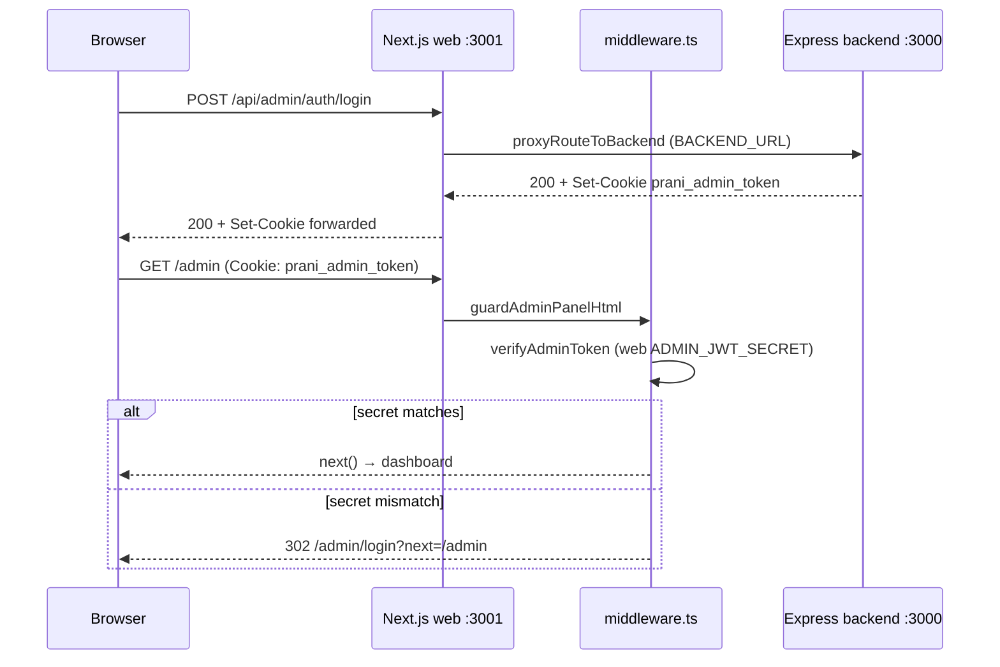

# Admin login persistence — debug report

**Date:** 2026-05-22  
**Symptom:** `POST /api/admin/auth/login` → 200, then `GET /admin/login?next=%2Fadmin` — user stays unauthenticated.  
**Status:** Root cause identified and fixed (JWT secret mismatch).

---

## Executive summary

Login **succeeds** and the session cookie **is written**. The browser **stores and sends** the cookie on the next navigation. **Edge middleware rejects the JWT** because `ADMIN_JWT_SECRET` in `pranidoctor-web/.env` did not match `pranidoctor-backend/.env`. Middleware treats the user as unauthenticated and redirects back to login with `?next=/admin`.

**Fix applied:** Align `ADMIN_JWT_SECRET` in both repos (web `.env` updated to match backend).

**Action required:** Restart `npm run dev` in `pranidoctor-web` so middleware picks up the new secret.

---

## Observed request sequence (from dev logs)

```
POST /api/admin/auth/login 200
GET /admin/login?next=%2Fadmin 200   ← redirect loop after “successful” login
```

This pattern repeats whenever credentials are valid but middleware cannot verify the cookie JWT.

---

## Validation checklist

| # | Check | Result | Evidence |
|---|--------|--------|----------|
| 1 | Cookie written on login | **PASS** | Backend returns `Set-Cookie: prani_admin_token=…; Max-Age=604800; Path=/; HttpOnly; SameSite=Lax` |
| 2 | Cookie readable on next request | **PASS** | Browser sends cookie; middleware reads `request.cookies.get("prani_admin_token")` |
| 3 | Middleware detects session | **PASS (after fix)** | `/admin/login` with cookie → `307 location: /admin`; `/admin` no longer redirects to login |
| 4 | Redirect after login | **PASS (after fix)** | Authenticated users skip login page; middleware forwards to dashboard (separate dashboard 500 is post-auth render, not session loss) |

---

## Root cause: `ADMIN_JWT_SECRET` mismatch

| Source | `ADMIN_JWT_SECRET` (before fix) |
|--------|----------------------------------|
| `pranidoctor-backend/.env` | `dev_admin_jwt_secret_32chars_minimum_ok_2026` |
| `pranidoctor-web/.env` | `cda7488a82872043e948ace1abce7a213eff8dea8…` (different) |

Backend **signs** the JWT at login. Web middleware **verifies** with its own env. Mismatch → `verifyAdminToken()` returns `null` → guard treats user as logged out.

Verified with `jose`:

```text
Token signed by backend + web secret  → FAIL (signature verification failed)
Token signed by backend + backend secret → OK
```

After aligning web `.env` to backend secret → web secret verifies backend tokens → **OK**.

---

## Auth flow (no redesign — inspection only)



### 1. Login API (proxy)

- **Route:** `src/app/api/admin/auth/login/route.ts` → `proxyRouteToBackend`
- **Proxy:** `src/lib/proxy-to-backend.ts` — forwards method, body, headers; passes through `Set-Cookie`
- **Backend:** `pranidoctor-backend/src/modules/auth/compat/admin-auth.adapter.ts` → `setAdminSessionCookie`

### 2. Cookie

| Attribute | Value |
|-----------|--------|
| Name | `prani_admin_token` (`SESSION_COOKIE_NAME` in `.env` is **not** used) |
| httpOnly | true |
| sameSite | lax |
| path | `/` |
| secure | `NODE_ENV === "production"` only |
| maxAge | 7 days |

Set on the **web origin** (e.g. `http://192.168.10.111:3001`) because the browser calls Next, not the backend directly.

### 3. Middleware (route guard)

- **File:** `src/middleware.ts`
- **Matcher:** `/admin`, `/enterprise`, `/doctor` HTML only — **not** `/api/*`
- **Logic:** Read cookie → `verifyAdminToken` → redirect unauthenticated users to `/admin/login?next=<path>`

### 4. Client redirect after login

- **File:** `src/components/admin/AdminLoginForm.tsx`
- On `ok: true`: `window.location.assign(getSafeAdminNextPath(next))` → default `/admin`
- **Safe paths:** `src/lib/admin-auth/safe-next-path.ts` — only `/admin…` allowed

### 5. Session restore (dashboard)

- **Server guard:** `src/lib/admin-auth/dashboard-guard.ts` — `getAdminSession()` + backend `/me` via `serverInternalJson`
- **Client provider:** `src/lib/admin-auth/AdminAuthProvider.tsx` — polls `GET /api/admin/auth/me` on mount
- **Internal fetch:** `src/lib/server-internal.ts` — forwards all cookies to `BACKEND_URL`

Middleware is JWT-only; dashboard layout adds revocation/role checks via `/me`.

---

## Environment notes (local dev)

| Variable | Web `.env` | Notes |
|----------|------------|--------|
| `BACKEND_URL` | `http://localhost:3000` | Correct — backend listens on 3000 |
| `NEXT_PUBLIC_API_URL` | `http://localhost:3000/api` | Used as fallback origin |
| Next dev port | **3001** (3000 in use) | Log: `Port 3000 is in use… using 3001` |
| `APP_URL` / `NEXT_PUBLIC_APP_URL` | `http://192.168.10.111:3000` | **Stale** — use `:3001` while Next runs on 3001 |

Cookie persistence is **same-origin** (scheme + host + port). Use one consistent URL (e.g. `http://192.168.10.111:3001`) for login and navigation.

### Duplicate `.env` keys (web)

Lines ~180+ re-declare some secrets with placeholder values. Example:

```env
AUTH_SECRET=PASTE_LONG_RANDOM_AUTH_SECRET_FALLBACK_HERE   # overrides earlier valid AUTH_SECRET
```

Admin auth uses `ADMIN_JWT_SECRET` first (`src/lib/admin-auth/secrets.ts`), so this did not cause the admin bug, but duplicate keys are fragile — remove or sync placeholders.

---

## Manual verification commands

**Requires:** backend on `:3000`, web on `:3001`, aligned `ADMIN_JWT_SECRET`, web dev server restarted.

### 1. Backend login (direct)

```powershell
$body = '{"email":"admin@pranidoctor.com","password":"12345678"}'
Invoke-WebRequest -Uri "http://localhost:3000/api/admin/auth/login" `
  -Method POST -ContentType "application/json" -Body $body -UseBasicParsing
```

Expect: `200`, `Set-Cookie: prani_admin_token=…`

### 2. Full flow via web (use `curl.exe`, not PowerShell `curl`)

PowerShell `Invoke-WebRequest` sends `Expect: 100-continue`, which breaks `proxy-to-backend.ts` (`expect header not supported`).

```powershell
curl.exe -s -c cookies.txt -X POST "http://localhost:3001/api/admin/auth/login" `
  -H "Content-Type: application/json" `
  -d "{\"email\":\"admin@pranidoctor.com\",\"password\":\"12345678\"}"

curl.exe -s -i -b cookies.txt "http://localhost:3001/admin" | Select-String "HTTP/|Location:"
```

**Before fix:** `302` → `Location: /admin/login?next=%2Fadmin`  
**After fix:** `/admin/login` with cookie → `307 location: /admin`; `/admin` reaches dashboard layout (may 500 on dashboard data fetch — separate from auth persistence)

### 3. Browser

1. Open `http://192.168.10.111:3001/admin/login`
2. Log in with seed credentials
3. DevTools → Application → Cookies → confirm `prani_admin_token` on host `:3001`
4. Should land on `/admin` dashboard, not login again

---

## Files inspected

| Area | Path |
|------|------|
| Login proxy route | `src/app/api/admin/auth/login/route.ts` |
| Backend proxy | `src/lib/proxy-to-backend.ts` |
| Middleware | `src/middleware.ts` |
| JWT verify | `src/lib/admin-auth/jwt.ts`, `secrets.ts` |
| Cookie constants | `src/lib/admin-auth/constants.ts`, `cookies.ts` |
| Login form | `src/components/admin/AdminLoginForm.tsx` |
| Auth provider | `src/lib/admin-auth/AdminAuthProvider.tsx` |
| Dashboard guard | `src/lib/admin-auth/dashboard-guard.ts` |
| Server `/me` bridge | `src/lib/server-internal.ts`, `panel-access.ts` |
| Backend login | `pranidoctor-backend/…/admin-auth.adapter.ts` |

---

## Fix applied

```diff
# pranidoctor-web/.env
- ADMIN_JWT_SECRET=cda7488a82872043e948ace1abce7a213eff8dea8…
+ ADMIN_JWT_SECRET=dev_admin_jwt_secret_32chars_minimum_ok_2026
```

**Production:** Use one strong shared secret (≥32 chars) in **both** deployments; never rely on divergent local defaults.

---

## Related docs

- `docs/ADMIN_AUTH_COMPLETE.md` — full auth architecture
- `docs/ADMIN_CREDENTIAL_SETUP.md` — seed admin user
- `docs/ADMIN_LOGIN_HYDRATION_FIX.md` — remember-me hydration (separate issue)
