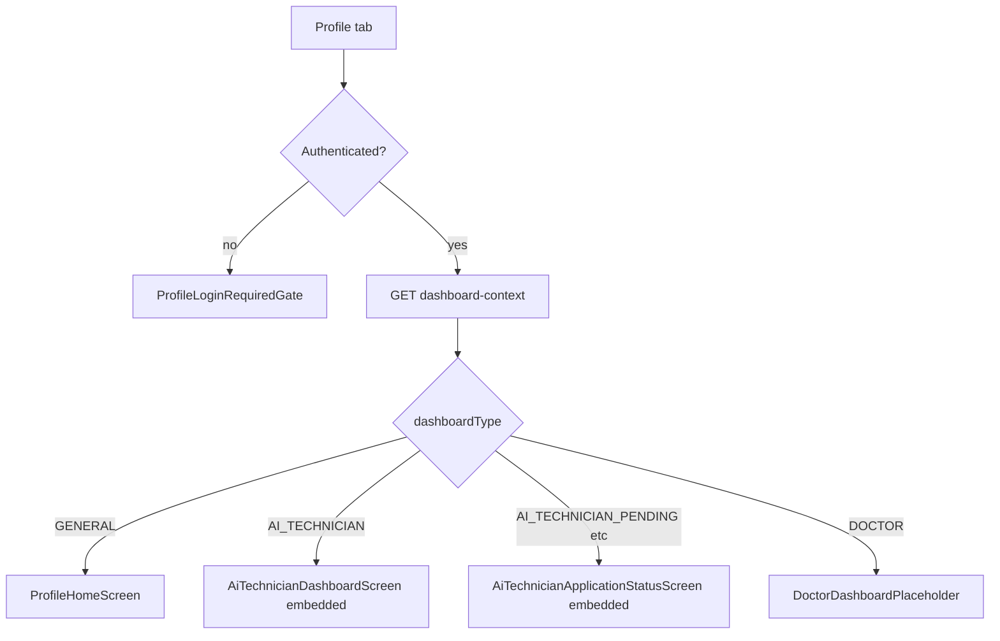

# AI Technician / Profile tab — dashboard routing flow

This document describes the **role-based Profile tab** routing for the Prani Doctor Flutter app and Next.js backend (AI Technician first; Doctor placeholder).

## Current files (reference)

### Flutter (`pranidoctor_mobile`)

| Area | Path |
|------|------|
| Bottom shell tab 4 | `lib/src/features/home/home_shell_screen.dart` |
| Profile hub | `lib/src/features/profile/presentation/profile_home_screen.dart` |
| Profile gate (entry) | `lib/src/features/profile/presentation/profile_gate_screen.dart` |
| Login gate widget | `lib/src/features/profile/presentation/widgets/profile_login_required_gate.dart` |
| `GET /api/mobile/me` | `lib/src/features/profile/application/profile_providers.dart`, `lib/src/features/profile/data/mobile_user_repository.dart` |
| Session | `lib/src/features/session/application/session_notifier.dart` |
| Dio 401/403 logout | `lib/src/core/network/dio_provider.dart` |
| AI dashboard / status / form | `lib/src/features/ai_technician_application/presentation/ai_technician_dashboard_screen.dart`, `ai_technician_application_status_screen.dart`, `ai_technician_application_form_screen.dart` |
| AI entry resolver | `lib/src/features/ai_technician_application/presentation/ai_technician_application_entry_screen.dart` |
| AI repository | `lib/src/features/ai_technician_application/data/ai_technician_repository.dart` |

### Backend (`pranidoctor-web`)

| Area | Path |
|------|------|
| Customer-only `GET /api/mobile/me` | `src/app/api/mobile/me/route.ts`, `src/lib/mobile-auth/guard.ts` |
| Profile dashboard context | `src/app/api/mobile/profile/dashboard-context/route.ts` |
| Composition + mapping | `src/lib/mobile-profile/dashboard-context-service.ts`, `src/lib/mobile-profile/map-dashboard-type.ts` |
| Dashboard guard (JWT + roles) | `src/lib/mobile-profile/profile-dashboard-guard.ts` |
| AI module guard (reference) | `src/lib/mobile-ai-technician/mobile-module-guard.ts` |
| AI dashboard aggregates | `src/lib/mobile-ai-technician/dashboard-service.ts` (`getMobileTechnicianDashboard`) |
| AI profile serialize | `src/lib/mobile-ai-technician/application-service.ts` (`serializeTechnicianProfile`, `getTechnicianProfileForUser`) |
| Prisma `AiTechnicianStatus` | `prisma/schema.prisma` |

## Problems addressed

1. **`GET /api/mobile/me` is customer-only** (`UserRole.CUSTOMER`). Users promoted to **`AI_TECHNICIAN`** receive **403**, so `mobileUserProvider` falls back to guest UI on the Profile tab.
2. The Profile tab always showed **`ProfileHomeScreen`** for authenticated users; AI technicians had to open **“এআই টেকনিশিয়ান”** to reach dashboard/status.
3. No single mobile response described **which root screen** the Profile tab should show.

## Target routing flow

1. **Not logged in** → `ProfileLoginRequiredGate` → existing OTP login intent (`shellTab: profile`).
2. **Logged in** → `GET /api/mobile/profile/dashboard-context` (Bearer JWT, same mobile audience as other mobile APIs).
3. Server returns `dashboardType` + `user` + optional `aiTechnician` summary.
4. Flutter **`ProfileGateScreen`** switches:
   - `GENERAL` → `ProfileHomeScreen` (unchanged hub).
   - `AI_TECHNICIAN` → `AiTechnicianDashboardScreen(embedded: true)` (hides back; refresh also invalidates dashboard context when needed).
   - `AI_TECHNICIAN_PENDING` | `AI_TECHNICIAN_REJECTED` | `AI_TECHNICIAN_SUSPENDED` → `AiTechnicianApplicationStatusScreen(embedded: true)` (hides back / “ফিরে যান” when embedded).
   - `DOCTOR` → `DoctorDashboardPlaceholder` (“ডাক্তার ড্যাশবোর্ড শীঘ্রই আসছে”).
5. **401** → existing Dio interceptor clears session; gate shows login.
6. **Logout** → session cleared; `profileDashboardContextProvider` refetches on next visit; no stale dashboard.



## Backend API contract

**`GET /api/mobile/profile/dashboard-context`**

- **Auth:** `Authorization: Bearer <mobile JWT>` (same HS256 mobile customer token; DB role may be `CUSTOMER`, `AI_TECHNICIAN`, or `DOCTOR` with profile).
- **Response:** `{ ok: true, data: { ... } }` per `jsonOk` (`src/lib/api-response.ts`).

**`data` shape**

| Field | Type | Notes |
|-------|------|--------|
| `dashboardType` | string enum | See mapping below |
| `user` | object | `id`, `name`, `phone`, `email`, `avatarUrl` (nullable) |
| `aiTechnician` | object \| null | Non-null when user has `AiTechnicianProfile` |
| `doctor` | null | Reserved |

**`dashboardType` values**

| Value | Condition |
|-------|-----------|
| `GENERAL` | No AI profile (typical customer), and not doctor dashboard |
| `AI_TECHNICIAN` | `AiTechnicianProfile.status` ∈ `APPROVED`, `PUBLISHED` |
| `AI_TECHNICIAN_PENDING` | `DRAFT`, `SUBMITTED`, `UNDER_REVIEW`, `NEEDS_CORRECTION` |
| `AI_TECHNICIAN_REJECTED` | `REJECTED` |
| `AI_TECHNICIAN_SUSPENDED` | `SUSPENDED` |
| `DOCTOR` | `User.role === DOCTOR` and `DoctorProfile` exists |

**`aiTechnician` object** (when profile exists)

- `id`, `status`, `displayName`, `serviceAreas` (string labels from division coverage).
- `todayRequestCount`, `pendingRequestCount`, `completedServiceCount`, `rating: { average, count }`.
- **Safety:** counts and merged rating are computed **only** when `dashboardType === AI_TECHNICIAN`. Otherwise numeric fields are **0** and `rating.average` is **null**, `rating.count` is **0** (no job aggregates for non-approved technicians).

## Frontend changes (summary)

- **`ProfileGateScreen`**: auth check → `profileDashboardContextProvider` → branch UI + loading/error.
- **`ProfileDashboardRepository`**: typed parse of `data` envelope.
- **`ProfileHomeScreen`**: refresh also invalidates `profileDashboardContextProvider` so pull-to-refresh updates gate state after role changes.
- **`AiTechnicianDashboardScreen` / `AiTechnicianApplicationStatusScreen`**: `embedded` hides AppBar back; status hides “ফিরে যান” when embedded; dashboard `_refresh` invalidates dashboard context when embedded.
- **`HomeShellScreen`**: tab 4 → `ProfileGateScreen`.

## Safety rules

- No dashboard aggregates for pending / rejected / suspended (per above).
- No fake “approved” flags in the client; routing follows server `dashboardType`.
- Rejected/suspended users see **status / correction** UI only, not the operational dashboard.
- Unknown future `dashboardType` strings: Flutter maps to **general** defensively.

## Test checklist

1. Logged-out → Profile → login gate; no dashboard-context call.
2. General customer → `GENERAL` → `ProfileHomeScreen`.
3. Approved AI technician → `AI_TECHNICIAN` → embedded dashboard; counts match DB.
4. Pending states → `AI_TECHNICIAN_PENDING` → status screen; editable → form CTA from status body.
5. Rejected / suspended → respective types → status only; no full dashboard data in payload.
6. Expired token → 401 → logout interceptor → login gate.
7. Deep link `/profile/ai-technician/entry` still works (unchanged resolver).
8. `flutter analyze` clean.
9. `npm run typecheck`, `npm run lint`, `npm run test` clean.

## Commands

**Backend**

```bash
cd pranidoctor-web
npm run typecheck
npm run lint
npm run test
```

**Flutter**

```bash
cd pranidoctor_mobile
flutter analyze
flutter run --dart-define=API_BASE_URL=... --dart-define=APP_ENV=...
```

No Prisma migration required for this feature set.
