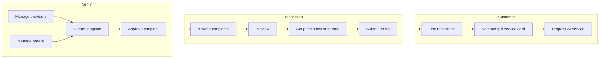

# AI Technician — Semen Service Template System (Planning)

**Project:** Prani Doctor / Animal Doctors (`pranidoctor-web` + `pranidoctor_mobile`)  
**Scope:** Planning only — no implementation in this document.  
**Last updated:** 2026-05-11  

---

## Executive summary

Bangladesh AI Technicians need **admin-authored, reusable semen service templates** so technicians can publish professional listings without writing full copy or breed/provider metadata. Technicians **select a template**, set **price, offers, stock, availability, area, fees, and personal notes**, while **provider, breed composition, semen type, canonical descriptions, warnings, and default media** stay **admin-controlled**.

This plan maps the feature to **existing Prisma models, mobile/admin APIs, geography, uploads, and the native `AiServiceRequest` / `AiTechnicianReview` flows**, proposes **additive** schema and APIs, and sequences work so **current technician onboarding and dashboards are not broken**.

---

## 1. Current codebase findings

### 1.1 Backend (`pranidoctor-web`)

| Area | Finding |
|------|---------|
| **AI technician profile** | `AiTechnicianProfile` (`prisma/schema.prisma`) — identity, geo (legacy text + optional `districtId` / `upazilaId` / `unionId`), `serviceFeeBdt`, `acceptsEmergency`, `metadataJson`, lifecycle `AiTechnicianStatus`, `ProviderStatus`. |
| **Technician “gig” services** | `AiTechnicianService` — `title`, `animalType`, `breedOrSemenType`, `description`, `basePrice`, `visitFee`, `emergencyFee`, `repeatServicePolicy`, `followUpIncluded`, `status` (`AiTechnicianServiceStatus`: DRAFT, PENDING_REVIEW, ACTIVE, INACTIVE, REJECTED). **No** FK to a template; **no** stock/inventory; **no** gallery. |
| **Mobile technician service API** | `GET/POST /api/mobile/ai-technician/services`, `PATCH/DELETE …/services/[id]` — `src/lib/mobile-ai-technician/technician-services-service.ts` + Zod in `technician-services-schemas.ts`. **Creates** rows with status **DRAFT**. **PATCH rejects** edits when status is **ACTIVE, REJECTED, or INACTIVE** (`NOT_EDITABLE`) — only **DRAFT / PENDING_REVIEW** are mutable for the full body. |
| **Farmer discovery & booking** | `src/lib/mobile-ai-services/ai-services-service.ts` — public list/detail requires technician **PUBLISHED** + **ACTIVE** `ProviderStatus` and at least one **ACTIVE** `AiTechnicianService`. `AiServiceRequest` optionally links `serviceId` → `AiTechnicianService`; supports lifecycle, `AiServiceRecord` (includes `semenBatch` string today), `AiTechnicianReview`, complaints. **No** `animalProfileId` on `AiServiceRequest` (breed/animal as free text / `animalType` only). |
| **Geography / service area** | **Division coverage (technician):** `AiTechnicianDivisionServiceArea` (district/upazila/union text + optional FKs). **Village coverage:** `AiTechnicianServiceArea`. **Unified `Area` tree:** `AiTechnicianProfileArea` (many-to-many with `Area`). Reuse these for “service area” semantics; product can clarify whether semen-specific area **overrides** profile coverage or **intersects** it. |
| **Uploads** | `UploadedFile` + `MobileUploadPurpose` enum; `ingestMobileUpload` in `src/lib/storage/upload-service.ts`; S3/MinIO per `docs/UPLOAD_STORAGE_SETUP.md`. Purposes today are **AI technician documents / customer photos** — **no** semen-template or video MIME in enum. Admin has **GET** signed download ` /api/admin/uploads/[id]`; **no** audited `POST /api/admin/uploads` in tree (templates will need an **admin-owned upload path** or reuse mobile upload with a **new purpose** and admin user as `ownerUserId`). |
| **Auth** | Mobile technician module: `requireMobileAiTechnicianModuleUser` / `requireMobileAiTechnicianActor` (`src/lib/mobile-ai-technician/mobile-module-guard.ts`). Admin: `requireAdminPanelApiAccess`, `requireAdminApiActor` patterns used under `src/app/api/admin/*` (see `docs/AI_TECHNICIAN_API.md`). |
| **Related docs** | `docs/AI_TECHNICIAN_API.md`, `docs/AI_TECHNICIAN_IMPLEMENTATION_PLAN.md`, `docs/SERVICE_REQUEST_BOOKING_PLAN.md`, `docs/PRISMA_MIGRATION_RULES.md`, `docs/UPLOAD_STORAGE_SETUP.md`, `docs/AREA_SYSTEM_PLAN.md`. |

### 1.2 Mobile (`pranidoctor_mobile`)

| Area | Finding |
|------|---------|
| **Technician services** | `AiTechnicianRepository` uses `/api/mobile/ai-technician/services`; UI: `ai_technician_services_list_screen.dart` (route `/profile/ai-technician/services`). Large application form/dashboard stack exists under `lib/src/features/ai_technician_application/`. |
| **DTOs** | `ai_technician_models.dart` mirrors profile + summaries; will need new models for templates, merged “public service” DTO, inventory. |

### 1.3 Gaps vs desired product (drives this plan)

1. **No** semen provider company master, breed master, or template catalog.  
2. **No** structured breed composition (%), semen type enum, benefits/warnings/tags on services.  
3. **No** stock/reserved/used/min alert/batch/expiry on technician offerings.  
4. **PATCH** rules on `AiTechnicianService` **conflict** with “edit price/stock when live” — must be **revised carefully** for template-backed rows (see §9–§10).  
5. **Public finder** requires **ACTIVE** services — codebase **only creates DRAFT** from mobile; activation path for services is **not obvious** in application services (possible manual DB or follow-up work). Template rollout should **define** admin approval → **ACTIVE** explicitly.  
6. **Video:** no template video purpose; plan prefers **external URL** first, optional **upload** after MIME/size policy.  
7. **`AiServiceRequest`** has no FK to `AnimalProfile` — future “attach to animal record” needs **additive** column or link via `linkedServiceRequest` + `ServiceRequest.animalId` when integrated.

---

## 2. Existing models / routes / pages / components to reuse

### 2.1 Database & domain

- **`AiTechnicianService`** — keep as the **technician-facing listing** row referenced by `AiServiceRequest.serviceId` (avoid breaking existing FK).
- **`AiTechnicianProfile`**, **`AiTechnicianDivisionServiceArea`**, **`AiTechnicianServiceArea`**, **`AiTechnicianProfileArea`** — reuse for coverage and emergency flags (`acceptsEmergency` at profile; per-service `emergencyFee` already exists).
- **`ServiceCategory` / `AiTechnicianProfileServiceCategory`** — continue to gate “AI service” capability; semen templates remain **within** AI module.
- **`AiServiceRequest`**, **`AiServiceRecord`**, **`AiTechnicianReview`** — reuse for booking/review; extend with optional FKs later (§13).
- **`UploadedFile`** — reuse for cover/gallery; extend `MobileUploadPurpose` (or parallel admin ingest) for template assets.
- **`ContentApprovalStatus`** pattern (Knowledge Hub) — **analogous** workflow for `SemenServiceTemplate` editorial/approval (can mirror enum values or reuse conceptually).

### 2.2 APIs & libraries

- **`jsonOk` / `jsonError`**, Zod schemas next to route handlers (existing pattern).
- **`prisma`** from `@/lib/prisma`, generated client from `@/generated/prisma/client`.
- **Admin list/detail patterns** — mirror `src/app/api/admin/ai-technician-applications/*` and admin technician CRUD under `src/lib/admin-ai-technicians/*`.
- **Mobile merge payloads** — follow `serializeAiTechnicianService` style for a **merged** “template + technician override” response.

### 2.3 Admin UI

- **`src/app/admin/(dashboard)/ai-technicians/*`** — navigation shell patterns (`AdminDashboardShell`), form tables, Larkon theme per `docs/ADMIN_UI_DESIGN_RULES.md` if applicable.
- New admin sections for **masters + templates** should be **sibling routes** (e.g. `/admin/ai-semen/...`) to avoid renaming existing technician routes.

### 2.4 Mobile UI

- Reuse list/card patterns from `ai_technician_services_list_screen.dart` and repository error handling.
- Template browser can reuse loading/empty states from other catalog screens.

---

## 3. Proposed database models (conceptual)

> Names are indicative; final Prisma names should stay consistent with codebase style (`PascalCase` models, `camelCase` fields).

### 3.1 `SemenProvider` (company / organization master)

| Field | Notes |
|-------|--------|
| `id`, `slug` (unique), `name`, `nameBn` (optional) | BRAC, ACI, ADL, DLS, etc. |
| `description`, `descriptionBn` (optional) | Marketing / official copy. |
| `logoUploadedFileId` (optional FK) | Reuse `UploadedFile`. |
| `isActive` | Soft-disable for admins. |
| `verificationStatus` | Enum e.g. `UNVERIFIED`, `PARTNER`, `OFFICIAL` — **future-ready** official flag. |
| `sortOrder`, timestamps | Admin UX. |

### 3.2 `LivestockBreed` (breed master)

| Field | Notes |
|-------|--------|
| `id`, `slug` (unique) | Stable API keys. |
| `nameEn`, `nameBn` | Holstein Friesian / সাহিওয়াল etc. |
| `animalType` | Reuse `AnimalType` (CATTLE, GOAT, …). |
| `description` (optional) | |
| `isActive`, timestamps | |

### 3.3 `SemenType` (optional enum vs lookup)

- **Recommendation:** Prisma **`enum SemenProductKind`** (or similar) for **normal, sexed, premium, imported, local, other** — fast validation; add **`OTHER_LABEL`** string only when enum = `OTHER`.  
- If product needs **admin-extensible** types later, migrate enum values to **`SemenTypeCatalog`** table — not required day one.

### 3.4 `SemenServiceTemplate` (admin template)

| Field | Notes |
|-------|--------|
| Core | `id`, `internalName`, `animalType`, `semenProviderId` FK, `semenProductKind`, `isActive`. |
| Copy | `shortDescription`, `detailedDescription`, `expectedBenefits`, `recommendedAnimalCondition`, `warningsContraindications` — all admin-controlled text. |
| Defaults | `defaultBasePrice`, `defaultOfferPrice` (optional), `defaultDiscountPercent` (optional) — **suggested** values copied into technician row on create (technician may override). |
| Media | Prefer **child table** (§3.5) over JSON for referential integrity. |
| Tags | `tagsJson` **or** join `SemenTemplateTag` if normalized search needed. |
| Workflow | `approvalStatus` (reuse pattern like `DRAFT | PENDING_REVIEW | APPROVED | REJECTED`) + optional `approvedById`, `approvedAt`. |
| Versioning (optional phase 2) | `templateVersion` int — if admin edits copy, decide whether technician rows **pin** version or **float** to latest approved (product choice; default **pin** snapshot for legal clarity). |

### 3.5 `SemenServiceTemplateBreedMix`

- `templateId`, `breedId`, `percentage` (`Decimal(5,2)` capped 0–100).  
- Constraint: **sum of percentages per template = 100** (enforced in transaction + API validation).

### 3.6 `SemenServiceTemplateMedia`

- `templateId`, `kind` (`COVER`, `GALLERY`, `VIDEO_UPLOAD`, `VIDEO_URL`).  
- `uploadedFileId` (nullable), `externalUrl` (nullable), `sortOrder`.  
- Rule: **exactly one** active COVER per template (partial unique or app validation).

### 3.7 `AiTechnicianService` extensions (technician listing — **same table**)

Additive columns (migration-safe):

| Column | Purpose |
|--------|---------|
| `semenServiceTemplateId` | Optional FK → `SemenServiceTemplate`. **Null** = legacy manual gig (current behavior). |
| `semenTemplateVersion` (optional int) | Pinned version if versioning enabled. |
| `customBasePrice`, `offerPrice`, `discountPercent` | Technician overrides (nullable; business rule: offer vs discount mutual exclusivity optional). |
| `isAvailable` (boolean) | Technician toggle without changing `status` enum. |
| `technicianServiceNote` | Personal note. |
| `emergencyAvailableOverride` (optional boolean) | If null, inherit profile `acceptsEmergency`. |
| `serviceAreaMode` (optional enum) | e.g. `PROFILE_DEFAULT`, `CUSTOM_DIVISIONS`, `CUSTOM_VILLAGES` — or reuse only profile areas in v1 (**simpler v1:** no override; document override in phase 2). |

**Locked fields when `semenServiceTemplateId` is set:** `title`, `animalType`, `breedOrSemenType`, `description` (and any new mirrored fields) are **derived from template** on read — **either** stored as read-only copies updated only by admin sync job **or** not stored and always joined from template in API (join is cleaner for single source of truth; **snapshot** optional for audit).

### 3.8 `TechnicianSemenInventory` (stock / lots — **separate table**)

One technician service can have **multiple lots** (batches):

| Field | Notes |
|-------|--------|
| `id`, `aiTechnicianServiceId` FK | |
| `currentQuantity` (int ≥ 0) | On-hand. |
| `reservedQuantity` (int ≥ 0) | Holds from accepted-not-completed requests (future). |
| `usedQuantity` (int ≥ 0) | Cumulative consumed (optional; or derive from ledger). |
| `minStockAlert` | Threshold for UI badge / notification. |
| `batchNumber`, `expiryDate` | |
| `sourceNote`, `storageNote` | Text. |
| `isActive` | Exclude expired lots from “sellable” aggregation if business rule says so. |
| timestamps | |

**Aggregated** `stockSummary` in API = sum of active lots’ `currentQuantity - reservedQuantity` (define formula in service layer).

### 3.9 Uniqueness — duplicate technician + template

- **Default rule:** `@@unique([aiTechnicianId, semenServiceTemplateId])` **where** `semenServiceTemplateId IS NOT NULL` (PostgreSQL partial unique index).  
- **Exception — multiple batches:** use **single** `AiTechnicianService` per template + **multiple** `TechnicianSemenInventory` rows (preferred).  
- If product later demands **separate public listings** per batch, relax unique and add `listingKey` — not recommended for v1.

---

## 4. Prisma schema change plan

### 4.1 Principles

- Follow **`docs/PRISMA_MIGRATION_RULES.md`**: **forward-only** migrations, no destructive drops, no editing applied migrations.  
- **Additive** columns on `AiTechnicianService` with nullable FKs preserve existing rows.  
- New tables: **no** data backfill required for deploy; seed scripts optional for `SemenProvider` / `LivestockBreed`.

### 4.2 Suggested migration order

1. Enums: `SemenProductKind`, `SemenProviderVerificationStatus`, `SemenTemplateApprovalStatus` (names TBD in implementation).  
2. Tables: `SemenProvider`, `LivestockBreed`, `SemenServiceTemplate`, `SemenServiceTemplateBreedMix`, `SemenServiceTemplateMedia`, `TechnicianSemenInventory`.  
3. Alter `AiTechnicianService`: add nullable FKs and technician override columns + indexes.  
4. Partial unique index: `(aiTechnicianId, semenServiceTemplateId)` WHERE `semenServiceTemplateId IS NOT NULL`.  
5. Optional: add `MobileUploadPurpose` values for **admin template image** (and later video if allowed).

### 4.3 Relations summary

- `SemenServiceTemplate` → `SemenProvider`, `SemenServiceTemplateBreedMix` → `LivestockBreed`.  
- `AiTechnicianService` → optional `SemenServiceTemplate`; `TechnicianSemenInventory` → `AiTechnicianService`.  
- `UploadedFile` ← optional from `SemenProvider.logoUploadedFileId` and `SemenServiceTemplateMedia.uploadedFileId`.

---

## 5. API route plan

### 5.1 Admin (new modules under `src/app/api/admin/`)

| Method | Path | Purpose |
|--------|------|---------|
| CRUD | `/api/admin/semen-providers` | List/create; `[id]` GET/PATCH/soft rules. |
| CRUD | `/api/admin/livestock-breeds` | Breed master. |
| CRUD | `/api/admin/semen-service-templates` | Templates + nested breed mix + media metadata. |
| POST | `/api/admin/semen-service-templates/[id]/approve` | Approve / reject (actor audit). |
| POST | `/api/admin/uploads` (new) | Multipart → `ingest*` with **admin** `ownerUserId` + new `MobileUploadPurpose` / `AdminUploadPurpose`. |

**Do not** rename existing `/api/admin/ai-technicians/*` routes.

### 5.2 Mobile — technician (extend existing namespace)

| Method | Path | Purpose |
|--------|------|---------|
| GET | `/api/mobile/ai-technician/semen-templates` | Paginated **APPROVED + active** templates; filters: `animalType`, `providerId`, `breedId`. |
| GET | `/api/mobile/ai-technician/semen-templates/[id]` | Preview merged media + copy. |
| POST | `/api/mobile/ai-technician/services/from-template` | Body: `templateId`, initial overrides (price, note, optional first inventory lot). Creates `AiTechnicianService` with FK + DRAFT or PENDING_REVIEW per policy. |
| PATCH | `/api/mobile/ai-technician/services/[id]` | **Extend** allowed fields for template-backed rows in **ACTIVE** (see §9). |
| CRUD | `/api/mobile/ai-technician/services/[id]/semen-inventory` | Lots list/add/patch (technician actor, own service only). |

### 5.3 Mobile — public / customer (optional read)

- Extend **`GET /api/mobile/ai-services/technicians`** and **`…/technicians/[id]`** payloads to include **merged** semen template fields + stock summary when `semenServiceTemplateId` set — **backward compatible** JSON (new keys only).

### 5.4 Internal services (library layout)

- `src/lib/admin-semen-templates/*` — admin CRUD + approval.  
- `src/lib/mobile-ai-technician/semen-template-service.ts` — browse + instantiate.  
- `src/lib/mobile-ai-technician/semen-inventory-service.ts` — stock lots.  
- Keep **`technician-services-service.ts`** orchestration thin; call semen helpers when FK present.

---

## 6. Admin panel / page plan

| Page | Purpose |
|------|---------|
| `/admin/semen-providers` | Table + create/edit; logo upload; active + verification status. |
| `/admin/livestock-breeds` | Bangla/English names, animal type, active. |
| `/admin/semen-templates` | List filters (animal, provider, approval, active). |
| `/admin/semen-templates/new`, `/admin/semen-templates/[id]/edit` | Form: metadata, breed mix (% sum), rich text fields, tags, default pricing, media manager (cover required for “complete” template), video URL field, approval actions. |
| Nav | Add items under admin shell **“AI / Semen”** group — do not remove existing AI technician links. |

---

## 7. Technician mobile / web flow plan

### 7.1 Mobile (Flutter)

1. From **Services** tab: **“Add from template”** → catalog list (filters).  
2. **Template detail** — read-only provider, breed mix, semen type, descriptions, warnings, default media.  
3. **Confirm sheet** — price, offer/discount, first stock lot (optional), availability, note; submit `POST …/from-template`.  
4. **Service detail** — show locked block + editable block; link **“Manage stock lots”** for multiple batches/expiry.  
5. **Published technician** — respect `requireMobileAiTechnicianActor` for inventory mutations if stricter than module user.

### 7.2 Web (if technician portal exists later)

- Same API contracts; optional Next.js technician pages **out of scope** unless already planned — **API-first** for mobile MVP.

---

## 8. UI/UX flow

- **Visual hierarchy:** locked (admin) content in **muted read-only card**; technician fields in **editable form** with Bangla helper copy where appropriate.  
- **Warnings:** always show contraindications expanded on template preview and on customer-facing service card (liability).

---

## 9. Validation rules

| Rule | Detail |
|------|--------|
| Breed mix | Each % in (0,100]; sum = 100; ≥1 row; breeds’ `animalType` must match template `animalType`. |
| Template | `internalName` length bounds; HTML/Markdown policy (strip or sanitize per existing app rules). |
| Prices | Non-negative `Decimal(12,2)`; max caps if product requires. |
| Offer vs discount | Either `offerPrice` **or** `discountPercent`, not both, if product chooses exclusivity. |
| Inventory | `reservedQuantity + usedQuantity <= currentQuantity + usedQuantity` invariant — define carefully; simpler v1: `reservedQuantity` only for future booking, start 0. |
| Expiry | Optional date; warn if past. |
| Duplicate | Enforce partial unique (§3.9). |
| Template media | One cover; gallery max N (config); video URL format validation (HTTPS). |
| PATCH `AiTechnicianService` | **Split schemas:** `patchManualServiceSchema` vs `patchTemplateBackedServiceSchema` (restricted fields). |

---

## 10. Permission rules

| Actor | Capability |
|-------|------------|
| **SUPER_ADMIN / ADMIN** | Full CRUD on providers, breeds, templates; approve templates; optional override technician listing (future). |
| **SUPPORT** (if used) | Read-only templates or limited edit per existing org policy. |
| **Technician (`AI_TECHNICIAN`, APPROVED/PUBLISHED)`** | List approved templates; create listing from template for **own** profile; edit **allowed** fields on own services; manage own inventory lots. |
| **Customer** | Read merged public fields via existing public AI services endpoints only. |

Reuse **`requireAdminPanelApiAccess`** / **`requireAdminApiActor`** for mutations that need actor id. Reuse **`requireMobileAiTechnicianModuleUser`** for draft-state browsing if product allows customers in application flow to **preview** templates (probably **technician-only** for template catalog).

---

## 11. Media / upload plan

1. **Images (cover/gallery):** Add upload purposes e.g. `ADMIN_SEMEN_TEMPLATE_COVER`, `ADMIN_SEMEN_TEMPLATE_GALLERY` with size/MIME env vars (reuse `UPLOAD_MAX_IMAGE_MB` or dedicated caps in `upload-service.ts` `purposeMaxBytes`).  
2. **Owner user:** Admin user id as `UploadedFile.ownerUserId` for accountability.  
3. **Video:** **Phase A:** `externalUrl` only (YouTube/Vimeo/direct HTTPS) — no new binary pipeline. **Phase B:** if product requires upload, add `video/*` allowlist, larger cap, and signed playback or redirect policy (CDN).  
4. **Technician extra images:** **Out of v1**; schema nullable `technicianMediaApprovalId` reserved for future admin-gated uploads.  
5. **Public read:** Template images for customer-facing surfaces should use same signed URL pattern as other private objects (`GET /api/mobile/uploads/[id]` with auth rules) or a **public** flag on purpose — align with security review.

---

## 12. Stock / inventory plan

- **Source of truth:** `TechnicianSemenInventory` rows.  
- **Display:** Aggregate “available units” on listing cards; detail shows per-lot batch/expiry.  
- **Alerts:** Compare sum of available against per-lot `minStockAlert` (or service-level threshold).  
- **Reservation (future):** on `AiServiceRequest` accept → increment `reservedQuantity`; on complete → decrement reserved + current, increment used (or single `currentQuantity` decrement — pick one model and document).  
- **Completion:** Hook into existing **`POST …/requests/[id]/complete`** flow — optional parameter `inventoryLotId` + `unitsConsumed` validated against lot (phase when booking ties to stock).

---

## 13. Future booking / request readiness

**Already present:** `AiServiceRequest` + `serviceId` + technician lifecycle + `AiServiceRecord.semenBatch` + reviews.

**Recommended additive steps (no full booking implementation required now):**

1. Optional FK `aiTechnicianSemenInventoryId` on `AiServiceRequest` (nullable) — ties a request to a **specific lot** when farmer selects straws.  
2. Optional FK `animalProfileId` on `AiServiceRequest` — links to `AnimalProfile` for history (migration + backfill null).  
3. **Stock mutation service** — single module called from “complete request” to avoid double-decrement race conditions (`SELECT FOR UPDATE` or atomic SQL).  
4. **Customer request payload** — extend Zod in `src/lib/mobile-ai-services/schemas.ts` with optional `serviceId` (exists) + future `inventoryLotId`.  
5. **Reviews** — already `AiTechnicianReview` per completed request; keep.  
6. **Legacy bridge** — `linkedServiceRequestId` already exists for `ServiceRequest` integration if animal is only on legacy path.

---

## 14. Step-by-step implementation phases

| Phase | Deliverable |
|-------|-------------|
| **0 — Design lock** | Confirm: service area v1 uses profile coverage only; offer/discount exclusivity; template versioning (pin vs float). |
| **1 — Masters** | Prisma: `SemenProvider`, `LivestockBreed`; admin CRUD APIs + minimal admin UI; optional seed data (BRAC, ACI, common breeds). |
| **2 — Templates** | Prisma: template + breed mix + media + approval; admin UI + upload route; no technician UI yet. |
| **3 — Technician instantiate** | `POST from-template`, GET catalog; extend `AiTechnicianService` columns; Flutter wizard. |
| **4 — Edit rules** | Refactor PATCH: template-backed **ACTIVE** services allow technician-only fields; manual DRAFT services keep current rules. |
| **5 — Inventory** | `TechnicianSemenInventory` + mobile CRUD + dashboard summary. |
| **6 — Public surface** | Extend `ai-services` technician payloads with merged template + stock summary. |
| **7 — Booking integration** | Wire optional lot + stock decrement on complete; `animalProfileId` if product wants. |
| **8 — Docs & API reference** | Update `docs/AI_TECHNICIAN_API.md`; mobile doc under `pranidoctor_mobile/docs/` if needed. |

---

## 15. Risk list and rollback plan

| Risk | Mitigation |
|------|------------|
| **PATCH behavior change** introduces bugs for manual gigs | Feature-detect `semenServiceTemplateId != null`; exhaustive tests for both paths. |
| **Partial unique** migration fails on duplicates | Preflight query before migration; merge duplicate rows manually. |
| **Upload abuse** (large gallery) | Rate limit admin uploads; max images per template. |
| **Performance** on public list (N+1 joins) | Prisma `include` batching; limit gallery images. |
| **Legal / claims** on semen copy | Templates only **APPROVED** by admin; version pin or “last updated” label on customer UI. |

**Rollback:** Deploy behind feature flag if infrastructure allows; otherwise forward migration rollback = **new** migration to drop FKs/tables **only if** no production dependency (avoid drop in prod with data — prefer **disable via `isActive`** flags).

---

## 16. Files likely to be changed (implementation)

### `pranidoctor-web`

- `prisma/schema.prisma`  
- `prisma/migrations/*` (new forward migration only)  
- `prisma/seed.ts` (optional providers/breeds)  
- `src/lib/storage/upload-service.ts` — purpose map / max bytes  
- `src/lib/mobile-ai-technician/technician-services-service.ts`  
- `src/lib/mobile-ai-technician/technician-services-schemas.ts`  
- `src/app/api/mobile/ai-technician/services/route.ts`, `services/[id]/route.ts`  
- New: `src/lib/admin-semen-*`, `src/lib/mobile-ai-technician/semen-*`, `src/app/api/admin/semen-*`, `src/app/api/mobile/ai-technician/semen-templates/*`, `services/from-template/route.ts`, `services/[id]/semen-inventory/*`  
- `src/lib/mobile-ai-services/ai-services-service.ts` + `schemas.ts` (public payload + future request fields)  
- `src/app/admin/(dashboard)/**` — new pages + nav  
- `docs/AI_TECHNICIAN_API.md`  
- `.env.example` — any new upload size keys  

### `pranidoctor_mobile`

- `lib/src/features/ai_technician_application/data/ai_technician_repository.dart`  
- New feature folder or screens: template catalog, template detail, from-template form, inventory lots  
- `ai_technician_models.dart` (DTOs)  
- Router entries next to existing `/profile/ai-technician/services`  

---

## 17. Open decisions (confirm before implementation)

1. **Service area for semen listing:** Profile-level only (v1) vs per-service override.  
2. **Template edits:** Pin snapshot on technician row vs live-read from template.  
3. **Service activation:** Single workflow — technician submits listing for admin approval vs auto-ACTIVE when profile is PUBLISHED.  
4. **Offer model:** Fixed `offerPrice` vs percentage discount vs both.  
5. **Multiple listings:** Confirm **inventory lots** vs multiple services per template (recommended: lots).  

---

## Document control

- **Planning only** — no Prisma or app code changes implied by this file’s existence.  
- After stakeholder confirmation of §17 and phase scope, implementation may proceed per §14.
