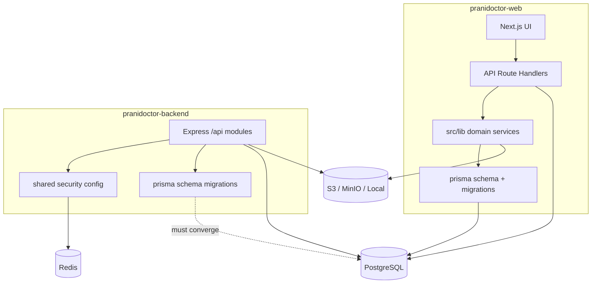
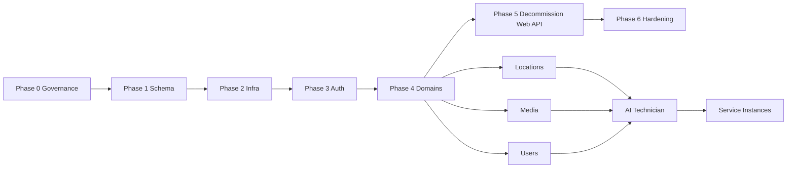

# Backend Extraction Plan

**Project:** Prani Doctor  
**Source (legacy monolith):** `D:\PraniDoctor\pranidoctor-web`  
**Target (dedicated backend):** `D:\PraniDoctor\pranidoctor-backend`  
**Date:** 2026-05-21  
**Mode:** PLAN ONLY — no code moves, no deletions, no modifications  

---

## Executive summary

`pranidoctor-web` is a **Next.js monolith** that owns production data, schema history, and **171 API route handlers**. `pranidoctor-backend` is a **new Express modular monolith** with foundation infrastructure (auth, security, media adapters) but **minimal schema and stub domain modules**.

Extraction is not a file copy — it is a **gradual transfer of ownership** for database, API, and domain logic while the web app remains the admin/mobile UI shell.

**Recommended posture:** Web remains **source of truth for Prisma and migrations** until backend schema parity is proven; backend becomes **source of truth for new HTTP APIs** domain-by-domain.

---

## A. Current architecture

### A.1 Source — `pranidoctor-web` (legacy monolith)

```
┌─────────────────────────────────────────────────────────────────────────┐
│                        pranidoctor-web (Next.js)                        │
├─────────────────────────────────────────────────────────────────────────┤
│  UI Layers                                                                │
│    • src/app/admin/*          Admin panel (Larkon)                       │
│    • src/app/enterprise/*     Enterprise review console                  │
│    • src/app/(public)/*       Marketing / static                         │
├─────────────────────────────────────────────────────────────────────────┤
│  API Layer (Next Route Handlers) — 171 routes                            │
│    • /api/admin/*             70 routes                                  │
│    • /api/mobile/*            71 routes                                  │
│    • /api/doctor/*            14 routes                                  │
│    • /api/technician/*         5 routes                                  │
│    • /api/locations/*          7 routes                                  │
│    • /api/notifications/*      3 routes                                  │
│    • /api/health/*             1 route                                   │
├─────────────────────────────────────────────────────────────────────────┤
│  Domain Services (src/lib/*) — ~174 files                                │
│    mobile-auth, admin-auth, storage, locations, service-instances,     │
│    mobile-ai-technician, admin-semen, notifications, sms, …            │
├─────────────────────────────────────────────────────────────────────────┤
│  Data                                                                    │
│    • prisma/schema.prisma     52 models, rich enums                     │
│    • prisma/migrations/       23 SQL migrations (May 2026 lineage)       │
│    • prisma/seed.ts           Full MVP + locations + semen + demo       │
│    • src/lib/prisma.ts        Prisma 7 + pg adapter                     │
│    • src/generated/prisma/    Client output                             │
└─────────────────────────────────────────────────────────────────────────┘
```

**Stack:** Next.js, Prisma 7 (`prisma-client` generator), PostgreSQL, optional S3/MinIO via `src/lib/storage/*`, Vitest.

### A.2 Target — `pranidoctor-backend` (dedicated API)

```
┌─────────────────────────────────────────────────────────────────────────┐
│                     pranidoctor-backend (Express 5)                     │
├─────────────────────────────────────────────────────────────────────────┤
│  Entry: src/server.ts, src/worker.ts                                     │
│  Health: src/api/health/*                                                │
│  Modules (mounted /api): auth, users, doctors, leads, animals,           │
│                          clinics, notifications, ai, media               │
├─────────────────────────────────────────────────────────────────────────┤
│  Shared: config, security (JWT/RBAC/audit/session), logger, queue, cache │
│  Infra: redis, bullmq, storage re-exports → media/storage adapters       │
├─────────────────────────────────────────────────────────────────────────┤
│  Data                                                                    │
│    • prisma/schema.prisma     6 models (foundation only)                 │
│    • prisma/migrations/       1 migration (foundation_core_tables)       │
│    • prisma/seed.ts           Roles + dev users only                     │
│    • src/shared/database/prisma.ts                                       │
└─────────────────────────────────────────────────────────────────────────┘
```

**Stack:** Express 5, TypeScript strict, Prisma 7 (`prisma-client-js`), service-agnostic dev (`docs/LOCAL_DEV_NO_DOCKER.md`), Docker optional.

### A.3 Coexistence today

| Concern | Web | Backend | Relationship |
|---------|-----|---------|--------------|
| Database | Same PostgreSQL concept | Same `DATABASE_URL` pattern | **Competing schemas** if pointed at one DB |
| API surface | `/api/*` on Next | `/api/*` on Express :3000 | **Duplicate contracts** if both live |
| Auth | Split admin + mobile libs | Unified `auth` module | **Different session/OTP storage** |
| Docs | `docs/backend/*` planning + reports | README + backend reports | Planning split across repos |

---

## B. Duplicate components

### B.1 Prisma & database

| Artifact | Web | Backend | Duplicate? |
|----------|-----|---------|------------|
| `schema.prisma` | 52 models, `UserRole` enum on User | 6 models, separate `Role` table | **Yes — incompatible** |
| Migrations | 23 folders (`20260208` → `20260512`) | 1 folder (`20260521120000_foundation`) | **Yes — disjoint history** |
| Generated client | `src/generated/prisma` | `src/generated/prisma` | Same tool, different schemas |
| Prisma config | Implicit / package.json seed | `prisma.config.ts` + `scripts/resolve-env.mjs` | Different bootstrap |
| `User` model | Rich profiles (Doctor, AI Tech, Customer) | Minimal user + `roleId` FK | **Conceptual overlap** |
| `UploadedFile` | Full upload pipeline fields | Foundation `UploadedFile` | Overlap, likely drift |
| OTP | `MobileOtpChallenge` table (Postgres) | Redis OTP challenges | **Different stores** |

### B.2 Seed data

| Script | Web | Backend |
|--------|-----|---------|
| Main seed | `prisma/seed.ts` (~870+ lines, locations, semen, providers) | `prisma/seed.ts` (roles + dev users) |
| Admin seed | `prisma/seed-admin.ts` | — |
| Demo seed | `prisma/seed-demo.ts`, `seed-demo-reset.ts` | — |
| Seed data dirs | `prisma/seed-data/bd-locations.ts`, location upserts | `prisma/seed-data/roles.ts`, `users.ts` |

### B.3 API layer

| Surface | Web | Backend |
|---------|-----|---------|
| Route count | **171** Next `route.ts` handlers | **~15** Express routes (auth + media + health) |
| Admin API | `/api/admin/*` (70) | Not implemented |
| Mobile API | `/api/mobile/*` (71) | Partial (`/api/auth/*` only) |
| Locations | `/api/locations/*`, `/api/mobile/locations/*` | Not implemented |
| Health | `/api/health` | `GET/POST /health`, `/ready`, `/live` |

### B.4 Auth

| Capability | Web location | Backend location |
|------------|--------------|------------------|
| Mobile OTP | `src/lib/mobile-auth/otp-service.ts`, DB `MobileOtpChallenge` | `auth.service` + Redis OTP |
| Mobile JWT | `src/lib/mobile-auth/jwt.ts` | `shared/security/jwt` |
| Admin JWT | `src/lib/admin-auth/jwt.ts` | Same JWT service (admin context) |
| Admin login API | `/api/admin/auth/login` | — |
| Mobile OTP API | `/api/mobile/auth/otp/*` | `/api/auth/otp/*` |
| Session | Cookie `prani_admin_token` + DB | Redis `session.storage` + `user_sessions` table |
| Guards | `mobile-auth/guard.ts`, `admin-auth/panel-access.ts` | `auth.middleware`, RBAC |

### B.5 Media / storage

| Layer | Web | Backend |
|-------|-----|---------|
| S3 client | `src/lib/storage/s3-client.ts` | `modules/media/storage/adapters/s3` |
| Upload service | `src/lib/storage/upload-service.ts` | `media.service` + multer middleware |
| MIME sniff | `src/lib/storage/mime-sniff.ts` | `infra/storage/mime-sniff.ts` (retained) |
| Env | `storage-env.ts`, Next public URLs | `STORAGE_DRIVER`, `S3_*`, `local` adapter |
| API | `/api/mobile/uploads/*`, `/api/admin/uploads/*` | `/api/media/*` |

### B.6 Environment

| Variable class | Web `.env.example` | Backend `.env.example` |
|----------------|-------------------|------------------------|
| Next-specific | `NEXT_PUBLIC_*`, `NEXTAUTH_*`, `APP_URL` | — |
| Database | `DATABASE_URL` | `DATABASE_URL` + `DB_*` fallbacks |
| JWT | `JWT_SECRET`, `ADMIN_JWT_SECRET`, `MOBILE_JWT_SECRET`, … | Same names + `MOBILE_REFRESH_SECRET` |
| OTP | `OTP_MODE`, SMS gateway vars | `OTP_*` numeric config |
| Storage | S3/MinIO via upload docs | `STORAGE_DRIVER`, `S3_*`, `LOCAL_STORAGE_PATH` |
| Redis | Not primary in web | `REDIS_URL`, `REDIS_ENABLED` |
| Startup | — | `SKIP_STARTUP_VALIDATION`, `WAIT_FOR` |

### B.7 Domain modules (logical, not folder-equal)

| Domain | Web (`src/lib`) | Backend (`src/modules`) | Backend repo status |
|--------|-----------------|-------------------------|---------------------|
| Auth | `mobile-auth`, `admin-auth` | `auth` | **Implemented** |
| Users / profiles | `mobile-customer`, profiles in Prisma | `users` | Stub repository |
| Doctors | `doctor-service-requests`, Prisma `DoctorProfile` | `doctors` | Stub |
| AI technician | `mobile-ai-technician`, `admin-ai-*` | `ai`, `clinics` | Stub |
| Animals | Prisma `AnimalProfile` | `animals` | Stub |
| Locations | `locations/*` (large) | — (no module) | **Missing module** |
| Service instances | `service-instances/*` | — | **Missing module** |
| Semen templates | `admin-semen/*` | — | **Missing module** |
| Notifications | `notifications/*`, `sms/*` | `notifications` | Stub |
| Media | `storage/*` | `media` | **Implemented** (needs schema parity) |
| Leads | — | `leads` | Stub |

---

## C. Source of truth decisions

| Domain | Source of truth (today) | Source of truth (target state) | Transition rule |
|--------|-------------------------|--------------------------------|-----------------|
| **Prisma schema** | **Web** (`prisma/schema.prisma`) | **Web until parity gate**, then **Backend** | Backend imports web schema snapshot; no dual-schema production DB |
| **Migrations** | **Web** (23 history) | **Web**, then **single migration stream** owned by backend repo | Never run backend `foundation` migration on web-populated DB without merge plan |
| **Seed (reference data)** | **Web** (locations, semen masters, demo) | **Backend** (after port) | Port seed scripts after schema merge |
| **Seed (roles/admin)** | Split | **Backend** `seed-data/roles.ts` | Reconcile with web `UserRole` enum vs `Role` table |
| **HTTP API (production)** | **Web** `/api/*` | **Backend** `/api/*` | Per-domain cutover behind env flag |
| **Auth tokens** | **Web secrets** (`MOBILE_JWT_SECRET`, etc.) | **Shared secret store** | Must match signing secrets during dual-run |
| **OTP (runtime)** | **Web Postgres** `MobileOtpChallenge` | **Decide one**: Redis (backend) or DB (web) | Blocking decision before mobile auth cutover |
| **Media bytes** | **Web S3/MinIO** | **Shared bucket** | Same `S3_BUCKET`; backend `UploadedFile` must match web columns |
| **Env template** | Both | **Backend `.env.example`** for API; **Web** adds `API_BASE_URL` pointing to backend | Document in each repo |
| **Planning docs** | **Web** `docs/backend/*` | **Backend** `README` + web `docs/BACKEND_EXTRACTION_PLAN.md` | This document lives in web docs until backend has `docs/` |

### C.1 Critical decision: one database, one schema

**Do not** point backend at the production web database until:

1. Backend `schema.prisma` is a **superset** of web (or identical).
2. A **unified migration history** is chosen (squash, baseline, or web migrations copied).
3. OTP/session strategy is unified.

Until then, use a **separate database** for backend dev (`pranidoctor_backend_dev`).

---

## D. Migration order

Phased extraction minimizes downtime and schema drift.

### Phase 0 — Governance (week 0)

1. Approve source-of-truth table (Section C).
2. Freeze new web API routes except hotfixes (or namespace new work under backend).
3. Add `API_BASE_URL` / `BACKEND_API_URL` to web env (documentation only).

### Phase 1 — Schema alignment (weeks 1–2)

1. Export web schema as canonical (`prisma/schema.prisma` copy → backend working branch).
2. Reconcile foundation differences:
   - `UserRole` enum vs `Role` table + `roleId`
   - `MobileOtpChallenge` vs Redis-only OTP
   - `UserSession` / refresh token shape
3. Merge migration history:
   - **Option A (recommended):** Backend adopts web migrations verbatim; archive `20260521120000_foundation_core_tables`.
   - **Option B:** Baseline from web DB `prisma migrate resolve` + single squashed migration on backend.
4. Single `prisma generate` pipeline in backend CI.
5. Port web seed subsets (locations, roles) into backend `prisma/seed-data/`.

**Gate:** `npm run db:migrate:deploy` on staging clone of web DB succeeds from backend repo only.

### Phase 2 — Shared infrastructure (week 2)

1. Align env variable names (JWT, S3, DATABASE_URL).
2. Run backend `validate:startup` against staging DB.
3. Unify storage bucket and `UploadedFile` metadata columns.
4. Document OTP strategy (Redis + optional DB audit table).

**Gate:** Backend health + DB + storage green on staging.

### Phase 3 — Auth cutover (week 3)

1. Implement API contract parity:
   - Web: `POST /api/mobile/auth/otp/request|verify`
   - Backend: `POST /api/auth/otp/request|verify` (exists)
2. Mobile app / web proxy: feature flag `USE_BACKEND_AUTH`.
3. Migrate admin auth OR keep web admin auth until Phase 5.

**Gate:** Mobile login E2E against backend only.

### Phase 4 — Domain APIs (weeks 4–10, parallel tracks)

Priority by dependency and traffic:

| Order | Domain | Web routes (approx) | Backend module | Depends on |
|-------|--------|---------------------|----------------|------------|
| 4.1 | Media / uploads | 5+ mobile + admin uploads | `media` | Auth, UploadedFile schema |
| 4.2 | Locations | 7 + 5 mobile | **New `locations` module** | DB masters |
| 4.3 | Users / me / profile | mobile `me`, profile | `users` | Auth |
| 4.4 | AI technician core | ~40 mobile + admin | `ai`, `clinics` | Users, locations, media |
| 4.5 | Service instances | 9 routes + lib | **New `service-instances` module** | AI tech, semen, media |
| 4.6 | Doctors / requests | 14 doctor + booking | `doctors`, `leads` | Locations, users |
| 4.7 | Notifications / SMS | 3 + lib | `notifications` | Queue (Redis) |
| 4.8 | Enterprise admin | enterprise UI + admin APIs | Admin routes under `auth` + RBAC | Auth |

Each slice: **port service logic** from `src/lib/*` → backend module; **proxy** web route to backend; **deprecate** web handler when stable.

### Phase 5 — Web API decommission (week 11+)

1. Remove Next `src/app/api/*` handlers per domain (read-only period first).
2. Next.js becomes UI-only (BFF optional for SSR secrets only).
3. Backend sole owner of `prisma/migrations` and `prisma/seed`.

### Phase 6 — Production hardening

1. CI: backend `verify:runtime`, migration deploy, smoke tests.
2. Re-issue Phase 1 freeze certificate (target ≥ 90).
3. Remove `SKIP_STARTUP_VALIDATION` from all prod deploys.

---

## E. File mapping

### E.1 Prisma & data

| Web (source) | Backend (target) | Action |
|--------------|------------------|--------|
| `prisma/schema.prisma` | `prisma/schema.prisma` | Replace backend schema with web canonical + foundation reconciliations |
| `prisma/migrations/*` | `prisma/migrations/*` | Copy full tree; retire backend-only foundation migration after merge |
| `prisma/seed.ts` | `prisma/seed.ts` | Port in chunks (locations, semen, admin) |
| `prisma/seed-data/*` | `prisma/seed-data/*` | Copy domain seed files |
| `prisma/seed-admin.ts` | `prisma/seed-admin.ts` | Port |
| `src/lib/prisma.ts` | `src/shared/database/prisma.ts` | Already analogous; keep backend singleton pattern |
| `scripts/prisma/migrate-failed.ts` | `scripts/prisma/*` | Port ops scripts as needed |

### E.2 API routes → Express modules

| Web route prefix | Backend mount | Notes |
|------------------|---------------|-------|
| `/api/mobile/auth/*` | `/api/auth/*` | Partial parity |
| `/api/admin/auth/*` | `/api/auth/*` (admin context) | Needs admin login handler |
| `/api/mobile/uploads/*` | `/api/media/*` | Different path — add alias or client update |
| `/api/admin/uploads/*` | `/api/media/*` | RBAC admin context |
| `/api/locations/*` | `/api/locations/*` | **New module** |
| `/api/mobile/ai-technician/*` | `/api/ai/*` + `/api/clinics/*` | Split by subdomain |
| `/api/admin/service-instances/*` | `/api/...` **new** | Port `lib/service-instances` |
| `/api/health` | `/health` | Already exists (root, not under `/api`) |

### E.3 Domain logic (`src/lib` → `src/modules`)

| Web path | Backend path | Priority |
|----------|--------------|----------|
| `src/lib/mobile-auth/*` | `src/modules/auth/*` + `shared/security/*` | P0 — done partially |
| `src/lib/admin-auth/*` | `shared/security/*`, `modules/auth/*` | P0 |
| `src/lib/storage/*` | `src/modules/media/storage/*` | P1 — adapters exist |
| `src/lib/locations/*` | `src/modules/locations/*` (new) | P1 |
| `src/lib/mobile-ai-technician/*` | `src/modules/ai/*`, `clinics/*` | P2 |
| `src/lib/service-instances/*` | `src/modules/service-instances/*` (new) | P2 |
| `src/lib/admin-semen/*` | `src/modules/semen/*` or under `clinics` | P2 |
| `src/lib/notifications/*`, `sms/*` | `src/modules/notifications/*` | P3 |
| `src/lib/mobile-ai-services/*` | `src/modules/ai/*` | P2 |

### E.4 Config & scripts

| Web | Backend | Action |
|-----|---------|--------|
| `.env.example` | `.env.example` | Merge docs; web keeps `NEXT_PUBLIC_*` |
| — | `src/shared/config/env.validation.ts` | Backend-only; web documents required vars |
| — | `scripts/validate-startup.ts` | Backend-only |
| `package.json` db scripts | `package.json` db scripts | Align names (`db:deploy:safe` → document guard) |

### E.5 Documentation

| Document | Location | Role |
|----------|----------|------|
| Planning architecture | `pranidoctor-web/docs/backend/01–08*.md` | Historical; reference during port |
| This plan | `pranidoctor-web/docs/BACKEND_EXTRACTION_PLAN.md` | Extraction roadmap |
| Local dev no Docker | `pranidoctor-web/docs/LOCAL_DEV_NO_DOCKER.md` | Backend dev setup |
| Phase 1 certificate | `docs/PHASE1_FINAL_FREEZE_CERTIFICATE.md` | Re-run after extraction gates |

---

## F. Risk analysis

| ID | Risk | Likelihood | Impact | Mitigation |
|----|------|------------|--------|------------|
| R1 | **Schema fork** — backend foundation migration applied to web DB | High | Critical | Separate dev DB until Phase 1 gate; never auto-deploy backend migrations to web DB |
| R2 | **User/Role model mismatch** — enum vs FK | High | High | Schema reconciliation doc + one-shot data migration script |
| R3 | **OTP store split** — Postgres vs Redis | High | High | Pick one store; dual-write only during short cutover window |
| R4 | **JWT secret drift** between repos | Medium | High | Shared `.env` template; CI check same secrets in staging |
| R5 | **171 routes → 15** capability gap | Certain | High | Phased cutover; feature flags per domain |
| R6 | **UploadedFile column drift** | Medium | High | Generate diff from both schemas before media cutover |
| R7 | **Location seed coupling** — web-only scripts | Medium | Medium | Port `prisma/seed-data/bd-locations.ts` before locations API |
| R8 | **Dual API CORS / cookies** | Medium | Medium | Proxy via Next or configure cross-origin + cookie domain |
| R9 | **Team continues web API development** | High | Medium | Governance: new APIs only in backend after Phase 0 |
| R10 | **Prisma generator difference** (`prisma-client` vs `prisma-client-js`) | Low | Medium | Standardize on one generator in merged schema |
| R11 | **Stub repositories called in prod** | Medium | High | Block routes until repo implemented; integration tests per module |
| R12 | **Enterprise UI depends on admin API paths** | Medium | High | Keep path aliases or API gateway rewrite rules |

---

## G. Rollback plan

### Per-phase rollback

| Phase | Rollback trigger | Rollback action |
|-------|------------------|-----------------|
| 1 Schema | Migration failure / data corruption | Restore DB snapshot; revert backend schema branch; web unchanged |
| 2 Infra | Startup validation fails in staging | Keep web API; disable `BACKEND_API_URL` in web env |
| 3 Auth | Login regression | Set `USE_BACKEND_AUTH=false`; web OTP/JWT paths resume |
| 4 Domain | 5xx on backend routes | Re-enable web `route.ts` handlers (keep code until decommission) |
| 5 Decommission | Critical production bug | Re-deploy previous web build with full `/api/*` |

### Operational safeguards

1. **Database:** Snapshot before every migration deploy; test on clone.
2. **Traffic:** Blue/green or flag-based routing — default to web API.
3. **Contracts:** Maintain OpenAPI or route manifest diff in CI (web vs backend).
4. **No file deletion** in web repo until Phase 5 sign-off (per project rules).
5. **Monitoring:** Compare error rates web vs backend per endpoint during cutover.

### Rollback decision matrix

```
IF backend_error_rate > web_baseline * 1.5 FOR 15 min:
  SET feature_flag(USE_BACKEND_*) = false
  ALERT on-call
  POSTMORTEM before re-attempt
```

---

## H. Dependency graph

### H.1 Repository-level dependencies



### H.2 Extraction phase dependencies



### H.3 Backend module dependency (target)

Aligns with `docs/backend/module-map.md` plus **new** modules:

```
auth → users → {doctors, leads, animals, clinics, notifications}
clinics + notifications → ai
auth + media → uploads
locations → {ai, doctors, clinics}   [NEW - not in backend yet]
service-instances → {ai, media, semen}   [NEW]
```

---

## Appendix: inventory snapshot

| Metric | Web | Backend |
|--------|-----|---------|
| Prisma models | 52 | 6 |
| SQL migrations | 23 | 1 |
| API routes | 171 | ~15 |
| `src/lib` service files | ~174 | — |
| Backend module files | — | ~214 |
| Auth implementation | Split libs + DB OTP | Unified module + Redis OTP |
| Typecheck status | Pass (web) | Pass (backend, 0 errors) |
| Phase 1 freeze score | N/A (monolith) | 76/100 (rejected — infra) |

---

## Sign-off checklist (planning only)

- [ ] Stakeholders agree schema SoT = web until Phase 1 gate  
- [ ] OTP storage strategy chosen (Redis vs Postgres)  
- [ ] Separate backend dev database provisioned  
- [ ] Feature-flag approach for API cutover approved  
- [ ] No production DB migration from backend until schema merge reviewed  

---

*This document is planning-only. No files were modified, moved, or deleted in either repository.*
