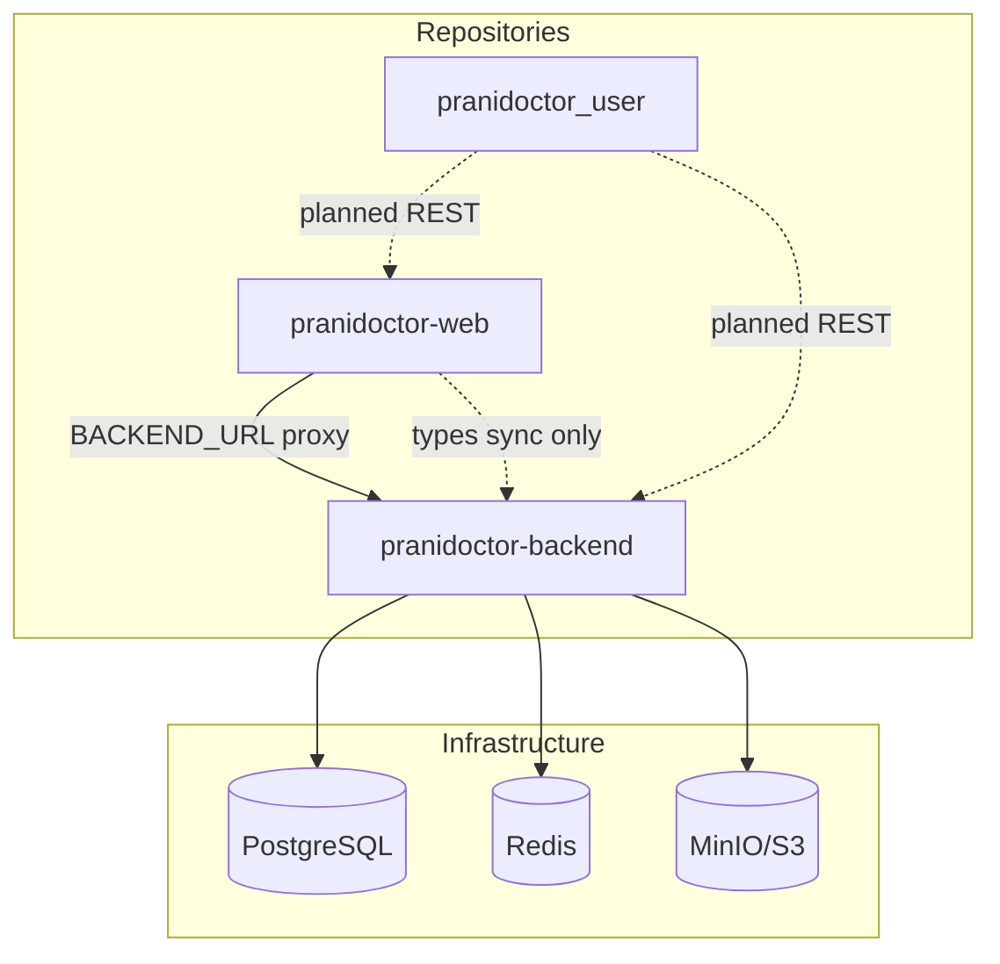
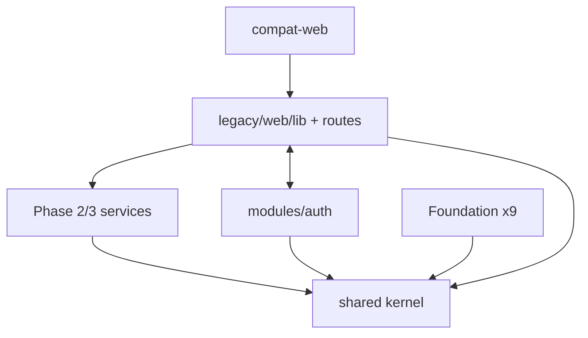
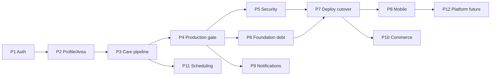

# Master Audit — Prani Doctor Platform

**Audit date:** 2026-05-21  
**Chief auditor:** System audit synthesis  
**Sources:** [docs/audit/01_REPOSITORY_INVENTORY.md](./audit/01_REPOSITORY_INVENTORY.md) · [02_ARCHITECTURE_AUDIT.md](./audit/02_ARCHITECTURE_AUDIT.md) · [03_FEATURE_MATRIX.md](./audit/03_FEATURE_MATRIX.md) · [04_TECHNICAL_RISK.md](./audit/04_TECHNICAL_RISK.md) · [05_EXECUTION_PLAN.md](./audit/05_EXECUTION_PLAN.md)  
**Scope:** `pranidoctor-backend`, `pranidoctor-web`, `pranidoctor_user`  
**Mode:** Read-only consolidation — no redesign, no fixes applied

---

## Executive Summary

Prani Doctor is a **three-repository veterinary platform** migrating to a **backend-first** architecture. Canonical data and business logic live in **Express + Prisma** (`pranidoctor-backend`). **Next.js** (`pranidoctor-web`) serves admin/doctor/enterprise UI and proxies ~171/176 API routes to the backend. **Flutter** (`pranidoctor_user`) is an early customer scaffold not yet integrated with production APIs.

**What works today (verified):**

- **Phase 1–3 frozen slices:** Auth (multi-panel + mobile OTP), profile/area (P2), care pipeline — lead → assign → accept → case → timeline (P3)
- **Legacy compat API:** 179 route handlers under `tsx` dev; `p2:verify` 13/13, `p3:verify` 17/17
- **Admin/doctor operational path:** ~65% of target workflow coverage

**What blocks production:**

- **Docker production image does not ship legacy routes** (R-001) — container deploy ≠ dev path
- **No CI/CD** in any repo (R-002)
- **Backups documented but not automated** (R-003)
- **Six P0 risks** total; **14 P1** risks including duplicate lib trees, foundation stub modules, no payment gateway, mobile not wired

**Scores (audit date):**

| Metric | Score | Interpretation |
|--------|-------|----------------|
| **Completion %** | **38%** | Weighted platform modules vs documented target (24 modules) |
| **Critical-path completion %** | **65%** | Admin + doctor + service-request workflow |
| **Readiness score** | **42 / 100** | Production deploy, CI, backup, monitoring not ready |
| **Risk score** | **72 / 100** | Elevated — 6× P0, 14× P1 open |

**Verdict:** Strong **development and domain progress** (P1–P3); **not production-ready** until Phase 4 (production gate) from [05_EXECUTION_PLAN.md](./audit/05_EXECUTION_PLAN.md). Next mandated step: **P4 — Production gate**, not new product features.

---

## A. Current Architecture

### A.1 System topology

```
┌─────────────────────────────────────────────────────────────────────────┐
│ Clients: Web browser (admin/doctor/enterprise) · Flutter (farmer)        │
└───────────────┬───────────────────────────────┬─────────────────────────┘
                │ HTTP                           │ REST (Dio — not wired)
                ▼                                ▼
┌───────────────────────────┐         ┌───────────────────────────────────┐
│ pranidoctor-web (:3001)   │  proxy  │ pranidoctor-backend (:3000)       │
│ Next.js 16 · React 19     │────────▶│ Express 5 · Prisma 7              │
│ 176 API routes (~171 proxy)│         │ 179 legacy compat + 9 foundation │
│ Admin/doctor/enterprise UI│         │ Phase 2/3 services via legacy     │
└───────────────────────────┘         └───────────────┬───────────────────┘
                                                      │
                        ┌─────────────────────────────┼─────────────────────┐
                        ▼                             ▼                     ▼
                  PostgreSQL 16                  Redis 7 (opt)          MinIO / S3
                  59 models · 27 migrations      OTP · cache · BullMQ    uploads
```

### A.2 Backend layers

| Layer | Path | Role |
|-------|------|------|
| Entry | `server.ts`, `app.ts`, `worker.ts` | Bootstrap, middleware, shutdown |
| Shared kernel | `shared/` | Config (Zod), Prisma, Pino, errors |
| Infrastructure | `infra/` | Redis, BullMQ, cache |
| **Compat (primary traffic)** | `modules/compat-web/` + `legacy/web/routes/` (179) | Next-style handlers on Express |
| **Foundation modules** | `modules/{auth,users,doctors,...}/` (9 registered) | Express routers; several repos stubbed |
| **Phase 2/3 services** | `profile`, `area`, `lead`, `assignment`, `case`, `timeline`, `doctor-queue` | Wired through legacy; not in `createAllModules()` |
| Data | `prisma/schema.prisma` | Canonical schema owner |

**Mount order:** `/health` → `/api/docs` → **compat router (first)** → foundation modules → 404/error handlers.

### A.3 Web layers

| Layer | Path | Role |
|-------|------|------|
| UI | `src/app/admin/`, `doctor/`, `enterprise/` | Panels |
| API | `src/app/api/` (176 handlers) | Almost all `proxyRouteToBackend` |
| Transport | `proxy-to-backend.ts`, `server-internal.ts`, `api-client.ts` | Forward to backend |
| Legacy libs | `src/lib/*` (~178 TS files) | Duplicated domain logic (drift risk) |
| Guard | `src/lib/prisma.ts` | Throws on direct DB use |

### A.4 Mobile

| Layer | Path | Role |
|-------|------|------|
| Shell | Riverpod + go_router + Dio | Scaffold complete |
| Auth | `SessionController`, `AuthRepository` | Placeholder tokens; no API wiring |
| Config | `AppEnv` dart-define | Default `https://api.example.com` |

### A.5 Infrastructure

| Asset | Backend | Web | Mobile |
|-------|---------|-----|--------|
| Docker compose | Postgres, Redis, MinIO, optional API | Postgres, MinIO only | None |
| Production image | `docker/Dockerfile` (legacy gap) | None | None |
| CI/CD | None | None | None |

### A.6 Architecture tensions (no redesign proposed)

1. **Dual API stack** — Next proxy + Express legacy + foundation modules  
2. **Auth ↔ legacy bidirectional imports** — migration bridge, unstable boundary  
3. **Doc conflict** — `ARCHITECTURE_FREEZE.md` (backend-first) vs `CUTOVER_DEFER_PLAN.md` (web-as-prod)  
4. **Dev vs prod path** — `tsx` loads `src/legacy`; Docker `dist/` lacks route tree  

---

## B. Existing Modules

Status from [03_FEATURE_MATRIX.md](./audit/03_FEATURE_MATRIX.md). **24 platform modules** audited.

### B.1 Complete (≥85% coverage)

| Module | Coverage | Evidence |
|--------|----------|----------|
| **Auth** | 88% | P1 frozen; panel + mobile OTP; device/refresh |
| **Area** | 85% | P2 frozen; BD hierarchy; location master |

### B.2 Partial (15–84% coverage)

| Module | Coverage | Primary runtime path |
|--------|----------|----------------------|
| User | 72% | `modules/users`, `modules/profile`, `/api/mobile/me` |
| Roles | 50% | `UserRole` enum; narrow admin permission matrix |
| Doctor | 72% | Admin + doctor panels; P3 assignment/case |
| Farmer | 42% | Mobile API exists; Flutter not wired |
| Animal | 68% | Legacy `/api/mobile/animals` |
| Consultation | 58% | `ServiceRequest` workflow (P3) |
| AI | 62% | Legacy AI technician/semen; foundation `/api/ai/chat` broken |
| Payment | 52% | Billing records; no PSP |
| Notification | 58% | In-app legacy Prisma; SMS/push TODO |
| Search | 38% | Location + list filters |
| Knowledge | 78% | Tutorials / ContentPost workflow |
| Admin | 82% | Full admin panel (~127 app files) |
| Localization | 48% | Auth bn-BD; profile locale; Flutter en-only |

### B.3 Foundation modules (registered Express)

| Module | Mount | Runtime status |
|--------|-------|----------------|
| auth | `/api/auth` | Active + legacy adapters |
| users | `/api/users` | Partial Prisma repo |
| doctors | `/api/doctors` | Partial; create → legacy |
| leads | `/api/leads` | CRM foundation active |
| animals | `/api/animals` | **Repository stub** |
| clinics | `/api/clinics` | **Repository stub** |
| notifications | `/api/notifications` | **Repository stub** |
| ai | `/api/ai` | **Repository stub** |
| media | `/api/media` | **Controller 503** |

### B.4 Phase 2/3 service modules (legacy-wired)

| Module | Role | Verified |
|--------|------|----------|
| profile | Customer profile, farm context | P2 |
| area | Location catalog | P2 |
| lead | Service-request intake | P3 |
| assignment | Assign / accept / reject | P3 |
| case | Treatment case open | P3 |
| timeline | Append-only events | P3 |
| doctor-queue | Doctor tab listing | P3 |
| doctor / technician / user | Legacy helpers | Partial |

### B.5 Repositories & verification

| Repo | Git | Build/analyze | Phase gates |
|------|-----|---------------|-------------|
| pranidoctor-backend | Yes | `build` PASS | P2/P3 PASS |
| pranidoctor-web | Yes | `typecheck` PASS | e2e 8/9 |
| pranidoctor_user | **No** | `flutter analyze` PASS | None |

---

## C. Missing Modules

Modules **NOT_STARTED** or **<15%** vs documented target ([ERD §15](./database/ERD.md), feature matrix).

| Module | Coverage | Target source | Notes |
|--------|----------|---------------|-------|
| **Clinic** | 8% | Module map | No Prisma `Clinic` model |
| **Appointment** | 18% | ERD §15 | No slot/schedule domain |
| **Wallet** | 5% | ERD §15 | Enum only; no ledger |
| **Chat** | 12% | ERD telemedicine | No human messaging API |
| **Feed** | 8% | Social feed | ContentPost is editorial only |
| **Analytics** | 22% | Architecture docs | Dashboard aggregates only |
| **Subscription** | 0% | ERD §15 | Not in schema |
| **IoT** | 0% | Future | Not in MVP map |
| **Offline** | 12% | ERD sync models | Hive prep only |

### C.1 Missing production capabilities

| Capability | Documented | In repo |
|------------|------------|---------|
| CI/CD | Phase0 DevOps | **No** |
| Automated backup | BACKUP_STRATEGY | **Docs only** |
| Monitoring stack | MONITORING | **Docs only** |
| Payment gateway | Phase0 MVP gap | **No** |
| SMS/push delivery | Module map | **Placeholder** |
| Web production container | — | **No** |
| Worker in prod compose | Queue strategy | **No** |
| Mobile git + API integration | Mobile plan | **No** |

---

## D. Dependency Graph

### D.1 Repository dependencies



### D.2 Backend module dependencies (simplified)



### D.3 Phase delivery dependencies



---

## E. Critical Blockers

### E.1 P0 — Release blockers (must fix before production)

| ID | Blocker | Impact |
|----|---------|--------|
| **R-001** | Legacy API absent from Docker prod artifact | Container deploy loses 179 routes |
| **R-002** | No CI/CD | Regressions undetected; manual gates only |
| **R-003** | Backups not automated | RPO/RTO unmet |
| **R-004** | OTP dev mode in production config | Plaintext OTP in logs |
| **R-005** | Ops doc conflict (cutover vs freeze) | Wrong ownership decisions |
| **R-006** | Redis optional silences OTP/queues | Auth degradation |

### E.2 P1 — High priority (before public/mobile scale)

| ID | Blocker | Impact |
|----|---------|--------|
| R-007 | No rate limits on legacy `/api/*` | Abuse / brute force |
| R-008 | Foundation stub routes return 500 | Misrouted clients fail |
| R-009 | ~353 duplicated lib TS files | Patch drift |
| R-010 | No payment gateway | Manual revenue |
| R-011 | SMS/push not live | Alerts undelivered |
| R-012 | Upload rate limits missing on legacy | Storage abuse |
| R-013 | No web prod container | Inconsistent deploys |
| R-014 | Storage default `disabled` | Upload failures |
| R-015 | Flutter not wired / not in git | No customer app |

### E.3 Product launch blockers (feature matrix)

| Module | Blocker |
|--------|---------|
| Farmer / Mobile | API not integrated; placeholder auth |
| Payment | No PSP |
| Offline | No sync engine |
| Notification | SMS/push channels |

---

## F. Recommended Phase Order

Consolidated from [05_EXECUTION_PLAN.md](./audit/05_EXECUTION_PLAN.md). **No redesign** — extend frozen P1–P3 patterns.

| Phase | Name | Goal | Est. |
|-------|------|------|------|
| ✅ **P1** | Auth | Identity, OTP, sessions — **FROZEN** | Done |
| ✅ **P2** | Profile / Area | User profile, BD locations — **FROZEN** | Done |
| ✅ **P3** | Care pipeline | Lead → assign → case → timeline — **FROZEN** | Done |
| **P4** | Production gate | P0 risks: Docker legacy, CI, backup, env guards | M–L |
| **P5** | Security baseline | Rate limits, stub guards, log hygiene | M |
| **P6** | Foundation & tests | Port notifications/animals/media; Vitest | L |
| **P7** | Deploy cutover | Web Docker, e2e 9/9, doc sync, dedup pilot | L |
| **P8** | Farmer mobile | Flutter ↔ API; git; core flows | L |
| **P9** | Notifications delivery | SMS live, FCM, worker | M |
| **P10** | Commerce | Payment gateway → billing records | XL |
| **P11** | Scheduling | Consultation depth, reminders | M–L |
| **P12** | Platform future | Wallet, subscription, analytics, offline, chat, IoT | XL tracks |

**Critical path:** P4 → P5 → P7 → **P8** → P10 (P6 ∥ P5 after P4; P9 after P4).

---

## G. Estimated Implementation Batches

Size key: **XS** ≤1d · **S** 2–5d · **M** 1–2wk · **L** 2–4wk · **XL** 1–2mo+

### G.1 Phase 4 — Production gate

| Batch | Work | Size |
|-------|------|------|
| 4.A | Reconcile ops docs (single prod owner) | XS |
| 4.B | Docker ships legacy routes (compile/bundle fix) | M |
| 4.C | CI: build + p2 + p3 + e2e + web typecheck | M |
| 4.D | Backup scripts + restore drill | M |
| 4.E | Prod env guards (OTP, Redis, storage) | S |
| 4.F | `p4-verify.ts` smoke matrix | S |

### G.2 Phase 5 — Security

| Batch | Work | Size |
|-------|------|------|
| 5.A | Rate limits on compat router | M |
| 5.B | Upload rate limits (legacy) | S |
| 5.C | Foundation stub → 501 or unmount | S |
| 5.D | Legacy console → Pino sanitizer | S |
| 5.E | Web env validation checklist | XS |

### G.3 Phase 6 — Foundation debt

| Batch | Work | Size |
|-------|------|------|
| 6.A | Notifications repo → legacy service | M |
| 6.B | Animals repo → legacy service | M |
| 6.C | Media controller → legacy upload stack | M |
| 6.D | AI foundation explicit defer (501) | XS |
| 6.E | Vitest `@/` legacy fix | M |
| 6.F | Phase 3 module OpenAPI registration (optional) | S |

### G.4 Phase 7 — Deploy cutover

| Batch | Work | Size |
|-------|------|------|
| 7.A | Next.js Dockerfile | M |
| 7.B | CI e2e 9/9 with web :3001 | S |
| 7.C | Doc route counts → 179 | XS |
| 7.D | Missing web proxy routes (if any) | S |
| 7.E | Admin UI lib dedup pilot | L |
| 7.F | Unified dev compose | S |

### G.5 Phases 8–12 (summary)

| Phase | Key batches | Total size |
|-------|-------------|------------|
| **P8** Mobile | Git, Dio auth, animals, service-requests, bn l10n | **L** |
| **P9** Notify | SMS provider, FCM, worker compose | **M** |
| **P10** Commerce | PSP adapter, webhooks, admin reconcile | **XL** |
| **P11** Schedule | Availability, mobile booking, reminders | **M–L** |
| **P12** Platform | Analytics, monitoring, wallet, offline, chat | **XL** each track |

**Calendar estimate (single squad, sequential critical path):** ~**6–9 months** to mobile MVP + prod ops; **12+ months** for ERD Phase 3+ domains.

---

## Scores — Methodology & Results

### Completion %

**Formula:** Mean of 24 module coverage estimates vs documented target platform ([03_FEATURE_MATRIX.md](./audit/03_FEATURE_MATRIX.md)).

| Category | Modules | Avg coverage |
|----------|---------|--------------|
| Complete | 2 | 86.5% |
| Partial | 14 | 58.4% |
| Not started | 8 | 7.1% |
| **Platform total** | **24** | **38%** |

**Critical-path completion %** (admin + doctor + service-request): **65%** — P2/P3 verified workflow plus admin panel.

**Phase roadmap completion:** 3 of 12 planned phases = **25%** of delivery roadmap (P1–P3 done; P4–P12 remain).

### Readiness score (0–100)

**Formula:** Production readiness checklist weighted average ([04_TECHNICAL_RISK.md](./audit/04_TECHNICAL_RISK.md) §5).

| Area | Weight | Score |
|------|--------|-------|
| Auth (legacy) | 15% | 60 |
| API dev path | 15% | 85 |
| API Docker prod | 15% | 5 |
| Web proxy | 10% | 75 |
| Uploads | 10% | 55 |
| Payments | 10% | 20 |
| Notifications | 10% | 50 |
| Monitoring | 5% | 15 |
| Backup | 10% | 10 |
| CI/release | 10% | 5 |
| **Readiness score** | | **42 / 100** |

**Label:** **Not production-ready** — dev/staging path strong; deploy/ops path weak.

### Risk score (0–100)

**Formula:** Severity-weighted open risks (higher = worse).  
`P0×10 + P1×5 + P2×2 + P3×1`, normalized to 0–100 (max reference: 40 risks at P0 = 400).

| Severity | Count | Weighted points |
|----------|-------|-----------------|
| P0 | 6 | 60 |
| P1 | 14 | 70 |
| P2 | 12 | 24 |
| P3 | 8 | 8 |
| **Total** | **40** | **162 → normalized **72**** |

**Label:** **Elevated risk** — address P0 cluster in P4 before scale.

---

## Appendix

### A.1 Folder map (consolidated)

```
D:\PraniDoctor\
├── pranidoctor-backend/          # Canonical API + Prisma
│   ├── prisma/                   # schema (59 models), migrations (27), seeds
│   ├── src/
│   │   ├── modules/              # auth, users, doctors, leads, animals, clinics,
│   │   │                         # ai, notifications, media, compat-web,
│   │   │                         # profile, area, lead, assignment, case,
│   │   │                         # timeline, doctor-queue, doctor, technician, user
│   │   ├── legacy/web/
│   │   │   ├── routes/           # 179 compat route.ts
│   │   │   └── lib/              # ~175 domain TS files
│   │   ├── shared/               # config, db, logger, security, events
│   │   ├── infra/                # redis, queue, cache
│   │   ├── api/                  # health, docs
│   │   └── compat/               # NextResponse shims
│   ├── scripts/                  # p1–p3 verify, openapi, e2e, bootstrap
│   ├── docker/                   # Dockerfile
│   └── docker-compose.yml        # postgres, redis, minio, api (profile)
│
├── pranidoctor-web/              # UI + proxy + docs hub
│   ├── src/
│   │   ├── app/admin|doctor|enterprise|api/   # 176 API routes
│   │   ├── lib/                  # ~178 TS (legacy mirror)
│   │   └── generated/prisma/     # synced copy
│   ├── docs/                     # ~222 files + audit/
│   ├── archive/web-deprecated/   # 46 deprecated TS
│   ├── data/                     # location master CSV
│   └── docker-compose.yml        # postgres, minio (separate from backend)
│
└── pranidoctor_user/             # Flutter customer (no .git)
    ├── lib/app|core|features|routing|theme|l10n/
    ├── android/
    └── docs/
```

### A.2 Risk register (full)

| ID | Sev | Category | Title |
|----|-----|----------|-------|
| R-001 | P0 | Deploy | Legacy API absent from production Docker artifact |
| R-002 | P0 | Release | No CI/CD in any repository |
| R-003 | P0 | Backup | Backup strategy documented but not automated |
| R-004 | P0 | Auth | OTP dev mode can expose codes in prod logs |
| R-005 | P0 | Ops | Documentation conflict: cutover defer vs architecture freeze |
| R-006 | P0 | Env | REDIS_ENABLED=false disables OTP/session/queues silently |
| R-007 | P1 | Security | Legacy /api/* without rate limiting |
| R-008 | P1 | Broken module | Foundation stubs callable (500 errors) |
| R-009 | P1 | Duplicate | 178 + 175 mirrored lib files |
| R-010 | P1 | Payment | No payment gateway |
| R-011 | P1 | Notification | SMS/push not implemented |
| R-012 | P1 | Upload | Legacy upload path lacks rate limit |
| R-013 | P1 | Deploy | No web production container |
| R-014 | P1 | Secret | Storage default disabled |
| R-015 | P1 | Mobile | Flutter not wired; not in git |
| R-016 | P2 | Dead code | archive/web-deprecated + _archived_foundation |
| R-017 | P2 | Test | Legacy Vitest @/ failures |
| R-018 | P2 | Monitoring | Prometheus/Grafana docs-only |
| R-019 | P2 | Security | CSP disabled via Helmet |
| R-020 | P2 | Worker | BullMQ worker not in compose prod profile |
| R-021 | P2 | Logging | Legacy console OTP/SMS logs |
| R-022 | P2 | Media | Foundation /api/media 503 |
| R-023 | P3 | Dead code | Unreferenced web geo-resolve |
| R-024 | P3 | Git | Initial commit messages vs actual scope |
| R-025 | P3 | Auth | Flutter dev-token placeholder |

### A.3 Unused / low-value assets

| Asset | Location | Status | Recommendation phase |
|-------|----------|--------|----------------------|
| `archive/web-deprecated/` | pranidoctor-web | 46 TS; frozen until soak | P12.I delete after sign-off |
| `_archived_foundation/` | backend auth, media modules | Excluded from build | P6 review / remove |
| `src/lib/mobile-locations/geo-resolve.ts` | pranidoctor-web | Unreferenced | P7 cleanup (P3) |
| Web `src/lib/*` mirrors | pranidoctor-web | ~178 files; superseded by backend | P7.E incremental dedup |
| `CUTOVER_DEFER_PLAN.md` | pranidoctor-web/docs | Superseded by freeze policy | P4.A archive note |
| Flutter `VideoCallGateway` NoOp | pranidoctor_user | Stub | Until telemedicine phase |
| Flutter `MediaUploadCoordinator` | pranidoctor_user | Placeholder | P8+ |
| Web-only docker Postgres | pranidoctor-web compose | Redundant with backend | P7.F unify |
| Foundation `/api/ai/chat` | backend | Throws / stub | P6.D defer 501 |
| Git "Initial upload" commits | backend, web | Misleading history | P3 hygiene |

### A.4 Audit artifact index

| Document | Purpose |
|----------|---------|
| [audit/01_REPOSITORY_INVENTORY.md](./audit/01_REPOSITORY_INVENTORY.md) | Repo structure, tooling, git |
| [audit/02_ARCHITECTURE_AUDIT.md](./audit/02_ARCHITECTURE_AUDIT.md) | Layers, coupling, drift |
| [audit/03_FEATURE_MATRIX.md](./audit/03_FEATURE_MATRIX.md) | 24 modules current vs target |
| [audit/04_TECHNICAL_RISK.md](./audit/04_TECHNICAL_RISK.md) | P0–P3 risks, domain reviews |
| [audit/05_EXECUTION_PLAN.md](./audit/05_EXECUTION_PLAN.md) | P4–P12 batches and estimates |
| [PHASE1_FREEZE.md](./PHASE1_FREEZE.md) · [PHASE2_FREEZE.md](./PHASE2_FREEZE.md) · [PHASE3_FREEZE.md](./PHASE3_FREEZE.md) | Frozen slices |
| [ARCHITECTURE_FREEZE.md](./ARCHITECTURE_FREEZE.md) | Target policy |

### A.5 Verification baseline (2026-05-21)

| Gate | Result |
|------|--------|
| Backend `npm run build` | PASS |
| Web `npm run typecheck` | PASS |
| `p2:verify` | 13/13 PASS |
| `p3:verify` | 17/17 PASS |
| `e2e:freeze` | 8/9 (web proxy needs :3001) |
| Flutter `flutter analyze` | PASS |
| P1 certificate composite | REJECTED (76/100) |

---

## Sign-off summary

| Metric | Value |
|--------|-------|
| **Completion %** | **38%** (platform) · **65%** (critical path) · **25%** (roadmap phases) |
| **Readiness score** | **42 / 100** |
| **Risk score** | **72 / 100** (elevated) |
| **Next action** | **Phase 4 — Production gate** |
| **Constraint** | No redesign; preserve P1–P3 freezes |

---

AUDIT_COMPLETE
