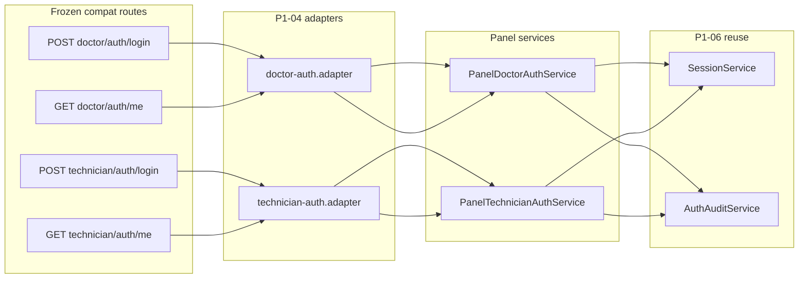

# P1-04 & P1-05 — Doctor & Technician Authentication (Plan)

**Project:** Prani Doctor  
**Mode:** PLAN only  
**Date:** 2026-05-21  
**Prerequisites:** `AUTH_READY=YES`, `TOKEN_READY=YES` ([P1_03_CERTIFICATE.md](./P1_03_CERTIFICATE.md), [P1_06_CERTIFICATE.md](./P1_06_CERTIFICATE.md))  
**Repo:** `pranidoctor-backend` only — **no web changes**

**Read:** [PHASE1_IMPLEMENTATION_SEQUENCE.md](./PHASE1_IMPLEMENTATION_SEQUENCE.md), [P1_03_API_COMPAT.md](./P1_03_API_COMPAT.md), [PHASE1_UI_FLOW.md](./PHASE1_UI_FLOW.md)

---

## 1. Sign-off

```
P1_04_READY=YES
P1_05_READY=YES
BREAKING_CHANGE=NO
```

| Field | Value |
|-------|--------|
| **P1_04_READY** | **YES** — thin routes done in P1-03; remaining work is parity hardening + verify |
| **P1_05_READY** | **YES** — additive `me` profile fields for doctor/technician (not mobile locale) |
| **BREAKING_CHANGE** | **NO** |

> **Note on sequence numbering:** Canonical Phase 1 step P1-05 in [PHASE1_IMPLEMENTATION_SEQUENCE.md](./PHASE1_IMPLEMENTATION_SEQUENCE.md) is **mobile `CustomerProfile.locale`**. This plan **re-scopes P1-05** to doctor/technician **`/auth/me` profile slices** per project goal. Mobile locale remains a **separate follow-on** (original P1-05), tracked in §8.

---

## 2. Current state (post P1-03 / P1-06)

### 2.1 Already delivered (P1-03)

| Item | Status |
|------|--------|
| `PanelDoctorAuthService` / `PanelTechnicianAuthService` | Implemented |
| Compat adapters `doctor-auth.adapter.ts`, `technician-auth.adapter.ts` | Implemented |
| Legacy routes (1-line re-exports) | 6 routes total |
| JWT tokens `panel-doctor-token.ts`, `panel-technician-token.ts` | Implemented |
| Audit on login failure/success, logout | Implemented |
| `recordPanelSession` on login (P1-06) | Fire-and-forget DB row |

### 2.2 Route inventory (frozen — unchanged)

| Panel | Login | Logout | Me |
|-------|-------|--------|-----|
| Doctor | `POST /api/doctor/auth/login` | `POST /api/doctor/auth/logout` | `GET /api/doctor/auth/me` |
| Technician | `POST /api/technician/auth/login` | `POST /api/technician/auth/logout` | `GET /api/technician/auth/me` |

Cookies: `prani_doctor_session`, `prani_technician_session` (httpOnly, SameSite=lax).

---

## 3. Gap analysis

### 3.1 Doctor login / logout / me

| Flow | Current | Gap |
|------|---------|-----|
| **Login** | Email + password → bcrypt → JWT cookie + `data.user` with `id` | **OK** — matches frozen codes |
| **Logout** | Audit `LOGOUT` + clear cookie | **Partial** — does not revoke `UserSession` row (P1-08); cookie-only logout |
| **Me** | JWT cookie → `resolveActor` → `compatJsonOk({ user: actor })` | **Shape mismatch** — actor uses `userId`; web `MeResponse` expects `id` (see `pranidoctor-web/src/lib/doctor-auth/panel-access.ts`) |

### 3.2 Technician login / logout / me

| Flow | Current | Gap |
|------|---------|-----|
| **Login** | Same as doctor; role `AI_TECHNICIAN`; gate `AiTechnicianProfile.providerStatus === ACTIVE` | **OK** |
| **Logout** | Same as doctor | **Partial** — no `UserSession` revoke |
| **Me** | Returns `TechnicianPanelActor` raw | **Shape mismatch** — web expects `id`, not `userId` |

### 3.3 Reuse matrix (do not duplicate P1-06)

| Primitive | Doctor / technician usage |
|-----------|---------------------------|
| **Session (`UserSession`)** | **Reuse** — `recordPanelSession` on login (P1-06); P1-04 adds `revokeLatestPanelSession` on logout |
| **Refresh token** | **Not used** — panels stay cookie JWT only until product requires panel refresh |
| **Device (`UserDevice`)** | **Not used** — mobile-only; no panel device register |
| **Permissions registry** | **Admin only** — doctor/technician use `requireDoctorApiActor` / `requireTechnicianApiActor` + `ProviderStatus` |
| **Audit (`AuthAuditEvent`)** | **Reuse** — already wired in panel services |

---

## 4. P1-04 — Compat completion & verification

**Goal:** Confirm doctor/technician auth is production-consistent with frozen contracts; fix non-breaking parity gaps.

### 4.1 Work packages

| ID | Task | Files |
|----|------|-------|
| P1-04-A | **Normalize `me` response** — map `userId` → `id` in adapters (match login + web `MeResponse`) | `doctor-auth.adapter.ts`, `technician-auth.adapter.ts` |
| P1-04-B | **Panel logout session revoke** — revoke latest ACTIVE `UserSession` for user+channel on logout (no JWT `sid` required) | `panel-*-auth.service.ts` or shared `panel-session.helper.ts` |
| P1-04-C | **Contract tests** — `scripts/p1-04-05-verify.ts` (envelope + me shape + login invalid) | `scripts/` |
| P1-04-D | **Unit tests** — doctor/technician login gates, `resolveActor`, db_unavailable | `panel-doctor-auth.service.test.ts`, `panel-technician-auth.service.test.ts` |
| P1-04-E | **OpenAPI note** — document frozen `data.user` shapes (no path changes) | regenerate only |

### 4.2 Explicit non-goals (P1-04)

- No route renames or new auth paths  
- No refresh tokens on panel login  
- No web proxy or page changes (P1-13 optional technician login page stays separate)  
- No activation of `_archived_foundation`  
- No change to error code strings or envelope  

### 4.3 Exit criteria

- [ ] All 6 doctor/technician routes ≤ 3 lines (re-export only)  
- [ ] `GET */auth/me` returns `user.id` (not `userId`)  
- [ ] Logout revokes at least one `UserSession` row when present  
- [ ] `npm run p1:04-05-verify` PASS  
- [ ] `npm run p1:auth-compat` + `e2e:freeze` PASS  

**Estimate:** 0.5–1d (mostly verification + small adapter fixes).

---

## 5. P1-05 — Doctor & technician profile on `me`

**Goal:** Expose provider/profile state on `GET */auth/me` for UI gating — **additive fields only**.

### 5.1 Doctor `GET /api/doctor/auth/me`

**Frozen keys preserved.** Add optional fields:

| Field | Type | Source |
|-------|------|--------|
| `id` | string | `User.id` (normalized from `userId`) |
| `email` | string | unchanged |
| `displayName` | string \| null | unchanged |
| `doctorProfileId` | string | unchanged |
| `providerStatus` | string | `DoctorProfile.providerStatus` — **new optional** |
| `role` | `"DOCTOR"` | **new optional** (parity with login) |

### 5.2 Technician `GET /api/technician/auth/me`

| Field | Type | Source |
|-------|------|--------|
| `id` | string | normalized |
| `email` | string | unchanged |
| `displayName` | string \| null | unchanged |
| `aiTechnicianProfileId` | string | unchanged |
| `providerStatus` | string | `AiTechnicianProfile.providerStatus` — **new optional** |
| `role` | `"AI_TECHNICIAN"` | **new optional** |

### 5.3 Implementation

| ID | Task |
|----|------|
| P1-05-A | Extend `resolveActor` select to include `providerStatus` |
| P1-05-B | Add `toDoctorMeDto` / `toTechnicianMeDto` serializers in adapters |
| P1-05-C | Document additive fields in [P1_04_05_API.md](./P1_04_05_API.md) |
| P1-05-D | Verify web `panel-access.ts` still works (`id` field required) |

**No schema migration** — fields already on `DoctorProfile` / `AiTechnicianProfile`.

**Estimate:** 0.5d.

---

## 6. Architecture (target)



---

## 7. Permission & guard model (unchanged)

| Panel | Login gate | API route gate |
|-------|------------|----------------|
| Doctor | `UserRole.DOCTOR`, `UserStatus.ACTIVE`, `DoctorProfile`, `providerStatus ACTIVE` | `requireDoctorApiActor()` → `resolveDoctorPanelActor` (legacy re-export → module) |
| Technician | `UserRole.AI_TECHNICIAN`, active `AiTechnicianProfile` | `requireTechnicianApiActor()` |

**Not** using `permissions.registry.ts` (admin capabilities only). Document in code comments only — no matrix change.

---

## 8. Deferred / related work

| Item | Step | Notes |
|------|------|-------|
| Mobile `CustomerProfile.locale` | Original P1-05 in sequence | `GET/PATCH /api/mobile/me` — separate ticket |
| Panel JWT `sid` + logout invalidates JWT | P1-08 | Full session invalidation |
| `POST /api/mobile/auth/refresh` | P1-07 | Mobile only |
| Technician web login page | P1-13 | Web repo |
| Panel refresh tokens | — | Not planned Phase 1 |

---

## 9. Verification plan

| Command | P1-04 | P1-05 |
|---------|-------|-------|
| `npm run build` | required | required |
| `npm run p1:04-05-verify` | new script | me shape + providerStatus |
| `npm run p1:auth-compat` | required | required |
| `npm run e2e:freeze` | required | required |
| `npx vitest run` panel auth tests | new | — |

---

## 10. Rollback

| Change | Rollback |
|--------|----------|
| Me DTO normalization | Revert adapter serializers |
| Additive `providerStatus` | Clients ignore unknown keys |
| Logout session revoke | Feature flag `PANEL_LOGOUT_REVOKE_SESSION=false` |

---

## 11. Output block

```
P1_04_READY=YES
P1_05_READY=YES
BREAKING_CHANGE=NO
ROUTES_AFFECTED=0
SCHEMA_CHANGE=NONE
NEXT_IMPLEMENT=P1-04-A,B,C,D then P1-05-A,B,D
```
