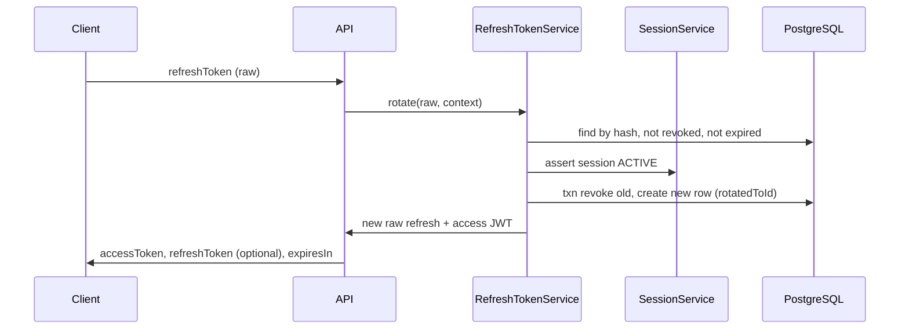

# P1-06 — Refresh, Session, Device & Redis OTP (Plan)

**Project:** Prani Doctor  
**Mode:** PLAN only (no implementation in this document)  
**Date:** 2026-05-21  
**Prerequisites:** P1-03 complete (`AUTH_READY=YES`, `LEGACY_PORTED=YES`)  
**Repos:** `pranidoctor-backend` only — **no web changes**

**Read:** [ARCHITECTURE_FREEZE.md](./ARCHITECTURE_FREEZE.md), [P1_03_CERTIFICATE.md](./P1_03_CERTIFICATE.md), [PHASE1_IMPLEMENTATION_SEQUENCE.md](./PHASE1_IMPLEMENTATION_SEQUENCE.md)

---

## 1. Sign-off

```
P1_06_READY=YES
SCHEMA_CHANGE=ADDITIVE
ROUTES_AFFECTED=FOUNDATION_REFRESH_LOGOUT;MOBILE_AUTH_ISSUE_ADDITIVE_FIELDS
```

| Field | Value |
|-------|--------|
| **P1_06_READY** | **YES** — design complete; safe to implement |
| **SCHEMA_CHANGE** | **ADDITIVE** — three new models + optional enum; no column drops/renames |
| **ROUTES_AFFECTED** | See [P1_06_API.md](./P1_06_API.md) — **no path renames**; foundation refresh/logout gain behavior; mobile auth responses gain **optional** fields |

---

## 2. Goal

Deliver the **persistence and service layer** for:

1. **RefreshToken** — hashed storage, rotation, expiry, revoke, logout-all  
2. **UserSession** — server-side session rows linked to refresh + optional panel cookies  
3. **UserDevice** — stable device registry for mobile (push + revoke)  
4. **Redis OTP preparation** — pluggable OTP store; Prisma `MobileOtpChallenge` remains default until ops enables Redis  

**Out of scope for P1-06 execute** (follow-on steps, same Phase 1):

| Item | Step | Reason |
|------|------|--------|
| `POST /api/mobile/auth/refresh` compat route | **P1-07** | New path — additive, not required for service layer |
| Panel JWT `sessionId` claim + logout invalidates row | **P1-08** | Backward-compat rule for old cookies |
| `POST /api/mobile/devices/register` proxy + route | **P1-09** | New path; service built in P1-06 |
| Web UI / proxy files | — | Frozen: backend-only |
| i18n catalog for new error codes | **P1-11** | |

---

## 3. Constraints (non-negotiable)

| Rule | Enforcement |
|------|-------------|
| No route rename | Frozen paths unchanged ([API_CONTRACT_FREEZE.md](./API_CONTRACT_FREEZE.md)) |
| No envelope change | Compat stays `{ ok, data }`; foundation stays `{ success, data }` |
| No schema breaking | Add tables/relations/enums only |
| No web changes | Types sync via existing `sync-prisma-from-backend` only |
| Additive only | New JSON keys optional; old clients ignore `refreshToken` |
| Do not activate `_archived_foundation` | Port **patterns** into `modules/auth/`, not the archived module wholesale |

---

## 4. Current state (post P1-03)

| Capability | Today |
|------------|--------|
| Mobile access JWT | `signMobileCustomerToken` — 30d, no refresh in response (`refreshToken: ''` stub) |
| Foundation refresh | `AuthService.refreshToken` → `null` |
| Foundation logout | `AuthService.revokeToken` → noop log |
| Panel auth | Stateless JWT cookies; logout clears cookie only |
| OTP storage | Prisma `MobileOtpChallenge` (transactional rate limit) |
| Redis | `REDIS_ENABLED=false` in dev; infra client exists (`src/infra/redis/`) |
| Audit | `AuthAuditEvent` + `REFRESH_*`, `SESSION_REVOKED` enum values **already in schema** |

---

## 5. Target architecture

```
                    ┌─────────────────────────────────────┐
                    │         modules/auth/               │
                    │  identity-auth.service (facade)     │
                    └──────────────┬──────────────────────┘
                                   │
         ┌─────────────────────────┼─────────────────────────┐
         ▼                         ▼                         ▼
 refresh-token.service    session.service          device.service
         │                         │                         │
         ▼                         ▼                         ▼
   RefreshToken (PG)         UserSession (PG)          UserDevice (PG)
         │                         │
         └──────── sessionId FK ───┘

 mobile-otp-auth.service
         │
         ├── OtpStore (interface)
         │     ├── PrismaOtpStore  ← default (current behavior)
         │     └── RedisOtpStore   ← P1-06 prep (archived pattern + CacheKeys)
         └── on verify success → session.service + refresh-token.service
```

**Dual-layer sessions (mobile):**

| Layer | Purpose |
|-------|---------|
| PostgreSQL `UserSession` | Source of truth for revoke / audit / support |
| Redis session cache (optional) | Hot path for refresh validation when `REDIS_ENABLED=true` — reuse `shared/security/session/session.storage.ts` **without** changing compat envelopes |

Phase 1 default: **Postgres-first**; Redis cache is best-effort when enabled.

---

## 6. Token lifecycle design

### 6.1 Refresh token

| Property | Value |
|----------|--------|
| Raw format | 32-byte random, base64url (~43 chars), prefixed optional `pd_rt_` for log identification |
| Storage | `SHA-256(pepper + raw)` in `RefreshToken.tokenHash` — pepper from `MOBILE_REFRESH_SECRET` (≥32 chars, already in `.env`) |
| Context | `mobile` for customer OTP/password; extensible `admin` / `doctor` / `technician` later |
| TTL | **30 days** default (`REFRESH_TOKEN_TTL_SECONDS`, align with `MOBILE_SESSION_MAX_AGE` unless product sets shorter) |
| Issuance | On `otp/verify` success and `mobile/auth/login` success |
| Delivery | Plaintext **once** in response; never logged, never in audit metadata |

### 6.2 Rotation (refresh flow)



**Rules:**

1. **One active refresh per session** — `findActiveRefreshTokenForSession` before issue.  
2. **Rotate in transaction** — old row `revoked=true`, `rotatedAt`, `rotatedToId=newId`.  
3. **Reuse detection (recommended)** — if a **revoked** token is presented, revoke **all** refresh tokens for that `sessionId` and audit `REFRESH_FAILURE` with `metadata.reuse=true`.  
4. **Access JWT** — new `signMobileCustomerToken(userId)`; optional embed `sid` (session id) as **additive** JWT claim for P1-08 guards.

### 6.3 Expiry

| Artifact | Expires |
|----------|---------|
| Access JWT | Existing `MOBILE_SESSION_MAX_AGE` (keep frozen client behavior) |
| Refresh row | `expiresAt` on create/rotate |
| UserSession row | `expiresAt` ≥ refresh expiry; `lastSeenAt` updated on refresh |

Expired refresh → `REFRESH_FAILURE` audit, response `TOKEN_INVALID` / compat equivalent (new code only on foundation path until P1-11).

### 6.4 Revoke

| Action | Behavior |
|--------|----------|
| **Logout (single device)** | Revoke `UserSession` + all `RefreshToken` for `sessionId`; clear Redis session if present; audit `LOGOUT` + `SESSION_REVOKED` |
| **Logout-all** | `revokeAllSessionsForUser(userId)` + `revokeAllRefreshTokensForUser(userId)`; used by foundation logout with Bearer, support tooling (future), or reuse-detection |
| **Device revoke** | `UserDevice.revokedAt`; optionally revoke session bound to `deviceKey` |
| **Panel logout (P1-06)** | Cookie clear **unchanged**; optional session row revoke when panel session rows enabled (P1-08 full wire-up) |

### 6.5 Logout-all API surface

| Surface | P1-06 |
|---------|-------|
| `POST /api/auth/logout` with Bearer | Revoke all mobile sessions + refresh for `userId` |
| Compat panel `POST */auth/logout` | Cookie clear only until P1-08 (`sessionId` in JWT) |
| Admin “sign out all devices” | **Deferred** — no new admin route in P1-06 |

---

## 7. Session design (`UserSession`)

| Field | Purpose |
|-------|---------|
| `channel` | `mobile` \| `admin_panel` \| `doctor_panel` \| `technician_panel` |
| `status` | `ACTIVE` \| `REVOKED` \| `EXPIRED` (enum) |
| `deviceId` | FK to `UserDevice.id` when known |
| `ipAddress`, `userAgent` | From `authRequestContext(request)` |
| `expiresAt`, `lastSeenAt`, `revokedAt`, `revokedReason` | Revocation audit trail |

**Mobile login:**

1. Upsert/register `UserDevice` when client sends `deviceKey` (optional body/header — additive).  
2. Create `UserSession` with generated id (cuid).  
3. Issue refresh linked to `sessionId`.  
4. Return access JWT (and optional `refreshToken` in data).

**Panel login (P1-06 minimal):**

- Insert `UserSession` row on login success (channel = panel).  
- **Do not** require `sessionId` in existing JWTs (P1-08).  
- P1-06 only persists row; P1-08 adds claim + guard.

---

## 8. Device design (`UserDevice`)

| Rule | Detail |
|------|--------|
| Identity | `@@unique([userId, deviceKey])` — client-generated stable id |
| Upsert | Register on OTP verify / login when `deviceKey` provided |
| Fields | `platform`, `pushToken`, `appVersion`, `lastActiveAt` |
| Revoke | Soft `revokedAt`; do not delete (audit) |
| Link | `UserSession.deviceId` → `UserDevice.id` |

**Service API (internal):**

- `registerOrUpdate(userId, deviceKey, meta)`  
- `revoke(userId, deviceId)`  
- `listActive(userId)` — for P1-09 GET route  

---

## 9. Redis OTP preparation

**Problem:** Production needs Redis-backed ephemeral OTP ([P1_03_CERTIFICATE.md](./P1_03_CERTIFICATE.md) — `REDIS_ENABLED=false` in dev).

**Approach:** Strategy interface — **no behavior change** until flag enabled.

| Component | Path |
|-----------|------|
| `OtpStore` interface | `modules/auth/otp/otp-store.interface.ts` |
| `PrismaOtpStore` | Wrap existing `MobileOtpAuthService` transaction logic |
| `RedisOtpStore` | Port from `_archived_foundation/auth.repository.ts` OTP methods + `CacheKeys.otpChallenge` |
| Factory | `getOtpStore()` reads `OTP_STORAGE=prisma\|redis` (default `prisma`) |

| Mode | When |
|------|------|
| `prisma` | Default; identical to today |
| `redis` | `REDIS_ENABLED=true` **and** `OTP_STORAGE=redis` |
| Dual-write (optional soak) | `OTP_STORAGE=dual` — write both, read Prisma (Phase 1b) |

**Frozen compat:** OTP error codes and Bengali messages **unchanged**; store swap is internal.

**Keys (existing conventions):**

- `{redis.prefix}otp:challenge:{normalizedPhone}`  
- `{redis.prefix}otp:sends:{normalizedPhone}` (ZSET hourly cap)

---

## 10. Module layout (implementation guide)

| File | Responsibility |
|------|----------------|
| `modules/auth/refresh-token.service.ts` | issue, rotate, revoke, revokeAll |
| `modules/auth/session.service.ts` | create, touch, revoke, revokeAll, findActive |
| `modules/auth/device.service.ts` | register, revoke, list |
| `modules/auth/otp/otp-store.interface.ts` | OTP abstraction |
| `modules/auth/otp/prisma-otp.store.ts` | Current logic extraction |
| `modules/auth/otp/redis-otp.store.ts` | Redis implementation |
| `modules/auth/auth.repository.ts` | Thin Prisma CRUD (optional; or inline in services) |
| Update `auth.service.ts` | Wire refresh/logout/issue on verify |
| Update `mobile-otp-auth.service.ts` | Use `OtpStore`; call session+refresh on verify |
| Update `mobile-auth.adapter.ts` | Add optional `refreshToken` to `jsonOk` data |
| Update `identity-auth.service.ts` | Expose session/refresh helpers to facade |

**Reuse (do not duplicate):**

- `shared/security/session/session.storage.ts` — Redis hot cache  
- `_archived_foundation/auth.repository.ts` — reference for rotate/revoke transactions (copy into active module, do not import archived path)

---

## 11. Implementation waves (execute order)

| Wave | Work | Exit |
|------|------|------|
| **W1** | Migrations: `RefreshToken`, `UserSession`, `UserDevice` ([P1_06_DB.md](./P1_06_DB.md)) | `prisma migrate deploy` clean |
| **W2** | `RefreshTokenService` + unit tests (issue, rotate, revoke, expired, reuse) | Vitest green |
| **W3** | `SessionService` + unit tests | Vitest green |
| **W4** | `DeviceService` + unit tests | Vitest green |
| **W5** | Wire mobile OTP verify + password login → session + refresh issue | Rows in PG after test verify |
| **W6** | Implement `AuthService.refreshToken` + `revokeToken`; foundation controller live | `POST /api/auth/token/refresh` 200 with valid token |
| **W7** | Redis `OtpStore` + factory + env docs; default remains Prisma | Build pass; OTP unchanged with `OTP_STORAGE=prisma` |
| **W8** | Audit: `REFRESH_SUCCESS`, `REFRESH_FAILURE`, `SESSION_REVOKED` on flows | Rows in `AuthAuditEvent` |
| **W9** | `npm run build`, `openapi:generate`, `p1:verify`, extend `p1-03-verify` or `p1-06-verify` | Certificate append |

**Estimated effort:** 1.5–2d (per sequence P1-06 + session/device/redis prep)

---

## 12. Testing strategy

| Layer | Tests |
|-------|-------|
| Unit | Refresh rotate txn, revoke-all, expired, reuse detection |
| Unit | Session revoke, channel filter |
| Unit | Device upsert unique constraint |
| Unit | Redis OtpStore with mocked `getRedis()` |
| Integration | OTP verify → refresh row + optional response field |
| Integration | Foundation refresh → new access + rotated hash |
| Contract | `p1:auth-compat` + frozen admin login unchanged |
| Regression | Old mobile client ignoring `refreshToken` still works |

---

## 13. Rollback

| Change | Rollback |
|--------|----------|
| Migrations | Leave tables; stop writing rows (`AUTH_REFRESH_ENABLED=false`) |
| Response fields | Clients ignore optional keys |
| Redis OTP | `OTP_STORAGE=prisma` |
| Foundation refresh | Return `null` again (feature flag) |

---

## 14. Dependencies & follow-on

| Step | Depends on P1-06 |
|------|------------------|
| **P1-07** | `POST /api/mobile/auth/refresh` compat route → `RefreshTokenService.rotate` |
| **P1-08** | Panel JWT `sid` claim + logout revokes `UserSession` |
| **P1-09** | `POST /api/mobile/devices/register` → `DeviceService` |
| **P1-10** | Full foundation delegation parity |
| **P1-12** | E2E matrix row #7 mobile refresh |

---

## 15. References

- [P1_06_DB.md](./P1_06_DB.md) — Prisma models & migrations  
- [P1_06_API.md](./P1_06_API.md) — Route behavior matrix  
- [PHASE1_DB_MAP.md](./PHASE1_DB_MAP.md) §4–7  
- [PHASE1_API_MAP.md](./PHASE1_API_MAP.md) §4–5  
- Backend: `src/modules/auth/auth.service.ts`, `mobile-otp-auth.service.ts`, `_archived_foundation/` (reference only)

---

## 16. Output block

```
P1_06_READY=YES
SCHEMA_CHANGE=ADDITIVE
ROUTES_AFFECTED=POST /api/auth/token/refresh,POST /api/auth/refresh,POST /api/auth/logout;additive POST /api/mobile/auth/otp/verify,POST /api/mobile/auth/login,POST /api/auth/otp/verify
```
