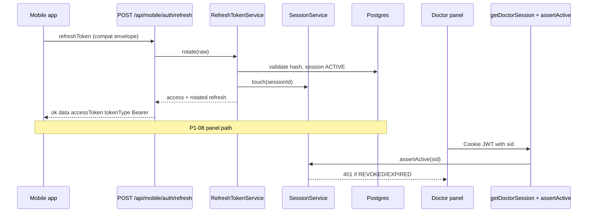

# P1-07 & P1-08 — Master Plan (Mobile Refresh + Session Guard)

**Project:** Prani Doctor  
**Mode:** PLAN (implementation-ready)  
**Date:** 2026-05-21  
**Prerequisites:** `AUTH_COMPLETE=YES`, `TOKEN_READY=YES` ([P1_04_05_CERTIFICATE](./P1_04_05_CERTIFICATE.md), [P1_06_CERTIFICATE](./P1_06_CERTIFICATE.md))

---

## 1. Executive summary

| Step | Goal | Outcome |
|------|------|---------|
| **P1-07** | Expose frozen **mobile compat** refresh route | Flutter/clients call `POST /api/mobile/auth/refresh` with `{ ok, data }` envelope; delegates to existing `RefreshTokenService.rotate` |
| **P1-08** | **Session hardening** for panel + mobile | JWT carries `sid` (session id); guards reject revoked/expired sessions; logout revokes the **exact** session, not only “latest row” |

**Constraints (non-negotiable):**

- No route rename
- No schema break (additive JWT claims + behavior only)
- No UI changes (web: optional **proxy file** for P1-07 only — not a UI change)
- Frozen compat envelopes preserved

---

## 2. Current state (from certificates)

| Capability | Status | Gap |
|------------|--------|-----|
| `RefreshToken` rotation + reuse detection | Done (P1-06) | — |
| `UserSession` rows on panel/mobile login | Done (P1-06) | Panel JWT has **no `sid`**; logout uses `revokeLatestPanelSession` |
| Mobile access JWT optional `sid` | Issued on new mobile creds (P1-06) | `requireMobileCustomer` **does not** check `sid` |
| `POST /api/auth/token/refresh` | Live (`{ success, data }`) | Mobile apps expect compat path |
| `POST /api/mobile/auth/refresh` | **Missing** | P1-07 |
| Panel `me` / API guards | JWT signature + role/profile only | P1-08 adds DB session check |
| Device registry | `DeviceService` on login when `deviceKey` sent | Refresh inherits `deviceId`; revoked device not enforced on guard (optional P1-08-B) |

---

## 3. Architecture (target)



---

## 4. Scope split

### 4.1 P1-07 — Mobile refresh compatibility

| In scope | Out of scope |
|----------|----------------|
| `POST /api/mobile/auth/refresh` compat route + adapter | Renaming `/api/auth/token/refresh` |
| Request/response per [P1_07_REFRESH.md](./P1_07_REFRESH.md) | Foundation envelope changes |
| Reuse `RefreshTokenService.rotate` | New refresh storage (Redis) |
| Audit `REFRESH_SUCCESS` / `REFRESH_FAILURE` (existing) | P1-09 dedicated device register route |
| Extend `p1-verify` / new `p1-07-verify` | i18n catalog (P1-11) |

### 4.2 P1-08 — Panel JWT `sid` + session invalidation

| In scope | Out of scope |
|----------|----------------|
| Add optional `sid` to panel JWT payloads (doctor, technician, admin) | Panel refresh tokens |
| `recordPanelSession` → return session id → embed in JWT at login | Forced logout of all devices on single panel logout (use explicit logout-all API later) |
| Logout revokes session by `sid` when present; fallback `revokeLatestPanelSession` | Redis session store migration |
| `get*Session` + panel `me` + `require*ApiActor` check `SessionService.assertActive` when `sid` present | Changing cookie names |
| Mobile `requireMobileCustomer` checks `sid` when present | UI / RSC changes |

### 4.3 Shared — Session hardening & device consistency

| Item | Owner | Notes |
|------|-------|-------|
| `SessionService.assertActive` in guards | P1-08 | Single helper `assertSessionForAuth(sid, channel)` |
| `SessionService.touch` on authenticated compat requests | P1-08 | Panel `me`, mobile `me` (lightweight) |
| Refresh rotation keeps `deviceId` on new refresh row | Already P1-06 | Document in P1-07 |
| Reject refresh when linked `UserDevice.revokedAt` set | P1-08-B (optional flag) | `DEVICE_REVOKED` compat code |
| Env feature flags + soft rollout | Both | See §7 |

---

## 5. Implementation workstreams

### Workstream A — P1-07 (backend)

1. `handleMobileRefresh` in `src/modules/auth/compat/mobile-auth.adapter.ts`
2. Legacy route `src/legacy/web/routes/mobile/auth/refresh/route.ts` → `export { handleMobileRefresh as POST }`
3. Route registry picks up path automatically (compat-web scan)
4. Unit test: adapter maps rotate success/failure to frozen envelope
5. Script `scripts/p1-07-verify.ts` + `npm run p1:07-verify`

### Workstream B — P1-07 (web proxy only)

1. `pranidoctor-web/src/app/api/mobile/auth/refresh/route.ts` — `proxyRouteToBackend` (same as login)
2. Regenerate OpenAPI (path count 172 → 173)

### Workstream C — P1-08 panel tokens & login

1. Extend `DoctorJwtPayload`, `TechnicianJwtPayload`, `AdminJwtPayload` with optional `sid?: string`
2. `sign*Token(userId, email, sessionId?)` — set JWT claim `sid`
3. `recordPanelSession` → return `{ sessionId }` (or change `issuePanelCredentials` helper)
4. Panel `login()` awaits session id before signing JWT
5. `verify*Token` returns `sid` when present

### Workstream D — P1-08 guards & logout

1. `src/modules/auth/session-guard.helper.ts` (new) — `resolveSessionFromJwt(payload, channel)`
2. Wire into `legacy/web/lib/doctor-auth/session.ts` (and technician, admin) **or** panel adapters `handle*Me`
3. `panel-*-auth.service.logout` — read JWT from cookie before clear → `revoke(sid)` if `sid` else `revokeLatestPanelSession`
4. Mobile `requireMobileCustomer` — after JWT verify, if `payload.sid` → `assertActive`; else legacy path
5. Feature flags: `PANEL_SESSION_GUARD_ENABLED`, `MOBILE_SESSION_GUARD_ENABLED` (default `true` dev, configurable prod)

### Workstream E — Verification & docs

1. Extend `npm run p1:verify` with mobile compat refresh HTTP check (optional: keep foundation check)
2. `p1-08-verify`: login → me → logout → me 401; parallel session revoke count
3. Execution + certificate docs after implement (not in this PLAN commit)

---

## 6. API surface (no renames)

| Method | Path | Step | Envelope |
|--------|------|------|----------|
| POST | `/api/mobile/auth/refresh` | **P1-07** | `{ ok, data }` |
| POST | `/api/auth/token/refresh` | unchanged | `{ success, data }` |
| POST | `/api/doctor/auth/login` | P1-08 additive JWT | `{ ok, data }` unchanged |
| GET | `/api/doctor/auth/me` | P1-08 behavior | 401 if session revoked |
| POST | `/api/doctor/auth/logout` | P1-08 behavior | revokes matching `sid` |
| Same pattern | technician, admin | P1-08 | |

---

## 7. Feature flags & rollout

| Env | Default (dev) | Purpose |
|-----|---------------|---------|
| `AUTH_REFRESH_ENABLED` | `true` | Already P1-06 — P1-07 returns 503/500 if off |
| `PANEL_JWT_SID_ENABLED` | `true` | Embed `sid` on new panel JWTs |
| `PANEL_SESSION_GUARD_ENABLED` | `true` | `me`/guards call `assertActive` when `sid` in JWT |
| `PANEL_LOGOUT_REVOKE_SESSION` | `true` | Already P1-04/05 — P1-08 prefers `sid` target |
| `MOBILE_SESSION_GUARD_ENABLED` | `true` | Bearer guard checks `sid` when claim present |
| `REFRESH_REJECT_REVOKED_DEVICE` | `false` | P1-08-B: block refresh if device revoked |

**Rollout strategy:**

1. Deploy P1-07 — old apps unaffected (new route only).
2. Deploy P1-08 — new logins get `sid`; old cookies without `sid` keep working until expiry (guard skips DB check if `sid` absent).
3. Optional strict mode later: reject panel JWTs without `sid` (not Phase 1).

---

## 8. Verification matrix

| # | Test | Step |
|---|------|------|
| 1 | OTP/login issues `refreshToken` | P1-06 regression |
| 2 | `POST /api/mobile/auth/refresh` valid → 200 compat `accessToken` | P1-07 |
| 3 | Invalid refresh → `TOKEN_INVALID` compat | P1-07 |
| 4 | Reuse revoked refresh → session cleared | P1-06 + P1-07 |
| 5 | Doctor login → me 200 → logout → me 401 | P1-08 |
| 6 | Doctor logout revokes exact `UserSession` by `sid` | P1-08 |
| 7 | Mobile Bearer with revoked `sid` → 401 on `/api/mobile/me` | P1-08 |
| 8 | `npm run p1:verify` all pass | Combined |
| 9 | `npm run build`, `openapi:generate`, `e2e:freeze` | Regression |

---

## 9. Risk register

| Risk | Mitigation |
|------|------------|
| Breaking clients that parse strict JWT claim set | `sid` is optional; verify functions ignore unknown claims |
| Logout fails if cookie unreadable | Keep `revokeLatestPanelSession` fallback |
| Multiple ACTIVE panel sessions per user | Expected; logout revokes one session; login creates new row |
| Foundation vs compat refresh error HTTP mismatch | Document: foundation `400`, compat `401` for `TOKEN_INVALID` (frozen per channel) |
| Stale backend on :3000 | Ops: restart after deploy; verify `GET /health/db` 200 |

---

## 10. Deliverables (this PLAN)

| Document | Purpose |
|----------|---------|
| [P1_07_08_PLAN.md](./P1_07_08_PLAN.md) | Master plan (this file) |
| [P1_07_REFRESH.md](./P1_07_REFRESH.md) | P1-07 contract + implementation detail |
| [P1_08_SESSION_GUARD.md](./P1_08_SESSION_GUARD.md) | P1-08 guard + invalidation detail |

**Post-implementation (separate PR):** `P1_07_EXECUTION.md`, `P1_08_EXECUTION.md`, `P1_07_08_CERTIFICATE.md`

---

## 11. References

- [P1_03_CERTIFICATE.md](./P1_03_CERTIFICATE.md) — compat port baseline
- [P1_06_CERTIFICATE.md](./P1_06_CERTIFICATE.md) — refresh/session/device
- [P1_04_05_CERTIFICATE.md](./P1_04_05_CERTIFICATE.md) — panel auth complete
- [P1_06_API.md](./P1_06_API.md) — deferred routes §5
- [PHASE1_API_MAP.md](./PHASE1_API_MAP.md) — §5 additive endpoints
- Backend: `RefreshTokenService`, `SessionService`, `mobile-auth-credentials.service.ts`, `panel-session.helper.ts`

---

## 12. Output block

```
P1_07_READY=YES
P1_08_READY=YES
BREAKING_CHANGE=NO
SCHEMA_CHANGE=NONE
ROUTES_ADDED=POST /api/mobile/auth/refresh
ROUTES_BEHAVIOR=panel login/logout/me guards; mobile Bearer guard; optional device revoke on refresh
WEB_CHANGE=proxy only (P1-07)
NEXT_IMPLEMENT=P1-07-A,B then P1-08-C,D,E
```
