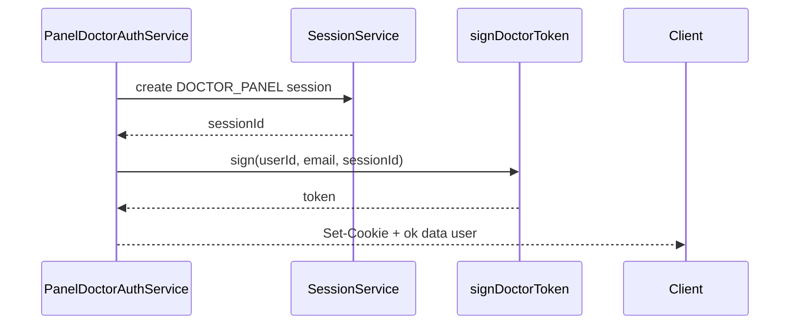

# P1-08 — Panel JWT `sid` Guard & Session Hardening

**Project:** Prani Doctor  
**Depends on:** P1-06 (sessions table), P1-04/05 (panel logout revoke), P1-07 optional (mobile refresh path)  
**Date:** 2026-05-21

---

## 1. Objective

Close the gap where **panel and mobile JWTs remain valid after server-side session revocation** until natural expiry.

| Today (post P1-06 / P1-04-05) | After P1-08 |
|-------------------------------|-------------|
| Panel login creates `UserSession` row; JWT has no `sid` | Login JWT includes `sid` = session id |
| Logout revokes **latest** ACTIVE panel session | Logout revokes session matching JWT `sid` when present |
| `me` / API guards verify JWT signature only | Guards also `assertActive(sid)` when claim present |
| Mobile JWT may include `sid`; guard ignores it | `requireMobileCustomer` rejects revoked/expired `sid` |

**Non-goals:** Panel refresh tokens, Redis session store, admin permission matrix changes, UI/RSC refactors.

---

## 2. JWT claim design (additive)

### 2.1 Panel tokens (doctor, technician, admin)

| Claim | Type | Required | Notes |
|-------|------|----------|-------|
| `sub` | string | Yes | User id — **frozen** |
| `email` | string | Yes | **frozen** |
| `role` | string | Yes | Panel role — **frozen** |
| `sid` | string | **No** (new) | `UserSession.id` — present on tokens issued after P1-08 |

**Signing change:**

```ts
// panel-doctor-token.ts (pattern for all panels)
export type DoctorJwtPayload = {
  sub: string;
  email: string;
  role: 'DOCTOR';
  sid?: string;
};

export async function signDoctorToken(
  userId: string,
  email: string,
  sessionId?: string,
): Promise<string> {
  const claims: { role: 'DOCTOR'; email: string; sid?: string } = { role: 'DOCTOR', email };
  if (sessionId) claims.sid = sessionId;
  return new SignJWT(claims) ...
}
```

**Verification:** `verifyDoctorToken` returns `sid` when in payload; invalid signature → `null` (unchanged).

### 2.2 Mobile token (already partial)

`signMobileCustomerToken(userId, sessionId?)` already sets `sid` when session id provided ([`mobile-jwt.ts`](../../pranidoctor-backend/src/modules/auth/tokens/mobile-jwt.ts)).

P1-08 only adds **guard enforcement** — no mobile JWT shape change.

---

## 3. Login flow (panel)



### 3.1 Code changes

| File | Change |
|------|--------|
| `mobile-auth-credentials.service.ts` | `recordPanelSession` → `Promise<string \| null>` returns session id |
| `panel-doctor-auth.service.ts` | `await recordPanelSession` → pass id to `signDoctorToken` |
| `panel-technician-auth.service.ts` | same |
| `panel-admin-auth.service.ts` | same |
| `tokens/panel-*-token.ts` | optional `sid` sign/verify |

**Flag:** `PANEL_JWT_SID_ENABLED` — when `false`, sign without `sid` (rollback / gradual deploy).

---

## 4. Logout flow (session invalidation)

### 4.1 Target behavior

| Step | Action |
|------|--------|
| 1 | Read session JWT from cookie (before clearing) |
| 2 | If payload contains `sid` → `SessionService.revoke(sid, 'logout')` |
| 3 | Else if `PANEL_LOGOUT_REVOKE_SESSION` → `revokeLatestPanelSession(userId, channel)` (P1-04/05 fallback) |
| 4 | Clear httpOnly cookie (unchanged) |
| 5 | Audit `LOGOUT` + `SESSION_REVOKED` (existing) |

### 4.2 Adapter wiring

`handleDoctorLogout` already calls `getDoctorSession()` then `logout(request, session?.sub)`.

**Extend to:**

```ts
const session = await getDoctorSession();
await getIdentityAuthService().doctor.logout(request, session?.sub, session?.sid);
```

Service signature:

```ts
async logout(request?: Request, userId?: string, sessionId?: string): Promise<void>
```

**Important:** `getDoctorSession()` must run **before** `clearDoctorSessionCookie` on the response (already true).

### 4.3 Admin panel

Same pattern for `prani_admin_token` / `AdminJwtPayload` + `AUTH_CHANNELS.adminPanel`.

---

## 5. Guard enforcement (`sid`)

### 5.1 Shared helper (new)

`src/modules/auth/session-guard.helper.ts`:

```ts
export async function assertJwtSessionActive(
  payload: { sub: string; sid?: string },
  channel: AuthChannel,
): Promise<'ok' | 'revoked' | 'legacy'> {
  if (!payload.sid) return 'legacy'; // no DB check
  if (!isPanelSessionGuardEnabled()) return 'legacy';
  const row = await getSessionService().assertActive(payload.sid);
  if (!row) return 'revoked';
  if (row.userId !== payload.sub) return 'revoked'; // tamper
  return 'ok';
}
```

Env: `PANEL_SESSION_GUARD_ENABLED` (default on), `MOBILE_SESSION_GUARD_ENABLED` (default on).

### 5.2 Panel `me` and API guards

| Entry point | File | Change |
|-------------|------|--------|
| `handleDoctorMe` | `doctor-auth.adapter.ts` | After `getDoctorSession()`, if guard returns `revoked` → `401 UNAUTHORIZED` |
| `requireDoctorApiActor` | `legacy/.../doctor-auth/api-guard.ts` | Same check before `resolveDoctorPanelActor` |
| Technician / admin | parallel files | same |

**HTTP codes (frozen):**

| Condition | Code | HTTP |
|-----------|------|------|
| No cookie / bad JWT | `UNAUTHORIZED` | 401 |
| Session revoked/expired | `UNAUTHORIZED` or `SESSION_REVOKED` | 401 — prefer **`UNAUTHORIZED`** for compat stability |
| Valid JWT, profile inactive | `FORBIDDEN` | 403 |

Do **not** introduce required new error codes for old clients; optional additive `SESSION_REVOKED` only if documented.

### 5.3 Mobile Bearer guard

`legacy/web/lib/mobile-auth/guard.ts` — after `verifyMobileJwt`:

```ts
if (payload.sid && isMobileSessionGuardEnabled()) {
  const active = await getSessionService().assertActive(payload.sid);
  if (!active || active.userId !== payload.sub) {
    return jsonError('UNAUTHORIZED', 'Invalid or expired token', 401);
  }
  await getSessionService().touch(payload.sid).catch(() => {});
}
```

Tokens **without** `sid` (pre-P1-06 access JWTs) continue to work until expiry.

---

## 6. Session hardening checklist

| Hardening | P1-08 action |
|-----------|--------------|
| Revoke on logout | By `sid` (panel + foundation logout-all unchanged) |
| Revoke on refresh reuse | Already P1-06 |
| Expired session | `assertActive` marks `EXPIRED` |
| Session touch | `touch(sid)` on successful guard (panel me, mobile me) |
| Multiple devices | One session row per login; logout one device/session |
| Logout-all | `logoutAllForUser` — unchanged (mobile) |

---

## 7. Device binding consistency

### 7.1 Current (P1-06)

| Event | Device behavior |
|-------|-----------------|
| OTP verify / login with `deviceKey` | `DeviceService.registerOrUpdate` → link `UserSession.deviceId` + `RefreshToken.deviceId` |
| Refresh rotate | New refresh row copies `deviceId` from previous |
| Device revoke | Sets `UserDevice.revokedAt` — **does not** auto-revoke session (gap) |

### 7.2 P1-08 scope

| Item | Priority | Behavior |
|------|----------|----------|
| Document device↔session↔refresh linkage | Required | This doc + execution report |
| On `DeviceService.revoke` | **Optional B** | Also revoke ACTIVE sessions with `deviceId` + refresh tokens for device |
| On refresh | **Optional B** | If `REFRESH_REJECT_REVOKED_DEVICE=true` and device revoked → `TOKEN_INVALID` |

**Recommendation:** implement **Optional B** behind `REFRESH_REJECT_REVOKED_DEVICE` default `false` to avoid surprise lockouts until mobile handles `DEVICE_REVOKED`.

---

## 8. Backward compatibility

| Scenario | Behavior |
|----------|----------|
| Old panel cookie (no `sid`) | Guards use legacy path (JWT-only) until cookie expires |
| New login after deploy | Cookie includes `sid`; full enforcement |
| Mobile old access JWT (no `sid`) | Guard skips DB check |
| Mobile new JWT (with `sid`) | Guard enforces when flag on |
| Logout without `sid` in JWT | `revokeLatestPanelSession` fallback |

**No forced re-login** on deploy — only new sessions pick up `sid`.

---

## 9. Files to touch (implementation checklist)

### Backend — tokens

- `src/modules/auth/tokens/panel-doctor-token.ts`
- `src/modules/auth/tokens/panel-technician-token.ts`
- `src/modules/auth/tokens/panel-admin-token.ts`

### Backend — services

- `src/modules/auth/mobile-auth-credentials.service.ts`
- `src/modules/auth/services/panel-doctor-auth.service.ts`
- `src/modules/auth/services/panel-technician-auth.service.ts`
- `src/modules/auth/services/panel-admin-auth.service.ts`
- `src/modules/auth/panel-session.helper.ts` (add `revokePanelSessionById`)
- `src/modules/auth/session-guard.helper.ts` (new)

### Backend — compat / legacy guards

- `src/modules/auth/compat/doctor-auth.adapter.ts`
- `src/modules/auth/compat/technician-auth.adapter.ts`
- `src/modules/auth/compat/admin-auth.adapter.ts` (if separate)
- `src/legacy/web/lib/doctor-auth/api-guard.ts`
- `src/legacy/web/lib/technician-auth/api-guard.ts`
- `src/legacy/web/lib/mobile-auth/guard.ts`

### Tests

- `panel-doctor-auth.service.test.ts` — logout with sid
- `session-guard.helper.test.ts` (new)
- `scripts/p1-08-verify.ts` + `npm run p1:08-verify`
- Extend `scripts/p1-verify.ts` — panel me after logout 401 with sid

---

## 10. Verification matrix

| # | Scenario | Expected |
|---|----------|----------|
| 1 | Doctor login → JWT decode contains `sid` | PASS when `PANEL_JWT_SID_ENABLED` |
| 2 | Doctor me with valid cookie | 200 |
| 3 | Doctor logout → `UserSession` for `sid` is `REVOKED` | PASS |
| 4 | Doctor me after logout | 401 `UNAUTHORIZED` |
| 5 | Technician parity | same |
| 6 | Admin parity | same |
| 7 | Mobile me with revoked session `sid` | 401 |
| 8 | Mobile me without `sid` in JWT (synthetic old token) | 200 if user valid |
| 9 | `p1:04-05-verify` + `p1:06-verify` regression | PASS |

---

## 11. Environment variables

| Key | Default | Purpose |
|-----|---------|---------|
| `PANEL_JWT_SID_ENABLED` | `true` | Issue `sid` on panel login |
| `PANEL_SESSION_GUARD_ENABLED` | `true` | DB check on panel guards when `sid` present |
| `MOBILE_SESSION_GUARD_ENABLED` | `true` | DB check on mobile Bearer when `sid` present |
| `PANEL_LOGOUT_REVOKE_SESSION` | `true` | Existing — keep enabled |
| `REFRESH_REJECT_REVOKED_DEVICE` | `false` | Optional refresh hardening |

---

## 12. Rollback

| Flag | Effect |
|------|--------|
| `PANEL_JWT_SID_ENABLED=false` | New logins omit `sid`; guards stay legacy |
| `PANEL_SESSION_GUARD_ENABLED=false` | Skip DB session checks |
| `MOBILE_SESSION_GUARD_ENABLED=false` | Mobile Bearer JWT-only again |

---

## 13. Relationship to P1-07

| Concern | Owner |
|---------|-------|
| Compat refresh route | P1-07 |
| Refresh honors `assertActive(session)` | P1-06 (unchanged) |
| Access JWT after refresh includes `sid` | P1-06 |
| Mobile guard rejects revoked `sid` | **P1-08** |

Deploy order: **P1-07 first** (mobile clients gain refresh URL), then **P1-08** (security hardening). Can ship same release if verified together.

---

## 14. Output block

```
P1_08_READY=YES
JWT_CLAIM_ADDITIVE=sid (optional)
SCHEMA_CHANGE=NONE
ROUTES_RENAMED=0
GUARDS_AFFECTED=doctor,technician,admin panel me+api; mobile Bearer
LOGOUT_CHANGE=revoke by sid with latest fallback
BREAKING_CHANGE=NO
```
