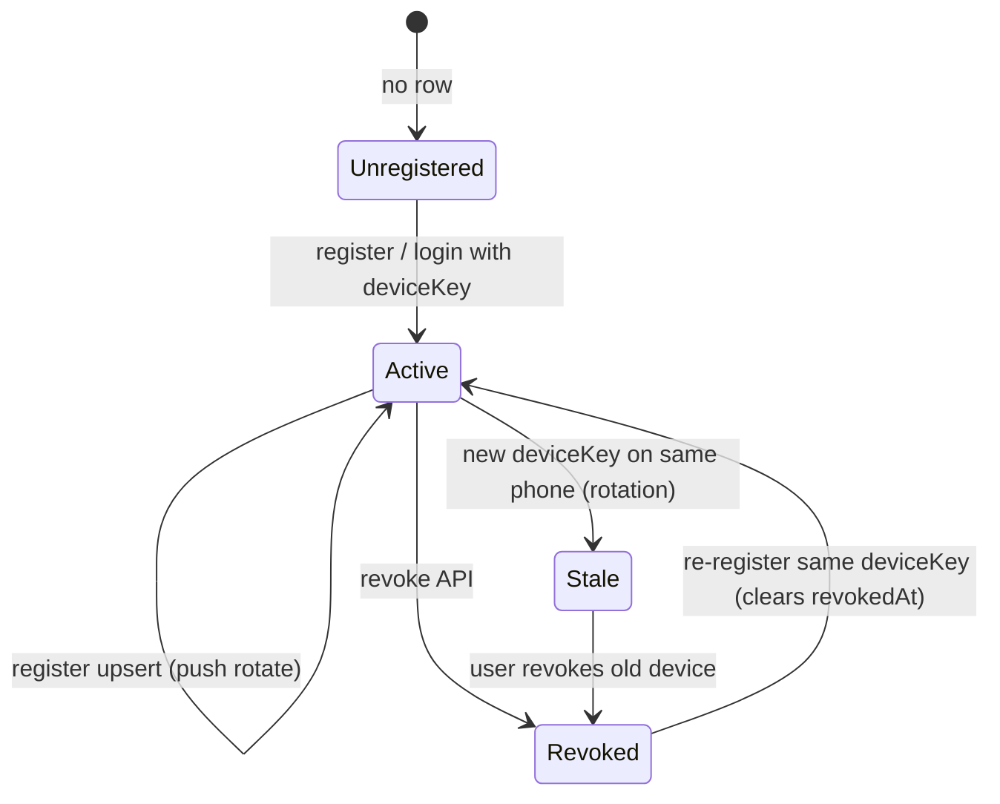
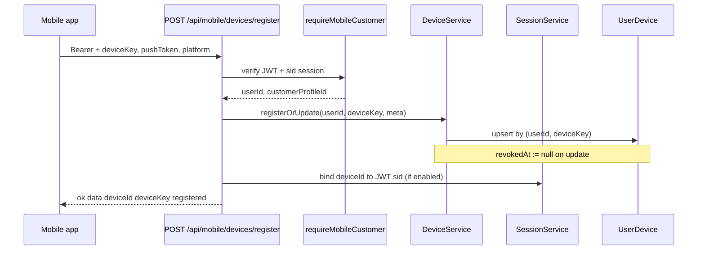
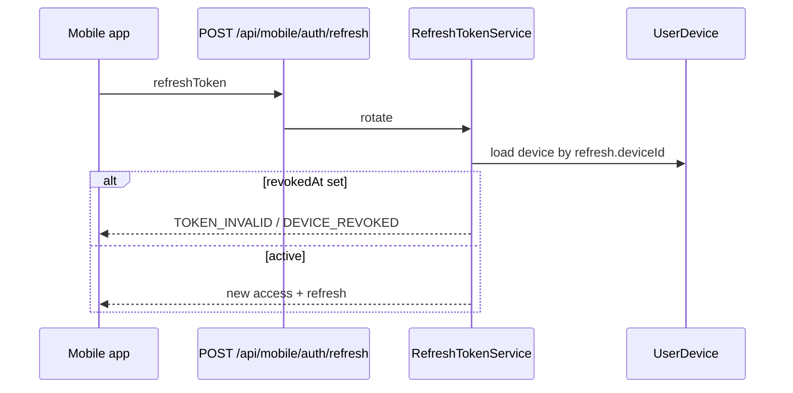

# P1-09 — Mobile Device Flow (Identity, Lifecycle, Trust)

**Project:** Prani Doctor  
**Depends on:** P1-06 (`UserDevice`), P1-07/08 (session `sid`, guards)  
**Date:** 2026-05-21

---

## 1. Objective

Document how mobile **device identity** integrates with auth, sessions, refresh, and future push delivery — without schema breaks or new UI.

**Primary route:** `POST /api/mobile/devices/register`  
**Service:** `DeviceService` (extend); reuse audit + session services.

---

## 2. Device identity model

### 2.1 Canonical fields (`UserDevice`)

| Field | Role |
|-------|------|
| `id` | Server device id (`deviceId` in API responses) |
| `userId` | Owner (from Bearer JWT `sub`) |
| `deviceKey` | **Client-stable identity** — survives app restarts until reinstall |
| `platform` | `android` \| `ios` \| `web` — routing hint |
| `pushToken` | FCM/APNs token — **push-ready**, not sent in P1-09 |
| `appVersion` | Support / compatibility telemetry |
| `lastActiveAt` | Updated on register/touch |
| `revokedAt` | `null` = trusted; set = revoked |

### 2.2 Uniqueness

```
@@unique([userId, deviceKey])
```

One row per logical handset/install identity per user. Different users may share the same `deviceKey` string in theory, but keys are scoped by `userId`.

### 2.3 What the client stores locally

| Local | Maps to |
|-------|---------|
| Generated UUID on first launch | `deviceKey` |
| FCM/APNs token from SDK | `pushToken` |
| OS name | `platform` |
| App semver | `appVersion` |

Server returns `deviceId` — store for revoke/list calls (optional B).

---

## 3. Lifecycle states



| State | `revokedAt` | Can refresh? | Can call APIs? |
|-------|-------------|----------------|----------------|
| Active | `null` | Yes (default) | Yes (valid Bearer + session) |
| Revoked | set | Optional block if flag on | Bearer may work until session ends; refresh blocked if enforced |
| Stale (old key) | `null` or set | N/A — new key is new row | Old JWT still valid until expiry/revoke |

---

## 4. Flow: Device registration (P1-09-A)



### 4.1 When to call

| Timing | Required? |
|--------|-----------|
| After OTP verify / password login | Recommended (auth paths already accept `deviceKey`) |
| After FCM token refresh | **Yes** — call register to update `pushToken` |
| On app resume (throttled) | Optional — updates `lastActiveAt` |
| Before sensitive actions | Optional future |

### 4.2 Register vs inline auth register

| Path | When | Same service? |
|------|------|---------------|
| `POST /api/mobile/auth/otp/verify` | Login | `issueMobileCredentials` → `registerOrUpdate` if `deviceKey` in body |
| `POST /api/mobile/devices/register` | Post-login / push update | `DeviceService.registerOrUpdate` |

Both paths must produce the **same** `deviceId` for the same `(userId, deviceKey)`.

---

## 5. Device replace (push token rotation)

**Replace** = same `deviceKey`, new `pushToken` / metadata.

```
Client                          Server
──────                          ──────
deviceKey: "abc-123"     →      UPSERT where userId + deviceKey
pushToken: "fcm_OLD"            pushToken := "fcm_NEW"
                                revokedAt := null
                                lastActiveAt := now()
```

No new row. `deviceId` unchanged. Suitable for FCM token rotation without reinstall.

**Response:** `registered: true` (or `replaced: true` additive flag — optional).

---

## 6. Device rotation (new install)

**Rotation** = client generates a **new** `deviceKey` (factory reset, reinstall, new phone).

```
Before: deviceKey "phone-A" → deviceId "dev_1"
After:  deviceKey "phone-B" → deviceId "dev_2"  (new row)
        "phone-A" row may remain Active until user revokes
```

| Actor action | Result |
|--------------|--------|
| User logs in on new install | New session + optionally new device row |
| User revokes old device (P1-09-B) | `dev_1.revokedAt` set; linked sessions revoked if cascade on |

**Security:** Limit active devices per user (future); Phase 1 allows multiple active rows.

---

## 7. Device revoke

### 7.1 Service (exists P1-06)

```ts
DeviceService.revoke(userId, deviceId) → sets revokedAt
```

### 7.2 HTTP (P1-09-B optional)

`DELETE /api/mobile/devices/:id`

| Step | Action |
|------|--------|
| 1 | Verify Bearer; `deviceId` belongs to `userId` |
| 2 | Set `revokedAt` |
| 3 | If `DEVICE_REVOKE_CASCADE_SESSIONS`: revoke `UserSession` where `deviceId`; revoke `RefreshToken` for those sessions |
| 4 | Audit `DEVICE_REVOKED` |

### 7.3 Client-triggered revoke

| Scenario | API |
|----------|-----|
| User logs out on this device only | Future: logout-by-device; Phase 1 uses logout-all or panel N/A |
| User removes device in settings | `DELETE /api/mobile/devices/:id` |
| Lost phone | User revokes from another device (requires list B) |

---

## 8. Device trust (session + refresh)

### 8.1 Session binding

On register, when JWT includes `sid` and `DEVICE_REGISTER_BIND_SESSION=true`:

```sql
UPDATE user_sessions SET device_id = :deviceId WHERE id = :sid AND user_id = :userId
```

Links current server session to hardware identity for audit and cascade revoke.

### 8.2 Refresh token binding

`RefreshToken.deviceId` already set when credentials issued with `deviceKey` (P1-06). Register route ensures row exists even if login omitted `deviceKey`.

### 8.3 Refresh enforcement (optional P1-09-B)

When `REFRESH_REJECT_REVOKED_DEVICE=true`:



Default **off** in P1-09-A to avoid surprising lockouts; enable in staging first.

### 8.4 Bearer guard

`requireMobileCustomer` (P1-08) checks JWT `sid` session — **not** `deviceId` directly. Device trust affects refresh and optional future per-route checks.

---

## 9. Push-ready identity (no send in P1-09)

| Concern | P1-09 | Future worker |
|---------|-------|----------------|
| Store `pushToken` | Yes | Read from `UserDevice` |
| Store `platform` | Yes | Select FCM vs APNs adapter |
| Validate token format | Loose max length | Provider verify |
| Send notification | **Out of scope** | Queue + worker |
| Token invalid callback | Out of scope | Mark device revoked |

**Data minimization:** Do not log `pushToken` in application logs; audit metadata uses `deviceId` only.

---

## 10. API contracts summary

### 10.1 POST `/api/mobile/devices/register` (required)

See [P1_09_PLAN.md](./P1_09_PLAN.md) §8.

### 10.2 GET `/api/mobile/devices` (optional B)

```json
{
  "ok": true,
  "data": {
    "devices": [
      {
        "id": "clxx…",
        "deviceKey": "550e8400-…",
        "platform": "android",
        "appVersion": "1.2.0",
        "lastActiveAt": "2026-05-21T12:00:00.000Z",
        "hasPushToken": true
      }
    ]
  }
}
```

Do **not** return raw `pushToken` in list (security).

### 10.3 DELETE `/api/mobile/devices/:id` (optional B)

```json
{ "ok": true, "data": { "revoked": true, "deviceId": "clxx…" } }
```

---

## 11. Audit events (additive)

| Action | When | Metadata |
|--------|------|----------|
| `DEVICE_REGISTERED` | Successful register upsert | `deviceId`, `platform`, `replaced: boolean` |
| `DEVICE_REVOKED` | DELETE revoke | `deviceId`, `cascade: boolean` |

Requires Prisma enum migration — **additive**, no breaking change to existing events.

---

## 12. Implementation file map

| Layer | File |
|-------|------|
| Service | `src/modules/auth/device.service.ts` |
| Helper | `src/modules/auth/device-session.helper.ts` (new) |
| Adapter | `src/modules/auth/compat/mobile-device.adapter.ts` (new) |
| Route | `src/legacy/web/routes/mobile/devices/register/route.ts` |
| Guard | Reuse `legacy/web/lib/mobile-auth/guard.ts` |
| Web | `pranidoctor-web/src/app/api/mobile/devices/register/route.ts` |
| Verify | `scripts/p1-09-verify.ts` |

---

## 13. Client integration checklist (Flutter)

| Step | Action |
|------|--------|
| 1 | Generate and persist `deviceKey` in secure storage |
| 2 | On login success, call `devices/register` with `pushToken` |
| 3 | On FCM `onTokenRefresh`, call register again (replace) |
| 4 | Store returned `deviceId` for settings / revoke |
| 5 | On reinstall, new `deviceKey` (rotation); optionally revoke old via list+delete |

---

## 14. Verification scenarios

| Scenario | Method | Pass criteria |
|----------|--------|---------------|
| Register | HTTP POST | 200 + `deviceId` |
| Replace | POST same `deviceKey` | Same `deviceId`, `revokedAt` null |
| Rotate | POST new `deviceKey` | Different `deviceId` |
| Revoke | DELETE or service | `revokedAt` set |
| Trust cascade | Revoke + refresh | 401 when flag on |
| Auth regression | OTP with `deviceKey` | Still issues credentials |

---

## 15. Rollback

| Switch / action | Effect |
|-----------------|--------|
| Remove register route | 404; clients rely on auth inline `deviceKey` only |
| `DEVICE_REGISTER_BIND_SESSION=false` | Register without session link |
| `REFRESH_REJECT_REVOKED_DEVICE=false` | Default; refresh ignores device revoke |

---

## 16. Output block

```
P1_09_READY=YES
DEVICE_MODEL_READY=YES
IDENTITY=deviceKey (client) + deviceId (server)
LIFECYCLE=register | replace | rotate | revoke
PUSH_READY=pushToken stored, no send
```
