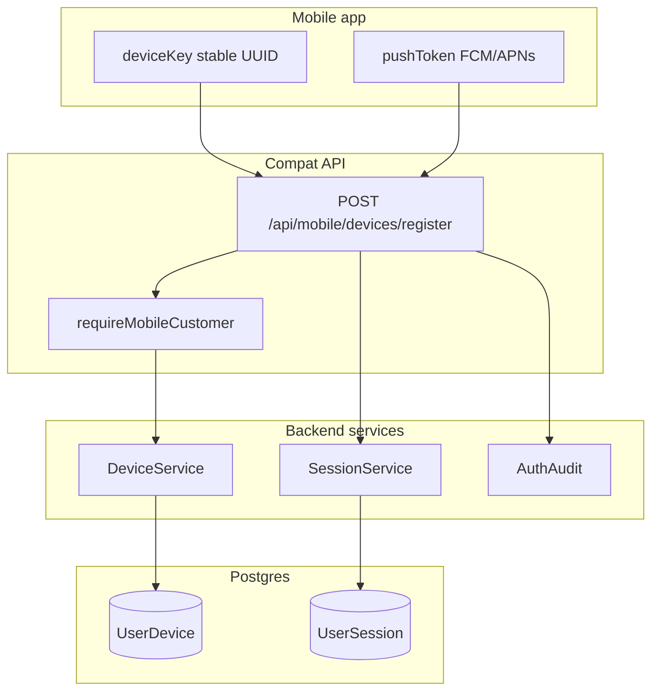

# P1-09 — Master Plan (Mobile Device Registry)

**Project:** Prani Doctor  
**Mode:** PLAN (implementation-ready)  
**Date:** 2026-05-21  
**Prerequisites:** `SESSION_HARDENED=YES`, `I18N_READY=YES` ([P1_06_CERTIFICATE](./P1_06_CERTIFICATE.md), [P1_07_08_CERTIFICATE](./P1_07_08_CERTIFICATE.md))

---

## 1. Executive summary

| Goal | Outcome |
|------|---------|
| **Device registration API** | Frozen `POST /api/mobile/devices/register` with Bearer auth and `{ ok, data }` envelope |
| **Mobile device lifecycle** | Identity (`deviceKey`), upsert/replace, rotation (new key), revoke |
| **Device trust** | Link device to `UserSession` / `RefreshToken`; optional reject refresh on revoked device |
| **Push-ready identity** | Persist `pushToken`, `platform`, `appVersion` for future notification workers (no send in P1-09) |

**Constraints:**

- No route rename
- No schema break (`UserDevice` exists from P1-06; optional additive audit enum values only)
- No UI changes (web: proxy file(s) only)

---

## 2. Current state

| Capability | Status | P1-09 action |
|------------|--------|--------------|
| `UserDevice` model + `@@unique([userId, deviceKey])` | Done (P1-06) | Reuse |
| `DeviceService.registerOrUpdate` / `revoke` / `touch` | Done (P1-06) | Extend |
| Register on OTP verify / login when `deviceKey` in body | Done (P1-06) | Keep; register route is **explicit** post-login |
| `POST /api/mobile/devices/register` | **Missing** | **Implement** |
| `GET /api/mobile/devices` | Not implemented | Optional P1-09-B |
| `DELETE /api/mobile/devices/:id` | Not implemented | Optional P1-09-B |
| `AuthAuditAction.DEVICE_*` | Not in enum | Additive migration |
| Session guard + refresh | Done (P1-07/08) | Wire device trust on refresh (optional flag) |

---

## 3. Scope split

### 3.1 P1-09-A — Required (exit criteria)

| # | Deliverable |
|---|-------------|
| 1 | `POST /api/mobile/devices/register` compat route + adapter |
| 2 | Bearer auth via `requireMobileCustomer` |
| 3 | Response `{ ok, data: { deviceId, deviceKey, registered: true } }` (additive keys allowed) |
| 4 | Audit `DEVICE_REGISTERED` (additive enum) |
| 5 | Bind `deviceId` to current JWT `sid` session when present |
| 6 | Web proxy `src/app/api/mobile/auth/../devices/register/route.ts` |
| 7 | `scripts/p1-09-verify.ts` + extend `p1:verify` |
| 8 | OpenAPI path +1 |

### 3.2 P1-09-B — Optional (same PR if low effort)

| # | Deliverable |
|---|-------------|
| 1 | `GET /api/mobile/devices` — list active devices for user |
| 2 | `DELETE /api/mobile/devices/:id` — revoke device + cascade sessions/refresh for device |
| 3 | `REFRESH_REJECT_REVOKED_DEVICE` enforcement on refresh |
| 4 | Audit `DEVICE_REVOKED` |

**Recommendation:** Implement **P1-09-A** first; add **P1-09-B** revoke/list if time permits (service layer mostly exists).

---

## 4. Architecture



---

## 5. API surface (frozen paths)

| Method | Path | Auth | P1-09 |
|--------|------|------|-------|
| POST | `/api/mobile/devices/register` | Bearer | **New** |
| GET | `/api/mobile/devices` | Bearer | Optional B |
| DELETE | `/api/mobile/devices/:id` | Bearer | Optional B |

**Unchanged:** `/api/mobile/auth/*`, panel routes, foundation `/api/auth/*`.

---

## 6. Device lifecycle semantics

| Concept | Behavior | Implementation |
|---------|----------|----------------|
| **Identity** | Client owns stable `deviceKey` (UUID v4) | `@@unique([userId, deviceKey])` |
| **Register / replace** | Same key → upsert; updates push fields; clears `revokedAt` | `DeviceService.registerOrUpdate` |
| **Rotation** | New install → new `deviceKey` → new row | Client generates new key; old rows remain until revoke |
| **Revoke** | Server marks `revokedAt` | `DeviceService.revoke` (+ optional cascade) |
| **Trust** | Active device required for refresh (optional) | Check `revokedAt` in `RefreshTokenService.rotate` |

Detail: [P1_09_DEVICE_FLOW.md](./P1_09_DEVICE_FLOW.md).

---

## 7. Implementation workstreams

### Workstream A — Service extensions

| File | Change |
|------|--------|
| `device.service.ts` | `listActiveForUser`, `revokeWithCascade` (sessions + refresh for `deviceId`) |
| `mobile-device-credentials.helper.ts` (new) | `bindDeviceToSession(sid, deviceId)` |

### Workstream B — Compat adapter + routes

| File | Change |
|------|--------|
| `compat/mobile-device.adapter.ts` (new) | `handleMobileDeviceRegister`, optional list/revoke |
| `legacy/web/routes/mobile/devices/register/route.ts` | Thin re-export |
| `legacy/web/routes/mobile/devices/route.ts` | Optional GET |
| `legacy/web/routes/mobile/devices/[id]/route.ts` | Optional DELETE |

### Workstream C — Web proxy

| File | Change |
|------|--------|
| `pranidoctor-web/src/app/api/mobile/devices/register/route.ts` | `proxyRouteToBackend` |
| Optional list/revoke proxies | Same pattern |

### Workstream D — Schema (additive only)

| Change | Notes |
|--------|-------|
| `AuthAuditAction` + `DEVICE_REGISTERED`, `DEVICE_REVOKED` | Prisma migrate dev |
| No `UserDevice` column changes | Model ready |

### Workstream E — Verification

| Command | Expect |
|---------|--------|
| `npm run build` | PASS |
| `npm run p1:09-verify` | Register, upsert, revoke, list |
| `npm run p1:verify` | Regression PASS |
| `npm run openapi:generate` | 174+ paths |
| `npm run e2e:freeze` | PASS |

---

## 8. Request / response (register)

### Request

```json
{
  "deviceKey": "550e8400-e29b-41d4-a716-446655440000",
  "platform": "android",
  "pushToken": "fcm-token-optional",
  "appVersion": "1.2.0"
}
```

| Field | Required | Notes |
|-------|----------|-------|
| `deviceKey` | Yes | 1–128 chars; client-stable |
| `platform` | No | `android` \| `ios` \| `web` (validated loosely) |
| `pushToken` | No | Push-ready; max 512 |
| `appVersion` | No | Max 32 |

### Success — 200

```json
{
  "ok": true,
  "data": {
    "deviceId": "clxx…",
    "deviceKey": "550e8400-e29b-41d4-a716-446655440000",
    "registered": true
  }
}
```

`deviceId` is server id (`UserDevice.id`). `deviceKey` echo confirms identity.

### Errors (compat)

| Code | HTTP | When |
|------|------|------|
| `UNAUTHORIZED` | 401 | Missing/invalid Bearer |
| `INVALID_JSON` | 400 | Body parse fail |
| `VALIDATION_ERROR` | 422 | Zod fail |
| `FORBIDDEN` | 403 | Not a customer |

---

## 9. Relationship to auth flows

| Flow | Device behavior |
|------|-----------------|
| OTP verify / login with `deviceKey` | Still registers inline (P1-06) — **no change** |
| POST register after login | Explicit push token update + session bind |
| Refresh | Existing `deviceId` on `RefreshToken` row preserved on rotate |
| Logout-all | Does not delete `UserDevice` rows (revoke sessions only) |
| Device revoke | Sets `revokedAt`; optional cascade kills device-bound sessions |

**Client guidance:** Call register after every login and when FCM token rotates.

---

## 10. Feature flags

| Env | Default | Purpose |
|-----|---------|---------|
| `DEVICE_REGISTER_BIND_SESSION` | `true` | Attach `deviceId` to JWT `sid` session |
| `REFRESH_REJECT_REVOKED_DEVICE` | `false` | Block refresh if device revoked (P1-09-B) |
| `DEVICE_REVOKE_CASCADE_SESSIONS` | `true` | Revoke sessions/refresh linked to device on DELETE |

---

## 11. Verification matrix

| # | Test | Expect |
|---|------|--------|
| 1 | Register without Bearer | 401 |
| 2 | Register with Bearer | 200 `deviceId` |
| 3 | Re-register same `deviceKey` | 200 same `deviceId`, `revokedAt` cleared |
| 4 | New `deviceKey` (rotation) | New `deviceId` |
| 5 | Revoke device (API or service) | `revokedAt` set |
| 6 | Refresh after revoke (flag on) | 401 `DEVICE_REVOKED` or `TOKEN_INVALID` |
| 7 | OTP login with `deviceKey` still works | Regression |
| 8 | `p1:verify` full suite | PASS |

---

## 12. Risk register

| Risk | Mitigation |
|------|------------|
| Duplicate register paths (auth vs devices/register) | Same `DeviceService`; idempotent upsert |
| Push token PII in DB | Existing model; no logging of token values |
| Enum migration in prod | Additive only; deploy migrate before code |
| Stale device rows | List + revoke endpoints; future cleanup job out of scope |

---

## 13. Deliverables (this PLAN)

| Document | Purpose |
|----------|---------|
| [P1_09_PLAN.md](./P1_09_PLAN.md) | Master plan (this file) |
| [P1_09_DEVICE_FLOW.md](./P1_09_DEVICE_FLOW.md) | Lifecycle + trust flows |

**Post-implementation:** `P1_09_EXECUTION.md`, `P1_09_CERTIFICATE.md`

---

## 14. References

- [P1_06_CERTIFICATE.md](./P1_06_CERTIFICATE.md) — `UserDevice`, `DeviceService`
- [P1_06_API.md](./P1_06_API.md) — §5 deferred routes
- [P1_06_DB.md](./P1_06_DB.md) — `UserDevice` model
- [P1_07_08_CERTIFICATE.md](./P1_07_08_CERTIFICATE.md) — session guard
- [PHASE1_API_MAP.md](./PHASE1_API_MAP.md) — §5 additive endpoints
- [PHASE1_IMPLEMENTATION_SEQUENCE.md](./PHASE1_IMPLEMENTATION_SEQUENCE.md) — P1-09 section
- Backend: `src/modules/auth/device.service.ts`, `mobile-auth-credentials.service.ts`

---

## 15. Output block

```
P1_09_READY=YES
DEVICE_MODEL_READY=YES
BREAKING_CHANGE=NO
SCHEMA_CHANGE=ADDITIVE (AuthAuditAction enum only)
ROUTES_ADDED=POST /api/mobile/devices/register
ROUTES_OPTIONAL=GET /api/mobile/devices, DELETE /api/mobile/devices/:id
WEB_CHANGE=proxy only
NEXT_IMPLEMENT=P1-09-A then P1-09-B
```
