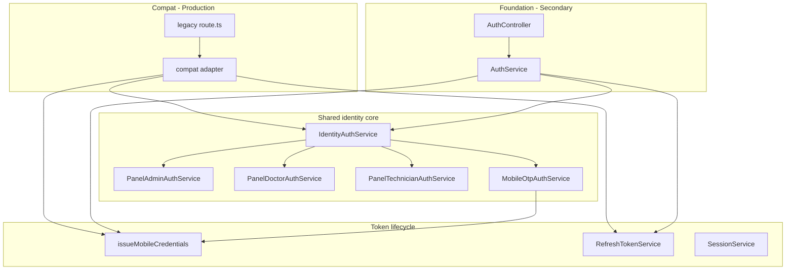

# P1-10 — Auth Delegation Map

**Project:** Prani Doctor  
**Mode:** PLAN (canonical ownership reference)  
**Date:** 2026-05-21  
**Rule:** Production clients use **compat** paths. Foundation `/api/auth` is for **secondary** integrators only.

---

## 1. Legend

| Symbol | Meaning |
|--------|---------|
| **C** | Compat route (`legacy/web/routes` → adapter) |
| **F** | Foundation route (`AuthModule` → `AuthController`) |
| **IDS** | `IdentityAuthService` |
| **AS** | `AuthService` (foundation facade) |
| **MAC** | `mobile-auth-credentials.service` |
| **RTS** | `RefreshTokenService` |
| **DS** | `DeviceService` |
| **i18n** | `modules/auth/i18n` |

**Envelopes (frozen):**

| Channel | Success | Error |
|---------|---------|-------|
| Compat | `{ ok: true, data }` | `{ ok: false, error: { code, message } }` |
| Foundation | `{ success: true, data }` | `{ success: false, error: { code, message, requestId } }` |

---

## 2. System diagram



---

## 3. Route ownership matrix

### 3.1 Admin panel

| Method | Path | Owner | Handler | Service chain | Envelope |
|--------|------|-------|---------|---------------|----------|
| POST | `/api/admin/auth/login` | **C** | `handleAdminLogin` | `IDS.admin.login` | `{ ok }` |
| POST | `/api/admin/auth/logout` | **C** | `handleAdminLogout` | `IDS.admin.logout` → revoke `sid` | `{ ok }` |
| GET | `/api/admin/auth/me` | **C** | `handleAdminMe` | `IDS.admin.resolveActor` + session guard | `{ ok }` |

Foundation: **none** (by design).

---

### 3.2 Doctor panel

| Method | Path | Owner | Handler | Service chain | Envelope |
|--------|------|-------|---------|---------------|----------|
| POST | `/api/doctor/auth/login` | **C** | `handleDoctorLogin` | `IDS.doctor.login` | `{ ok }` |
| POST | `/api/doctor/auth/logout` | **C** | `handleDoctorLogout` | `IDS.doctor.logout` | `{ ok }` |
| GET | `/api/doctor/auth/me` | **C** | `handleDoctorMe` | `IDS.doctor.resolveActor` + `assertJwtSessionActive` | `{ ok }` |

---

### 3.3 Technician panel

| Method | Path | Owner | Handler | Service chain | Envelope |
|--------|------|-------|---------|---------------|----------|
| POST | `/api/technician/auth/login` | **C** | `handleTechnicianLogin` | `IDS.technician.login` | `{ ok }` |
| POST | `/api/technician/auth/logout` | **C** | `handleTechnicianLogout` | `IDS.technician.logout` | `{ ok }` |
| GET | `/api/technician/auth/me` | **C** | `handleTechnicianMe` | `IDS.technician.resolveActor` | `{ ok }` |

---

### 3.4 Mobile customer — auth (compat)

| Method | Path | Owner | Handler | Service chain | Notes |
|--------|------|-------|---------|---------------|-------|
| POST | `/api/mobile/auth/otp/request` | **C** | `handleMobileOtpRequest` | `IDS.mobileOtp.request` | BN errors frozen |
| POST | `/api/mobile/auth/otp/verify` | **C** | `handleMobileOtpVerify` | `IDS.mobileOtp.verify` → `MAC.issue` | optional refresh |
| POST | `/api/mobile/auth/send-otp` | **C** | alias → otp/request | same | frozen alias |
| POST | `/api/mobile/auth/verify-otp` | **C** | alias → otp/verify | same | frozen alias |
| POST | `/api/mobile/auth/login` | **C** | `handleMobileLogin` | `customer-credentials-service` | i18n via adapter |
| POST | `/api/mobile/auth/register` | **C** | `handleMobileRegister` | credentials + `MAC.issue` | |
| POST | `/api/mobile/auth/refresh` | **C** | `handleMobileRefresh` | `RTS.rotate` | i18n; 401 on invalid |
| GET | `/api/mobile/me` | **C** | `mobile/me/route` | guard + Prisma profile | `locale` P1-11 |
| POST | `/api/mobile/devices/register` | **C** | `handleMobileDeviceRegister` | `DS` + session bind | i18n |
| GET | `/api/mobile/devices` | **C** | `handleMobileDeviceList` | `DS` | |
| DELETE | `/api/mobile/devices/:id` | **C** | `handleMobileDeviceRevoke` | `DS.revokeWithCascade` | |

**Compat must not call `AuthService`.**

---

### 3.5 Mobile customer — foundation

| Method | Path | Owner | Handler | Service chain | Notes |
|--------|------|-------|---------|---------------|-------|
| POST | `/api/auth/otp/request` | **F** | `AuthController.requestOtp` | **AS** → `IDS.mobileOtp` | same logic as compat |
| POST | `/api/auth/otp/verify` | **F** | `AuthController.verifyOtp` | **AS** → `IDS.mobileOtp` → **MAC** | P1-10: dedupe MAC |
| POST | `/api/auth/login` | **F** | alias → verifyOtp | same | OTP-login alias |
| POST | `/api/auth/token/refresh` | **F** | `AuthController.refreshToken` | **AS** → **RTS** | P1-10: add refreshToken in data |
| POST | `/api/auth/refresh` | **F** | alias → token/refresh | same | |
| POST | `/api/auth/logout` | **F** | `AuthController.logout` | **AS** → `logoutAllForUser` | P1-10: Bearer→userId |

---

## 4. Service ownership

| Service | Owns | Called by |
|---------|------|-----------|
| `PanelAdminAuthService` | Admin login, cookie JWT, actor resolve | Compat admin adapter only |
| `PanelDoctorAuthService` | Doctor panel gate | Compat doctor adapter |
| `PanelTechnicianAuthService` | Technician panel gate | Compat technician adapter |
| `MobileOtpAuthService` | OTP challenge CRUD, rate limits, SMS dispatch | IDS.mobileOtp; **AS.requestOtp/verifyOtp** |
| `customer-credentials-service` | Password register/login validation | Compat mobile adapter only |
| `mobile-auth-credentials.service` | Session + refresh issue, logout-all | Compat adapters, **AS.verifyOtp**, OTP verify |
| `RefreshTokenService` | Hash rotate, reuse detection | Compat refresh, **AS.refreshToken** |
| `SessionService` | DB session rows, assert active | Guards, refresh, device bind |
| `DeviceService` | Device registry | Compat device adapter, inline OTP/login hints |
| `AuthService` | Foundation facade only | **AuthController only** |
| `permissions.registry` | Admin capability matrix | Admin routes (not auth paths) |

---

## 5. Delegation chains (detailed)

### 5.1 OTP request

```
Compat:  route → handleMobileOtpRequest → IDS.mobileOtp.request(phone, req)
         → MobileOtpAuthService → Prisma MobileOtpChallenge → SMS

Foundation: route → AuthController.requestOtp → AS.requestOtp(phone)
         → IDS.mobileOtp.request(phone)  [SAME]
         → DTO toOtpRequestResponseDto → { success, data }
```

**P1-10 gap:** AS collapses failure to `success: false`; controller throws generic 429. Compat preserves `result.code` + BN message.

---

### 5.2 OTP verify + credentials

```
Compat:  route → handleMobileOtpVerify → IDS.mobileOtp.verify
         → issueMobileCredentials(userId, request, deviceHints)
         → jsonOk { accessToken, refreshToken?, ... }

Foundation: route → AuthController.verifyOtp → AS.verifyOtp
         → IDS.mobileOtp.verify → issueMobileCredentials  [SAME helper after P1-10]
         → toOtpVerifyResponseDto → { success, data: { tokens, user } }
```

---

### 5.3 Refresh

```
Compat:  POST /api/mobile/auth/refresh
         → handleMobileRefresh → RTS.rotate(raw, auditCtx)
         → authJsonError TOKEN_INVALID 401

Foundation: POST /api/auth/token/refresh
         → AuthController.refreshToken → AS.refreshToken → RTS.rotate  [SAME]
         → BadRequestError TOKEN_INVALID 400  [FROZEN - do not change]
```

| Field | Compat `data` | Foundation `data` (P1-10 target) |
|-------|---------------|--------------------------------|
| `accessToken` | yes | yes |
| `expiresIn` / `expiresInSeconds` | yes | `expiresIn` |
| `refreshToken` | yes (rotated) | **add** rotated raw token |
| `tokenType` | `Bearer` | optional additive |

---

### 5.4 Logout all

```
Compat:  (no dedicated logout-all route in frozen 16 — via session tests / future)

Foundation: POST /api/auth/logout
         → AuthController.logout → AS.revokeToken(userId)
         → logoutAllForUser → SessionService + RTS.revoke all
```

**P1-10:** Resolve `userId` from Bearer when middleware absent.

---

### 5.5 Session guard (Bearer)

```
requireMobileCustomer (guard.ts)
  → verifyMobileJwt
  → assertJwtSessionActive (P1-08)
  → authJsonError if revoked (i18n P1-11)
```

Used by: mobile compat routes (devices, me, …) — **not** foundation controller.

---

### 5.6 Permission deny (admin)

```
assertAdminCan(actor, capability, request?)
  → compatAuthJsonError FORBIDDEN + PERMISSION_DENIED i18n
```

Not on auth login routes — on admin capability routes.

---

## 6. Bypass register (must be empty after P1-10)

| # | Bypass | Status | Action |
|---|--------|--------|--------|
| 1 | `AuthService` throws migration pending | Removed P1-03 | Grep guard in CI |
| 2 | Compat → `AuthService` direct | None | Forbid in review |
| 3 | `AuthController` → legacy `otp-service.ts` | None | Use IDS only |
| 4 | `_archived_foundation/auth.service` in runtime import | None | Test/grep |
| 5 | Duplicate `legacy-web/otp-service.ts` logic | **Open** | Re-export or delete |
| 6 | Foundation `verifyOtp` duplicate Prisma | **Open** | Use MAC helper |
| 7 | Parallel refresh in archived code | N/A | Archive only |

---

## 7. Import bridges (legacy path stability)

Web and legacy guards import `@/lib/mobile-auth/*` and `@/lib/*-auth/*`.

| Legacy path | Canonical module (target) |
|-------------|---------------------------|
| `legacy/web/lib/mobile-auth/otp-messages.ts` | `i18n/messages.bn-BD` |
| `legacy/web/lib/mobile-auth/customer-credentials-messages.ts` | `i18n/messages.bn-BD` |
| `legacy/web/lib/mobile-auth/jwt.ts` | `tokens/mobile-jwt.ts` |
| `legacy/web/lib/mobile-auth/guard.ts` | stays; calls `session-guard.helper` + i18n |
| `modules/auth/legacy-web/*` | **Remove duplicates** — bridge only |

---

## 8. HTTP semantics matrix (intentional differences)

| Scenario | Compat | Foundation | Align in P1-10? |
|----------|--------|------------|----------------|
| Invalid refresh | 401 `TOKEN_INVALID` | 400 `TOKEN_INVALID` | **No** (frozen) |
| OTP wrong code | 4xx + BN message | 400 `OTP_INVALID` EN | **No** for OTP BN |
| OTP rate limit | 429 + code | 429 generic | Map codes optional |
| Login wrong password | 401 + code | N/A (no F route) | — |
| Panel bad password | 401 `INVALID_CREDENTIALS` | N/A | — |

---

## 9. Audit event ownership

| Event | Emitted from |
|-------|----------------|
| `LOGIN_SUCCESS` / `LOGIN_FAILURE` | Panel services, credentials login |
| `OTP_REQUEST` / `OTP_VERIFY_*` | `MobileOtpAuthService` |
| `REFRESH_SUCCESS` / `REFRESH_FAILURE` | `RefreshTokenService` |
| `LOGOUT` / `SESSION_REVOKED` | Panel logout, `logoutAllForUser`, device revoke |
| `DEVICE_REGISTERED` / `DEVICE_REVOKED` | `DeviceService` |
| `PERMISSION_DENIED` | `permissions.registry` |

Foundation and compat share the **same** `recordAuthAuditFireAndForget` helper.

---

## 10. Web proxy (unchanged)

| Web file | Backend target |
|----------|----------------|
| `src/app/api/admin/auth/**` | Compat admin auth |
| `src/app/api/doctor/auth/**` | Compat doctor auth |
| `src/app/api/technician/auth/**` | Compat technician auth |
| `src/app/api/mobile/auth/**` | Compat mobile auth |
| `src/app/api/mobile/me/**` | Compat mobile me |
| `src/app/api/mobile/devices/**` | Compat devices (P1-09) |

No foundation auth proxy on web in P1-10.

---

## 11. Verification mapping

| `p1-10-verify` check | Proves |
|----------------------|--------|
| Foundation OTP request 200 | AS → IDS chain live |
| Foundation refresh rotate | AS → RTS |
| Foundation logout | AS → logoutAllForUser |
| Compat OTP still `{ ok }` | No regression |
| Grep no `_archived_foundation` import | No bypass activation |
| `AuthService` unit test mocks IDS | Thin facade |

---

## 12. References

- [P1_10_PLAN.md](./P1_10_PLAN.md)
- [API_CONTRACT_FREEZE.md](./API_CONTRACT_FREEZE.md)
- [PHASE1_API_MAP.md](./PHASE1_API_MAP.md)
- Backend: `src/modules/auth/identity-auth.service.ts`, `auth.service.ts`, `compat/*.adapter.ts`

---

*Delegation map version: P1-10 PLAN. Update after implementation in P1_10_EXECUTION.md.*
