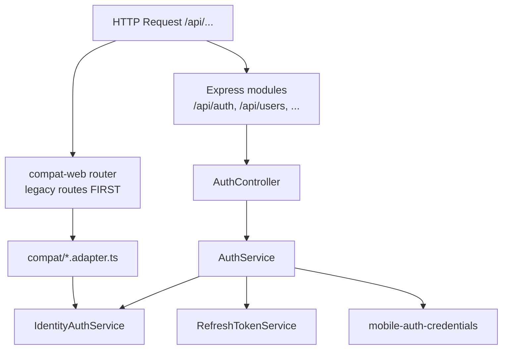

# P1-10 — Master Plan (Foundation Delegation & Route Ownership)

**Project:** Prani Doctor  
**Mode:** PLAN (implementation-ready)  
**Date:** 2026-05-21  
**Prerequisites:** `AUTH_READY=YES`, `LOCALE_READY=YES` ([P1_03_CERTIFICATE](./P1_03_CERTIFICATE.md), [P1_11_CERTIFICATE](./P1_11_CERTIFICATE.md))

---

## 1. Executive summary

| Goal | Outcome |
|------|---------|
| **Foundation delegation** | `/api/auth/*` delegates to the **same** identity services as compat — no parallel OTP/refresh implementations |
| **Remove AuthService bypass** | Eliminate duplicate orchestration, stub paths, and `AUTH_MIGRATION_PENDING` references; `AuthService` becomes a thin facade |
| **Route ownership cleanup** | Document and enforce who owns each auth path; remove duplicate `modules/auth/legacy-web/` sources |

**Constraints ([API_CONTRACT_FREEZE.md](./API_CONTRACT_FREEZE.md)):**

- No route rename
- No schema break
- No envelope changes (`{ ok, data }` vs `{ success, data }` remain channel-specific)
- No frontend / web proxy changes

---

## 2. Current state (post P1-03 … P1-11)

### 2.1 Runtime mount order



| Layer | Mount | Auth paths |
|-------|-------|------------|
| **Compat** | `app.use('/api', compatRouter)` | **172** legacy paths incl. **16** auth route files |
| **Foundation** | `loadModules` → `/api/auth` | **6** endpoints (OTP, refresh, logout aliases) |

Compat is registered **before** modules ([`server.ts`](../../pranidoctor-backend/src/server.ts)); there is **no path collision** today (`/api/mobile/auth/*` vs `/api/auth/otp/*`).

### 2.2 What P1-03 already fixed

| Item | Status |
|------|--------|
| `AUTH_MIGRATION_PENDING` throw | **Removed** — `AuthService` calls `IdentityAuthService` |
| Compat adapters → `getIdentityAuthService()` | **Done** (panel + mobile OTP) |
| Foundation OTP request/verify | **Live** via `AuthService` → `mobileOtp` |

### 2.3 Remaining gaps (P1-10 scope)

| Gap | Risk | P1-10 fix |
|-----|------|-----------|
| `AuthService.verifyOtp` re-implements credential issue (Prisma + `issueMobileCredentials`) | Drift vs compat adapter | Extract `issueMobileCredentialsAfterOtp()` shared helper; foundation + compat call same |
| `AuthService.requestOtp` maps all failures to `success: false` only | Foundation clients lose OTP error codes | Delegate failure metadata from `MobileOtpAuthService` or map codes in controller |
| `AuthController` uses generic `TooManyRequestsError` / `BadRequestError` | HTTP/status differ from compat for same OTP failure | `foundation-auth.mapper.ts` — map service codes → Express errors **or** document matrix |
| Foundation refresh DTO omits rotated `refreshToken` | P1-06 API doc vs implementation | Extend `toRefreshTokenResponseDto` (additive field) |
| Foundation `logout` reads `req.userId` without middleware | Logout noop for unauthenticated calls | Document + optional Bearer→userId helper (additive) |
| `modules/auth/legacy-web/*` duplicate | Two sources of truth | Delete or re-export-only after grep audit |
| Panel/password auth **only** on compat | Intentional — document in ownership map | No foundation panel routes in P1-10 |

---

## 3. Target architecture

```
┌─────────────────────────────────────────────────────────────────┐
│                     IdentityAuthService                        │
│  admin │ doctor │ technician │ mobileOtp                        │
└────────────────────────────┬────────────────────────────────────┘
                             │
         ┌───────────────────┼───────────────────┐
         ▼                   ▼                   ▼
  compat/*.adapter     AuthService (thin)   mobile-auth-credentials
  { ok, data }         foundation only      (issue/revoke tokens)
         │                   │
         │                   ▼
         │            AuthController
         │            { success, data }
         ▼
  legacy/web/routes/**/route.ts  (thin re-export only)
```

**Rule:** No business logic in route files or `AuthController` beyond validation + DTO mapping.

---

## 4. Scope split

### 4.1 P1-10-A — AuthService facade (required)

| # | Task |
|---|------|
| 1 | Rename/clarify: `AuthService` = **foundation facade only** (comment + interface) |
| 2 | `requestOtp` / `verifyOtp` → delegate to `identity.mobileOtp` + shared credential issuer |
| 3 | `refreshToken` → `getRefreshTokenService().rotate` only (already true) |
| 4 | `revokeToken` → `logoutAllForUser` only (already true) |
| 5 | Remove direct `getPrisma()` from `AuthService` except via shared helper |
| 6 | Grep and delete `AUTH_MIGRATION_PENDING` from code + stale docs |

### 4.2 P1-10-B — Foundation controller alignment (required)

| # | Task |
|---|------|
| 1 | Add `foundation-auth.mapper.ts` — map `OtpServiceFailure` codes to `AppError` subclasses |
| 2 | `verifyOtp` failure: preserve `OTP_INVALID` / rate-limit semantics where possible |
| 3 | `refreshToken` response: include `refreshToken` + `refreshExpiresIn` when rotated (additive) |
| 4 | `logout`: resolve `userId` from Bearer JWT when `req.userId` absent (additive, no new route) |

### 4.3 P1-10-C — Route ownership cleanup (required)

| # | Task |
|---|------|
| 1 | Publish [P1_10_DELEGATION_MAP.md](./P1_10_DELEGATION_MAP.md) as source of truth |
| 2 | Audit `modules/auth/legacy-web/` — re-export to `legacy/web/lib` or delete duplicates |
| 3 | Ensure compat adapters never import `AuthService` (only `IdentityAuthService` + credentials) |
| 4 | OpenAPI: annotate foundation `/api/auth` delegation target in description |

### 4.4 P1-10-D — Verification (required)

| # | Task |
|---|------|
| 1 | `scripts/p1-10-verify.ts` — foundation OTP/refresh/logout parity with service layer |
| 2 | Extend `p1:verify` foundation row: refresh returns rotated token in `data` |
| 3 | Unit test: `AuthService` mocks `IdentityAuthService` only (no legacy otp-service import) |

**Out of scope P1-10:**

- Merging `{ ok }` and `{ success }` envelopes
- Foundation panel login routes
- Moving `/api/mobile/auth/*` to foundation paths
- Redis OTP store switch (ops / later)

---

## 5. Delegation chain (canonical)

### 5.1 Mobile OTP (both channels)

| Step | Compat | Foundation |
|------|--------|------------|
| HTTP | `POST /api/mobile/auth/otp/request` | `POST /api/auth/otp/request` |
| Handler | `handleMobileOtpRequest` | `AuthController.requestOtp` |
| Service | `IdentityAuthService.mobileOtp` | `AuthService` → same |
| Storage | `MobileOtpAuthService` + Prisma `MobileOtpChallenge` | same |
| Response | `{ ok, data }` + Bengali errors (frozen) | `{ success, data }` |

### 5.2 Mobile refresh

| Step | Compat | Foundation |
|------|--------|------------|
| HTTP | `POST /api/mobile/auth/refresh` | `POST /api/auth/token/refresh` |
| Handler | `handleMobileRefresh` | `AuthController.refreshToken` |
| Service | `RefreshTokenService.rotate` | `AuthService` → same |
| Envelope | `{ ok, data }` + `TOKEN_INVALID` → **401** | `{ success, data }` + **400** (frozen per channel) |

### 5.3 Panel auth (compat only)

| Panel | Routes | Service |
|-------|--------|---------|
| Admin | `/api/admin/auth/login|logout|me` | `PanelAdminAuthService` |
| Doctor | `/api/doctor/auth/*` | `PanelDoctorAuthService` |
| Technician | `/api/technician/auth/*` | `PanelTechnicianAuthService` |

Foundation **does not** expose panel login in P1-10.

---

## 6. AuthService bypass removal checklist

| Anti-pattern | Current | Target |
|--------------|---------|--------|
| Throw `AUTH_MIGRATION_PENDING` | Gone | Never reintroduce |
| Compat imports `AuthService` | None found | Forbidden by lint/doc |
| Duplicate OTP in `legacy-web/otp-service.ts` | Exists | Re-export or delete |
| `AuthService` owns Prisma queries | `verifyOtp` user fetch | Move to `mobile-auth-credentials` or `mobile-otp-auth` |
| Foundation logout without user | `userId` optional | Resolve from JWT or document no-op |
| Parallel refresh implementation | None | Keep single `RefreshTokenService` |

---

## 7. File plan

| Path | Action |
|------|--------|
| `auth.service.ts` | Thin facade refactor |
| `foundation-auth.mapper.ts` | **New** — OTP/refresh error mapping |
| `auth.controller.ts` | Use mapper; extend refresh DTO |
| `auth.dto.ts` | Additive `refreshToken` in refresh response |
| `mobile-auth-credentials.service.ts` | Optional `issueAfterOtpVerify(userId, request, hints)` |
| `modules/auth/legacy-web/**` | Re-export cleanup / delete |
| `scripts/p1-10-verify.ts` | **New** |
| `package.json` | `"p1:10-verify"` script |
| `docs/P1_10_DELEGATION_MAP.md` | Ownership matrix |
| `docs/P1_10_EXECUTION.md` | Post-impl |
| `docs/P1_10_CERTIFICATE.md` | Post-impl |

**No web repo changes.**

---

## 8. Verification plan

| Command | Expect |
|---------|--------|
| `npm run build` | PASS |
| `npm run p1:10-verify` | Foundation OTP request 200 (dev OTP); refresh rotate; logout revokes |
| `npm run p1:verify` | 23/23 + foundation refresh field check |
| `npm run p1:auth-compat` | PASS |
| `npm run e2e:freeze` | 9/9 |
| `npx vitest run src/modules/auth/` | Include `auth.service` delegation test |

### 8.1 `p1-10-verify` scenarios

1. `POST /api/auth/otp/request` — `{ success: true }` shape  
2. `POST /api/auth/token/refresh` — invalid token → `TOKEN_INVALID`  
3. Valid refresh — `data.refreshToken` present when rotation on  
4. `POST /api/auth/logout` with Bearer — sessions cleared  
5. Compat `POST /api/mobile/auth/otp/request` still `{ ok: true }` (regression)  
6. No import of `_archived_foundation` in production `src/modules/auth` (grep gate)

---

## 9. Risk register

| Risk | Mitigation |
|------|------------|
| Foundation OTP HTTP codes differ from compat | Document in DELEGATION_MAP; do not align without version bump |
| Deleting `legacy-web` breaks import | Grep all `@/lib/mobile-auth` bridges first |
| Logout JWT parsing security | Reuse `verifyMobileJwt`; customer role only |
| Refresh DTO additive field | Old foundation clients ignore extra keys |

---

## 10. Exit criteria

```
P1_10_READY=YES
DELEGATION_READY=YES
```

When:

- [ ] `AuthService` is a thin facade over `IdentityAuthService` + token services  
- [ ] No `AUTH_MIGRATION_PENDING` in codebase  
- [ ] Foundation refresh returns rotated `refreshToken` when enabled  
- [ ] `P1_10_DELEGATION_MAP.md` matches code  
- [ ] `p1:10-verify` passes  
- [ ] `legacy-web` duplicate resolved  

**Next:** **P1-12** — E2E auth certificate / Phase 1 release gate.

---

## 11. References

- [API_CONTRACT_FREEZE.md](./API_CONTRACT_FREEZE.md)
- [PHASE1_IMPLEMENTATION_SEQUENCE.md](./PHASE1_IMPLEMENTATION_SEQUENCE.md) § P1-10
- [P1_03_MIGRATION_PLAN.md](./P1_03_MIGRATION_PLAN.md)
- [P1_06_API.md](./P1_06_API.md) — foundation DTOs
- [P1_07_REFRESH.md](./P1_07_REFRESH.md) — compat vs foundation refresh HTTP codes
