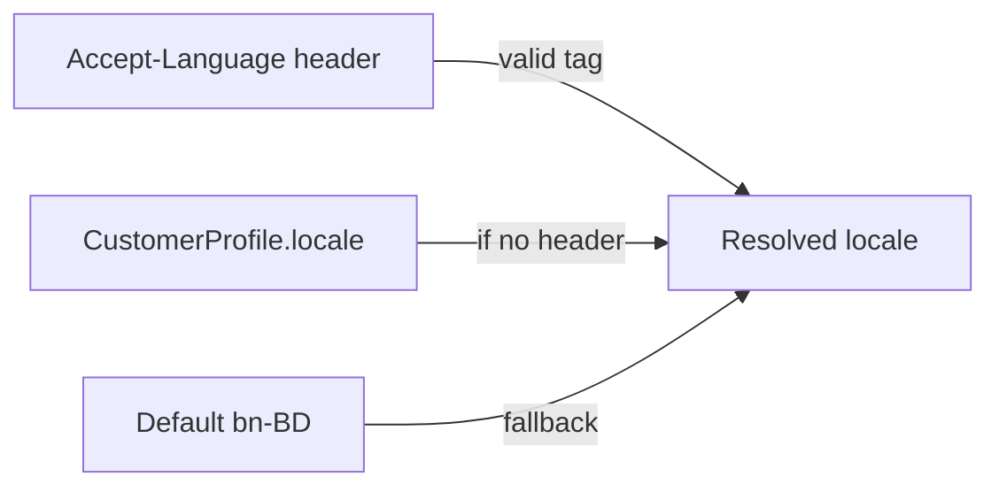

# P1-11 — Master Plan (Auth Localization & Error Catalog)

**Project:** Prani Doctor  
**Mode:** PLAN (implementation-ready)  
**Date:** 2026-05-21  
**Prerequisites:** `DEVICE_READY=YES`, `I18N_READY=YES` ([P1_09_CERTIFICATE](./P1_09_CERTIFICATE.md), [P1_07_08_CERTIFICATE](./P1_07_08_CERTIFICATE.md))

---

## 1. Executive summary

| Goal | Outcome |
|------|---------|
| **Auth localization** | Single backend-owned catalog for auth-related user-visible strings |
| **Bangla messages** | `bn` / `bn-BD` as default; preserve existing Bengali OTP copy byte-for-byte on frozen routes |
| **English messages** | `en` / `en-US` parallel catalog for clients that send `Accept-Language: en` |
| **Locale exposure** | `CustomerProfile.locale` on `GET/PATCH /api/mobile/me`; optional `locale` in compat error `details` |
| **Error catalog** | Stable `error.code` keys + documented `bn`/`en` messages ([P1_11_MESSAGE_MAP.md](./P1_11_MESSAGE_MAP.md)) |

**Constraints:**

- No route rename
- No schema break (`CustomerProfile.locale` already exists; additive API fields only)
- No UI redesign (web proxies unchanged; Flutter/web consume localized `error.message`)

---

## 2. Current state

| Area | Today | P1-11 action |
|------|-------|--------------|
| OTP copy | `legacy/.../otp-messages.ts` — Bengali only | Move to `modules/auth/i18n/`; re-export `OTP_MSG` unchanged |
| Credentials | `customer-credentials-messages.ts` — Bengali | Consolidate into catalog |
| Device / refresh / guard | Inline English in adapters | Route through `resolveAuthMessage(code, locale)` |
| Panel login | Mixed (`invalid_credentials` EN, admin permission BN) | Catalog; **keep frozen codes**; localize messages where policy allows |
| `CustomerProfile.locale` | DB default `bn-BD`; not in `/api/mobile/me` | Expose GET/PATCH (original Phase 1 P1-05) |
| `Accept-Language` | Not parsed | Resolver on auth handlers |
| `I18N_READY` in `p1:verify` | Placeholder (= all checks pass) | Dedicated `p1:11-verify` + rename meaning |

---

## 3. Locale design (`bn` + `en`)

### 3.1 Supported locale tags

| Tag | Alias | Default | Use |
|-----|-------|---------|-----|
| `bn-BD` | `bn` | **Yes** | Primary UX (Bangladesh) |
| `en-US` | `en` | No | Secondary / dev / bilingual staff |

Normalization: `resolveLocale(input) → 'bn-BD' | 'en-US'`.

### 3.2 Resolution order



| Priority | Source | Applies to |
|----------|--------|------------|
| 1 | `Accept-Language` (first supported tag) | All auth compat handlers when header present |
| 2 | `CustomerProfile.locale` (authenticated mobile) | Mobile routes when header absent |
| 3 | `bn-BD` | Default |

**Panel routes:** Header only (no profile locale on admin/doctor/technician tokens in P1-11).

### 3.3 Exposure (API)

| Mechanism | Type | Breaking? |
|-----------|------|-----------|
| `GET /api/mobile/me` → `data.locale` | Additive field | No |
| `PATCH /api/mobile/me` → `{ locale?: "bn-BD" \| "en-US" }` | Additive | No |
| Response header `Content-Language: bn-BD` | Additive on auth error/success | No |
| `error.details.locale` | Optional echo of resolved locale | No |
| Frozen `error.code` | **Unchanged** | No |

---

## 4. Frozen-route policy (critical)

Per [PHASE1_IMPLEMENTATION_SEQUENCE.md](./PHASE1_IMPLEMENTATION_SEQUENCE.md) and [P1_03_CERTIFICATE.md](./P1_03_CERTIFICATE.md):

| Route family | Code change | Message change |
|--------------|-------------|----------------|
| `POST /api/mobile/auth/otp/*` | **No** | **No** (catalog must match current `OTP_MSG` exactly for `bn-BD`) |
| `POST /api/mobile/auth/login`, `register` | **No** | **No** for `bn-BD`; **Yes** for `en-US` when `Accept-Language: en` |
| `POST /api/mobile/auth/refresh` | **No** | **Yes** (newer endpoint; EN allowed) |
| `POST /api/mobile/devices/*` | **No** | **Yes** |
| Panel `*/auth/login` | **No** | BN default unchanged; EN via header |
| Panel `*/auth/me`, guards | **No** | Localize message only |

**Rule:** `error.code` is the stable contract; `error.message` is localized display text.

---

## 5. Architecture

```
modules/auth/i18n/
├── locale.ts              # resolveLocale, parseAcceptLanguage
├── catalog.types.ts       # AuthMessageCode union
├── messages.bn-BD.ts      # bn catalog
├── messages.en-US.ts      # en catalog
├── index.ts               # resolveAuthMessage(code, locale, params?)
└── compat-error.ts        # authCompatError(request, code, status, details?)

legacy/web/lib/mobile-auth/
├── otp-messages.ts        # re-export from i18n (frozen)
└── customer-credentials-messages.ts  # re-export (frozen bn)
```

**Call sites (incremental):**

1. `compat/mobile-device.adapter.ts` — device errors  
2. `compat/mobile-auth.adapter.ts` — refresh, generic validation  
3. `legacy/web/lib/mobile-auth/guard.ts` — session / Bearer errors  
4. `permissions.registry.ts` — `PERMISSION_DENIED`  
5. `services/mobile-otp-auth.service.ts` — use catalog keys; map to frozen BN strings  
6. Panel auth services — login `db_unavailable`, `INVALID_CREDENTIALS`  

**Helper signature:**

```ts
authCompatError(
  request: Request,
  code: AuthMessageCode,
  status: number,
  details?: unknown,
): Response
```

---

## 6. Scope split

### 6.1 P1-11-A — Error catalog (required)

| # | Deliverable |
|---|-------------|
| 1 | `AuthMessageCode` union covering domains in §7 |
| 2 | `messages.bn-BD.ts` + `messages.en-US.ts` |
| 3 | `resolveAuthMessage(code, locale, params?)` |
| 4 | [P1_11_MESSAGE_MAP.md](./P1_11_MESSAGE_MAP.md) — human-readable catalog |
| 5 | Unit tests: every code has bn + en; OTP bn matches legacy strings |

### 6.2 P1-11-B — Locale exposure (required)

| # | Deliverable |
|---|-------------|
| 1 | `GET /api/mobile/me` includes `locale` |
| 2 | `PATCH /api/mobile/me` accepts `locale` (`bn-BD`, `en-US` whitelist) |
| 3 | OpenAPI note / generated spec additive fields |

### 6.3 P1-11-C — Accept-Language (required)

| # | Deliverable |
|---|-------------|
| 1 | `parseAcceptLanguage(header)` — RFC 7231 subset (`bn`, `en`, `bn-BD`, `en-US`, `q=`) |
| 2 | Wire resolver into P1-11-C route set (below) |
| 3 | Set `Content-Language` on compat auth responses |

**P1-11-C route set** (localized messages allowed):

- `POST /api/mobile/auth/refresh`
- `POST /api/mobile/devices/register`
- `GET /api/mobile/devices`
- `DELETE /api/mobile/devices/:id`
- `GET/PATCH /api/mobile/me` (validation errors)
- Mobile guard failures on device routes
- Foundation `POST /api/auth/token/refresh` (delegate message from catalog)

**Frozen BN-only route set** (OTP + password login/register):

- `POST /api/mobile/auth/otp/request|verify`
- `POST /api/mobile/auth/login|register`
- Aliases `send-otp`, `verify-otp`

### 6.4 P1-11-D — Panel & permission (required)

| # | Deliverable |
|---|-------------|
| 1 | Admin `assertAdminCan` → catalog `PERMISSION_DENIED` |
| 2 | Panel login errors → catalog (codes frozen: `db_unavailable`, `invalid_credentials`, `INVALID_CREDENTIALS`) |
| 3 | Panel `me` / guard `UNAUTHORIZED`, `FORBIDDEN` → catalog |

---

## 7. Domain coverage

| Domain | Codes (examples) | Source files today |
|--------|------------------|-------------------|
| **Common** | `INVALID_JSON`, `VALIDATION_ERROR`, `SERVER_MISCONFIGURED`, `DATABASE_ERROR`, `NOT_FOUND` | adapters, guard, me |
| **OTP** | `VALIDATION_ERROR`, `RESEND_COOLDOWN`, `RATE_LIMITED`, `OTP_REQUEST_FAILED`, `WRONG_OTP`, `EXPIRED_OTP`, `TOO_MANY_ATTEMPTS`, `LOGIN_NOT_ALLOWED`, `SIGNUP_FAILED` | `mobile-otp-auth.service`, `OTP_MSG` |
| **Credentials** | `DUPLICATE_PHONE`, `DUPLICATE_EMAIL`, `WRONG_IDENTIFIER_OR_PASSWORD`, … | `customer-credentials-messages` |
| **Session** | `UNAUTHORIZED`, `TOKEN_INVALID`, `SESSION_REVOKED` | guard, refresh, session guard |
| **Device** | `DEVICE_VALIDATION`, `DEVICE_NOT_FOUND`, `DEVICE_PLATFORM_INVALID` | `mobile-device.adapter` |
| **Permission** | `PERMISSION_DENIED`, `FORBIDDEN`, `PANEL_ACCESS_REQUIRED` | `permissions.registry`, panel adapters |
| **Panel login** | `DB_UNAVAILABLE`, `INVALID_CREDENTIALS` | panel `*-auth.service` |

Full matrix: [P1_11_MESSAGE_MAP.md](./P1_11_MESSAGE_MAP.md).

---

## 8. Implementation sequence

| Step | Task | Est. |
|------|------|------|
| 1 | Add `i18n/` module + locale resolver + tests | 0.25d |
| 2 | Populate `messages.bn-BD.ts` from `OTP_MSG`, `CRED_MSG`, inline strings | 0.25d |
| 3 | Author `messages.en-US.ts` (professional EN, same codes) | 0.25d |
| 4 | `authCompatError` + migrate device + refresh + guard | 0.25d |
| 5 | Mobile `me` locale GET/PATCH | 0.25d |
| 6 | Panel permission + login messages | 0.25d |
| 7 | `scripts/p1-11-verify.ts`; extend `p1:verify` | 0.25d |
| 8 | Docs: `P1_11_EXECUTION.md`, `P1_11_CERTIFICATE.md` | 0.1d |

**Total:** ~1.5d (matches Phase 1 estimate for P1-11).

---

## 9. Verification plan

| Command | Checks |
|---------|--------|
| `npm run build` | Types + catalog completeness |
| `npx vitest run src/modules/auth/i18n` | Resolver, OTP BN parity, all codes |
| `npm run p1:11-verify` | Accept-Language `en` → EN message on device register; `bn` → BN; me locale round-trip; OTP bn unchanged |
| `npm run p1:verify` | Regression 23/23 |
| `npm run e2e:freeze` | 9/9 |
| `npm run openapi:generate` | `me.locale` documented |

### 9.1 `p1-11-verify` scenarios

1. **OTP frozen** — `otp/verify` wrong code with `Accept-Language: en` still returns **Bengali** message (policy).
2. **Device localized** — register validation with `Accept-Language: en` → English `error.message`.
3. **Refresh localized** — `TOKEN_INVALID` EN vs BN.
4. **Locale persistence** — PATCH `me` `{ locale: "en-US" }`; GET returns `en-US`; subsequent error without header uses profile locale.
5. **Permission** — admin deny with `Accept-Language: en` → English (panel route).

---

## 10. Files to create / touch

| Path | Action |
|------|--------|
| `pranidoctor-backend/src/modules/auth/i18n/**` | **New** |
| `pranidoctor-backend/src/legacy/web/lib/mobile-auth/otp-messages.ts` | Re-export |
| `pranidoctor-backend/src/modules/auth/compat/mobile-device.adapter.ts` | Use `authCompatError` |
| `pranidoctor-backend/src/modules/auth/compat/mobile-auth.adapter.ts` | Refresh + validation |
| `pranidoctor-backend/src/legacy/web/lib/mobile-auth/guard.ts` | Session errors |
| `pranidoctor-backend/src/legacy/web/routes/mobile/me/route.ts` | `locale` field |
| `pranidoctor-backend/src/modules/auth/permissions.registry.ts` | Permission message |
| `pranidoctor-backend/scripts/p1-11-verify.ts` | **New** |
| `pranidoctor-backend/package.json` | `"p1:11-verify"` script |
| `pranidoctor-web/docs/P1_11_MESSAGE_MAP.md` | Catalog (this plan) |
| `pranidoctor-web/docs/P1_11_EXECUTION.md` | Post-impl |
| `pranidoctor-web/docs/P1_11_CERTIFICATE.md` | Post-impl |

**Web repo:** No proxy changes (paths frozen). Optional: document `Accept-Language` in API client README only.

---

## 11. Risk register

| Risk | Mitigation |
|------|------------|
| OTP message drift breaks Flutter | BN catalog sourced from current `OTP_MSG`; contract test asserts equality |
| English on frozen OTP confuses QA | Explicit policy + verify asserts BN-only for OTP |
| Dual envelope (`ok` vs `success`) | i18n only on compat `{ ok, error }`; foundation uses separate thin wrapper |
| `I18N_READY` false positive today | Redefine in `p1-11-verify`; `p1:verify` imports subset |

---

## 12. Exit criteria

```
P1_11_READY=YES
```

When:

- [ ] Catalog covers auth, OTP, device, session, permission domains  
- [ ] `bn-BD` default; `en-US` via `Accept-Language` on P1-11-C routes  
- [ ] OTP frozen BN strings unchanged  
- [ ] `GET/PATCH /api/mobile/me` expose `locale`  
- [ ] `p1:11-verify` 100% pass  
- [ ] `P1_11_MESSAGE_MAP.md` matches shipped codes  

**Next after implementation:** **P1-12** — E2E auth certificate / Phase 1 release gate.

---

## 13. References

- [PHASE1_AUTH_PLAN.md](./PHASE1_AUTH_PLAN.md) §4.10 Localization  
- [PHASE1_IMPLEMENTATION_SEQUENCE.md](./PHASE1_IMPLEMENTATION_SEQUENCE.md) P1-11  
- [P1_03_CERTIFICATE.md](./P1_03_CERTIFICATE.md) — deferred i18n  
- [P1_09_CERTIFICATE.md](./P1_09_CERTIFICATE.md) — `NEXT_STEP=P1-11`
