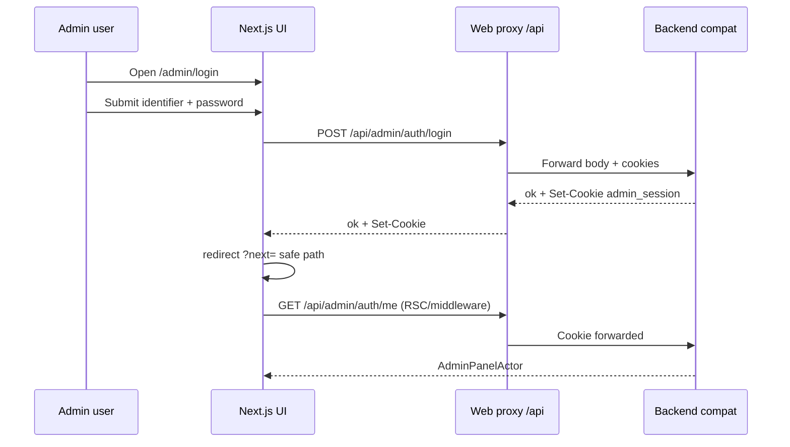
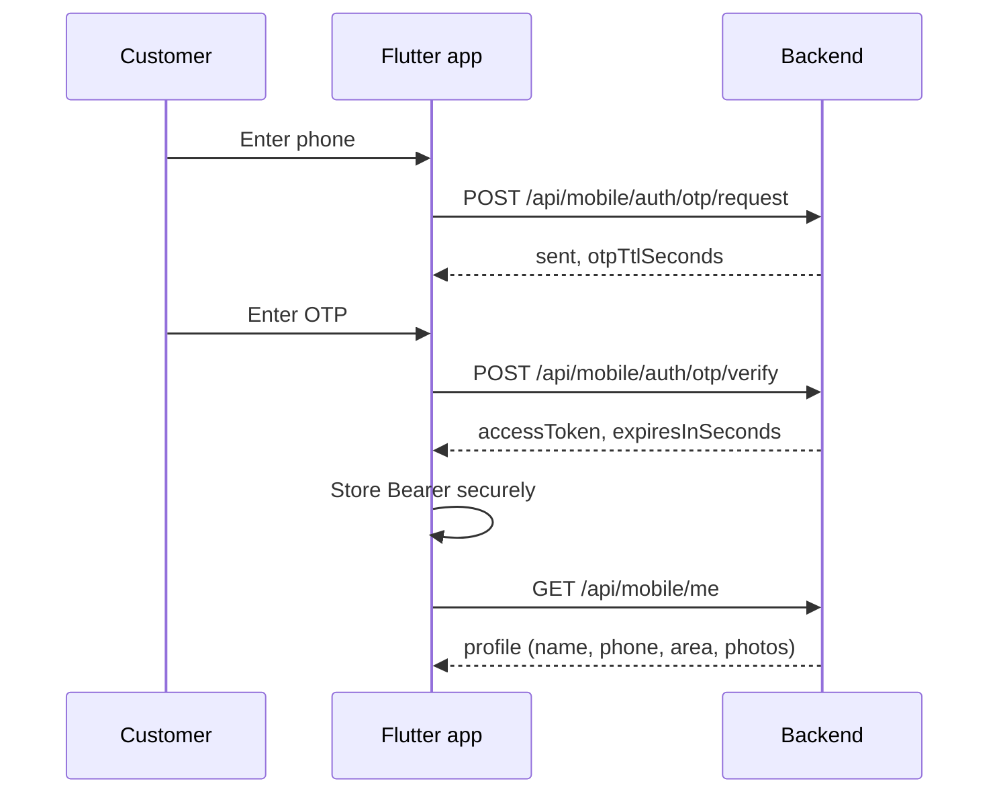

# Phase 1 — UI Flow (Authentication & Identity)

**Date:** 2026-05-21  
**Clients:** `pranidoctor-web` (panels), `pranidoctor_user` (Flutter mobile — consumer), API-only technician

---

## 1. Principles

| Rule | Detail |
|------|--------|
| UI never touches DB | All auth via `/api/*` proxy to backend |
| Frozen paths | Login forms POST to existing routes only |
| Session read | RSC uses local JWT verify + backend `/me` for authoritative actor |
| Bengali-first | Panel login errors mapped in UI (`loginErrorBn`) |

---

## 2. Admin panel flow

### 2.1 Routes

| UI route | Purpose |
|----------|---------|
| `/admin/login` | Login page (`AdminLoginForm`) |
| `/admin/*` | Dashboard (middleware/layout checks session) |
| Home `/` | Link to admin login |

### 2.2 Sequence



### 2.3 UI components

| File | Role |
|------|------|
| `src/app/admin/login/page.tsx` | Bengali/English chrome, `AdminLoginForm` |
| `src/components/admin/AdminLoginForm.tsx` | POST login, error mapping |
| `src/lib/admin-auth/session.ts` | `getAdminSession()` cookie JWT |
| `src/lib/admin-auth/panel-access.ts` | `resolveAdminPanelActor()` → backend me |

### 2.4 Phase 1 UI changes (minimal)

- No route renames
- Optional: surface `locale` if admin profile gains locale field (defer)
- Add proxy only if new endpoints (`/api/mobile/devices` N/A for admin)

---

## 3. Doctor panel flow

### 3.1 Routes

| UI route | Purpose |
|----------|---------|
| `/doctor/login` | Doctor login page |
| `/doctor/*` | Doctor workspace |

### 3.2 Sequence

Same as admin with:

- `POST /api/doctor/auth/login`
- `GET /api/doctor/auth/me`
- Cookie: `doctor_session` (see `src/lib/doctor-auth/`)

### 3.3 Phase 1

- Verify parity with admin error mapping (Bengali messages)
- Document provider-gated screens (profile status from `me` payload)

---

## 4. Technician panel flow

### 4.1 Current web UI

**API proxies exist** (`src/app/api/technician/auth/login|logout|me`) but **no dedicated `/technician/login` page** in web app tree (as of plan date).

Technician auth is consumed by:

- Future technician web UI, or
- Internal tools calling API directly

### 4.2 Sequence (API consumer)

```
POST /api/technician/auth/login → cookie technician_session
GET  /api/technician/auth/me    → actor + AiTechnicianProfile slice
POST /api/technician/auth/logout
```

### 4.3 Phase 1 recommendation

- **Optional** add `/technician/login` mirroring doctor page (out of critical path)
- Flutter/field app uses same API with cookie or Bearer TBD — document in mobile app repo

---

## 5. Mobile customer flow (Flutter — `pranidoctor_user`)

Web does not host customer login UI; frozen contract serves Flutter.

### 5.1 OTP path (primary)



**Legacy aliases:** `send-otp` / `verify-otp` — Flutter should standardize on `otp/request` + `otp/verify` in Phase 1 docs; both remain frozen.

### 5.2 Password login (secondary)

```
POST /api/mobile/auth/login { identifier, password }
→ accessToken + user blob (same JWT as OTP)
```

### 5.3 Registration

```
POST /api/mobile/auth/register
→ creates CUSTOMER user + profile → token per handler
```

### 5.4 Phase 1 mobile UX additions

| Step | API | UI note |
|------|-----|---------|
| Store refresh token | `otp/verify` optional field | Secure storage (Keychain/Keystore) |
| Silent refresh | `POST /api/mobile/auth/refresh` | Before retry on 401 |
| Device register | `POST /api/mobile/devices/register` | After first login |
| Locale | `PATCH /api/mobile/me` `{ locale: "bn-BD" }` | Settings screen |

---

## 6. Profile flows

### 6.1 Mobile me

| Action | Method | Fields |
|--------|--------|--------|
| View profile | GET `/api/mobile/me` | name, phone, email, area, photos, role |
| Update | PATCH `/api/mobile/me` | name, email, area |
| **Phase 1 add** | PATCH | `locale` (optional) |

### 6.2 Panel me

| Panel | Endpoint | Used by |
|-------|----------|---------|
| Admin | GET `/api/admin/auth/me` | Layout, `resolveAdminPanelActor` |
| Doctor | GET `/api/doctor/auth/me` | Doctor layout |
| Technician | GET `/api/technician/auth/me` | API consumers |

Web pattern:

1. Read JWT from cookie (fast fail)
2. Call backend `me` for DB-backed status and profile

---

## 7. Logout flows

| Panel | UI action | API |
|-------|-----------|-----|
| Admin | Logout button | POST `/api/admin/auth/logout` + clear cookie client-side |
| Doctor | Same | `/api/doctor/auth/logout` |
| Technician | Same | `/api/technician/auth/logout` |
| Mobile | Settings | **Phase 1:** POST `/api/mobile/auth/logout` (new) or discard tokens locally + optional backend revoke |

---

## 8. Permission UX (admin)

When admin calls protected route without capability:

```
403 { ok: false, error: { code: "FORBIDDEN", message: "এই কাজের জন্য অনুমতি নেই" } }
```

**UI:** Show Bengali toast/dialog; do not redirect to login.

**Capabilities affecting UI:**

| Capability | UI surfaces |
|------------|-------------|
| `serviceInstance.view` | Service instance lists |
| `serviceInstance.review` | Review actions |
| `serviceInstance.publish` | Publish button (SUPER_ADMIN only) |

Phase 1: document capability → route map in admin module tickets; no new admin UI for permission editing.

---

## 9. Localization in UI

| Layer | Today | Phase 1 |
|-------|-------|---------|
| Admin login errors | BN + EN in `AdminLoginForm` | Keep; align codes with API map |
| OTP API errors | Bengali from backend | No web change |
| Customer profile locale | Not shown | Flutter settings → PATCH me |
| `Accept-Language` | Not sent by web login | Optional on new device endpoint |

Font: `Noto_Sans_Bengali` on admin login page — keep for all panel login pages.

---

## 10. Middleware / guards (web)

| Guard | Location | Behavior |
|-------|----------|----------|
| Admin session | Middleware / layout | Redirect to `/admin/login?next=` |
| Doctor session | Doctor layout | Redirect to `/doctor/login` |
| Mobile N/A on web | — | |

**Phase 1:** Ensure middleware uses `get*Session()` only — never import Prisma.

---

## 11. Dev / ops UI

| Route | Purpose |
|-------|---------|
| `/admin/(dashboard)/dev-tools/otp-logs` | Dev OTP log viewer (admin only) |

Restricted to configured admin; ties to `otp-env` dev mode.

---

## 12. UI verification checklist (Phase 1 exit)

- [ ] Admin login success → dashboard
- [ ] Admin bad password → Bengali error
- [ ] Admin logout → login page
- [ ] Doctor login/logout
- [ ] Protected admin route without capability → 403 message
- [ ] Flutter OTP E2E against backend (manual or integration test)
- [ ] PATCH mobile me locale (after API added)

---

## 13. Screen inventory (web only)

| Screen | Path | Phase 1 touch |
|--------|------|----------------|
| Admin login | `/admin/login` | Error codes doc only |
| Doctor login | `/doctor/login` | Same |
| Technician login | *missing* | Optional new page |
| Admin dashboard | `/admin` | Uses session |
| OTP dev tools | `/admin/.../otp-logs` | No change |

**Mobile screens:** owned by `pranidoctor_user` — coordinate via API map, not web routes.
