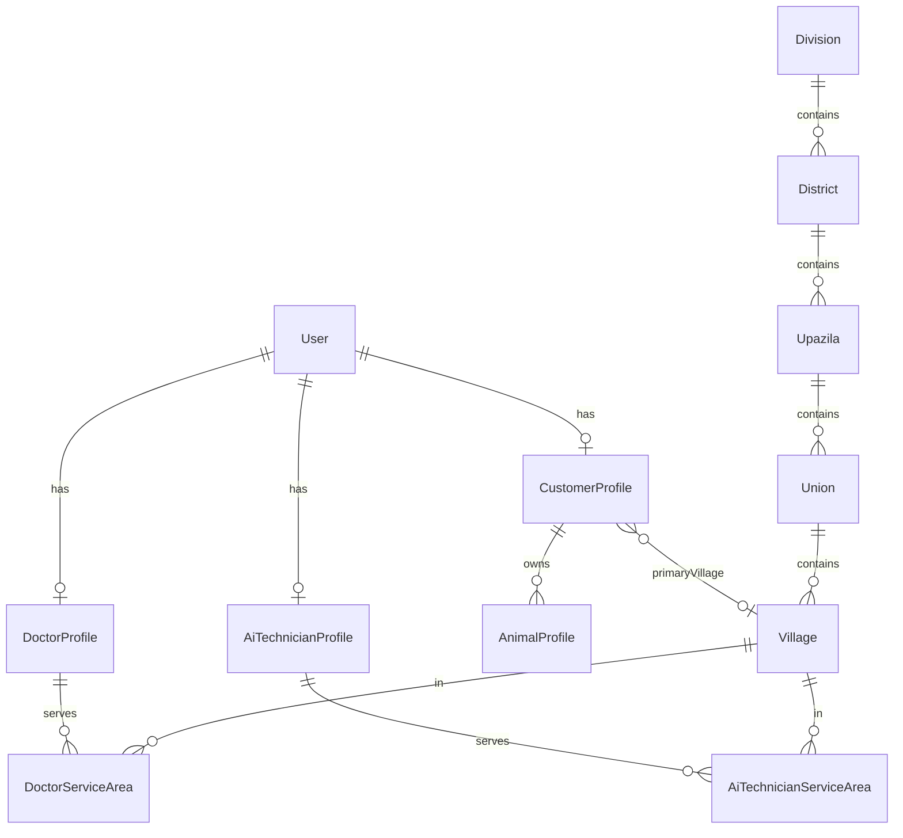

# Phase 2 — Database Map (User, Profile, Area)

**Date:** 2026-05-21  
**Schema owner:** `pranidoctor-backend/prisma/schema.prisma`  
**Policy:** Additive only — no drops, no enum removals, no NOT NULL without default

---

## 1. Canonical entities (existing)

### 1.1 `User`

| Column | Type | Phase 2 use |
|--------|------|-------------|
| `id` | cuid | PK — all profiles FK |
| `email` | string unique | Panel + customer |
| `phone` | string? unique | BD normalized (E.164 style `8801…`) |
| `passwordHash` | string | bcrypt |
| `role` | `UserRole` | CUSTOMER, DOCTOR, AI_TECHNICIAN, ADMIN, … |
| `status` | `UserStatus` | Login gate |

**Phase 2:** No column changes required for core user table.

### 1.2 Profile tables (1:1 `User`)

| Model | Role | Phase 2 focus |
|-------|------|---------------|
| `CustomerProfile` | CUSTOMER | Address, locale, photos, farm link |
| `DoctorProfile` | DOCTOR | Provider status, areas, fees |
| `AiTechnicianProfile` | AI_TECHNICIAN | Coverage FKs + legacy text |
| `AdminProfile` | ADMIN | Display name only (minimal P2) |

### 1.3 Area hierarchy (normalized Bangladesh)

```
Division 1─* District 1─* Upazila 1─* Union 1─* Village
```

| Model | Key fields |
|-------|------------|
| `Division` | `name`, `nameBn`, `nameEn`, `slug`, `code`, `isActive`, `isVerified`, lat/lng |
| `District` | `divisionId`, same pattern |
| `Upazila` | `districtId`, same pattern |
| `Union` | `upazilaId`, same pattern |
| `Village` | `unionId`, same pattern |

**Indexes:** Already present per parent FK + `nameBn`/`nameEn`.

### 1.4 Parallel `Area` tree (legacy)

| Model | Purpose |
|-------|---------|
| `Area` | Self-referential `parentId`, `type` enum (`DIVISION`…`VILLAGE`) |
| `DoctorProfileArea` | M2M doctor ↔ Area |
| `AiTechnicianProfileArea` | M2M technician ↔ Area |

**Phase 2:** Do not delete. New customer address uses **Village FK** in `addressJson`. Service requests may still use `areaId` until later migration.

### 1.5 Provider service areas (village-level)

| Model | Links |
|-------|-------|
| `DoctorServiceArea` | `doctorId` + `villageId` |
| `AiTechnicianServiceArea` | `aiTechnicianId` + `villageId` |
| `AiTechnicianDivisionServiceArea` | Division-level coverage with optional district/upazila/union FK |

### 1.6 Farm-related (animals, not farm entity)

| Model | Notes |
|-------|-------|
| `AnimalProfile` | `customerId` → `CustomerProfile.id` — farm animals |
| `CustomerProfile.animals` | Relation |

**No `FarmProfile` table today.** Phase 2 default: aggregate only (see §4).

---

## 2. `CustomerProfile` — address & language

### 2.1 Current columns

| Column | Type | Notes |
|--------|------|-------|
| `displayName` | string | Compat `name` |
| `locale` | string? default `bn-BD` | P1-11 frozen |
| `addressJson` | Json? | Informal today |
| `profilePhotoUrl` / `coverPhotoUrl` | string? | Upload URLs |

### 2.2 Formal `addressJson` schema (application-level, Phase 2)

Validated by Zod in `customer-address.service` — **not** a DB check constraint:

```typescript
type CustomerAddressJson = {
  areaLabel?: string;      // compat PATCH `area`
  divisionId?: string;
  districtId?: string;
  upazilaId?: string;
  unionId?: string;
  villageId?: string;
  line1?: string;
  postalCode?: string;
  // Denormalized labels (optional cache, refreshed on write)
  divisionNameBn?: string;
  districtNameBn?: string;
  upazilaNameBn?: string;
  unionNameBn?: string;
  villageNameBn?: string;
};
```

**Validation rules:**

- If `villageId` set → must exist, `isActive`, chain must match union→upazila→district→division.
- Partial hierarchy allowed during onboarding (store highest resolved level).
- `areaLabel` auto-filled from `villageNameBn` when village resolved.

### 2.3 Optional additive columns (P2-03 migration — recommended)

| Column | Type | Purpose |
|--------|------|---------|
| `primaryVillageId` | String? FK → `Village` | Fast queries for service matching |
| `profileCompletedAt` | DateTime? | Onboarding gate |
| `preferredLanguage` | String? | Alias of `locale` if product wants rename later — **defer**; use `locale` |

```prisma
// Proposed additive (P2-03)
model CustomerProfile {
  // ... existing fields
  primaryVillageId   String?
  profileCompletedAt DateTime?
  primaryVillage     Village? @relation(fields: [primaryVillageId], references: [id])
  @@index([primaryVillageId])
}
```

---

## 3. `DoctorProfile` / `AiTechnicianProfile`

### 3.1 Doctor — no required schema change

Existing fields cover Phase 2: `displayName`, `providerStatus`, `licenseNumber`, fees, flags.

**Optional additive:**

| Column | Purpose |
|--------|---------|
| `locale` | String? default `bn-BD` — panel i18n (P2-07, optional) |

### 3.2 Technician — FKs already present

| Column | Status |
|--------|--------|
| `districtId`, `upazilaId`, `unionId` | Exists — validate on PATCH |
| `district`, `upazila`, `unionOrArea` text | Legacy — keep in sync on write |

**Phase 2 write rule:** When FK set, refresh legacy text from `location-catalog` labels.

---

## 4. Farm profile strategy

| Approach | Phase | Description |
|----------|-------|-------------|
| **A — Aggregate (default)** | P2-08 | `farm-context.service` counts animals, reads `primaryVillageId` |
| **B — New table** | P2-10 optional | `FarmProfile` with `customerId`, name, type (dairy/fattening), villageId |

### 4.1 Optional `FarmProfile` (P2-10 only if product insists)

```prisma
model FarmProfile {
  id          String   @id @default(cuid())
  customerId  String
  name        String
  farmType    FarmType @default(MIXED)
  villageId   String?
  metadataJson Json?
  createdAt   DateTime @default(now())
  updatedAt   DateTime @updatedAt
  customer    CustomerProfile @relation(fields: [customerId], references: [id], onDelete: Cascade)
  village     Village? @relation(fields: [villageId], references: [id])
  @@index([customerId])
}
```

**Default plan:** Ship Phase 2 **without** §4.1; use Approach A.

---

## 5. User lifecycle & registration

### 5.1 OTP verify user creation

| Step | Table | Action |
|------|-------|--------|
| 1 | `User` | insert CUSTOMER if new phone |
| 2 | `CustomerProfile` | insert if missing (`displayName` from phone) |
| 3 | `MobileOtpChallenge` | delete on success |

**Phase 2:** Centralize in `user-core` + `customer-profile.bootstrap`.

### 5.2 Password register

| Step | Table | Action |
|------|-------|--------|
| 1 | `User` | insert with internal email domain if needed |
| 2 | `CustomerProfile` | insert |
| 3 | Auth audit | existing P1 writers |

---

## 6. Migrations plan

| Migration | Step | Content |
|-----------|------|---------|
| `2026xxxx_p2_customer_village_fk` | P2-03 | `CustomerProfile.primaryVillageId` optional |
| `2026xxxx_p2_doctor_locale` | P2-07 | optional `DoctorProfile.locale` |
| `2026xxxx_p2_farm_profile` | P2-10 | only if Approach B approved |

**No seed changes** for Division→Village in Phase 2 (assume P0/P1 seeds done).

---

## 7. Data access layer mapping

| Module | Prisma models |
|--------|---------------|
| user-core | `User` |
| customer-profile | `CustomerProfile` |
| customer-address | `CustomerProfile.addressJson`, `primaryVillageId` |
| location-catalog | `Division`, `District`, `Upazila`, `Union`, `Village` |
| doctor-profile | `DoctorProfile`, `User` |
| technician-profile | `AiTechnicianProfile`, `User` |
| provider-areas | `DoctorServiceArea`, `AiTechnicianServiceArea`, `AiTechnicianDivisionServiceArea` |
| farm-context | `CustomerProfile`, `AnimalProfile`, `Village` |

---

## 8. Foundation repository wiring

| Repository | Phase 2 action |
|------------|----------------|
| `UsersRepository` | Replace throws with Prisma |
| `DoctorsRepository` | Replace throws with Prisma (read-first; write via admin legacy) |

---

## 9. Audit (reuse P1)

| Event | When |
|-------|------|
| `PROFILE_UPDATED` | optional new `AuthAuditAction` value — **additive enum** if approved |
| Existing domain audits | Unchanged |

If adding enum member: `PROFILE_UPDATED` in `AuthAuditAction` — requires migration + client regenerate.

**Minimal P2:** Use application logs + existing patterns; defer new audit enum to P2-11 if needed.

---

## 10. ER diagram (Phase 2 focus)



---

## 11. Breaking-change policy

Same as Phase 1:

1. Additive columns and `data` fields only.
2. `addressJson` keys may be added; existing `area`/`areaLabel` preserved.
3. No removal of profile or location endpoints.
