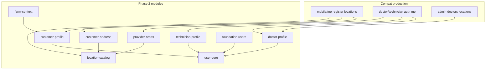

# Phase 2 — Master Plan (User + Profile + Area Foundation)

**Project:** Prani Doctor  
**Mode:** PLAN (no implementation in this step)  
**Date:** 2026-05-21  
**Prerequisites:** [PHASE1_FREEZE.md](./PHASE1_FREEZE.md), [API_CONTRACT_FREEZE.md](./API_CONTRACT_FREEZE.md), [P1_12_FINAL_CERTIFICATE.md](./P1_12_FINAL_CERTIFICATE.md)

---

## 1. Sign-off

```
PHASE2_READY=YES
MODULE_COUNT=10
IMPLEMENTATION_ORDER=P2-00,P2-01,P2-02,P2-03,P2-04,P2-05,P2-06,P2-07,P2-08,P2-09,P2-10,P2-11
```

---

## 2. Executive summary

Phase 2 wires **identity-adjacent domain data** that Phase 1 auth already touches but does not own end-to-end:

| Domain | Today | Phase 2 target |
|--------|-------|----------------|
| **User** | Prisma `User` live; foundation `UsersModule` **stub** | Repository + service on backend; web stays API consumer |
| **Registration** | Compat `POST /api/mobile/auth/register` + OTP user create | Documented flows; shared `findOrCreate` / profile bootstrap |
| **Profile (customer)** | `GET/PATCH /api/mobile/me` (P1-05/11) | Formal `addressJson` + optional hierarchy FKs; photos via existing upload |
| **Doctor** | `DoctorProfile` + panel `/me`; admin CRUD legacy | Module `doctors` wired; compat adapters unchanged |
| **Technician** | `AiTechnicianProfile` + panel `/me`; FK area fields | Module profile service; coverage areas read APIs |
| **Area** | `Division`→`Village` seeded + mobile location APIs | Catalog module; customer address binding; no route renames |

**Architecture (unchanged):**

- **Backend:** DB, Prisma, API (compat first, foundation secondary).
- **Web:** Proxy only — no Prisma, no business logic.

---

## 3. Constraints (inherited from Phase 1)

| Rule | Detail |
|------|--------|
| No route rename | All paths in [openapi.json](./openapi.json) and [API_CONTRACT_FREEZE.md](./API_CONTRACT_FREEZE.md) stay valid |
| Compat envelope | `{ ok, data }` / `{ ok, false, error }` for production clients |
| Foundation envelope | `{ success, data }` for `/api/users` (additive) |
| Auth frozen | OTP, session, device, locale — **reuse only**, no contract edits |
| Schema | **Additive** migrations only |
| Web | New proxies only if new backend paths; existing proxies pass-through |

---

## 4. Current-state analysis

### 4.1 What already works (compat / legacy)

| Capability | Evidence |
|------------|----------|
| Customer register/login | `customer-credentials-service.ts`, compat mobile auth adapters |
| Mobile profile read/update | `legacy/web/routes/mobile/me/route.ts` — `name`, `email`, `area`, `locale` |
| Location hierarchy read | `location-master-service.ts`, `/api/mobile/locations/*`, `/api/locations/*` |
| Doctor/technician panel `me` | P1-04/05 — `doctorProfileId`, `providerStatus` in `/api/*/auth/me` |
| Admin doctor management | `legacy/web/routes/admin/doctors/**` |
| Profile dashboard routing | `GET /api/mobile/profile/dashboard-context` (multi-role) |
| Animals (“farm” animals) | `AnimalProfile` model + mobile animal routes (out of P2 core, linked) |

### 4.2 Gaps (Phase 2 closes)

| Gap | Location | Risk |
|-----|----------|------|
| `UsersRepository` throws `Not implemented` | `modules/users/users.repository.ts` | Foundation `/api/users` unusable |
| `DoctorsRepository` throws `Not implemented` | `modules/doctors/doctors.repository.ts` | Foundation `/api/doctors` unusable |
| `addressJson` informal | `CustomerProfile.addressJson` | No validated shape; `area` string alias only |
| Dual area trees | `Division…Village` vs `Area` parent tree | Service requests may use `areaId`; profiles use FKs + text |
| **Farm profile** | UI in [SCREEN_HIERARCHY.md](./uiux/SCREEN_HIERARCHY.md) | No `FarmProfile` table — aggregate from customer + animals |
| **Language** | `CustomerProfile.locale` | Doctor/technician locale deferred; profile copy via i18n catalog |

### 4.3 Reuse from Phase 1 (do not reimplement)

```
IdentityAuthService (OTP, panel login)
  → User + *Profile rows created at login/register

requireMobileCustomer + session guard
  → /api/mobile/me, devices, profile routes

DeviceService, RefreshTokenService, SessionService
  → unchanged

modules/auth/i18n
  → profile/location validation errors (Accept-Language)
```

---

## 5. Target module architecture (backend)



| Module | Owns |
|--------|------|
| **user-core** | `User` CRUD, status, role guards, `findOrCreateByPhone` |
| **customer-profile** | `CustomerProfile` display, locale, photos, registration bootstrap |
| **customer-address** | `addressJson` schema, hierarchy FK resolution, PATCH semantics |
| **location-catalog** | Read-only Division→Village (+ search/tree) |
| **doctor-profile** | `DoctorProfile` read/update for panel + admin delegation |
| **technician-profile** | `AiTechnicianProfile` read/update, onboarding fields |
| **provider-areas** | `DoctorServiceArea`, `AiTechnicianServiceArea`, division coverage |
| **farm-context** | Dashboard context + farm summary DTO (no new table in P2-00–09) |
| **foundation-users** | Thin `/api/users` facade over user-core + customer-profile |
| **profile-compat-adapters** (cross-cutting) | Thin handlers calling modules; legacy routes unchanged |

**Note:** `profile-compat-adapters` is a work pattern inside `compat/` and route re-exports, not a separate npm package.

---

## 6. Domain design decisions

### 6.1 User

- **Canonical row:** `User` (email, phone, passwordHash, role, status).
- **Phase 2:** Implement `UsersRepository` with Prisma; align types with generated client.
- **Registration:** Keep compat routes; extract shared `ensureCustomerProfile(userId)` for OTP verify + password register.

### 6.2 Profile (customer)

- **Canonical row:** `CustomerProfile` (1:1 `User`).
- **Frozen compat fields** on `GET/PATCH /api/mobile/me`: `id`, `name`, `phone`, `email`, `area`, `locale`, `profilePhotoUrl`, `coverPhotoUrl`.
- **Additive internal fields** in `addressJson` (not all exposed on me until clients ready):

```json
{
  "areaLabel": "string (compat `area`)",
  "divisionId": "cuid?",
  "districtId": "cuid?",
  "upazilaId": "cuid?",
  "unionId": "cuid?",
  "villageId": "cuid?",
  "line1": "string?",
  "postalCode": "string?"
}
```

### 6.3 Address

- **Storage:** `CustomerProfile.addressJson` + optional denormalized labels for BN/EN display.
- **Validation:** FKs must reference active `Division…Village` rows; cascade picker APIs unchanged.
- **PATCH rule:** Sending `area` string only (current clients) continues to set `areaLabel`; hierarchy IDs optional additive.

### 6.4 Farm profile

- **Phase 2 scope:** Logical **farm context** — not a separate Prisma model in wave 1.
- **Composition:** `CustomerProfile` + counts from `AnimalProfile` + optional `addressJson` village.
- **API:** Extend `GET /api/mobile/profile/dashboard-context` data additively for farmer role.
- **Optional P2-10:** `FarmProfile` table if product requires named farms/dairy units (defer default).

### 6.5 Language

- **Customer:** `locale` on profile (`bn-BD` | `en-US`) — frozen via P1-11.
- **Doctor/Technician:** UI strings via `Accept-Language` on new profile mutation routes only; panel `me` fields unchanged.
- **Location names:** Return `nameBn` + `nameEn` from location-catalog (already in master service).

### 6.6 Doctor

- **Canonical row:** `DoctorProfile` + `User`.
- **Panel:** Continue `GET /api/doctor/auth/me` — no field removals.
- **Admin:** Legacy `admin/doctors` remains; module supplies shared validation/DTOs.
- **Areas:** `DoctorServiceArea` (village list) + optional `DoctorProfileArea` on legacy `Area` tree — document; normalize reads to Village FK where present.

### 6.7 Technician

- **Canonical row:** `AiTechnicianProfile` (includes `districtId`, `upazilaId`, `unionId` + legacy text).
- **Panel:** `GET /api/technician/auth/me` unchanged.
- **Coverage:** `AiTechnicianDivisionServiceArea` + village service areas — read APIs for onboarding UI.

### 6.8 Area hierarchy

| Level | Model | Mobile API (frozen) |
|-------|-------|---------------------|
| Division | `Division` | `GET /api/mobile/locations/divisions` |
| District | `District` | `…/districts?divisionId=` |
| Upazila | `Upazila` | `…/upazilas?districtId=` |
| Union | `Union` | `…/unions?upazilaId=` |
| Village | `Village` | `…/villages?unionId=` |
| Search | service | `GET /api/mobile/locations/search` |

**Phase 2:** Port `location-master-service` → `modules/locations/` (or `profile/location-catalog.service.ts`); compat routes call module.

**Legacy `Area` tree:** Read-only for admin/service-request; no deletion in P2.

---

## 7. Foundation vs compat strategy

| Concern | Compat (keep) | Foundation (fill) |
|---------|---------------|-------------------|
| Mobile profile | `/api/mobile/me` | — |
| Mobile locations | `/api/mobile/locations/*` | — |
| Register | `/api/mobile/auth/register` | — |
| User admin/list | — | `/api/users`, `/api/users/me` (secondary) |
| Doctor list | — | `/api/doctors` (secondary) |

**Rule:** Compat adapters call Phase 2 services; foundation controllers are thin facades for integrators.

---

## 8. Web (pranidoctor-web) role

| Action | Allowed |
|--------|---------|
| Proxy existing mobile/profile/location routes | Yes (already) |
| Add proxy for new foundation-only paths | Yes, if added |
| Prisma / migrations | **No** |
| Change login/register request bodies | **No** |

Phase 2 UI work is **optional** and limited to consuming additive fields (e.g. hierarchy labels on profile setup). See [PHASE2_UI_FLOW.md](./PHASE2_UI_FLOW.md).

---

## 9. Out of scope (Phase 2)

- Service requests, billing, AI chat, semen admin (later phases).
- Renaming `/api/mobile/me` fields.
- Merging `Area` tree into `Division…Village` (migration phase later).
- Full Flutter farmer UI implementation (API-ready only).
- Redis/geo spatial indexes.

---

## 10. Exit criteria

- [ ] `UsersRepository` + `DoctorsRepository` implemented (no throw).
- [ ] Compat profile/location responses unchanged for frozen fields (contract tests).
- [ ] `addressJson` Zod schema + validation on PATCH.
- [ ] Location catalog owned by module; legacy routes thin.
- [ ] `p2:verify` script passes (see [PHASE2_SEQUENCE.md](./PHASE2_SEQUENCE.md)).
- [ ] Docs: API_MAP, DB_MAP, UI_FLOW, SEQUENCE merged.

---

## 11. Related documents

| Doc | Purpose |
|-----|---------|
| [PHASE2_API_MAP.md](./PHASE2_API_MAP.md) | Route ownership matrix |
| [PHASE2_DB_MAP.md](./PHASE2_DB_MAP.md) | Schema + migrations |
| [PHASE2_UI_FLOW.md](./PHASE2_UI_FLOW.md) | Client flows |
| [PHASE2_SEQUENCE.md](./PHASE2_SEQUENCE.md) | Step-by-step implementation order |

---

## 12. Output block (CI / README)

```
PHASE2_READY=YES
MODULE_COUNT=10
IMPLEMENTATION_ORDER=P2-00,P2-01,P2-02,P2-03,P2-04,P2-05,P2-06,P2-07,P2-08,P2-09,P2-10,P2-11
```
