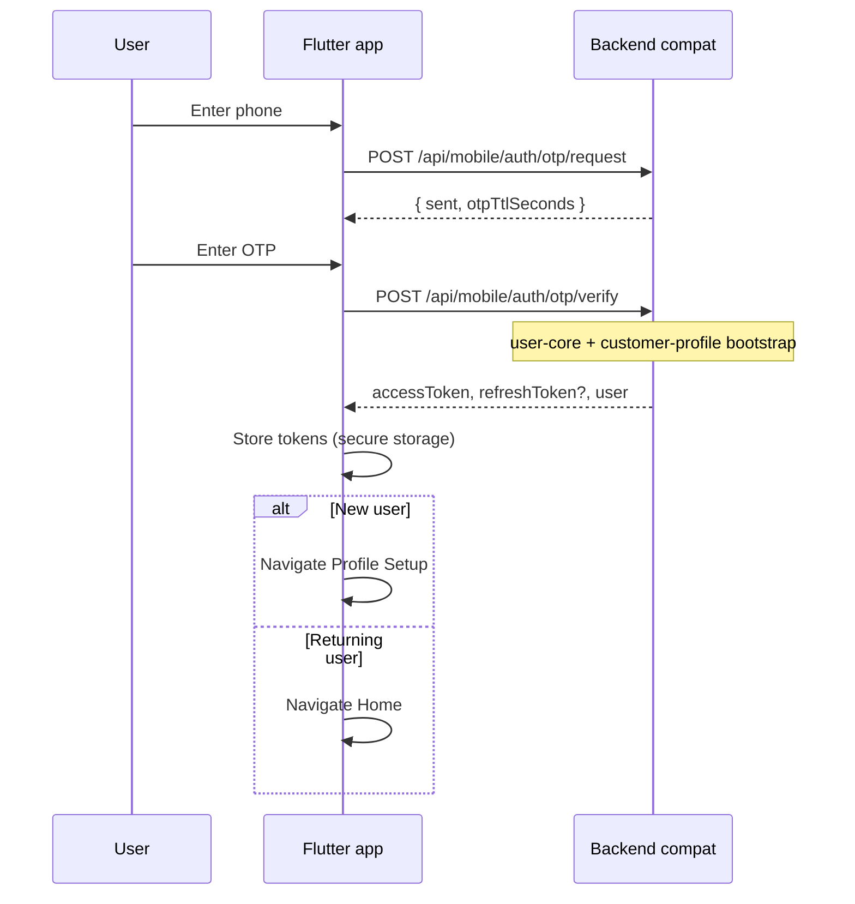
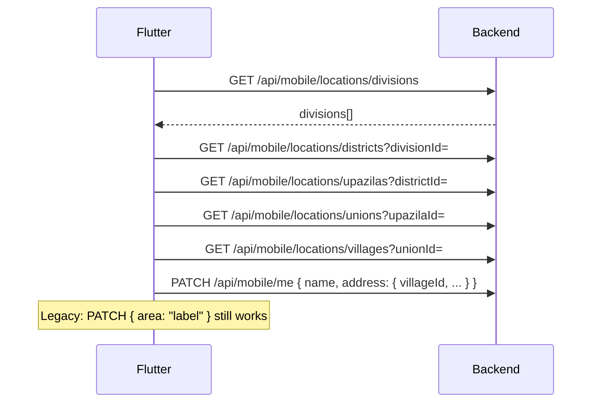
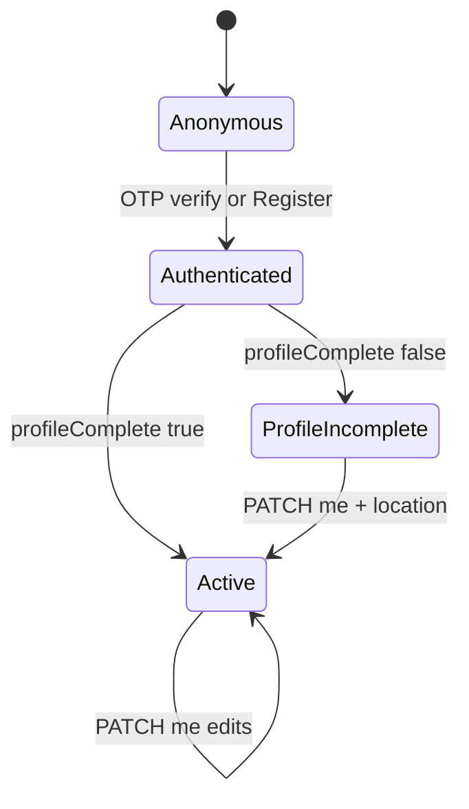

# Phase 2 — UI Flow (User, Profile, Area)

**Date:** 2026-05-21  
**Clients:** `pranidoctor_user` (Flutter — primary), `pranidoctor-web` (panels + optional profile setup)  
**Rule:** UI calls **backend APIs only** — no Prisma on web/mobile.

---

## 1. Principles

| Rule | Detail |
|------|--------|
| Auth first | All profile/location calls after P1 login (Bearer or panel cookie) |
| Frozen routes | Use existing paths from [PHASE2_API_MAP.md](./PHASE2_API_MAP.md) |
| Location cascade | Division → District → Upazila → Union → Village |
| Bengali-first | Default `locale: bn-BD`; `Accept-Language` for errors |
| Farm UX | Uses profile + animals APIs — no dedicated farm screen API in P2-00–09 |

Reference: [uiux/SCREEN_HIERARCHY.md](./uiux/SCREEN_HIERARCHY.md)

---

## 2. Customer registration flows

### 2.1 OTP path (primary mobile)



### 2.2 Password register (alternate)

| Step | API |
|------|-----|
| Form: name, mobile, password | `POST /api/mobile/auth/register` |
| Success | Same token shape as login |
| Profile missing | Redirect to Profile Setup |

**Phase 2:** No change to form fields on wire; optional `profileComplete` flag in response drives routing.

---

## 3. Profile setup (onboarding)

### 3.1 Screens (Flutter — from SCREEN_HIERARCHY)

| Screen | API |
|--------|-----|
| Basic info (name, email) | `PATCH /api/mobile/me` |
| Location selection | Location cascade + `PATCH` address |
| Photo | `POST /api/mobile/uploads/profile-image` |
| Complete | `GET /api/mobile/me` confirm |

### 3.2 Location selection sequence



### 3.3 Search shortcut

| Step | API |
|------|-----|
| User types village name | `GET /api/mobile/locations/search?q=` |
| Select result | PATCH me with resolved `villageId` |

---

## 4. Customer profile (steady state)

### 4.1 Profile tab

| Action | API |
|--------|-----|
| Load profile | `GET /api/mobile/me` |
| Edit profile | `PATCH /api/mobile/me` |
| Change language | `PATCH /api/mobile/me` `{ locale: "en-US" }` |
| Dashboard tabs | `GET /api/mobile/profile/dashboard-context` |

### 4.2 Device + session (P1 — unchanged)

| Action | API |
|--------|-----|
| Register device | `POST /api/mobile/devices/register` |
| Refresh token | `POST /api/mobile/auth/refresh` |

---

## 5. Farm profile flow (logical)

### 5.1 Navigation

| Screen | Route (app) | API |
|--------|-------------|-----|
| Farm dashboard | `/farmer/farm` | `GET /api/mobile/profile/dashboard-context` |
| Dairy / Fattening | sub-routes | Same + animal filters client-side |
| Animals list | `/farmer/animals` | `GET /api/mobile/animals` |

### 5.2 Phase 2 additive dashboard data

```json
{
  "role": "customer",
  "tabs": ["home", "animals", "requests", "profile"],
  "farmSummary": {
    "animalCount": 5,
    "activeAnimalCount": 4,
    "primaryVillageLabelBn": "..."
  }
}
```

**No new farm-specific write API in default Phase 2 plan.**

---

## 6. Doctor panel flow

### 6.1 Login → workspace

| Step | API |
|------|-----|
| Login | `POST /api/doctor/auth/login` |
| Session check | `GET /api/doctor/auth/me` |
| Workspace data | Existing doctor operational routes |

### 6.2 Profile fields (read via me)

| UI label | Source |
|----------|--------|
| Name | `displayName` |
| Status | `providerStatus` |
| Profile id | `doctorProfileId` |

**Phase 2:** No doctor profile edit route on web unless product adds — admin uses `/api/admin/doctors/{id}`.

---

## 7. Technician panel flow

| Step | API |
|------|-----|
| Login | `POST /api/technician/auth/login` |
| Me | `GET /api/technician/auth/me` |
| Coverage review | Admin APIs / future technician onboarding |

**Mobile technician** may use `GET /api/mobile/profile/dashboard-context` with role `AI_TECHNICIAN` (already supported).

---

## 8. Admin panel (location & doctors)

| Task | API |
|------|-----|
| Location quality dashboard | `GET /api/admin/locations/stats` |
| Missing coordinates | `GET /api/admin/locations/missing-coords` |
| Doctor list/edit | `GET/POST/PATCH /api/admin/doctors` |
| Technician review | `GET /api/admin/ai-technicians` |

**Web:** Proxies under `src/app/api/admin/**` — no logic change in P2.

---

## 9. Web-specific flows (optional P2)

| Flow | Status |
|------|--------|
| Admin location tools | Proxy only — already exists |
| Doctor login page | Frozen — P1 |
| Customer web app | N/A — mobile-first |

---

## 10. Error & i18n UX

| Scenario | HTTP | Client behavior |
|----------|------|-----------------|
| Invalid village FK | 422 | Show BN/EN message from `error.message` |
| Stale hierarchy (district not in division) | 422 | Re-pick cascade |
| Unauthorized profile | 401 | Redirect to login |
| Locale patch | 200 | Update app i18n bundle |

Reuse P1-11: frozen OTP/login strings untouched; profile/location use catalog.

---

## 11. State machine (customer onboarding)



**`profileComplete` heuristic (server):**

- `displayName` non-empty AND (`primaryVillageId` OR `addressJson.areaLabel`) → true

---

## 12. Phase 2 UI deliverables

| Deliverable | Owner | Required |
|-------------|-------|----------|
| API parity doc | Backend | Yes |
| Flutter profile setup wire-up | Mobile team | After P2-04 |
| Location picker component | Mobile team | Uses frozen APIs |
| Web admin | No change | — |

---

## 13. Verification (manual)

| Flow | Check |
|------|-------|
| OTP → me | Name + phone returned |
| Location cascade | Each level loads |
| PATCH village | `GET me` shows area label |
| Locale en-US | Error messages English on device register |
| Doctor login | `providerStatus` visible |

Automated: `p2:verify` (see [PHASE2_SEQUENCE.md](./PHASE2_SEQUENCE.md)).
