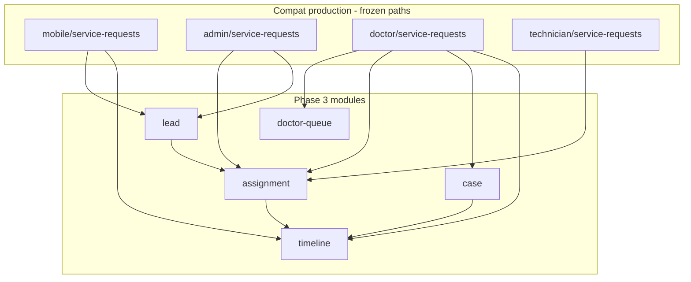

# Phase 3 — Master Plan (Lead + Case + Assignment)

**Project:** Prani Doctor  
**Mode:** PLAN (no implementation in this step)  
**Date:** 2026-05-21  
**Prerequisites:** [PHASE1_FREEZE.md](./PHASE1_FREEZE.md), [PHASE2_FREEZE.md](./PHASE2_FREEZE.md), [openapi.json](./openapi.json)

---

## 1. Sign-off

```
PHASE3_READY=YES
MODULE_COUNT=5
IMPLEMENTATION_ORDER=P3-00,P3-01,P3-02,P3-03,P3-04,P3-05,P3-06,P3-07,P3-08,P3-09,P3-10,P3-11
```

---

## 2. Executive summary

Phase 3 operationalizes the **customer care pipeline** from intake through provider assignment, clinical case work, auditable timeline, and resolution.

| Concept (product) | Canonical backend entity today | Phase 3 target |
|-------------------|-------------------------------|----------------|
| **Lead** | Mobile: `ServiceRequest` (PENDING); Admin CRM: foundation `Lead` types **without DB** | Unified lead intake + conversion; compat routes unchanged |
| **Assignment** | `assignedDoctorId` / `assignedTechnicianId` on `ServiceRequest`; admin assign routes live | Module-owned transitions + validation |
| **Doctor queue** | `GET /api/doctor/service-requests?tab=` (legacy) | Module-backed queue reads; frozen tab semantics |
| **Case** | `TreatmentCase` (maps `TreatmentRecord` table) | Module-owned clinical case CRUD linked to request |
| **Timeline** | **None** (status fields only) | Append-only `ServiceRequestTimelineEvent` + read API |

**Primary flow (farmer / customer):**

```
Customer (farmer)
  → POST /api/mobile/service-requests     [Lead intake]
  → PENDING
  → Admin assign OR dispatch rules        [Assignment]
  → ASSIGNED / ACCEPTED
  → Doctor queue (tab=new)                [Doctor Queue]
  → accept → IN_PROGRESS                  [Assignment]
  → POST treatment-cases                  [Case]
  → timeline events on each step          [Timeline]
  → complete → COMPLETED                  [Resolution]
```

**Roles:**

| Role | UserRole / profile | Phase 3 actions |
|------|-------------------|-----------------|
| **Farmer (customer)** | `CUSTOMER` + `CustomerProfile` | Create/list/cancel requests; view timeline |
| **Doctor** | `DOCTOR` + `DoctorProfile` | Queue, accept/reject, case notes, complete |
| **AI technician** | `AI_TECHNICIAN` + `AiTechnicianProfile` | Assigned queue (parallel path for `AI_SERVICE` type) |
| **Admin** | `ADMIN` / `SUPER_ADMIN` | List all requests, assign doctor/technician, override status |

**Architecture (unchanged):**

- **Backend:** DB, Prisma, API (compat first, foundation secondary).
- **Web:** API consumer only — no Prisma.

---

## 3. Constraints (inherited)

| Rule | Detail |
|------|--------|
| P1 auth frozen | OTP, session, refresh, device — reuse only |
| P2 profile frozen | `/api/mobile/me`, locations — reuse for customer + village on create |
| No route rename | All paths in [openapi.json](./openapi.json) stay valid |
| Compat envelope | `{ ok, data }` / `{ ok, false, error }` |
| Schema | **Additive** migrations only |
| Billing | Out of P3 core (complete route may touch billing — compat only, no refactor) |

---

## 4. Current-state analysis

### 4.1 What already works (compat / legacy)

| Capability | Evidence |
|------------|----------|
| Customer create/list/cancel request | `legacy/web/routes/mobile/service-requests/**`, `mobile-service-requests/service-request-service.ts` |
| Admin list/assign | `admin/service-requests/**`, `admin-service-requests/service-request-assignment-service.ts` |
| Doctor queue + accept/reject/complete | `doctor/service-requests/**`, `doctor-service-requests/doctor-service-request-service.ts` |
| Technician assigned list | `technician/service-requests/**` |
| Treatment case create | `doctor/service-requests/[id]/treatment-cases/route.ts` |
| Location on request | `areaId`, `villageId`, `locationText` on `ServiceRequest` |
| Priority signals | `isEmergency`, `urgency` (string), `serviceType` |
| Notifications | `notifyServiceRequestSubmitted`, accept/complete hooks |

### 4.2 Gaps (Phase 3 closes)

| Gap | Location | Risk |
|-----|----------|------|
| `LeadsRepository` throws | `modules/leads/leads.repository.ts` | Foundation `/api/leads` unusable |
| No timeline table | — | No audit trail beyond status timestamps |
| No request attachments | `UploadedFile` has no `SERVICE_REQUEST_*` purpose | Photos/symptom images not linked |
| Logic scattered in legacy libs | `lib/*-service-requests/*` | Hard to test; duplicate transition rules |
| Priority not formalized | `urgency` free string | Inconsistent admin/doctor filters |
| Lead vs ServiceRequest split | Product “Lead” vs DB `ServiceRequest` | Confusion without documented mapping |

### 4.3 Reuse from Phase 1 + 2

```
requireMobileCustomer / requireDoctorApiActor / requireAdminPanelApiAccess
CustomerProfile.primaryVillageId + villageId on create
modules/area — village FK validation
modules/doctor, modules/technician — assignee eligibility
modules/profile — customer context
modules/media — upload pipeline (extend purpose enum)
```

---

## 5. Target module architecture (backend)



| Module | Owns |
|--------|------|
| **lead** | Intake DTOs, `ServiceRequest` create (customer), optional CRM `Lead` row + convert |
| **assignment** | Status transitions: assign, accept, reject, start, reassign; assignee validation |
| **doctor-queue** | Doctor/technician list queries, tab→status mapping, sort/priority |
| **case** | `TreatmentCase` create/read/update; link to `serviceRequestId` |
| **timeline** | Append-only events; aggregate read for customer/doctor/admin |

**Cross-cutting (not separate npm packages):** compat route adapters call module services; legacy lib files become thin re-exports.

---

## 6. Domain design decisions

### 6.1 Lead — two intake paths, one pipeline

| Path | Trigger | Storage | Phase 3 |
|------|---------|---------|---------|
| **A — Registered customer** | Mobile POST service-request | `ServiceRequest` PENDING | Primary; **is the lead** for farmer app |
| **B — Pre-customer CRM** | Admin/AI chat/phone | New `Lead` table (additive) | Foundation `/api/leads`; `convert` → User + ServiceRequest |

**Rule:** Do not rename `ServiceRequest` to Lead in API responses. Add optional `leadId` on ServiceRequest when converted from CRM Lead.

### 6.2 Assignment — state machine

Existing `ServiceRequestStatus`:

```
PENDING → ASSIGNED → ACCEPTED → IN_PROGRESS → COMPLETED
         ↘ REJECTED ↗          ↘ CANCELLED
```

| Actor | Allowed transitions |
|-------|----------------------|
| Admin | PENDING→ASSIGNED (assign doctor/tech); reassign on non-terminal |
| Doctor | ASSIGNED→ACCEPTED/REJECTED; ACCEPTED/ASSIGNED→IN_PROGRESS; IN_PROGRESS→COMPLETED |
| Customer | PENDING/ASSIGNED/ACCEPTED→CANCELLED (existing cancellable set) |
| Technician | Mirror doctor for `AI_SERVICE` requests |

**Phase 3:** Centralize rules in `assignment.service`; legacy routes call it.

### 6.3 Doctor queue — frozen tab semantics

From `provider-assigned-list-tab.ts`:

| Tab | Statuses |
|-----|----------|
| `new` | ASSIGNED, ACCEPTED |
| `active` | IN_PROGRESS |
| `completed` | COMPLETED |

Sort default: `isEmergency DESC`, `submittedAt ASC` (additive query option).

### 6.4 Case — TreatmentCase

- One request may have **multiple** treatment case rows (existing relation).
- Doctor creates via frozen `POST …/treatment-cases`.
- Phase 3: `case.service` validates doctor ownership + request status.

### 6.5 Timeline — new additive model

Append-only events (see [PHASE3_DB_MAP.md](./PHASE3_DB_MAP.md)):

- `CREATED`, `ASSIGNED`, `ACCEPTED`, `REJECTED`, `STARTED`, `NOTE_ADDED`, `CASE_OPENED`, `COMPLETED`, `CANCELLED`
- Payload: `{ actorUserId, actorRole, note?, metadataJson? }`

**Read paths (additive):**

- `GET /api/mobile/service-requests/{id}/timeline`
- `GET /api/doctor/service-requests/{id}/timeline`
- `GET /api/admin/service-requests/{id}/timeline`

### 6.6 Attachments, priority, location, notes

| Support | Phase 3 approach |
|---------|------------------|
| **Attachments** | `ServiceRequestAttachment` join + `MobileUploadPurpose.SERVICE_REQUEST_*` |
| **Priority** | Formalize `RequestPriority` enum; map from `isEmergency` + `urgency` |
| **Location** | Prefer `villageId` (P2); keep `areaId` compat; denormalize label on read |
| **Notes** | `problemOrSymptom`, `description`, timeline `NOTE_ADDED`, admin internal notes (additive `adminNote` on request optional) |

---

## 7. Foundation vs compat strategy

| Concern | Compat (keep) | Foundation (fill) |
|---------|---------------|-------------------|
| Customer requests | `/api/mobile/service-requests/*` | — |
| Doctor queue | `/api/doctor/service-requests/*` | — |
| Admin ops | `/api/admin/service-requests/*` | — |
| CRM leads | — | `/api/leads`, `/api/leads/{id}/convert` |

---

## 8. Web (pranidoctor-web) role

| Action | Allowed |
|--------|---------|
| Proxy existing service-request routes | Yes |
| Admin UI consume timeline + attachments | Yes (after backend) |
| Prisma / migrations | **No** |

---

## 9. Out of scope (Phase 3)

- Full billing refactor (compat complete+billing stays)
- AI chat → lead automation (hook only)
- Auto-dispatch / geo routing engine
- Prescription module rewrite
- Renaming `ServiceRequest` in JSON

---

## 10. Exit criteria

- [ ] Five modules implemented under `src/modules/{lead,assignment,doctor-queue,case,timeline}/`
- [ ] `LeadsRepository` implemented (foundation)
- [ ] Compat service-request responses unchanged for frozen fields
- [ ] Timeline read APIs additive and tested
- [ ] Attachment link on create (optional upload IDs)
- [ ] `p3:verify` script passes
- [ ] Docs: DB_MAP, API_MAP, UI_FLOW, SEQUENCE merged

---

## 11. Related documents

| Doc | Purpose |
|-----|---------|
| [PHASE3_DB_MAP.md](./PHASE3_DB_MAP.md) | Schema + migrations |
| [PHASE3_API_MAP.md](./PHASE3_API_MAP.md) | Route ownership |
| [PHASE3_UI_FLOW.md](./PHASE3_UI_FLOW.md) | Role-based flows |
| [PHASE3_SEQUENCE.md](./PHASE3_SEQUENCE.md) | Implementation order |

---

## 12. Output block (CI / README)

```
PHASE3_READY=YES
MODULE_COUNT=5
IMPLEMENTATION_ORDER=P3-00,P3-01,P3-02,P3-03,P3-04,P3-05,P3-06,P3-07,P3-08,P3-09,P3-10,P3-11
```
