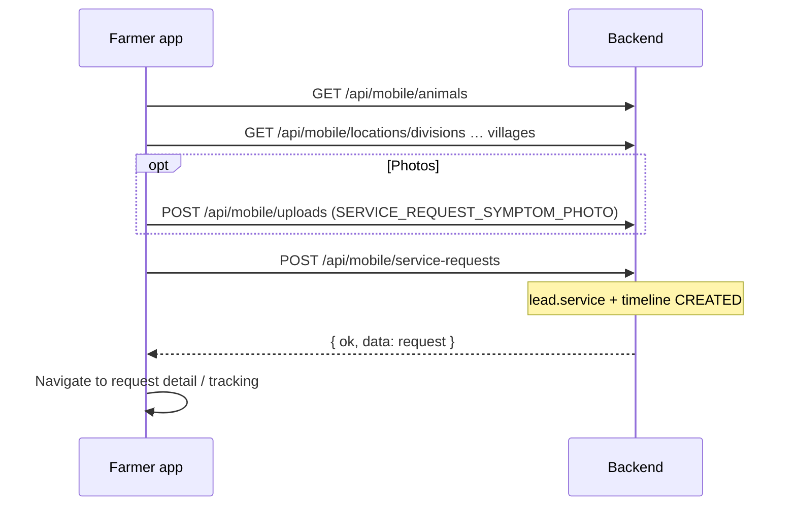
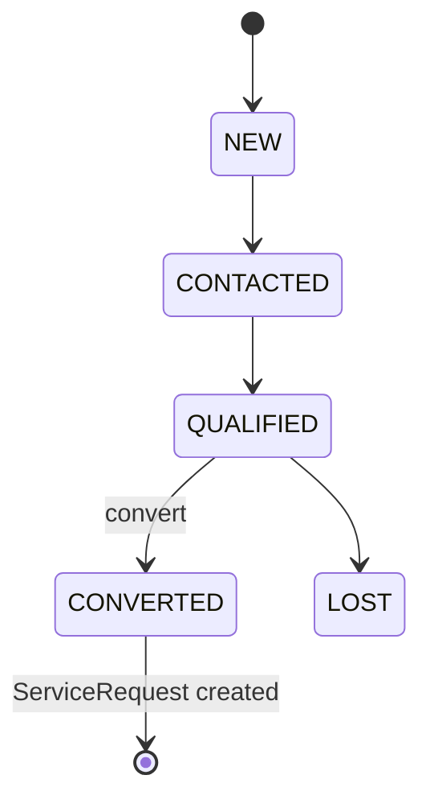
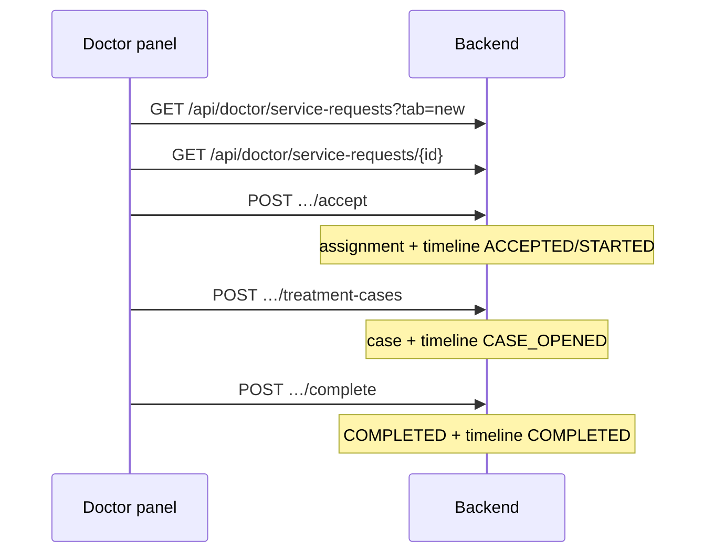

# Phase 3 — UI Flow (Lead, Case, Assignment)

**Date:** 2026-05-21  
**Clients:** `pranidoctor_user` (Flutter — primary), `pranidoctor-web` (admin + panels)  
**Rule:** UI calls **backend APIs only** — no Prisma on web/mobile.

Reference: [uiux/APP_FLOW.md](./uiux/APP_FLOW.md), [uiux/MOBILE_UI_BLUEPRINT.md](./uiux/MOBILE_UI_BLUEPRINT.md)

---

## 1. Principles

| Rule | Detail |
|------|--------|
| Farmer = customer | `UserRole.CUSTOMER`; service request = lead intake |
| Frozen routes | See [PHASE3_API_MAP.md](./PHASE3_API_MAP.md) |
| Location | Prefer village picker (P2 locations API) |
| Timeline | Read-only for customer; providers add notes |
| Bengali-first | Customer `locale` from P2; panel via Accept-Language |

---

## 2. Farmer (customer) flow

### 2.1 Create request (lead intake)

**Form fields:**

| UI label | API field |
|----------|-----------|
| Animal | `animalId` |
| Service type | `serviceType` |
| Symptom | `problemOrSymptom` |
| Details | `description` |
| Village | `villageId` (or `locationText`) |
| Preferred time | `preferredTime` / schedule |
| Photos | `attachmentFileIds[]` (P3 additive) |
| Emergency | maps to `isEmergency` / `priority: EMERGENCY` |

### 2.2 Track request

| Screen | API |
|--------|-----|
| My requests list | `GET /api/mobile/service-requests` |
| Request detail | `GET /api/mobile/service-requests/{id}` |
| Timeline | `GET /api/mobile/service-requests/{id}/timeline` (P3) |
| Cancel | `POST …/cancel` |

**Status UX mapping:**

| Status | Farmer message (BN) |
|--------|---------------------|
| PENDING | অপেক্ষমান — ডাক্তার নিয়োগ হচ্ছে |
| ASSIGNED / ACCEPTED | ডাক্তার নিশ্চিত হয়েছে |
| IN_PROGRESS | চিকিৎসা চলছে |
| COMPLETED | সম্পন্ন |
| CANCELLED / REJECTED | বাতিল / প্রত্যাখ্যাত |

---

## 3. Admin flow

### 3.1 Operations dashboard

| Task | API |
|------|-----|
| All open requests | `GET /api/admin/service-requests?status=PENDING` |
| Request detail | `GET /api/admin/service-requests/{id}` |
| Assign doctor | `POST …/assign-doctor` |
| Assign technician | `POST …/assign-technician` |
| Internal note | `PATCH …/adminNote` (P3) |
| Timeline audit | `GET …/timeline` |

### 3.2 CRM leads (pre-registration)

| Task | API |
|------|-----|
| New lead (phone/AI) | `POST /api/leads` |
| Qualify / assign admin | `PATCH /api/leads/{id}` |
| Convert to customer + request | `POST /api/leads/{id}/convert` |
| Activity log | `GET /api/leads/{id}/activities` |

---

## 4. Doctor flow

### 4.1 Queue (inbox)

| Tab | API | Status filter |
|-----|-----|---------------|
| New | `GET /api/doctor/service-requests?tab=new` | ASSIGNED, ACCEPTED |
| Active | `?tab=active` | IN_PROGRESS |
| Completed | `?tab=completed` | COMPLETED |

**Card shows:** customer name, animal, village label, priority badge, submitted time.

### 4.2 Accept → case → complete

| Step | API |
|------|-----|
| Reject | `POST …/reject` |
| Add clinical notes | `POST …/treatment-cases` |
| View timeline | `GET …/timeline` |
| Complete visit | `POST …/complete` |

---

## 5. AI technician flow (parallel)

| Step | API |
|------|-----|
| Assigned list | `GET /api/technician/service-requests?tab=new` |
| Accept / update | assignment routes (mirror doctor where applicable) |
| Timeline | `GET …/timeline` |

For `serviceType: AI_SERVICE`, technician replaces doctor in assignment chain.

---

## 6. Attachments UX

| Actor | Flow |
|-------|------|
| Farmer | Upload before/along create; show thumbnails on detail |
| Doctor | View attachments on case detail (read URLs from join) |
| Admin | Moderation via existing upload admin tools if needed |

---

## 7. Priority UX

| UI | API |
|----|-----|
| Emergency toggle | `isEmergency: true` + `priority: EMERGENCY` |
| Badge color | `priority` enum |
| Queue sort | Doctor list `sort=priority` (P3 additive query) |

---

## 8. Location UX

| Picker level | API (P2 frozen) |
|--------------|-----------------|
| Division → Village | `/api/mobile/locations/*` |
| Default village | From `GET /api/mobile/me` `primaryVillageId` / area label |
| Free text fallback | `locationText` |

---

## 9. Notes UX

| Type | Storage |
|------|---------|
| Symptom (customer) | `problemOrSymptom` |
| Description | `description` |
| Provider note | timeline `NOTE_ADDED` |
| Admin internal | `adminNote` (not shown to customer) |
| Cancel reason | `cancelReason` |

---

## 10. Web admin (pranidoctor-web)

| Page | Proxy |
|------|-------|
| Service requests list | `/api/admin/service-requests` |
| Assign modal | assign-doctor / assign-technician |
| Timeline drawer | additive timeline GET |

No new business logic on web — proxies only.

---

## 11. Phase 3 UI deliverables

| Deliverable | Owner | Required |
|-------------|-------|----------|
| API parity doc | Backend | Yes |
| Farmer request + timeline | Mobile | After P3-05 |
| Doctor queue tabs | Web + mobile | After P3-06 |
| Admin assign + timeline | Web admin | After P3-04 |
| CRM leads UI | Web admin | Optional P3-10 |

---

## 12. Verification (manual)

| Flow | Check |
|------|-------|
| Farmer create with village | 201 + PENDING |
| Admin assign | Doctor sees in `tab=new` |
| Doctor accept + case + complete | COMPLETED + timeline events |
| Farmer timeline | Shows CREATED → ASSIGNED → COMPLETED |
| Locale | Validation errors respect Accept-Language |

Automated: `p3:verify` (see [PHASE3_SEQUENCE.md](./PHASE3_SEQUENCE.md)).
