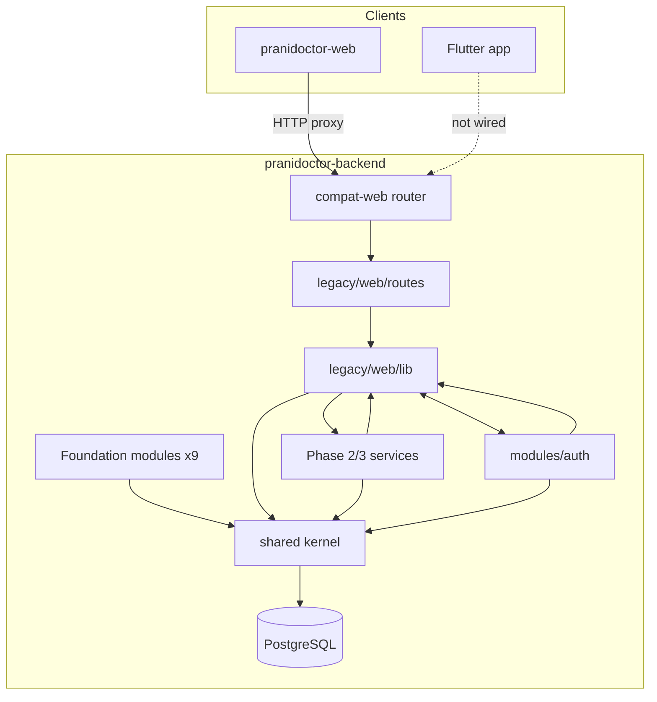

# Architecture Audit — Prani Doctor (Current State)

**Audit date:** 2026-05-21  
**Auditor mode:** read-only architecture analysis (no redesign, no fixes)  
**Input:** [01_REPOSITORY_INVENTORY.md](./01_REPOSITORY_INVENTORY.md)  
**Scope:** `pranidoctor-backend`, `pranidoctor-web`, `pranidoctor_user`

---

## Executive summary

Prani Doctor is a **three-repo system** in an intentional **backend-first migration**. The canonical data and business logic live in `pranidoctor-backend` (Express + Prisma). `pranidoctor-web` is a Next.js UI shell that proxies almost all API traffic to the backend. `pranidoctor_user` is an early Flutter scaffold not yet wired to production APIs.

The backend currently runs **two parallel API layers**:

1. **Legacy compat stack** — 179 Next-style route handlers under `legacy/web/routes/`, mounted first at `/api/*`.
2. **Foundation module stack** — 9 Express modules (`auth`, `users`, `doctors`, `leads`, `animals`, `clinics`, `notifications`, `ai`, `media`) mounted after compat.

Phase 2–3 domain work (`profile`, `area`, `lead`, `assignment`, `case`, `timeline`, `doctor-queue`) lives as **service modules** wired through legacy lib/route adapters — not as registered foundation modules.

**Primary architectural tension:** `modules/auth` and `legacy/web/lib` form a **bidirectional dependency graph**. Migration is progressing (thin legacy wrappers → module services) but layer boundaries are not yet clean.

---

## A. Current architecture

### A.1 System topology

```
┌─────────────────────────────────────────────────────────────────┐
│  Clients                                                         │
│  ┌──────────────┐  ┌──────────────────────┐  ┌───────────────┐  │
│  │ Web browser  │  │ Flutter (customer)   │  │ Future mobile │  │
│  │ admin/doctor │  │ pranidoctor_user     │  │ / integrations│  │
│  └──────┬───────┘  └──────────┬───────────┘  └───────┬───────┘  │
└─────────┼─────────────────────┼──────────────────────┼──────────┘
          │ HTTP                  │ REST (Dio)           │
          ▼                       ▼                      ▼
┌─────────────────────┐   ┌───────────────────────────────────────┐
│ pranidoctor-web     │   │ pranidoctor-backend (:3000 typical)    │
│ Next.js 16 (:3001)  │──▶│ Express 5 modular monolith             │
│ UI + API proxy      │   │  ├─ /api/docs (OpenAPI)                │
│                     │   │  ├─ /api/* compat (179 legacy routes)  │
│ src/app/api (176)   │   │  └─ /api/* foundation (9 modules)      │
│ ~171 proxy routes   │   │       + Phase 2/3 services via legacy  │
└─────────────────────┘   └───────────────┬───────────────────────┘
                                            │
                    ┌───────────────────────┼───────────────────────┐
                    ▼                       ▼                       ▼
              PostgreSQL 16            Redis 7 (opt)           MinIO (opt)
              (canonical)              cache/OTP/queues         object storage
```

**Documented target** (`docs/ARCHITECTURE_FREEZE.md`): web is API consumer; backend owns Prisma, migrations, and business logic.

**Operational reality:** production traffic can still enter via Next.js `:3001` route handlers, which forward to Express `:3000` — a **dual-hop** path until cutover.

---

### A.2 Backend (`pranidoctor-backend`)

#### Layer model

| Layer | Path | Responsibility |
|-------|------|----------------|
| **Entry** | `src/server.ts`, `src/app.ts`, `src/worker.ts` | Bootstrap, middleware, mount order, graceful shutdown |
| **Shared kernel** | `src/shared/` | Config (Zod), Prisma singleton, logger (Pino), errors, module loader |
| **Infrastructure** | `src/infra/` | Redis, BullMQ queues, cache service |
| **Foundation modules** | `src/modules/{auth,users,doctors,leads,...}/` | Express routers at `/api/{module}` with controller/service/repository pattern |
| **Phase 2/3 services** | `src/modules/{profile,area,lead,assignment,case,timeline,doctor-queue}/` | Domain logic; **not** in `createAllModules()` |
| **Compat adapter** | `src/modules/compat-web/` | Walks `legacy/web/routes/`, lazy-loads handlers, wraps via `next-adapter.ts` |
| **Legacy port** | `src/legacy/web/routes/` (179 files), `src/legacy/web/lib/` | Original Next.js handlers + domain services |
| **Compat shims** | `src/compat/`, `shims/next-compat/` | `NextResponse`, `{ ok, data }` envelope helpers |
| **Data** | `prisma/schema.prisma` (59 models, 27 migrations) | Canonical schema owner |
| **API docs** | `openapi.json`, `/api/docs` | Generated from route registry |

#### Mount order (Express)

```
1. /health, /ready          → health router
2. /api/docs                → Swagger
3. /api/*                   → compat-web router (legacy routes, first match wins)
4. /api/*                   → foundation modules (auth, users, doctors, …)
5. notFound + errorHandler
```

Compat routes take precedence over foundation routers for overlapping paths. Most product traffic uses legacy paths (`/api/admin/*`, `/api/mobile/*`, `/api/doctor/*`, etc.).

#### Foundation modules (registered)

| Module | Mount prefix | Pattern |
|--------|--------------|---------|
| auth | `/api/auth` | Service + compat adapters for panel/mobile auth |
| users | `/api/users` | CRUD foundation |
| doctors | `/api/doctors` | Provider registry foundation |
| leads | `/api/leads` | CRM lead pipeline (distinct from Phase 3 `lead/`) |
| animals | `/api/animals` | Livestock profiles |
| clinics | `/api/clinics` | Clinic entities |
| notifications | `/api/notifications` | Notification delivery |
| ai | `/api/ai` | AI service domain |
| media | `/api/media` | Uploads + storage factory (S3/MinIO/local) |

#### Phase 2/3 services (unregistered — legacy-wired)

| Module | Role | Wired via |
|--------|------|-----------|
| `profile/` | Customer profile, addresses, farm context | `legacy/web/lib/mobile-profile/*`, `routes/mobile/me` |
| `area/` | Location catalog | `legacy/web/lib` + **imports** `legacy/web/lib/locations/` |
| `lead/` | Customer service-request intake (`ServiceRequest` + `Lead` link) | `legacy/web/lib/mobile-service-requests/*` |
| `assignment/` | Admin assign, doctor accept/reject | `legacy/web/lib/admin-service-requests/*`, `doctor-service-requests/*` |
| `case/` | Treatment case open | `legacy/web/lib/doctor-service-requests/doctor-clinical-service.ts` |
| `timeline/` | Append-only `ServiceRequestTimelineEvent` | Legacy timeline routes + `compat/timeline-route.handler.ts` |
| `doctor-queue/` | Doctor tab listing | `doctor-service-request-service.ts` |
| `doctor/` (singular) | Doctor repository/service helpers | Used by legacy; **not** same as `doctors/` foundation module |
| `technician/` | Technician repository/service | Legacy AI technician flows |
| `user/` (singular) | User helpers | Parallel to `users/` foundation module |

#### Background processing

- `src/worker.ts` — BullMQ worker entry (requires Redis).
- Redis often disabled in dev (`REDIS_ENABLED=false`) — OTP, cache, and queues unavailable locally.

---

### A.3 Web (`pranidoctor-web`)

#### Layer model

| Layer | Path | Responsibility |
|-------|------|----------------|
| **UI** | `src/app/admin/`, `doctor/`, `enterprise/` | Panel pages (React 19, App Router) |
| **API surface** | `src/app/api/` (176 route handlers) | Production URL compatibility; almost all proxy to backend |
| **Transport** | `src/lib/proxy-to-backend.ts`, `server-internal.ts`, `api-client.ts` | HTTP forwarding; cookie/auth header pass-through |
| **Domain libs (legacy)** | `src/lib/admin-*`, `doctor-*`, `mobile-*`, `technician-*` | Full business logic copies — **architectural drift** vs API-consumer policy |
| **Prisma guard** | `src/lib/prisma.ts` | Throws on use — enforces no direct DB |
| **Synced types** | `src/generated/prisma/` | Postinstall copy from backend (types/enums only intended use) |
| **Docs hub** | `docs/` (~222 files) | Phase plans, freezes, architecture policy |

#### API route behavior

| Category | Count | Mechanism |
|----------|-------|-----------|
| Proxy to backend | ~171 | `proxyRouteToBackend(request)` — same path forwarded to `BACKEND_URL` |
| Health probes | 3 | `fetchBackendHealth()` via `api-client` — composite web+backend status |
| Re-export aliases | 2 | `mobile/auth/send-otp`, `verify-otp` → `otp/request`, `otp/verify` |
| **Total** | **176** | |

`next.config.ts` also rewrites `/backend-api/*` → backend `/api/*` for direct client access.

#### UI data flow

```
Browser → Next.js page (RSC/client)
       → fetch("/api/...")  OR  serverInternalFetch("/api/...")
       → proxy-to-backend → Express backend
       → legacy route OR foundation module
       → Prisma → PostgreSQL
```

Panel session resolution on web still references `src/lib/*-auth/session` patterns in places, but API handlers themselves no longer execute Prisma — they proxy.

---

### A.4 Flutter (`pranidoctor_user`)

#### Layer model

| Layer | Path | Responsibility |
|-------|------|----------------|
| **Bootstrap** | `lib/main.dart`, `lib/app/bootstrap.dart` | App init, ProviderScope |
| **Config** | `lib/app/app_env.dart` | Compile-time `dart-define` (`API_BASE_URL` defaults to `https://api.example.com`) |
| **Core** | `lib/core/network/`, `session/`, `error/`, `cache/` | Dio, secure storage session, Hive, ApiResult |
| **Features** | `lib/features/{auth,home,inbox,services,...}/` | Feature slices (data + UI) |
| **Routing** | `lib/routing/` | go_router + shell scaffold |

#### State flow

```
AppEnv (dart-define)
    ↓
dioProvider → Dio(baseUrl: apiBaseUrl)   [no auth interceptor wired]
    ↓
AuthRepository → OAuth stubs (Google/Facebook) → SessionController.setSession()
    ↓
sessionControllerProvider (Riverpod StateNotifier)
    ↓
FlutterSecureStorage (access token key)
    ↓
go_router guards (isAuthenticated)
```

**Current gaps (architectural, not bugs):**

- Dio is not connected to `SessionController` for Bearer injection.
- `AuthRepository` uses placeholder tokens; no real `/api/mobile/auth/*` integration.
- Default API URL is not backend localhost — mobile is architecturally isolated from the dual-repo stack today.
- Android-only; no iOS tree; not under git.

---

### A.5 Infrastructure

#### Backend compose (`pranidoctor-backend/docker-compose.yml`)

| Service | Role |
|---------|------|
| postgres:16 | Primary database |
| redis:7 | Cache, OTP store, BullMQ |
| minio | S3-compatible object storage |
| api (profile) | Optional production container (`node dist/server.js`) |

#### Web compose (`pranidoctor-web/docker-compose.yml`)

| Service | Role |
|---------|------|
| postgres:16 | **Separate** local DB instance (different from backend compose credentials) |
| minio | Local uploads |

**Drift:** two independent Postgres+MinIO stacks with no documented single-source dev topology. Web compose Postgres is legacy from pre-migration local dev.

#### Deployment

- No CI/CD in any repo.
- Verification is script-driven (`p1`–`p3`, `e2e:freeze`).
- No Kubernetes/Vercel manifests in tree.

#### Observability

| Probe | Owner |
|-------|-------|
| `/health`, `/health/db`, `/ready` | Backend |
| `/api/health`, `/api/admin/health`, `/api/mobile/health` | Web (proxies or aggregates backend health) |
| `/api/docs` | Backend OpenAPI |

---

## B. Module boundaries

### B.1 Intended boundaries (documented)

| Boundary | Owner | Consumers |
|----------|-------|-----------|
| Prisma schema + migrations | Backend only | Web syncs generated client for types |
| Business logic | Backend (`legacy/web/lib` → migrating to `modules/*`) | Web proxies |
| Auth/session/device | Backend `modules/auth` (frozen Phase 1) | All panels + mobile via API |
| API contract | `{ ok, data }` legacy envelope | Web, mobile, OpenAPI |
| UI | Web panels | Browser |
| Customer mobile | Flutter | Backend REST (planned) |

### B.2 Actual boundaries (observed)

| Boundary | Status | Notes |
|----------|--------|-------|
| Backend ↔ Legacy | **Permeable** | Bidirectional imports between `modules/auth` and `legacy/web/lib/*` |
| Foundation modules ↔ Legacy | **Permeable** | Phase 3 services called from legacy lib, not exposed as foundation routers |
| Web UI ↔ Backend logic | **Mostly clean at route layer** | 171/176 routes proxy; `src/lib/*` still contains full domain copies |
| Web ↔ Database | **Guarded** | `prisma.ts` throws; guard is effective for new route code |
| Flutter ↔ Backend | **Not established** | Scaffold only |
| `lead/` vs `leads/` | **Split** | Same word, different domains — CRM vs service-request intake |
| `doctor/` vs `doctors/` | **Split** | Singular = legacy clinical helpers; plural = foundation CRUD |
| `user/` vs `users/` | **Split** | Singular helpers vs foundation module |

### B.3 Phase 3 care pipeline boundary

```
mobile POST /api/mobile/service-requests
    → legacy route → mobile-service-request-service
    → modules/lead/customer-lead.service (create ServiceRequest + Lead + CREATED timeline)

admin POST /api/admin/service-requests/:id/assign-doctor
    → legacy route → admin-service-request-assignment-service
    → modules/assignment/assignment.service (ASSIGNED timeline)

doctor POST /api/doctor/service-requests/:id/accept
    → legacy route → doctor-service-request-service
    → modules/assignment/assignment.service (ACCEPTED timeline)

doctor POST /api/doctor/service-requests/:id/treatment-cases
    → legacy route → doctor-clinical-service
    → modules/case/case.service (CASE_OPENED timeline)

GET /api/*/service-requests/:id/timeline
    → legacy route → modules/timeline/compat/timeline-route.handler
```

This pipeline is **cohesive at the service level** but **not encapsulated** — entry points remain legacy routes and lib wrappers.

---

## C. Coupling

### C.1 Coupling matrix (high → low)

| From | To | Strength | Mechanism |
|------|-----|----------|-----------|
| `modules/auth/*` | `legacy/web/lib/*` | **High** | OTP, cookies, guards, api-response, panel sessions re-exported or imported |
| `legacy/web/lib/*` | `modules/auth/*` | **High** | Tokens, identity-core, session guards, permissions, OTP services |
| `legacy/web/lib/*` | Phase 2/3 modules | **Medium** | Direct service imports (assignment, lead, case, profile) |
| `modules/area/*` | `legacy/web/lib/locations/*` | **Medium** | Location catalog delegates to legacy location master |
| `modules/timeline/compat` | `compat/compat-api-response` | **Low** | Shared envelope helper |
| Web API routes | Backend Express | **Low** (transport) | Stateless HTTP proxy |
| Web `src/lib/*` | Backend logic | **High (duplicate)** | Copy of domain libs — changes require dual maintenance |
| Flutter | Backend | **None (runtime)** | Not integrated |

### C.2 Auth ↔ Legacy bidirectional coupling (critical)

**modules → legacy examples:**

- `modules/auth/compat/mobile-auth.adapter.ts` → `legacy/web/lib/mobile-auth/customer-credentials-service.ts`
- `modules/auth/services/panel-admin-auth.service.ts` → `legacy/web/lib/admin-auth/admin-login-errors.ts`
- `modules/auth/compat/*-auth.adapter.ts` → legacy cookie/session helpers

**legacy → modules examples:**

- `legacy/web/lib/mobile-auth/guard.ts` → `modules/auth/session-guard.helper.ts`, `identity-core.ts`
- `legacy/web/lib/admin-auth/jwt.ts` → `modules/auth/tokens/panel-admin-token.ts`
- `legacy/web/lib/mobile-auth/otp-service.ts` → `modules/auth/services/mobile-otp-auth.service.ts`

This is a **migration bridge pattern**, not a stable boundary. Extraction is incomplete in both directions.

### C.3 Web coupling

- **Route layer:** decoupled via proxy (good).
- **UI/lib layer:** still coupled to duplicated domain code in `src/lib/` — panels may import local libs that mirror backend logic rather than calling API-only abstractions.
- **Prisma types:** coupled to backend schema via postinstall sync — acceptable for enums/DTO typing.

---

## D. Ownership

| Asset | Canonical owner | Secondary / drift |
|-------|-----------------|-------------------|
| `schema.prisma` | Backend | Web synced copy |
| Migrations | Backend | Web has guard scripts only |
| OpenAPI | Backend (`npm run openapi:generate`) | Copied to web docs |
| Legacy route handlers | Backend `legacy/web/routes/` | Web `src/app/api/` mirrors paths as proxies |
| Legacy business lib | Backend `legacy/web/lib/` | Web `src/lib/` duplicate tree |
| Architecture policy docs | Web `docs/` | Backend `ARCHITECTURE.md` minimal |
| Phase verification scripts | Backend `scripts/p*-verify.ts` | Web consumes e2e freeze |
| Mobile app | `pranidoctor_user` (unversioned) | No repo integration |
| Location master data | Web `data/` + scripts | Backend reads via legacy location services |
| Docker infra (full stack) | Backend compose | Web compose partially redundant |

**Ownership ambiguity:** location master tooling lives primarily in **web** scripts/data, while runtime catalog logic executes in **backend** via legacy lib — split ownership across repos.

---

## E. Data flow

### E.1 Request path (typical production)

```
Client
  → Next.js /api/{panel|mobile}/...
  → proxy-to-backend (preserves method, headers, body, cookies)
  → Express compat-web next-adapter (maps req.params → Next-style context)
  → legacy/web/routes/.../route.ts
  → legacy/web/lib/{domain}-service.ts
  → [optional] modules/{domain}/*.service.ts
  → shared/database/prisma.ts
  → PostgreSQL
```

### E.2 Foundation module path (minority traffic)

```
Client → /api/users, /api/leads, /api/auth, …
  → Express module router
  → controller → service → repository
  → Prisma → PostgreSQL
  → Response: { success: true, data } (foundation envelope)
```

### E.3 Phase 3 workflow data flow

| Step | HTTP | State mutation | Timeline event |
|------|------|----------------|----------------|
| Customer creates request | `POST /api/mobile/service-requests` | `ServiceRequest` CREATED, optional `Lead` | `CREATED` |
| Admin assigns doctor | `POST /api/admin/service-requests/:id/assign-doctor` | Status → ASSIGNED | `ASSIGNED` |
| Doctor accepts | `POST /api/doctor/service-requests/:id/accept` | Status → ACCEPTED | `ACCEPTED` |
| Doctor opens case | `POST /api/doctor/service-requests/:id/treatment-cases` | `TreatmentCase` created | `CASE_OPENED` |
| Doctor completes | `POST /api/doctor/service-requests/:id/complete` | Status → COMPLETED | `COMPLETED` |

Timeline is **append-only** via `modules/timeline/timeline.service.ts`. Reads via dedicated GET timeline routes (admin/doctor/mobile).

### E.4 File / media flow

```
Upload route (legacy) → media module / legacy upload lib → storage factory → MinIO or S3
```

Storage driver selected by backend config (`STORAGE_DRIVER`).

---

## F. API contracts

### F.1 Dual response envelopes (frozen + drift)

| Stack | Success shape | Error shape | Used by |
|-------|---------------|-------------|---------|
| **Legacy/compat** | `{ ok: true, data: T }` | `{ ok: false, error: { code, message, details? } }` | 179 compat routes, web clients, OpenAPI legacy paths |
| **Foundation modules** | `{ success: true, data: T }` | `{ success: false, error: { code, message, requestId? } }` | `/api/users`, `/api/leads`, `/api/auth`, etc. |

`src/compat/compat-api-response.ts` bridges foundation compat handlers back to `{ ok, data }` for routes that must match legacy clients.

**Contract risk:** clients calling foundation paths directly must handle a different envelope unless proxied through legacy wrappers.

### F.2 Route inventory drift (documentation vs code)

| Source | Legacy route count |
|--------|-------------------|
| `docs/ARCHITECTURE_FREEZE.md` | 172 |
| `docs/API_CONTRACT_FREEZE.md` | 172 |
| **Actual** (`legacy/web/routes/**/route.ts`) | **179** |
| Web proxy routes | 176 |
| OpenAPI snapshot | 179 paths (per inventory) |

7-route documentation lag. 3-route backend/web gap (179 vs 176) — likely timeline or Phase 3 additions on backend not yet mirrored on web.

### F.3 Auth contract (frozen)

| Actor | Credential | Me endpoint |
|-------|------------|-------------|
| Admin | JWT cookie | `GET /api/admin/auth/me` |
| Doctor | JWT cookie | `GET /api/doctor/auth/me` |
| Technician | JWT cookie | `GET /api/technician/auth/me` |
| Mobile customer | Bearer JWT | `GET /api/mobile/me` |

Session/device modules are **frozen** (Phase 1) — Phase 3 work correctly avoided modifying auth internals.

### F.4 OpenAPI

- Generated from backend route registry.
- Serves as contract snapshot; foundation module paths included.
- Web does not generate its own OpenAPI.

---

## G. State flow

### G.1 Backend state

| State type | Storage | Owner module |
|------------|---------|--------------|
| Relational domain | PostgreSQL via Prisma | All services |
| Panel sessions | JWT in HTTP-only cookies | auth + legacy *-auth/session |
| Mobile sessions | Bearer JWT + refresh tokens | auth/mobile-jwt, device registry |
| OTP codes | Redis (when enabled) or dev fallback | auth/otp |
| Job queues | Redis + BullMQ | infra/queue |
| Cache | Redis | infra/cache |
| Uploads | MinIO/S3/local | media/storage |

**ServiceRequest lifecycle** is the primary workflow state machine (Phase 3). Status transitions enforced in assignment/case services and legacy clinical services.

### G.2 Web state

| State type | Storage | Notes |
|------------|---------|-------|
| Panel auth | Cookies (set by backend via proxy) | Web does not issue tokens |
| UI state | React component state / URL | Standard Next.js |
| Server session reads | `server-internal.ts` forwards cookies to backend | RSC guards |

No server-side domain state on web — aligned with API-consumer policy at the transport layer.

### G.3 Flutter state

| State type | Storage | Notes |
|------------|---------|-------|
| Auth snapshot | `SessionState` (Riverpod) | In-memory |
| Access token | `FlutterSecureStorage` | Not attached to Dio |
| Local cache | Hive | Bootstrap only |
| Push | Firebase Messaging | Scaffold |

---

## H. Architecture drift

### H.1 Documented vs actual

| Topic | Documented | Actual |
|-------|------------|--------|
| Legacy route count | 172 | 179 |
| Web API routes | 167 proxy + exceptions | 171 proxy + 5 exceptions = 176 |
| Web DB access | Disabled | Guard in place; `src/lib/*` libs still contain Prisma-era code paths |
| Single API stack | Backend canonical | Dual stack: Next handlers + Express both serve `/api/*` paths |
| Module registration | Foundation modules | Phase 3 modules exist but unregistered — only legacy entry |
| Mobile integration | REST via Dio | Placeholder auth; wrong default base URL |
| CI/CD | Implied production readiness | None configured |
| Git history | Initial upload commits | Local trees far ahead of commit messages |

### H.2 Migration drift patterns

1. **Strangler fig in progress:** legacy lib thinned to call module services (Phase 3 pattern) but routes remain in `legacy/web/routes/`.
2. **Foundation modules partially adopted:** 9 modules registered; most product traffic still on compat routes.
3. **Web lib duplication:** `src/lib/admin-*`, `mobile-*`, etc. remain as pre-migration artifacts — risk if any UI code still imports them for mutations instead of API calls.
4. **Prisma on web:** generated client synced but runtime blocked — half-migrated state.
5. **Location ownership split:** tooling in web repo, runtime in backend legacy lib.

### H.3 Compile/runtime drift

- Backend `tsc` build excludes `src/legacy/**` from emit — legacy loaded at runtime via `tsx` / dynamic import in compat-web.
- Legacy Vitest suites fail on `@/` alias — test architecture not migrated with code.

---

## I. Detected issues

### I.1 Duplicated patterns

| Pattern | Locations | Impact |
|---------|-----------|--------|
| API response helpers | `legacy/web/lib/api-response.ts`, `compat/compat-api-response.ts`, web `src/lib/api-response.ts` | Three copies of `{ ok, data }` helpers |
| Auth token/session | `modules/auth/tokens/*` + `legacy/web/lib/*-auth/jwt.ts`, `session.ts`, `cookies.ts` | Legacy re-exports modules — duplicate file trees |
| Doctor domain | `modules/doctor/` vs `modules/doctors/` vs `legacy/web/lib/admin-doctors/` | Naming collision; different responsibilities unclear without reading code |
| Lead domain | `modules/lead/` (service request) vs `modules/leads/` (CRM) vs Prisma `Lead` model | Semantic overload |
| User domain | `modules/user/` vs `modules/users/` | Parallel helpers vs foundation CRUD |
| Domain service libs | Backend `legacy/web/lib/*` vs Web `src/lib/*` | Full duplicate trees — highest maintenance cost |
| Docker compose | Backend vs Web postgres+minio | Two local infra definitions |
| Health endpoints | Backend `/health` + Web `/api/health` variants | Intentional aggregation but multiple probe surfaces |

### I.2 Circular dependency risk

**Confirmed logical cycle (auth ↔ legacy):**

```
modules/auth/compat/mobile-auth.adapter
  → legacy/web/lib/mobile-auth/customer-credentials-service
    → (potentially) modules/auth/services/mobile-otp-auth.service
      → legacy/web/lib/mobile-auth/otp-dispatch
        → modules/auth/...
```

**Legacy guard cycle:**

```
legacy/web/lib/mobile-auth/guard.ts
  → modules/auth/session-guard.helper
  → (session validation may reference legacy cookie readers)
  → legacy/web/lib/mobile-auth/*
```

Node ESM loader currently resolves these cycles (no startup failure observed), but the graph violates strict layered architecture and impedes unit isolation.

**Area module cycle:**

```
modules/area/location-catalog.service
  → legacy/web/lib/locations/location-master-service
    → (location lib may import catalog helpers back through shared Prisma queries)
```

Not a strict import cycle confirmed, but **layer violation** — module layer depends on legacy layer for location master.

### I.3 Layer violations

| Violation | From (expected higher) | To (expected lower) | Severity |
|-----------|------------------------|---------------------|----------|
| Module → Legacy import | `modules/auth/*` | `legacy/web/lib/*` | **High** |
| Module → Legacy import | `modules/area/location-catalog.service` | `legacy/web/lib/locations/*` | **Medium** |
| Compat shim → Legacy types | `compat/compat-api-response` | `legacy/web/types/api.ts` | **Low** (acceptable during migration) |
| Phase 3 module → Legacy envelope | `modules/timeline/compat` | `compat/compat-api-response` → legacy types | **Low** |
| Web lib domain logic | UI repo | Prisma-era business rules | **Medium** (policy violation) |
| Location data tooling | Web scripts/data | Backend runtime reads | **Medium** (ownership split) |

### I.4 Missing architectural controls

| Control | Status |
|---------|--------|
| CI boundary enforcement (no web Prisma use) | Not automated |
| Import lint (modules must not import legacy) | Not enforced |
| Contract test suite (179 routes) | Phase scripts only (`p2`, `p3`, `e2e:freeze`) |
| Single compose dev environment | Not documented |
| Mobile API integration tests | None |

---

## J. Architecture health summary

| Dimension | Rating | Rationale |
|-----------|--------|-----------|
| **Target clarity** | Good | Backend-first policy documented in freeze certs |
| **Migration progress** | Moderate | Proxy layer complete; module extraction partial |
| **Module boundaries** | Weak | Auth/legacy cycle; Phase 3 not registered as modules |
| **Coupling** | High (backend internal) | Bidirectional auth/legacy graph |
| **Web decoupling** | Good (routes) / Poor (libs) | Proxies work; duplicate libs remain |
| **Mobile readiness** | Low | Scaffold only |
| **Infra consistency** | Moderate | Backend compose complete; web compose redundant |
| **Contract consistency** | Moderate | Dual envelopes; doc count drift |
| **Test architecture** | Weak | Legacy Vitest broken; phase scripts compensate |

---

## K. Reference maps

### K.1 Backend module dependency (simplified)



### K.2 Care pipeline state machine

```
CREATED → ASSIGNED → ACCEPTED → CASE_OPENED → COMPLETED
   │          │           │            │            │
   └──────────┴───────────┴────────────┴────────────┴── timeline events (append-only)
```

---

## L. Related documents

| Document | Relevance |
|----------|-----------|
| [01_REPOSITORY_INVENTORY.md](./01_REPOSITORY_INVENTORY.md) | File/tree snapshot input to this audit |
| [../ARCHITECTURE_FREEZE.md](../ARCHITECTURE_FREEZE.md) | Target topology (172 route count stale) |
| [../API_CONTRACT_FREEZE.md](../API_CONTRACT_FREEZE.md) | Response envelopes, auth contract |
| [../PHASE3_FREEZE.md](../PHASE3_FREEZE.md) | Care pipeline verification baseline |
| `pranidoctor-backend/ARCHITECTURE.md` | Backend-first Prisma ownership |

---

## Output block

```
ARCHITECTURE_AUDIT_COMPLETE
```
