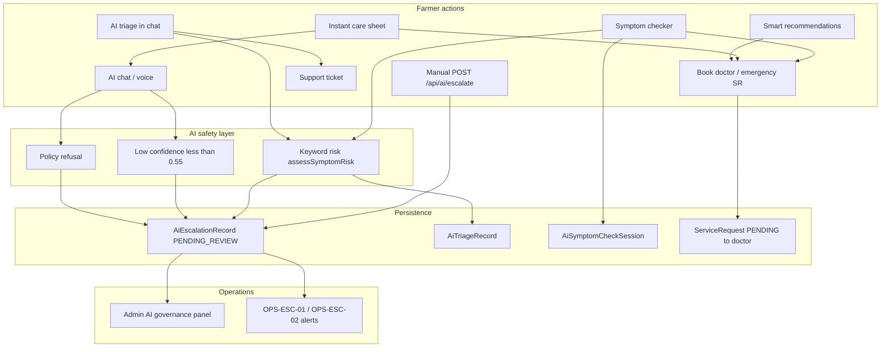

# AI Escalation Disclosure — Compliance Implementation Plan

**Document type:** Compliance / legal engineering plan  
**Version:** 1.0.0  
**Date:** 2026-05-30  
**Status:** **Implemented** — see `AI_ESCALATION_DISCLOSURE_OPERATIONS.md` for runbook  
**Scope:** User-facing disclosure for AI-driven escalation, human handoff, doctor consultation paths, and emergency guidance  
**Repositories:** `pranidoctor_user` (Flutter), `pranidoctor-web` (Next.js public legal + admin), `pranidoctor-backend` (API, safety, ops monitoring)

**Related documents**

| Document | Path |
|----------|------|
| AI disclaimer plan (non-diagnostic, confidence) | `docs/compliance/ai/ai-disclaimer-plan.md` |
| AI disclaimer operations | `docs/compliance/ai/AI_DISCLAIMER_OPERATIONS.md` |
| Escalation disclosure operations | `docs/compliance/ai/AI_ESCALATION_DISCLOSURE_OPERATIONS.md` |
| Verification report | `docs/compliance/ai/AI_ESCALATION_DISCLOSURE_VERIFICATION_REPORT.md` |
| Veterinary disclaimer plan (doctor booking, emergency) | `docs/compliance/veterinary/veterinary-disclaimer-plan.md` |
| Operational escalation monitoring | `pranidoctor-backend/docs/production/operations/escalation-monitoring-plan.md` |
| Phase 6 AI architecture | `docs/PHASE6_AI.md` |
| Phase 6 implementation | `docs/PHASE6_AI_IMPLEMENTATION.md` |

---

## 1. Executive summary

Prani Doctor uses **multiple escalation paths** that users often conflate: (1) **in-app AI safety escalations** (`AiEscalationRecord` for ops review), (2) **urgency guidance** from triage/symptom checker without guaranteed human response, (3) **doctor service requests** (`ServiceRequest` booking), and (4) **emergency actions** (tel link, emergency doctor filter). None of these paths guarantee **immediate licensed veterinary care** or **pre-review of AI output by a clinician before display**.

**Current posture:** Backend enforces escalation records and flags (`humanRedirect`, `escalationRecommended`, `escalationRequired`) on core AI chat/triage; mobile surfaces partial CTAs (support ticket, services list, emergency dial). Disclosure text does not consistently explain **what happens after escalation**, **who reviews**, **response times**, or **limitations of keyword-based emergency detection**. Symptom checker and smart recommendations escalate **in UX only** (CTAs) — they do **not** always create `AiEscalationRecord` rows.

This plan defines **disclosure requirements** for human review availability, escalation triggers, escalation limitations, and user expectations. It complements the AI disclaimer plan (limitations, non-diagnosis) and the veterinary disclaimer plan (licensed doctor services). **Implementation is deferred** until legal counsel approves canonical BN+EN copy.

**Design principle (from architecture):** *Human escalation has priority; AI never replaces doctors; escalation queues review — no automatic doctor assignment or auto-messaging.*

---

## 2. Escalation workflow analysis (as-built)

### 2.1 System map

### 2.2 AI recommendations

| Source | Mechanism | Escalation behavior | Human involved? |
|--------|-----------|---------------------|-----------------|
| **Smart recommendations** | Rule engine (`smart-v1`): overdue vaccines, deworm, pregnancy, feed, low inventory | `explanation*` may say "consult vet"; `deepLink` to farm routes; **no** `AiEscalationRecord` | Only if user acts on CTA |
| **Follow-up suggestions** | Post–symptom-check; HIGH bucket → "Book vet or emergency" | `deepLink: /services` | User-initiated booking |
| **Chat triage card** | `POST /api/ai/triage` via chat flow | `escalationRequired` → UI: result page + **support ticket** | Support ≠ vet assignment |
| **Triage recommendation text** | Appends `buildHumanRedirect()` in backend | Text only | No automatic handoff |

**Files:** `src/modules/ai/recommendations/smart-recommendation.service.ts`, `src/modules/ai/follow-up/follow-up.service.ts`, Flutter `SmartRecommendationsPage`, `TriageCard`

**Disclosure gap:** Recommendations read like actionable farm tasks; users may assume Prani Doctor **will** arrange a vet. Copy must state recommendations are **automated reminders**, not escalations to clinical staff.

### 2.3 Doctor escalation (clinical services)

| Path | Entry | Backend | Escalation vs booking |
|------|-------|---------|------------------------|
| **Book consultation** | Services → doctor profile | `ServiceRequest` (`DOCTOR_HOME_VISIT`, `ONLINE_CONSULTATION_LATER`) | Separate from AI; human doctor workflow |
| **Emergency doctor** | Instant care, emergency filter | `EMERGENCY_DOCTOR`, `priority=EMERGENCY` | Ops SLA monitoring (OPS-REQ-03); **manual assignment** |
| **Symptom checker CTA** | "চিকিৎসক খুঁজুন" | Navigates to `/services` | Does not pass AI context to doctor queue automatically |
| **Follow-up / smart rec** | `/services` deep link | Same | No linked `AiEscalationRecord` → doctor |

**Files:** `src/modules/lead/customer-lead.service.ts`, Flutter `BookConsultationPage`, `instant_care_sheet.dart`

**Disclosure gap:** Booking creates a **request**, not a confirmed appointment. Doctor accept time is **not** SLA-guaranteed in product copy today. AI urgency does **not** auto-prioritize SR in code reviewed for this plan.

### 2.4 Human handoff (AI escalation records)

| Trigger | `AiEscalationReason` | Auto-created? | API / UI |
|---------|----------------------|---------------|----------|
| HIGH triage bucket | `HIGH_RISK` | Yes (`POST /api/ai/triage`) | Triage UI → support, not escalate API |
| Emergency keywords in symptoms | `EMERGENCY_SYMPTOM` (`urgencyLevel >= 10`) | Yes (triage) | Same |
| LLM confidence &lt; 0.55 | `LOW_CONFIDENCE` | Yes (chat) | `escalationRecommended` + hint in bubble |
| Diagnosis/prescription refusal | `POLICY_REFUSAL` | Yes (chat input/output) | Refusal message + `humanRedirect` |
| User/doctor request | `DOCTOR_REQUEST` | **Manual** `POST /api/ai/escalate` | `AiChatNotifier.escalateToHuman()` — **not wired** to primary CTAs |
| Symptom checker HIGH/emergency | — | **No** `AiEscalationRecord` | Only `escalationRequired` flag + services CTA |

**Record lifecycle:** `PENDING_REVIEW` → `QUEUED` → `HANDED_OFF` | `DISMISSED` (admin governance). **No** automated push/SMS to user on status change. **No** doctor inbox integration from escalation id.

**Files:** `src/modules/ai-veterinary-core/ai-veterinary-core.service.ts`, `repository/ai-veterinary.repository.ts`, `safety/ai-safety.guardrails.ts`, admin `AiGovernancePanel.tsx`

**Keyword triggers (emergency):** `not breathing`, `cannot stand`, `severe bleeding`, `unconscious`, `convulsion`, `seizure`, `bloat`, plus BN patterns (`শ্বাস`, `রক্ত`, `অচেতন`). HIGH (non-emergency): `high fever`, `bloody`, `collapse`, etc. **Limitation:** substring/regex matching — false negatives and false positives possible.

### 2.5 Emergency escalation

| Layer | What "emergency" means | User-facing action |
|-------|------------------------|-------------------|
| **AI keyword emergency** | `assessSymptomRisk` → `emergency: true`, `urgencyLevel: 10` | Recommendation: immediate vet care; `EMERGENCY_SYMPTOM` escalation record (triage/chat path only) |
| **Symptom red flags** | `AiSymptomNode.redFlag` | Listed in UI; contributes to risk via labels |
| **Instant care sheet** | `VetDisclaimerBanner` + emergency visit / call | `tel:` `MOBILE_EMERGENCY_PHONE` + `DoctorDiscoveryFilters(emergencyOnly: true)` |
| **Service request emergency** | `EMERGENCY_DOCTOR` | Admin/doctor workflow; ops alerts if backlog |

**Files:** `instant_care_sheet.dart`, `symptom-checker.service.ts`, `escalation-alerts.ts` (`OPS-ESC-02` unreviewed `EMERGENCY_SYMPTOM`)

**Critical distinction for disclosure:** AI "emergency" = **possible emergency based on text**; platform emergency service = **booking/phone**, not ambulance dispatch. App is **not** a substitute for local emergency services.

---

## 3. Disclosure requirements

Legal counsel must approve final wording. Below defines **required themes**, **placement**, and **draft intent** (BN+EN).

### 3.1 Human review availability

Users must understand **who** may review escalations and **what they should not expect**.

| Theme | Required disclosure |
|-------|---------------------|
| **Pre-display review** | AI responses are **not** reviewed by a veterinarian before they appear, except where a future human-in-the-loop feature is explicitly labeled. |
| **Escalation review** | `AiEscalationRecord` is reviewed by **platform operations / clinical ops**, not automatically by the doctor shown in discovery. Review is for **safety and quality**, not individual treatment planning in the app. |
| **No guaranteed callback** | Creating an escalation or support ticket does **not** guarantee a phone call, chat, or visit within a stated time. |
| **Doctor availability** | Licensed doctors on the platform have **separate availability**; booking depends on assignment, accept, and geography. `DoctorSchedule` is not real-time in current stack. |
| **Hours & locale** | Service may be limited by business hours, region coverage, and language (BN/EN). |
| **Kill switch** | When LLM is disabled (governance), responses may be generic rules-based — still **not** vet-reviewed per message. |

**Draft short (T-escalation-1):**  
*"AI answers are not checked by a veterinarian before you see them. If we flag your case for review, our team may look at it later — that is not the same as booking a vet visit."*

**Placement:** AI chat (first use), symptom checker result, triage/emergency states, public legal AI section.

### 3.2 Escalation triggers

Users must understand **why** the app suggests human help — without implying a diagnosis.

| Trigger (system) | User-facing label intent | Must NOT imply |
|------------------|--------------------------|----------------|
| `emergency: true` / `EMERGENCY_SYMPTOM` | "Possible emergency based on what you reported" | Confirmed emergency; disease identified |
| `HIGH` / `HIGH_RISK` | "Urgent — seek veterinary care soon" | AI diagnosed severe illness |
| `escalationRecommended` (low confidence) | "AI is uncertain — a veterinarian should advise" | AI is "wrong" or "right" with probability |
| `POLICY_REFUSAL` | "AI cannot diagnose or prescribe — use doctor consultation" | User was blocked unfairly |
| Red flag symptoms (structured) | "These symptoms often need prompt professional attention" | Each red flag = confirmed critical condition |
| Smart rec / follow-up vet CTA | "Reminder to consult a vet for farm care" | Platform scheduled a vet |
| Manual escalate | "You asked for human follow-up" | Immediate clinician assigned |

**Transparency:** Where feasible, show **trigger category** (e.g. "Urgency detected from symptoms" vs "AI uncertain") — not raw internal enums.

**Placement:** Escalation strip replaces subtle banner (per AI disclaimer plan §5.4); symptom checker emergency card; chat when `humanRedirect` or `escalationRecommended`.

### 3.3 Escalation limitations

Users must understand **what the system cannot do**.

| Limitation | Disclosure requirement |
|------------|------------------------|
| **No auto doctor assignment** | Escalation does not assign or dispatch a specific veterinarian. |
| **No auto messaging** | Escalation does not message doctors or farmers on your behalf (architecture rule). |
| **Keyword / rules detection** | Emergency detection uses **keyword and rule lists** — may miss emergencies not described or misclassify benign text. |
| **Symptom checker gap** | Structured symptom check may show urgent CTAs **without** creating an internal escalation ticket — ops may not see every urgent UI state. |
| **Support ticket ≠ clinical escalation** | "Contact support" is **customer support**, not tele-triage or prescription service. |
| **Online consultation** | `ONLINE_CONSULTATION_LATER` is scheduling intent — **no** live video session in current product. |
| **Geographic & connectivity** | Rural connectivity may delay sync/offline AI responses — do not delay emergency care waiting for app. |
| **Third-party LLM** | When LLM enabled, content is generated externally; guardrails reduce risk but do not eliminate it. |
| **Ops backlog** | Internal alerts (OPS-ESC-01/02) monitor backlog — **no** user-facing SLA for escalation review time today. |

**Draft short (T-escalation-2):**  
*"Flagging urgency in the app does not send a vet to your farm. Always use local emergency services for life-threatening situations."*

**Placement:** Emergency states (mandatory), instant care sheet (alongside existing vet disclaimer), triage HIGH/emergency, booking confirmation step.

### 3.4 User expectations

Set clear **behavioral expectations** and **recommended actions**.

| Expectation | Disclosure intent |
|-------------|-------------------|
| **User responsibility** | You are responsible for observing the animal and deciding when to seek in-person care. |
| **Do not delay** | If the animal appears critically ill, **do not wait** for AI or support responses. |
| **Primary actions by severity** | Emergency → call local vet / emergency phone + book emergency service; HIGH → book or visit vet soon; uncertain AI → consult vet when practical; policy refusal → use doctor consultation feature. |
| **Accurate input** | Escalation quality depends on symptoms you report. |
| **After booking** | Track request in Services; doctor must accept; admin may assign in some flows. |
| **After support ticket** | Support responds per ticket workflow — different from medical escalation queue. |
| **Continuing AI** | Where legally permitted, user may continue AI after seeing escalation (secondary action) with explicit "at your own risk" framing (counsel approval). |

**CTA hierarchy (recommended UX — counsel to confirm):**

| Severity | Primary CTA | Secondary CTA |
|----------|-------------|---------------|
| Emergency | Call emergency / book `EMERGENCY_DOCTOR` | View nearest services |
| HIGH | Find vet / book consultation | Contact support |
| Low confidence | Book consultation | Continue chat (if permitted) |
| Policy refusal | Doctor consultation | — |

**Align mobile with backend:** Prefer `POST /api/ai/escalate` for audit when user chooses "Request human review" — today UI often only opens support (`aiEscalateSupport`).

---

## 4. Unified escalation disclosure taxonomy

Proposed tiers (extend AI disclaimer T1/T2/T3):

| Tier | ID | Purpose |
|------|-----|---------|
| **E1 — Persistent** | `ai.escalation.banner` | Short: AI ≠ emergency services; vet booking separate |
| **E2 — Contextual** | `ai.escalation.{trigger}` | Trigger-specific (emergency, HIGH, low confidence, refusal) |
| **E3 — Comprehensive** | `ai.escalation.full` | Full §3.1–3.4 in settings / legal page |

**Locale:** Canonical **BN + EN** from same source as AI/vet disclaimers (`MobileLegalConfig` / admin legal settings recommended).

### 4.1 Feature → disclosure mapping

| Feature / state | E1 | E2 | E3 link | CTA set |
|-----------------|----|----|---------|---------|
| AI chat `humanRedirect` | ✓ | ✓ refusal/uncertain | ✓ | Doctor consult + optional escalate API |
| AI chat `escalationRecommended` | ✓ | ✓ low confidence | ✓ | Doctor consult |
| Triage `escalationRequired` | ✓ | ✓ HIGH/emergency | ✓ | Emergency / vet + disclose support ≠ vet |
| Symptom checker `emergency` | ✓ | ✓ emergency | ✓ | Call/book + keyword limitation |
| Symptom checker `escalationRequired` | ✓ | ✓ HIGH | ✓ | Find vet |
| Smart recommendations (vet mention) | ✓ | ✓ automated reminder | ✓ | Deep link only |
| Instant care (emergency actions) | Vet banner ✓ | ✓ E2 emergency | ✓ | Tel + services |
| Book consultation / emergency SR | Vet plan ✓ | ✓ booking limitations | ✓ | Expectation on assign/accept |
| Support ticket from AI | ✓ | ✓ support vs clinical | ✓ | Response time not guaranteed |

---

## 5. Gap analysis

| Gap | Severity | Notes |
|-----|----------|-------|
| No dedicated escalation disclosure strings (EN/BN broken on `aiEscalationHint`) | **High** | Same strings EN in `bn.json` |
| User thinks "Contact support" = vet escalation | **High** | `TriageCard`, `AiResultPage` use support route |
| `POST /api/ai/escalate` unused in primary UI | **High** | Audit trail gap; `escalateToHuman` orphaned |
| Symptom checker urgent states invisible to `AiEscalationRecord` | **High** | Ops OPS-ESC-02 may miss symptom-only emergencies |
| Human review / timing not explained anywhere | **High** | §3.1 |
| Keyword emergency limitations not disclosed | **High** | False negative risk |
| AI emergency conflated with `EMERGENCY_DOCTOR` | **Medium** | Marketing/instant care |
| Smart recommendations imply vet coordination | **Medium** | Rule-based only |
| No user notification on escalation status change | **Medium** | `HANDED_OFF` opaque |
| Online consult framed as video in instant care | **Medium** | No WebRTC — disclosure + product alignment |
| Public legal page lacks escalation section | **Medium** | Web `/legal/disclaimer` |
| Admin governance visible; farmer-facing process not | **Low** | Trust/transparency opportunity |

---

## 6. Placement strategy (documentation target)

### 6.1 Flutter (`pranidoctor_user`)

| Location | Requirement |
|----------|-------------|
| `AiChatPage` | E2 strip on `humanRedirect` / `escalationRecommended`; primary CTA doctor consult; wire optional escalate API |
| `ai_message_bubble.dart` | Replace one-line hint with E2 + CTA |
| `TriageCard` / `AiResultPage` | E2 for `escalationRequired`; primary vet/emergency CTA; relabel support as non-clinical |
| `SymptomCheckerPage` `_ResultView` | E2 emergency + keyword limitation; emergency tel if config present |
| `SmartRecommendationsPage` | E2 on items mentioning vet |
| `instant_care_sheet.dart` | E1/E2: AI doctor vs emergency visit distinction |
| `BookConsultationPage` | Cross-link veterinary disclaimer expectations (assign/accept) |
| i18n | New keys: `aiEscalationEmergency`, `aiEscalationHigh`, `aiEscalationUncertain`, `aiEscalationSupportVsVet`, etc. |

### 6.2 Public web (`pranidoctor-web`)

| Location | Requirement |
|----------|-------------|
| `/legal/disclaimer` | Section: AI escalation, human review, emergency limitations |
| `/terms` | Cross-link E3 |
| BN parity | Locale toggle or `/legal/disclaimer/bn` |

### 6.3 Backend API (`pranidoctor-backend`)

| Rule | Detail |
|------|--------|
| Response fields | Optional `escalationDisclosure` + `escalationTrigger` on chat/triage/symptom-check when escalation flags true |
| `POST /api/ai/escalate` | Return disclosure in response confirming limitations |
| Symptom checker | Consider creating `AiEscalationRecord` when `emergency` or `escalationRequired` (engineering decision — document counsel impact on ops volume) |
| OpenAPI | Document escalation semantics for mobile |

---

## 7. Compliance and operations alignment

| Area | Requirement |
|------|-------------|
| **AI disclaimer plan** | E2 escalation copy extends §3.7; avoid duplicate contradictory strings |
| **Veterinary disclaimer plan** | Doctor booking + instant care emergency disclosures stay authoritative for SR |
| **Escalation monitoring** | OPS-ESC-01/02 are internal — user disclosures must **not** promise ops SLA |
| **Audit** | Log `escalationDisclosureVersion` + trigger type in `AiSafetyAuditLog` / mobile legal acceptance |
| **Incident response** | Near-miss where user relied on AI urgency → review trigger keywords + disclosure prominence |
| **Store policies** | Emergency/disclaimer visibility for health apps |

---

## 8. Verification plan

### 8.1 Content

| ID | Check | Pass criteria |
|----|-------|---------------|
| EC-01 | Legal approval E1/E2/E3 BN+EN | Signed version registry |
| EC-02 | No guarantee of immediate vet care | Zero "instant vet" claims without qualification |
| EC-03 | Emergency keyword limitation stated | Visible on emergency UI states |

### 8.2 UI / UX

| ID | Check | Pass criteria |
|----|-------|---------------|
| EU-01 | Emergency symptom fixture | E2 + primary emergency CTA before dismiss |
| EU-02 | Low confidence chat fixture | E2 + doctor CTA |
| EU-03 | Support CTA labeled non-clinical | Copy distinguishes support vs vet |
| EU-04 | Instant care | AI vs emergency visit distinction shown |

### 8.3 Behavioral / API

| ID | Check | Pass criteria |
|----|-------|---------------|
| EB-01 | `POST /api/ai/triage` emergency keyword | `EMERGENCY_SYMPTOM` record + flags |
| EB-02 | Symptom checker HIGH | `escalationRequired` + UI E2 (record optional per product decision) |
| EB-03 | `POST /api/ai/escalate` | 201 + disclosure field; audit `ESCALATION_CREATED` |
| EB-04 | Policy refusal chat | `humanRedirect` + escalation record |

### 8.4 Cadence

| Activity | Frequency |
|----------|-----------|
| Escalation copy + placement audit | Each major release |
| Keyword list review (vet advisor) | Quarterly |
| Cross-check with ops runbook | When OPS-ESC alerts tuned |

---

## 9. Appendix A — Escalation copy matrix (draft intent)

Counsel must approve final BN+EN. Align with `ai-disclaimer-plan.md` Appendix B where overlapping.

| State | EN intent | BN intent |
|-------|-----------|-----------|
| Human review | "AI messages are not pre-approved by a veterinarian. Platform review, if any, is not a diagnosis." | "AI-র উত্তর প্রদর্শনের আগে চিকিৎসক দেখেন না। পর্যালোচনা নির্ণয় নয়।" |
| Emergency (AI) | "Possible emergency based on your description — seek immediate in-person care. App cannot dispatch emergency services." | "আপনার বর্ণনায় সম্ভাব্য জরুরি অবস্থা — অবিলম্বে স্থানীয় চিকিৎসকের সহায়তা নিন।" |
| HIGH urgency | "Urgent — arrange veterinary care as soon as possible. Booking may take time." | "জরুরি — যত তাড়াতাড়ি সম্ভব চিকিৎসকের পরামর্শ নিন।" |
| Low AI confidence | "AI is uncertain — a licensed veterinarian should advise on next steps." | "AI নিশ্চিত নয় — পরবর্তী পদক্ষেপের জন্য চিকিৎসকের পরামর্শ নিন।" |
| Support vs vet | "Support helps with the app; they do not provide emergency veterinary treatment." | "সাপোর্ট অ্যাপ সহায়তা দেয়; জরুরি চিকিৎসা প্রদান করে না।" |
| Escalation recorded | "Your case may be reviewed by our team. This does not book a veterinarian." | "আমাদের টিম পর্যালোচনা করতে পারে। এটি চিকিৎসক বুকিং নয়।" |
| Keyword limitation | "Urgency detection uses the words you enter and may not catch every emergency." | "জরুরি শনাক্তকরণ আপনার লেখা অনুযায়ী; সব জরুরি অবস্থা ধরা নাও পড়তে পারে।" |

---

## 10. Appendix B — Code reference

### Backend

| File | Role |
|------|------|
| `src/modules/ai-veterinary-core/ai-veterinary-core.service.ts` | Chat/triage escalation creation |
| `src/modules/ai-veterinary-core/safety/ai-safety.service.ts` | Confidence, triage, refusal evaluation |
| `src/modules/ai-veterinary-core/safety/ai-safety.guardrails.ts` | Keywords, threshold 0.55, `buildHumanRedirect` |
| `src/modules/ai/symptom-checker/symptom-checker.service.ts` | Structured check; no escalation record |
| `src/shared/monitoring/escalation/escalation-alerts.ts` | OPS-ESC-01/02 |
| `prisma/schema.prisma` | `AiEscalationRecord`, `AiEscalationReason`, `AiEscalationStatus` |

### Flutter

| File | Role |
|------|------|
| `lib/features/ai/presentation/widgets/triage_card.dart` | Triage escalation CTAs |
| `lib/features/ai/presentation/ai_result_page.dart` | Support CTA |
| `lib/features/ai/presentation/phase8/symptom_checker_page.dart` | Emergency UI + find vet |
| `lib/features/ai/presentation/ai_providers.dart` | `escalateToHuman()` |
| `lib/features/home/presentation/widgets/instant_care_sheet.dart` | Emergency + AI entry |

### Web admin

| File | Role |
|------|------|
| `src/components/admin/ai-ops/AiGovernancePanel.tsx` | Escalation list + kill switch |

---

## 11. Implementation phases (reference only)

| Phase | Scope |
|-------|-------|
| **P0** | Canonical E1/E2 strings; fix BN i18n; relabel support CTA; emergency E2 on symptom/triage |
| **P1** | Wire `POST /api/ai/escalate`; API disclosure fields; public legal section |
| **P2** | Symptom checker → `AiEscalationRecord` (if approved); user-facing escalation status; acceptance versioning |
| **P3** | Trigger-specific UI labels; online consult copy alignment; ops SLA **not** exposed until guaranteed |

---

*End of plan. Documentation only — no code changes. Requires legal approval and tracking in compliance roadmap alongside `ai-disclaimer-plan.md`.*
