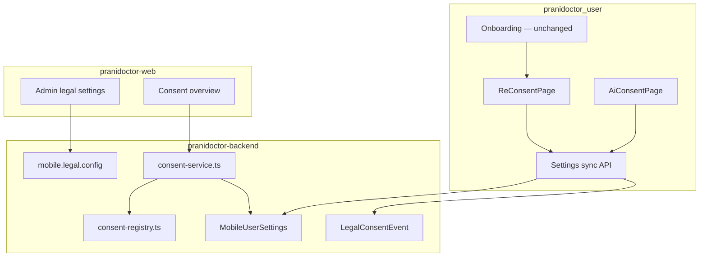

# User Consent Flow — Implementation

**Status:** Implemented (2026-05-30)  
**Plan:** `docs/compliance/consent/user-consent-flow-plan.md`  
**Legal compliance notes:** `docs/compliance/legal/COMPLIANCE_NOTES.md`

---

## Summary

User consent is implemented as a **version-aware registry** backed by PostgreSQL, with append-only audit events, mobile re-consent UX, API gates, and admin visibility. **Onboarding slides are unchanged.** Existing mobile settings APIs are preserved and extended.

---

## Architecture



---

## Consent registry

| Type | API key | Version field | Hard gate |
|------|---------|---------------|-----------|
| `PRIVACY` | `privacy` | `privacyVersion` | Yes (when enforced) |
| `TERMS` | `terms` | `termsVersion` | Re-consent UX |
| `AI_PROCESSING` | `ai` | `aiConsentVersion` | AI routes |

**Code:** `pranidoctor-backend/src/legacy/web/lib/mobile-settings/consent-registry.ts`

---

## Storage

| Store | Purpose |
|-------|---------|
| `MobileUserSettings` | Current accepted version + timestamp per type |
| `LegalConsentEvent` | Append-only audit (grant + withdraw via `metadata.action`) |
| `Setting` (`mobile.legal.config`) | Published version strings and in-app summaries |

---

## APIs (preserved + additive)

| Method | Path | Notes |
|--------|------|-------|
| GET | `/api/mobile/settings` | Extended `legal.*` flags — backward compatible |
| POST | `/api/mobile/settings/sync` | `acceptPrivacyVersion`, `acceptTermsVersion`, `acceptAiVersion` |
| GET | `/api/mobile/settings/privacy` | Unchanged |
| GET | `/api/mobile/settings/terms` | Unchanged |
| GET | `/api/mobile/settings/ai-consent` | AI document |
| GET | `/api/mobile/consent/status` | **New** — registry + reconsent list |
| POST | `/api/mobile/consent/withdraw` | **New** — `{ consentType, reason? }` |
| GET | `/api/admin/legal-consent` | Audit log (existing) |
| GET | `/api/admin/consent/overview` | **New** — acceptance counts |

---

## Re-consent workflow (mobile)

1. User completes onboarding (unchanged) → login/register.
2. After auth, `settingsProvider` loads legal bundle.
3. If privacy or terms version stale → `GoRouter` redirects to `/reconsent`.
4. `ReConsentPage` accepts both via single `settings/sync` call.
5. If user opens AI features without AI consent → redirect to `/settings/ai-consent`.
6. Soft banner (`LegalConsentCoordinator`) shown only when hard re-consent is not active.

**Env:** Set `MOBILE_ENFORCE_PRIVACY_CONSENT=true` in production to block protected legacy routes server-side.

---

## Admin visibility

- **Settings → Legal & privacy** (`/admin/settings/legal`): version editor, acceptance overview, recent audit events.
- **API:** `GET /api/admin/consent/overview` for aggregate counts.

---

## Withdrawal

- Settings → Privacy → **Withdraw privacy consent**
- Clears `MobileUserSettings.privacyAcceptedVersion` and appends audit event with `metadata.action = WITHDRAWN`
- User is redirected to re-consent on next navigation

---

## Verification

```bash
# Backend unit test
cd pranidoctor-backend && pnpm exec vitest run src/legacy/web/lib/mobile-settings/consent-service.test.ts

# SQL — recent events
SELECT * FROM "LegalConsentEvent" ORDER BY "createdAt" DESC LIMIT 20;
```

### Manual checklist

- [ ] New user login → re-consent screen before home
- [ ] Accept → `LegalConsentEvent` rows for PRIVACY + TERMS
- [ ] Bump `privacyVersion` in admin legal settings → re-consent on next launch
- [ ] AI route without AI consent → AI consent page
- [ ] Withdraw privacy → re-consent gate returns
- [ ] Onboarding slides still show on first launch (no legal text)

---

## Out of scope (future)

- Clinical sharing JIT consent (`CLINICAL_SHARE`)
- Automated data export / erasure tied to withdrawal
- Doctor/technician consent supplements
