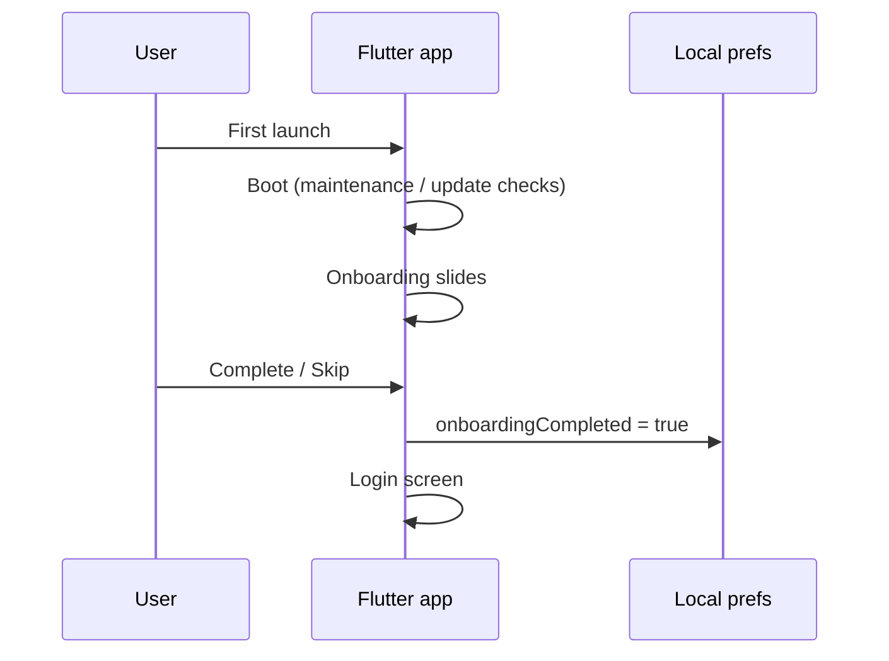
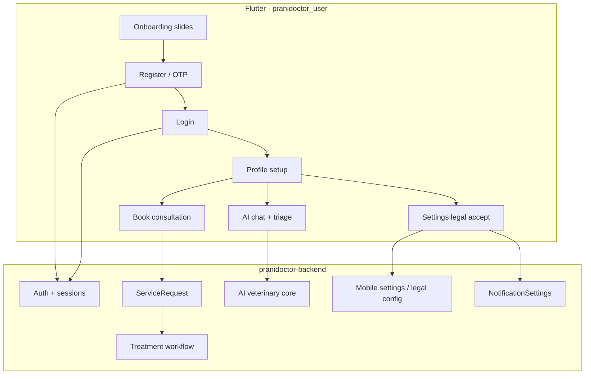
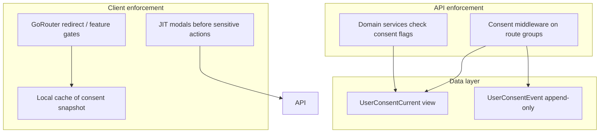
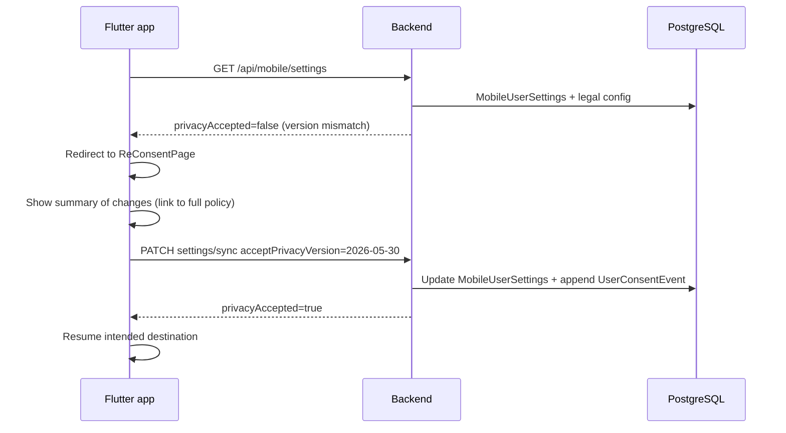
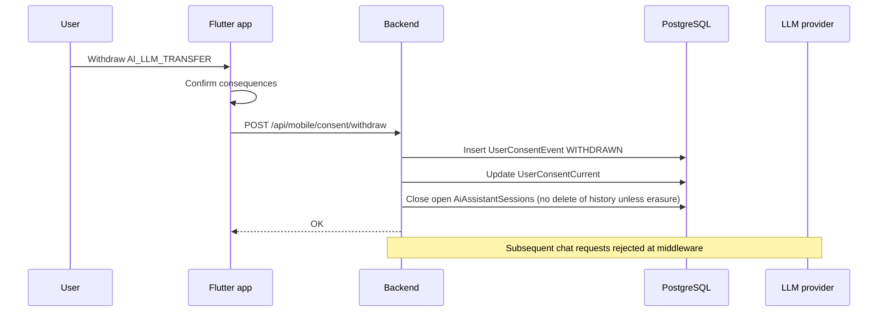

# User Consent Flow Plan — Prani Doctor Platform

**Document type:** Compliance / product engineering plan  
**Status:** Implemented — see `USER_CONSENT_IMPLEMENTATION.md`  
**Version:** 1.1.0  
**Date:** 2026-05-30  
**Scope:** `pranidoctor_user` (Flutter), `pranidoctor-backend` (API/worker), `pranidoctor-web` (admin BFF + public legal pages)

**Related documents**

| Document | Path |
|----------|------|
| **Implementation (as-built)** | `USER_CONSENT_IMPLEMENTATION.md` |
| Privacy policy plan | `docs/compliance/legal/privacy-policy-plan.md` |
| Terms of service plan | `docs/compliance/legal/terms-of-service-plan.md` |
| Mobile legal API | `pranidoctor-backend/src/legacy/web/lib/mobile-settings/mobile-settings-service.ts` |
| Flutter settings / legal UI | `pranidoctor_user/lib/features/settings/` |
| Auth flows | `docs/api/AUTH_FLOW.md` |
| AI veterinary core | `docs/PHASE6_AI.md` |
| Treatment / consultation | `docs/PHASE5_TREATMENT.md` |

---

## Executive summary

Prani Doctor collects personal, veterinary, farm, and AI interaction data across onboarding, registration, login, consultation booking, and AI assistant workflows. **Consent is partially implemented today:** privacy and terms acceptance is stored per user with version strings, but acceptance is **optional**, **not enforced at registration**, and **not collected** for AI processing, clinical data sharing, push notifications, or marketing beyond a settings toggle.

This plan defines a **layered consent architecture** — what to ask, when, how to version it, how to re-prompt, where to store it, how to audit it, and how to honor withdrawal — grounded in the **as-built codebase** and aligned with Bangladesh-focused operations with GDPR-style patterns where they raise the compliance bar.

**Primary jurisdiction assumption:** Bangladesh (Digital Security Act, ICT Act, BTRC SMS rules). GDPR/UK GDPR patterns included for future expansion and vendor DPAs.

---

## 1. Workflow analysis (as-built)

Understanding where data is collected today determines where consent must attach.

### 1.1 Onboarding (first-run UX)

| Aspect | Current behavior | Consent relevance |
|--------|------------------|-------------------|
| Entry | `BootPage` → guest redirect → `OnboardingPage` if not completed | No legal text |
| Content | Brand slides (`BrandAssets.onboardingSlides`) | Informational only |
| Completion | Local flag via `authPreferencesProvider.setOnboardingCompleted(true)` | Not synced to server |
| Next step | Navigate to login (`context.go(AppRoutes.login)`) | No privacy/terms gate |

**Gap:** Onboarding is purely product education. It must **not** be treated as consent. Legal acceptance belongs in registration or first authenticated session.



### 1.2 Registration

Two paths coexist; neither requires legal acceptance before account creation.

| Path | Flow | Data collected at signup | Consent today |
|------|------|--------------------------|---------------|
| **OTP (primary)** | Phone → `POST /api/mobile/auth/otp/request` → verify → tokens | Phone, optional name on first profile sync | None |
| **Password (alternate)** | Name, phone, optional email, password → `POST /api/mobile/auth/register` | Same + password hash server-side | None |

**Mobile behavior verified:**

- `register_page.dart` — no privacy/terms checkbox; only "remember session".
- `otp_page.dart` — optional FCM push token sent at verify via `pushRegistrationProvider`.
- Post-auth routing (`auth_navigation.dart`) — home vs profile setup based on `needsProfileSetup`; **no legal gate**.

**Legal basis today:** Implicit contract / legitimate interest for account creation; **insufficient** for health data, AI third-party transfer, and marketing.

### 1.3 Login

| Method | Endpoint | Side effects | Consent touchpoints |
|--------|----------|--------------|---------------------|
| OTP verify | `POST /api/mobile/auth/otp/verify` | Session + optional push token | None |
| Password login | `POST /api/mobile/auth/login` | Session + optional push token | None |
| Session restore | Refresh token rotation | Device registry update | None |

**Audit:** `AuthAuditEvent` records login success/failure with channel, IP, user agent — **authentication audit, not consent audit**.

**Gap:** No post-login check for stale `privacyAcceptedVersion` / `termsAcceptedVersion`. Nav guard (`nav_guard.dart`) routes authenticated users to home without legal validation.

### 1.4 Profile completion (post-registration)

| Step | Screen | Data | Consent |
|------|--------|------|---------|
| Basic info | `ProfileCompletionPage` | Name, location hierarchy | None |
| Address | `profile_address_page.dart` | Village/union selection | Location data — no explicit consent |
| Photo | Upload pipeline | Profile image | None |

Profile completion is a **functional gate** (`needsProfileSetup`), not a consent gate.

### 1.5 Consultation booking

Entry: `BookConsultationPage` → `POST /api/mobile/service-requests`.

| Field | Purpose | Sensitivity |
|-------|---------|-------------|
| `animalId` | Links clinical context | High |
| `problemOrSymptom` | Free-text symptoms | Very high (health) |
| `villageId` / `locationText` | Visit location | High |
| `preferredTime` | Online consultation scheduling | Medium |
| `serviceType` | Home visit / emergency / online | Medium |

**Downstream:** Assigned doctor receives case via `ServiceRequest`; treatment workflow writes `TreatmentConsultation`, `Prescription`, `TreatmentNote` with append-only treatment audit.

**Consent today:** None at booking. User assumes service terms implicitly.

**Required consent layer:** **Clinical data processing & provider sharing** — distinct from general privacy policy; should be collected at first booking or first symptom entry (just-in-time).

### 1.6 AI workflows

| Feature | Entry | Data sent | Consent today |
|---------|-------|-----------|---------------|
| AI chat | `AiChatPage` | Message, locale, optional `caseId` / `livestockId` | Disclaimer banner only (`AiDisclaimerBanner`) |
| Symptom triage | In-chat / `symptom_checker_page.dart` | Symptom codes + free text | Same |
| AI settings | `AiSettingsPage` | Local-only: locale, suggestions, `rememberConversations` | Preference, not legal consent |
| Voice assistant | `ai_voice_input_page.dart` | Transcript → AI core | No separate voice consent |
| Smart alerts / recommendations | Phase 8 pages | Farm/animal aggregates | No opt-in beyond using feature |

**Backend:** `AiVeterinaryCoreService.chat` persists messages in `AiAssistantSession` / `AiAssistantMessage`; may invoke OpenAI/Anthropic when configured. Admin **kill switch** (`AiGovernanceService`) can disable LLM platform-wide — not per-user consent.

**Gap (critical):** Informational disclaimer ≠ consent for third-party LLM processing of health-adjacent content. See privacy-policy-plan gap **G-04**.



---

## 2. Consent architecture

### 2.1 Design principles

| Principle | Rationale |
|-----------|-----------|
| **Layered consent** | One checkbox for "everything" is invalid for health + AI + marketing |
| **Just-in-time (JIT)** | Ask when the processing starts, not only at signup |
| **Granular withdrawal** | User can disable marketing without deleting account |
| **Versioned documents** | Policy changes trigger re-consent, not silent acceptance |
| **Server authoritative** | Client displays; backend enforces gates on protected APIs |
| **Append-only audit** | Accept and withdraw events are never overwritten |
| **Role-aware** | Customer, doctor, AI technician, admin have different consent sets |
| **Bilingual** | `bn-BD` primary; consent UI and document hashes per locale |

### 2.2 Consent taxonomy

| ID | Consent type | When required | Legal basis (primary) | Current state |
|----|--------------|---------------|----------------------|---------------|
| `CORE_TERMS` | Terms of Service | Before first use of authenticated features | Contract | ⚠️ Opt-in via Settings only |
| `CORE_PRIVACY` | Privacy Policy | Before first use of authenticated features | Contract + transparency | ⚠️ Opt-in via Settings only |
| `CLINICAL_SHARE` | Share health/symptom data with assigned veterinary providers | First consultation booking or symptom submission for a visit | Contract + explicit consent | ❌ Missing |
| `AI_ASSIST` | AI assistant (in-app rules/stub engine) | First AI chat or triage | Explicit consent | ❌ Disclaimer only |
| `AI_LLM_TRANSFER` | Send chat/triage content to third-party LLM (OpenAI/Anthropic) | Before first LLM-backed response (may combine with `AI_ASSIST`) | Explicit consent | ❌ Missing |
| `AI_MEMORY` | Retain conversation memory beyond session | When enabling "remember conversations" or server-side memory | Consent | ⚠️ Local toggle only |
| `PUSH_TRANSACTIONAL` | Push for service updates (visit assigned, Rx ready) | Before FCM token registration | Contract / legitimate interest with opt-out | ⚠️ OS permission only |
| `PUSH_MARKETING` | Promotional push | Before marketing sends | Consent | ⚠️ `marketingEnabled` toggle (default false) |
| `SMS_OTP` | SMS for authentication | OTP request | Contract + telecom rules | ⚠️ Implicit on OTP use |
| `LOCATION_PROFILE` | Store village/address hierarchy | Profile completion | Contract | ⚠️ Implicit |
| `CRASH_DIAGNOSTICS` | Sentry / Crashlytics | First app launch after install (or settings) | Legitimate interest / consent | ⚠️ Env-gated bootstrap |
| `VOICE_PROCESSING` | Voice capture + transcript storage | First voice session | Explicit consent | ❌ Missing |
| `AI_TECHNICIAN_SERVICE` | Livestock AI / semen field service data | AI technician booking flow | Contract + explicit | ❌ Missing (separate flow) |

**Scope of this plan:** Customer (`CUSTOMER` role) mobile app flows. Doctor/technician/admin consent supplements are referenced in ToS plan; not expanded here.

### 2.3 Consent surfaces (UX placement)

| Moment | Consents to collect | UX pattern |
|--------|---------------------|------------|
| **Registration complete** (before home) | `CORE_PRIVACY`, `CORE_TERMS` | Full-screen modal with links + required checkboxes + "Accept and continue" |
| **Profile location step** | `LOCATION_PROFILE` (if not covered by privacy) | Inline notice + continue |
| **First push token register** | `PUSH_TRANSACTIONAL` | `NotificationPermissionPage` + short purpose string |
| **Enable marketing toggle** | `PUSH_MARKETING` | Settings switch with linked notice |
| **First consultation book** | `CLINICAL_SHARE` | JIT sheet: "Your symptoms and animal info will be shared with the assigned doctor" |
| **First AI chat send** | `AI_ASSIST`, `AI_LLM_TRANSFER` | Gate screen before chat; persist acceptance |
| **Enable AI memory** | `AI_MEMORY` | Confirm when toggling `rememberConversations` on |
| **First voice session** | `VOICE_PROCESSING` | Gate before microphone |
| **Policy version bump** | Affected core consents | Re-consent modal (see §4) |
| **Settings → Privacy** | View / re-accept / withdraw | Existing `PrivacyPage` extended |

### 2.4 Enforcement layers



| Layer | Responsibility |
|-------|----------------|
| **Client** | UX, offline cache, block navigation to gated features |
| **API middleware** | Authoritative deny with `CONSENT_REQUIRED` + `{ consentType, currentVersion }` |
| **Domain services** | Secondary checks before side effects (LLM call, doctor notification, marketing send) |
| **Worker / cron** | Marketing and reminder jobs filter on `NotificationSettings` + consent records |

**Route groups for middleware (proposed):**

| Group | Required consents |
|-------|-------------------|
| `/api/mobile/service-requests` (POST) | `CORE_PRIVACY`, `CORE_TERMS`, `CLINICAL_SHARE` |
| `/api/ai/*` (chat, triage) | `CORE_PRIVACY`, `AI_ASSIST`, `AI_LLM_TRANSFER` (if LLM enabled) |
| `/api/mobile/notifications/*` marketing | `PUSH_MARKETING` |
| Device push register | `PUSH_TRANSACTIONAL` (soft — allow register but tag consent version) |
| All other authenticated mobile | `CORE_PRIVACY`, `CORE_TERMS` |

---

## 3. Version tracking

### 3.1 Current implementation

Legal document versions are **centralized config**, not per-user history:

| Source | Key / field | Purpose |
|--------|-------------|---------|
| `Setting` row | `mobile.legal.config` JSON | Canonical `privacyVersion`, `termsVersion`, URLs, placeholder content |
| Env fallback | `MOBILE_PRIVACY_POLICY_URL`, `MOBILE_TERMS_OF_SERVICE_URL` | Production URLs |
| Default | `2026-05-01` | Hardcoded in `mobile-settings-service.ts` |
| Per user | `MobileUserSettings.privacyAcceptedVersion`, `termsAcceptedVersion` | Last accepted version string |
| Timestamps | `privacyAcceptedAt`, `termsAcceptedAt` | Last accept time only |

**Acceptance API:** `PATCH /api/mobile/settings/sync` with `acceptPrivacyVersion` / `acceptTermsVersion` — server accepts **only if** body version matches current config version.

**Computed flags:** `GET /api/mobile/settings` returns `legal.privacyAccepted` and `legal.termsAccepted` booleans (version equality check).

**Limitations:**

1. No history of prior acceptances or withdrawals.
2. No versioning for AI, clinical, or notification consents.
3. No document hash / locale — version string only.
4. No linkage to auth context (IP, device) at accept time.
5. Re-consent not enforced in router or API.

### 3.2 Version identifier scheme

| Document / consent | Version format | Example | Publisher |
|--------------------|----------------|---------|-----------|
| Privacy Policy | `YYYY-MM-DD` or semver | `2026-05-30` | Legal + admin config |
| Terms of Service | `YYYY-MM-DD` | `2026-05-30` | Legal + admin config |
| AI addendum | `YYYY-MM-DD` | `2026-06-01` | Legal + `mobile.legal.config` extension |
| Clinical sharing notice | `YYYY-MM-DD` | `2026-05-30` | Product copy in i18n + config |
| Consent bundle (breaking) | Integer increment | `consent_schema_v2` | Engineering migration |

**Rules:**

- **Material change** → increment date version → trigger re-consent for affected types.
- **Clarification-only** → patch note in changelog; no re-consent if legal counsel agrees.
- Store **`documentSha256`** of canonical markdown/HTML per locale at publish time.
- Admin publishes via `Setting` update + optional admin UI (future).

### 3.3 Proposed config shape (extends `mobile.legal.config`)

```json
{
  "privacyVersion": "2026-05-30",
  "termsVersion": "2026-05-30",
  "aiAddendumVersion": "2026-06-01",
  "clinicalNoticeVersion": "2026-05-30",
  "documents": {
    "privacy": {
      "bn": { "url": "https://pranidoctor.com/privacy?lang=bn", "sha256": "…" },
      "en": { "url": "https://pranidoctor.com/privacy?lang=en", "sha256": "…" }
    },
    "terms": { "…": "…" },
    "aiAddendum": { "…": "…" }
  },
  "consentRequirements": {
    "minimumAppVersion": "1.2.0",
    "hardGateConsents": ["CORE_PRIVACY", "CORE_TERMS"],
    "reconsentWithinDays": null
  }
}
```

### 3.4 Client version sync

| Step | Behavior |
|------|----------|
| App boot (authenticated) | `GET /api/mobile/settings` → compare `legal.*Accepted` |
| Stale version | Set `consentGateProvider` → redirect to re-consent flow |
| Offline | Cache last known versions; block gated features if cache stale > 7 days |
| Accept | `sync` with version strings → invalidate providers |

---

## 4. Re-consent strategy

### 4.1 Triggers

| Trigger | Affected consents | User experience |
|---------|-------------------|-----------------|
| Privacy policy material update | `CORE_PRIVACY` | Blocking modal on next launch; read-only mode until accept |
| Terms material update | `CORE_TERMS` | Same |
| AI addendum update | `AI_ASSIST`, `AI_LLM_TRANSFER` | Block AI routes; allow rest of app |
| Clinical notice update | `CLINICAL_SHARE` | Block new bookings; existing cases continue |
| Regulatory order | As specified | Admin flag `forceReconsentTypes[]` |
| User withdrawal of core consent | `CORE_PRIVACY` or `CORE_TERMS` | Account restricted (see §7) |

### 4.2 Soft vs hard gates

| Gate type | Behavior | Use when |
|-----------|----------|----------|
| **Hard** | Cannot reach home / API returns 403 | Core privacy/terms expired |
| **Soft** | Banner + limited features | Non-critical policy clarification |
| **Feature-scoped** | Only AI or booking blocked | Submodule policy change |
| **Grace period** | 14-day banner then hard | Major migration; communicate in advance |

**Recommended default:** Hard gate for `CORE_PRIVACY` + `CORE_TERMS`; feature-scoped for AI and clinical.

### 4.4 Re-consent flow (customer app)



### 4.5 Decline path

If user declines updated core terms:

1. Cannot use authenticated features (contractual necessity).
2. Offer **account export** (when built) and **logout**.
3. Do not silently delete data — trigger **restricted mode** until erasure request processed.
4. Log `CONSENT_DECLINED` audit event.

### 4.6 Migration from current state

| Cohort | Rule |
|--------|------|
| Users with `privacyAcceptedVersion = 2026-05-01` | Grandfather until next bump, then re-consent |
| Users with null acceptance | Hard gate on next login (after rollout) |
| Seed / demo users | Seed script sets acceptance for complete profiles only |

---

## 5. Consent storage

### 5.1 Current storage (retain)

**`MobileUserSettings`** (Prisma) — keep for fast boolean checks:

```prisma
model MobileUserSettings {
  userId                 String    @id
  privacyAcceptedVersion String?
  privacyAcceptedAt      DateTime?
  termsAcceptedVersion   String?
  termsAcceptedAt        DateTime?
  // … theme, locale
}
```

**`NotificationSettings`** — marketing / push preferences:

```prisma
model NotificationSettings {
  userId           String  @id
  marketingEnabled Boolean @default(false)
  // pushEnabled, remindersEnabled, …
}
```

**`Setting`** — platform legal config (`mobile.legal.config`).

**AI preferences** — **local only** today (`AiSettings` in Flutter secure/local storage); not consent records.

### 5.2 Proposed storage (additive)

#### 5.2.1 `UserConsentEvent` (append-only audit — source of truth)

```prisma
model UserConsentEvent {
  id            String            @id @default(cuid())
  userId        String
  consentType   ConsentType
  action        ConsentAction     // GRANTED | WITHDRAWN | DECLINED
  version       String            // document version at time of event
  documentSha256 String?          // optional integrity
  locale        String?           @default("bn-BD")
  channel       String            // mobile | web | admin
  ipAddress     String?
  userAgent     String?
  deviceId      String?           // UserDevice.id or deviceKey
  metadata      Json?             // { summaryShown: true, reconsentReason: "policy_update" }
  createdAt     DateTime          @default(now())

  user User @relation(fields: [userId], references: [id], onDelete: Cascade)

  @@index([userId, consentType, createdAt])
  @@index([consentType, createdAt])
}

enum ConsentType {
  CORE_PRIVACY
  CORE_TERMS
  CLINICAL_SHARE
  AI_ASSIST
  AI_LLM_TRANSFER
  AI_MEMORY
  PUSH_TRANSACTIONAL
  PUSH_MARKETING
  SMS_OTP
  LOCATION_PROFILE
  CRASH_DIAGNOSTICS
  VOICE_PROCESSING
  AI_TECHNICIAN_SERVICE
}

enum ConsentAction {
  GRANTED
  WITHDRAWN
  DECLINED
}
```

#### 5.2.2 `UserConsentCurrent` (materialized current state)

Option A — **derived view** (query latest event per type) — simpler, slower.  
Option B — **table updated in same transaction as event** — recommended for API middleware.

```prisma
model UserConsentCurrent {
  userId       String
  consentType  ConsentType
  status       ConsentStatus   // ACTIVE | WITHDRAWN | NEVER_SET
  version      String?
  grantedAt    DateTime?
  withdrawnAt  DateTime?
  updatedAt    DateTime        @updatedAt

  user User @relation(fields: [userId], references: [id], onDelete: Cascade)

  @@id([userId, consentType])
}

enum ConsentStatus {
  ACTIVE
  WITHDRAWN
  NEVER_SET
}
```

#### 5.2.3 Extend `MobileUserSettings` (optional convenience)

Add columns for hot-path checks without joining:

```prisma
aiAssistAcceptedVersion    String?
aiAssistAcceptedAt         DateTime?
clinicalShareAcceptedVersion String?
clinicalShareAcceptedAt    DateTime?
```

Keep **`UserConsentEvent`** authoritative; these columns are cache.

### 5.3 API contracts (proposed)

| Endpoint | Method | Purpose |
|----------|--------|---------|
| `/api/mobile/consent/status` | GET | All `UserConsentCurrent` + required versions from config |
| `/api/mobile/consent/grant` | POST | `{ consentType, version, locale? }` → event + current |
| `/api/mobile/consent/withdraw` | POST | `{ consentType, reason? }` → event + current |
| `/api/mobile/settings/sync` | PATCH | **Retain** — maps `acceptPrivacyVersion` → `CORE_PRIVACY` grant for backward compatibility |

### 5.4 Data residency and retention

| Data | Retention |
|------|-----------|
| `UserConsentEvent` | **7 years** minimum (regulatory/accountability); never hard-delete |
| `UserConsentCurrent` | Life of account |
| Withdrawn marketing consent | Events retained; stop processing immediately |
| LLM prompts after AI withdrawal | Stop new transfers; retention per AI data policy (see privacy plan §5) |

---

## 6. Consent auditability

### 6.1 Requirements

| Requirement | Implementation |
|-------------|----------------|
| Prove what user accepted | Event row: type, version, sha256, timestamp |
| Prove what was shown | `metadata.summaryShown`, document version + locale |
| Prove who / where | `userId`, `ipAddress`, `userAgent`, `deviceId`, `channel` |
| Prove withdrawal | `ConsentAction.WITHDRAWN` event; prior grants unchanged |
| Admin investigation | Read-only admin API + export CSV |
| Tamper resistance | Append-only table; no UPDATE/DELETE on events |
| Correlation | Optional `requestId` from request context in `metadata` |

### 6.2 Relationship to existing audit systems

| System | Scope | Consent use |
|--------|-------|-------------|
| `AuthAuditEvent` | Login, OTP, session | Complement — not substitute |
| Treatment audit (`appendTreatmentAudit`) | Clinical workflow | Log access after `CLINICAL_SHARE` active |
| `AiSafetyAuditLog` | AI refusals, escalations | Log LLM calls only if `AI_LLM_TRANSFER` active |
| Admin monitoring events | Web admin UX | Separate surface |
| `createAuditLogAsync` (security) | Admin mutations | Use for admin-forced re-consent flags |

### 6.3 Logging rules

**Do log:** consent type, action, version, user id, channel, request id.  
**Do not log:** full policy text, symptom content, chat messages in consent events.

### 6.4 Admin and compliance reports

| Report | Query |
|--------|-------|
| Users on outdated privacy version | `UserConsentCurrent` vs config |
| AI consent adoption | Count `AI_LLM_TRANSFER` ACTIVE |
| Withdrawal rate | Events where `action = WITHDRAWN` by type / month |
| Re-consent campaign | Events where `metadata.reconsentReason` set |

### 6.5 Verification checklist (pre-production)

- [ ] Grant creates exactly one `UserConsentEvent` + updates `UserConsentCurrent`
- [ ] Re-grant after withdrawal creates new GRANTED event; status ACTIVE
- [ ] API middleware denies when `NEVER_SET` or WITHDRAWN for required type
- [ ] `acceptPrivacyVersion` legacy path writes same events as new grant API
- [ ] Admin cannot delete consent events (DB permissions)
- [ ] Export includes consent timeline for data subject access requests

---

## 7. Withdrawal handling

### 7.1 Withdrawal vs account deletion

| Action | Scope | Account |
|--------|-------|---------|
| **Withdraw consent** | Stop specific processing | Account may remain |
| **Delete account** | Erasure request | Full lifecycle (see privacy plan §5) |

### 7.2 Per-type withdrawal effects

| Consent type | Withdrawal effect | Ongoing lawful basis |
|--------------|-------------------|----------------------|
| `CORE_PRIVACY` | **Restrict account** — read-only export + logout; no new processing | Retention for legal claims |
| `CORE_TERMS` | Same as core privacy | Same |
| `CLINICAL_SHARE` | Block new bookings; existing active cases continue until closed | Contract for ongoing treatment |
| `AI_ASSIST` / `AI_LLM_TRANSFER` | Block AI routes; end open AI sessions; no new LLM calls | None for new inference |
| `AI_MEMORY` | Delete `AiAssistantMemory` rows for user; disable memory toggle | Session-only processing if user re-opts-in |
| `PUSH_MARKETING` | Set `marketingEnabled=false`; cancel queued marketing | Transactional unaffected |
| `PUSH_TRANSACTIONAL` | Unregister FCM token; in-app notifications only | SMS fallback if critical? (policy decision) |
| `VOICE_PROCESSING` | Delete pending transcripts; block voice UI | — |
| `CRASH_DIAGNOSTICS` | Disable Sentry/Crashlytics for user build flag | Aggregated anonymized stats only |

### 7.3 Withdrawal UX (Settings)

Extend Settings legal section:

| Control | Action |
|---------|--------|
| Privacy Policy page | "Withdraw consent" → confirm dialog → `POST /consent/withdraw` |
| AI Settings | Turning off memory → withdraw `AI_MEMORY` |
| Notification settings | Marketing off → withdraw `PUSH_MARKETING` |
| Dedicated "Privacy controls" hub | List all consents with status + withdraw per type |

**Copy requirements:** Explain consequences before confirm (e.g. "You will not be able to book consultations").

### 7.4 Withdrawal flow



### 7.5 Downstream job behavior

| Job | Filter |
|-----|--------|
| Marketing push campaign | `UserConsentCurrent.PUSH_MARKETING = ACTIVE` |
| AI usage rollup | Exclude withdrawn users from active counts |
| LLM orchestrator | Check consent before provider call |
| Reminder notifications | `NotificationSettings` + transactional consent |

### 7.6 Re-granting after withdrawal

User may re-grant at any time via same JIT or Settings flow. New `GRANTED` event with current version; no reuse of old acceptance timestamp for compliance proof.

---

## 8. Implementation phases (planning only)

| Phase | Deliverable | Depends on |
|-------|-------------|------------|
| **P0** | Publish canonical privacy/terms URLs; fix G-01 | Legal text |
| **P0** | Hard gate `CORE_PRIVACY` + `CORE_TERMS` post-login | Middleware + ReConsentPage |
| **P0** | `UserConsentEvent` + grant/withdraw APIs | Migration |
| **P1** | JIT `CLINICAL_SHARE` on booking | Mobile + service-requests middleware |
| **P1** | JIT `AI_ASSIST` + `AI_LLM_TRANSFER` before chat | AI routes middleware |
| **P1** | Registration checkbox → grant on success | Register/OTP UI |
| **P2** | Admin consent reports | Admin BFF |
| **P2** | Voice + AI technician consents | Feature teams |
| **P2** | Account restricted mode on core withdrawal | Session + profile flags |

**Out of scope for first release:** Doctor panel consent (separate provider agreement), enterprise tenant custom policies (`tenantId` legal config).

---

## 9. Gap summary (consent-specific)

| ID | Gap | Risk | Priority |
|----|-----|------|----------|
| C-01 | No consent at registration | Invalid/unproven consent | P0 |
| C-02 | No API enforcement of privacy/terms | Processing without acceptance | P0 |
| C-03 | No AI LLM consent | High — third-party health-adjacent data | P0 |
| C-04 | No clinical sharing JIT consent | Provider data sharing unclear | P1 |
| C-05 | No append-only consent audit | Cannot prove compliance | P0 |
| C-06 | Re-consent not wired to router | Silent outdated acceptance | P1 |
| C-07 | AI memory local-only | Server memory not tied to consent | P1 |
| C-08 | Withdrawal only via support (implicit) | Rights failure | P1 |
| C-09 | OTP/SMS consent implicit | BTRC transparency | P2 |
| C-10 | No bilingual document hash | Locale disputes | P2 |

Cross-reference: privacy-policy-plan gaps **G-04**, **G-08**; terms-of-service-plan enforcement sections.

---

## 10. Acceptance criteria (documentation complete when)

- [x] Workflow analysis covers onboarding, registration, login, consultation, AI
- [x] Consent architecture defines types, surfaces, enforcement
- [x] Version tracking documents current + proposed scheme
- [x] Re-consent strategy defines triggers, gates, decline path
- [x] Storage covers current tables + proposed schema
- [x] Auditability ties to existing audit systems
- [x] Withdrawal maps per-type downstream effects

**Next step (human):** Legal review of consent copy and Bangladesh-specific requirements before any P0 implementation.

---

*This document is planning material only. It does not constitute legal advice.*
