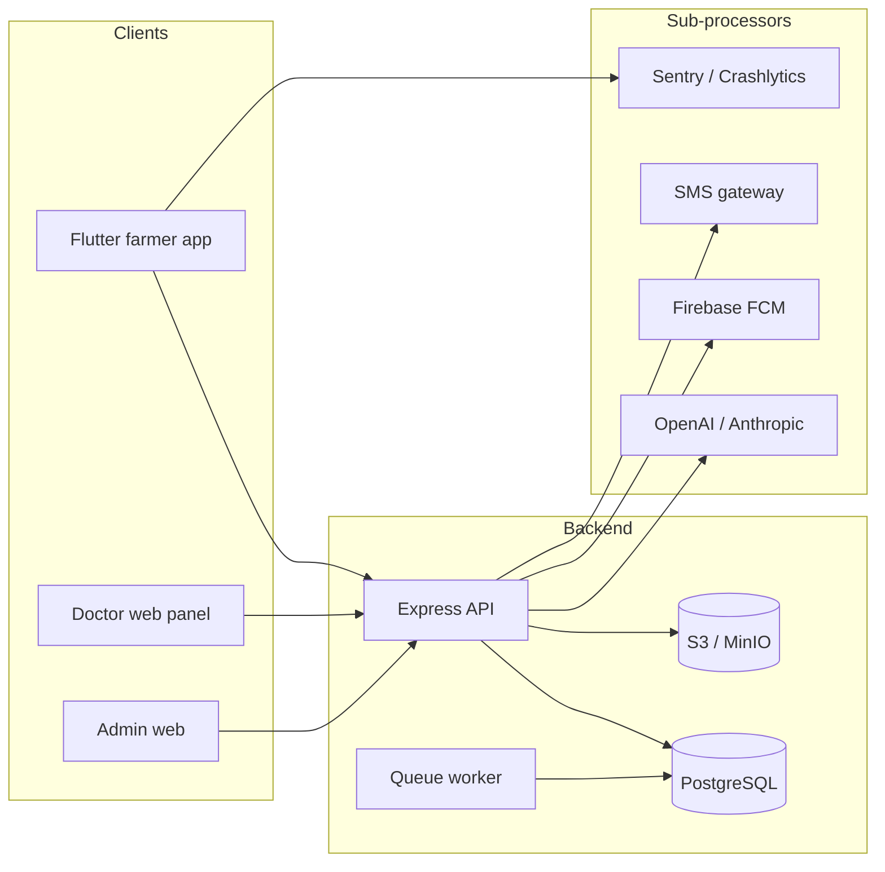

# Data Processing Policy Plan — Prani Doctor Platform

**Document type:** Compliance / data governance plan  
**Version:** 1.1.0  
**Date:** 2026-05-30  
**Status:** **Implemented** (documentation suite — see deliverables below)  
**Scope:** All personal and veterinary-adjacent data processing across `pranidoctor_user` (Flutter), `pranidoctor-backend` (API/worker), `pranidoctor-web` (admin BFF, doctor panel, public legal)  
**Primary jurisdiction (assumed):** Bangladesh — Digital Security Act, ICT Act, BTRC SMS rules; GDPR-style controls included as best practice for expansion

**Implemented deliverables (2026-05-30)**

| Document | Path |
|----------|------|
| **Canonical policy** | [DATA_PROCESSING_POLICY.md](./DATA_PROCESSING_POLICY.md) |
| **Operations runbook** | [DATA_PROCESSING_OPERATIONS.md](./DATA_PROCESSING_OPERATIONS.md) |
| **Data classification** | [DATA_CLASSIFICATION.md](./DATA_CLASSIFICATION.md) |
| **Retention mapping** | [RETENTION_MAPPING.md](./RETENTION_MAPPING.md) |
| **Audit requirements** | [AUDIT_REQUIREMENTS.md](./AUDIT_REQUIREMENTS.md) |
| **RoPA register** | [ROPA_REGISTER.md](./ROPA_REGISTER.md) |
| **Governance verification report** | [DATA_GOVERNANCE_REPORT.md](./DATA_GOVERNANCE_REPORT.md) |

**Related documents**

| Document | Path |
|----------|------|
| Privacy policy (public) | `docs/compliance/legal/PRIVACY_POLICY.md` |
| Privacy implementation plan | `docs/compliance/legal/privacy-policy-plan.md` |
| Data retention schedule | `docs/compliance/legal/DATA_RETENTION.md` |
| **Data processing policy** | `docs/compliance/data/DATA_PROCESSING_POLICY.md` |
| **Retention mapping (models)** | `docs/compliance/data/RETENTION_MAPPING.md` |
| User consent flow | `docs/compliance/consent/user-consent-flow-plan.md` |
| AI disclaimer / AI data | `docs/compliance/ai/ai-disclaimer-plan.md` |
| Veterinary disclaimer | `docs/compliance/veterinary/veterinary-disclaimer-plan.md` |
| Compliance notes | `docs/compliance/legal/COMPLIANCE_NOTES.md` |
| Legal operations | `docs/compliance/legal/LEGAL_OPERATIONS.md` |

---

## 1. Executive summary

Prani Doctor processes personal data to operate a **multi-sided veterinary marketplace** (farmers, doctors, AI technicians, admins) plus **farm management**, **AI advisory**, and **operational analytics**. Data is primarily stored in **PostgreSQL**, media in **S3-compatible object storage**, with optional **Redis**, **Firebase (FCM/Crashlytics)**, **SMS gateways**, and **third-party LLM providers** (OpenAI/Anthropic) for inference.

**Current posture:** Collection and storage are **broad and feature-rich**; governance controls are **partially implemented** — consent versioning and audit for legal/AI/vet disclaimers exist; retention and erasure are **documented but not fully automated**; access control is **role-based** but lacks universal data-access logging for admin reads.

This plan defines **processing purposes**, **retention**, **access controls**, **deletion**, and **audit requirements** mapped to six review areas. It serves as the internal **Record of Processing Activities (RoPA) blueprint** and implementation backlog for data-processing policy maturity.

---

## 2. Platform processing map

| Layer | Technologies | Data categories |
|-------|--------------|-----------------|
| Application DB | PostgreSQL / Prisma | Identity, clinical, farm ERP, AI sessions, audit |
| Object storage | S3/MinIO (`UploadedFile`) | Photos, documents, thumbnails |
| Cache / queue | Redis (optional), BullMQ | Job payloads — **must not** store raw clinical text long-term |
| Mobile local | SQLite cache, outbox | Denormalized copies; TTL 24h–7d |
| Observability | Prometheus, Pino, Sentry | Metrics, logs — PII minimization required |

---

## 3. Review area inventory (as-built)

### 3.1 Data collection

| Domain | What is collected | Source | Primary storage | Lawful basis (draft) |
|--------|-------------------|--------|-----------------|----------------------|
| **Account & identity** | Name, phone, email, password hash, role | Registration, admin provisioning | `User`, role profiles | Contract |
| **Authentication** | OTP challenges, sessions, refresh tokens, device registry | Login, OTP | `MobileOtpChallenge`, `UserSession`, `RefreshToken`, `UserDevice` | Contract / security LI |
| **Location (hierarchy)** | Division → village selection, address JSON, location text on requests | Profile, booking | `CustomerProfile`, `ServiceRequest` | Contract |
| **Animals & farm ERP** | Species, health, milk, feed, finance, inventory, batches | Farmer app modules | `AnimalProfile`, `HealthEvent`, `MilkRecord`, etc. | Contract |
| **Consultations** | Symptoms, urgency, scheduling, clinical notes, Rx | Service booking, doctor panel | `ServiceRequest`, `TreatmentCase`, `Prescription` | Contract / vital interests (animal) |
| **AI advisory** | Chat messages, triage symptoms, voice transcripts, context JSON | AI/voice features | `AiAssistantSession`, `AiAssistantMessage`, `VoiceTranscript` | Consent + contract |
| **AI field service** | Breeding/AI technician job details | Technician workflows | `AiServiceRequest`, `AiServiceRecord` | Contract |
| **Notifications** | Title, body, metadata; push tokens | System events, FCM registration | `Notification`, `UserDevice.pushToken` | Contract / consent (marketing) |
| **Analytics (ops)** | Token counts, KPI aggregates, auth outcomes | Backend/admin | `AiUsageRecord`, admin analytics repos | Legitimate interest |
| **Analytics (product)** | Crash context, debug notification hooks | Mobile bootstrap | Sentry/Crashlytics; local debug only | LI / consent |
| **Media** | File bytes, MIME, dimensions, checksum | Upload APIs | S3 + `UploadedFile` | Contract |
| **Legal consent** | Consent type, version, surface, IP, UA | Accept flows | `LegalConsentEvent`, `MobileUserSettings.*Accepted*` | Legal obligation / consent |
| **Offline sync** | Queued mutation payloads | Mobile outbox | `OfflineSyncItem.payloadJson` | Contract |

**Not collected (verified):** Continuous GPS tracking from device sensors; behavioral product analytics SDK (Firebase Analytics / PostHog) on customer app.

**Collection principles (policy target):**

1. **Data minimization** — collect only fields required for the stated purpose.
2. **Purpose limitation** — no secondary use (e.g. marketing from clinical notes) without consent.
3. **Transparency** — map each collection point to privacy policy § and in-app notices where sensitive (AI, location, clinical).

---

### 3.2 Data storage

| Store | Contents | Encryption / isolation | Retention owner |
|-------|----------|------------------------|-----------------|
| PostgreSQL | All structured PII and clinical data | TLS in transit; disk encryption ops responsibility | Platform DBA / backend |
| S3/MinIO | Media objects (private bucket) | Signed URLs; no public ACL | Storage module |
| Mobile SQLite cache | Profile, lists, AI disclaimer snapshots, drafts | Device filesystem | User device |
| Mobile secure storage | Auth tokens | Platform keychain | User device |
| Redis (if enabled) | Sessions, rate limits, queue jobs | Network isolated | Ephemeral |
| LLM vendor | Inference payloads (vendor-side logs) | DPA + zero-retention API settings (target) | Vendor |
| FCM | Push tokens at Google | Google terms | Vendor |
| Sentry/Crashlytics | Stack traces, breadcrumbs | Scrubbing config | Vendor |

**Storage rules (policy target):**

| Rule | Status |
|------|--------|
| No permanent public URLs for user media | ✅ Signed GET |
| Separate prod/staging databases | Ops |
| Secrets not in repo | ✅ `.env` pattern |
| Clinical data not in application logs | ⚠️ Verify log redaction |
| Queue payloads exclude full chat history where possible | ⚠️ Review job serializers |
| Backup encryption + access logging | Ops (`docs/backup-recovery.md`) |

**Soft-delete patterns (as-built):**

| Pattern | Models |
|---------|--------|
| `User.status = DELETED` | User lifecycle |
| `AnimalProfile.active = false` | Animal deactivation |
| `UploadedFileStatus.DELETED` | Upload soft delete |
| `deletedAt` | `ServiceInstance`, some media |
| Hard delete | Many farm modules (feed, milk DELETE APIs) |

---

### 3.3 AI processing

| Activity | Input data | Processing | Output / storage | Third party |
|----------|------------|------------|------------------|-------------|
| AI chat / triage | User message, locale, animal/farm context summaries | LLM completion + guardrails | `AiAssistantMessage`, response to client | OpenAI / Anthropic |
| Symptom checker | Symptom graph, RAG context | Rules + optional LLM | Triage DTO + escalation | Same |
| Smart recommendations | Livestock DB rules | Rule engine (no LLM required) | Recommendations + disclaimer | None |
| Voice assistant | Audio → STT → chat pipeline | STT/TTS + LLM | `VoiceSession`, `VoiceTranscript` | STT/TTS + LLM vendors |
| AI usage metering | Token counts, model, latency | Aggregation | `AiUsageRecord`, `AiUsageDailyRollup` | None |
| AI safety / escalation | Session refs, action codes | Logging | `AiSafetyAuditLog`, `AiEscalationRecord` | None |
| AI governance | Kill switch state | Admin toggle | `AiGovernanceState` + history | None |

**AI processing policy requirements:**

| Requirement | Implementation | Gap |
|-------------|----------------|-----|
| Explicit AI consent before LLM routes | `requireMobileAiConsent` on `/api/ai/*` | Voice API may bypass (see AI verification report) |
| No diagnosis/prescription claims | `ai-safety.guardrails.ts` | — |
| Minimum necessary context in prompts | Context builders | Periodic review |
| No prompt text in usage table | `AiUsageRecord` fields | ✅ |
| Stop processing on consent withdrawal | Kill switch + consent version | User-facing AI off toggle partial |
| Vendor DPAs + no training on user data | Policy statement | ⚠️ Legal execution |
| Retention of chat/voice | See §5 retention table | ⚠️ No purge job |

**Cross-reference:** AI is **assistive only**; distinct from **veterinary disclaimer** (`VET_ADVICE`) for human doctor consultations.

---

### 3.4 Analytics

| Type | What is processed | PII level | Audience |
|------|-------------------|-----------|----------|
| **Admin business analytics** | Farmer counts, revenue, service request volumes, geography aggregates | Low (aggregated) | Admin panel |
| **Farmer retention KPI** | Cohort active/new farmers | Aggregated user IDs in SQL | Admin analytics API |
| **Feed analytics** | Farm profit/loss, consumption aggregates | Linked to farm/customer | Mobile + admin |
| **AI ops** | Token usage, cost USD, per-user rollups | User/customer IDs in admin AI ops | Admin |
| **Prometheus / health** | HTTP metrics, queue depth, dependency status | Route labels normalized | Ops |
| **Auth audit analytics** | Login success/failure counts | User ID in events | Admin |
| **Mobile product analytics** | Not deployed (no FA/PostHog) | N/A | — |
| **Crash reporting** | Stack traces, release, env | Potential indirect PII | Sentry/Crashlytics when enabled |
| **Admin monitoring (web)** | Page views, API timing, auth outcomes | Normalized paths | Admin monitoring provider |

**Analytics policy requirements:**

1. **Aggregate by default** for product decisions; no sale of analytics data.
2. **Admin rollups** that include `userId`/`customerId` are **internal ops only** — access restricted to admin roles.
3. **Crash reporters:** scrub phone, name, message content from breadcrumbs before GA.
4. **Retention:** metrics hot 14–30 days (monitoring plan); `AiUsageRecord` 24 months (see retention schedule).
5. **Future product analytics:** require DPIA + consent banner before SDK deployment.

---

### 3.5 Notifications

| Channel | Data processed | Trigger | Preference control | Production status |
|---------|----------------|---------|-------------------|-------------------|
| In-app | `Notification.title`, `body`, `metadataJson`, read state | Service events, reminders | N/A (inbox) | ✅ |
| Push (FCM) | `UserDevice.pushToken`, notification payload | Same events | `NotificationSettings.pushEnabled` | ⚠️ Send path partial |
| SMS | Phone number, OTP/template text | OTP auth | OTP only today | ✅ when `OTP_MODE=live` |
| Email | Email address | Optional mailer | Not primary | Optional |
| Local (Flutter) | Scheduled treatment/vaccine reminders | Device scheduler | Module toggles | ✅ on-device |

**Notification settings (`NotificationSettings`):**

| Flag | Purpose | Default |
|------|---------|---------|
| `pushEnabled` | Transactional push | true |
| `marketingEnabled` | Promotional | **false** |
| `treatmentReminderEnabled` | Treatment reminders | true |
| `vaccineReminderEnabled` | Vaccine reminders | true |
| `orderServiceEnabled` | Service order updates | true |

**Policy requirements:**

- **Transactional** notifications: contract basis; cannot opt out of critical security OTP.
- **Marketing**: consent required; honor `marketingEnabled=false`.
- **Payload minimization:** no full clinical notes in push body; deep-link to authenticated in-app view.
- **Retention:** `Notification` rows 12 months (see §5); FCM token cleared on logout/device revoke.
- **Processor:** Google FCM — list in sub-processor register.

---

### 3.6 Media handling

| Flow | Validation | Storage | Access control | Deletion |
|------|------------|---------|----------------|----------|
| Mobile upload (`POST /api/mobile/uploads`) | MIME sniff, size caps, dangerous ext block | S3 + `UploadedFile` | Owner + signed URL; admin override route | Soft delete + S3 remove |
| Profile/cover pipeline | Resize, thumbnail | Same | Customer profile link | Replace on new upload |
| Consultation attachments | Via `TreatmentConsultation.attachmentRefs` | Same | Doctor + customer on case | With file delete API |
| Animal photos | Animal profile fields | Same | Owner | Deactivate animal retains refs |
| AI technician documents | License/certificate | Same | Admin review workflow | Admin moderation |
| Weight record photos | Optional URL field | Same | Owner | Per record delete |

**Media policy requirements:**

| Requirement | Status |
|-------------|--------|
| Private bucket; signed URLs only | ✅ |
| Virus/malware scanning | ❌ Not implemented — consider ClamAV stage |
| EXIF stripping for location privacy | ⚠️ Review image pipeline |
| Orphan object lifecycle (90d) | Planned (`DATA_RETENTION.md`) |
| Cross-user access denied | Owner check on download routes |
| Clinical attachment access logged | ⚠️ No universal `DataAccessLog` |

---

## 4. Processing purposes register (RoPA summary)

| ID | Purpose | Data categories | Subjects | Recipients | Legal basis (draft) | Retention (see §5) |
|----|---------|-----------------|----------|------------|---------------------|-------------------|
| P-01 | Account & authentication | Identity, credentials, device, audit | All users | Platform | Contract / LI | Account life + audit TTL |
| P-02 | Service booking & dispatch | Profile, location, animal, symptoms | Customers, doctors | Assigned provider | Contract | Request life + clinical carve-out |
| P-03 | Clinical treatment & Rx | Medical notes, prescriptions | Customers, doctors | Doctor, customer (limited) | Contract | 7–10y (legal review) |
| P-04 | Farm management | Animal, production, finance records | Customers | Platform | Contract | Account life |
| P-05 | AI advisory (LLM) | Chat, context summaries, usage | Customers | LLM vendors | Consent | 18mo inactive chat |
| P-06 | AI field technician service | Breeding/job data | Customers, technicians | Technician | Contract | Service life + billing |
| P-07 | Notifications | Contact, tokens, message content | Customers | FCM, SMS | Contract / consent | 12mo notifications |
| P-08 | Billing & payments | Transaction records | Customers, doctors | Payment processor (future) | Contract / legal | Statutory |
| P-09 | Security & fraud prevention | IP, UA, auth events | All users | Platform | Legitimate interest | 18mo auth audit |
| P-10 | Legal & consent proof | Consent type, version, metadata | Customers | Platform | Legal obligation | 24mo consent events |
| P-11 | Platform operations & analytics | Aggregates, token metrics | Admins (aggregated) | Platform | LI | 24mo usage detail |
| P-12 | Crash & reliability | Stack traces, device info | Customers | Sentry/Crashlytics | LI | 90d vendor |
| P-13 | Offline sync | Mutation payloads | Customers | Platform | Contract | 30d terminal queue |
| P-14 | Media storage | Files, metadata | All uploaders | S3 | Contract | Life of reference + orphan TTL |

**Prohibited processing (policy statement):** No sale of personal data; no use of clinical content for unrelated advertising; no foundation-model training on user content without explicit opt-in and DPA.

---

## 5. Retention policies

Canonical schedule: **`docs/compliance/legal/DATA_RETENTION.md`**. Summary with implementation status:

| Category | Retention period | Deletion method | Implemented? |
|----------|------------------|-----------------|--------------|
| Active user profile | Account lifetime | Erasure workflow | ⚠️ Manual |
| Deleted account PII | 30 days post-verified erasure | Anonymize / cascade | ❌ Planned |
| OTP challenges | ≤ 10 minutes | `expiresAt` | ✅ |
| Auth sessions / refresh tokens | Until expiry/revoke | Automatic | ✅ |
| Device registry | Revoke + 90 days | Batch job | ❌ Planned |
| Service / treatment / Rx | 7–10 years (counsel) | Archive | Policy only |
| AI chat messages | 18 months inactive | Anonymize/delete | ❌ Planned |
| AI usage (`AiUsageRecord`) | 24 months detail | Aggregate + purge | ❌ Planned |
| Voice transcripts | 90 days (no audio default) | Batch delete | ❌ Planned |
| Notifications | 12 months | Batch delete | ❌ Planned |
| `LegalConsentEvent` | 24 months | Batch delete | ❌ Planned |
| `AuthAuditEvent` | 18 months | Batch delete | ❌ Planned |
| Offline sync (terminal) | 30 days | Batch delete | ❌ Planned |
| Orphan media | 90 days unreferenced | S3 lifecycle | ❌ Planned |
| Mobile local cache | 24h–7d TTL | Client | ✅ |
| Crash reports (vendor) | 90 days | Vendor settings | Ops |
| Prometheus metrics | 14–30 days hot | Ops | Ops |

**Retention governance (target):**

1. **`RetentionPolicy` config** in admin or env — single source for cron jobs.
2. **Legal hold** flag on user/service request — suspends purge.
3. **Clinical/financial carve-out** — erasure anonymizes linkage, retains facts where law requires (see `DATA_RETENTION.md` § Clinical).
4. **Sub-processor deletion** — S3 objects, LLM vendor logs, FCM tokens on erasure checklist.

---

## 6. Access controls

### 6.1 Role-based access (application)

| Role | Typical data access | Enforcement |
|------|---------------------|-------------|
| `CUSTOMER` | Own profile, animals, requests, farm modules | Mobile auth + customer scoping on APIs |
| `DOCTOR` | Assigned requests, clinical tools, own profile | Doctor auth + assignment checks |
| `AI_TECHNICIAN` | Assigned AI service jobs, own profile | Technician auth |
| `ADMIN` / `SUPER_ADMIN` | Broad read/write via admin API | `requireAdminPanelApiAccess`, capability matrix |
| `SUPPORT` (if enabled) | Limited admin views | Role matrix |

**Technical controls (as-built):**

| Control | Location |
|---------|----------|
| JWT / session auth | Mobile, doctor, admin |
| Refresh token rotation | `RefreshToken` |
| Session/device revoke | `UserSession`, `UserDevice` |
| Privacy consent gate | `MOBILE_ENFORCE_PRIVACY_CONSENT` |
| AI consent gate | `/api/ai/*` middleware |
| Vet disclaimer gate | Doctor consult `POST /api/mobile/service-requests` |
| Upload owner check | Mobile/admin download routes |
| Signed S3 URLs | Short TTL (≈300s) |
| Admin capability matrix | `permissions.registry.ts` |

### 6.2 Access control policy (target)

| Rule | Requirement |
|------|-------------|
| Least privilege | Admin roles scoped by capability; no shared admin passwords |
| Need-to-know clinical | Doctors see assigned cases only; customers see own records |
| Break-glass | Documented superuser access for incidents; post-incident review |
| Production data in dev | Prohibited or anonymized snapshots only |
| Vendor access | Sub-processors via DPA; no admin credentials to vendors |
| Access reviews | Quarterly admin role audit |

### 6.3 Gaps

| Gap | Severity |
|-----|----------|
| No universal `DataAccessLog` for admin reads of customer/clinical records | High |
| Doctor panel access to clinical data not separately audited per view | Medium |
| Support role data minimization views not defined | Medium |
| LLM vendor staff access unknown — rely on DPA | High (legal) |

---

## 7. Deletion policies

### 7.1 Deletion types

| Type | Definition | When used |
|------|------------|-----------|
| **Hard delete** | Row/object removed | Farm records, user-initiated deletes |
| **Soft delete** | Flag/deactivate | Animals, uploads, some media |
| **Anonymize** | Remove PII linkage; retain clinical/financial facts | Account erasure with Rx retention |
| **Revoke** | Invalidate tokens/sessions | Logout, security incident |
| **Processor delete** | Request vendor purge | Erasure workflow step |

### 7.2 Current capabilities (as-built)

| Action | Customer | Doctor | Admin |
|--------|----------|--------|-------|
| Sign out / revoke sessions | ✅ | ✅ | ✅ |
| Deactivate animal | ✅ | — | — |
| Delete farm module records | ✅ Per API | — | — |
| Delete uploaded file | ✅ | ✅ | ✅ |
| Self-serve account erasure | ❌ | ❌ | — |
| Portable data export | ❌ | ❌ | — |
| User `DELETED` status | — | — | ⚠️ Partial (`UsersRepository.delete`) |

### 7.3 Deletion policy (target)

1. **Identity verification** — OTP to registered phone before erasure.
2. **SLA** — 30 calendar days for manual erasure requests (support queue).
3. **Scope matrix** — table per model: hard delete vs anonymize vs retain (link to privacy plan §5.2).
4. **Cascade rules** — respect `onDelete: Restrict` on active service requests; block erasure until resolved or anonymized.
5. **AI withdrawal** — stop new LLM calls; schedule chat/transcript purge per retention.
6. **Notification/marketing** — immediate stop on marketing opt-out; delete token on full erasure.
7. **Media** — delete S3 objects when `UploadedFile` deleted; orphan sweeper for dangling keys.
8. **Proof** — erasure ticket + audit event (`ERASURE_COMPLETED` — proposed).

### 7.4 Deletion vs retention conflicts

| Data | On account erasure | Rationale |
|------|-------------------|-----------|
| Prescriptions / treatment cases | Anonymize customer link; retain clinical record | Legal / animal welfare |
| Billing / payments | Retain per tax law | Legal obligation |
| `LegalConsentEvent` | Retain until retention TTL | Accountability |
| `AuthAuditEvent` | Retain until TTL | Security |
| AI chat | Delete/anonymize per AI retention | Consent withdrawal |
| Aggregated analytics | No change | Not personal |

---

## 8. Audit requirements

### 8.1 Audit systems (as-built)

| System | Events | Storage | Retention (target) |
|--------|--------|---------|------------------|
| `LegalConsentEvent` | Privacy, terms, AI, vet disclaimer accept | PostgreSQL append-only | 24 months |
| `AuthAuditEvent` | Login, OTP, logout, failures | PostgreSQL | 18 months |
| `AiSafetyAuditLog` | Refusals, escalations, safety actions | PostgreSQL | Align with AI chat |
| `AiGovernanceStateHistory` | Kill switch changes | PostgreSQL append-only | Indefinite (low volume) |
| `ServiceRequestTimelineEvent` | Status changes | PostgreSQL append-only | Life of request |
| `ServiceInstanceAuditEvent` | AI technician moderation | PostgreSQL | Service life |
| Treatment audit | Clinical workflow (partial) | PostgreSQL | Clinical retention |
| Admin monitoring events | Web admin UX, API timing | Web → backend ingest | Ops TTL |
| Prometheus / logs | HTTP, queue, AI metrics | Time-series / log store | 14–90 days |
| `AiUsageRecord` | Token/cost per call | PostgreSQL | 24 months |

### 8.2 Audit policy requirements

| Requirement | Detail | Status |
|-------------|--------|--------|
| **Append-only consent** | No UPDATE/DELETE on `LegalConsentEvent` | ✅ Design |
| **Who, what, when** | userId, consentType/version or action, timestamp | ✅ |
| **Where** | IP, userAgent, channel on consent/auth | ✅ |
| **Context without content** | metadata.surface; **no** chat/symptom text in consent rows | ✅ |
| **Admin query APIs** | `GET /api/admin/legal-consent`, auth audit routes | ✅ Partial |
| **Metadata in admin UI** | Surface/context visible to compliance | ❌ Gap |
| **Data access logging** | Admin views of customer/clinical record | ❌ Gap |
| **Erasure audit trail** | Proof of deletion steps | ❌ Gap |
| **Tamper protection** | DB permissions; no app-level delete on audit tables | ⚠️ Verify DB roles |
| **Export for DSAR** | CSV export of consent + auth timeline | ❌ Gap |

### 8.3 Required audit events (target catalog)

| Event | Trigger | Min fields |
|-------|---------|------------|
| `CONSENT_GRANTED` / `CONSENT_WITHDRAWN` | Legal/AI/vet accept or withdraw | type, version, userId, surface, ip, ua |
| `ACCOUNT_ERASURE_REQUESTED` | Support/API | userId, channel, ticketId |
| `ACCOUNT_ERASURE_COMPLETED` | Job finish | userId, tablesAffected, anonymizedIds |
| `ADMIN_DATA_ACCESS` | Admin views customer detail | adminId, targetUserId, resource, ip |
| `MEDIA_DOWNLOAD` | Signed URL issued (optional) | fileId, requesterId, purpose |
| `AI_LLM_INVOCATION` | Optional sample — not full prompt | sessionId, feature, provider, tokens |
| `EXPORT_REQUEST_FULFILLED` | DSAR export delivered | userId, scope, adminId |

### 8.4 Log hygiene

**Do log:** user IDs, resource IDs, action enums, latency, error codes.  
**Do not log:** passwords, OTP codes, full request bodies, chat content, prescription text, raw phone in info-level logs.

---

## 9. Sub-processors & cross-border transfer

| Processor | Purpose | Data shared | Safeguard (target) |
|-----------|---------|-------------|------------------|
| OpenAI / Anthropic | LLM inference | Prompts, context summaries | DPA, inference-only API |
| Google (FCM) | Push delivery | Token, notification payload | Google terms |
| SMS provider | OTP | Phone, message hash | BTRC compliance |
| Sentry / Crashlytics | Crash reports | Stack, device metadata | Scrubbing, DPA |
| Cloud host / S3 | Storage | All persisted data | Encryption, access policy |

**Transfer note:** Assume processing may occur outside Bangladesh (LLM, FCM, crash vendors). Public privacy policy must disclose international transfers and safeguards.

---

## 10. Gap analysis

| ID | Gap | Area | Severity | Remediation |
|----|-----|------|----------|-------------|
| D-01 | Retention purge jobs not scheduled | Storage | **High** | Retention worker + `RetentionPolicy` config |
| D-02 | No self-serve erasure/export | Deletion | **High** | DSAR API + support runbook |
| D-03 | No admin data-access audit log | Access | **High** | `DataAccessLog` middleware on admin reads |
| D-04 | LLM vendor DPAs not in repo | AI | **High** | Legal execution |
| D-05 | Voice API consent bypass | AI | **Medium** | Align with AI verification P0 |
| D-06 | Consent audit metadata hidden in admin UI | Audit | **Medium** | Extend list select + UI |
| D-07 | Orphan S3 lifecycle | Media | **Medium** | Bucket lifecycle rule |
| D-08 | EXIF / malware scanning on uploads | Media | **Low** | Pipeline hardening |
| D-09 | Product analytics SDK absent | Analytics | **Positive** | DPIA before add |
| D-10 | Offline queue may hold PII 30d+ | Storage | **Medium** | Payload minimization + purge job |
| D-11 | Clinical erasure vs retention matrix undocumented in code | Deletion | **Medium** | Erasure job spec per table |
| D-12 | No automated compliance tests for retention/consent | Audit | **Medium** | Integration tests |

---

## 11. Verification checklist

### 11.1 Collection & notice

- [x] RoPA table published — [ROPA_REGISTER.md](./ROPA_REGISTER.md) (§4 in plan retained as inventory)
- [ ] RoPA reviewed and signed by legal — purposes and bases confirmed
- [ ] Privacy policy § maps to each collection point in §3.1
- [ ] AI and vet disclaimers linked from processing notices
- [ ] Play Store / App Store data safety forms match RoPA

### 11.2 Storage & security

- [ ] Production DB and S3 encryption confirmed
- [ ] Log scrubbing verified (no clinical text in Pino defaults)
- [ ] Backup retention documented (`docs/backup-recovery.md`)

### 11.3 AI processing

- [ ] DPAs executed with LLM vendors
- [ ] Kill switch tested; consent gate on all LLM routes including voice
- [ ] `AiUsageRecord` contains no prompt/response text

### 11.4 Analytics & monitoring

- [ ] Crash reporters configured with PII scrubbing before prod
- [ ] Admin analytics access restricted to admin roles
- [ ] Prometheus retention matches monitoring plan

### 11.5 Notifications

- [ ] Marketing respects `marketingEnabled`
- [ ] Push payloads reviewed for minimization
- [ ] FCM token cleared on logout

### 11.6 Media

- [ ] Upload validation tests pass (MIME, size, dangerous ext)
- [ ] Cross-user download denied by integration test
- [ ] Orphan lifecycle ticket filed or enabled

### 11.7 Retention & deletion

- [x] Retention mapping published — [RETENTION_MAPPING.md](./RETENTION_MAPPING.md) + [../legal/DATA_RETENTION.md](../legal/DATA_RETENTION.md)
- [x] Erasure runbook published — [DATA_PROCESSING_OPERATIONS.md](./DATA_PROCESSING_OPERATIONS.md) §4
- [ ] Retention cron jobs deployed or ticketed per `DATA_RETENTION.md`
- [ ] Clinical anonymization matrix signed by legal

### 11.8 Audit

- [ ] `LegalConsentEvent` append-only at DB level
- [ ] Admin can query `VET_ADVICE`, `AI_PROCESSING`, `PRIVACY` events
- [ ] DSAR export includes consent + auth timeline

---

## 12. Implementation phases (reference — documentation only)

**Documentation phase (2026-05-30):** ✅ Complete — policy suite in `docs/compliance/data/` (see header deliverables table).

| Phase | Focus | Deliverables | Status |
|-------|-------|--------------|--------|
| **P0** | Legal foundation | Counsel-approved RoPA; vendor DPAs; public policy update | RoPA + policy docs ✅; DPAs pending legal |
| **P1** | Retention & erasure | Purge jobs; erasure/anonymize worker; support SLA | Runbook ✅; automation backlog |
| **P2** | Access & audit | `DataAccessLog`; admin audit UI; erasure audit events | Requirements doc ✅ |
| **P3** | AI & media hardening | Voice consent; EXIF strip; orphan S3 lifecycle | Backlog |
| **P4** | Automation | DSAR export API; compliance integration tests | Backlog |

---

## 13. Document maintenance

| Trigger | Action |
|---------|--------|
| New data collection field | Update §3.1 + §4 RoPA row |
| New third-party processor | Update §9 + public privacy policy |
| Retention job shipped | Update `DATA_RETENTION.md` status column |
| New consent type | Update §8.1 + consent registry docs |
| Major feature (e.g. payments) | DPIA addendum |

**Owner (proposed):** Engineering + Legal/Compliance liaison  
**Review cadence:** Quarterly, or before each major release

---

*End of plan. This document does not replace legal advice or the public Privacy Policy.*
