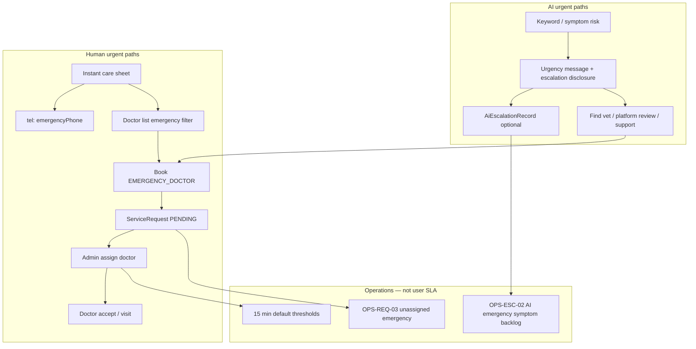

# Emergency & Urgent-Care Service Limitations — Compliance Plan

**Document type:** Compliance / legal engineering plan  
**Version:** 1.0.0  
**Date:** 2026-05-30  
**Status:** **Implemented** — see `EMERGENCY_LIMITATION_OPERATIONS.md`  
**Scope:** Emergency and urgent-care user journeys across AI advisory, doctor service requests, instant care, and ops escalation  
**Repositories:** `pranidoctor_user` (Flutter), `pranidoctor-web` (Next.js public legal + admin), `pranidoctor-backend` (API, safety, monitoring)

**Related documents**

| Document | Path |
|----------|------|
| AI escalation disclosure (handoff copy) | `docs/compliance/ai/ai-escalation-disclosure-plan.md` |
| AI escalation verification | `docs/compliance/ai/AI_ESCALATION_DISCLOSURE_VERIFICATION_REPORT.md` |
| Veterinary disclaimer (booking, emergency) | `docs/compliance/veterinary/veterinary-disclaimer-plan.md` |
| AI disclaimer (non-diagnostic) | `docs/compliance/ai/ai-disclaimer-plan.md` |
| Ops escalation monitoring | `pranidoctor-backend/docs/production/operations/escalation-monitoring-plan.md` |
| Service request booking audit | `docs/SERVICE_REQUEST_BOOKING_PLAN.md` |
| Emergency engine (design — not production) | `docs/ai/EMERGENCY_ENGINE.md` |

**Naming clarification**

| Term in product | Meaning | Limitation track |
|-----------------|---------|------------------|
| **AI emergency** | Keyword/rule urgency in chat/triage/symptom checker | AI + escalation disclosure |
| **Emergency doctor** | `EMERGENCY_DOCTOR` service request | This plan + veterinary disclaimer |
| **Instant care / emergency visit** | Mobile sheet: `tel:` + doctor discovery filter | This plan |
| **AI Technician emergency flag** | Field technician service (`isEmergency` on AI service requests) | Service-provider terms — **not** LLM emergency |

---

## 1. Executive summary

Prani Doctor is a **technology marketplace** connecting farmers with licensed veterinarians and field providers. It is **not** an emergency medical service, ambulance dispatch system, or 24/7 veterinary clinic.

**As-built behavior:**

- **AI** may label symptom text as possible emergency and recommend seeking care — it does **not** dispatch help, assign doctors, or guarantee response times.
- **Emergency doctor booking** creates a `ServiceRequest` in `PENDING` status; **admin manually assigns** a doctor; ops monitors SLAs (default **15 minutes** unassigned/accept targets) — these are **internal**, not promised to users in-app.
- **Doctor “availability”** in discovery means `acceptsEmergency: true` on profile — **not** real-time on-call status or live location.
- **Online consultation** records `preferredTime` intent only — **no** live video session, no automated no-show handling.
- **Instant care** may dial `MOBILE_EMERGENCY_PHONE` (config) then show doctors filtered for emergency — phone may fall back to support number.

Fragmented disclosures exist (vet disclaimer on booking/instant care, AI escalation strips on urgent AI states). There is **no unified emergency limitation framework** stating service availability bounds, response-time non-guarantees, and user duties for life-threatening cases.

This plan defines disclosure requirements for **emergency limitations**, **service availability limitations**, **response time limitations**, and **user responsibilities**. **Implementation requires legal approval** of canonical BN+EN text and coordination with existing vet/AI disclosure CMS.

---

## 2. Workflow review (as-built)

### 2.1 System map



### 2.2 AI workflows (advisory urgency)

| Step | Implementation | Urgent/emergency meaning | Limitation |
|------|----------------|--------------------------|------------|
| Symptom text analysis | `assessSymptomRisk()` in `ai-safety.guardrails.ts` | Keyword lists (EN/BN): not breathing, severe bleeding, unconscious, etc. | **Not** clinical triage; false +/- |
| Chat/triage HIGH | `escalationRequired`, `HIGH_RISK` / `EMERGENCY_SYMPTOM` records | Suggests vet contact timing | No doctor assigned |
| Symptom checker | `emergency: true`, `escalationRequired` | UI red card + escalation strip | **No** `AiEscalationRecord` (ops may not see) |
| Voice → chat | Same as chat | Same | STT errors possible |
| Smart recs | “Consult vet” in explanations | Management reminder | Not emergency dispatch |
| Kill switch / rules-only | Orchestrator fallback | Generic answers | May reduce urgency quality |

**Files:** `ai-veterinary-core.service.ts`, `symptom-checker.service.ts`, `ai-escalation-disclosure` CMS

**Critical distinction:** AI emergency = **“possible emergency based on your description.”** Platform emergency service = **booking request + optional phone.** Users must not treat AI urgency as confirmation of emergency or as activation of emergency services.

---

### 2.3 Doctor availability (discovery & capability flags)

| Signal | What user sees | What system stores | What it does **not** mean |
|--------|----------------|-------------------|---------------------------|
| Doctor list | Profiles in area with fees, categories | `DoctorProfile` ACTIVE | Doctor is idle right now |
| Emergency filter | `?emergency=true` on mobile doctors API | `acceptsEmergency: true` | On-call or en route |
| Online filter | `?onlineConsultation=true` | `acceptsOnlineConsultation: true` | Live video availability |
| Home visit | Category + `visitFeeBdt` | Service categories | Guaranteed home arrival |
| Schedule API | May exist in admin/foundation module | `DoctorsRepository.getSchedule()` returns **[]** (stub) | No slot booking |
| Area coverage | `DoctorProfileArea` | Geographic filter | Travel time guarantee |

**Mobile discovery:** `GET /api/mobile/providers/doctors` → `listDoctorsForMobile()` filters `providerStatus: ACTIVE` + optional `acceptsEmergency` / `acceptsOnlineConsultation` / area.

**Admin:** `POST /api/admin/doctors/:id/emergency-availability` toggles `acceptsEmergency`.

**Gap:** Listing shows doctors who **may** take emergency cases, not doctors **available now**. Marketing subtitles on instant care (ETAs) are illustrative unless tied to real metrics.

---

### 2.4 Consultation timing (service request lifecycle)

| Type | `ServiceRequestType` | Timing fields | Delivery reality |
|------|----------------------|---------------|------------------|
| Home visit | `DOCTOR_HOME_VISIT` | `submittedAt`, later `assignedAt`, `startedAt` | In-person; manual ops assign |
| Emergency doctor | `EMERGENCY_DOCTOR` | Same + `isEmergency`, `priority: EMERGENCY` | Same pipeline as home — **not** faster auto-route |
| Online consultation | `ONLINE_CONSULTATION_LATER` | **`preferredTime`** required on book | Async intent; **no** WebRTC/session model |

**Lifecycle (all doctor types):**

```
PENDING → (admin assign) → ASSIGNED → (doctor accept) → ACCEPTED → IN_PROGRESS → COMPLETED
```

| Stage | User-visible state | Timing implication |
|-------|-------------------|-------------------|
| `PENDING` | “Submitted” / waiting | **Unknown** wait; ops target 15 min for emergency (internal) |
| `ASSIGNED` | Doctor named | Doctor may not have seen notification (no push verified) |
| `ACCEPTED` / `IN_PROGRESS` | In progress | Visit/consult timing negotiated offline |
| `REJECTED` / `CANCELLED` | Failed exit | User must rebook or seek care elsewhere |

**Online consult missed window:** Ops monitor `findOnlineConsultMissedWindow()` — user is **not** notified automatically.

**Analytics trap:** `avgResponseMinutes` in admin analytics = **admin assignment delay**, not doctor accept or arrival — do not use in user-facing copy.

---

### 2.5 Emergency escalation (parallel tracks)

| Track | Trigger | Record | User action | Ops |
|-------|---------|--------|-------------|-----|
| **A — AI safety** | Keywords, HIGH triage, low confidence | `AiEscalationRecord` | Strips + find vet / `POST /api/ai/escalate` | OPS-ESC-01/02 |
| **B — Service request** | User books `EMERGENCY_DOCTOR` | `ServiceRequest` | Wait for assign/accept | OPS-REQ-03 |
| **C — Instant care** | User taps emergency visit / call | Optional `tel:` | Phone + emergency doctor list | None auto |
| **D — Support** | User opens support | `SupportTicket` | App help — **not** clinical triage | OPS-SUP-* |

**No automatic merge:** Track A does not create Track B. AI urgency does not auto-prioritize `ServiceRequest` queue.

**Phone config:** `GET /api/mobile/app-config` → `emergencyPhone` from `MOBILE_EMERGENCY_PHONE` or fallback `supportPhone` from settings — users should know this may be **support**, not a dedicated national emergency vet hotline.

**Design doc `EMERGENCY_ENGINE.md`:** Describes broadcast assignment, scoring, timeouts — **not implemented** in production assignment path (`assignment.service.ts` is manual admin assign only).

---

## 3. Disclosure requirements

Legal counsel must approve final wording. Below defines **required themes** and **draft intent** (BN+EN).

### 3.1 Emergency limitations

Users must understand what Prani Doctor **is not** and **cannot do** in life-threatening situations.

| Theme | Required disclosure |
|-------|---------------------|
| **Not emergency services** | Platform is not a clinic, ambulance, or government emergency line |
| **Not 24/7 guaranteed** | No round-the-clock veterinary response promise |
| **AI is not emergency dispatch** | AI urgency is informational; may be wrong |
| **Booking is a request** | `EMERGENCY_DOCTOR` does not dispatch a vet to the farm |
| **Call local help first** | If animal may die, contact nearest vet/clinic/hotline **immediately** — do not wait for app |
| **Geographic limits** | Service depends on doctors registered in user's area |
| **Bangladesh context** | Reference licensed **প্রাণী চিকিৎসক**; telemedicine limits |

**Draft short (U1 — urgent interstitial):**  
*"Prani Doctor cannot send emergency help to your location. If the animal's life is at risk, call or visit a veterinarian now."*

**Draft long (U3 — policy section):**  
Expand with AI vs human paths, keyword detection limits, and that `MOBILE_EMERGENCY_PHONE` is informational/support unless configured as a dedicated emergency line by operations.

---

### 3.2 Service availability limitations

Users must understand **who might be available** and **what filters mean**.

| Theme | Required disclosure |
|-------|---------------------|
| **Profile flags ≠ live status** | “Accepts emergency” means willingness, not current availability |
| **No real-time schedule** | Cannot rely on in-app calendar for immediate slots |
| **Manual assignment** | A doctor is not engaged until admin assigns and doctor accepts |
| **Empty results** | No doctors in area = user must seek care outside app |
| **Online consult scope** | Remote/async only; not for life-threatening emergencies |
| **AI Technician** | Field AI (insemination) service — separate from vet emergency |
| **Maintenance / region** | App config may disable features or limit regions |

**Draft short (U2 — booking/discovery):**  
*"Doctors shown as accepting emergency visits may not be available immediately. Your request is reviewed and assigned when possible."*

---

### 3.3 Response time limitations

Users must **not** be given implied SLAs unless contractually committed and operationally measured for display.

| Theme | Required disclosure |
|-------|---------------------|
| **No guaranteed response time** | Submitting a request does not guarantee accept or arrival within X minutes |
| **Internal ops targets are not promises** | Ops 15 min targets (OPS-REQ-03) are **not** user-facing unless formally adopted |
| **Instant care ETAs** | Home care subtitles must not imply guaranteed arrival unless backed by data |
| **Pending state duration** | Waiting in `PENDING` may take hours outside business hours |
| **Post-accept delays** | Doctor travel, weather, rural access affect arrival |
| **AI response time** | LLM/offline queue may delay AI messages — do not delay emergency care for AI |
| **Support tickets** | Support response times are separate from veterinary response |

**Prohibited user-facing claims (verify in QA/marketing):**

- “Instant vet,” “150-minute vet,” “Emergency team on the way”
- Countdown timers implying dispatch
- AI HIGH = “vet dispatched”

**Draft short:**  
*"Response times vary by location, time of day, and doctor availability. The app does not guarantee when a veterinarian will accept or arrive."*

---

### 3.4 User responsibilities

| Responsibility | Disclosure intent |
|------------------|-------------------|
| **Recognize true emergencies** | User judges animal condition; seek in-person care when critical |
| **Do not delay** | Do not wait for AI, assignment, or support chat during life-threatening signs |
| **Accurate information** | Symptoms, location, animal ID affect routing and care |
| **Keep phone reachable** | After booking, user must answer doctor/ops contact |
| **Follow local law and animal welfare** | Transport unsafe animals safely; biosecurity |
| **Verify medications** | Do not treat based on AI or app reminders alone |
| **Use correct path** | Emergency visit booking vs national emergency numbers vs AI chat |
| **Offline preparedness** | Rural connectivity may block booking — have local vet contacts |

---

## 4. Unified limitation disclosure taxonomy

Proposed tiers (counsel to finalize):

| Tier | ID | Purpose |
|------|-----|---------|
| **U1 — Urgent interstitial** | `emergency.limitation.urgent` | Before/after emergency booking, instant care, AI emergency result |
| **U2 — Contextual** | `emergency.limitation.{context}` | Discovery, pending request, online consult |
| **U3 — Comprehensive** | `emergency.limitation.full` | Legal page, first emergency booking acceptance |

**Suggested contexts (`U2`):**

| Context key | When shown |
|-------------|------------|
| `instantCare` | Instant care sheet (extends vet `instantCare`) |
| `aiEmergency` | AI/triage/symptom `emergency: true` (extends AI escalation `emergency`) |
| `bookingEmergency` | Emergency doctor book submit (extends vet `bookingEmergency`) |
| `discoveryEmergency` | Services tab with emergency filter active |
| `requestPending` | SR detail while `PENDING` + emergency |
| `bookingOnline` | Online consult (not for life-threatening) |
| `phoneDial` | Before `tel:` launch — what number is |

**Locale:** Canonical **BN + EN** from CMS (`mobile.emergency.limitation.config` proposed) or extend `mobile.vet.disclaimer.config` + AI escalation configs with cross-links.

---

## 5. Placement strategy

### 5.1 Flutter (`pranidoctor_user`)

| Location | Rule | Priority |
|----------|------|----------|
| Instant care sheet | U1 + `phoneDial` before dial; vet banner exists | P0 |
| Book consultation — emergency type | U1 on submit; vet gate exists | P0 |
| Services — emergency filter on | U2 `discoveryEmergency` banner | P1 |
| Service request detail — `PENDING` + emergency | U2 `requestPending` | P1 |
| AI symptom/triage emergency UI | U1 + AI escalation emergency (avoid duplicate) | P0 |
| Home instant care entry | U1 subtitle on emergency tile | P2 |
| Inbox / notifications | No false “help is coming” copy | P0 audit |

### 5.2 Public web (`pranidoctor-web`)

| Location | Rule |
|----------|------|
| `/legal/disclaimer` | U3 section: platform not emergency service |
| `/terms` | Cross-link limitations + Bangladesh farmer duties |
| Store listing | Emergency limitations URL |

### 5.3 Backend API

| Rule | Detail |
|------|--------|
| `GET /api/mobile/app-config` | Optional `emergencyLimitationBrief` field |
| `ServiceRequest` create response | Optional `limitationNotice` on `EMERGENCY_DOCTOR` |
| OpenAPI | Document non-guarantee semantics |

### 5.4 Timing rules

| Moment | Requirement |
|--------|-------------|
| Before first `EMERGENCY_DOCTOR` submit | U3 or bundled vet+emergency acceptance |
| Before `tel:` from instant care | `phoneDial` U2 |
| When AI shows `emergency: true` | U1 visible without scroll on phone |
| While `PENDING` > 10 min (future) | Optional status banner U2 — **not implemented** |

---

## 6. Gap analysis (current vs plan)

| Gap | Severity | Current state |
|-----|----------|---------------|
| No unified emergency limitation CMS | **High** | Fragmented vet + AI escalation only |
| User thinks emergency book = dispatch | **High** | Only vet `bookingEmergency` partial |
| AI emergency conflated with SR emergency | **High** | Separate tracks not explained together |
| Instant care ETA subtitles | **Medium** | May overpromise (verify l10n) |
| `PENDING` wait without limitation copy | **Medium** | SR detail lacks pending disclaimer |
| `emergencyPhone` = support fallback | **Medium** | Not disclosed |
| EMERGENCY_ENGINE design vs production | **Low** | Internal doc only — do not market features |
| No BN on public legal emergency section | **Medium** | Web EN only |
| Legal sign-off | **High** | Process |

---

## 7. Cross-document alignment

| Topic | Owner doc | Emergency plan action |
|-------|-----------|------------------------|
| AI non-diagnosis | `ai-disclaimer-plan.md` | U1 AI path references AI disclaimer |
| AI escalation handoff | `ai-escalation-disclosure-plan.md` | Share `aiEmergency` context; avoid contradiction |
| Vet booking | `veterinary-disclaimer-plan.md` | Extend `bookingEmergency`, `instantCare` |
| Ops SLAs | `escalation-monitoring-plan.md` | **Never** expose raw OPS thresholds as user promises |
| Token/AI kill switch | AI ops docs | Optional “responses may be delayed” on maintenance |

---

## 8. Verification plan

### 8.1 Content

| ID | Check | Pass criteria |
|----|-------|---------------|
| EL-01 | Legal approval U1/U2/U3 BN+EN | Signed registry |
| EL-02 | No dispatch language in app/marketing | Grep audit |
| EL-03 | AI emergency + booking emergency distinguished | UX review |

### 8.2 UI

| ID | Check | Pass criteria |
|----|-------|---------------|
| EU-01 | Instant care emergency path | U1 + phone disclaimer |
| EU-02 | Emergency book submit | Vet + emergency limitation |
| EU-03 | AI emergency result | AI escalation + U1 |
| EU-04 | Pending emergency SR | U2 `requestPending` |

### 8.3 Behavioral

| ID | Check | Pass criteria |
|----|-------|---------------|
| EB-01 | `EMERGENCY_DOCTOR` creates `PENDING` only | API test |
| EB-02 | No auto-assign on create | DB observation |
| EB-03 | Emergency filter uses `acceptsEmergency` only | API contract test |
| EB-04 | `MOBILE_EMERGENCY_PHONE` documented in ops + user copy | Config runbook |

---

## 9. Implementation phases (reference — do not execute from this doc)

| Phase | Scope | Repos |
|-------|-------|-------|
| **P0** | Canonical U1/U2/U3 + instant care + emergency book + AI emergency alignment | user, backend CMS, web legal |
| **P1** | Discovery + pending SR banners; `app-config` limitation field | user, backend |
| **P2** | First-emergency acceptance registry; marketing/store audit | web, user |
| **P3** | Optional user-visible status when SR pending (no SLA promise) | user, backend |

---

## 10. Appendix A — Limitation copy matrix (draft intent)

| Context | EN intent | BN intent |
|---------|-----------|-----------|
| U1 urgent | "This app does not send emergency veterinary teams. If life is at risk, contact a vet or clinic immediately." | "অ্যাপ জরুরি দল পাঠায় না। জীবনঝুঁকি হলে অবিলম্বে প্রাণী চিকিৎসক/ক্লিনিকে যোগাযোগ করুন।" |
| Discovery | "Listed doctors may accept emergency cases but may not be free now." | "তালিকাভুক্ত চিকিৎসক জরুরি নিতে পারেন, এখনই খালি থাকবেন এমন নয়।" |
| Pending | "Your request is waiting for assignment. Wait times are not guaranteed." | "অনুরোধ অপেক্ষায়। সময় নিশ্চিত নয়।" |
| Response time | "We cannot promise when a doctor will respond or arrive." | "কখন উত্তর বা আগমন হবে তা নিশ্চিত করা যায় না।" |
| Phone dial | "This number is for assistance configured by Prani Doctor — confirm it is appropriate for your emergency." | "এটি প্রাণী ডাক্তারের দেওয়া নম্বর — জরুরি ক্ষেত্রে উপযুক্ত কিনা যাচাই করুন।" |
| User duty | "You are responsible for seeking immediate in-person care when needed." | "প্রয়োজনে স্থানীয় চিকিৎসা নেওয়ার দায়িত্ব আপনার।" |

---

## 11. Appendix B — Code reference (as-built)

### Backend

| File | Role |
|------|------|
| `src/modules/lead/customer-lead.service.ts` | Creates SR; `isEmergency`, `priority` |
| `src/modules/assignment/assignment.service.ts` | Manual admin assign |
| `src/legacy/web/lib/mobile-providers/provider-service.ts` | Doctor discovery filters |
| `src/legacy/web/routes/mobile/app-config/route.ts` | `emergencyPhone` |
| `src/modules/ai-veterinary-core/safety/ai-safety.guardrails.ts` | Emergency keywords |
| `src/shared/monitoring/escalation/escalation-config.ts` | Ops SLA minutes (internal) |
| `src/shared/monitoring/escalation/escalation-monitor.service.ts` | OPS-REQ-03, OPS-ESC-02 |

### Flutter

| File | Role |
|------|------|
| `lib/features/home/presentation/widgets/instant_care_sheet.dart` | Emergency entry + tel |
| `lib/features/doctors/presentation/book_consultation_page.dart` | Emergency SR type |
| `lib/features/doctors/data/doctor_repository.dart` | `emergencyOnly` filter |
| `lib/features/ai/presentation/widgets/ai_escalation_disclosure_strip.dart` | AI urgent disclosure |

### Ops / internal SLAs (not user promises)

| Env variable | Default | Meaning |
|--------------|---------|---------|
| `OPS_EMERGENCY_UNASSIGNED_MINUTES` | 15 | Alert if emergency SR `PENDING` too long |
| `OPS_DOCTOR_ACCEPT_EMERGENCY_MINUTES` | 15 | Alert if `ASSIGNED` not accepted |
| `OPS_AI_EMERGENCY_SYMPTOM_MINUTES` | 30 | Alert if AI `EMERGENCY_SYMPTOM` unreviewed |

---

*End of plan. Implementation requires legal approval and coordination with veterinary + AI disclosure tracks.*
