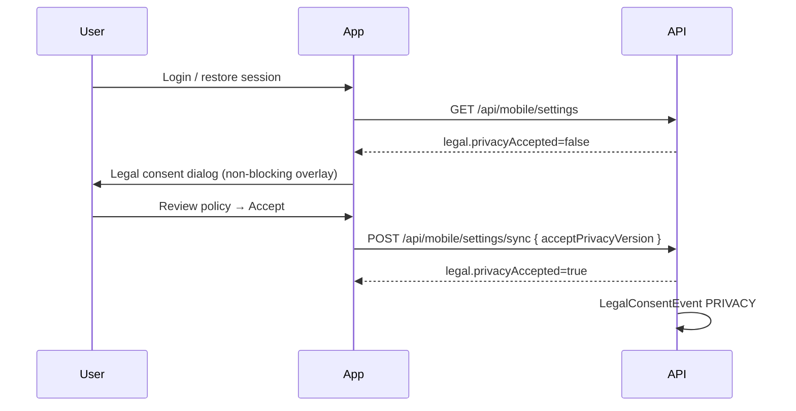

# Privacy Acceptance Strategy — Prani Doctor

**Version:** 1.0  
**Date:** 2026-05-30  
**Status:** Implemented

---

## Goals

1. Record **which policy version** each user accepted and **when**
2. Prompt users when the published version changes
3. Link **AI processing** to a separate consent
4. Preserve existing APIs and UX (soft prompt + server gate, not hard lockout of login)

---

## Version management

| Source | Key / field | Role |
|--------|-------------|------|
| `Setting` row | `mobile.legal.config` | Canonical published versions and URLs |
| Env fallback | `MOBILE_PRIVACY_POLICY_URL`, etc. | Default when DB row missing |
| User row | `MobileUserSettings.privacyAcceptedVersion` | Last privacy version accepted |
| User row | `MobileUserSettings.termsAcceptedVersion` | Last terms version accepted |
| User row | `MobileUserSettings.aiAcceptedVersion` | Last AI processing consent version |

**Current published privacy version:** `2026-05-30`

Admin updates flow through **Admin → Settings → Legal** (`GET/PUT /api/admin/settings/legal`). Changes do not auto-accept for existing users.

---

## Acceptance workflow

### Mobile (farmer app)

1. After authentication, `LegalConsentCoordinator` loads settings.
2. If `legal.privacyAccepted == false`, show dismissible banner + primary action to **Privacy** screen.
3. User reads summary + opens full URL; taps **Accept**.
4. `POST /api/mobile/settings/sync` with `acceptPrivacyVersion` matching server version.
5. Server writes `MobileUserSettings` + append-only `LegalConsentEvent`.

**Terms:** Same pattern via Terms screen; not required for general API access (privacy only).

**AI consent:** Required before `/api/ai/*` routes. First AI navigation shows AI consent screen; accept via `acceptAiVersion`.

### Server enforcement

| Control | Scope | Env |
|---------|-------|-----|
| Privacy gate | Legacy mobile routes (except allowlist) | `MOBILE_ENFORCE_PRIVACY_CONSENT=true` |
| AI gate | Express `/api/ai/*` | Always (privacy + AI consent) |

**Allowlist (privacy gate exempt):**

- `/api/mobile/settings/**`
- `/api/mobile/auth/**`
- `/api/mobile/health/**`
- `GET /api/mobile/me`

Response when blocked: `403` / `LEGAL_CONSENT_REQUIRED` with `{ missing: ['privacy'|'ai'], privacyVersion, aiVersion }`.

---

## Consent linkage

| Consent | Required for | Stored | Audit type |
|---------|--------------|--------|------------|
| Privacy | Protected mobile APIs (when enforced) | `privacyAcceptedVersion` | `PRIVACY` |
| Terms | Product policy (display only unless extended) | `termsAcceptedVersion` | `TERMS` |
| AI processing | AI routes | `aiAcceptedVersion` | `AI_PROCESSING` |

---

## Policy visibility

| Surface | Path |
|---------|------|
| Public web | `/privacy` |
| Mobile in-app | Settings → Privacy Policy |
| Mobile API summary | `GET /api/mobile/settings/privacy` |
| Mobile API AI | `GET /api/mobile/settings/ai-consent` |
| Admin config | `/admin/settings/legal` |

---

## User access path

Settings → **Privacy Policy** → view version, summary, external link → **Accept**  
Settings → **Terms of Service** (parallel)  
AI home → **AI consent** (if not accepted)

---

## Admin management

1. Edit versions, URLs, and in-app summary text in admin legal settings.
2. View consent audit log: **Admin → Settings → Legal → Consent audit** (`GET /api/admin/legal-consent`).

---

## Verification

- [ ] Bump version in admin → existing users show `privacyAccepted=false`
- [ ] Accept in app → `LegalConsentEvent` row created
- [ ] AI route without AI consent → `LEGAL_CONSENT_REQUIRED`
- [ ] Public `/privacy` returns 200
