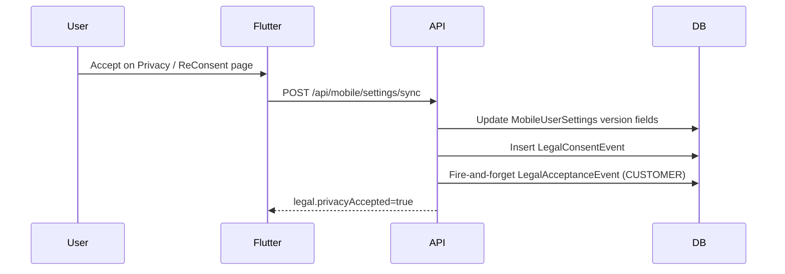

# Privacy Policy — Compliance Verification Report

**Verification date:** 30 May 2026  
**Scope:** Privacy Policy implementation across `pranidoctor-backend`, `pranidoctor-web`, `pranidoctor_user`  
**Canonical policy:** [PRIVACY_POLICY.md](./PRIVACY_POLICY.md) v **2026-05-30**  
**Verifier:** Automated codebase audit + targeted test execution

---

## Executive summary

Phase 1 privacy infrastructure is **substantially implemented** for mobile (farmer) users: published policy, versioned acceptance, audit events, admin configuration, and client/server gates. Compliance is **partial** for doctor/provider surfaces and **not yet production-hardened** due to version drift, disabled server enforcement by default, missing doctor UI, and unresolved operational gaps (data rights automation, retention jobs, vendor DPAs).

| Validation area | Result | Confidence |
|-----------------|--------|------------|
| Visibility | **Pass (with caveats)** | High |
| Acceptance capture | **Pass** | High |
| Version management | **Partial** | High |
| Auditability | **Pass** | Medium |
| Consent linkage | **Pass (mobile AI); Partial (terms/doctor)** | High |
| User access | **Partial** | High |
| Doctor access | **Fail** | High |

**Overall compliance posture:** Suitable for **controlled staging / soft-launch** with documented residual risk. Not yet suitable for **strict production enforcement** without remediation items in [PRIVACY_GAP_REPORT.md](./PRIVACY_GAP_REPORT.md).

---

## 1. Visibility

**Requirement:** Users and providers can discover the current privacy policy before and after acceptance.

### Evidence

| Surface | Implementation | Status |
|---------|----------------|--------|
| Public web page | `pranidoctor-web/src/app/privacy/page.tsx` — versioned sections from `privacy-policy-content.ts` | ✅ Implemented |
| Canonical markdown | `docs/compliance/legal/PRIVACY_POLICY.md` | ✅ Implemented |
| Mobile in-app | Settings → Privacy (`PrivacyPage`), legal hub in `settings_page.dart` | ✅ Implemented |
| Mobile banner | `LegalConsentCoordinator` — non-blocking reminder when privacy not accepted | ✅ Implemented |
| API document fetch | `GET /api/mobile/settings/privacy` returns title, content, version, URL | ✅ Implemented |
| Configured URL | `MOBILE_PRIVACY_POLICY_URL` → default `https://pranidoctor.com/privacy` | ⚠️ Depends on deploy |

### Findings

- **Pass:** Policy is reachable in-app (Settings → Privacy), via API, and as a dedicated Next.js route (`/privacy`).
- **Caveat:** Production availability of `https://pranidoctor.com/privacy` depends on `pranidoctor-web` deployment and DNS — not verified live in this audit.
- **Caveat:** In-app content is a **summary** from `mobile.legal.config`; full text is on the public URL. This matches the acceptance strategy but must stay synchronized.
- **Gap:** Registration flow (`register_page.dart`) has **no privacy link or checkbox** — visibility starts post-login only.

**Verdict:** **Pass with caveats**

---

## 2. Acceptance capture

**Requirement:** Explicit acceptance of a specific policy version is recorded per user with timestamp.

### Evidence

| Mechanism | Storage | Audit |
|-----------|---------|-------|
| Privacy accept | `MobileUserSettings.privacyAcceptedVersion`, `privacyAcceptedAt` | `LegalConsentEvent` type `PRIVACY` |
| Terms accept | `termsAcceptedVersion`, `termsAcceptedAt` | `LegalConsentEvent` type `TERMS` |
| AI consent | `aiAcceptedVersion`, `aiAcceptedAt` | `LegalConsentEvent` type `AI_PROCESSING` |
| Accept API | `POST /api/mobile/settings/sync` with `acceptPrivacyVersion`, etc. | IP/UA via `authRequestContext` |
| Re-consent | `ReConsentPage` — batch accept privacy + terms | Same sync path |
| Dual registry | `recordLegalConsentFireAndForget` also writes `LegalAcceptanceEvent` when `role: CUSTOMER` | Links mobile track to `LegalDocument` registry |

### Acceptance flow (mobile)



### Findings

- **Pass:** Version string must match published config exactly — stale versions are rejected implicitly (fields not updated).
- **Pass:** Audit is append-only (`LegalConsentEvent`); withdraw records metadata `{ action: 'WITHDRAWN' }`.
- **Pass:** `ReConsentPage` route is registered at `/reconsent` and enforced by `nav_guard.dart` when `legalGateEnabled` and terms/privacy stale.
- **Partial:** Registration does not capture acceptance at account creation (`CHECKBOX_REGISTER` method unused in signup).

**Verdict:** **Pass**

---

## 3. Version management

**Requirement:** Single source of truth for published versions; admin can bump versions; users are prompted on change.

### Evidence

| Source | Key / field | Current value (audit) |
|--------|-------------|----------------------|
| DB setting | `Setting.key = mobile.legal.config` | Runtime-dependent |
| Env fallback | `legal-defaults.ts` `DEFAULT_PRIVACY_VERSION` | **2026-06-01** |
| Policy docs | `PRIVACY_POLICY.md`, web `/privacy` | **2026-05-30** |
| Acceptance strategy doc | `ACCEPTANCE_STRATEGY.md` | **2026-05-30** |
| Legal document seed | `legal-document-seed.ts` uses `DEFAULT_PRIVACY_VERSION` | **2026-06-01** |

Admin workflow: **Admin → Settings → Legal** (`AdminLegalSettingsForm.tsx`) → `GET/PUT /api/admin/settings/legal`.

Re-consent trigger: client compares `MobileUserSettings.*AcceptedVersion` to `legal.*Version` from settings bundle; server gate uses same comparison.

### Findings

- **Pass:** Version bump workflow exists (admin UI + API).
- **Pass:** Existing users are not auto-accepted on version change.
- **Fail (drift):** Three version strings coexist (`2026-05-30` in policy/web docs vs `2026-06-01` in backend defaults/seed). This causes **false “not accepted”** states for users who accepted `2026-05-30` when server expects `2026-06-01`.
- **Partial:** Two parallel version systems — `mobile.legal.config` (mobile UX) and `LegalDocument` registry (panel roles) — are linked for CUSTOMER via audit bridge but not guaranteed identical version strings without operational discipline.

**Verdict:** **Partial**

---

## 4. Auditability

**Requirement:** Immutable record of who accepted/withdraw which version, when, and from where; admin can review.

### Evidence

| Table / API | Purpose |
|-------------|---------|
| `LegalConsentEvent` | Mobile consent types (PRIVACY, TERMS, AI_PROCESSING); channel, IP, UA, metadata |
| `LegalAcceptanceEvent` | Registry-backed acceptances for all roles; links to `LegalDocument` |
| `GET /api/admin/legal-consent` | Paginated consent event list |
| `GET /api/admin/consent/overview` | Acceptance counts vs total customers |
| Admin UI | `AdminLegalSettingsForm` — settings, audit tail, overview |

### Sample audit query

```sql
SELECT "userId", "consentType", "version", "createdAt", "ipAddress"
FROM "LegalConsentEvent"
WHERE "consentType" = 'PRIVACY'
ORDER BY "createdAt" DESC LIMIT 20;
```

### Findings

- **Pass:** Accept and withdraw both leave audit traces.
- **Pass:** Admin can inspect recent events and aggregate acceptance counts.
- **Partial:** Dual tables (`LegalConsentEvent` + `LegalAcceptanceEvent`) require joins/correlation for a single user timeline — no unified admin “user consent history” view.
- **Partial:** `consent-service.test.ts` **does not execute** — import path failure (`document-keys.js` from `legal-consent-audit.ts`) — automated regression not green.

**Verdict:** **Pass** (operational audit sufficient; test coverage gap noted)

---

## 5. Consent linkage

**Requirement:** Processing activities (especially AI) are gated on appropriate consent; registry maps consent types to features.

### Evidence

**Consent registry** (`consent-registry.ts`):

| Key | hardGate | Server enforcement |
|-----|----------|-------------------|
| privacy | `true` | `MOBILE_ENFORCE_PRIVACY_CONSENT` or `legalGateEnabled` + `LEGAL_ENFORCEMENT_ENABLED` in `guard.ts` |
| terms | `false` | Only when `legalGateEnabled` + full legal enforcement |
| ai | `false` | Express middleware on `/api/ai/*` (`requireMobilePrivacyConsent`, `requireMobileAiConsent`) |

**Client linkage:**

- `nav_guard.dart` — redirects to `/reconsent` (privacy+terms) or `/settings/ai-consent` for AI routes
- `ai_home_page.dart` / `AiConsentPage` — AI feature gate
- `api_error_mapper.dart` — handles `LEGAL_CONSENT_REQUIRED`

### Findings

- **Pass:** AI API routes require privacy (+ AI consent per middleware config).
- **Pass:** Consent types are explicitly mapped to `LegalDocument` keys via `LEGAL_CONSENT_TO_DOCUMENT_KEY`.
- **Partial:** Terms are client-gated (`legalGateEnabled` default **true**) but **not** server hard-gated unless `LEGAL_ENFORCEMENT_ENABLED=true`.
- **Partial:** Privacy server gate defaults **off** (`MOBILE_ENFORCE_PRIVACY_CONSENT=false` in `.env.example`).
- **Gap:** Doctor/provider AI or data processing is **not** linked to customer privacy acceptance model.

**Verdict:** **Pass for mobile AI path; Partial overall**

---

## 6. User access (farmer / CUSTOMER)

**Requirement:** Users can read policy, accept, re-accept on version change, and exercise consent choices.

### Evidence

| Capability | Status |
|------------|--------|
| Read policy in-app | ✅ `PrivacyPage` — content + external URL |
| Accept privacy | ✅ Accept button → sync API |
| Re-consent on version bump | ✅ `ReConsentPage` + nav redirect |
| AI consent screen | ✅ `AiConsentPage` |
| Consent status API | ✅ `GET /api/mobile/consent/status` |
| Withdraw API | ✅ `POST /api/mobile/consent/withdraw` |
| Withdraw UI | ❌ `ConsentRepository.withdraw` exists; **no presentation layer** |
| Data export / erasure | ❌ Not implemented (support channel only per `COMPLIANCE_NOTES.md`) |

### Findings

- **Pass:** Core read/accept/re-consent flows are complete for authenticated users.
- **Partial:** Withdraw is API-only — users cannot self-serve withdrawal from Settings (required for meaningful AI opt-out UX).
- **Partial:** Soft banner (`LegalConsentCoordinator`) only prompts privacy, not terms — terms enforced via nav gate when `legalGateEnabled`.
- **Gap:** No registration-time consent.

**Verdict:** **Partial**

---

## 7. Doctor access (DOCTOR role)

**Requirement:** Doctors can access applicable privacy/terms content and acceptance is captured before clinical operations.

### Evidence

| Capability | Status |
|------------|--------|
| `GET /api/doctor/legal/status` | ✅ Returns `allAccepted`, `pendingDocuments` |
| `POST /api/doctor/legal/accept` | ✅ Via `acceptPanelLegalDocument` |
| `GET /api/doctor/me` includes `legal` summary | ✅ `doctor-auth.adapter.ts` |
| Required documents for DOCTOR | ⚠️ **`TOS-PROVIDER-DOCTOR` only** — not `PRIVACY-POLICY` (`legal-role-map.ts`) |
| Doctor web UI | ❌ No legal accept/re-consent pages under `src/app/doctor/` |
| Doctor API enforcement | ❌ No legal gate in doctor auth guard (unlike mobile `guard.ts`) |
| BFF proxy routes | ❌ No `src/app/api/doctor/legal/*` in web repo |

### Findings

- **Fail:** Backend APIs exist but **doctor panel has no legal acceptance UX**.
- **Fail:** No server-side blocking of doctor operations when provider ToS is pending.
- **Gap:** Provider privacy expectations (access to farmer/clinical data) are covered only in general platform policy — no dedicated provider privacy addendum in required document set.
- **Partial:** `LegalDocument` seed includes provider ToS summaries; acceptance would be auditable **if** UI and enforcement existed.

**Verdict:** **Fail**

---

## Verification checklist (from privacy-policy-plan)

| # | Check | Result |
|---|-------|--------|
| V-01 | Public `/privacy` page matches canonical policy version | ⚠️ Page v2026-05-30; backend default v2026-06-01 |
| V-02 | Mobile settings return `legal.privacyAccepted` | ✅ |
| V-03 | Accept writes `LegalConsentEvent` | ✅ |
| V-04 | Admin can update versions without auto-accept | ✅ |
| V-05 | Version bump triggers re-consent in app | ✅ (client gate) |
| V-06 | AI routes blocked without consent | ✅ (middleware) |
| V-07 | `MOBILE_ENFORCE_PRIVACY_CONSENT=true` blocks APIs | ✅ (code path; default off) |
| V-08 | Doctor legal acceptance end-to-end | ❌ |
| V-09 | Consent withdraw surfaced to user | ❌ |
| V-10 | Automated tests green | ❌ |

---

## Related documents

- [PRIVACY_GAP_REPORT.md](./PRIVACY_GAP_REPORT.md) — prioritized remediation
- [PRIVACY_PRODUCTION_READINESS_REPORT.md](./PRIVACY_PRODUCTION_READINESS_REPORT.md) — launch decision
- [ACCEPTANCE_STRATEGY.md](./ACCEPTANCE_STRATEGY.md)
- [COMPLIANCE_NOTES.md](./COMPLIANCE_NOTES.md)
