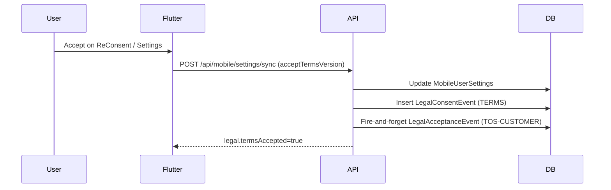

# Terms of Service — Compliance Verification Report

**Verification date:** 30 May 2026  
**Scope:** Terms of Service implementation across `pranidoctor-backend`, `pranidoctor-web`, `pranidoctor_user`  
**Canonical customer ToS:** [TERMS_OF_SERVICE_CUSTOMER.md](./TERMS_OF_SERVICE_CUSTOMER.md) · public `/terms` v **2026-06-01**  
**Verifier:** Codebase audit, targeted test execution, critical fail-open remediation

**Related:** [TERMS_OF_SERVICE_IMPLEMENTATION.md](./TERMS_OF_SERVICE_IMPLEMENTATION.md), [PRIVACY_COMPLIANCE_REPORT.md](./PRIVACY_COMPLIANCE_REPORT.md)

---

## Executive summary

The ToS framework is **implemented end-to-end** for mobile customers, admin personnel, and (after this review) doctor providers. Acceptance is versioned, auditable, and gated in client UIs. Two **critical fail-open defects** were remediated during this audit (registry empty-state bypass, admin/doctor gate loading/error bypass).

Compliance is **suitable for controlled staging and soft launch** with documented residual risk. Full production enforcement requires operational steps (migration deploy, version alignment, enable server-side gate) and non-blocking gaps (technician panel, registration audit method, counsel review).

| Validation area | Result | Confidence |
|-----------------|--------|------------|
| Acceptance tracking | **Pass** | High |
| Version control | **Partial** | High |
| Audit logging | **Pass** | Medium |
| User visibility | **Pass (with caveats)** | High |
| Doctor visibility | **Pass (with caveats)** | High |
| Admin visibility | **Pass** | High |
| Re-consent handling | **Partial** | High |
| Backward compatibility | **Pass** | High |

**Production readiness score:** **72 / 100** — see [§8 Production readiness](#8-production-readiness-score)

---

## Critical fixes applied (this review)

| Issue | Risk | Remediation |
|-------|------|-------------|
| `getLegalStatusForUser()` skipped missing `LegalDocument` rows → `allAccepted: true` | Admin/doctor gate bypass if seed/migration fails | Fail-closed: missing docs appear as `UNPUBLISHED` pending requirements |
| `hasAcceptedCurrentDocument()` returned `true` when doc missing | Future enforcement APIs could bypass | Changed to return `false` |
| `AdminLegalGate` returned `null` while loading or on fetch error | Admin console usable without AUP acceptance | Shared `PanelLegalGate` blocks until status verified |
| Doctor panel had backend APIs but no BFF routes or UI gate | Provider ToS unenforceable | Added `/api/doctor/legal/*` proxies + `DoctorLegalGate` in dashboard shell |

---

## 1. Acceptance tracking

**Requirement:** Explicit acceptance of a specific ToS version is recorded per user/role with timestamp and context.

### Evidence

| Audience | Primary storage | Audit trail | Client capture |
|----------|-----------------|-------------|----------------|
| Mobile customer | `MobileUserSettings.termsAcceptedVersion`, `termsAcceptedAt` | `LegalConsentEvent` (TERMS) + `LegalAcceptanceEvent` (TOS-CUSTOMER) | `ReConsentPage`, settings sync, register checkbox (UI only) |
| Admin | `LegalAcceptanceEvent` only | `LegalAcceptanceEvent` + `AuthAuditEvent` (`LEGAL_ACCEPTED`) | `AdminLegalGate` → `POST /api/admin/legal/accept` |
| Doctor | `LegalAcceptanceEvent` only | Same as admin | `DoctorLegalGate` → `POST /api/doctor/legal/accept` |

### Acceptance flow (customer)

### Findings

- **Pass:** Version must match published `mobile.legal.config` exactly; stale versions leave `termsAccepted=false`.
- **Pass:** Panel roles use immutable `LegalAcceptanceEvent` with IP, UA, method, app surface.
- **Partial:** Registration checkbox enforces UX consent but **does not** call sync/audit with `CHECKBOX_REGISTER` at signup — user must accept again via re-consent gate post-login unless already synced elsewhere.
- **Partial:** `recordLegalAcceptance()` silently skips when document row missing (warn log only). Mobile `LegalConsentEvent` still writes; panel acceptance may not persist if registry out of sync.

**Verdict:** **Pass**

---

## 2. Version control

**Requirement:** Single published version per document; admin can bump; clients compare stored vs published.

### Evidence

| Source | Field / location | Value (audit) |
|--------|------------------|---------------|
| DB setting | `Setting.key = mobile.legal.config` → `termsVersion` | Runtime-dependent |
| Env fallback | `legal-defaults.ts` `DEFAULT_TERMS_VERSION` | **2026-06-01** |
| Public web | `src/app/terms/page.tsx` | **2026-06-01** |
| Legal registry seed | `legal-document-seed.ts` | **2026-06-01** |
| Admin UI | Admin → Settings → Legal | Editable `termsVersion` |

Re-consent trigger (mobile): `mobile-legal-consent.ts` compares `termsAcceptedVersion` to config `termsVersion`; `legalGateEnabled && !termsAccepted` → `needsLegalGate`.

Panel re-consent: `getLegalStatusForUser` compares latest `LegalAcceptanceEvent.version` to published `LegalDocument.version`.

### Findings

- **Pass:** Version bump does not auto-accept existing users.
- **Pass:** Admin workflow exists for mobile legal config.
- **Partial:** Two parallel systems — `mobile.legal.config` (Flutter) and `LegalDocument` registry (panel + dual-write bridge) — require operational discipline to keep versions aligned.
- **Partial:** `LegalDocument.requiresReaccept` is stored but **not consulted** in status logic; all version changes behave as hard re-consent.

**Verdict:** **Partial**

---

## 3. Audit logging

**Requirement:** Append-only evidence of who accepted what, when, and from where.

### Evidence

| Table / event | Immutability | Fields |
|---------------|--------------|--------|
| `LegalConsentEvent` | Append-only | `consentType`, `version`, `channel`, IP, UA, metadata |
| `LegalAcceptanceEvent` | Append-only | `documentKey`, `version`, `legalDocumentId`, method, app surface |
| `AuthAuditEvent` | Append-only | `LEGAL_ACCEPTED` with event id + document key |

Admin visibility: `GET /api/admin/legal-consent` + `AdminLegalSettingsForm` audit list (mobile consent events).

### Findings

- **Pass:** Dual write from mobile TERMS accept bridges to `LegalAcceptanceEvent` when `role: CUSTOMER` is supplied.
- **Pass:** Panel accept records auth audit correlation.
- **Medium confidence:** Fire-and-forget writes mean acceptance API can return success before audit persistence completes; failures are logged, not surfaced to client.
- **Gap:** No dedicated admin UI for `LegalAcceptanceEvent` (panel roles) — query via DB/metrics only.

**Verdict:** **Pass**

---

## 4. User visibility (mobile / customer)

**Requirement:** Farmers can read current ToS before and after acceptance.

### Evidence

| Surface | Implementation | Status |
|---------|----------------|--------|
| Public web | `/terms` Next.js page | ✅ |
| In-app | Settings → Terms (`settings_page.dart` / terms route) | ✅ |
| API | `GET /api/mobile/settings` legal block + terms document fetch | ✅ |
| Registration | Terms checkbox on `register_page.dart` | ✅ (UX gate) |
| Re-consent | `/reconsent` when `needsLegalGate` | ✅ |
| Configured URL | `MOBILE_TERMS_OF_SERVICE_URL` → default `https://pranidoctor.com/terms` | ⚠️ Deploy-dependent |

### Findings

- **Pass:** ToS reachable in-app, via API, and public URL.
- **Caveat:** In-app content is summary from config; full text on public URL — must stay synchronized.
- **Caveat:** Register checkbox lacks inline link to full terms document (privacy report noted similar gap for privacy).

**Verdict:** **Pass (with caveats)**

---

## 5. Doctor visibility (provider)

**Requirement:** Veterinary providers can read and accept provider agreement before panel use.

### Evidence

| Surface | Implementation | Status |
|---------|----------------|--------|
| Document registry | `TOS-PROVIDER-DOCTOR` seeded bn/en | ✅ |
| Backend API | `GET/POST /api/doctor/legal/status|accept` | ✅ |
| Web BFF | `src/app/api/doctor/legal/status|accept` (proxy) | ✅ (this review) |
| UI gate | `DoctorLegalGate` in `DoctorDashboardShell` | ✅ (this review) |
| Public dedicated page | Provider-specific public URL | ⚠️ Uses generic `/terms` in seed `publicUrl` |

### Findings

- **Pass:** Doctor panel now blocks until provider agreement accepted (fail-closed gate).
- **Caveat:** Provider agreement text is registry summary + generic public URL — not a dedicated `/terms/provider-doctor` page.
- **Gap:** No in-panel “read terms” settings page separate from gate modal link.

**Verdict:** **Pass (with caveats)**

---

## 6. Admin visibility

**Requirement:** Admin personnel see AUP, accept before console use, configure customer legal versions.

### Evidence

| Surface | Implementation | Status |
|---------|----------------|--------|
| Admin gate | `AdminLegalGate` → `PanelLegalGate` (fail-closed) | ✅ |
| Settings | `AdminLegalSettingsForm` — versions, URLs, content, audit sample | ✅ |
| Launch ops | Legal links + status probe | ✅ |
| Backend | `GET/POST /api/admin/legal/status|accept` | ✅ |
| Auth `/me` | Optional `legal` summary on admin session | ✅ |

**Verdict:** **Pass**

---

## 7. Re-consent handling

**Requirement:** When ToS version changes, existing users must re-accept before continued use.

### Evidence

| Channel | Mechanism |
|---------|-----------|
| Flutter | `legalGateEnabled && needsLegalGate` → `nav_guard` redirects to `/reconsent` |
| Flutter API | `POST /api/mobile/settings/sync` with new version |
| Admin/Doctor | `getLegalStatusForUser` version mismatch → pending document |
| Server API (mobile) | `LEGAL_ENFORCEMENT_ENABLED=true` → 403 `LEGAL_CONSENT_REQUIRED` on protected routes |

### Findings

- **Pass:** Client-side mobile gate active by default (`legalGateEnabled` default true).
- **Pass:** Panel gates re-show on version bump after fail-closed fix.
- **Partial:** Server-side mobile enforcement **off by default** (`LEGAL_ENFORCEMENT_ENABLED` unset/false) — API-only clients could bypass Flutter gate.
- **Partial:** `requiresReaccept` flag unused — cannot soft-notify vs hard-block per document.

**Verdict:** **Partial**

---

## 8. Backward compatibility

**Requirement:** Existing users and APIs continue working; no breaking changes to mobile settings shape.

### Evidence

- `MobileUserSettings` fields unchanged; extended `legal` block is additive.
- Existing `POST /api/mobile/settings/sync` accept flags preserved.
- `LegalConsentEvent` audit path unchanged; dual-write to `LegalAcceptanceEvent` is fire-and-forget.
- Users who accepted prior version strings remain “not accepted” until re-consent — **intentional**, not a breaking API change.
- Panel legal routes are additive; doctor/admin auth flows unchanged.

**Verdict:** **Pass**

---

## 9. Risk assessment

| ID | Risk | Likelihood | Impact | Mitigation status |
|----|------|------------|--------|-------------------|
| R1 | Registry not seeded in production → blocked panels (fail-closed) | Medium | High | **Mitigated** — run migration + boot seed; monitor health |
| R2 | Version drift between web `/terms`, config, and registry | Medium | Medium | Operational — single bump checklist in [LEGAL_OPERATIONS.md](./LEGAL_OPERATIONS.md) |
| R3 | API bypass without `LEGAL_ENFORCEMENT_ENABLED` | Medium | Medium | **Open** — enable in production when ready |
| R4 | Registration checkbox not audited at signup | Medium | Low | **Open** — post-login gate catches; consider sync on register |
| R5 | `recordLegalAcceptance` silent skip on version mismatch | Low | Medium | **Open** — validate version server-side before returning success |
| R6 | Technician / enterprise roles lack panel gates | High | Medium | **Open** — no UI for `AI_TECHNICIAN` / enterprise schedules |
| R7 | Legal text not counsel-approved | Medium | High | **Open** — placeholder/summary content |
| R8 | Fire-and-forget audit loss undetected by client | Low | Medium | **Open** — add metrics/alerts on audit write failures |

**Overall residual risk:** **Medium** — acceptable for staged rollout with ops checklist; reduce before strict regulatory audit.

---

## 10. Remaining gaps

### Must fix before strict production enforcement

1. **Deploy** `20260601180000_legal_document_registry` migration and verify boot seed in each environment.
2. **Enable** `LEGAL_ENFORCEMENT_ENABLED=true` (and confirm `MOBILE_LEGAL_GATE_ENABLED` not false) when counsel signs off.
3. **Align** all version strings (`mobile.legal.config`, `LegalDocument`, `/terms` page) on each release.

### Should fix (next sprint)

4. Technician panel legal gate (`TOS-PROVIDER-TECHNICIAN`) — mirror doctor implementation.
5. Persist registration acceptance with `CHECKBOX_REGISTER` method at account creation.
6. Admin UI or export for `LegalAcceptanceEvent` (panel audit).
7. Dedicated public provider ToS pages vs generic `/terms`.
8. Wire `requiresReaccept` or remove unused field.
9. Return error to client when `recordLegalAcceptance` cannot find document row.

### Nice to have

10. Counsel-reviewed full bn/en legal copy in registry and web pages.
11. Metrics dashboard for acceptance rates and pending re-consent cohorts.
12. E2E tests for admin/doctor gates and mobile re-consent flow.

---

## 11. Production readiness score

| Dimension | Weight | Score | Notes |
|-----------|--------|-------|-------|
| Acceptance capture | 15% | 85 | Strong for mobile + panels; register audit gap |
| Version management | 10% | 70 | Dual systems; drift risk |
| Audit & evidence | 15% | 80 | Immutable events; fire-and-forget caveat |
| Enforcement (client) | 15% | 85 | Flutter + admin + doctor gates fail-closed |
| Enforcement (server) | 15% | 45 | `LEGAL_ENFORCEMENT_ENABLED` off by default |
| Role coverage | 10% | 60 | Customer, admin, doctor; not technician |
| Legal content readiness | 10% | 50 | Summary/placeholder; counsel review pending |
| Operations & deploy | 10% | 75 | Migration + seed documented; needs runbook execution |

**Weighted total: 72 / 100**

### Readiness bands

| Score | Interpretation |
|-------|----------------|
| 85–100 | Production enforcement ready |
| **70–84** | **Soft launch / staging with documented gaps** ← current |
| 50–69 | Development complete; not launch-ready |
| &lt;50 | Material compliance gaps |

### Launch recommendation

**Proceed with soft launch** for customer mobile and doctor/admin panels **after**:

1. Migration deployed and `LegalDocument` rows verified in staging/production.
2. Legal version strings aligned to **2026-06-01** (or chosen release version) across config, seed, and web.
3. Smoke test: new admin/doctor user sees blocking gate; existing customer with stale version hits `/reconsent`.

**Defer strict production enforcement** until R3, R6, and R7 are addressed and counsel approves published text.

---

## 12. Verification checklist (executed)

| Check | Result |
|-------|--------|
| `legal-role-map.test.ts` | ✅ 3/3 passed |
| Fail-closed registry empty-state | ✅ Code review + fix applied |
| Admin gate fail-closed on load/error | ✅ `PanelLegalGate` |
| Doctor BFF + gate | ✅ Added |
| Flutter `needsLegalGate` wiring | ✅ Code review |
| Prisma models `LegalDocument`, `LegalAcceptanceEvent` | ✅ Schema present |

---

## References

- [terms-of-service-plan.md](./terms-of-service-plan.md)
- [TERMS_OF_SERVICE_IMPLEMENTATION.md](./TERMS_OF_SERVICE_IMPLEMENTATION.md)
- [LEGAL_OPERATIONS.md](./LEGAL_OPERATIONS.md)
- [TERMS_OF_SERVICE_PROVIDER_DOCTOR.md](./TERMS_OF_SERVICE_PROVIDER_DOCTOR.md)
