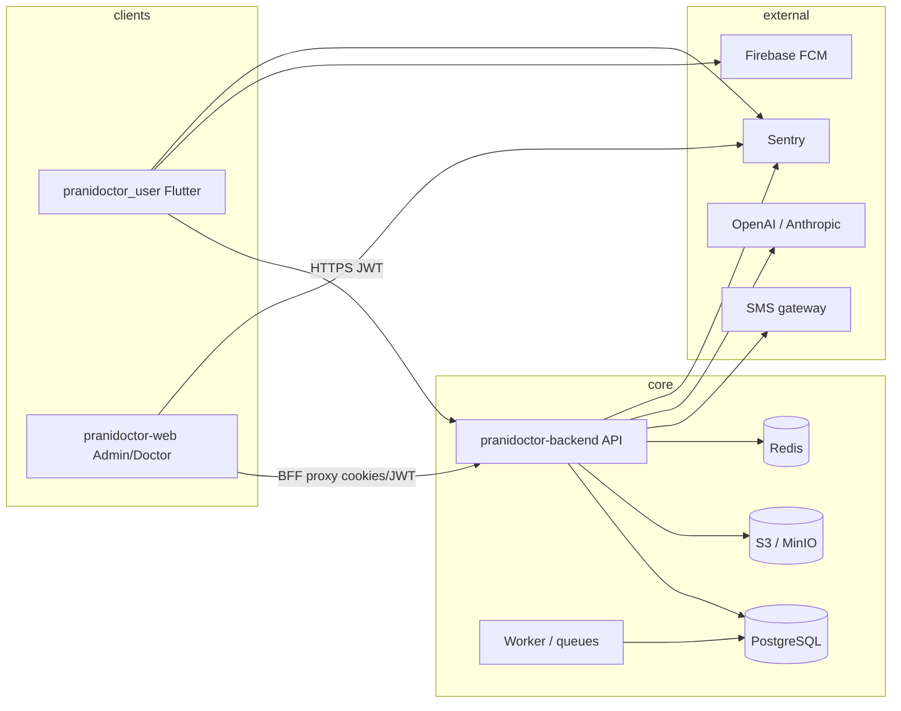

# Privacy Policy Plan — Prani Doctor Platform

**Document type:** Compliance planning artifact  
**Status:** Implemented (Phase 1 — see [COMPLIANCE_NOTES.md](./COMPLIANCE_NOTES.md), [ACCEPTANCE_STRATEGY.md](./ACCEPTANCE_STRATEGY.md))  
**Effective planning date:** 2026-05-30  
**Scope:** `pranidoctor_user` (Flutter), `pranidoctor-backend` (API/worker), `pranidoctor-web` (admin BFF + doctor web)  
**Related:** `pranidoctor_user/docs/legal/PRIVACY_POLICY.md` (customer-app template), `pranidoctor-backend/src/legacy/web/lib/mobile-settings/mobile-settings-service.ts` (consent versioning), [data-processing-policy-plan.md](../data/data-processing-policy-plan.md), [DATA_PROCESSING_POLICY.md](../data/DATA_PROCESSING_POLICY.md)

---

## Executive summary

Prani Doctor is a multi-surface veterinary and livestock platform serving **farmers/customers**, **doctors**, **AI technicians**, and **admins** in Bangladesh. Personal data flows through a shared PostgreSQL database, S3-compatible object storage, optional Redis, Firebase (push/crash), SMS gateways, and third-party LLM providers (OpenAI/Anthropic).

This plan inventories what the platform **actually collects today** (verified against schema and code), maps it to privacy-policy sections, identifies **compliance gaps**, and provides a **verification checklist** before publishing a unified public privacy policy.

**Primary jurisdiction assumption:** Bangladesh (Digital Security Act, ICT Act, BTRC SMS rules). GDPR/UK GDPR patterns included where they raise the compliance bar for future expansion.

---

## 1. Data collection

### 1.1 User (customer/farmer) registration

| Data element | Source | Storage | Required |
|--------------|--------|---------|----------|
| Full name (`displayName`) | Registration form / OTP profile completion | `CustomerProfile.displayName`, `User` (indirect) | Yes |
| Mobile phone | Registration / OTP login | `User.phone` (unique) | Yes |
| Email | Optional registration field | `User.email` (unique; synthetic `@users.pranidoctor.internal` if omitted on admin-created users) | No |
| Password hash | Password registration | `User.passwordHash` (bcrypt) | Password path only |
| OTP challenge metadata | OTP request | `MobileOtpChallenge` (hashed code, attempts, send window) | OTP path only |
| Locale preference | Profile / settings | `CustomerProfile.locale`, `MobileUserSettings.locale` | No |
| Address / location hierarchy | Profile, booking, primary village | `CustomerProfile.addressJson`, `CustomerProfile.primaryVillageId`, village FK chain (`Division`→`Village`) | Partial |
| Privacy / terms acceptance | Settings legal flow | `MobileUserSettings.privacyAcceptedVersion`, `privacyAcceptedAt`, `termsAcceptedVersion`, `termsAcceptedAt` | Policy-dependent |
| Push token, device key, platform, app version | Login / session restore | `UserDevice` | No (push optional) |
| Session metadata | Auth | `UserSession` (`ipAddress`, `userAgent`, `channel`, expiry) | Automatic |
| Refresh token hash | Auth | `RefreshToken.tokenHash` | Automatic |

**Mobile app behavior:** Registration sends optional FCM token at signup (`register_page.dart` → `pushRegistrationProvider`). OTP and password paths coexist.

### 1.2 Doctor registration

Doctors are **admin-provisioned**, not self-registered in current production flows.

| Data element | Source | Storage |
|--------------|--------|---------|
| Email, phone, password hash | Admin create-doctor form | `User` |
| License number, degree, specialization, experience, bio | Admin form | `DoctorProfile` |
| Profile photo URL | Admin form / future upload | `DoctorProfile.profilePhotoUrl` |
| Visit fee, emergency/online flags | Admin form | `DoctorProfile` |
| Service areas, categories | Admin assignment | `DoctorProfileArea`, `DoctorProfileServiceCategory`, `DoctorServiceArea` |
| Verification status | Admin workflow | `DoctorProfile.providerStatus`, `verifiedAt` |

Doctor web sessions use separate auth (`doctor-auth` in web repo) with cookie-based sessions; audit via `AuthAuditEvent` and admin monitoring events.

### 1.3 Consultation and treatment records

| Data element | Models | Notes |
|--------------|--------|-------|
| Service request (symptoms, location text, urgency, scheduling) | `ServiceRequest` | Links customer, animal, doctor/technician, village |
| Treatment case (diagnosis, procedures, follow-up) | `TreatmentCase` (`TreatmentRecord` table) | Clinical text; multiple rows per request possible |
| Consultation observations, attachment refs | `TreatmentConsultation` | `attachmentRefs` JSON → `UploadedFile` IDs |
| Prescriptions (medicines, dosage, duration) | `Prescription`, `PrescriptionItem` | Tied to doctor + animal + request |
| Clinical notes (private/shared/audit) | `TreatmentNote` | Visibility by `TreatmentNoteType` |
| Follow-ups | `TreatmentFollowup` | Scheduled dates; reminders not auto-dispatched |
| Timeline / status history | `ServiceRequestTimelineEvent` | Append-only |
| Billing / payments | `BillingRecord`, `PaymentRecord` | Financial metadata |
| Reviews | `Review` | Customer rating of service |

**Sensitivity:** Veterinary medical records + location of farm visit. Treat as **special-category-equivalent** for policy drafting even if local law does not classify identically to GDPR Art. 9.

### 1.4 Animal records

| Data element | Model | Notes |
|--------------|-------|-------|
| Name, species, breed, category, sex, DOB | `AnimalProfile` | Owner = `customerId` |
| Weight, pregnancy status, microchip/tag | `AnimalProfile` | Farm management fields |
| Photo URL | `AnimalProfile` | Via upload pipeline |
| Health, vaccine, milk, feed, finance, inventory, fattening batch data | `HealthEvent`, `VaccineRecord`, `MilkRecord`, `FeedRecord`, `FinanceRecord`, `FatteningBatch`, etc. | Extensive farm ERP-style data |
| Deactivation | `AnimalProfile.active` | Soft deactivate, not hard delete if requests exist (`onDelete: Restrict` on `ServiceRequest`) |

Animal data is **personal data** when linked to an identifiable farmer and may appear in AI prompts (minimized in code review; residual third-party transfer risk documented in `phase-8-ai-review-report.md`).

### 1.5 AI interactions

| Subsystem | Data stored | Third-party transfer |
|-----------|-------------|----------------------|
| AI assistant chat | `AiAssistantSession`, `AiAssistantMessage` (content, `inputJson`, `outputJson`) | OpenAI / Anthropic when keys configured |
| AI memory | `AiAssistantMemory` (`valueJson`, optional TTL) | Context assembly may include user/animal summaries |
| Triage / escalation | `AiTriageRecord`, `AiEscalationRecord`, `AiSafetyAuditLog` | Symptoms JSON, media metadata JSON |
| Voice assistant | `VoiceSession`, `VoiceTranscript` (normalized text; optional audio metadata) | STT/TTS providers when enabled |
| AI technician bookings (livestock AI) | `AiServiceRequest`, `AiServiceRecord` | Field service data; heat/breeding details |
| Usage metering | `AiUsageRecord`, daily rollups | Provider/model/token counts; **not** full prompt text in usage table |
| Smart recommendations / alerts | `SmartRecommendation`, `AiSmartAlert`, `FarmRiskSnapshot` | Derived from farm records |

**Policy must disclose:** Automated decision-making is **assistive only** (no autonomous diagnosis); human doctor/technician remains responsible for clinical decisions.

### 1.6 Notifications

| Channel | Data | Status |
|---------|------|--------|
| In-app | `Notification` (title, body, `metadataJson`, read state) | Implemented |
| Push (FCM) | `UserDevice.pushToken` | Token registration implemented; backend FCM **send** not fully production-ready |
| SMS | Phone number via OTP gateway | Live OTP when `OTP_MODE=live`; transactional SMS largely TODO |
| Email | Not primary for mobile MVP | `MAIL_ENABLED` optional |
| Preferences | `NotificationSettings` (push, marketing, reminders) | Per-user toggles |

Local-only analytics hooks exist in mobile (`NotificationAnalytics` → debugPrint only).

### 1.7 Device information

| Data | Location | Purpose |
|------|----------|---------|
| `deviceKey` (client-generated stable ID) | `UserDevice.deviceKey` | Device registry, session binding |
| Platform (`android` / `ios` / `web`) | `UserDevice.platform` | Compatibility |
| FCM push token | `UserDevice.pushToken` | Push delivery |
| App version | `UserDevice.appVersion` | Support |
| Last active / revoked timestamps | `UserDevice` | Security |
| IP address, user agent | `UserSession`, `AuthAuditEvent`, admin/proxy logs | Security audit |
| Crash context (env, release, locale, api_host) | Sentry / Firebase Crashlytics (mobile, when enabled) | Stability — **no deliberate PII** in custom keys today |
| Offline sync device link | `OfflineSyncSession.deviceId` | Sync deduplication |

**Not collected today:** GPS coordinates from device sensors for customer app (location is hierarchy selection, not continuous tracking). Geo centroids exist on admin-maintained `Division`/`District`/… reference tables only.

### 1.8 Analytics

| Surface | What exists | PII risk |
|---------|-------------|----------|
| Mobile app | Debug-only event hooks (`NotificationAnalytics`); crash reporters (Sentry/Crashlytics bootstrap) | Low if crash scrubbing enforced |
| Admin web | Structured `admin.*` monitoring events (page views, API timing, auth outcomes) | Paths normalized; no intentional user content |
| Backend | Prometheus metrics, Pino logs, `AiUsageRecord`, `AuthAuditEvent` | Request IDs; avoid logging bodies |
| Product analytics SDK | **Not deployed** (no Firebase Analytics / PostHog in customer app) | Gap for funnel metrics; also a privacy **positive** (less tracking) |

Admin KPI/analytics pages show **business aggregates**, not behavioral product telemetry.

### 1.9 Media uploads

| Type | Pipeline | Storage |
|------|----------|---------|
| Profile / cover photos | `profile-media.pipeline.ts` | S3/MinIO via `UploadedFile`; resized + thumbnail |
| General mobile uploads | `POST /api/mobile/uploads` | `UploadedFile` + signed GET URLs |
| Consultation attachments | Referenced in `TreatmentConsultation.attachmentRefs` | Same storage |
| AI technician documents | `AiTechnicianDocument` | License/certificate images |
| Service instance media | `ServiceInstanceMedia` | Moderation status tracked |
| Weight record photos | `WeightRecord.photoUrl` | Optional |

Metadata: `originalName`, `mimeType`, `sizeBytes`, `checksum`, dimensions. Soft delete via `UploadedFileStatus` / `deletedAt` on some media models.

### 1.10 Admin operations

| Operation | Data accessed | Audit today |
|-----------|---------------|-------------|
| Doctor CRUD, verification | Doctor PII + credentials | Partial (`AuthAuditEvent`, service logs) |
| AI technician review / publish | Profile, documents, service instances | `ServiceInstanceAuditEvent`, status logs with IP/UA |
| Customer/support views | User, animals, requests (via admin API proxy) | Admin monitoring events; **no** universal `DataAccessLog` |
| AI ops dashboard | Aggregated token usage, per-user/customer rollups | Admin auth required |
| Settings / legal text | `Setting` key `mobile.app.config` | Privacy version strings |
| Escalation / alerting | Health, queue, AI failure signals | Ops metadata; may include user IDs in incident context |

Admins hold **superuser access** to production data — policy must state lawful basis, role restriction, and logging commitments.

---

## 2. Data usage

| Purpose | Data categories | Lawful basis (draft — legal to confirm) |
|---------|-----------------|----------------------------------------|
| Account creation and authentication | Identity, credentials, device, audit | Contract / legitimate interest |
| Service booking and dispatch | Profile, location hierarchy, animal, request details | Contract |
| Clinical treatment workflow | Consultation, prescription, notes | Contract + vital interests of animals (disclose clearly) |
| Farm management features | Animal, milk, feed, finance records | Contract |
| AI assistive features | Chat content, farm/animal context, usage metrics | Consent + contract (see consent mapping) |
| Notifications | Contact info, device tokens, preferences | Consent (marketing) / contract (transactional) |
| Fraud prevention and security | IP, UA, auth audit, session revocation | Legitimate interest |
| Billing and payments | Billing/payment records | Contract + legal obligation |
| Platform improvement | Crash reports, anonymized metrics | Legitimate interest / consent |
| Regulatory and dispute resolution | Medical and transaction history | Legal obligation / legitimate interest |

**Prohibited uses (policy statement):** No sale of personal data; no use of clinical data for unrelated advertising; no training of third-party foundation models on user content **unless** explicitly disclosed and opted in (current LLM API usage is inference-only — confirm provider DPAs).

---

## 3. Data sharing

### 3.1 On-platform sharing (controller → processor roles)

| Recipient role | Data shared | Mechanism |
|----------------|-------------|-----------|
| Assigned doctor | Customer contact (per product rules), animal, symptoms, location text, treatment history | `ServiceRequest` assignment |
| Assigned AI technician | Breeding/animal details, address district/upazila | `AiServiceRequest` |
| Customer | Doctor display name, rating, visit fee | Booking UI |
| Admin/support | Full record access for moderation and support | Admin BFF → backend |

### 3.2 Third-party processors

See Section 10. Sharing must be listed in the public policy with purpose and safeguard summary.

### 3.3 Cross-border transfer

LLM providers (OpenAI, Anthropic) and Google (FCM, Play, optional Crashlytics) may process data **outside Bangladesh**. Policy needs transfer mechanism (SCCs, DPA, or local equivalent) and user disclosure.

---

## 4. Data retention

Retention is **partially implemented** in code (OTP expiry, session expiry, AI audit query caps) but **not codified** in a central retention schedule. Proposed policy-aligned schedule:

| Category | Proposed retention | Implementation status |
|----------|-------------------|----------------------|
| Active account profile | Life of account | ✅ Stored while active |
| `User.status = DELETED` | Anonymize within 30 days of verified request | ⚠️ Enum exists; automated purge **not verified** |
| OTP challenges | ≤ 10 minutes + cleanup | ✅ `MobileOtpChallenge.expiresAt` |
| Auth sessions / refresh tokens | Until expiry or revoke | ✅ `UserSession.expiresAt`, rotation |
| Device push tokens | Until logout, revoke, or token rotation | ✅ Update on register |
| Service / treatment records | 7–10 years (clinical/financial — **legal to confirm**) | ❌ No TTL job |
| Prescriptions | Match treatment retention | ❌ No TTL job |
| AI chat messages | 12–24 months active; then archive/delete | ❌ No TTL; sessions persist |
| AI usage metrics | 24 months detail; 5 years rollups | ⚠️ Tables exist; no purge job |
| Voice transcripts | 90 days default; no audio unless `retainAudio=true` | ⚠️ Schema supports; policy needed |
| Uploaded media | Life of linked record + 90 days after account deletion | ⚠️ Soft delete only |
| Notifications | 12 months | ❌ No purge job |
| Auth audit logs | 12–24 months | ❌ No purge job |
| Admin monitoring logs | 90 days hot, 1 year cold | ⚠️ Depends on log backend |
| Offline sync queue | 30 days after terminal state | ❌ No purge job |
| Crash reports (Sentry/Crashlytics) | Per vendor default (typically 90 days) | ⚠️ Configure in vendor dashboard |
| Local mobile cache (Hive) | Profile/appointments 24h; areas 7d | ✅ Client-side |

---

## 5. Data deletion

### 5.1 Current capabilities

| Action | Customer | Doctor | Notes |
|--------|----------|--------|-------|
| Sign out / revoke sessions | ✅ | ✅ | Clears local tokens |
| Deactivate animal | ✅ | N/A | `active=false` |
| Delete farm records (feed, milk, etc.) | ✅ Per-module DELETE APIs | N/A | Hard delete many modules |
| Delete uploaded file | ✅ | ✅ | API + S3 object removal |
| Account deletion (self-serve) | ❌ | ❌ | Support email only in template policy |
| Data export (portable) | ❌ | ❌ | Documented gap (`KNOWN_LIMITATIONS.md` L-53) |
| Cascade delete user | ⚠️ Partial | ⚠️ Partial | Prisma `onDelete: Cascade` on many child tables; `ServiceRequest`/`TreatmentCase` restrictions block unsafe deletes |

### 5.2 Deletion policy requirements (to implement later)

1. **Verified identity** before erasure (OTP to registered phone).
2. **Retention carve-outs** for invoices, prescriptions, and fraud audit where law requires.
3. **Anonymization** vs hard delete matrix per table.
4. **Processor deletion requests** to S3, LLM vendors (inference logs), SMS, FCM.
5. **30-day SLA** for manual requests (policy commitment).

---

## 6. User rights (customers/farmers)

| Right | Target experience | Current state |
|-------|-------------------|---------------|
| Access / copy | Export JSON of profile, animals, requests | ❌ Not built |
| Rectification | Profile edit, animal edit | ✅ |
| Erasure | Account deletion request | ⚠️ Manual support only |
| Restrict processing | Disable AI, disable marketing notifications | ⚠️ Partial (`NotificationSettings`; AI kill-switch admin-side) |
| Object to marketing | Opt out | ✅ `marketingEnabled` |
| Withdraw consent | Privacy version re-prompt | ⚠️ Version tracking exists; re-consent UX unclear |
| Lodge complaint | Contact + regulator info | ❌ Not in template |
| Explain automated decisions | AI disclaimers | ⚠️ In-app copy partial |

**Bangladesh:** No comprehensive GDPR-equivalent; still align with Digital Security Act principles (lawful collection, consent for sensitive use, breach notification duties).

---

## 7. Doctor rights

| Right | Notes |
|-------|-------|
| Access to own profile | Doctor dashboard |
| Rectification | Admin-mediated updates today |
| Portability | Export credentials, service history — **not built** |
| Erasure | Must balance with medical record retention; likely **anonymize** doctor link while retaining clinical record |
| Objection to processing | e.g. marketing, non-essential analytics |
| Professional verification data | License stored for regulatory verification — deletion may be restricted while active on platform |

Doctors are **data subjects** for their PII and **processors/co-controllers** for clinical notes they author — policy should clarify roles.

---

## 8. AI data usage

### 8.1 What enters LLM prompts

- User messages, selected locale.
- Context: animal species/health summaries (PII minimized per SEC-06 fix), farm records for recommendations.
- **Not** stored in `AiUsageRecord`: full prompt/response text (only token counts).

### 8.2 Required policy disclosures

1. AI features are **informational**, not a substitute for a licensed veterinarian.
2. Data may be sent to **OpenAI and/or Anthropic** for inference.
3. Users can disable AI (product should expose toggle; today admin kill-switch + env keys).
4. No use of customer content to train public models **without explicit opt-in** (match vendor DPA terms).
5. Triage may flag escalation to human doctors — explain human review.
6. Voice: transcripts stored; audio retention off by default (`VoiceTranscript.retainAudio` default `false`).

### 8.3 Pre-GA legal tasks

- Execute DPAs with LLM vendors.
- Add **explicit AI consent** clause (see consent mapping).
- Complete privacy impact assessment (PIA) for health + AI combination.

---

## 9. Security controls

| Control | Implementation |
|---------|----------------|
| Transport encryption | HTTPS in production (`AppEnv` enforces prod API URL) |
| Password storage | bcrypt cost 10 |
| Token storage (mobile) | Platform secure storage |
| Refresh token rotation | `RefreshToken` rotation fields |
| Session revocation | `UserSession.revokedAt`, device revoke |
| RBAC | `UserRole` enum (CUSTOMER, DOCTOR, ADMIN, AI_TECHNICIAN, …) |
| Upload validation | MIME sniff, size caps, dangerous extension block |
| Private object storage | Signed URLs; bucket not public |
| Rate limiting | OTP send windows, AI quotas |
| Audit | `AuthAuditEvent`, partial admin audit |
| Error/crash scrubbing | Planned — verify before enabling Sentry in prod |

**Policy must reference:** User responsibilities (PIN/biometric), reporting lost devices, not sharing OTP.

---

## 10. Third-party providers

| Provider | Service | Data shared | DPA status |
|----------|---------|-------------|------------|
| **Google Firebase** | FCM push, Crashlytics | Device token, crash stack traces | ⚠️ Google terms |
| **Google Play** | App distribution | Install metrics (Google account) | Google terms |
| **OpenAI** | LLM inference | Prompt/response content | ⚠️ DPA needed |
| **Anthropic** | LLM fallback | Prompt/response content | ⚠️ DPA needed |
| **Sentry** (planned/active) | Error tracking | Stack traces, release metadata | ⚠️ DPA needed |
| **SMS gateway** (SSL/MiM/etc.) | OTP SMS | Phone number, OTP message | ⚠️ Vendor DPA |
| **AWS S3 / MinIO** | Media storage | File bytes + metadata | Infrastructure |
| **PostgreSQL host** | Database | All application data | Infrastructure |
| **Redis** (optional) | Cache, queues | Session/OTP ephemeral data | Infrastructure |

---

## 11. Cross-service processing

| Flow | Personal data carried | Controller |
|------|----------------------|------------|
| Mobile → API → DB | All customer/farm/clinical data | Prani Doctor |
| Admin BFF → API | Admin actions on user records | Prani Doctor |
| API → S3 | Media files | Prani Doctor (processor: host) |
| API → LLM | Chat + context | Prani Doctor → sub-processor |
| API → SMS | Phone + OTP | Prani Doctor → sub-processor |
| Mobile → FCM | Token registration | Google |
| All → Sentry | Errors, perf | Prani Doctor → sub-processor |

**Single privacy policy** should cover all surfaces with surface-specific supplements (e.g. Play Store data safety form).

---

## Data inventory (master table)

| ID | Category | Fields (summary) | Source | Stores | Shared with | Sensitivity |
|----|----------|------------------|--------|--------|-------------|-------------|
| D-01 | Identity | name, phone, email | User registration | `User`, `CustomerProfile` | Doctors (as needed), admins | High |
| D-02 | Auth secrets | password hash, OTP hash, refresh hash | Auth | `User`, `MobileOtpChallenge`, `RefreshToken` | None | Critical |
| D-03 | Location | village FK, address JSON, location text | Profile, booking | `CustomerProfile`, `ServiceRequest` | Assigned providers | High |
| D-04 | Device | deviceKey, platform, push token, app version | Mobile | `UserDevice` | FCM | Medium |
| D-05 | Session audit | IP, UA, channel | Auth | `UserSession`, `AuthAuditEvent` | None | Medium |
| D-06 | Animal | species, breed, health, photos | User input | `AnimalProfile` + farm modules | Doctors, AI | High |
| D-07 | Clinical | symptoms, diagnosis, Rx, notes | Doctor workflow | `TreatmentCase`, `TreatmentConsultation`, `Prescription` | Customer, admins | Very high |
| D-08 | AI chat | messages, memory, triage | AI assistant | `AiAssistantMessage`, etc. | LLM vendors | Very high |
| D-09 | AI breeding | heat dates, semen batch | AI technician module | `AiServiceRequest`, `AiServiceRecord` | Technicians | High |
| D-10 | Media | images, documents | Uploads | `UploadedFile`, S3 | Moderators | High |
| D-11 | Notifications | title, body, metadata | System | `Notification` | User device | Medium |
| D-12 | Preferences | push/marketing/reminder toggles | Settings | `NotificationSettings` | None | Low |
| D-13 | Consent | privacy/terms version | Settings | `MobileUserSettings` | None | Medium |
| D-14 | Financial | fees, payment status | Billing | `BillingRecord`, `PaymentRecord` | Payment gateway (future) | High |
| D-15 | Reviews | rating, text | User | `Review` | Public/display | Medium |
| D-16 | Offline sync | queued payloads | Mobile offline | `OfflineSyncItem` | None | High |
| D-17 | Doctor PII | license, degree, bio | Admin | `DoctorProfile` | Customers (display) | High |
| D-18 | Usage telemetry | tokens, feature, latency | AI orchestrator | `AiUsageRecord` | Admins (aggregate) | Low |
| D-19 | Crash | stack traces, release | Mobile/web | Sentry/Crashlytics | Vendors | Medium |
| D-20 | Admin audit | actor, action, IP | Admin | Audit tables, logs | None | Medium |

---

## Compliance gaps

| ID | Gap | Risk | Priority | Remediation (planning only) |
|----|-----|------|----------|----------------------------|
| G-01 | Public privacy URL returns 404 | Store rejection, unlawful processing perception | P0 | Host unified policy; set `PRIVACY_POLICY_URL` / `MOBILE_PRIVACY_POLICY_URL` |
| G-02 | No self-serve data export | GDPR-like rights failure | P1 | Design `/api/mobile/me/export` |
| G-03 | No automated account erasure | Erasure right failure | P1 | Erasure workflow + anonymization map |
| G-04 | AI third-party transfer without dedicated consent | High regulatory risk | P0 | AI consent clause + in-app acceptance before first chat |
| G-05 | LLM vendor DPAs not documented | Sub-processor compliance | P0 | Legal execution + sub-processor list in policy |
| G-06 | Retention periods not enforced in jobs | Over-retention | P1 | Retention worker + `RetentionPolicy` config |
| G-07 | Universal data-access audit missing for admins | Insider risk | P1 | Implement `DataAccessLog` for PII reads |
| G-08 | Privacy acceptance not enforced at registration | Consent validity | P1 | Block protected APIs until `privacyAcceptedVersion` current |
| G-09 | Cross-border transfer not disclosed | Transparency failure | P0 | Policy section + Bangladesh legal review |
| G-10 | SMS/OTP phone shared with gateway — limited disclosure | Transparency | P1 | Name SMS provider category in policy |
| G-11 | Offline sync stores payload JSON server-side | Data minimization | P2 | TTL purge for terminal sync items |
| G-12 | Doctor/co-controller role unclear | Accountability gap | P1 | Separate provider terms for doctors |
| G-13 | Children's age gate absent | COPPA-like risk | P2 | Age affirmation at registration |
| G-14 | Breach notification playbook not linked to privacy | Legal obligation | P1 | Incident response doc reference |
| G-15 | Payment processor privacy (when live) | Future gap | P2 | Add before `PAYMENT_ENABLED=true` |

---

## Policy structure (recommended public document)

Use a **single canonical policy** at `https://pranidoctor.com/privacy` with the following sections:

1. **Who we are** — Operator name, address, contact, DPO/contact email  
2. **Scope** — Mobile app, web admin, doctor portal, AI features  
3. **Information we collect** — By category (mirror data inventory D-01–D-20)  
4. **How we use information** — Purposes table (Section 2)  
5. **Legal bases** — Contract, consent, legitimate interest (jurisdiction-specific)  
6. **How we share information** — On-platform roles + sub-processors (Section 10)  
7. **International transfers** — LLM/cloud providers  
8. **AI and automated processing** — Section 8 disclosures  
9. **Data retention** — Section 4 schedule in plain language  
10. **Your choices and rights** — Sections 6–7 summarized for users  
11. **Doctor and provider obligations** — Short professional addendum link  
12. **Security** — Summary of Section 9  
13. **Children** — Not directed under 13/16  
14. **Changes to this policy** — Versioning aligned with `MobileUserSettings.privacyAcceptedVersion`  
15. **Contact us** — support@pranidoctor.com + postal address  
16. **Supplements** — Play Data Safety, cookie policy (admin web), Bangladesh-specific statement  

**Appendices (internal, not public):** RoPA (record of processing activities), DPIA for AI+health, sub-processor register, retention job spec.

---

## Consent mapping

| Processing activity | Consent required? | Mechanism today | Target mechanism |
|--------------------|-------------------|-----------------|------------------|
| Account creation (core) | Terms + privacy acceptance | Optional settings API | **Required** checkbox at signup + version stamp |
| OTP SMS | Implied / contractual | OTP request button | Explicit SMS disclosure in OTP screen |
| Push notifications | Yes (Android 13+) | OS permission + `pushEnabled` | OS prompt + in-app settings |
| Marketing notifications | Yes | `marketingEnabled` default **false** | Keep default off; easy opt-out |
| AI assistant (LLM) | **Yes** | None dedicated | First-use modal + `aiAcceptedVersion` field (new) |
| Voice assistant | Yes | Not shipped broadly | Separate consent if audio processed |
| Crash reporting | Legitimate interest / consent | Env-gated (`crashReportingEnabled`) | Disclose in policy; opt-out where feasible |
| Product analytics | Yes if deployed | Not active | Consent banner before SDK init |
| Location hierarchy | Contractual | Profile/booking forms | Inline purpose string |
| Doctor access to patient data | Contract + duty of care | Assignment model | Provider agreement |

**Version sync:** Backend `Setting` / env `MOBILE_PRIVACY_POLICY_URL` + `privacyVersion` in `mobile-settings-service.ts` must match published policy date.

---

## Retention mapping

| Inventory ID | Data category | Proposed TTL | Trigger | Deletion method | Job owner |
|--------------|---------------|--------------|---------|-----------------|-----------|
| D-01 | Active profile | Account lifetime | User active | Erasure workflow | Backend |
| D-01 | Deleted account | 30 days post-request | Erasure approved | Anonymize + cascade | Backend |
| D-02 | OTP challenge | 10 min | `expiresAt` | Cron delete | Backend |
| D-05 | Auth audit | 18 months | Age | Partition drop | Backend |
| D-04 | Revoked device | 90 days | `revokedAt` | Hard delete | Backend |
| D-07 | Clinical records | 7–10 years | Case closed | Archive cold storage | Legal + Backend |
| D-08 | AI messages | 18 months | Session inactive | Anonymize or delete | Backend |
| D-08 | AI usage detail | 24 months | `createdAt` | Aggregate then purge | Backend |
| D-10 | Orphan uploads | 90 days | No references | S3 lifecycle | Infra |
| D-11 | Notifications | 12 months | `createdAt` | Batch delete | Backend |
| D-16 | Offline sync terminal | 30 days | Status terminal | Batch delete | Backend |
| D-19 | Crash events | 90 days | Vendor default | Sentry/Crashlytics settings | Ops |

---

## Verification checklist

Use before publishing policy or enabling `OTP_MODE=live` / LLM in production.

### Policy content

- [ ] Legal counsel reviewed Bangladesh + any export-market requirements  
- [ ] Public URL live and matches `PRIVACY_POLICY_URL` / `MOBILE_PRIVACY_POLICY_URL`  
- [ ] Privacy version bumped in `Setting` / mobile legal config  
- [ ] Sub-processor list matches actual env configuration (no unused vendors listed)  
- [ ] AI disclosure reviewed against active `OPENAI_API_KEY` / `ANTHROPIC_API_KEY`  
- [ ] Play Store Data Safety form completed from data inventory  
- [ ] Doctor/provider agreement references co-controller/processor roles  

### Technical alignment

- [ ] `MobileUserSettings.privacyAcceptedVersion` enforced before protected APIs  
- [ ] AI first-use consent implemented and versioned  
- [ ] Crash reporters scrub PII (verify `CrashReportingContext` keys only)  
- [ ] Admin PII access logged (minimum: export, bulk view, impersonation if any)  
- [ ] SMS provider documented; `OTP_MODE=dev` impossible in production  
- [ ] S3 bucket private; signed URL expiry documented  
- [ ] Account erasure runbook tested on staging (even if manual)  
- [ ] Retention cron jobs scheduled or tickets filed per retention mapping  

### Operational

- [ ] support@pranidoctor.com mailbox staffed for rights requests  
- [ ] 30-day SLA for access/erasure requests documented internally  
- [ ] Breach notification procedure linked (escalation-monitoring-plan)  
- [ ] DPAs executed: cloud host, LLM, SMS, Sentry, Google  
- [ ] Staff training: admin access policy, no prod data on laptops  

### Per-surface smoke tests

- [ ] **Mobile:** Settings → Privacy opens live URL; registration records consent version  
- [ ] **Mobile:** Logout clears secure storage; push token updated/revoked  
- [ ] **Backend:** Deleted user cannot authenticate; sessions revoked  
- [ ] **Admin:** AI ops shows aggregates only — no raw chat in admin UI unless support role  
- [ ] **Doctor:** Cannot access unassigned customer records  

---

## Document control

| Version | Date | Author | Changes |
|---------|------|--------|---------|
| 1.0 | 2026-05-30 | Platform engineering (planning) | Initial cross-repo privacy compliance plan |

**Next steps (non-implementation):**

1. Legal review of proposed retention and lawful bases.  
2. Merge `pranidoctor_user/docs/legal/PRIVACY_POLICY.md` into canonical public policy using structure above.  
3. Prioritize G-01, G-04, G-05, G-09 before public launch.  
4. Track remediation in compliance backlog separate from this document.

---

*This document describes the platform as audited on 2026-05-30 from Prisma schema, mobile/backend/web source, and existing legal templates. It is not legal advice.*
