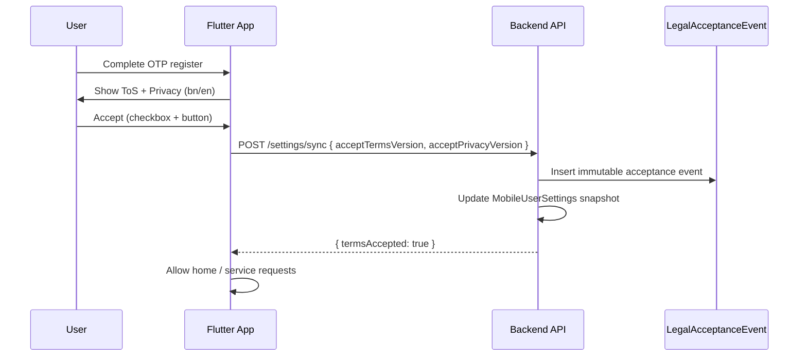
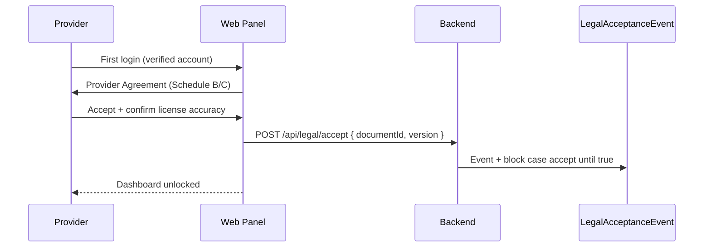

# Terms of Service — Legal Implementation Plan

**Document type:** Compliance / legal engineering plan  
**Version:** 1.1.0  
**Date:** 2026-05-30  
**Implementation:** See [TERMS_OF_SERVICE_IMPLEMENTATION.md](./TERMS_OF_SERVICE_IMPLEMENTATION.md) and [LEGAL_OPERATIONS.md](./LEGAL_OPERATIONS.md)  
**Scope:** Prani Doctor multi-channel platform  
**Repositories:** `pranidoctor_user` (Flutter), `pranidoctor-web` (Next.js admin + public legal pages), `pranidoctor-backend` (API + persistence)

**Related documents**

| Document | Path |
|----------|------|
| Role system | `docs/database/ROLE_SYSTEM.md` |
| Auth flows | `docs/api/AUTH_FLOW.md`, `docs/PHASE2_AUTH.md` |
| Feature matrix | `docs/audit/03_FEATURE_MATRIX.md` |
| Multi-tenant strategy | `docs/database/MULTI_TENANT_STRATEGY.md` |
| AI orchestrator | `docs/ai/AI_ORCHESTRATOR.md` |
| Treatment / consultation | `docs/PHASE5_TREATMENT.md` |
| AI technician marketplace | `docs/AI_TECHNICIAN_IMPLEMENTATION_PLAN.md` |
| Billing (partial) | `docs/BILLING_COMMISSION_PLAN.md` |
| Mobile settings / legal API | `pranidoctor-backend/src/legacy/web/lib/mobile-settings/mobile-settings-service.ts` |
| Flutter settings module | `pranidoctor_user/docs/user_app/USER_APP_18_SETTINGS.md` |

---

## 1. Executive summary

Prani Doctor is a **Bangladesh-focused, multi-actor veterinary and livestock platform** connecting farmers (`CUSTOMER`), licensed veterinarians (`DOCTOR`), artificial insemination / field technicians (`AI_TECHNICIAN`), and operations staff (`ADMIN`, `SUPPORT`, `SUPER_ADMIN`). The platform includes:

- **Flutter user app** — OTP auth, farm/animal management, service requests, AI assistant, settings with legal acceptance hooks
- **Next.js admin** — provider verification, service oversight, billing, content moderation, enterprise service-instance review
- **AI services** — chat, triage, recommendations, voice (planned/partial); human-in-loop for clinical decisions
- **Veterinary consultation** — home visit, emergency, online consultation (scheduling intent), treatment workflow
- **Livestock / AI technician services** — semen marketplace, `ServiceInstance` enterprise review, field service completion
- **Multi-tenant readiness** — `tenantId` on select models; single-tenant MVP with white-label path documented

**Current legal posture:** Placeholder public pages and a **mobile-only, opt-in acceptance API** exist. There is **no production-grade Terms of Service framework**: no enforced acceptance gates, no role-specific agreements, no immutable audit trail, no bilingual canonical documents, and no tenant-scoped legal configuration.

This plan defines a **production-ready ToS framework** covering all surfaces, with gap analysis, required legal sections, UI placement, acceptance workflows, database design, rollback, and verification — **implementation deferred** until counsel approves final text.

---

## 2. Platform analysis (as-built)

### 2.1 Authentication flows

| Surface | Primary auth | Session | Notes |
|---------|--------------|---------|-------|
| Flutter user app | Phone + OTP (`MobileOtpChallenge` → JWT + refresh) | Multi-device via `RefreshToken` / device registry | Register supports name, phone, optional email/password; onboarding is UX-only (no legal gate) |
| Admin panel | Email + password | Cookie/session via admin auth API | No ToS acceptance on login |
| Doctor panel | Email + password (panel); OTP optional on mobile paths | Panel session | Requires `ProviderStatus` verification before accepting requests |
| AI technician panel | Phone OTP / email + password | Panel + mobile paths | Extended verification lifecycle (`AiTechnicianStatus`) |
| Enterprise review UI | Same auth stack as admin/technician (role-gated) | `/enterprise/*` routes | Service-instance submission/review; no separate legal acceptance |

**User statuses:** `ACTIVE`, `SUSPENDED`, `PENDING_VERIFICATION`, `INVITED`, `DELETED` — usable for ToS enforcement (block suspended users; gate `PENDING_VERIFICATION` providers).

### 2.2 Roles and legal personas

| Role | Legal persona | Primary obligations |
|------|---------------|---------------------|
| `CUSTOMER` | Farmer / livestock owner | Accurate animal data, lawful use, payment, emergency escalation |
| `DOCTOR` | Licensed veterinary professional | Clinical responsibility, license accuracy, prescription compliance |
| `AI_TECHNICIAN` | Field service provider (AI/semen/livestock services) | Service quality, inventory accuracy, geographic scope |
| `SUPPORT` | Platform agent (internal) | Confidentiality, no unauthorized data changes |
| `ADMIN` / `SUPER_ADMIN` | Platform operator (internal) | Audit compliance, provider verification integrity |

**Important:** Doctors and AI technicians are **independent service providers** on a marketplace-style platform, not employees. ToS must reflect **platform intermediary** status (see §5.4, §5.11).

### 2.3 Service request and consultation workflows

**`ServiceRequestType` enum (Prisma):**

- `DOCTOR_HOME_VISIT`
- `EMERGENCY_DOCTOR`
- `AI_SERVICE`
- `ONLINE_CONSULTATION_LATER`

**Status machine:** `PENDING` → `ACCEPTED` / `ASSIGNED` → `IN_PROGRESS` → `COMPLETED` / `CANCELLED` / `REJECTED`

**Treatment workflow (Phase 5):** consultation → diagnosis → prescription → follow-up → close (`TreatmentConsultation`, `Prescription`, timeline events).

**Legal implications:**

- Emergency requests need **explicit non-emergency-platform disclaimer** at booking
- Online consultation is **scheduling/intent only** today — no video telemedicine session; ToS must not over-promise real-time remote diagnosis
- Prescriptions and billing are provider-attributed; platform facilitates record-keeping

### 2.4 AI features

| Capability | Status | Legal note |
|------------|--------|------------|
| AI chat / assistant (`AiAssistantSession`) | Partial (legacy + foundation paths) | Informational only; not veterinary diagnosis |
| Symptom triage / emergency classification | Documented in orchestrator | Must not delay emergency in-person care |
| Feed / farm recommendations | Mobile features | Agricultural guidance, not prescription |
| Voice processing | Planned/partial | Transcript metadata; audio retention policy needed |
| Content moderation (AI) | Planned | UGC moderation assist — human review remains authoritative |
| Provider assignment (AI routing) | Partial | Algorithmic matching disclaimer |

**Existing disclaimer page:** `/legal/disclaimer` (web) — veterinary + AI limitations; **not wired to acceptance tracking**.

### 2.5 Marketplace / livestock / enterprise workflows

- **AI technician services:** `AiTechnicianService`, packages, area coverage, farmer booking via `AI_SERVICE` requests
- **Semen / template marketplace:** `SemenServiceTemplate`, `ServiceInstance` with moderation lifecycle (`DRAFT` → `SUBMITTED` → … → `PUBLISHED`)
- **Enterprise review UI:** `/enterprise/services/review/*` — admin/worker review of technician submissions
- **Farmer-side livestock tools:** animals, health, vaccine, fattening, feed catalog, finance (local records)

**Legal implications:** Listing accuracy, semen/breeding service regulations (Bangladesh), technician–farmer direct service relationship, media moderation on `ServiceInstanceMedia`.

### 2.6 Payments and subscriptions

| Feature | Status | ToS impact |
|---------|--------|------------|
| `BillingRecord` / `PaymentRecord` | Schema + admin UI; doctor complete flow | Fee disclosure, commission, refund rules |
| Payment gateways (bKash, Nagad, Rocket enums) | **No live PSP integration** | Manual reconciliation disclaimer (already on `/refund`) |
| Wallet / subscription models | **Not in schema** | Reserve sections for future; do not promise in v1 ToS |
| Platform commission | `Setting` + calculation helpers | Transparent fee disclosure clause |

### 2.7 User-generated content

| Content type | Model / surface | Moderation |
|--------------|-----------------|------------|
| Knowledge tutorials | `ContentPost` (doctor-authored) | `ContentApprovalStatus` — admin approve/reject |
| Service instance media | `ServiceInstanceMedia` | `ServiceInstanceMediaModerationStatus` |
| Support tickets + attachments | Support module | Ops review |
| Animal / symptom photos | Service request uploads | Linked to clinical case |
| AI chat messages | `AiAssistantSession` messages | Retention + no medical reliance |

### 2.8 Multi-tenant platform

- **Current:** Single tenant (Bangladesh MVP); `tenantId` on `ServiceInstance` and documented future on core tables
- **Future:** Subdomain/header/JWT tenant resolution; per-tenant legal URLs and versions
- **ToS strategy:** Master platform ToS + optional **tenant addendum** (white-label operators accept platform terms; end-users may see tenant-branded policy links)

### 2.9 Existing legal infrastructure

| Component | Location | Gap |
|-----------|----------|-----|
| Public ToS page (stub) | `pranidoctor-web/src/app/terms/page.tsx` | Not canonical; no versioning; English only |
| Privacy policy (stub) | `pranidoctor-web/src/app/privacy/page.tsx` | Separate from ToS; cross-reference needed |
| Refund policy (stub) | `pranidoctor-web/src/app/refund/page.tsx` | Incorporated by reference in ToS |
| Veterinary disclaimer | `pranidoctor-web/src/app/legal/disclaimer/page.tsx` | Not acceptance-tracked |
| Mobile legal config | `Setting.key = "mobile.legal.config"` | Placeholder `termsContent`; version `2026-05-01` |
| Mobile acceptance fields | `MobileUserSettings.termsAcceptedVersion`, `termsAcceptedAt` | Customer-only; no audit immutability |
| Flutter Terms/Privacy UI | `lib/features/settings/presentation/terms_page.dart` | Settings-only; **no boot/register gate** |
| Launch ops legal links | Admin `/admin/launch-ops` | Links only; no compliance dashboard |

---

## 3. Gap analysis

### 3.1 Critical gaps (launch blockers for legal compliance)

| # | Gap | Risk | Current state |
|---|-----|------|---------------|
| G1 | **No enforced ToS acceptance** before using core features | Users may use app without agreeing to current terms | Acceptance optional in Settings; boot/register/onboarding skip legal |
| G2 | **No counsel-approved canonical document** | Unenforceable placeholder text | ~2 sentences in `DEFAULT_LEGAL.termsContent`; stub web pages |
| G3 | **No immutable acceptance audit trail** | Disputes cannot prove consent | Only latest version/timestamp on `MobileUserSettings`; overwritable |
| G4 | **No provider-specific agreements** | Doctors/technicians clinical liability unclear | Same generic stub for all roles |
| G5 | **AI + veterinary disclaimers not bundled into acceptance** | Regulatory / consumer protection exposure | Separate `/legal/disclaimer` page, not in accept flow |
| G6 | **No bilingual legal text (bn-BD + en)** | Primary market is Bangladesh; English-only stubs | Mobile default locale `bn-BD`; legal content English |

### 3.2 High gaps (pre-scale)

| # | Gap | Risk |
|---|-----|------|
| G7 | Admin / internal users have no acceptable-use / confidentiality terms | Insider data misuse |
| G8 | Enterprise `ServiceInstance` submitters not bound to listing accuracy terms | Marketplace fraud |
| G9 | Re-consent on material ToS changes not designed | Continued use ≠ acceptance of new terms |
| G10 | No API middleware to block requests when `termsAcceptedVersion` stale | Enforcement only in UI (if at all) |
| G11 | Payment/refund terms not synchronized across app, web, and billing UI | Inconsistent consumer expectations |
| G12 | Multi-tenant legal config not modeled | White-label launches blocked |

### 3.3 Medium gaps (post-MVP hardening)

| # | Gap |
|---|-----|
| G13 | Offline acceptance sync — outbox exists for settings but no server-side idempotency key per acceptance event |
| G14 | No legal document CMS — content in `Setting` JSON and static TSX pages diverge |
| G15 | No admin compliance dashboard (acceptance rates, version drift, provider agreement status) |
| G16 | Cookie/analytics consent not integrated (web admin monitoring, Sentry) — privacy overlap |
| G17 | Minor accounts / farm delegation not addressed (if family shares one phone) |

---

## 4. Required legal sections (framework)

Each section below maps to objectives 1–14. **Final wording requires qualified legal counsel** familiar with Bangladesh law and veterinary/regulatory context. This framework specifies **what must be covered**, **which roles**, and **where it surfaces in product**.

### 4.1 User eligibility (Objective 1)

**Must cover:**

- Minimum age (recommend **18+** for account holder, or 18+ guarantor for farm use — counsel to confirm)
- Geographic eligibility (Bangladesh service areas; restrictions outside supported divisions)
- Account limited to **one person / one phone** unless enterprise delegation added later
- Provider eligibility: valid veterinary registration (`DoctorProfile` license fields) or technician verification documents
- Prohibited users: suspended/deleted accounts, falsified credentials
- Business vs individual farmers (future B2B tenant addendum)

**Product touchpoints:** Register screen, provider onboarding (doctor/technician verification), admin approval workflows.

### 4.2 Account responsibilities (Objective 2)

**Must cover:**

- Accurate registration data (phone OTP ownership, name, location hierarchy)
- Credential security (OTP, password for panels, device session revocation)
- Prohibition on account sharing, credential resale, automated scraping
- Duty to update profile when service area or license status changes
- Provider duty to maintain `ProviderStatus.ACTIVE` requirements and document renewals

**Product touchpoints:** Auth flows, profile completion, session management (`/settings` data sync), provider dashboards.

### 4.3 Platform usage rules (Objective 3)

**Must cover:**

- Permitted uses: farm management, booking veterinary/AI services, educational content
- Prohibited uses: harassment of providers, false emergency requests, circumventing fees, reverse engineering, abuse of AI chat for non-livestock purposes
- Rate limits and fair use (AI token budgets, OTP rate limits)
- Compliance with local animal welfare and drug regulations
- Admin/support authority to investigate complaints (`Complaint` model)

**Product touchpoints:** AI chat, service request creation, support tickets, admin moderation tools.

### 4.4 Veterinary service limitations (Objective 4)

**Must cover:**

- Platform is **intermediary**, not veterinary practice entity
- **Not for human medical use**
- **Not emergency dispatch** — user must contact local vet / clinic for life-threatening conditions
- Remote/online consultation limits (information exchange vs hands-on examination)
- Doctor is solely responsible for diagnosis, prescription, and treatment decisions
- User must provide accurate symptoms and history (`AnimalProfile`, request description)
- Follow-up and referral obligations when in-person care required
- Prescription drugs — compliance with Bangladesh veterinary drug rules (counsel)

**Product touchpoints:** Emergency request flow, booking confirmation, treatment detail screens, `/legal/disclaimer`, doctor panel case completion.

**Incorporate by reference:** Veterinary Disclaimer (web + in-app equivalent).

### 4.5 AI service limitations (Objective 5)

**Must cover:**

- AI outputs are **informational and educational**, not diagnosis or prescription
- No guarantee of accuracy; models may hallucinate
- **Human-in-the-loop** for clinical decisions (aligns with `AI_ORCHESTRATOR.md` principles)
- Emergency triage AI must not replace calling a vet
- User consent to process chat/voice for service improvement (link Privacy Policy)
- Third-party AI providers (OpenAI, Anthropic, etc.) as subprocessors
- Right to disable AI features (admin kill-switch / user opt-out where applicable)

**Product touchpoints:** AI chat entry, first message disclaimer, voice feature (when live), smart recommendations.

### 4.6 User-generated content (Objective 6)

**Must cover:**

- License grant to platform to host, display, moderate UGC (photos, tutorials, service listings)
- User warrants they have rights to uploaded content
- Prohibited content: illegal, cruel, misleading breeding claims, counterfeit semen advertising
- Moderation rights — remove, reject, archive without notice (`ContentPost`, `ServiceInstance`)
- Takedown process and repeat infringer policy
- Doctor tutorial submissions — professional accuracy representation

**Product touchpoints:** Upload flows, enterprise service submission, knowledge hub submit, support attachments.

### 4.7 Data ownership (Objective 7)

**Must cover:**

- User retains ownership of farm/animal data they enter
- Platform license to process data to provide services (align with Privacy Policy)
- Provider access limited to data needed for assigned cases
- Export/deletion rights (support channel; account deletion workflow)
- Anonymized/aggregated analytics ownership by platform
- Clinical records — retention periods for prescriptions and billing (counsel + health record norms)

**Product touchpoints:** Privacy Policy, account deletion support flow, data sync settings, admin export tools.

### 4.8 Intellectual property (Objective 8)

**Must cover:**

- Platform IP: app, brand, templates (`SemenServiceTemplate`), software, UI
- Restrictions on copying, white-label misuse without tenant agreement
- Provider listings — limited license to display on marketplace
- Feedback / suggestions — license to use without compensation
- Open-source and third-party notices (Flutter, Next.js dependencies)

**Product touchpoints:** About page, app store listings, enterprise template system.

### 4.9 Service availability (Objective 9)

**Must cover:**

- Best-effort uptime; maintenance windows (`app config` maintenance mode)
- No guarantee of provider availability in all areas
- Feature flags and pilot limitations (manual payments, partial AI)
- Force-update mechanism (`BootController` update gates)
- Third-party dependencies (SMS, push, AI APIs) — no liability for outages

**Product touchpoints:** Maintenance screen, optional/force update dialogs, service area empty states.

### 4.10 Suspension and termination (Objective 10)

**Must cover:**

- Platform may suspend/terminate for ToS violations, fraud, safety
- Provider suspension (`ProviderStatus`, admin suspend) — effect on active cases
- User-initiated account closure
- Effect on data retention post-termination
- Appeal path via support
- `UserStatus.SUSPENDED` / `DELETED` enforcement

**Product touchpoints:** Auth rejection messages, admin user management, provider verification UI.

### 4.11 Liability limitations (Objective 11)

**Must cover:**

- Disclaimer of warranties (as-is service)
- Limitation of liability caps (counsel — jurisdiction-specific enforceability)
- Exclusion of indirect/consequential damages
- Provider liability carve-out — clinical negligence is provider responsibility
- Consumer rights that cannot be waived under Bangladesh law (counsel)

**Product touchpoints:** ToS acceptance screen (conspicuous section), checkout/booking confirmation (future payment).

### 4.12 Dispute handling (Objective 12)

**Must cover:**

- Internal complaint process (`Complaint`, support tickets)
- Billing disputes → Refund Policy
- Provider–customer service disputes — platform may facilitate, not adjudicate clinical outcomes
- Escalation timeline (align admin escalation monitoring)
- Governing negotiation before formal proceedings

**Product touchpoints:** Support module, refund policy, admin billing/complaints.

### 4.13 Jurisdiction strategy (Objective 13)

**Recommended approach (counsel to confirm):**

| Layer | Recommendation |
|-------|----------------|
| **Primary jurisdiction** | **People's Republic of Bangladesh** — courts of Dhaka (or counsel-preferred venue) |
| **Governing law** | Laws of Bangladesh |
| **Language of record** | Bengali (`bn-BD`) as authoritative for local users; English reference translation |
| **Consumer protection** | Comply with applicable Bangladesh e-commerce / consumer rules |
| **Cross-border** | If users outside BD access app, disclaimed or geo-blocked until expansion legal review |
| **Arbitration** | Optional clause for B2B/tenant agreements; B2C arbitration may be restricted — counsel decision |
| **Regulatory** | Veterinary council / livestock breeding regulations as applicable to provider conduct |

**Multi-tenant:** Tenant addendum may specify local operator contact; platform remains ultimate service provider for SaaS terms.

### 4.14 Versioning strategy (Objective 14)

**Document taxonomy:**

| Document ID | Audience | Version format | Example |
|-------------|----------|----------------|---------|
| `TOS-CUSTOMER` | Flutter users | `YYYY-MM-DD` or semver `MAJOR.MINOR` | `2026-06-01` |
| `TOS-PROVIDER-DOCTOR` | Doctor panel | Same | `2026-06-01` |
| `TOS-PROVIDER-TECHNICIAN` | AI technician | Same | `2026-06-01` |
| `TOS-ADMIN` | Admin/support staff | Same | `2026-06-01` |
| `TOS-ENTERPRISE` | Service instance submitters | Same | `2026-06-01` |
| `ACCEPTABLE-USE` | All authenticated users | Linked | — |
| `VET-AI-DISCLAIMER` | Shown at clinical/AI entry | Minor version OK | `1.1` |

**Change classes:**

| Class | User action | Example |
|-------|-------------|---------|
| **Material** | Re-consent required before core features | New data sharing, liability change, new mandatory arbitration |
| **Non-material** | Notice only (in-app banner + email/SMS if configured) | Typo, contact email, clarifications |
| **Emergency** | Immediate effective + retroactive notice for safety/legal order | Prohibited use clarification |

**Single source of truth:** Legal document registry (proposed §7) — not duplicated in `DEFAULT_LEGAL` hardcode and TSX stubs.

---

## 5. Document set architecture

### 5.1 Recommended structure

```
Master Platform Terms (all users)
├── 1. Definitions
├── 2. Eligibility & accounts
├── 3. Platform rules
├── 4. Services overview (marketplace model)
├── 5. Payments & refunds (incorporate Refund Policy)
├── 6. UGC & IP
├── 7. Data (incorporate Privacy Policy by reference)
├── 8. Availability & changes
├── 9. Suspension & termination
├── 10. Disputes & governing law
├── 11. Liability limitations
└── 12. Contact

Schedules (role-specific, incorporated by reference)
├── Schedule A — Customer (Farmer) Supplement
├── Schedule B — Veterinary Provider Agreement
├── Schedule C — AI Technician / Livestock Service Provider Agreement
├── Schedule D — Enterprise Listing & Semen Service Submission Terms
└── Schedule E — Admin & Personnel Acceptable Use (confidentiality)

Annexes (point-of-use, short form)
├── Annex AI — AI Assistant Limitations (shown at chat entry)
└── Annex VET — Emergency & Veterinary Disclaimer (shown at booking)
```

### 5.2 Why split documents?

- **One acceptance UX** for customers with schedules avoids doctor-only clauses on farmer screens
- **Provider agreements** require additional representations (license, insurance if applicable)
- **Enterprise submitters** need listing accuracy and breeding-service compliance
- **Admin AUP** is employment/contractor relationship — separate from consumer ToS

---

## 6. UI placement recommendations

### 6.1 Flutter user app (`pranidoctor_user`)

| Location | Purpose | Priority |
|----------|---------|----------|
| **Registration / first OTP verify** | Checkbox + links: "I agree to Terms and Privacy" | **P0** — currently missing |
| **Post-login legal gate** | Full-screen modal if `termsAcceptedVersion !== current` | **P0** |
| **Onboarding final step** | Summary + link before home (optional if register gate exists) | P1 |
| **Settings → About → Terms / Privacy** | Review + re-accept | Done (enhance with schedule links) |
| **Service request confirmation** | Short Annex VET disclaimer + link | **P0** for `EMERGENCY_DOCTOR` |
| **AI chat first open** | Annex AI inline banner + "I understand" | **P0** |
| **Booking AI technician service** | Provider marketplace disclaimer (independent contractor) | P1 |
| **Support / account deletion** | Link to dispute and data sections | P2 |

**Routes (existing):** `/settings/terms`, `/settings/privacy` — keep; add `/settings/legal/disclaimer` or deep link to web.

### 6.2 Next.js public web (`pranidoctor-web`)

| URL | Purpose |
|-----|---------|
| `/terms` | Canonical customer ToS (bn + en toggle) |
| `/terms/providers/doctors` | Schedule B (public link for onboarding) |
| `/terms/providers/technicians` | Schedule C |
| `/terms/enterprise` | Schedule D |
| `/privacy` | Privacy Policy (cross-linked) |
| `/refund` | Refund Policy (incorporated by reference) |
| `/legal/disclaimer` | Annex VET + AI (keep; sync content with registry) |
| `/legal/acceptable-use` | Admin/support (auth-gated or public summary) |

**Footer:** All marketing/public pages link to terms + privacy.

### 6.3 Admin panel

| Location | Purpose |
|----------|---------|
| **Admin login footer** | Link to Admin AUP; record acceptance on first login | **P0** for internal compliance |
| **Launch ops → Legal compliance** | Version dashboard, probe legal URLs, acceptance stats | P1 |
| **Provider verification screens** | Confirm provider schedule accepted before `ACTIVE` | **P0** |
| **Billing / refund actions** | Tooltip linking Refund Policy | P2 |

### 6.4 Doctor / technician panels

| Location | Purpose |
|----------|---------|
| **First login after verification invite** | Provider schedule acceptance (blocking) | **P0** |
| **Case acceptance** | Re-display clinical responsibility snippet | P2 |
| **Prescription submission** | Confirm professional responsibility checkbox | P1 |

### 6.5 Enterprise panel

| Location | Purpose |
|----------|---------|
| **Before first `ServiceInstance` submit** | Schedule D acceptance | **P0** |
| **Media upload** | UGC license reminder | P1 |

---

## 7. Acceptance workflow recommendations

### 7.1 Target flows

#### Customer (mobile)



#### Provider (doctor / technician)



#### Material version update

1. Publish new version in legal registry; bump `termsVersion` in config
2. Set `requiresReaccept: true` for affected roles
3. On next API call, middleware returns `428 LEGAL_REACCEPT_REQUIRED` with document payload
4. App/panel shows blocking modal until accepted
5. **Grace period** (counsel-defined, e.g. 30 days notice via banner before hard block)

### 7.2 Enforcement layers

| Layer | Behavior |
|-------|----------|
| **Client UX** | Blocking modals on register, boot, stale version |
| **API middleware** | Reject protected routes if acceptance stale (configurable per route class) |
| **Role gates** | Provider cannot accept `ServiceRequest` without provider schedule |
| **Admin override** | Super-admin cannot waive without audit (compliance exception only) |

### 7.3 Route classes for middleware (proposal)

| Class | Requires current ToS | Examples |
|-------|---------------------|----------|
| **A — Public read** | No | Health, legal document GET, OTP send |
| **B — Auth minimal** | Customer ToS | Profile read, settings |
| **C — Core product** | Customer ToS + Privacy | Service request create, AI chat, animal write |
| **D — Provider clinical** | Provider schedule + platform ToS | Case accept, prescription write |
| **E — Enterprise submit** | Schedule D | ServiceInstance submit |
| **F — Admin** | Admin AUP | All `/api/admin/*` |

### 7.4 Offline behavior (Flutter)

- Cache legal documents in Hive (existing settings cache pattern)
- Queue acceptance in offline outbox (`settingsSync`) with client timestamp
- Server applies **server receipt time** as authoritative `acceptedAt`
- If offline at register, block **Class C** actions until sync confirms (show cached doc + pending state)

---

## 8. Database tracking recommendations

### 8.1 Current schema (keep as denormalized snapshot)

```prisma
model MobileUserSettings {
  privacyAcceptedVersion String?
  privacyAcceptedAt      DateTime?
  termsAcceptedVersion   String?
  termsAcceptedAt        DateTime?
}
```

**Use for:** Fast client reads (`legal.termsAccepted` boolean in settings API).

### 8.2 Proposed additive models (implementation phase)

```prisma
/// Canonical legal document registry
model LegalDocument {
  id              String   @id @default(cuid())
  documentKey     String   // TOS-CUSTOMER, TOS-PROVIDER-DOCTOR, ...
  version         String   // 2026-06-01
  locale          String   // bn-BD, en-US
  title           String
  summary         String?  // change log for material updates
  contentMarkdown String   @db.Text
  contentHash     String   // SHA-256 of canonical content
  effectiveAt     DateTime
  requiresReaccept Boolean @default(false)
  supersedesId    String?
  publishedAt     DateTime?
  publishedById   String?
  tenantId        String?  // null = platform default

  acceptances     LegalAcceptanceEvent[]

  @@unique([documentKey, version, locale, tenantId])
  @@index([documentKey, effectiveAt])
}

/// Immutable acceptance audit trail
model LegalAcceptanceEvent {
  id              String   @id @default(cuid())
  userId          String
  legalDocumentId String
  documentKey     String   // denormalized for queries
  version         String
  locale          String
  acceptedAt      DateTime @default(now())
  ipAddress       String?
  userAgent       String?
  appSurface      String   // flutter_customer, admin_web, doctor_panel, ...
  appVersion      String?
  method          LegalAcceptanceMethod @default(EXPLICIT_BUTTON)
  metadataJson    Json?

  user            User          @relation(fields: [userId], references: [id])
  legalDocument   LegalDocument @relation(fields: [legalDocumentId], references: [id])

  @@index([userId, documentKey, acceptedAt])
  @@index([legalDocumentId])
}

enum LegalAcceptanceMethod {
  EXPLICIT_BUTTON
  CHECKBOX_REGISTER
  PROVIDER_ONBOARDING
  FORCED_RECONSENT
  ADMIN_ATTESTED  // internal — use sparingly with audit
}
```

### 8.3 Provider-specific extension

```prisma
model ProviderLegalProfile {
  id                    String   @id @default(cuid())
  userId                String   @unique
  doctorScheduleVersion String?
  doctorScheduleAt      DateTime?
  technicianScheduleVersion String?
  technicianScheduleAt  DateTime?
  licenseAttestationAt  DateTime?
  licenseAttestationHash String? // hash of license fields at acceptance
}
```

Or store provider acceptances only via `LegalAcceptanceEvent` with `documentKey` — **prefer single event table** over duplicating fields.

### 8.4 Configuration migration

Replace monolithic `mobile.legal.config` JSON with:

- `LegalDocument` rows for each published version
- Thin `Setting` key `legal.current.{documentKey}.{locale}` → version pointer
- Backward compat: `loadLegalConfig()` reads from registry during transition

### 8.5 Auth audit integration

Append `AuthAuditAction.LEGAL_ACCEPTED` (additive enum) linking to `LegalAcceptanceEvent.id` for login correlation.

---

## 9. Rollback plan

### 9.1 Document rollback (content)

| Scenario | Action |
|----------|--------|
| **Erroneous published version** | Publish `version+patch` reverting text; set `requiresReaccept: false` if non-material fix |
| **Material version caused mass lockout** | Feature flag `LEGAL_ENFORCEMENT_ENABLED=false` on API middleware (env var) — **temporary**; display banner only |
| **Wrong locale published** | Unpublish locale row; serve fallback `en-US` with notice |

### 9.2 Technical rollback

| Component | Rollback |
|-----------|----------|
| New middleware | Disable via `LEGAL_ENFORCEMENT_ENABLED` (default `true` in prod after verification) |
| New tables | Additive only — leave tables; stop writing events |
| Flutter gate | Remote config / app config flag `legalGateEnabled: false` |
| Admin provider gate | Admin setting to skip provider check (super-admin only, audited) |

### 9.3 Data integrity

- **Never delete** `LegalAcceptanceEvent` rows — append correction events only
- Rollback of enforcement ≠ rollback of user consent history

### 9.4 Communication

- Material rollback: in-app banner + SMS template (if notification channel live)
- Document incident in ops runbook (`docs/launch/`)

---

## 10. Verification plan

### 10.1 Pre-production checklist

| # | Test | Expected |
|---|------|----------|
| V1 | New customer register without accept | Blocked from service request / AI chat |
| V2 | Accept ToS v1, publish v2 material | `428` or blocking modal on next launch |
| V3 | Accept offline, sync online | Event created with server timestamp; idempotent second sync |
| V4 | Doctor without provider schedule | Cannot accept assigned case |
| V5 | Technician submit instance without Schedule D | Blocked at submit API |
| V6 | Admin login without AUP | Blocked from dashboard (when enabled) |
| V7 | `termsAcceptedVersion` tamper via API | Middleware still validates against event log |
| V8 | bn-BD document served when locale=bn-BD | Content matches published registry hash |
| V9 | Public URLs `/terms`, `/privacy` return 200 | Launch ops probe green |
| V10 | Suspended user | Auth fails; no new acceptance |

### 10.2 Automated tests (implementation phase)

| Suite | Location (proposed) |
|-------|---------------------|
| API acceptance + middleware | `pranidoctor-backend/src/modules/legal/*.test.ts` |
| Mobile settings integration | Extend `pranidoctor_user/test/settings/` |
| E2E register gate | Flutter integration test |
| Web legal page render | Playwright — title + version marker present |

### 10.3 Compliance verification

| Activity | Owner |
|----------|-------|
| Counsel review of bn + en final text | Legal |
| Record counsel sign-off version in `LegalDocument.metadataJson` | Compliance |
| Quarterly acceptance drift report (users on old version) | Ops / admin dashboard |
| Provider license attestation sample audit | Admin QA |

### 10.4 Launch ops integration

Extend `pranidoctor-web/src/app/admin/(dashboard)/launch-ops/page.tsx` (future):

- Probe `/terms`, `/privacy`, `/refund`, `/legal/disclaimer` (already linked)
- Add API probe: `GET /api/legal/status` → current versions + enforcement flag
- Display % users on current `TOS-CUSTOMER` version

---

## 11. Implementation phases (recommended sequence)

**Phase 0 — Legal content (no code)**  
Counsel drafts schedules; bn/en; sign-off hashes recorded.

**Phase 1 — Registry + public pages**  
`LegalDocument` seed; replace TSX stubs with CMS or MD-driven pages; sync `mobile.legal.config` readers.

**Phase 2 — Customer acceptance**  
Register gate + boot gate + API middleware Class C; immutable events.

**Phase 3 — Provider + enterprise**  
Schedules B/C/D; verification workflow integration.

**Phase 4 — Admin AUP + compliance dashboard**  
Internal acceptance + launch ops metrics.

**Phase 5 — Multi-tenant**  
`tenantId` on legal documents; tenant-branded URLs.

---

## 12. Open questions for legal counsel

1. Minimum age and parental consent for farm accounts shared within families?
2. Enforceability of liability caps and arbitration under Bangladesh consumer law?
3. Veterinary telemedicine / prescription remote issuance — regulatory constraints?
4. AI breeding/semen listing advertising — livestock authority requirements?
5. Data localization — must acceptance logs stay in-country?
6. bKash/Nagad terms when payment gateway goes live — separate payment facilitator disclosure?
7. Bengali as sole authoritative language vs bilingual equal weight?

---

## 13. Summary matrix

| Objective | Section | Primary surfaces | DB tracking |
|-----------|---------|------------------|-------------|
| 1 Eligibility | §4.1 | Register, provider onboarding | `LegalAcceptanceEvent` + verification status |
| 2 Account responsibilities | §4.2 | Auth, profile, sessions | Auth audit |
| 3 Usage rules | §4.3 | AI, requests, support | Complaint + audit |
| 4 Veterinary limitations | §4.4 | Booking, disclaimer | Point-of-use Annex VET |
| 5 AI limitations | §4.5 | AI chat entry | Point-of-use Annex AI |
| 6 UGC | §4.6 | Uploads, enterprise | Moderation logs |
| 7 Data ownership | §4.7 | Privacy Policy link | Privacy acceptance (existing fields) |
| 8 IP | §4.8 | About, enterprise | — |
| 9 Availability | §4.9 | Maintenance, updates | App config |
| 10 Suspension | §4.10 | Admin user mgmt | `UserStatus` |
| 11 Liability | §4.11 | ToS acceptance screen | Acceptance event |
| 12 Disputes | §4.12 | Support, refund | Support tickets |
| 13 Jurisdiction | §4.13 | ToS header | Document locale |
| 14 Versioning | §4.14 | Re-consent flow | `LegalDocument` + events |

---

**Status:** PLAN ONLY — no code changes in this deliverable.  
**Next step:** Legal counsel review → Phase 0 content → engineering estimate for Phase 1–2.
