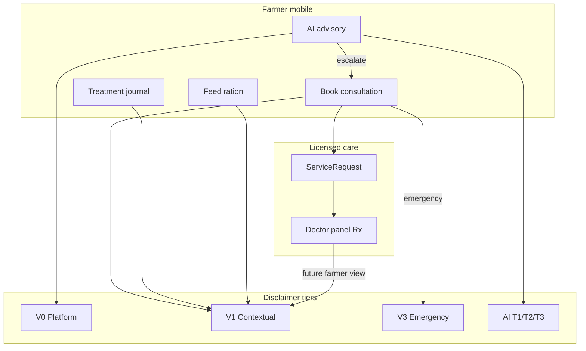

# Veterinary Disclaimer — Compliance Implementation Plan

**Document type:** Compliance / legal engineering plan  
**Version:** 1.1.0  
**Date:** 2026-05-30  
**Status:** **Implemented** — see `VET_DISCLAIMER_OPERATIONS.md` for operations  
**Scope:** All veterinary-adjacent user journeys across Prani Doctor (human doctor care, AI advisory, livestock management guidance, treatment records, follow-ups)  
**Repositories:** `pranidoctor_user` (Flutter), `pranidoctor-web` (Next.js public legal + doctor/admin panels), `pranidoctor-backend` (API, clinical workflows, AI orchestrator)

**Related documents**

| Document | Path |
|----------|------|
| AI disclaimer plan (LLM-specific) | `docs/compliance/ai/ai-disclaimer-plan.md` |
| AI disclaimer ops | `docs/compliance/ai/AI_DISCLAIMER_OPERATIONS.md` |
| Veterinary disclaimer ops | `docs/compliance/veterinary/VET_DISCLAIMER_OPERATIONS.md` |
| Veterinary disclaimer verification | `docs/compliance/veterinary/VET_DISCLAIMER_VERIFICATION_REPORT.md` |
| Public veterinary disclaimer page | `pranidoctor-web/src/app/legal/disclaimer/page.tsx` |
| Customer ToS | `docs/compliance/legal/TERMS_OF_SERVICE_CUSTOMER.md` |
| Doctor provider agreement | `docs/compliance/legal/TERMS_OF_SERVICE_PROVIDER_DOCTOR.md` |
| Privacy policy | `docs/compliance/legal/PRIVACY_POLICY.md` |
| Acceptance strategy | `docs/compliance/legal/ACCEPTANCE_STRATEGY.md` |
| User consent flow plan | `docs/compliance/consent/user-consent-flow-plan.md` |

---

## 1. Executive summary

Prani Doctor operates as a **marketplace technology platform** connecting farmers with **licensed veterinarians** and field service providers. Veterinary-adjacent functionality spans five distinct tracks that users often conflate:

1. **Licensed doctor consultations** — home visit, emergency doctor dispatch, scheduled online consultation (async/remote intent; no live video in current stack)
2. **LLM / rule-based AI advisory** — chat, triage, symptom checker, smart recommendations (see AI disclaimer plan)
3. **Livestock management recommendations** — feed ration engine, smart farm tasks (vaccine/deworm reminders)
4. **Treatment guidance & records** — doctor-issued prescriptions via service requests; parallel farmer self-log (`FarmTreatment` journal)
5. **Follow-up workflows** — doctor-scheduled follow-ups (P5 + legacy); AI-generated follow-up suggestions post–symptom check

**Current posture:** A short public page at `/legal/disclaimer` covers emergency, AI, and teleconsultation in three paragraphs. Customer ToS and doctor provider agreement assign **clinical responsibility to licensed professionals** and **informational-only status to AI**. In-app, **doctor booking flows carry no veterinary disclaimer** beyond generic appointment copy; **AI flows** have a separate disclaimer framework (implemented). **Treatment pages** use clinical journal labels without limitation disclosures. **Emergency** is handled via filters, phone dial, and booking type — not a persistent emergency disclaimer gate.

This plan defines a **unified veterinary disclaimer strategy** covering medical limitations, remote consultation limits, emergency handling, and user responsibility — with placement, acceptance, compliance, and verification guidance. **Cross-reference:** LLM-specific tiers (T1/T2/T3) remain in the AI disclaimer plan; this document covers **platform veterinary disclaimers** that apply across human and automated guidance.

**Naming clarification**

| Term in product | Meaning | Disclaimer track |
|-----------------|---------|------------------|
| **Doctor / vet consultation** | Licensed `DOCTOR` via `ServiceRequest` | **Veterinary disclaimer (this doc)** |
| **AI chat / triage / symptom check** | LLM or rules assistant | **AI disclaimer plan** |
| **AI Technician / AI Service** | Artificial insemination field technician | **Service-provider terms** (human field work) |
| **Feed / smart recommendations** | Rule-based farm guidance | **Veterinary + AI-adjacent** (management, not diagnosis) |

---

## 2. Workflow inventory (as-built)

### 2.1 Doctor consultations

| Type | `ServiceRequestType` | Delivery model | Mobile entry | Backend enforcement |
|------|----------------------|----------------|--------------|---------------------|
| Home visit | `DOCTOR_HOME_VISIT` | In-person | Services → doctor → book | Geo required |
| Emergency doctor | `EMERGENCY_DOCTOR` | In-person urgent | Instant care, emergency filter, book | `isEmergency`, ops SLA alerts |
| Online consultation | `ONLINE_CONSULTATION_LATER` | Remote/async scheduling | Book when doctor accepts online | `preferredTime`; no video session model |

**Lifecycle:** Customer creates request → admin assigns / doctor accepts → in-progress → doctor documents treatment/prescription → complete + billing.

**Key surfaces**

| Surface | Repo | Disclaimer today |
|---------|------|------------------|
| Book consultation | Flutter `BookConsultationPage` | None — symptoms, type, area only |
| Service request detail | Flutter `ServiceRequestDetailPage` | None |
| Inbox / appointments | Flutter `InboxPage` | Appointment l10n only |
| Doctor case detail | Web `DoctorCaseDetailPanel` | Provider agreement (backend); no in-case disclaimer |
| Admin assignment | Web `ServiceRequestDetailPanel` | None |

**Clinical documentation paths (doctor-issued)**

| Path | Endpoints | Content |
|------|-----------|---------|
| Legacy on service request | `POST …/treatment-cases`, `POST …/prescriptions` | Diagnosis, symptoms, medicines |
| P5 workflow | `POST /api/cases/:id/consultation\|diagnosis\|prescription\|followup\|close` | State machine |

---

### 2.2 AI consultations (advisory — not doctor)

| Feature | Nature | Escalation to human |
|---------|--------|---------------------|
| AI chat | LLM educational | `escalationRecommended`, `/services` CTA |
| AI triage | Rule-based urgency | HIGH/emergency → escalation record |
| Symptom checker | Graph + RAG | `escalationRequired`, find vet CTA |
| Voice → chat | STT + LLM | Same as chat |

**Distinction from doctor:** AI **cannot** diagnose or prescribe (guardrails in `ai-safety.guardrails.ts`). Doctor consultations **can** produce diagnosis and prescription records.

**Disclaimer ownership:** Fully specified in `docs/compliance/ai/ai-disclaimer-plan.md`. This veterinary plan requires **cross-links** at booking and emergency surfaces so users understand AI ≠ vet.

---

### 2.3 Livestock recommendations

| Feature | Engine | Medical claim level | Current disclaimer |
|---------|--------|---------------------|-------------------|
| Daily feed ration | Rule pipeline (`feed-recommendation`) | Nutrition/management | `disclaimerBn` on API + Flutter footer |
| Smart recommendations | Rules from livestock DB (`smart-recommendation.service`) | Care reminders (vaccine, deworm) | AI T2 recommendations tier (when implemented) |
| Smart alerts | Notification intelligence | Farm ops | Partial / missing UI |
| Farm health dashboard | Aggregated scores | Heuristic risk, not clinical | Advisory tier |

Example smart-rec copy: *"Scheduled date passed — vaccinate or consult your vet."* — appropriately hedged but not a unified veterinary disclaimer block.

---

### 2.4 Treatment guidance

| Track | Model | Who authors | User sees |
|-------|-------|-------------|-------------|
| **Doctor treatment** | `TreatmentCase`, `Prescription` on completed visit | Licensed doctor | Not auto-synced to farmer treatment UI today |
| **P5 workflow** | `TreatmentWorkflow`, `TreatmentConsultation`, etc. | Licensed doctor | Doctor panel only |
| **Farmer journal** | `FarmTreatment` via `/api/mobile/treatments` | Customer (self-log) | Flutter treatment module — diagnosis/prescription **labels** |

**Risk:** Farmer-entered “diagnosis” and “prescription” fields can be mistaken for vet-authorized care. No disclaimer clarifies self-log vs professional record.

---

### 2.5 Follow-up workflows

| Source | Mechanism | Notification | Disclaimer |
|--------|-----------|--------------|------------|
| Doctor legacy | `followUpDate`, `followUpNotes` on `TreatmentCase` | Not wired | None |
| P5 | `POST /api/cases/:id/followup` → `TreatmentFollowup` | Not wired | None |
| Farmer treatment module | Local reminders on dashboard | Local notifications | None |
| AI post–symptom check | `AiFollowUpSuggestion` | In-app list (partially linked) | Implicit “book vet” on HIGH |

---

### 2.6 Emergency handling (platform-level)

| Mechanism | Behavior | Disclaimer |
|-----------|----------|------------|
| Public legal page | States platform is **not** emergency care | Static EN only |
| Instant care sheet | `tel:` emergency phone + services filter + AI chat | No emergency disclaimer modal |
| Ops escalation monitor | Unassigned emergency SLA (15 min default) | Internal only |
| AI emergency keywords | Auto-escalation + urgent copy | In AI/triage responses |

---

## 3. Current disclaimer sources (canonical text to reconcile)

| Source | Coverage | Gap |
|--------|----------|-----|
| `/legal/disclaimer` | Emergency, AI summary, teleconsult limitation | No home visit, treatment journal, feed recs, BN locale, booking acceptance |
| Customer ToS §3–5, §7 | Platform intermediary; AI informational; liability → vet disclaimer | Not shown at booking |
| Doctor provider agreement | License, clinical responsibility, in-person when remote insufficient | Doctor panel acceptance; not farmer-visible |
| AI disclaimer tiers | LLM/advisory surfaces | Does not cover doctor booking |
| Feed `disclaimerBn` | Ration guidance | BN only; not linked to veterinary plan |
| Flutter `aiDisclaimer` l10n | AI fallback banner | Not used on doctor/treatment flows |

---

## 4. Disclaimer content strategy

Legal counsel must approve final wording. Below defines **required themes** and **draft intent** by dimension.

### 4.1 Medical limitation disclosures

**Must communicate (all veterinary-adjacent surfaces):**

- Prani Doctor is a **technology platform**, not a veterinary clinic or emergency service.
- **Only licensed veterinarians** (or authorized providers you book through the platform) may examine animals and issue clinical decisions.
- **AI and automated recommendations** do not constitute examination, diagnosis, prescription, or treatment.
- **Feed and farm management suggestions** are general guidance; withdrawal periods, dosages, and contraindications require professional verification.
- **Farmer treatment journal** entries are user-created records; they are not verified by a veterinarian unless linked to a completed service request (future).

**Draft short form (platform banner):**  
*"Prani Doctor connects you with livestock professionals. Platform guidance and AI tools do not replace hands-on veterinary examination."*

**Draft long form (booking + first treatment journal entry):**  
Expand with species limitations, incomplete information risk, and that displayed doctor fees/availability are not guarantees of outcome.

---

### 4.2 Remote consultation limitations

**Applies to:** `ONLINE_CONSULTATION_LATER`, any future teleconsult/video, and **AI chat** (remote by nature).

**Must communicate:**

- Remote consults rely on **information and media you provide**; the doctor cannot physically examine the animal.
- Doctors may **decline or stop** remote advice and require **in-person** examination.
- **No real-time emergency response** is promised for online consultation type.
- **Connectivity, language, and photo/video quality** may limit assessment accuracy.
- Platform does **not** currently provide integrated video — scheduling is async; users must not assume instant live vet access unless explicitly offered in product copy.

**Draft (online booking confirm step):**  
*"Online consultation is based on the details you share. Your veterinarian may recommend an in-person visit. This is not for life-threatening emergencies."*

---

### 4.3 Emergency handling disclosures

**Must communicate:**

- Prani Doctor **does not provide emergency veterinary services** itself.
- For **life-threatening** signs (collapse, severe bleeding, difficulty breathing, poisoning suspected), contact a **licensed veterinarian or emergency facility immediately** — do not wait for app response or AI.
- **Emergency doctor booking** and **phone numbers** in the app are **requests/contacts**, not guaranteed arrival times.
- **AI triage urgency labels** indicate when to seek care, not a diagnosis or dispatch guarantee.
- **Bangladesh context:** Include BN equivalent for critical signs and “call vet / nearest clinic” instruction.

**Placement priority:** Before first emergency booking attempt; on instant care sheet open; on AI triage HIGH/emergency result (already partial).

**Draft (emergency booking interstitial):**  
*"If your animal may die without immediate care, go to the nearest veterinary facility or call a vet now. Booking through the app does not guarantee emergency response time."*

---

### 4.4 User responsibility notices

**Must communicate:**

- User is responsible for **accurate** animal identity, symptoms, history, location, and contact information.
- User must **follow applicable law** for medicines, withdrawals, and record-keeping.
- User must **not delay** professional care when condition worsens.
- User should **verify** any AI or feed recommendation before medicating or changing rations.
- **Minors** must not book without guardian consent (align with ToS eligibility).
- **Payment and cancellation** policies apply; non-payment does not remove obligation to seek care for suffering animals (welfare framing, counsel to refine).

**Draft (booking checkbox label):**  
*"I confirm the information is accurate and I understand this platform does not replace emergency or in-person veterinary care when needed."*

---

## 5. Unified disclaimer taxonomy

Proposed tiers — **orthogonal to AI T1/T2/T3** (those remain for LLM consent):

| Tier | ID | Purpose | Length |
|------|-----|---------|--------|
| **V0 — Platform** | `vet.disclaimer.platform` | Always true: marketplace, not a clinic | 1 sentence |
| **V1 — Contextual** | `vet.disclaimer.{context}` | Shown on specific workflow | 1–3 sentences |
| **V2 — Comprehensive** | `vet.disclaimer.full` | Booking acceptance, public legal page, doctor panel ack | Full sections §4.1–4.4 |
| **V3 — Emergency** | `vet.disclaimer.emergency` | High-salience emergency interstitial | Bold, short |

**Contexts (`{context}`):** `booking_home`, `booking_emergency`, `booking_online`, `treatment_journal`, `prescription_view`, `feed_ration`, `follow_up_ai`, `follow_up_doctor`, `instant_care`.

**Locale:** All tiers require **canonical BN + EN** from CMS (`Setting` or legal config), not hardcoded per screen.

### 5.1 Feature → tier mapping

| Workflow | V0 | V1 contextual | V2 link | V3 emergency |
|----------|----|--------------|---------|--------------|
| Book home visit | Footer | `booking_home` on confirm | ToS + veterinary disclaimer | If user selects emergency type → V3 |
| Book emergency doctor | Footer | — | V2 summary | **V3 required before submit** |
| Book online consult | Footer | `booking_online` on confirm | V2 | — |
| Service request detail (active) | — | Platform + remote limits if online | — | If emergency flag on request |
| AI chat / triage | AI tiers | Cross-link V0 | AI consent (separate) | On HIGH/emergency result |
| Feed daily ration | — | `feed_ration` footer | — | — |
| Smart recommendations | AI rec tier | + V0 one-liner | — | — |
| Treatment journal create | — | `treatment_journal` | V2 link | — |
| Prescription view (doctor-issued) | — | `prescription_view` | — | — |
| Doctor follow-up (P5) | Doctor panel | Provider agreement | — | — |
| AI follow-up suggestions | AI advisory | `follow_up_ai` | — | HIGH → V3 |
| Instant care sheet | — | — | — | **V3 at sheet open** |

---

## 6. Placement strategy

### 6.1 Flutter mobile (`pranidoctor_user`)

| Location | Route / component | Rule |
|----------|-------------------|------|
| Instant care sheet | `instant_care_sheet.dart` | V3 emergency block at top before actions |
| Book consultation | `BookConsultationPage` | V1 by type; V3 if `ConsultationType.emergency`; checkbox V2 snippet before submit |
| Service request detail | `ServiceRequestDetailPage` | V1 for online/emergency requests |
| Services / doctor list | `services_page.dart` | V0 footer or collapsible info |
| Treatment create | `TreatmentFormPage` | V1 `treatment_journal` |
| Prescription view | `TreatmentPrescriptionPage` | V1 `prescription_view` — clarify doctor-issued vs self-log when data source known |
| Feed ration | `DailyRationPage` | Keep `disclaimerBn` + EN; align copy with `feed_ration` tier |
| AI surfaces | AI disclaimer framework | Add V0 cross-link “Need a vet? Book Services” |
| Home emergency chip | `home_care_action_bar.dart` | Optional V3 tooltip first use per version |

### 6.2 Doctor & admin web (`pranidoctor-web`)

| Location | Rule |
|----------|------|
| Doctor case detail | Acknowledgment banner: clinical decisions are provider’s responsibility (provider agreement summary) |
| Doctor clinical section | Reminder before prescription submit: verify in-person need |
| Admin service request detail | No farmer disclaimer; internal ops only |
| Public `/legal/disclaimer` | Expand to full V2; add BN page or toggle |
| `/terms` | Cross-link veterinary disclaimer § |

### 6.3 Backend API (`pranidoctor-backend`)

| Rule | Detail |
|------|--------|
| Service request create response | Include `disclaimer` field for emergency/online types |
| Treatment/prescription DTOs | Optional `disclaimer` on farmer-facing reads when exposed |
| Feed + smart rec responses | Unify disclaimer key with veterinary CMS |
| Separate from AI | `vet.disclaimer.*` config distinct from `mobile.ai.disclaimer.config` |

### 6.4 Timing rules

| Moment | Requirement |
|--------|-------------|
| Before first **emergency** booking | V3 interstitial + explicit acknowledge |
| Before first **online** booking | V1 online limitations visible without scroll |
| Before **treatment journal** save (first time) | V1 self-log vs vet record |
| On **AI emergency/triage HIGH** | V3 + CTA to services / phone |
| Every **active online** service request | Persistent V1 in detail view |

---

## 7. Acceptance strategy

### 7.1 Current state

| Acceptance type | Exists? | Scope |
|-----------------|---------|-------|
| Privacy / terms | Yes | Platform-wide |
| AI processing consent | Yes | `/api/ai/*` |
| Veterinary disclaimer accept | **No** | — |
| Emergency booking acknowledge | **No** | — |
| Doctor provider agreement | Yes (backend API) | Doctor role |

### 7.2 Recommended model (counsel to choose)

**Option A — Bundled in Customer ToS (lower friction)**  
Veterinary limitations are sections inside ToS; booking checkbox references ToS + veterinary disclaimer URL.

**Option B — Contextual acceptance (recommended for emergency/online)**  
- ToS covers general platform role.
- **First emergency booking** and **first online booking** require checkbox + versioned `vetDisclaimerAcceptedVersion` (separate from AI consent).
- **Treatment journal** first save requires `treatment_journal` acknowledgment.

**Option C — Display-only for home visit**  
V1 visible; no extra accept beyond ToS.

### 7.3 Persistence design (documentation only)

| Field | Purpose |
|-------|---------|
| `userId` / `customerId` | Subject |
| `vetDisclaimerVersion` | e.g. `2026-05-30.1` |
| `context` | `EMERGENCY_BOOKING`, `ONLINE_BOOKING`, `TREATMENT_JOURNAL`, … |
| `acceptedAt` | Timestamp |
| `serviceRequestId` | Optional — per-booking audit for emergency |

**API sketch (not implemented):**

- `GET /api/mobile/legal/vet-disclaimer?context=booking_emergency`
- `POST /api/mobile/legal/vet-disclaimer/accept`
- Optional: store per-request acknowledgment on `ServiceRequest.metadata` for emergency type

**Reuse:** Append to `LegalConsentEvent` with new type `VET_DISCLAIMER` (schema change) or use `metadata.kind: VET_DISCLAIMER_ACCEPT` under existing audit patterns.

---

## 8. Compliance requirements

### 8.1 Regulatory and market context (Bangladesh)

| Requirement | Action |
|-------------|--------|
| Consumer protection | Clear BN + EN; no guarantee of cure or emergency response time |
| Veterinary drug advertising | Disclaimers on feed/treatment journal: user verifies withdrawal/dosage with vet |
| Telemedicine boundaries | Remote limits explicit; doctor must recommend in-person when needed |
| Animal welfare | Emergency disclosure: do not delay care for app/AI |
| Platform intermediary | ToS + V2: doctors are independent providers |

### 8.2 Store policies

| Store | Requirement |
|-------|-------------|
| Google Play health apps | Medical disclaimer URL; distinguish AI from professional care |
| Apple App Store | Accurate description of telehealth limitations |

### 8.3 Role-specific obligations

| Role | Disclaimer exposure |
|------|---------------------|
| `CUSTOMER` | V0–V3 on booking, AI cross-links, treatment journal |
| `DOCTOR` | Provider agreement; in-case clinical responsibility reminder |
| `AI_TECHNICIAN` | Separate field-service terms (insemination), not this veterinary clinical doc |
| `ADMIN` | Configure copy via legal settings (future vet disclaimer admin) |

### 8.4 Relationship to AI disclaimer plan

| Topic | Owner document |
|-------|----------------|
| LLM consent, kill switch, non-diagnose guardrails | `ai-disclaimer-plan.md` |
| Doctor booking, emergency, remote consult, treatment journal | **This document** |
| Overlap (AI triage → book vet) | Both — AI tier + V3 emergency |

---

## 9. Gap analysis

| Gap | Severity | Workflow |
|-----|----------|----------|
| No disclaimer on doctor booking | **High** | Consultations |
| No emergency interstitial before emergency book | **High** | Emergency |
| Online consult limitations not in booking UI | **High** | Remote consult |
| Treatment journal uses clinical labels without self-log disclaimer | **High** | Treatment guidance |
| Public disclaimer incomplete vs feature set | **Medium** | All |
| Public disclaimer English-only | **Medium** | BN market |
| Doctor-issued Rx not distinguished from farmer journal in UI | **Medium** | Treatment |
| No vet disclaimer acceptance audit | **Medium** | Compliance |
| AI vs doctor conflation in marketing/onboarding | **Medium** | AI + doctor |
| Follow-up reminders without “not a substitute for vet visit” | **Low** | Follow-ups |
| Feed disclaimer BN-only on mobile | **Low** | Recommendations |

---

## 10. Verification plan

### 10.1 Static content verification

| ID | Check | Pass criteria |
|----|-------|---------------|
| VD-01 | Legal sign-off on V0–V3 BN+EN | Signed version registry |
| VD-02 | Public `/legal/disclaimer` matches V2 | Content diff approved |
| VD-03 | ToS §5–7 aligns with veterinary plan | Legal review |
| VD-04 | AI disclaimer cross-links present | Plan cross-reference doc updated |

### 10.2 UI placement verification (Flutter)

| ID | Check | Pass criteria |
|----|-------|---------------|
| VP-01 | Emergency book shows V3 before submit | Widget/E2E test |
| VP-02 | Online book shows remote limitations | Snapshot test |
| VP-03 | Treatment create shows journal disclaimer | Integration test |
| VP-04 | Instant care shows emergency disclosure | Manual QA checklist |
| VP-05 | No “guaranteed emergency response” copy | Grep audit |

### 10.3 Acceptance verification

| ID | Check | Pass criteria |
|----|-------|---------------|
| VA-01 | Emergency accept recorded | DB / audit row with context |
| VA-02 | Version bump re-prompts | Config test |
| VA-03 | AI consent ≠ vet disclaimer | Separate version fields |

### 10.4 Workflow behavioral verification

| ID | Check | Pass criteria |
|----|-------|---------------|
| VB-01 | Emergency request creates ops alert | Escalation monitor |
| VB-02 | Online request without emergency interstitial conflation | Type-specific copy |
| VB-03 | AI triage HIGH shows V3 + services CTA | E2E |
| VB-04 | Doctor prescription path requires licensed role | Auth test |

### 10.5 Pre-production sign-off

- [ ] Legal counsel approved V0–V3 BN+EN
- [ ] Feature → tier matrix implemented per §5.1
- [ ] Emergency and online booking acceptance model chosen
- [ ] Public disclaimer URL live in BN+EN
- [ ] VD/VP/VA/VB checks pass in staging
- [ ] Distinction documented for support staff (AI vs doctor vs AI technician)

---

## 11. Implementation phases (reference — do not execute from this doc)

| Phase | Scope | Repos |
|-------|-------|-------|
| **P0** | V3 emergency on instant care + emergency booking; expand `/legal/disclaimer` | user, web |
| **P1** | V1 online/home booking; treatment journal disclaimer; CMS config `mobile.vet.disclaimer.config` | backend, user, web |
| **P2** | Acceptance API + audit; doctor panel banner; EN feed disclaimer | backend, user, web |
| **P3** | Per-request emergency ack; farmer-visible doctor Rx with `prescription_view` tier | backend, user |

---

## 12. Appendix A — Workflow diagram

---

## 13. Appendix B — Draft copy matrix (intent only)

| Context | EN intent | BN intent |
|---------|-----------|-----------|
| Platform V0 | "Platform connects farmers with professionals; not a veterinary clinic." | "প্ল্যাটফর্ম কৃষক ও পেশাদারকে সংযুক্ত করে; veterinary clinic নয়।" |
| Online booking | "Remote consult depends on your information; in-person visit may be required." | "দূর পরামর্শ আপনার তথ্যের উপর নির্ভরশীল; সশরীরে পরিদর্শন প্রয়োজন হতে পারে।" |
| Emergency V3 | "Life-threatening? Contact a vet or clinic immediately." | "জীবনঝুঁকি? অবিলম্বে প্রাণী চিকিৎসক/ক্লিনিকে যোগাযোগ করুন।" |
| Treatment journal | "Your entries are personal records, not verified by a veterinarian." | "আপনার লেখা ব্যক্তিগত রেকর্ড; চিকিৎসক যাচাই করেননি।" |
| Feed ration | "General feeding guidance; confirm with vet before medical dietary changes." | "সাধারণ খাদ্য নির্দেশনা; চিকিৎসা সংক্রান্ত পরিবর্তনে চিকিৎসকের পরামর্শ নিন।" |

---

*End of plan. Implementation requires legal approval and coordination with the AI disclaimer program (`docs/compliance/ai/`).*
