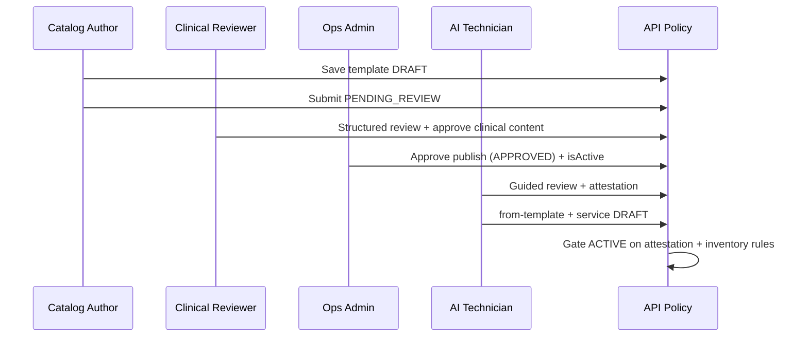

# Enterprise Template Review, Understanding & Clinical-Safe Execution — Architecture & UX Plan

**Project:** Prani Doctor / Animal Doctors (`pranidoctor-web`, `pranidoctor_mobile`)  
**Document type:** Analysis of the **current** semen service template system plus a **complete** enterprise-grade architecture and UX plan. **No implementation** is implied by this file.  
**Last updated:** 2026-05-12  
**Related:** `docs/enterprise-ai-service-review-system-plan.md` (service-instance / publish layer), `docs/AI_TECHNICIAN_SEMEN_SERVICE_TEMPLATE_PLAN.md` (original semen template domain plan), `ENTERPRISE_TEMPLATE_EXPERIENCE_REPORT.md` (admin UI rebuild notes).

---

## Executive summary

Today, **admin** authors `SemenServiceTemplate` rows with rich HTML (Tiptap), breed mix, media (cover / gallery / video), and a single free-text **`warningsContraindications`** field. **AI technicians** browse an **approved** catalog via mobile APIs, see a **minimal** Flutter detail screen, then jump to a **pricing-only** confirmation screen before `POST /api/mobile/ai-technician/services/from-template`. **Farmers** can receive a merged **`semenTemplateLocked`** block on public listings. There is **no** persisted “template understood” record, **no** structured clinical risk model, **no** guided review wizard, and **no** doctor/staff acknowledgment path tied to templates.

This document specifies an **additive** enterprise layer: **guided template review**, **mandatory understanding flows**, **role-based acknowledgments**, **structured warnings**, **readiness scoring**, **pre-service confirmation**, and **AI-safe execution** (human attestation + policy gates), while preserving existing APIs and gradually extending schema and mobile UX.

---

## Part A — Current system analysis (as-is)

### A.1 Template listing

| Surface | Implementation | Behavior / limits |
|--------|----------------|-------------------|
| **Admin** | `SemenServiceTemplatesList` (`src/components/admin/semen/SemenServiceTemplatesList.tsx`), `GET /api/admin/semen-service-templates` | Client-side filters (name `q`, `animalType`, `approvalStatus`, `isActive`), **`limit=100` fixed** in the client query. Summary tiles (total / approved / pending / active). Table: name, provider, animal type, approval, active, last updated (`bn-BD` + `Asia/Dhaka`). |
| **Mobile (AI technician)** | `AiSemenTemplateCatalogScreen`, `listSemenTemplates` in `ai_technician_repository.dart`, `GET /api/mobile/ai-technician/semen-templates` | Server enforces **`isActive: true`** + **`approvalStatus: APPROVED`**. Query schema: `animalType`, `providerId`, `breedId`, **`limit` default 30 max 50**, `offset` (`semen-mobile-schemas.ts`). Catalog cards: title, provider · breed summary · price. **No** search UI on mobile; **no** infinite scroll (single page). |

**Gaps:** Admin list not paginated past 100; mobile catalog does not expose full filter set in UI; no “readiness” or “missing clinical content” indicators in either list.

### A.2 Template detail page

| Surface | Implementation | Notes |
|--------|----------------|-------|
| **Admin read view** | `SemenServiceTemplateDetailView` (`src/components/admin/semen/SemenServiceTemplateDetailView.tsx`), data from `adminGetSemenTemplate` | Hero: name, badges (active, approval, animal type, semen product kind), provider, pricing grid, **cover** image via `/api/admin/uploads/{id}`. Sections: rich **short / detailed / benefits / recommended condition** via `roBlockRich` + `sanitizeAdminRichHtml` (DOMPurify / `sanitize-admin-html.ts`), **warnings** section, breed bars, gallery grid, video list (upload + external URL), sidebar metadata / tags JSON. `lang="bn"` on root. |
| **Mobile** | `AiSemenTemplateDetailScreen` | **Plain `Text` widgets** for `internalName`, provider, `breedSummaryBn`, optional `shortDescription`, optional `warningsContraindications` (prefixed “সতর্কতা:”). **Does not render** `detailedDescription`, `expectedBenefits`, `recommendedAnimalCondition`, **`media`**, breed breakdown, or semen product kind label. Primary CTA: navigate to `/confirm`. |

**Gaps:** Massive **web vs mobile parity** gap; mobile shows HTML as raw text if tags present; no learning center, no expandable clinical sections.

### A.3 AI service creation flow

| Step | Location | Behavior |
|------|----------|----------|
| Catalog → detail → confirm | `router.dart` nested routes under `AiSemenTemplateCatalogScreen.routePath` | Detail → `…/confirm`. |
| Confirm & submit | `AiSemenFromTemplateConfirmScreen`, `createServiceFromTemplate` → `POST /api/mobile/ai-technician/services/from-template` | Form: base, offer, discount, visit, emergency, stock qty, note. **Client:** offer XOR discount snackbar. **Server:** `createServiceFromTemplateBodySchema` (Zod) + `createTechnicianServiceFromTemplate` — template must be approved + active; duplicate `(technician, template)` rejected; creates `AiTechnicianService` **DRAFT** with `semenServiceTemplateId`, title from template, `breedOrSemenType` from mix label, `description` from **shortDescription only**. Optional `TechnicianSemenInventory` lot. |
| Post-create | Snackbar “খসড়া”, `context.go` to services list | No return to template; no attestation payload sent. |

**Gaps:** No gate on “has user reviewed full template”; confirm screen **does not surface** warnings, detailed copy, or media; **no** server-side proof of acknowledgment.

### A.4 Doctor workflow (current)

**Doctors** (`DoctorProfile` in Prisma) do **not** have a first-class template review UI in the codebase paths analyzed. Clinical oversight for semen templates is effectively **admin approval** (`SemenTemplateApprovalStatus`, `approvedById`, `approvedAt`, `rejectedReason`). Native AI bookings use `AiServiceRequest` + technician services; **doctor** involvement in template literacy is **undefined** in product/UI.

**Implication:** Any “doctor acknowledgment” in this plan is a **new** product surface (mobile doctor app section, admin delegate, or API hook from `ServiceRequest` / future clinical case).

### A.5 Media rendering

| Surface | Behavior |
|---------|----------|
| **Admin detail** | Cover + gallery ``; `<video controls>` for uploads; external URL as link. Generic `alt` (“Template cover”, “Gallery preview”). |
| **Mobile template DTO** | `SemenTemplateCatalogRow.media` populated from API serialization (`semen-template-catalog-service.ts`) | **Unused** in catalog and detail UIs. |
| **Public farmer listing** | `serializePublicAiTechnicianServiceListing` includes `semenTemplateLocked.media` with `uploadedFileId` / `externalUrl` | Consumer apps must resolve **`/api/mobile/uploads/{id}`** pattern (see `mobile/uploads` route). |

**Gaps:** No signed URL TTL strategy documented in UI; no lazy loading / thumbnail sizes for gallery; video on admin only.

### A.6 HTML rendering

| Surface | Approach |
|---------|----------|
| **Admin** | `sanitizeAdminRichHtml` → `dangerouslySetInnerHTML` with Tailwind prose-like selectors. |
| **Mobile** | **No** HTML renderer; `Text(shortDescription!)` etc. |

**Risk:** Technicians and farmers may see **raw HTML** or **stripped meaning** depending on client; inconsistent with admin WYSIWYG (`FINAL_REPORT.md` already notes mobile may need strip or render).

### A.7 Warning sections

| Storage | Single `warningsContraindications` **Text** column (rich HTML in admin). |
| **Admin** | Dedicated “সতর্কতা / ক্লিনিক্যাল নোট” section; `roBlockRich`. |
| **Mobile** | One error-colored `Text` line if non-empty. |
| **Structured severity** | **None** (no enums, no separate contraindication list, no species-specific flags). |

### A.8 Buttons / actions

| Admin list | Links: detail, edit; “নতুন টেমপ্লেট” empty CTA. |
| Admin detail | `AdminActionButton`: edit (primary), back to list. |
| Mobile detail | Single primary: “এই টেমপ্লেটে সার্ভিস তৈরি”. |
| Mobile confirm | Primary “নিশ্চিত করুন” (loading state). |

**Gaps:** No secondary “Save for later”, no “Mark as reviewed”, no share/export for compliance.

### A.9 Mobile UX

- **Catalog:** `RefreshIndicator`, `PraniPremiumCard` + `ListTile`; loading as scrollable list stub.
- **Detail / confirm:** Basic `ListView`, minimal hierarchy, **no** sticky warnings, **no** stepper, **no** haptics for critical ack.
- **Error:** Plain `Center(Text(_error!))` on catalog/detail/confirm — **no** `PraniErrorState` parity on template detail (unlike service form screen).
- **Accessibility:** Warning color only — no `Semantics` live region for critical clinical text; no **forced read** interaction.

### A.10 Validation flow

| Layer | Rules |
|-------|------|
| **from-template POST** | Zod: templateId, decimals, offer XOR discount, inventory `reservedQuantity ≤ currentQuantity`, trims. |
| **Service creation logic** | `semen-from-template-service.ts`: technician status gate (`assertTechnicianCanUseTemplates`), template existence, duplicate service, XOR re-check after defaults merge. |
| **Admin template** | Form-side validation (breed % sum, media, approval transitions) in `SemenServiceTemplateForm` (large client component). |

**Gaps:** No validation that technician **completed** mandatory reading; no minimum time-on-screen; no quiz answers.

---

## Part B — Problem register (what to fix)

### B.1 UX problems

1. **Information asymmetry:** Admin sees full enterprise layout; mobile sees ~10% of the same contract.
2. **No progressive disclosure** on mobile for long clinical copy.
3. **Confirm screen** optimizes for **commerce** (price/stock) not **clinical literacy**.
4. **No progress** through “must understand” sections before activation.
5. **Catalog** lacks badges for “has video”, “has warnings”, “high complexity”.
6. **Language mix:** Admin UI mixes English labels (“Active”, “Breed composition”, “Metadata chips”) with Bangla — inconsistent for staff training.

### B.2 Rendering issues

1. **HTML on mobile** as plain text — broken readability, possible user confusion.
2. **Lists / links** in rich text not tappable on mobile unless rendered as HTML widget.
3. **Gallery / video absent** on technician template journey despite API support.

### B.3 Clinical risk issues

1. **Unstructured warnings** — cannot prioritize “absolute contraindication” vs “caution”.
2. **No attestation trail** for “I have read and understood” — weak medico-legal posture.
3. **Template edits float** to consumers via live merge on public listing — **no pinned `templateVersion`** on `AiTechnicianService` (optional field mentioned in older plan doc but not required in current flows).
4. **Service `description`** snapshot uses **short** description only — detailed clinical narrative may never reach the listing technician flow after create.
5. **No explicit contraindication interaction** before first booking or before marking service ACTIVE.

### B.4 Accessibility problems

1. Generic image `alt` text; no figure captions for clinical diagrams.
2. Warnings rely on **color** alone (error `TextStyle`) without icon + heading semantics.
3. Video controls without described-by summary of content.
4. No **screen reader** ordering that surfaces warnings before CTA in a single focus pass (Flutter `MergeSemantics` / custom traversal not used).

### B.5 Enterprise gaps

1. No **RBAC** for “clinical reviewer” vs “catalog editor”.
2. No **append-only audit** of template content changes (only `updatedAt`).
3. No **multi-party sign-off** (vet + operations + compliance).
4. No **offline** template package for field staff.
5. No **readiness score** or blocking rules before APPROVED.
6. No integration with **ServiceInstance** enterprise layer (see related doc) for a unified “go-live checklist”.

---

## Part C — Target architecture (15 capability areas)

### 1. Guided Template Review System

**Definition:** A **linear or branching** review UI that walks a role through **mandatory sections** (identity, indications, contraindications, handling, media evidence, pricing defaults, breed genetics disclosure).

- **Web (admin):** Optional “Review mode” on `SemenServiceTemplateDetailView` with section checklist, keyboard shortcuts, print/PDF export.
- **Mobile:** `TemplateReviewCoordinator` (Flutter) — `PageView` or `Stepper` with persisted step index (local + server sync).
- **Backend:** `TemplateReviewSession` (see Part D) storing section timestamps and dwell time metadata (optional, policy-driven).

### 2. Mandatory Template Understanding Flow

**Policy engine:** Per-template flags: `requiresGuidedReview`, `minimumReviewSeconds`, `requiresQuizWhenWarningsPresent`, `quizPassThreshold`.

- **Blocking:** `POST …/from-template` and optionally `PATCH` service → ACTIVE reject unless `templateReviewAttestationId` valid and **not expired** (e.g. 30 days rolling for high-risk templates).

### 3. AI / Doctor / Staff Acknowledgment Workflow

| Role | Ack type | Channel |
|------|----------|---------|
| **AI technician** | “Operator attestation” — read + agree + optional quiz | Mobile |
| **Doctor** (if product includes vet sign-off) | “Clinical delegate review” for org selling semen under vet license | Mobile doctor module or web |
| **Staff** | Admin-side second pair of eyes before APPROVED | Web admin |

**State machine:** `PENDING` → `IN_PROGRESS` → `PASSED` | `FAILED` | `EXPIRED`. Multiple signers where `requiredSignerRoles[]` satisfied.

### 4. Media-Rich Template Presentation

- **Mobile:** `TemplateMediaCarousel` (cover), `TemplateGalleryGrid`, `TemplateVideoTile` (chewie / `video_player` + external URL launch).
- **Signed access:** Reuse `GET /api/mobile/uploads/[id]` with auth; consider **short-lived signed query** for embedded images (future hardening).
- **Lazy loading** and **memory caps** for gallery.

### 5. Structured Warning System

**Migrate from blob to hybrid:**

- **Phase 1 (additive):** New JSON column `warningsStructured` or child table `SemenTemplateWarningItem` with fields: `severity` (INFO | CAUTION | CONTRAINDICATION), `speciesTags[]`, `titleBn`, `bodyBn` (HTML subset), `icdOrInternalCode` optional, `sortOrder`.
- **Phase 2:** Admin UI to edit rows + optional “legacy blob import” into first row.
- **Rendering:** Color + **icon** + `Semantics` header; CONTRAINDICATION requires **extra confirmation** checkbox per item on mobile.

### 6. Veterinary Compliance UX

- **Disclaimers:** Non-diagnostic framing; “administrative template / educational” where appropriate.
- **Version pill:** “Template v3 · approved 12 May 2026” on all consumer surfaces.
- **Country-specific** regulatory notes field (`regulatoryNoticeBn`) optional on template.
- **Withdrawal:** If template `isActive` flipped false, technician listings show **banner** and block new bookings (coordination with `AiTechnicianService.isAvailable` + public API).

### 7. Enterprise Clinical Workflow



Align with **`ServiceInstance`** milestones from `enterprise-ai-service-review-system-plan.md` so one **dashboard** can show “template ready” + “worker ready” + “listing ready”.

### 8. Template Readiness Scoring

**Score model (0–100):** Weighted checklist:

| Dimension | Weight (example) |
|-----------|------------------|
| Cover present | 10 |
| ≥1 gallery or clinical diagram | 10 |
| Video or external evidence URL | 5 |
| Breed mix sums to 100% | 10 |
| Warnings: ≥1 CONTRAINDICATION when semen type is SEXED/PREMIUM | 15 |
| Short + detailed description word count thresholds | 15 |
| Provider verified tier OFFICIAL | 10 |
| Bengali copy completeness (BN field presence) | 15 |
| Regulatory notice if IMPORTED | 10 |

Expose `readinessScore`, `readinessLevel` (BLOCKED | LOW | OK | GOLD), `readinessIssues[]` on **admin** API and optionally **technician** catalog as read-only “completeness” badge (not clinical quality).

### 9. Step-by-Step Preparation Wizard

**Mobile routes** (conceptual):  
`/semen-templates/:id/review/step-1` … `step-n` → `summary` → `attest` → existing `confirm` (pricing).

Steps map to: Overview → Genetics → Clinical indications → Warnings (forced expand) → Media evidence → Pricing defaults explanation → **Quiz** (conditional) → **Attestation**.

**State:** Persist partial progress in `TemplateReviewSession` to allow resume across app restarts.

### 10. Rich HTML Content Rendering

- **Flutter:** Adopt **`flutter_html`** or **`html_widget`** with a **strict allowlist** mirroring `sanitize-admin-html.ts` (same tag/attr set); strip unknown tags server-side for mobile-specific endpoint if defense-in-depth needed.
- **Alternative:** Server endpoint `GET …/templates/:id/mobile-copy` returns **pre-sanitized HTML** + **parallel plain-text fallback** for old clients.

### 11. Video / Image / Document Learning Center

- **Images:** Already in API; add **full-screen viewer** + pinch zoom.
- **Video:** In-app player for `VIDEO_UPLOAD`; external for `VIDEO_URL` (YouTube app / browser).
- **Documents:** Future `SemenTemplateMediaKind` **DOCUMENT** + `UploadedFile` with PDF viewer (`syncfusion_flutter_pdfviewer` or WebView) — requires schema enum migration + admin upload pipeline.

### 12. Expandable Professional Sections

- Reusable `PraniClinicalExpandableSection` (title, defaultExpanded: false for non-critical, true for warnings).
- **“Key facts”** chip row at top (animal type, semen kind, provider verification badge).

### 13. Risk & Contraindication Awareness

- Map structured warnings to **UI severity** styles (info banner vs danger card).
- **Pre-booking** farmer flow (public app): when opening service detail, show **collapsed** high-severity list with “Show clinical details”.
- **Technician:** cannot dismiss CONTRAINDICATION section without scrolling to end (scroll-depth detection + honesty gate — supplement with quiz for enterprise).

### 14. AI-Safe Execution Flow

**“AI-safe”** here means: **automation and AI-generated assistive text** must not bypass human attestation.

- **Rules:** Any LLM-generated summary of template must be labeled **“AI summary — not a substitute for full template”** and cannot replace checklist completion.
- **API:** Server rejects `from-template` if `X-Template-Attestation` header / body token missing when policy requires it (tamper-resistant JWT or opaque server-issued `attestationId`).
- **Telemetry:** Log attestation + IP + app version for audit.

### 15. Final Pre-Service Confirmation Layer

Beyond current pricing confirm:

- **Summary card:** Template name, provider, **warning count by severity**, breed mix string, **media thumbnails**.
- **Checkboxes:** “I confirm stock batch traceability”, “I confirm pricing matches my agreement with farmer”, customizable per org (future multi-tenant).
- **Primary CTA** disabled until all checks + attestation valid.

---

## Part D — Backend requirements

### D.1 New concepts (tables / enums)

**Preferred normalized design** (additive migrations):

1. **`TemplateReviewPolicy`** (optional per `SemenServiceTemplate` or global defaults)  
   - Fields: `requiresQuiz`, `minReviewSeconds`, `attestationTtlDays`, `requiredSignerRoles` (JSON enum list).

2. **`TemplateReviewSession`**  
   - `id`, `userId`, `templateId`, `role` (AI_TECHNICIAN | DOCTOR | STAFF), `status` (IN_PROGRESS | PASSED | FAILED | EXPIRED), `startedAt`, `completedAt`, `dwellMeta` (JSON), `quizScore`, `appVersion`, `deviceInfo` (redacted).

3. **`TemplateReviewAttestation`**  
   - `id`, `sessionId`, `signaturePayload` (hashes of template content served — see D.3), `expiresAt`, `revokedAt` nullable.

4. **`SemenTemplateWarningItem`** (or JSON column + Zod validation in app layer)  
   - As in §5.

5. **`SemenServiceTemplateVersion`** (optional but recommended for enterprise)  
   - `templateId`, `version`, `snapshotJson` (full copy at publish), `createdAt`, `createdById`.  
   - On admin “publish new version”, bump version; technician services may **pin** `templateVersionAtCreation`.

### D.2 Services (TypeScript modules)

- `template-review-service.ts` — create session, record step, complete quiz, issue attestation, validate attestation.
- `template-readiness-service.ts` — compute score; used by admin list/detail and CI-style “cannot approve if BLOCKED”.
- Extend `createTechnicianServiceFromTemplate` to call **`assertValidAttestation`** when policy requires.

### D.3 Content hashing for attestations

Store **hash of canonical template payload** (sorted keys, normalized decimals, sanitized HTML) at attestation time. **Reject** attestation reuse if template content changes beyond **patch tolerance** (configurable: any change vs major version bump only).

### D.4 Doctor / staff APIs

- `POST /api/mobile/doctor/template-reviews` (hypothetical) or web-only `POST /api/admin/template-reviews` with role guard.
- Reuse **`requireAdminPanelApiAccess`** patterns until fine-grained RBAC exists.

---

## Part E — Database changes (Prisma-level summary)

| Change | Purpose |
|--------|---------|
| New models above | Sessions, attestations, structured warnings, optional versions |
| Indexes on `(userId, templateId, status)` | Fast lookup of open session |
| Index on `(templateId, sortOrder)` for warnings | Already pattern on media |
| Optional: `SemenServiceTemplate.readinessScoreCached` + nightly job | Performance for large catalogs |
| `AiTechnicianService.templateAttestationId` FK nullable | Gate listing activation |

**Migration strategy:** Add nullable columns first → backfill warnings from legacy HTML (best-effort parser) → enable strict mode per template category.

---

## Part F — API changes

| Endpoint | Change |
|----------|--------|
| `GET /api/mobile/ai-technician/semen-templates` | Optional `includeReadiness` (admin-driven badge only); optional `q` search (server-side). |
| `GET …/semen-templates/[id]` | Include `warningsStructured`, `readiness`, `templateVersion`, `media` with **resolved URLs** or signed tokens; optional `htmlSanitized` boolean. |
| `POST …/template-review/sessions` | Start session |
| `PATCH …/template-review/sessions/:id` | Step progress / quiz answers |
| `POST …/template-review/sessions/:id/complete` | Issue attestation |
| `POST …/services/from-template` | Accept `templateReviewAttestationId`; validate |
| Admin `GET/PATCH …/semen-service-templates/:id` | CRUD for structured warnings + policy flags |
| Public `ai-services` serialization | Include **severity-summarized** warnings for farmer UX (no internal admin notes) |

**Versioning:** Bump mobile API contract minor version; old apps ignore new fields; policy flags default to “soft” rollout.

---

## Part G — Frontend architecture (web)

### G.1 Admin

- **Template policy panel** in `SemenServiceTemplateForm` sidebar: readiness preview, attestation requirements, version history link.
- **Structured warnings editor:** table with drag reorder, severity select, BN/EN fields.
- **Clinical review queue:** new list page `/admin/semen-service-templates/clinical-queue` filtering `PENDING_REVIEW` + low readiness.

### G.2 Shared components

- `TemplateWarningList.tsx` — maps severity → design tokens + icons.
- `TemplateReadinessMeter.tsx` — radial or stacked bar from score JSON.
- `TemplateVersionTimeline.tsx` — reads `SemenServiceTemplateVersion`.

### G.3 SSR / security

- Keep `sanitizeAdminRichHtml` on all HTML paths; run **same** sanitizer on server when saving structured `bodyBn`.

---

## Part H — Flutter widget structure

```
lib/src/features/template_review/
  application/
    template_review_providers.dart
    template_review_controller.dart
  data/
    template_review_api.dart
    template_review_models.dart
  domain/
    template_review_policy.dart
  presentation/
    template_review_wizard_screen.dart
    steps/
      template_step_overview.dart
      template_step_genetics.dart
      template_step_clinical_rich.dart      // uses PraniHtmlBlock
      template_step_warnings_structured.dart
      template_step_media_learning_center.dart
      template_step_quiz.dart
      template_step_attestation.dart
    widgets/
      prani_clinical_expandable_section.dart
      prani_warning_severity_banner.dart
      prani_template_media_carousel.dart
      prani_readiness_badge.dart
      prani_scroll_to_end_gate.dart
```

**Refactors:**

- Replace `AiSemenTemplateDetailScreen` body with **`TemplateDetailShell`** embedding rich sections + entry point to wizard.
- Route: push **wizard** instead of direct `confirm` when policy.requiresGuidedReview; else shortcut with logged lightweight attestation.

**Reusable primitives:** `PraniHtmlBlock` (allowlist), `PraniVideoTile`, `PraniFullscreenImageViewer`, `PraniQuizQuestion`, `PraniCheckboxAckRow`.

---

## Part I — Validation rules (summary)

| Rule | Layer |
|------|-------|
| Attestation required and valid | Server `from-template`, optional `PATCH` service status |
| Quiz score ≥ threshold | Server on `complete` session |
| Minimum time in warnings step | Server + client hint (client-only bypass prevention = server timestamps on step transitions) |
| Structured warning: CONTRAINDICATION must have non-empty body | Zod admin |
| Offer XOR discount | Existing |
| Breed sum 100% for APPROVED | Existing admin + optional readiness |
| Attestation TTL not expired | Server |
| **GDPR / PII:** deviceInfo stores coarse device class only | Policy |

---

## Part J — Enterprise UI/UX recommendations

1. **Never** use color as sole channel; pair with icon + text + `Semantics`.
2. **Sticky** warning strip on mobile during wizard.
3. **Bangla-first** copy for technician flows; English sublabels optional in settings.
4. **Admin** unify label language (pick BN or EN per `lang` route context).
5. **Print-friendly** clinical one-pager PDF for field audits (server-side generation later).
6. **Haptic** light impact on attestation success; heavy on quiz failure.
7. **Large tap targets** for checkbox acknowledgments (min 48dp).

---

## Part K — Mobile-first workflow (journey)

1. Open catalog → filter/search → open detail **rich** view.  
2. Tap “Prepare service from template” → **if policy:** wizard (N steps) else **short attestation** modal.  
3. Quiz (if needed) → score ≥ pass.  
4. Receive **attestation chip** (“Valid 30 days”) in UI.  
5. Land on **enhanced confirm** (pricing + inventory) with **warnings recap**.  
6. Submit → DRAFT service → existing publish / `ServiceInstance` path.

---

## Part L — Performance considerations

- **Pagination:** Admin list beyond 100; mobile infinite scroll with `limit` 20–30.
- **Image caching:** `cached_network_image` with size variants if CDN adds `?w=` params.
- **HTML:** Parse once, cache `Widget` tree per template version in memory with eviction.
- **Readiness:** Compute on admin save + background job, not on every mobile list request (use cached score).

---

## Part M — Offline handling

| Scenario | Approach |
|----------|----------|
| No network mid-wizard | Queue step completions in **local DB** (Drift/SQLite) or secure storage; sync when online. |
| Cached template package | On successful `GET template`, persist sanitized HTML + image URLs + **version**; if stale at submit, server returns `ATTESTATION_STALE` → force refresh step. |
| Offline attest | **Not allowed** — attestation issuance remains server-authoritative. |

---

## Part N — Future scalability

- **Multi-tenant orgs:** `orgId` on policies and attestations.
- **Non-semen verticals:** Generalize `TemplateReviewSession` → `ContentReviewSession` with `resourceType` enum.
- **Localization:** `titleEn` parallel fields; ICU message formatting.
- **Analytics:** Funnel metrics (catalog → detail → wizard start → complete → from-template).

---

## Part O — Phased rollout suggestion

| Phase | Scope |
|-------|--------|
| **0** | Mobile HTML rendering + media on detail; structured warnings read-only from new API fields (backfill optional). |
| **1** | Review sessions + attestations + `from-template` gate (pilot on PREMIUM/SEXED templates only). |
| **2** | Readiness score blocking + admin clinical queue. |
| **3** | Doctor/staff acknowledgments + PDF audit export. |
| **4** | Template versioning + pin on technician service + farmer diff notices. |

---

## Part P — Key file references (implementation anchors)

| Area | Path |
|------|------|
| Admin detail view | `src/components/admin/semen/SemenServiceTemplateDetailView.tsx` |
| Admin list | `src/components/admin/semen/SemenServiceTemplatesList.tsx` |
| HTML sanitize | `src/lib/sanitize-admin-html.ts` |
| Mobile catalog API | `src/lib/mobile-ai-technician/semen-template-catalog-service.ts` |
| From-template service | `src/lib/mobile-ai-technician/semen-from-template-service.ts` |
| Zod body | `src/lib/mobile-ai-technician/semen-mobile-schemas.ts` |
| Public listing merge | `src/lib/mobile-ai-services/ai-services-service.ts` (`semenTemplateLocked`) |
| Flutter catalog/detail/confirm | `ai_semen_template_catalog_screen.dart`, `ai_semen_template_detail_screen.dart`, `ai_semen_from_template_confirm_screen.dart` |
| Models | `semen_template_models.dart` |
| Prisma template | `prisma/schema.prisma` — `SemenServiceTemplate`, media, breed mix |

---

## Closing note

This plan **complements** the service-instance enterprise document: templates become **legally and clinically legible** before workers and listings graduate through **machine-enforced** acknowledgment and scoring, while the existing **admin rich editor** and **Prisma** shape remain the source of truth until optional versioning tables land.
