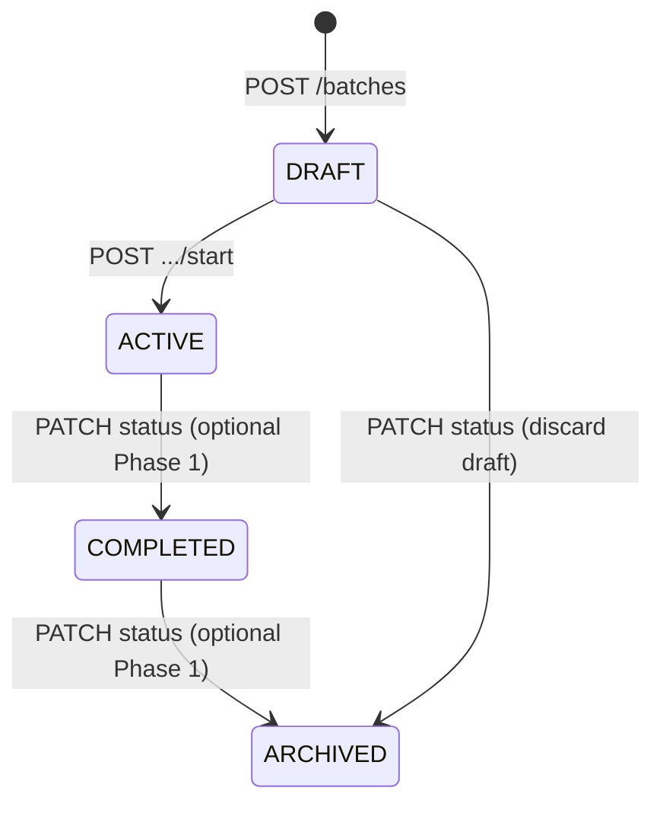

# Cattle Fattening V1 — Phase 1: Batch Start (Plan Only)

**Status:** Architecture plan — **no implementation**  
**Date:** 2026-05-23  
**Scope:** Create batch → add existing animals → start fattening (ACTIVE)  
**Out of scope (later phases):** Weight history, growth/ADG, ROI dashboard, Qurbani calculators, sale records, feed ration AI, web farmer UI

**Related docs:** [CATTLE_FATTENING_IMPLEMENTATION_AUDIT.md](../audit/CATTLE_FATTENING_IMPLEMENTATION_AUDIT.md), [APP_FLOW.md](../uiux/APP_FLOW.md) §11, [ERD.md](../database/ERD.md) §15

---

## 1. Goals & constraints

### 1.1 User flow (Phase 1)

```
Farm (select / active farm)
  → Fattening hub (per farm)
    → Create Batch (DRAFT)
      → Select Existing Animals (multi-select)
        → Start Batch (DRAFT → ACTIVE)
```

### 1.2 Product rules

| Rule | Enforcement |
|------|-------------|
| Animal can exist without any fattening batch | Default — no column on `AnimalProfile` |
| One animal → **at most one ACTIVE** fattening batch | DB + API on start / add-members |
| One batch → many animals | Junction table `FatteningBatchAnimal` |
| Batch belongs to a farm | `FatteningBatch.farmId` (string key, see §3.2) |
| Do **not** redesign Animal module | Membership via junction only; optional read-only badge on animal detail |

### 1.3 Explicit non-goals (Phase 1)

- Do **not** implement `/api/mobile/batches` for generic Hive groups (`lib/features/batches`) — fattening uses a **separate** API namespace.
- Do **not** add fattening fields to `AnimalProfile` (no `fatteningBatchId`, no `targetWeightKg` on animal row).
- Do **not** migrate or merge local `AnimalBatch` data into fattening batches.
- Do **not** link `FeedRecord.batchId` (free-text) to `FatteningBatch` in Phase 1 — document follow-up only.

---

## 2. Domain model

### 2.1 Batch entity (server source of truth)

| Field | Type | Notes |
|-------|------|-------|
| `id` | `String` (cuid) | PK |
| `customerId` | `String` | FK → `CustomerProfile`; all queries scoped here |
| `farmId` | `String` | Stable farm key (§3.2); indexed |
| `name` | `String` | User label, e.g. "Qurbani 2026" |
| `goal` | `String?` | Free text or enum later; Phase 1: optional string, max 500 |
| `startDate` | `DateTime` @db.Date | Set on **Start**; required when `status = ACTIVE` |
| `targetDate` | `DateTime?` @db.Date | Optional target (market / Eid) |
| `status` | `FatteningBatchStatus` | See §2.2 |
| `createdAt` / `updatedAt` | `DateTime` | Standard audit |

**Response-only (not stored on batch row in Phase 1):** `animalIds[]`, `animalCount`, `pendingSync` (client-only).

### 2.2 Status enum

```prisma
enum FatteningBatchStatus {
  DRAFT
  ACTIVE
  COMPLETED
  ARCHIVED
}
```

| Status | Meaning | Phase 1 transitions |
|--------|---------|---------------------|
| `DRAFT` | Created; animals can be added/removed | ← create; → `ACTIVE` via start |
| `ACTIVE` | Fattening in progress | ← start; → `COMPLETED` (manual, Phase 1 optional UI) |
| `COMPLETED` | Batch closed successfully | API stub OK; minimal UI |
| `ARCHIVED` | Hidden from default lists | API stub OK; no delete of history |

**State machine (Phase 1):**



### 2.3 Membership (junction — not Animal redesign)

```prisma
model FatteningBatchAnimal {
  id        String   @id @default(cuid())
  batchId   String
  animalId  String
  joinedAt  DateTime @default(now())
  removedAt DateTime?

  batch  FatteningBatch @relation(...)
  animal AnimalProfile  @relation(...)

  @@unique([batchId, animalId])
  @@index([animalId])
}
```

- **Active membership:** `removedAt IS NULL` and parent batch `status = ACTIVE` (for constraint logic).
- **Draft membership:** `removedAt IS NULL` and batch `status = DRAFT`.
- Removing an animal from a DRAFT batch: set `removedAt` or hard-delete row (prefer soft-delete for audit).
- Historical membership remains queryable when batch is COMPLETED/ARCHIVED.

### 2.4 One ACTIVE batch per animal (critical constraint)

**Option A (recommended):** Application check in transaction on `start` and `add-animals` when target batch is or will become ACTIVE:

```sql
-- Pseudologic: reject if any other batch has ACTIVE status and shares animalId
SELECT 1 FROM "FatteningBatchAnimal" m
JOIN "FatteningBatch" b ON b.id = m."batchId"
WHERE m."animalId" = $animalId
  AND m."removedAt" IS NULL
  AND b.status = 'ACTIVE'
  AND b.id <> $currentBatchId
LIMIT 1;
```

**Option B (PostgreSQL partial unique index — add when confident):**

```sql
CREATE UNIQUE INDEX "FatteningBatchAnimal_one_active_batch_per_animal"
ON "FatteningBatchAnimal" ("animalId")
WHERE "removedAt" IS NULL
  AND EXISTS (
    SELECT 1 FROM "FatteningBatch" b
    WHERE b.id = "batchId" AND b.status = 'ACTIVE'
  );
```

> Prisma may not express partial unique with subquery cleanly — implement **Option A** in service layer first; add DB index in a follow-up migration if needed.

**Draft batches:** Multiple DRAFT memberships across batches are **allowed** (user can prepare two drafts); only **ACTIVE** is exclusive.

---

## 3. Database

### 3.1 Prisma models (add to `prisma/schema.prisma`)

New models: `FatteningBatch`, `FatteningBatchAnimal`, enum `FatteningBatchStatus`.

Relations:

- `CustomerProfile` → `fatteningBatches FatteningBatch[]`
- `AnimalProfile` → `fatteningBatchMemberships FatteningBatchAnimal[]` (relation name only; **no new columns** on `AnimalProfile`)

Indexes:

- `@@index([customerId, farmId, status])`
- `@@index([customerId, status, updatedAt])`
- `@@index([batchId])` on junction
- `@@index([animalId])` on junction

### 3.2 `farmId` contract (no `FarmProfile` table yet)

Today farms are **composite** in Flutter (`Farm.farmIdFor()` → `farm-{villageId}` or `farm-union:{unionId}`). Backend records use `farmRef` string on feed/milk/finance — same idea.

**Phase 1 rule:**

- `FatteningBatch.farmId` stores the **same string** the mobile app uses for `Farm.id`.
- API validates `farmId` is non-empty, max 200 chars, matches pattern `^farm-` (or allow `farm-unknown` for legacy).
- **No FK** to a farm table until `FarmProfile` exists (`PHASE2_DB_MAP.md` P2-10).
- List batches: `GET ?farmId=` required or strongly recommended from fattening hub.

### 3.3 Migration

| Item | Detail |
|------|--------|
| Migration name | `20260523120000_phase1_fattening_batches` (adjust timestamp at implementation) |
| Location | `pranidoctor-backend/prisma/migrations/` |
| Rollback | Drop tables `FatteningBatchAnimal`, `FatteningBatch`, drop enum |
| Data backfill | **None** — greenfield tables |
| `AnimalProfile` | **Zero ALTER** |
| `FeedRecord.batchId` | Unchanged; document Phase 2 FK or string link to `FatteningBatch.id` |

**Post-migration:**

- Regenerate Prisma client (`pranidoctor-backend`, sync `pranidoctor-web/src/generated/prisma` per repo convention).
- Update `docs/database/ERD.md` §15 — move `FatteningBatch` from placeholder to implemented cluster.

### 3.4 Seed (implementation phase — plan only)

Extend `scripts/seed/user_app_seed.ts`:

- 1–2 `FatteningBatch` per demo customer (`DRAFT` + `ACTIVE`).
- Attach 3–5 existing `CATTLE` `AnimalProfile` rows to ACTIVE batch.
- Ensure no animal appears in two ACTIVE batches.

---

## 4. API

### 4.1 Namespace (separate from generic batches)

Base path: **`/api/mobile/fattening/batches`**

Do **not** use `/api/mobile/batches` — that path is already reserved by Flutter `BatchApiPaths` for local group sync (`USER_APP_08_BATCH_REPORT.md`).

### 4.2 Auth & scoping

- All routes: `requireMobileCustomer` (same as feeds/animals).
- Every query/mutation filters by `customerId` from auth context.
- Animal IDs must belong to same `customerId` and `active = true` (unless product allows inactive — default **reject inactive**).

### 4.3 Endpoints (Phase 1)

| Method | Path | Purpose |
|--------|------|---------|
| `GET` | `/api/mobile/fattening/batches` | List by `farmId`, `status?`, pagination |
| `POST` | `/api/mobile/fattening/batches` | Create DRAFT batch |
| `GET` | `/api/mobile/fattening/batches/:id` | Detail + `animals[]` summary |
| `PATCH` | `/api/mobile/fattening/batches/:id` | Update name, goal, targetDate (DRAFT only for dates policy — see validation) |
| `POST` | `/api/mobile/fattening/batches/:id/animals` | Add existing animals (body: `animalIds[]`) |
| `DELETE` | `/api/mobile/fattening/batches/:id/animals/:animalId` | Remove from DRAFT (or soft-remove) |
| `POST` | `/api/mobile/fattening/batches/:id/start` | DRAFT → ACTIVE; sets `startDate`; enforces exclusivity |
| `PATCH` | `/api/mobile/fattening/batches/:id/status` | `COMPLETED` / `ARCHIVED` (optional Phase 1) |

**Not in Phase 1:** weight records, summary/ROI, move between batches, merge batches.

### 4.4 Backend module layout (mirror `mobile-feeds`)

```
pranidoctor-backend/src/legacy/web/
├── lib/mobile-fattening/
│   ├── schemas.ts          # zod
│   ├── fattening-service.ts
│   ├── fattening-mapper.ts
│   └── fattening-errors.ts # e.g. ANIMAL_ALREADY_IN_ACTIVE_BATCH
└── routes/mobile/fattening/batches/
    ├── route.ts            # GET, POST
    └── [id]/
        ├── route.ts        # GET, PATCH
        ├── start/route.ts
        ├── animals/route.ts
        └── animals/[animalId]/route.ts
```

Register routes in the mobile router manifest (same pattern as `routes/mobile/feeds/route.ts`).

**Web proxy (optional Phase 1):** `pranidoctor-web/src/app/api/mobile/fattening/batches/**` — only if web client needs it; mobile app can hit backend directly.

### 4.5 Request / response shapes

**Create (POST body):**

```json
{
  "farmId": "farm-clxyz...",
  "name": "Qurbani 2026",
  "goal": "Target 450kg average",
  "targetDate": "2026-06-15"
}
```

**List (GET response):**

```json
{
  "batches": [
    {
      "id": "...",
      "farmId": "farm-...",
      "name": "...",
      "goal": "...",
      "startDate": null,
      "targetDate": "2026-06-15",
      "status": "DRAFT",
      "animalCount": 0,
      "createdAt": "...",
      "updatedAt": "..."
    }
  ],
  "total": 1,
  "page": 1,
  "pageSize": 20,
  "hasMore": false
}
```

**Detail (GET `:id`):** `{ "batch": { ... }, "animals": [ { "id", "name", "animalType", "weightKg", ... } ] }`

**Start (POST `:id/start` body):**

```json
{
  "startDate": "2026-05-23"
}
```

Default `startDate` = today (customer timezone = `Asia/Dhaka` server default) if omitted.

**Error codes (HTTP 409 / 422):**

| Code | When |
|------|------|
| `ANIMAL_ALREADY_IN_ACTIVE_BATCH` | Start or add would violate one-ACTIVE rule |
| `BATCH_NOT_DRAFT` | Mutations only allowed in DRAFT |
| `BATCH_EMPTY` | Start with zero animals |
| `ANIMAL_NOT_FOUND` | ID not owned by customer |
| `FARM_ID_REQUIRED` | Missing farm scope |
| `INVALID_STATUS_TRANSITION` | e.g. ACTIVE → DRAFT |

Use `jsonOk` / `jsonError` helpers consistent with feeds module.

### 4.6 Idempotency

- `POST .../start` with `Idempotency-Key` header (optional Phase 1; align with offline outbox keys).
- `POST .../animals` dedupe `animalIds` in service layer.

---

## 5. Validation

### 5.1 Batch fields (zod)

| Field | Rules |
|-------|-------|
| `farmId` | required, trim, 1–200 chars |
| `name` | required, trim, 1–120 chars |
| `goal` | optional, trim, max 500 |
| `startDate` | ISO date; on start: not in future > 7 days (configurable); not before `createdAt` date |
| `targetDate` | optional; if set with `startDate`, must be `>= startDate` |
| `status` | enum; PATCH only allows defined transitions |

### 5.2 Animal selection

- `animalIds`: non-empty array on add; max **200** per request; each id valid cuid.
- Only `animalType = CATTLE` for Phase 1? **Recommend yes** (product: cattle fattening) — return `ANIMAL_TYPE_NOT_SUPPORTED` for others; configurable flag later.
- Reject animals already in **this** batch (active membership).
- On **start:** reject if any selected animal is in another **ACTIVE** batch.

### 5.3 Status-gated mutations

| Action | DRAFT | ACTIVE | COMPLETED | ARCHIVED |
|--------|-------|--------|-----------|----------|
| PATCH name, goal, targetDate | ✅ | name/goal only (optional) | ❌ | ❌ |
| Add/remove animals | ✅ | ❌ Phase 1 | ❌ | ❌ |
| Start | ✅ | ❌ | ❌ | ❌ |
| Complete / archive | ❌ | ✅ (optional) | ✅ | ❌ |

Phase 2 may allow add/remove on ACTIVE with movement audit — not Phase 1.

---

## 6. Flutter (pranidoctor_user)

### 6.1 New feature module (do not touch `lib/features/animals` data layer)

```
lib/features/fattening/
├── data/
│   ├── fattening_api_paths.dart
│   ├── fattening_batch_dto.dart
│   ├── fattening_validation.dart
│   ├── fattening_repository_contract.dart
│   └── fattening_repository.dart
└── presentation/
    ├── fattening_providers.dart
    ├── fattening_hub_page.dart          # per-farm list
    ├── fattening_batch_form_page.dart   # create / edit draft
    ├── fattening_animal_picker_page.dart
    ├── fattening_batch_detail_page.dart
    └── widgets/
        ├── fattening_batch_card.dart
        ├── fattening_status_chip.dart
        └── fattening_feedback.dart
```

**Reuse (read-only):**

- `AnimalRepository` / `animalListProvider` for picker source — filter client-side: not in another ACTIVE batch (API enforces on submit).
- `FarmNavigation`, `activeFarmIdProvider` for farm context.
- UI patterns from `feed`, `farm`, `batches` (loading, error, offline banner).

**Do not reuse:**

- `lib/features/batches` DTOs or routes for fattening persistence.

### 6.2 Routes (`app_routes.dart` / `app_router.dart`)

| Route | Screen |
|-------|--------|
| `/farms/:farmId/fattening` | Fattening hub (batch list) |
| `/farms/:farmId/fattening/create` | Create batch (DRAFT) |
| `/farms/:farmId/fattening/:batchId` | Batch detail |
| `/farms/:farmId/fattening/:batchId/animals` | Select existing animals |
| `/farms/:farmId/fattening/:batchId/edit` | Edit draft metadata |

Entry points:

1. **Farm detail** — new tile/chip: "Fattening" → hub.
2. **Drawer** — wire existing `drawerFatteningSection` → active farm hub or `/farms` if none.

### 6.3 Screen flow (UX)

1. **Hub:** Tabs or chips: All / Draft / Active; FAB "Create batch".
2. **Create:** name, goal, targetDate → save DRAFT → navigate to animal picker.
3. **Animal picker:** Multi-select from farm's animals (or all customer cattle); show badge if animal unavailable (in other ACTIVE batch).
4. **Detail (DRAFT):** Summary + "Add animals" + primary CTA **Start fattening** (confirm dialog).
5. **Detail (ACTIVE):** Read-only animal list; show startDate, targetDate; Phase 1: no weight charts.

### 6.4 Animal module touch (minimal)

- **Allowed:** On `animal_detail_page.dart`, optional trailing chip: "In batch: {name}" via `GET /fattening/batches?animalId=` or include `activeFatteningBatch` in animal detail API (**defer** — prefer separate lightweight query in Phase 1.1).
- **Forbidden:** New fields on `AnimalProfile` DTO, form changes, create/edit flow changes.

---

## 7. State management (Riverpod)

| Provider | Type | Responsibility |
|----------|------|----------------|
| `fatteningBatchListProvider(farmId)` | `AsyncNotifier` | Paginated list, pull-to-refresh |
| `fatteningBatchDetailProvider(batchId)` | `Family` `FutureProvider` | Detail + animals |
| `fatteningDraftProvider` | local state | Wizard: create → picker → start |
| `fatteningAnimalPickerSelectionProvider` | `StateProvider<Set<String>>` | Selected IDs |
| `fatteningRepositoryProvider` | `Provider` | DI |

**Invalidation:**

- After start / add / remove: invalidate list + detail for `farmId` / `batchId`.
- Register in `sync_invalidation.dart` when outbox drains.

**Optimistic UI (optional):**

- On create DRAFT: insert local row with `pendingSync: true` until POST succeeds — same pattern as `FarmRepository.saveOptimistic`.

---

## 8. Offline & sync

### 8.1 Strategy

Follow **feed/finance** pattern: API-first, disk cache fallback, outbox for mutations.

### 8.2 Cache keys (`local_cache_contract.dart`)

| Key | Purpose |
|-----|---------|
| `fattening_batches_list_{farmId}` | List snapshot |
| `fattening_batch_detail_{id}` | Detail + animals |
| `fattening_batch_draft_new` | Wizard draft |
| `fattening_batch_edit_draft_{id}` | Edit draft |

TTL: `LocalCacheContract.profileTtl` (24h).

### 8.3 Outbox kinds (new enum values)

| Kind | Payload | API |
|------|---------|-----|
| `fattening_batch_create` | create body + client id | `POST /fattening/batches` |
| `fattening_batch_patch` | patch body | `PATCH .../:id` |
| `fattening_batch_add_animals` | `animalIds` | `POST .../animals` |
| `fattening_batch_remove_animal` | `animalId` | `DELETE .../animals/:animalId` |
| `fattening_batch_start` | `startDate` | `POST .../start` |

`SyncCoordinator` — add drain handlers; on failure set `lastSyncError` on cached batch DTO.

### 8.4 Offline behaviour matrix

| Scenario | Behaviour |
|----------|-----------|
| Read list/detail offline | Show cache + offline banner |
| Create DRAFT offline | Queue outbox; show pending sync |
| Add animals offline | Update local detail cache; queue outbox |
| Start offline | **Block** or queue with risk — **recommend block** until online (exclusivity check needs server) |
| Conflict: animal joined another ACTIVE batch on server | Show `ANIMAL_ALREADY_IN_ACTIVE_BATCH`; refresh picker |

### 8.5 Startup warm

`AppStartup`: optional `readCachedFatteningList(activeFarmId)` non-blocking.

---

## 9. Routes summary (all platforms)

| Layer | Route |
|-------|-------|
| Flutter | `/farms/:farmId/fattening`, `/create`, `/:batchId`, `/:batchId/animals`, `/:batchId/edit` |
| Backend | `/api/mobile/fattening/batches`, `.../:id`, `.../start`, `.../animals` |
| Web admin | None Phase 1 |
| Web farmer (future) | `/farmer/farm/fattening` per SCREEN_HIERARCHY — defer |

---

## 10. Risks & mitigations

| Risk | Severity | Mitigation |
|------|----------|------------|
| **Batch split-brain** — local `AnimalBatch` vs `FatteningBatch` | High | Separate API namespace + feature folder; document in UI ("Groups" vs "Fattening") |
| **`farmId` not a DB FK** | Medium | Validate format; scope lists by `farmId`; when `FarmProfile` lands, migration maps old keys |
| **One ACTIVE constraint race** | Medium | Transaction + `SELECT FOR UPDATE` on animal rows during start; clear 409 message |
| **Multiple DRAFTs same animals** | Low | Allowed; start fails if animal already ACTIVE elsewhere |
| **CATTLE-only filter** | Low | Document; return explicit error for goats/poultry |
| **Offline start** | Medium | Disallow start offline in Phase 1 |
| **Feed `batchId` string drift** | Medium | Phase 2: set `FeedRecord.batchId = FatteningBatch.id` when logging feed from batch context |
| **Stakeholder expects full APP_FLOW §11** | High | Label Phase 1 in UI as "Batch setup"; no ROI/weight charts yet |
| **No feature flag** | Low | Optional `infra.flags.fatteningBatches` for rollout |

---

## 11. Implementation order (when approved — not part of this task)

1. Prisma migration + enum  
2. `mobile-fattening` service + routes + unit tests  
3. Seed data  
4. Flutter `fattening` feature + routes + drawer  
5. Outbox + sync  
6. Manual QA script: create → add 3 cattle → start → verify second start on same animal fails  
7. Update ERD + audit doc  

---

## 12. Acceptance criteria (Phase 1)

- [ ] User can open fattening from a farm and see batches for that `farmId`.
- [ ] User can create a DRAFT batch with name, goal, optional target date.
- [ ] User can add **existing** animals without creating new animal records.
- [ ] User can start batch → status ACTIVE, `startDate` set.
- [ ] Animal in ACTIVE batch cannot be added to another ACTIVE batch (API 409).
- [ ] Animal with no batch unchanged on `AnimalProfile`.
- [ ] `AnimalProfile` schema unchanged.
- [ ] Works online; offline read + DRAFT create queued; start requires online.

---

## 13. Open decisions (resolve before implementation)

| # | Question | Recommendation |
|---|----------|----------------|
| 1 | CATTLE-only in Phase 1? | Yes |
| 2 | Allow multiple DRAFT batches per farm? | Yes |
| 3 | `goal` free text vs enum (`QURBANI`, `MEAT`, `OTHER`)? | Free text Phase 1 |
| 4 | Localized route prefix `/fattening` vs nested under farm? | Nested under farm (matches user flow) |
| 5 | Expose `activeFatteningBatch` on `GET /animals/:id`? | Defer to Phase 1.1 |

---

*Plan only — no code changes in this deliverable.*
