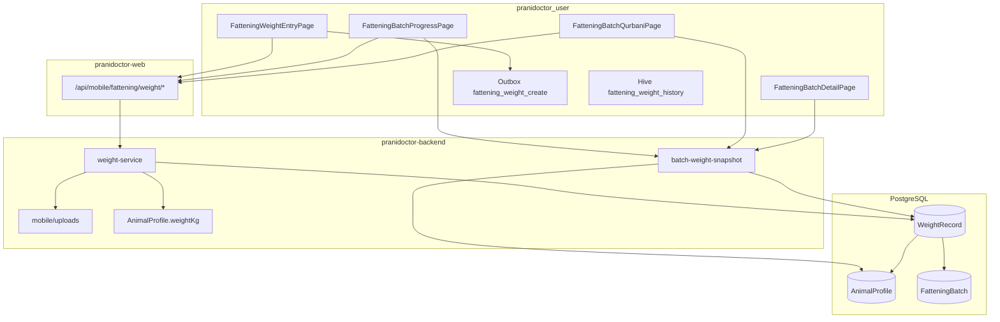

# Cattle Fattening V1 — Phase 6: Weight Tracking (Plan Only)

**Status:** Implemented  
**Date:** 2026-05-23  
**Date:** 2026-05-23  
**Scope:** Connect weight tracking fully into the fattening system (batch dashboards, Qurbani readiness, animal current weight)  
**Prerequisite modules:** Animals, Fattening Batch (Phases 1–2), Qurbani Mode (Phase 5), Feed (Phase 3), Finance (Phase 4)

**Related docs:** [PHASE2_WEIGHT_TRACKING_PLAN.md](./PHASE2_WEIGHT_TRACKING_PLAN.md) (baseline already shipped), [PHASE1_BATCH_START_PLAN.md](./PHASE1_BATCH_START_PLAN.md), [PHASE5_QURBANI_MODE_PLAN.md](./PHASE5_QURBANI_MODE_PLAN.md), [CATTLE_FATTENING_IMPLEMENTATION_AUDIT.md](../audit/CATTLE_FATTENING_IMPLEMENTATION_AUDIT.md)

---

## 1. Executive summary

Phase 6 **does not introduce a new animal model** and **does not redesign** `AnimalProfile`. It **hardens** `WeightRecord` as the **audit trail** for fattening weight, keeps **`AnimalProfile.weightKg`** as a **denormalized “current weight”** mirror of the latest record, and routes **all batch dashboards** (progress, Qurbani readiness, batch detail cattle list) through a **single server-side weight aggregation** layer.

Phase 2 already delivered a minimal `WeightRecord` (no `method`, no `photoUrl`, no per-day uniqueness, `recordedAt` as `DateTime`). Phase 6 is the **completion pass**: schema constraints, API contracts, Flutter UX, offline idempotency, analytics hooks, and explicit immutability.

| Area | Phase 2 (today) | Phase 6 (target) |
|------|-----------------|------------------|
| `WeightRecord` fields | `id`, `animalId`, `batchId`, `weightKg`, `recordedAt`, `note` | + `method`, `photoUrl`; + `recordedOn` @db.Date for day rule |
| Immutability | De facto (no PATCH/DELETE routes) | Documented + enforced (403 on mutation routes) |
| One weight / animal / day | Not enforced | DB unique + API `409` |
| `AnimalProfile.weightKg` | Updated on create in transaction | Same rule, defined as **latest record by `recordedAt`** |
| Batch dashboards | Progress + Qurbani duplicate query logic | Shared `buildBatchWeightSnapshot()` |
| Flutter entry | Date picker + kg + note | + method, optional scale photo |
| Analytics | None | ADG, batch trend endpoints (read-only) |

---

## 2. Goals and non-goals

### 2.1 Goals

1. **Single source of truth for fattening weight history:** `WeightRecord` (immutable append-only).
2. **Current weight on animal:** `AnimalProfile.weightKg` always reflects the **latest** `WeightRecord` for that animal (global latest, not batch-scoped — see §4.3).
3. **Batch UX:** Progress, Qurbani readiness, and batch detail use **only** aggregated `WeightRecord` data (with documented fallback for pre-migration animals).
4. **Operational rules:** One weigh-in per animal per calendar day **per batch**; optional photo evidence via existing upload pipeline.
5. **Offline-first:** Extend existing outbox `fattening_weight_create` with idempotency and conflict handling.

### 2.2 Non-goals (Phase 6)

- Redesigning `AnimalProfile` (no `currentWeightKg` column rename, no fattening FK on animal row).
- Weight **edit** or **delete** APIs (immutability); corrections = compensating admin tool later (out of scope).
- ADG / ML recommendations / market-price integration (analytics = read-only aggregates only).
- Web farmer fattening UI (mobile-first).
- Replacing Feed, Finance, or Qurbani modules — only **wire** them to shared weight snapshot where already weight-dependent.

---

## 3. Architecture

### 3.1 Component diagram



### 3.2 Layering (backend)

| Layer | Responsibility |
|-------|----------------|
| `routes/mobile/fattening/weight/*` | Auth, validation, HTTP codes |
| `lib/mobile-fattening/weight-schemas.ts` | Zod: create, list, analytics query |
| `lib/mobile-fattening/weight-service.ts` | Create (transaction), list history |
| `lib/mobile-fattening/batch-weight-snapshot.ts` | **New:** progress, per-animal series, batch summary for dashboards |
| `lib/mobile-fattening/qurbani-service.ts` | **Refactor:** call snapshot instead of inline Prisma weight queries |
| `lib/mobile-animals/animal-service.ts` | **Guard:** reject direct `weightKg` PATCH when policy applies (optional soft rule) |

### 3.3 Animal module boundary (do not redesign)

| Concept | Storage | Owner |
|---------|---------|--------|
| Animal identity, breed, photo | `AnimalProfile` | Animals module |
| **Current weight (display)** | `AnimalProfile.weightKg` | **Written only by** `weight-service` on successful `WeightRecord` create |
| **Weight history (fattening)** | `WeightRecord` | Fattening module |
| Batch membership | `FatteningBatchAnimal` | Fattening module |

**Naming note:** Product language may say “current weight”; the existing column is `AnimalProfile.weightKg`. Phase 6 keeps that column — no rename to `currentWeightKg`.

### 3.4 Denormalization rule

On **every successful** `POST /api/mobile/fattening/weight`:

```text
AnimalProfile.weightKg := WeightRecord.weightKg
where WeightRecord.id = latest for animalId ORDER BY recordedAt DESC, createdAt DESC
```

- **Scope:** Latest record is **per animal globally** (all batches), because `AnimalProfile` has one `weightKg`. Batch dashboards still filter by `batchId`.
- **Rationale:** Animal detail and farm-wide lists show one current weight; batch progress uses batch-filtered history.
- **Document** in API docs: logging weight in batch A updates animal card everywhere; historical batch B charts unchanged.

### 3.5 Immutability

| Operation | Allowed |
|-----------|---------|
| `POST` create | Yes |
| `GET` list / history / analytics | Yes |
| `PATCH` / `DELETE` on `WeightRecord` | **No** (no routes; DB triggers optional defense-in-depth) |
| Admin correction | Future phase; out of scope |

Audit fields `createdAt` / `updatedAt` remain; `updatedAt` should equal `createdAt` for weight rows (no updates).

### 3.6 One weight per animal per day (per batch)

**Calendar day** = `recordedOn` stored as `DATE` (UTC date of weigh-in, user-selected on mobile).

**Unique constraint:**

```prisma
@@unique([batchId, animalId, recordedOn])
```

**Conflict:** second `POST` same `(batchId, animalId, recordedOn)` → `409 DUPLICATE_WEIGHT_DAY` with existing record id in error meta.

**Offline:** Client sends `clientRecordId` / uses outbox dedupe key `batchId:animalId:recordedOn` to avoid double-submit after sync.

---

## 4. Domain model

### 4.1 `WeightRecord` (target schema)

| Field | Type | Notes |
|-------|------|-------|
| `id` | `String` @id cuid | PK |
| `customerId` | `String` | FK → `CustomerProfile`; all queries scoped |
| `animalId` | `String` | FK → `AnimalProfile` |
| `batchId` | `String` | FK → `FatteningBatch` |
| `weightKg` | `Decimal(10,3)` | > 0, max 99999 |
| `recordedAt` | `DateTime` | Exact timestamp (ordering, analytics) |
| `recordedOn` | `DateTime` @db.Date | **New:** calendar day for uniqueness |
| `method` | `WeightRecordMethod` | **New:** enum |
| `note` | `String?` | max 2000 |
| `photoUrl` | `String?` | **New:** HTTPS URL from mobile upload |
| `createdAt` | `DateTime` | Immutable row metadata |
| `updatedAt` | `DateTime` | Same as createdAt in practice |

**Indexes (existing + new):**

- `@@index([customerId, batchId, recordedOn])`
- `@@index([animalId, batchId, recordedAt])`
- `@@unique([batchId, animalId, recordedOn])`

### 4.2 `WeightRecordMethod` enum

```prisma
enum WeightRecordMethod {
  SCALE      // digital/manual scale
  TAPE       // girth tape estimate
  ESTIMATE   // visual estimate
  OTHER
}
```

Default on create: `SCALE` if omitted.

### 4.3 Progress semantics (batch dashboard)

Shared snapshot per batch:

| Metric | Rule |
|--------|------|
| **Initial** | First `WeightRecord` for `(animalId, batchId)` by `recordedAt ASC`; if none, fallback `AnimalProfile.weightKg` at first membership (document only — prefer prompting first weigh-in) |
| **Current** | Last `WeightRecord` for `(animalId, batchId)` by `recordedAt DESC`; else `AnimalProfile.weightKg` |
| **Gain** | `current − initial` when both numeric |
| **Record count** | Count of `WeightRecord` for pair |
| **Last weighed** | `recordedOn` of latest record |

**Qurbani readiness (Phase 5):** Replace inline weight queries in `qurbani-service.ts` with `batch-weight-snapshot` (same numbers, one implementation).

### 4.4 `photoUrl` pipeline

1. Flutter captures image → `POST /api/mobile/uploads` (existing).
2. Receives `downloadUrl` / id.
3. `POST /api/mobile/fattening/weight` body includes `photoUrl`.
4. Backend validates URL origin (same patterns as `AnimalProfile.photoUrl`).

No binary on weight row; URL only.

---

## 5. Migration

**Migration id (proposed):** `20260523220000_phase6_weight_hardening`

### 5.1 Steps

1. Create enum `WeightRecordMethod`.
2. Add columns `recordedOn`, `method`, `photoUrl` (nullable).
3. Backfill `recordedOn` from `recordedAt` (UTC date):  
   `UPDATE "WeightRecord" SET "recordedOn" = ("recordedAt" AT TIME ZONE 'UTC')::date;`
4. Set `method = 'SCALE'` where null.
5. Detect duplicate `(batchId, animalId, recordedOn)` rows:
   - Keep row with latest `recordedAt`; **do not delete** duplicates in Phase 6 migration — mark in migration log / one-off script for ops.
   - If duplicates exist, migration adds unique index only after dedupe script.
6. `ALTER COLUMN recordedOn SET NOT NULL`, `method SET NOT NULL` with default.
7. Add `@@unique([batchId, animalId, recordedOn])`.
8. Optional: backfill `AnimalProfile.weightKg` from latest global `WeightRecord` per animal.

### 5.2 Backfill SQL (sketch)

```sql
-- Latest weight per animal → profile
UPDATE "AnimalProfile" a
SET "weightKg" = sub.w
FROM (
  SELECT DISTINCT ON ("animalId")
    "animalId",
    "weightKg" AS w
  FROM "WeightRecord"
  ORDER BY "animalId", "recordedAt" DESC, "createdAt" DESC
) sub
WHERE a.id = sub."animalId";
```

### 5.3 Zero-downtime notes

- Add nullable columns first → backfill → NOT NULL → unique index.
- Deploy backend that writes `recordedOn` before enforcing unique (single release or two-step deploy).

---

## 6. API

Base path unchanged: `/api/mobile/fattening/weight` (proxied by `pranidoctor-web`).

### 6.1 Endpoints

| Method | Path | Purpose | Phase 2 | Phase 6 |
|--------|------|---------|---------|---------|
| `POST` | `/api/mobile/fattening/weight` | Create record | Exists | Extend body + errors |
| `GET` | `/api/mobile/fattening/weight/history` | List + progress | Exists | Progress from snapshot |
| `GET` | `/api/mobile/fattening/weight/:id` | Single record | — | **New** (read-only) |
| `GET` | `/api/mobile/fattening/batches/:id/weight-summary` | Batch dashboard card | — | **New** (optional consolidate) |
| `GET` | `/api/mobile/fattening/weight/analytics` | ADG / trends | — | **New** (read-only) |

**Explicitly not added:** `PATCH`, `DELETE` on weight.

### 6.2 `POST /api/mobile/fattening/weight`

**Request body:**

```json
{
  "animalId": "cuid",
  "batchId": "cuid",
  "weightKg": 385.5,
  "recordedAt": "2026-05-23T10:30:00.000Z",
  "recordedOn": "2026-05-23",
  "method": "SCALE",
  "note": "after morning feed",
  "photoUrl": "https://api.example.com/api/mobile/uploads/abc",
  "clientRecordId": "optional-uuid-for-idempotency"
}
```

| Field | Validation |
|-------|------------|
| `weightKg` | positive, max 99999, 3 dp |
| `recordedOn` | ISO date; must match date part of `recordedAt` (UTC) or server normalizes |
| `method` | enum, default `SCALE` |
| `photoUrl` | optional URL, max 2000 |
| `batchId` | animal must be active member; batch `ACTIVE` or `COMPLETED` |
| `clientRecordId` | optional; unique per customer if provided (idempotency table optional) |

**Responses:**

| Code | When |
|------|------|
| `201` | Created + `{ record, progress? }` |
| `404` | Batch / animal not found |
| `409` | `DUPLICATE_WEIGHT_DAY` |
| `422` | Validation |
| `403` | Batch not active / animal not in batch |

**Transaction (same as Phase 2, extended):**

1. Insert `WeightRecord`.
2. Update `AnimalProfile.weightKg`.
3. Return DTO + optional updated animal progress slice.

### 6.3 `GET /api/mobile/fattening/weight/history`

Query: `batchId` (required), `animalId?`, `from?`, `to?`, `page`, `pageSize`.

**Response:**

```json
{
  "records": [ { "id", "animalId", "batchId", "weightKg", "recordedAt", "recordedOn", "method", "note", "photoUrl", "animalName" } ],
  "progress": [ { "animalId", "animalName", "initialWeightKg", "currentWeightKg", "gainKg", "recordCount", "lastRecordedOn" } ],
  "total": 0,
  "page": 1,
  "pageSize": 50,
  "hasMore": false
}
```

`progress` computed via `batch-weight-snapshot.ts` only.

### 6.4 `GET /api/mobile/fattening/weight/analytics` (new)

Query: `batchId`, `animalId?`, `from?`, `to?`.

**Response (read-only):**

```json
{
  "batchId": "...",
  "series": [
    {
      "animalId": "...",
      "points": [
        { "recordedOn": "2026-05-01", "weightKg": "350", "gainSinceStartKg": "0" }
      ],
      "adgKgPerDay": "0.85"
    }
  ]
}
```

**ADG rule:** `(lastWeight − firstWeight) / daysBetween` on batch-filtered records; null if &lt; 2 points.

### 6.5 Consumers (refactor list)

| Consumer | Change |
|----------|--------|
| `qurbani-service.ts` | Use snapshot for animal current / progress |
| `FatteningBatchDetailPage` | Prefer progress API over raw `animal.weightKg` when batch active |
| Future batch hub | Single `weight-summary` endpoint |

---

## 7. Flutter (`pranidoctor_user`)

### 7.1 Data layer

| File | Change |
|------|--------|
| `fattening_weight_dto.dart` | Add `method`, `photoUrl`, `recordedOn`; enum `WeightRecordMethod` |
| `fattening_repository.dart` | Map new fields; handle `409` |
| `fattening_api_paths.dart` | Add `weightAnalytics` if needed |
| `local_cache_contract.dart` | Keep `fattening_weight_history:$batchId` |

### 7.2 UI

| Screen | Change |
|--------|--------|
| `FatteningWeightEntryPage` | Method dropdown; date → sets `recordedOn`; optional photo (image_picker + upload); show duplicate-day error |
| `FatteningBatchProgressPage` | Timeline list per animal (optional); show `lastRecordedOn`, method badge |
| `FatteningBatchQurbaniPage` | Invalidate on weight save; no local weight math |
| `FatteningBatchDetailPage` | Show current kg from progress snapshot when available |

### 7.3 Routes (unchanged)

- `/farms/:farmId/fattening/:batchId/weight`
- `/farms/:farmId/fattening/:batchId/progress`

### 7.4 Animal form policy

- **Do not** add fattening fields to `AnimalFormPage`.
- Optional UX: when opening animal edit, show banner “Weight is updated via fattening weigh-ins” if animal in `ACTIVE` batch.
- Animal create may still set initial `weightKg` (baseline before first `WeightRecord`).

---

## 8. Validation

### 8.1 Server (Zod)

| Rule | Error |
|------|-------|
| `weightKg` ∈ (0, 99999] | `VALIDATION_ERROR` |
| `recordedOn` valid date, not &gt; today + 1 day | `INVALID_RECORDED_ON` |
| `recordedOn` within batch `startDate`..`targetDate+grace` if batch started | `INVALID_RECORDED_ON` |
| Duplicate day | `DUPLICATE_WEIGHT_DAY` |
| `photoUrl` HTTPS optional | `VALIDATION_ERROR` |
| Animal in batch membership | `ANIMAL_NOT_IN_BATCH` |

### 8.2 Client (`fattening_validation.dart`)

| Rule | UX |
|------|-----|
| Weight required, numeric | Inline field error |
| One entry per day per animal | Pre-check cache; server `409` message |
| Photo max size | Before upload |
| `recordedOn` default today | Date picker |

### 8.3 Animal PATCH guard (recommended)

In `patchAnimalForCustomer`:

- If body includes `weightKg` and animal has ≥1 `WeightRecord` in last 90 days → **reject** with `WEIGHT_USE_FATTENING_FLOW` (or allow only if no fattening records — product choice).
- Prevents divergent `AnimalProfile.weightKg` vs history.

---

## 9. Offline

### 9.1 Existing pattern (Phase 2)

- Outbox kind: `fattening_weight_create`
- Cache key: `fattening_weight_history:{batchId}`
- Optimistic append to cached history on create

### 9.2 Phase 6 extensions

| Concern | Approach |
|---------|----------|
| **Idempotency** | Outbox payload includes `recordedOn` + `clientRecordId`; sync coordinator skips duplicate outbox keys |
| **409 on sync** | Mark outbox item failed with user-visible “already weighed today”; drop optimistic row |
| **Photo offline** | Queue photo upload before weight outbox, or store local path in outbox until upload succeeds |
| **Ordering** | Sync weight after batch exists and animal membership synced |
| **Invalidation** | On success: invalidate `fatteningWeightHistoryProvider`, `fatteningQurbaniProvider`, `fatteningBatchDetailProvider` |

### 9.3 Conflict resolution

```text
Local create (offline) → sync POST
  → 201: replace temp id, refresh cache
  → 409: remove temp record, show snackbar, keep server record in cache on next pull
  → 5xx: retry with backoff
```

---

## 10. Analytics

### 10.1 In-app (Phase 6)

| Metric | Definition |
|--------|------------|
| **ADG** | Average daily gain per animal in batch (kg/day) |
| **Batch total gain** | Sum of per-animal gains |
| **Weigh-in compliance** | % of animal-days with a record in last 7 days |
| **Days to target** | From Qurbani `targetDate` + current ADG projection (read-only hint, not AI) |

### 10.2 API

- `GET /api/mobile/fattening/weight/analytics?batchId=&...`
- Optional event logging (server): `weight_record_created` with `method`, `batchId`, `goalType` for future BI — no new tables in Phase 6 if using existing logs.

### 10.3 UI placement

- Progress page: sparkline or simple table (reuse `MilkSimpleBarChart` pattern).
- Defer full “report export” to later phase.

---

## 11. Rollback

| Step | Action |
|------|--------|
| **App rollback** | Older app ignores new fields; backend keeps nullable `method`/`photoUrl` until force-upgrade |
| **DB rollback** | Drop unique index → drop new columns → drop enum (only if no rows use `method`) |
| **Data** | Duplicates introduced during rollback window: run dedupe script before re-applying unique |
| **Animal weights** | Snapshot `AnimalProfile.weightKg` before migration; restore from backup table if backfill wrong |

**Recommended:** forward-only migration in production; rollback = hotfix forward.

---

## 12. Risk

| Risk | Severity | Mitigation |
|------|----------|------------|
| **Global vs batch current weight** | Medium | Document; animal card shows latest weigh-in across all batches |
| **Duplicate historical rows** | High | Pre-migration dedupe script before unique index |
| **Offline double weigh-in** | Medium | `recordedOn` in outbox key + server `409` |
| **Photo PII / storage cost** | Low | Reuse upload quotas; optional photo |
| **Animal form still edits weight** | Medium | PATCH guard |
| **Qurbani/Progress drift** | Medium | Single `batch-weight-snapshot` module |
| **UTC vs local date for `recordedOn`** | Medium | Store user-selected calendar date explicitly; document UTC storage |
| **Phase 2 clients without `method`** | Low | Default `SCALE` server-side |

---

## 13. Implementation order (when approved)

1. Migration + dedupe script  
2. `batch-weight-snapshot.ts` + refactor qurbani-service  
3. Extend weight-schemas / weight-service (method, photoUrl, recordedOn, 409)  
4. Analytics endpoint (read-only)  
5. Flutter DTO + entry form + error handling  
6. Offline idempotency + photo queue  
7. Seed data in `user_app_seed.ts` (weight time-series for demo batch)  
8. Update [PHASE2_WEIGHT_TRACKING_PLAN.md](./PHASE2_WEIGHT_TRACKING_PLAN.md) status → superseded by Phase 6  

---

## 14. Acceptance criteria

- [ ] `WeightRecord` has `method`, `photoUrl`, `recordedOn`; unique `(batchId, animalId, recordedOn)`.
- [ ] No API to update or delete weight records.
- [ ] `POST` weight updates `AnimalProfile.weightKg` to latest `recordedAt`.
- [ ] Duplicate same-day weigh-in returns `409`.
- [ ] Progress, Qurbani, and batch detail current/initial/gain use shared snapshot.
- [ ] Flutter entry supports method + optional photo; handles offline sync conflicts.
- [ ] Analytics endpoint returns ADG and per-animal series for a batch.
- [ ] Animal module schema unchanged (only `weightKg` write path restricted).

---

## 15. Open questions

| # | Question | Recommendation |
|---|----------|----------------|
| 1 | Is “one per day” per **batch** or global per animal? | **Per batch** (matches fattening workflow) |
| 2 | Should `AnimalProfile.weightKg` use latest **global** or latest **in active batch**? | **Global latest record** (simpler; document) |
| 3 | Allow weight on `COMPLETED` batch? | Yes (read-only dashboards); create allowed for late entry with `recordedOn` ≤ completion date |
| 4 | Compensating delete for wrong entry? | Defer; admin script only |
| 5 | Rename `weightKg` → `currentWeightKg`? | **No** (avoid animal redesign) |

---

*Plan only — no code changes in this task.*
