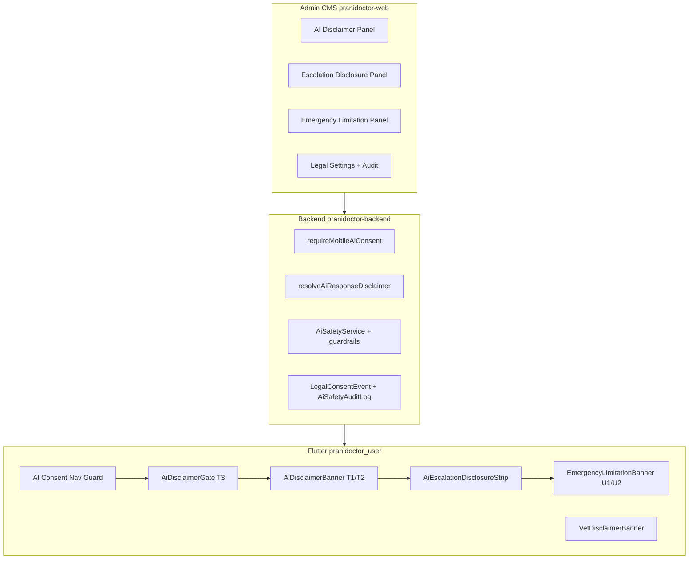
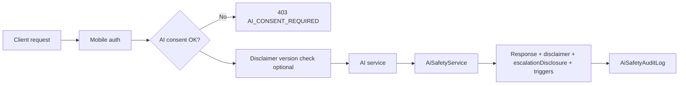
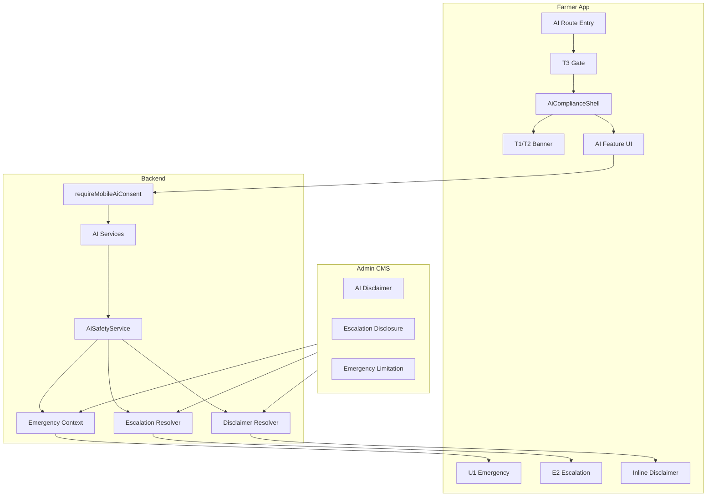

# AI Limitation Banner & Emergency Compliance Framework

**Document type:** Launch governance architecture plan (documentation only — **no implementation**)  
**Version:** 1.0.0  
**Date:** 2026-05-30  
**Status:** Planning — consolidates existing compliance tracks; defines production-ready unified framework  
**Audience:** Engineering, product, legal/compliance, launch ops, AI safety  
**Repositories:** `pranidoctor_user` (Flutter), `pranidoctor-web` (Next.js admin + public legal), `pranidoctor-backend` (API, safety, CMS)

**Related documents (implemented tracks — do not duplicate ops runbooks here)**

| Track | Plan | Operations | Verification |
|-------|------|------------|--------------|
| AI disclaimer (T1/T2/T3) | `docs/compliance/ai/ai-disclaimer-plan.md` | `AI_DISCLAIMER_OPERATIONS.md` | `AI_DISCLAIMER_VERIFICATION_REPORT.md` |
| AI escalation disclosure (E1/E2/E3) | `docs/compliance/ai/ai-escalation-disclosure-plan.md` | `AI_ESCALATION_DISCLOSURE_OPERATIONS.md` | `AI_ESCALATION_DISCLOSURE_VERIFICATION_REPORT.md` |
| Emergency limitation (U0/U1/U2/U3) | `docs/compliance/emergency/emergency-service-limitation-plan.md` | `EMERGENCY_LIMITATION_OPERATIONS.md` | `EMERGENCY_LIMITATION_VERIFICATION_REPORT.md` |
| Veterinary disclaimer (V1) | `docs/compliance/veterinary/veterinary-disclaimer-plan.md` | `VET_DISCLAIMER_OPERATIONS.md` | `VET_DISCLAIMER_VERIFICATION_REPORT.md` |
| User consent (AI processing) | `docs/compliance/consent/user-consent-flow-plan.md` | `USER_CONSENT_IMPLEMENTATION.md` | `USER_CONSENT_VERIFICATION_REPORT.md` |
| LLM kill switch | `docs/launch/ai-kill-switch-plan.md` | `pranidoctor-backend/docs/production/ai/ai-kill-switch-operations.md` | — |
| Phase 6 AI architecture | `docs/PHASE6_AI.md`, `docs/PHASE6_AI_IMPLEMENTATION.md` | — | — |
| Phase 8 smart ecosystem | `pranidoctor_user/docs/phase-8-ai-smart-ecosystem-master-plan.md` | — | — |

**Naming clarification:** `AI Technician` / `AiTechnicianProfile` = **Artificial Insemination field technicians** (human marketplace). Those workflows require **service-provider terms**, not LLM limitation banners. This framework covers **machine-assisted guidance** only.

**Design principle:** *AI assists; it never diagnoses independently; human escalation has priority; the platform is not emergency dispatch.*

---

## Executive summary

Prani Doctor exposes **generative LLM assistance** (OpenAI / Anthropic with rules fallback), **deterministic safety engines** (keyword triage, symptom graph, smart recommendations, feed rules), and **aggregated farm intelligence** to livestock farmers. Compliance infrastructure exists in **three parallel CMS tracks** (AI disclaimer, escalation disclosure, emergency limitation) plus **AI processing consent** and **veterinary disclaimer** for human clinical paths.

**Current posture (2026-05-30):** Primary flows (AI hub, chat, symptom checker, smart recommendations, farm health) have **T1/T2 banners**, **T3 acceptance gates**, and **E2 escalation strips** on core escalation paths. **Gaps remain** on secondary Phase 8 routes, voice API consent, AI triage/chat emergency U1 tier, conflicting ETA copy on instant care, and several unwired future endpoints.

**This document** defines the **unified production-ready framework** for AI limitation banners and emergency compliance — consolidating placement rules, messaging standards, controls, failure handling, and P0/P1/P2 rollout — without implementing code.

**Launch verdict:** **Conditional go** after P0 checklist completion and legal sign-off on canonical BN+EN copy. Score aggregate from verification reports: **~72/100** (disclaimer 72, escalation 74, emergency 71).

---

## 1. Current state assessment

### 1.1 AI feature inventory (all repositories)

#### 1.1.1 Generative / LLM-powered features

| Feature | User surface | Backend | LLM | Compliance today |
|---------|--------------|---------|-----|------------------|
| **AI chat** | Flutter `AiChatPage`, home quick actions, instant care | `POST /api/ai/chat` | Yes | T2 chat banner, T3 gate, per-response disclaimer, E2 on escalation |
| **AI chat v2 (RAG)** | API only (Flutter path defined, unused) | `POST /api/ai/chat/v2` | Yes + knowledge | Inherits core disclaimer resolver |
| **Voice → chat** | `AiVoiceInputPage` → chat | `POST /api/voice/stt` → chat | Yes (text) | Chat disclaimers propagate; **voice API lacks AI consent middleware** |
| **Voice session/chat** | Not wired in Flutter | `POST /api/voice/chat`, `GET /api/voice/session` | Yes | **No mobile UI; no consent gate** |
| **Farm briefing** | API only | `POST /api/ai/briefing/daily` | Yes | API disclaimer field; **no UI** |
| **Farm query** | API only | `POST /api/ai/farm-query` | Yes | API disclaimer field; **no UI** |

#### 1.1.2 Rules-based / assistive AI (no external LLM on hot path)

| Feature | User surface | Backend | Compliance today |
|---------|--------------|---------|------------------|
| **AI triage** (free-text) | Inline in chat (`TriageCard`), `AiResultPage` | `POST /api/ai/triage` | T2 advisory, API disclaimer, E2 on escalation; **missing U1/U2 emergency limitation** |
| **Symptom checker** (structured) | `SymptomCheckerPage` | `POST /api/ai/symptom-check` | T2 advisory footer, hardcoded info card, E2 + `aiEmergency` U2; **missing U1 on emergency** |
| **Smart recommendations** | `SmartRecommendationsPage` | `GET /api/ai/smart-recommendations` | T2 recommendations banner; vet mention in copy; **no E2 strip** |
| **Smart alerts** | `SmartAlertsPage` (routed, unlinked from hub) | `GET /api/ai/smart-alerts` | **No gate, no banner** |
| **Follow-up suggestions** | `FollowUpSuggestionsPage` (routed, unlinked) | `GET /api/ai/follow-ups` | **No gate, no banner** |
| **Farm health dashboard** | `FarmHealthDashboardPage` | `GET /api/ai/farm-health` | T2 advisory banner |
| **Knowledge search** | `KnowledgeSearchPage` | `GET /api/ai/knowledge/search`, `/:slug` | **No gate, no banner** (API consent only) |
| **Farm risk analytics** | Admin `AiRiskPanel` | `GET /api/ai/analytics/farm-risk` | Admin-only |
| **Feed daily ration** | `DailyRationPage` (separate module) | `GET /api/mobile/recommendations/daily` | BN footer disclaimer; **not unified with AI CMS** |

#### 1.1.3 Human escalation & adjacent clinical flows

| Feature | User surface | Backend | Compliance track |
|---------|--------------|---------|------------------|
| **Manual AI escalate** | Escalation strip CTAs | `POST /api/ai/escalate` | E2 + `AiEscalationRecord` audit |
| **Instant care sheet** | Home care action bar | Doctor discovery + `tel:` | V1 vet + U1/U2 emergency limitation |
| **Doctor booking** (incl. emergency) | `BookConsultationPage` | Service request API | V1 + U1/U2 + first-booking acceptance |
| **Treatment journal** | `TreatmentFormPage` | Treatment workflow | V1 vet disclaimer only (no AI) |
| **AI Technician booking** | Mobile AI services | `/api/mobile/ai-services/*` | Service-provider terms — **out of LLM scope** |

#### 1.1.4 Admin-controlled AI features

| Control | Admin UI (`pranidoctor-web`) | Backend | Farmer-facing effect |
|---------|-------------------------------|---------|---------------------|
| AI disclaimer CMS | `/admin/settings/ai-disclaimer` | `mobile.ai.disclaimer.config` | T1/T2/T3 copy, `enforceAcceptance` |
| AI escalation disclosure CMS | `/admin/settings/ai-escalation-disclosure` | Escalation disclosure settings | E2 contextual triggers |
| Emergency limitation CMS | `/admin/settings/emergency-limitation` | Emergency limitation settings | U1/U2/U3 contexts incl. `aiEmergency` |
| Vet disclaimer CMS | `/admin/settings/vet-disclaimer` | Vet disclaimer settings | Booking/treatment surfaces |
| Legal / consent audit | `/admin/settings/legal` | `LegalConsentEvent` | AI consent version tracking |
| LLM kill switch | `/admin/ai-ops/governance` | `AiGovernanceService` | Rules-only fallback; **no user notice today** |
| Prompt management | `/admin/ai-ops/prompts` | `AiPromptTemplate` | System prompt changes |
| Knowledge CMS | `/admin/ai-ops/knowledge` | `AiKnowledgeEntry` | RAG + knowledge search content |
| Risk monitoring | `/admin/ai-ops/risk` | `RegionalOutbreakSignal`, farm risk | Internal ops only |
| Escalation queue | Governance panel | `AiEscalationRecord` | Ops review, not user-facing |

#### 1.1.5 Species & workflow scope

| Domain | Coverage | Gap |
|--------|----------|-----|
| **Livestock AI** | Primary — `CATTLE`, `BUFFALO`, `GOAT`, `SHEEP`, `POULTRY`, etc. | Farm-scoped features require `farmRef` |
| **Pet AI** | **No dedicated pet AI workflows** — pets exist as animal filter only | Future pet symptom/triage copy must be species-aware |
| **Symptom analysis** | Structured graph + keyword triage + chat free-text | Keyword detection EN/BN; not exhaustive |
| **Treatment suggestions** | Backend refuses diagnosis/prescription language; smart recs suggest management actions | UI must never label output as treatment orders |

### 1.2 Existing compliance components (as-built)



| Layer | Component | File reference (Flutter) |
|-------|-----------|--------------------------|
| Consent gate | `nav_guard.dart` → `/settings/ai-consent` | `lib/routing/` |
| Disclaimer gate | `AiDisclaimerGate` | `lib/features/ai/presentation/widgets/ai_disclaimer_gate.dart` |
| T1/T2 banner | `AiDisclaimerBanner`, `AiDisclaimerFooter` | `ai_disclaimer_banner.dart` |
| E2 strip | `AiEscalationDisclosureStrip` | `ai_escalation_disclosure_strip.dart` |
| U1/U2 banner | `EmergencyLimitationBanner` | `lib/features/emergency_limitation/...` |
| V1 banner | `VetDisclaimerBanner` | `lib/features/vet_disclaimer/...` |

### 1.3 Backend safety & enforcement (as-built)

| Mechanism | Location | Compliance relevance |
|-----------|----------|---------------------|
| AI consent middleware | `requireMobileAiConsent` on `/api/ai/*` | Blocks AI when consent not accepted |
| Diagnosis/prescription refusal | `ai-safety.guardrails.ts` | Aligns with non-diagnostic messaging |
| Confidence threshold 0.55 | `AI_CONFIDENCE_ESCALATION_THRESHOLD` | Triggers E2 `lowConfidence` |
| Keyword emergency detection | `assessSymptomRisk()` EN/BN regex | Triggers E2 `emergency` + escalation record |
| Output sanitization | Guardrails | Generic wording — disclaimer should explain |
| Kill switch | `AiGovernanceService` | Rules-only mode — accuracy may degrade |
| Disclaimer injection | `ai-disclaimer.resolver.ts` | Every AI response carries `disclaimer` field |
| Escalation disclosure injection | Escalation resolver | `escalationDisclosureVersion` on triggered responses |
| Audit | `AiSafetyAuditLog`, `LegalConsentEvent` | Compliance evidence |

---

## 2. Gap analysis

### 2.1 Coverage gaps by surface

| Surface | Disclaimer T1/T2 | T3 gate | E2 escalation | U1/U2 emergency | Verdict |
|---------|-------------------|---------|---------------|-----------------|---------|
| AI hub | ✅ | ✅ | N/A | N/A | Pass |
| AI chat | ✅ T2 chat | ✅ | ✅ | ❌ on AI emergency | Partial |
| AI triage / result | ✅ advisory | ✅ | ✅ | ❌ U1/U2 missing | **Fail P0** |
| Symptom checker | ✅ advisory | ✅ | ✅ | ⚠️ U2 only | Partial |
| Smart recommendations | ✅ T2 recs | ✅ | ❌ | N/A | Partial |
| Farm health | ✅ T2 advisory | ✅ | ❌ high-risk scores | N/A | Partial |
| Knowledge search | ❌ | ❌ | ❌ | N/A | **Fail P0** |
| Smart alerts | ❌ | ❌ | ❌ | N/A | **Fail P1** |
| Follow-ups | ❌ | ❌ | ❌ | N/A | **Fail P1** |
| Voice STT/chat API | ❌ consent | partial via chat | inherits chat | N/A | **Fail P0** |
| Feed ration | separate BN footer | ❌ | N/A | N/A | Partial |
| Instant care ETA copy | N/A | N/A | vet only | ✅ U1 | **ETA contradicts U1** |
| Public web `/legal/disclaimer` | static EN | N/A | N/A | ❌ U3 | Partial |

### 2.2 Architectural gaps

| ID | Gap | Risk | Priority |
|----|-----|------|----------|
| G-01 | No unified **Compliance Orchestrator** — three CMS tracks wired independently | Inconsistent UX; missed combinations (AI emergency without U1) | P0 |
| G-02 | `aiEscalationDisclosureBannerProvider` (E1) **defined but unused** | Users lack persistent escalation awareness on AI hub | P1 |
| G-03 | `emergencyLimitationBannerTextProvider` (U0 platform banner) **unused** | No global emergency limitation visibility | P2 |
| G-04 | Voice routes skip `requireMobileAiConsent` | Regulatory/consent bypass | **P0** |
| G-05 | Duplicate disclosure on `AiResultPage` (page + `TriageCard`) | UX noise | P1 |
| G-06 | Duplicate `LegalConsentEvent` on disclaimer accept API | Audit quality | P1 |
| G-07 | Kill switch active — **no farmer-facing notice** | Users may receive generic rules answers without knowing LLM is off | P1 |
| G-08 | No automated compliance tests | Regression risk on launch | P0 |
| G-09 | T3 Bengali parity incomplete | BN-primary market gap | P0 |
| G-10 | Instant care ETA strings ("5–15 min") contradict emergency limitation | Legal/UX conflict | **P0** |
| G-11 | `AI_EMERGENCY_ESCALATE` audit event defined but **never emitted** | Ops/compliance blind spot | P1 |
| G-12 | `emitEmergencyDetected()` event bus hook **never called** | Missed cross-system emergency signaling | P2 |
| G-13 | Pet species not covered in AI taxonomy defaults | Future expansion risk | P2 |
| G-14 | Future endpoints (briefing, farm-query, chat/v2) lack UI compliance spec | Launch debt when wired | P1 |

### 2.3 Verification score summary

| Track | Score | Blockers for full production |
|-------|-------|------------------------------|
| AI disclaimer | 72/100 | Secondary surfaces, voice consent, BN T3, tests |
| Escalation disclosure | 74/100 | E1 unwired, secondary surfaces, E3 not in settings |
| Emergency limitation | 71/100 | AI triage/chat U1, ETA conflict, public U3 |
| **Unified framework** | **~72/100** | P0 checklist below |

---

## 3. Compliance architecture

### 3.1 Unified compliance model

Three **content tracks** remain separate in CMS (legal maintainability) but are orchestrated by a single **Compliance Context** at runtime:

```
ComplianceContext {
  surface: AiComplianceSurface     // e.g. AI_CHAT, SYMPTOM_CHECK, AI_TRIAGE_RESULT
  species?: LivestockSpecies
  triggers: {
    aiDisclaimerFeature: CHAT | RECOMMENDATIONS | ADVISORY
    escalationTrigger?: EMERGENCY | HIGH | LOW_CONFIDENCE | ...
    emergencyContext?: AI_EMERGENCY | INSTANT_CARE | ...
    vetContext?: BOOKING_EMERGENCY | ...
  }
  enforcement: {
    requireAiConsent: boolean
    requireDisclaimerAcceptance: boolean
    requireEmergencyAcceptance: boolean   // first emergency book only
  }
}
```

**Rendering stack (priority order on screen):**

1. **U1 urgent banner** (if emergency context + trigger) — blocks dismissal
2. **E2 escalation strip** (if escalation trigger) — action CTAs
3. **T1/T2 persistent banner** (always on AI surfaces)
4. **Inline per-response disclaimer** (assistant messages, result cards)
5. **V1 vet banner** (when entering human clinical booking from AI CTA)

### 3.2 Tier reference (cross-track)

| Tier | Track | Purpose | Persistence |
|------|-------|---------|-------------|
| **T1** | AI disclaimer | Persistent banner all AI screens | Session-visible |
| **T2** | AI disclaimer | Contextual (chat / recs / advisory) | Session-visible |
| **T3** | AI disclaimer | First-use acceptance modal | Stored `aiAcceptedVersion` |
| **E1** | Escalation | Persistent escalation awareness on AI hub | Session-visible |
| **E2** | Escalation | Contextual strip on triggered responses | Per event |
| **E3** | Escalation | Full policy (settings / legal link) | On demand |
| **U0** | Emergency | Platform-wide limitation banner | Optional global |
| **U1** | Emergency | Urgent non-dismissible | On emergency paths |
| **U2** | Emergency | Contextual limitation | Per surface |
| **U3** | Emergency | Full limitation policy | Public legal + settings |
| **V1** | Veterinary | Clinical service disclaimer | Booking/treatment |

### 3.3 Server-side enforcement layers



**Mandatory server fields on every AI response:**

| Field | Required when |
|-------|---------------|
| `disclaimer` | Always (localized EN/BN) |
| `disclaimerVersion` | Always |
| `escalationTrigger` | When escalationRecommended / escalationRequired / refused |
| `escalationDisclosure` | When trigger present |
| `escalationDisclosureVersion` | When trigger present |
| `emergency` | Triage/symptom when keyword match |
| `confidence` | Chat when LLM used |

### 3.4 Compliance service (target — not implemented)

A **`CompliancePresentationService`** (client) and **`ComplianceResolver`** (server) should:

- Map `AiComplianceSurface` → required banners/modals
- Fail closed: if CMS fetch fails, use **cached snapshot** then **hardcoded fallback** (see §F)
- Emit **`ComplianceRenderEvent`** for audit (surface, tiers shown, versions, trigger)
- Coordinate acceptance: T3 before first AI use; U2 acceptance before first emergency book (existing)

---

## A. AI disclosure requirements

### A.1 Banner placement matrix

| Surface | T1 | T2 variant | T3 gate | Inline disclaimer | Modal |
|---------|----|------------|---------|-------------------|-------|
| **AI chat** | ✅ | `contextual.chat` | ✅ first use | ✅ every assistant message | T3 on first entry |
| **AI diagnosis assistance** (chat asking "what disease") | ✅ | `contextual.chat` | ✅ | ✅ + refusal message if policy blocks | — |
| **AI triage** (inline + result page) | ✅ | `contextual.advisory` | ✅ | ✅ on `TriageCard` | T3 via gate |
| **AI recommendations** (smart recs) | ✅ | `contextual.recommendations` | ✅ | ✅ on each card footer | — |
| **AI treatment suggestions** (refused or management recs) | ✅ | `contextual.advisory` | ✅ | ✅ "not a treatment plan" | — |
| **AI-generated content** (LLM chat, briefing, farm query) | ✅ | per feature | ✅ | ✅ per message/block | T3 |
| **AI reports** (farm health, risk scores) | ✅ | `contextual.advisory` | ✅ | ✅ below scores — "heuristic not clinical" | — |
| **AI summaries** (briefing, farm query when wired) | ✅ | `contextual.advisory` | ✅ | ✅ top of summary | — |
| **Knowledge search** | ✅ T1 | `contextual.advisory` | ✅ gate | ✅ on article view | T3 |
| **Smart alerts / follow-ups** | ✅ T1 | `contextual.advisory` | ✅ gate | ✅ on each item | — |
| **Voice input** | ✅ inherit chat | `contextual.chat` | ✅ before STT | ✅ after transcription preview | — |
| **Feed ration** (adjacent) | ⚠️ unify | `contextual.recommendations` | optional | ✅ footer | — |

### A.2 Entry-point coverage

Every path into AI must pass **consent → disclaimer gate → banner**:

| Entry point | Must gate? |
|-------------|------------|
| Drawer → `/ai` | ✅ |
| Home AI section | ✅ |
| Home care bar → AI Doctor | ✅ |
| Instant care → AI path | ✅ + V1/U2 if emergency framing |
| Universal search → AI Assistant | ✅ |
| Deep link `/home/ai-chat` | ✅ |
| Phase 8 routes (`/ai/knowledge`, etc.) | ✅ **currently missing on some** |
| Voice button on AI home | ✅ **currently missing** |

### A.3 Admin-controlled disclosure

All farmer-visible AI limitation text must be **CMS-managed** (`/admin/settings/ai-disclaimer`) with:

- `contentVersion` (display refresh)
- `consentVersion` (re-prompt trigger)
- `enforceAcceptance` (server block)
- BN + EN parity for T1, T2, T3

Static l10n strings (`aiDisclaimer` in `bn.json` / `en.json`) are **fallback only** when CMS unavailable.

---

## B. Banner standards

### B.1 Persistent banner requirements (T1)

| Requirement | Standard |
|-------------|----------|
| Visibility | Always visible at top of AI surface; does not scroll away permanently (sticky or re-pin on scroll) |
| Dismissal | **Non-dismissible** on first session; optional collapse after T3 acceptance with "View AI limitations" expand |
| Content | CMS `banner.en` / `banner.bn` — max ~2 lines mobile |
| Styling | `MaterialBanner` or equivalent; neutral info color — not error red (reserve red for U1/E2 emergency) |
| Accessibility | Screen reader announces on enter route; minimum 14sp body |

**Approved fallback EN (if CMS down):**  
*"Prani Doctor AI provides general livestock guidance only. It cannot examine your animal and may be wrong or incomplete."*

### B.2 Inline warning requirements

| Context | Placement | Content source |
|---------|-----------|----------------|
| Assistant chat bubble | Below message body, above actions | API `disclaimer` field |
| Triage card | Footer of card | API `disclaimer` + static advisory |
| Symptom differential row | Adjacent to each condition | Per-item "educational only" |
| Smart recommendation card | Footer | API or CMS contextual.recs |
| Farm health score | Below score widget | "Heuristic estimate — not a clinical assessment" |
| Feed ration result | Page footer | Unified CMS or existing BN default |
| Refusal responses | Replace assistant body preamble | Match guardrail vocabulary |

**Inline rules:**

- Minimum 12sp; contrast WCAG AA
- Never use green checkmarks implying confirmed diagnosis
- Urgency labels (LOW/MEDIUM/HIGH) must include subtext: *"urgency ≠ diagnosis"*

### B.3 Modal warning requirements (T3)

| Requirement | Standard |
|-------------|----------|
| Trigger | First AI use when `enforceAcceptance` && version mismatch |
| Content | CMS `consentTitle` + `consentContent` (full limitations, non-diagnosis, data use summary) |
| Actions | Primary: "I understand" (records accept); Secondary: "Read full policy" → settings/legal |
| Blocking | Cannot send chat / run symptom check until accepted |
| Re-show | On `consentVersion` bump only |
| BN parity | **Mandatory for launch** — block go-live if T3 BN empty |

### B.4 Emergency warning requirements (U1 + E2)

| Tier | When | Visual | Dismissible | CTAs |
|------|------|--------|-------------|------|
| **U1 urgent** | `emergency: true` OR user on emergency book path | Red banner, icon | **No** | "Call vet now", "Find nearest vet" |
| **U2 contextual** | AI emergency result, instant care, discovery emergency | Orange/tertiary card | Yes with acknowledgment | Link to full U3 |
| **E2 emergency trigger** | Same as AI emergency detection | Red strip below U1 | No | Find vet (primary), platform review, support (with supportVsVet note) |

**Stacking order when multiple apply:** U1 → E2 → T1 → inline disclaimer

**Prohibited:** Showing ETA promises ("5–15 min response") on same screen as U1/U2 without explicit "not guaranteed" qualifier.

---

## C. Emergency compliance rules

### C.1 Emergency symptom triggers (rules engine — `assessSymptomRisk`)

| Category | EN patterns (sample) | BN patterns (sample) | System action |
|----------|---------------------|----------------------|---------------|
| **EMERGENCY** | not breathing, cannot stand, severe bleeding, unconscious, convulsion, seizure, bloat | শ্বাস নেই, রক্ত পড়, অচেতন | `emergency: true`, bucket HIGH, urgency 10, E2 + U1 + escalation record `EMERGENCY_SYMPTOM` |
| **HIGH** | high fever, bloody, collapse | জ্বর অত্যন্ত, পড় যাচ্ছে | E2 `high`, urgency 8, escalation record `HIGH_RISK` |
| **MEDIUM** | ≥3 symptoms | — | Advisory urgency only |
| **LOW** | default | — | Standard disclaimer only |

**Compliance rule:** Any `emergency: true` response **must** render U1 + E2 + inline non-diagnostic disclaimer. **Currently failing on AI triage/chat result paths.**

### C.2 High-risk livestock situations

| Situation | Detection | Disclosure |
|-----------|-----------|--------------|
| Herd outbreak signal | Admin `RegionalOutbreakSignal`, farm risk API | Farm health banner + advisory; link to vet |
| High farm risk score | `FarmRiskSnapshot` threshold | Inline "elevated risk — consult vet"; future E2 `high` |
| Pregnancy/complication keywords | Smart rec rules, chat guardrails | Advisory + vet CTA |
| Mass mortality / not eating herd-wide | Chat/triage keywords (extend list) | Emergency trigger review — **P1 content update** |

### C.3 Critical pet situations

**Current:** No pet-specific AI. **Future rule:** When pet species enabled, apply same emergency keyword sets plus species-specific red flags (e.g., urinary blockage cats, GDV dogs) via `AiSymptomNode.redFlag`.

### C.4 Immediate veterinary escalation triggers

| Trigger | Backend | UI requirement |
|---------|---------|------------------|
| `EMERGENCY_SYMPTOM` | Auto escalation record | U1 + E2 + Find vet CTA |
| `HIGH_RISK` | Auto escalation record | E2 `high` |
| `LOW_CONFIDENCE` (<0.55) | Auto escalation record | E2 `lowConfidence` |
| `POLICY_REFUSAL` | Refusal + optional record | E2 `policyRefusal` |
| `DOCTOR_REQUEST` | Manual `POST /api/ai/escalate` | E2 `humanReview` |
| User taps emergency in instant care | Human path | U1 + V1 — not AI track |

### C.5 Human safety risks

| Risk | Rule |
|------|------|
| Zoonotic concern mentioned | Chat guardrail + disclaimer: "consult physician and veterinarian" |
| User injury during handling | Redirect to human medical services — **P2 copy** |
| Aggressive animal | Safety disclaimer in knowledge content; no AI behavioral guarantee |

### C.6 Emergency booking server guard

Existing: `assertEmergencyLimitationForEmergencyBooking` — first `EMERGENCY_DOCTOR` book requires U2 acceptance recorded. **Maintain.** Extend audit to emit `AI_EMERGENCY_ESCALATE` when AI path leads to emergency book within same session (target).

---

## D. User messaging standards

Legal counsel must approve final copy. Below defines **required themes** and **draft approved wording** for engineering alignment.

### D.1 AI limitations (T1/T3 theme)

**EN (banner):**  
*"Prani Doctor AI provides general livestock guidance. It cannot see or examine your animal, run tests, or verify what you report. Answers may be wrong, incomplete, or outdated."*

**BN (banner):**  
*"প্রাণী ডাক্তর AI সাধারণ পশুপালন নির্দেশিকা দেয়। এটি আপনার পশুকে দেখতে বা পরীক্ষা করতে পারে না। উত্তর ভুল, অসম্পূর্ণ বা পুরোনো হতে পারে।"*

### D.2 Veterinary responsibility

**EN:**  
*"Only a licensed veterinarian who examines your animal can diagnose disease or prescribe treatment. You are responsible for seeking professional care when symptoms are serious or worsening."*

**BN:**  
*"শুধুমাত্র লাইসেন্সপ্রাপ্ত প্রাণী চিকিৎসক, যিনি পশু পরীক্ষা করেন, রোগ নির্ণয় বা চিকিৎসা নির্ধারণ করতে পারেন। গুরুতর লক্ষণে পেশাদার সহায়তা নেওয়ার দায়িত্ব আপনার।"*

### D.3 Emergency escalation

**EN (E2/U1):**  
*"This may be an emergency. Prani Doctor does not dispatch emergency services. Contact a veterinarian or emergency clinic immediately. If the animal cannot breathe, is unconscious, or bleeding severely, do not wait for an app response."*

**BN:**  
*"এটি জরুরি হতে পারে। প্রাণী ডাক্তর জরুরি সেবা পাঠায় না। অবিলম্বে প্রাণী চিকিৎসক বা জরুরি কlinic-এ যোগাযোগ করুন। শ্বাস বন্ধ, অচেতন বা তীব্র রক্তপাত হলে অ্যাপের উত্তরের জন্য অপেক্ষা করবেন না।"*

### D.4 Medical disclaimer (non-diagnostic)

**EN:**  
*"This is educational guidance only — not a veterinary diagnosis, prescription, or treatment plan. Possible conditions listed are suggestions, not confirmed disease."*

**BN:**  
*"এটি শুধু শিক্ষামূলক নির্দেশিকা — প্রাঞী চিকিৎসা নির্ণয়, প্রেসক্রিপশন বা চিকিৎসা পরিকল্পনা নয়। তালিকাভুক্ত সম্ভাব্য অবস্থা পরামর্শ মাত্র, নিশ্চিত রোগ নয়।"*

### D.5 Confidence limitations

**EN:**  
*"Confidence scores reflect system estimates, not medical certainty. Low confidence means the AI is unsure — consult a veterinarian rather than relying on this answer."*

**BN:**  
*"আত্মবিশ্বাসের স্কোর চিকিৎসা নিশ্চয়তা নয়। কম আত্মবিশ্বাস মানে AI নিশ্চিত নয় — এই উত্তরের উপর নির্ভর না করে চিকিৎসকের পরামর্শ নিন।"*

### D.6 Support vs veterinarian (E2 `supportVsVet`)

**EN:**  
*"Platform support helps with app issues — they cannot provide veterinary advice or emergency dispatch."*

### D.7 Prohibited phrasing (QA gate)

- "Your animal has [disease]"
- "Diagnosis:", "Prescription:", "Take this medicine"
- "Guaranteed", "100% accurate", "AI veterinarian"
- Response time promises without "typical, not guaranteed" on emergency paths

### D.8 Vocabulary alignment

Backend refusal strings in `ai-safety.guardrails.ts` must use the **same legal terms** as CMS copy (diagnosis, prescription, educational guidance).

---

## E. Compliance controls

### E.1 Feature coverage requirements

| Control | Requirement |
|---------|-------------|
| **100% AI route gate** | Every `/api/ai/*` and `/api/voice/*` path requires `requireMobileAiConsent` when enforcement on |
| **100% AI UI gate** | Every Flutter AI route wrapped in `AiDisclaimerGate` + T1/T2 |
| **100% response disclaimer** | Server attaches `disclaimer` — client must render; missing render = compliance defect |
| **Escalation parity** | Every `escalationTrigger` in API → E2 strip in UI |
| **Emergency parity** | Every `emergency: true` → U1 + E2 |
| **Kill switch notice** | When `llmDisabled`, optional banner: "AI answers may be generic (limited mode)" — **P1** |

### E.2 Visibility requirements

| Requirement | Verification method |
|-------------|---------------------|
| Banner visible before first message sent | E2E test / manual QA checklist |
| T3 blocks interaction | Attempt API call without accept → 403 |
| U1 visible without scrolling on emergency | Screenshot audit |
| BN locale shows BN copy | Locale matrix QA |
| Public legal page lists all AI features | Content review vs §1.1 inventory |

### E.3 Logging requirements

| Event | Store | Fields |
|-------|-------|--------|
| AI disclaimer accept | `LegalConsentEvent` | userId, version, surface, IP, UA |
| AI consent accept | `LegalConsentEvent` | consentType `AI_PROCESSING` |
| Emergency limitation accept | `LegalConsentEvent` | surface, version |
| AI safety action | `AiSafetyAuditLog` | action, sessionId, trigger, species |
| Escalation created | `AiEscalationRecord` + audit | reason, urgency, disclosure version |
| Compliance render (target) | New `ComplianceRenderEvent` or extend safety audit | surface, tiers shown, versions |
| Kill switch toggle | `AiGovernanceStateHistory` | actor, reason, version |

**Fix required:** Dedupe duplicate accept audit on `POST …/ai-disclaimer/accept`.

### E.4 Audit requirements

| Audience | Access | Retention |
|----------|--------|-----------|
| Compliance admin | `/admin/settings/legal` — consent events | Per `DATA_RETENTION.md` |
| AI ops | `/admin/ai-ops/governance` — escalations | 24mo minimum |
| Safety review | `/api/admin/ai-ops/audit` — `AiSafetyAuditLog` | 24mo minimum |
| Launch gate | Export acceptance rate by version | Pre go-live |

**Launch criteria:** ≥99% of AI API calls from users with current `aiAcceptedVersion` when enforcement on (allow 1% cache lag during version rollout window).

---

## F. Failure handling

### F.1 Banner fails to load (CMS/network)

| Step | Behavior |
|------|----------|
| 1 | Use cached snapshot (`ai_disclaimer_snapshot`, `ai_escalation_disclosure_snapshot`, `emergency_limitation_snapshot`) |
| 2 | If cache empty, use **hardcoded fallback** strings (§D.1–D.5) |
| 3 | Log `COMPLIANCE_FALLBACK_RENDER` to client analytics + server on next API call |
| 4 | **Do not block AI** if only banner fetch failed but T3 already accepted — show fallback banner |
| 5 | **Block AI** if T3 acceptance required and cannot verify status — fail closed |

### F.2 Compliance service unavailable

| Scenario | Behavior |
|----------|----------|
| Legal API down, user previously accepted | Allow AI with fallback banners |
| Legal API down, acceptance unknown | Block AI routes; show offline message |
| Admin CMS down | Farmers use cached copy; ops alert |
| Escalation disclosure unavailable | Use E2 fallback defaults; **never suppress** escalation CTAs |

### F.3 AI output generated without disclaimer

| Layer | Behavior |
|-------|----------|
| **Server** | `resolveAiResponseDisclaimer()` must always attach — unit test gate |
| **Client** | If `disclaimer` null/empty, render fallback inline disclaimer + report to crash analytics |
| **Ops** | Alert if >0.1% responses missing disclaimer field (monitoring plan) |
| **Kill switch** | Rules provider must also attach disclaimer |

### F.4 Escalation/emergency without UI disclosure

| Scenario | Behavior |
|----------|----------|
| API returns `emergency: true` | Client **must** render U1+E2 even if CMS strip fails (hardcoded emergency block) |
| Render failure detected | Log CRITICAL client event; ops dashboard |

---

## G. Rollout strategy

### G.1 P0 — Mandatory before production launch

| ID | Item | Owner |
|----|------|-------|
| P0-01 | Wire U1 + U2 on **AI triage** (`TriageCard`, `AiResultPage`) when `emergency: true` | Mobile |
| P0-02 | Wire U1 on **AI chat** when assistant returns emergency trigger | Mobile |
| P0-03 | Add `requireMobileAiConsent` to **all `/api/voice/*`** routes | Backend |
| P0-04 | Gate **knowledge search** with `AiDisclaimerGate` + T1/T2 advisory | Mobile |
| P0-05 | Complete **T3 Bengali** CMS content + QA | Legal + Admin |
| P0-06 | Fix **instant care ETA** strings to align with U1 non-guarantee | Mobile l10n |
| P0-07 | Automated tests: consent block, disclaimer field presence, emergency UI | QA + Backend |
| P0-08 | Legal sign-off registry entry for unified framework | Legal |
| P0-09 | Dedupe disclaimer accept audit writes | Backend |
| P0-10 | Voice button on AI home respects consent + disclaimer gate | Mobile |

### G.2 P1 — Recommended within 30 days post-launch

| ID | Item |
|----|------|
| P1-01 | Gate smart alerts + follow-ups with disclaimer framework |
| P1-02 | Wire E1 escalation banner on AI hub (`aiEscalationDisclosureBannerProvider`) |
| P1-03 | E2 strips on farm health when risk > threshold |
| P1-04 | Smart recommendations escalation framing (vet CTA + E2 when HIGH priority) |
| P1-05 | Kill switch user-facing "limited mode" notice |
| P1-06 | E3 full escalation policy link in AI settings |
| P1-07 | U3 emergency limitation section on public `/legal` |
| P1-08 | Emit `AI_EMERGENCY_ESCALATE` audit when AI emergency → book flow |
| P1-09 | Remove duplicate disclosure on `AiResultPage` |
| P1-10 | Unify feed ration disclaimer with AI CMS |
| P1-11 | Compliance render logging (client + server) |
| P1-12 | Admin metadata in consent audit list (`surface` field) |

### G.3 P2 — Future compliance enhancements

| ID | Item |
|----|------|
| P2-01 | U0 platform-wide emergency limitation banner |
| P2-02 | Pet species AI workflows + species-specific emergency triggers |
| P2-03 | `emitEmergencyDetected()` cross-system event bus |
| P2-04 | Per-feature kill switch banners |
| P2-05 | Human-in-the-loop reviewed AI responses (explicit labeling) |
| P2-06 | Web farmer portal AI (if launched) — full framework port |
| P2-07 | Compliance dashboard (acceptance rates, fallback renders, missing disclaimer alerts) |
| P2-08 | chat/v2, briefing, farm-query UI with pre-built compliance spec |

---

## 4. Required screens & components

### 4.1 Flutter (`pranidoctor_user`) — modify/create

| Component | Action | Surfaces |
|-----------|--------|----------|
| `AiDisclaimerGate` | Extend surface enum | knowledge, alerts, follow-ups, voice |
| `AiDisclaimerBanner` | Ensure sticky behavior | all AI routes |
| `AiEscalationDisclosureStrip` | Add to triage/chat emergency | triage, chat, result |
| `EmergencyLimitationBanner` | Wire U1 on AI triage/chat emergency | **P0 gap** |
| `AiComplianceShell` (new) | Orchestrate T1+U1+E2 stack | all AI pages |
| `AiSettingsPage` | Add links to E3, U3 full policies | settings |
| `KnowledgeSearchPage` | Wrap gate + banner + article disclaimer | **P0** |
| `SmartAlertsPage` | Wrap gate + banner | P1 |
| `FollowUpSuggestionsPage` | Wrap gate + banner | P1 |
| `AiVoiceInputPage` | Pre-STT disclaimer + consent check | **P0** |
| `instant_care_sheet.dart` | Fix ETA copy | **P0** |
| `home_care_action_bar.dart` | Ensure voice/chat gates | P0 |

### 4.2 Admin web (`pranidoctor-web`) — modify/create

| Component | Action |
|-----------|--------|
| `AiDisclaimerAdminPanel` | BN T3 validation warning if empty |
| `EmergencyLimitationAdminPanel` | Preview `aiEmergency` + triage context |
| `AiEscalationDisclosureAdminPanel` | Preview all triggers |
| `AdminLegalSettingsForm` | Show consent `metadata.surface` |
| `/legal/disclaimer` | Add AI feature list + U3 summary + BN |
| Compliance dashboard (new) | P2 — acceptance/fallback metrics |

### 4.3 Public web

| Page | Action |
|------|--------|
| `/legal/disclaimer` | Enumerate all AI features; link to privacy AI section |
| `/privacy` | Already mentions OpenAI/Anthropic — cross-link limitations |

---

## 5. Required backend support

### 5.1 Middleware & guards

| Change | Priority |
|--------|----------|
| Add `requireMobileAiConsent` to `/api/voice/*` | P0 |
| Optional middleware: reject AI responses without disclaimer (assert in dev/staging) | P1 |
| `assertEmergencyLimitationForEmergencyBooking` — maintain | Done |

### 5.2 API response contract

Ensure all AI endpoints return consistent compliance envelope:

```typescript
interface AiComplianceEnvelope {
  disclaimer: LocalizedString;
  disclaimerVersion: string;
  escalationTrigger?: EscalationTrigger;
  escalationDisclosure?: LocalizedString;
  escalationDisclosureVersion?: string;
  emergency?: boolean;
  confidence?: number;
}
```

**Endpoints:** chat, chat/v2, triage, symptom-check, smart-recommendations, farm-health, briefing, farm-query, voice/chat.

### 5.3 Compliance resolver (target)

| Capability | Priority |
|------------|----------|
| Central `ComplianceResolver.forSurface(surface, triggers)` | P1 |
| Version headers `X-AI-Disclaimer-Version`, `X-Escalation-Disclosure-Version` | P2 |
| `GET /api/mobile/legal/compliance-bundle` — single fetch for all tracks | P1 |

### 5.4 Audit enhancements

| Change | Priority |
|--------|----------|
| Dedupe accept audit | P0 |
| Emit `AI_EMERGENCY_ESCALATE` | P1 |
| `COMPLIANCE_FALLBACK` safety audit action | P1 |

### 5.5 Monitoring (tie to `production-monitoring-plan.md`)

| Alert | Threshold |
|-------|-----------|
| AI responses missing disclaimer | >0.1% / 5min |
| Escalation without disclosure version | any |
| Emergency symptom backlog unreviewed | OPS-ESC-02 existing |
| Consent 403 spike | >5% of AI traffic |

---

## 6. Required admin controls

| Control | Must have before launch | Notes |
|---------|-------------------------|-------|
| AI disclaimer CMS with enforce toggle | ✅ Implemented | Verify BN T3 |
| Escalation disclosure CMS | ✅ Implemented | Wire E1 consumer |
| Emergency limitation CMS | ✅ Implemented | Wire AI triage U1 |
| Legal consent audit | ✅ Implemented | Fix metadata display |
| LLM kill switch with audit | ✅ Implemented | Add user notice P1 |
| Prompt/knowledge publish workflow | ✅ Implemented | Ops runbook |
| Escalation queue review SLA | ✅ Implemented | 30min default emergency |
| **Compliance launch checklist sign-off** | ❌ Create | This document §7 |
| **Version bump runbook** | ✅ In operations docs | Coordinate T3 re-prompt |

---

## 7. Implementation checklist

### 7.1 Pre-launch gate (all must pass)

- [ ] **Legal:** BN+EN copy approved for T1/T2/T3, E2 triggers, U1/U2 AI contexts
- [ ] **P0-01–P0-10** complete (§G.1)
- [ ] **QA matrix:** Every row in §A.1 marked Pass
- [ ] **API audit:** 100% AI endpoints return `disclaimer` in staging sample (n≥1000)
- [ ] **Consent enforcement:** Unconsented user receives 403 on all AI + voice paths
- [ ] **Emergency drill:** Simulated `emergency: true` shows U1+E2 on triage, chat, symptom
- [ ] **Instant care:** No conflicting ETA without disclaimer qualifier
- [ ] **Admin:** Ops trained on CMS version bump + kill switch (`AI_DISCLAIMER_OPERATIONS.md`, kill switch runbook)
- [ ] **Monitoring:** Alerts configured for missing disclaimer
- [ ] **Rollback:** Kill switch tested in staging multi-replica (`ai-kill-switch-plan.md`)

### 7.2 Surface QA matrix (sign-off per row)

| Surface | T1 | T2 | T3 | Inline | E2 | U1 | Signed |
|---------|----|----|-----|--------|----|----|--------|
| AI hub | | | | — | — | — | |
| AI chat | | | | | | | |
| AI triage | | | | | | | |
| AI result | | | | | | | |
| Symptom checker | | | | | | | |
| Smart recs | | | | | | — | |
| Farm health | | | | | | — | |
| Knowledge | | | | | | — | |
| Voice | | | | | | — | |
| Feed ration | | | | | | — | |

### 7.3 Post-launch (30-day)

- [ ] P1 items scheduled
- [ ] Acceptance rate dashboard reviewed weekly
- [ ] Zero CRITICAL compliance render failures
- [ ] User feedback triage for "AI misdiagnosis" reports → safety audit review

---

## 8. Architecture diagram (target state)



---

## 9. Document maintenance

| Event | Action |
|-------|--------|
| New AI feature shipped | Update §1.1, §A.1, QA matrix before release |
| CMS version bump | Run operations runbooks; update checklist |
| Legal copy change | Bump `contentVersion` or `consentVersion`; record in change log |
| Verification report refresh | Re-score §2.3 after each audit |

**Change log**

| Version | Date | Author | Summary |
|---------|------|--------|---------|
| 1.0.0 | 2026-05-30 | AI Governance / Compliance | Initial unified launch framework |

---

*This document defines requirements only. Implementation tracking belongs in engineering tickets referencing P0/P1/P2 IDs above. Do not ship AI surface changes without updating this plan and verification reports.*
