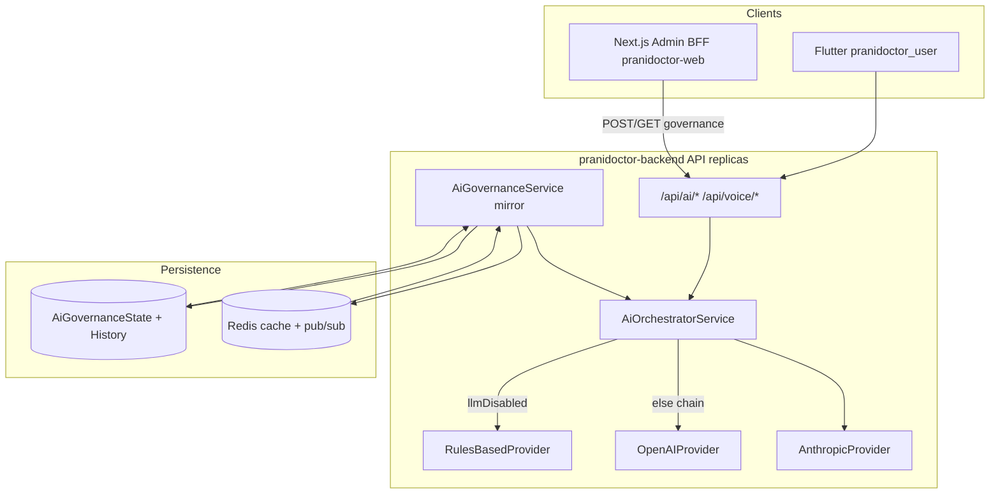
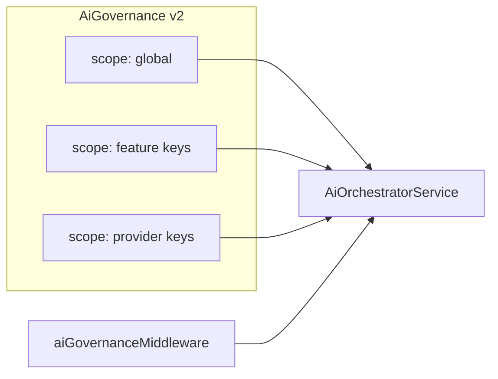

# AI Kill Switch — Production Persistence & Launch Plan

**Document type:** Launch architecture plan (documentation only — no implementation in this document)  
**Date:** 2026-05-30  
**Status:** Planning — v1 persistence **implemented** in backend; launch verification and v2 scope **outstanding**  
**Audience:** Engineering, SRE, AI safety, launch ops  
**Related (implemented):**
- `pranidoctor-backend/docs/production/ai/ai-kill-switch-operations.md`
- `pranidoctor_user/docs/production/ai/ai-kill-switch-persistence-plan.md`
- `pranidoctor_user/docs/production/ai/AI_KILL_SWITCH_PRODUCTION_READINESS_REPORT.md`
- `pranidoctor_user/docs/production/ai/AI_KILL_SWITCH_VERIFICATION_REPORT.md`

**Principle:** The kill switch is a **platform safety control**. When engaged, external LLM providers must not be invoked; the platform must **degrade to rules-based assistance**, remain **auditable**, and survive **restarts, deploys, and horizontal scale**.

---

## 1. Executive summary

Prani Doctor ships multiple AI-assisted surfaces (mobile chat, voice, farm intelligence, admin ops). A **global LLM kill switch** with **PostgreSQL persistence**, **Redis fan-out**, and **in-process hot-path reads** is implemented in `pranidoctor-backend` (`AiGovernanceService`). This plan:

1. Inventories **all AI entry points, providers, routes, and adjacent controls** as of 2026-05-30.
2. Assesses **production readiness** against launch requirements (persistence, multi-replica sync, audit, recovery).
3. Defines **target requirements** including per-feature / per-provider / per-environment controls **not yet in v1**.
4. Prioritizes **P0/P1/P2** work before and after go-live.

**Verdict:** Safe to launch **only after** migration deploy, staging multi-replica drill, and ops runbook sign-off. v1 covers **global LLM disable**; granular kill switches are **v2**.

---

## 2. Current state assessment

### 2.1 AI architecture (runtime)

| Layer | Implementation | Production role |
|-------|----------------|-----------------|
| **Source of truth** | `AiGovernanceState` singleton `id = global` | Survives restart/deploy |
| **Audit** | `AiGovernanceStateHistory` + `SYSTEM_CONFIG_CHANGE` foundation audit | Compliance trail |
| **Runtime cache** | Redis `{prefix}ai:governance:llm_disabled`, `version`, pub/sub channel | Cross-replica sync |
| **Hot path** | In-process mirror on `AiGovernanceService` | Zero I/O per `complete()` |
| **Enforcement** | `AiOrchestratorService.resolveChain()` → rules-only when `isLlmDisabled()` | Blocks OpenAI/Anthropic |
| **Hydration** | `bootstrapAiGovernance()` in `server.ts` | Startup recovery |
| **Reconciliation** | Poll every `AI_GOVERNANCE_POLL_INTERVAL_MS` (default 45s) | Heals missed pub/sub |

### 2.2 What v1 kill switch controls

| Control | v1 support | Notes |
|---------|------------|-------|
| **Global LLM disable** | Yes | Single boolean `llmDisabled` |
| **Per-feature disable** | No | `feature` tag on usage only; not governance |
| **Per-provider disable** | No | Disabling LLM forces rules-only; cannot disable OpenAI but keep Anthropic |
| **Per-environment disable** | Partial | `AI_LLM_DISABLED` env per deployment; not DB-scoped by env |
| **Emergency override** | Yes | Env + fail-closed bootstrap + internal token route |

### 2.3 LLM vs non-LLM AI surfaces

| Surface | Uses orchestrator / external LLM? | Kill switch effect when `llmDisabled=true` |
|---------|-----------------------------------|-------------------------------------------|
| Veterinary chat (`POST /api/ai/chat`) | Yes | Rules-based replies via `RulesBasedProvider` |
| Phase 8 chat (`POST /api/ai/chat/v2`) | Yes (via `AiVeterinaryCoreService`) | Same |
| Voice chat (`POST /api/voice/chat`) | Yes (delegates to veterinary core) | Same |
| Farm briefing / query | Yes | Rules-based briefing text |
| Triage (`POST /api/ai/triage`) | No | Unchanged (safety rules engine) |
| Symptom check (`POST /api/ai/symptom-check`) | No (import only; rules + RAG) | Unchanged |
| Smart recommendations / alerts | No (deterministic scoring) | Unchanged |
| Farm health dashboard | No | Unchanged |
| Knowledge search | No (DB/RAG retrieval) | Unchanged |
| Feed recommendation module | No (rule engine) | Unchanged |
| AI Technician marketplace | No LLM orchestrator | **Not governed** — human technician workflows |
| Escalation records | No LLM | Unchanged |

**Safety note:** Kill switch v1 stops **paid/external LLM** calls. It does **not** shut down all “AI-branded” UX; rules-based and deterministic features remain available by design.

---

## 3. Inventory

### 3.1 AI entry points

#### Mobile (`pranidoctor_user`)

| Entry | Route / screen | Backend API |
|-------|----------------|-------------|
| AI home | `AppRoutes.ai` | Multiple |
| AI chat | `AppRoutes.aiChat` | `/api/ai/chat`, `/api/ai/chat/v2` |
| Voice input | `AppRoutes.aiVoiceInput` | `/api/voice/stt`, `/api/voice/chat` |
| Symptom checker | `AppRoutes.aiSymptomChecker` | `/api/ai/symptom-check` |
| Smart recommendations | `AppRoutes.aiSmartRecommendations` | `/api/ai/smart-recommendations` |
| Farm health | `AppRoutes.aiFarmHealth` | `/api/ai/farm-health`, briefing, query |
| Smart alerts | `AppRoutes.aiSmartAlerts` | `/api/ai/smart-alerts` |
| Knowledge | `AppRoutes.aiKnowledgeSearch` | `/api/ai/knowledge/*` |
| Follow-ups | `AppRoutes.aiFollowUps` | `/api/ai/follow-ups` |
| AI consent | `AppRoutes.settingsAiConsent` | `/api/mobile/settings/ai-consent`, legal routes |
| Instant care / home widgets | `instant_care_sheet` etc. | May link to AI flows |

**Client-side gates (not kill switch):** `AiDisclaimerGate`, `legal_consent_gate`, `requireMobileAiConsent` on server.

#### Admin (`pranidoctor-web`)

| Entry | Path | Backend |
|-------|------|---------|
| AI Ops governance | `/admin/ai-ops/governance` | `GET/POST /api/admin/ai-ops/governance` |
| AI Ops overview, prompts, knowledge | `/admin/ai-ops/*` | Legacy + Express admin-ai-ops |
| Legal AI disclaimer settings | `/admin/settings/ai-disclaimer` | Settings APIs |

#### API process

| Entry | Mount | Module |
|-------|-------|--------|
| Customer AI | `/api/ai` | `AiModule` (+ embedded veterinary core routes) |
| Voice | `/api/voice` | `VoiceAssistantModule` |
| Admin AI ops (Express) | `/api/admin-ai-ops` | `AiAdminModule` (token-gated; prod uses legacy admin routes) |
| Health | `/health/ai` | `ai-health.service.ts` |

### 3.2 AI providers and services

| Provider / service | Type | Config | Kill switch v1 |
|--------------------|------|--------|----------------|
| **OpenAI** | External LLM | `OPENAI_API_KEY`, `OPENAI_MODEL` | Bypassed when `llmDisabled` |
| **Anthropic** | External LLM | `ANTHROPIC_API_KEY`, `ANTHROPIC_MODEL` | Bypassed when `llmDisabled` |
| **Rules-based** | In-process | Always on | **Sole provider** when disabled |
| **STT adapter** | Voice input | Stub/transcript path in `voice-assistant` | Not orchestrator-governed |
| **TTS adapter** | Voice output | Synthesizes rules-based text | Not LLM-governed |
| **AiKnowledgeService** | DB/RAG | PostgreSQL knowledge entries | Independent |
| **AiSafetyService** | Policy | Guardrails / refusal | Independent |

Provider preference: `AI_PROVIDER` env (`openai` default) orders chain when LLM enabled.

### 3.3 AI workflows (logical)

| Workflow | Services | LLM? |
|----------|----------|------|
| Farmer chat session | `AiVeterinaryCoreService.chat` → orchestrator | Yes |
| Phase 8 enriched chat | `AiAssistantService.chat` → core | Yes |
| Triage | `AiVeterinaryCoreService.triage` → safety only | No |
| Symptom check | `SymptomCheckerService.runCheck` | No |
| Escalation | `AiVeterinaryCoreService.createEscalationInternal` | No |
| Memory TTL / history | Repository | No |
| Farm briefing / query | `AiAssistantService` → orchestrator | Yes |
| Voice STT → chat → TTS | `VoiceAssistantService` → core | Chat path yes |
| Smart recommendations generation | `SmartRecommendationService` | No |
| Risk / analytics | `RiskScoringService`, `AiAnalyticsService` | No |
| Admin prompt/knowledge CRUD | `AiPromptService`, `AiKnowledgeService` | No (config only) |

### 3.4 AI background jobs

| Job | Location | LLM? |
|-----|----------|------|
| **Worker process** | `src/worker.ts` | No AI orchestrator bootstrap |
| Queue consumers | General queues | **No AI-specific workers found** |
| Governance poll | `setInterval` in `AiGovernanceService` | N/A |
| Memory TTL / cleanup | Planned in phase docs; not kill-switch | N/A |
| Escalation monitor | `escalation-monitor.service.ts` | Monitoring only |

**Implication:** No async LLM pipeline bypasses the orchestrator today; future queue-based AI jobs **must** call `getAiGovernanceService().isLlmDisabled()` before provider calls.

### 3.5 AI automation triggers

| Trigger | Mechanism | Kill switch |
|---------|-----------|-------------|
| User sends chat message | HTTP POST | Orchestrator checks mirror |
| User runs symptom check | HTTP POST | Rules only |
| Scheduled recommendation refresh | In-request generation | Rules only |
| HIGH risk / emergency symptom | Safety → escalation record | Not LLM |
| Admin toggle governance | POST governance | Persists to PG |
| Startup / deploy | `bootstrapAiGovernance` | Hydrate from PG |
| Env `AI_LLM_DISABLED=true` | Bootstrap override | Forces rules-only |
| Prometheus / alerts | `ai_llm_disabled` gauge | Observability only |

### 3.6 AI API routes (authoritative list)

#### Customer — `/api/ai` (mobile auth + `requireMobileAiConsent`)

| Method | Path | LLM governed |
|--------|------|--------------|
| POST | `/chat` | Yes |
| POST | `/triage` | No |
| GET | `/history` | No |
| GET/DELETE | `/memory` | No |
| POST | `/escalate` | No |
| POST | `/chat/v2` | Yes |
| GET | `/symptom-taxonomy` | No |
| POST | `/symptom-check` | No |
| GET | `/knowledge/search`, `/knowledge/:slug` | No |
| GET/POST | `/smart-recommendations`, `.../dismiss`, `.../complete` | No |
| GET/POST | `/smart-alerts`, `.../dismiss` | No |
| GET | `/farm-health` | No |
| POST | `/briefing/daily`, `/farm-query` | Yes |
| GET/POST | `/follow-ups`, `.../dismiss` | No |
| GET | `/analytics/farm-risk` | No |

#### Voice — `/api/voice` (mobile auth; **no** `requireMobileAiConsent` on routes file — verify legal gate at app layer)

| Method | Path | LLM governed |
|--------|------|--------------|
| POST | `/stt` | No |
| POST | `/chat` | Yes (via core) |
| POST | `/navigation` | No |
| GET | `/session` | No |

#### Admin governance

| Method | Path | Auth |
|--------|------|------|
| GET | `/api/admin/ai-ops/governance` | `ADMIN` \| `SUPER_ADMIN` |
| POST | `/api/admin/ai-ops/governance` | Same; prod enable → `SUPER_ADMIN` |
| POST | `/api/admin/ai-ops/kill-switch` | `x-internal-admin-token` (`INTERNAL_ADMIN_AI_OPS_TOKEN`) |

Legacy admin AI ops (prompts, knowledge, overview, risk) live under `src/legacy/web/routes/admin/ai-ops/*` — configuration, not LLM runtime.

#### Health / metrics

| Method | Path | Purpose |
|--------|------|---------|
| GET | `/health/ai` | Reports `llmDisabled`, provider config |
| GET | `/metrics` | `ai_llm_disabled`, `ai_requests_total`, usage |

#### Legacy mobile “AI” (not LLM kill switch)

Examples: `/api/mobile/ai-services/*`, `/api/mobile/ai-technician/*` — marketplace for AI technicians, not veterinary LLM core.

### 3.7 Feature flags and related controls

| Mechanism | Storage | Affects kill switch? |
|-----------|---------|-------------------|
| `AI_KILL_SWITCH_PERSISTENCE_ENABLED` | Env | Disables PG path → memory-only |
| `AI_LLM_DISABLED` | Env | Emergency rules-only at bootstrap |
| `AI_GOVERNANCE_POLL_INTERVAL_MS` | Env | Reconciliation cadence |
| `AI_PROVIDER` | Env | Provider order when LLM on |
| `INTERNAL_ADMIN_AI_OPS_TOKEN` | Env | Break-glass toggle route |
| `mobile.feature.flags` / `mobile.app.config` | PostgreSQL `Setting` | Mobile UX only |
| Web `FEATURE_*` in `.env.example` | Deploy env | Not wired to orchestrator |
| AI disclaimer / escalation disclosure | Admin settings + resolvers | UX copy, not LLM off |
| `requireMobileAiConsent` | Legal middleware | Blocks AI routes if consent missing |
| Emergency limitation guard | Legal config | Emergency **booking**, not LLM |
| Rate limit `AI_CHAT_DAILY` | Redis | Quota when LLM on |

### 3.8 Existing emergency-disable mechanisms

| Mechanism | Scope | Persists? |
|-----------|-------|-----------|
| **Admin governance toggle** | Global LLM | Yes (PG) |
| **`POST .../kill-switch`** | Global LLM | Yes (PG) |
| **`AI_LLM_DISABLED=true`** | Global LLM per deployment | No (env until redeploy) |
| **Bootstrap fail-closed** | Prod when PG hydrate fails | Until PG healthy |
| **`AI_KILL_SWITCH_PERSISTENCE_ENABLED=false`** | Dev rollback to memory | No |
| **Legal AI consent off** | Per-user AI access | User record |
| **AI disclaimer enforce** | Per-user acceptance | User + config |

There is **no** separate “disable all AI screens” flag in v1 — only **LLM provider chain**.

---

## 4. Gap analysis

| Requirement (§A) | v1 state | Gap severity |
|------------------|----------|--------------|
| Global AI disable | Implemented | — |
| Per-feature disable | Not implemented | **P2** — needs schema + orchestrator filter |
| Per-provider disable | Not implemented | **P2** — e.g. disable OpenAI only |
| Per-environment disable | Env only | **P1** — document; optional `environment` column |
| Emergency override | Env + internal API | **P1** — rotate token, network restrict |
| Survives restart/deploy/scale | PG + hydrate + pub/sub | **P0** — verify in staging |
| Survives cache eviction | PG poll repairs Redis | **P1** — alert on key missing |
| Survives app crash | PG SoT | **P0** — migration before deploy |
| Request interception at boundary | Orchestrator only | **P2** — middleware for hard deny |
| User-facing “AI temporarily unavailable” | Rules-only continues | **P1** — product copy / banner |
| Admin visibility | Panel + history | **P0** — staging drill |
| Audit / change history | PG history + foundation audit | **P1** — PG is SoT for compliance |
| CI multi-replica test | Missing | **P0** — manual matrix open |
| PG vs Redis version alert | Missing | **P1** |
| Non-LLM “AI” surfaces keep running | By design | Document for ops expectations |
| Worker future LLM jobs | N/A today | **P2** — governance check in worker |

---

## A. Kill switch requirements (target)

### A.1 Global AI disable (v1 — required for launch)

- **Single platform flag** `llmDisabled` applies to all orchestrator-backed LLM calls.
- **Default safe:** new environments seed `llmDisabled=false`; production bootstrap **fail-closed** to disabled if SoT unavailable (when persistence enabled).
- **Observable:** `/health/ai` degraded + `ai_llm_disabled` metric + admin panel.

### A.2 Per-feature AI disable (v2)

Introduce governance scopes, e.g.:

| Feature key | Maps to |
|-------------|---------|
| `CHAT` | `/chat`, `/chat/v2`, voice chat |
| `FARM_BRIEFING` | `/briefing/daily` |
| `FARM_QUERY` | `/farm-query` |
| `SYMPTOM_CHECK` | Optional — currently non-LLM |

**Behavior:** `isFeatureDisabled(feature)` OR global `llmDisabled` → rules-only or **503 AI_FEATURE_DISABLED** (product decision).

### A.3 Per-provider AI disable (v2)

Allow `disabledProviders: ['openai']` while Anthropic remains, or force rules-only per provider in chain.

**Use case:** OpenAI incident without losing Anthropic capacity.

### A.4 Per-environment AI disable (v1 partial / v2 explicit)

| Approach | v1 | v2 |
|----------|----|----|
| Deployment env `AI_LLM_DISABLED` | Yes | Document in runbook |
| Staging vs prod rows | No | Optional `environment` on state or separate scope ids |
| Config service | No | Same PG table with `id = staging` / `production` |

**Launch:** Treat **environment isolation by deployment** (separate PG/Redis per env) as sufficient for v1.

### A.5 Emergency override behavior

| Priority (high → low) | Source | Behavior |
|----------------------|--------|----------|
| 1 | `AI_LLM_DISABLED=true` | Force rules-only on bootstrap |
| 2 | PostgreSQL `llmDisabled=true` | Persisted global off |
| 3 | Redis cache | Acceleration + fan-out |
| 4 | In-process mirror | Hot path |
| **Enable in prod** | Admin UI | Requires `SUPER_ADMIN` |
| **Break-glass enable** | `internal_api` + token | Allowed; audit `source=internal_api` |

**Ambiguity rule (recommended):** If any authoritative source says disabled → **disabled** (fail closed for LLM spend).

---

## B. Persistence strategy

State must survive:

| Event | v1 mechanism | Verification |
|-------|--------------|--------------|
| Server restart | PG hydrate on `bootstrapAiGovernance` | M3 manual test |
| Container restart | Same | Rolling restart drill |
| Deployment | PG unchanged; new pods hydrate | M3 |
| Horizontal scaling | PG write + Redis pub/sub + poll | M4 |
| Cache eviction | PG poll repopulates Redis | M7 |
| Application crash | PG SoT; mirror rebuilt on boot | M3 |

**Non-goals for v1:** Client-side persistence of kill state (mobile must trust server).

---

## C. Storage strategy

### C.1 Evaluation

| Store | Role | Verdict |
|-------|------|---------|
| **PostgreSQL** (`AiGovernanceState`, `AiGovernanceStateHistory`) | Source of truth, audit | **Required** — keep |
| **Redis** | Cache + pub/sub | **Required** for multi-replica; degrades gracefully |
| **Environment** (`AI_LLM_DISABLED`, `AI_KILL_SWITCH_PERSISTENCE_ENABLED`) | Emergency / rollback | **Required** as break-glass |
| **Configuration file** | Static defaults | Optional seed only; not for runtime toggle |
| **`Setting` JSON row** | Alternative SoT | Rejected for v1 — dedicated tables exist |

### C.2 Safe defaults

| Condition | Default `llmDisabled` |
|-----------|------------------------|
| Fresh migration seed | `false` |
| Prod bootstrap, persistence on, PG+Redis fail | `true` (fail-closed) |
| Persistence off (`AI_KILL_SWITCH_PERSISTENCE_ENABLED=false`) | `AI_LLM_DISABLED` or `false` |
| Toggle write, PG down | **Reject** (503) |

### C.3 Redis key policy

- Keys: `{REDIS_PREFIX}ai:governance:llm_disabled`, `version`, channel `ai:governance:events`
- **No TTL** on governance keys (document LRU risk under memory pressure)
- **P1:** Monitor key existence; alert if missing > 2 poll intervals

---

## D. Runtime behavior

### D.1 Request interception

| Layer | v1 | v2 recommendation |
|-------|----|--------------------|
| **Orchestrator** | `resolveChain()` → rules only | Keep as final enforcement |
| **Middleware** | None | Optional `aiGovernanceMiddleware` on `/api/ai`, `/api/voice` for fast 503 |
| **Mobile** | None | Optional banner when `/health/ai` reports `llmDisabled` |

### D.2 AI service blocking

- All `getAiOrchestratorService().complete*` paths respect `isLlmDisabled()`.
- **Must not** call `applyLocalState` in production code paths (tests only).
- Symptom/triage/knowledge **continue** — document in ops comms.

### D.3 Graceful degradation

| User action | `llmDisabled=true` behavior |
|-------------|----------------------------|
| Chat / voice | Rules-based educational response + disclaimers |
| Farm briefing/query | Rules-based summary from structured dashboard data |
| Symptom check | Unchanged deterministic output |
| Error rate | Should not spike 5xx if rules provider healthy |

### D.4 User-facing fallback

| Element | Recommendation |
|---------|----------------|
| Copy | “AI assistant is in limited mode” (bn/en) |
| Disclaimer | Existing AI disclaimer banners remain |
| Escalation | Still offer human vet path |
| **P1:** Mobile optional status from `/health/ai` or feature flag in settings sync |

### D.5 Admin visibility

| Element | Source |
|---------|--------|
| Status badge | `governance.llmDisabled` |
| Version / actor / reason | GET governance panel |
| History table | Last 50 `AiGovernanceStateHistory` rows |
| Provider health | `/health/ai` |
| Metrics | Grafana: `ai_llm_disabled`, `ai_requests_total{provider="rules-based"}` |

---

## E. Security controls

### E.1 Authorized roles

| Action | Role |
|--------|------|
| View governance | `ADMIN`, `SUPER_ADMIN` |
| Disable LLM (prod) | `ADMIN`, `SUPER_ADMIN` + reason ≥ 10 chars |
| Enable LLM (prod) | **`SUPER_ADMIN`** (admin UI) |
| Internal kill-switch | `INTERNAL_ADMIN_AI_OPS_TOKEN` only |
| Mobile/customer | **Denied** |

**P2:** Hide Enable button in UI for non–`SUPER_ADMIN` in production.

### E.2 Audit logging

| Store | Content | Retention |
|-------|---------|-----------|
| `AiGovernanceStateHistory` | Full toggle history | DB policy |
| Foundation `SYSTEM_CONFIG_CHANGE` | SIEM-friendly | Redis 90d — **do not rely solely** |
| App logs | `ai_governance_change` structured | Log pipeline |

Required fields: actor, role, timestamp, previous/new, version, reason, source, request/correlation ids.

### E.3 Change history

- Append-only history table — **never delete** on app rollback.
- Optional `rollbackOfId` links revert operations (API accepts; UI **P2**).

### E.4 Emergency access

| Path | Control |
|------|---------|
| `kubectl set env ... AI_LLM_DISABLED=true` | Ops runbook; does not replace PG persist |
| Internal token route | Rotate quarterly; IP allowlist at ingress |
| Raw SQL update | **Forbidden** in runbook except disaster with two-person rule |

Rate limit: 10 toggles/hour/actor via Redis.

---

## F. Recovery strategy

### F.1 Safe re-enable process

1. Confirm incident root cause resolved (provider, spend, safety).
2. Verify `/health/ai` and provider keys present.
3. **`SUPER_ADMIN`** enables via admin UI with reason referencing incident ID.
4. Confirm `ai_llm_disabled=0` on **all** replicas within 2s (pub/sub) or 45s (poll).
5. Smoke: one chat + one farm briefing in staging/prod canary.
6. Monitor `ai_requests_total`, token usage, error rate 30 min.

### F.2 Rollback process

| Scenario | Action |
|----------|--------|
| Bad deploy | Revert image; PG state retained |
| Persistence bug | `AI_KILL_SWITCH_PERSISTENCE_ENABLED=false` + `AI_LLM_DISABLED=true` |
| Stuck enabled | Admin disable OR env force disabled |
| Migration failure | Do not roll forward; keep `AI_LLM_DISABLED=true` |

See `pranidoctor-backend/docs/production/ai/ai-kill-switch-operations.md`.

### F.3 Verification checklist (launch sign-off)

| # | Check | Owner | Status |
|---|-------|-------|--------|
| L1 | Migration `20260530160000_ai_governance_kill_switch` applied | Ops | ⬜ |
| L2 | `AI_KILL_SWITCH_PERSISTENCE_ENABLED=true` in prod | Ops | ⬜ |
| L3 | Two-replica toggle drill (M4) | Eng | ⬜ |
| L4 | Restart drill (M3) | Eng | ⬜ |
| L5 | Admin panel matches PG after refresh | Product | ⬜ |
| L6 | `/health/ai` `llmDisabled` accurate | SRE | ⬜ |
| L7 | Unit tests `ai-governance`, `ai-health` green | CI | ✅ |
| L8 | Runbook distributed to on-call | Ops | ⬜ |
| L9 | Quarterly kill-switch drill scheduled | AI ops | ⬜ |
| L10 | Communicate rules-only behavior to support | Support | ⬜ |

Full manual matrix: `pranidoctor_user/docs/production/ai/AI_KILL_SWITCH_VERIFICATION_REPORT.md`.

---

## 5. Recommended architecture

### 5.1 v1 (current — launch baseline)

Retain **singleton global state** + **orchestrator enforcement** + **PG/Redis/mirror** stack. No schema change required for launch if migration applied.

### 5.2 v2 (post-launch)

1. **`AiGovernanceScope` table** — `(scopeType, scopeId, llmDisabled, version)` with history FK.
2. **Orchestrator** — `resolveChain()` filters providers and checks feature flags.
3. **Middleware** — optional hard block before controller.
4. **Reconciliation job** — daily PG vs Redis version compare + alert.
5. **Worker hook** — `assertAiGovernanceAllowed()` before any future LLM queue job.

---

## 6. Implementation tasks (prioritized)

### P0 — Launch blockers

| ID | Task | Repo |
|----|------|------|
| P0-1 | Apply governance migration all environments | backend |
| P0-2 | Staging two-replica toggle + restart drill (M3, M4) | ops |
| P0-3 | Confirm `bootstrapAiGovernance` in prod startup logs | ops |
| P0-4 | Sign-off L1–L8 checklist | launch |
| P0-5 | Document “rules-only ≠ AI off” for support | web/user docs |

### P1 — Launch week hardening

| ID | Task | Repo |
|----|------|------|
| P1-1 | Prometheus alert: replica `ai_llm_disabled` mismatch | backend/deploy |
| P1-2 | Alert: Redis governance keys missing | backend |
| P1-3 | Admin UI: disable Enable for non–`SUPER_ADMIN` in prod | web |
| P1-4 | Mobile banner when LLM limited (optional API field) | user + backend |
| P1-5 | Integration test: pub/sub version monotonicity | backend |
| P1-6 | Voice routes: align `requireMobileAiConsent` with `/api/ai` | backend |

### P2 — Post-launch

| ID | Task | Repo |
|----|------|------|
| P2-1 | Per-feature governance scopes | backend |
| P2-2 | Per-provider disable | backend |
| P2-3 | `aiGovernanceMiddleware` + optional 503 mode | backend |
| P2-4 | Daily PG/Redis reconciliation job | backend |
| P2-5 | Admin UI rollback linked to `rollbackOfId` | web |
| P2-6 | Worker governance guard for future LLM jobs | backend |
| P2-7 | Capability `ai.governance.kill_switch` in permissions registry | backend |

---

## 7. Expected files (implementation reference)

### v1 (existing — do not duplicate)

| Component | Path |
|-----------|------|
| Governance service | `pranidoctor-backend/src/modules/ai/governance/ai-governance.service.ts` |
| Redis sync | `pranidoctor-backend/src/modules/ai/governance/ai-governance.redis.ts` |
| Types | `pranidoctor-backend/src/modules/ai/governance/ai-governance.types.ts` |
| Orchestrator | `pranidoctor-backend/src/modules/ai/orchestrator/ai-orchestrator.service.ts` |
| Migration | `pranidoctor-backend/prisma/migrations/20260530160000_ai_governance_kill_switch/` |
| Bootstrap | `pranidoctor-backend/src/server.ts` |
| Admin route | `pranidoctor-backend/src/legacy/web/routes/admin/ai-ops/governance/route.ts` |
| Admin UI | `pranidoctor-web/src/components/admin/ai-ops/AiGovernancePanel.tsx` |
| BFF | `pranidoctor-web/src/app/api/admin/ai-ops/governance/route.ts` |
| Tests | `pranidoctor-backend/src/modules/ai/governance/ai-governance.service.test.ts` |

### v2 (planned)

| Component | Path |
|-----------|------|
| Scope migration | `pranidoctor-backend/prisma/migrations/*_ai_governance_scopes/` |
| Scope service | `pranidoctor-backend/src/modules/ai/governance/ai-governance-scope.service.ts` |
| Middleware | `pranidoctor-backend/src/modules/ai/governance/ai-governance.middleware.ts` |
| Reconciliation | `pranidoctor-backend/src/modules/ai/governance/ai-governance.reconcile.ts` |
| Alerts | `pranidoctor-backend/deploy/monitoring/prometheus-alerts.yml` |
| Mobile status DTO | `pranidoctor_user/lib/features/ai/data/ai_governance_dto.dart` (if exposed) |

---

## 8. Risks and mitigations

| Risk | Impact | Mitigation |
|------|--------|------------|
| Replica stale up to 45s after toggle | Medium | Pub/sub; reduce poll in incident; accept brief LLM calls |
| Per-pod Prometheus gauge drift | Medium | Alert on max/min across replicas |
| Ops thinks “AI off” but symptom check works | Medium | Training + this doc §2.3 |
| Migration not applied before deploy | Critical | P0 gate; fail-closed bootstrap |
| `INTERNAL_ADMIN_AI_OPS_TOKEN` leak | Critical | Rotate, disable route if unset, network policy |
| Redis LRU evicts governance keys | High | No TTL; monitor; PG poll heals |
| Foundation audit in Redis only | Medium | Use PG history for compliance |
| Future worker LLM bypass | High | P2-6 guard before queue consumers ship |

---

## 9. Document control

| Version | Date | Notes |
|---------|------|-------|
| 1.0 | 2026-05-30 | Launch plan from codebase + production docs review |

**Next actions:** Complete P0 checklist → go-live → schedule P1 within 7 days → roadmap P2 scopes.

---

*Plan only — no code changes. Implementation status tracked in backend operations doc and user production readiness report.*
