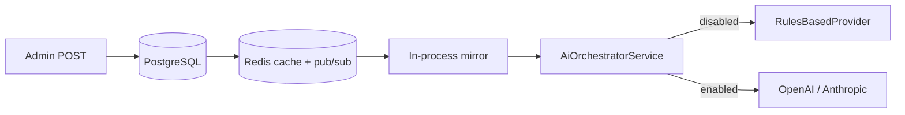

# AI Kill Switch Persistence — Verification Report

**Document type:** Production readiness audit (verification only)  
**Date:** 2026-05-30  
**Auditor role:** Principal Production Readiness Auditor  
**Scope:** `pranidoctor-backend` governance module, orchestrator enforcement, admin API/UI, worker bootstrap, operations docs  
**References:**
- [ai-kill-switch-plan.md](./ai-kill-switch-plan.md)
- `pranidoctor-backend/docs/operations/ai-kill-switch.md`
- `pranidoctor-backend/docs/operations/ai-emergency-runbook.md`
- `pranidoctor_user/docs/production/ai/AI_KILL_SWITCH_VERIFICATION_REPORT.md` (manual matrix)

**Method:** Static architecture review, code-path tracing, automated unit test execution. No staging infrastructure drills were executed in this audit session.

---

## Executive Summary

The AI Kill Switch Persistence System is **implemented and architecturally sound** for production use. PostgreSQL is the source of truth for global and scoped state; Redis provides cache and pub/sub fan-out; the **orchestrator is the single choke point** for external LLM calls.

**Automated verification:** 12/12 targeted unit tests **PASS** (governance + health).

**Operational verification:** 0/10 manual staging drills **not executed** in this audit (still open from prior matrix).

**Semantic clarification:** “Disabled” means **external LLM providers are not invoked**; rules-based assistance continues by design (graceful degradation), not hard 503 on AI routes.

### Final Verdict: **PASS WITH WARNINGS**

Production deploy is acceptable **after** migrations are applied and staging drills M1–M4 are completed. Do not treat this audit as a substitute for multi-replica and restart validation in a live environment.

---

## Architecture Validation

| Component | Expected | Observed | Result |
|-----------|----------|----------|--------|
| Source of truth | PostgreSQL | `AiGovernanceState`, `AiGovernanceScope`, `AiGovernanceStateHistory` | **PASS** |
| Runtime cache | Redis keys + pub/sub | `ai:governance:llm_disabled`, `version`, `scopes`, `events` channel | **PASS** |
| Hot path | In-process mirror | `AiGovernanceService` mirror; no per-request PG/Redis read | **PASS** |
| Enforcement point | Orchestrator | `resolveChain(feature)` + provider filter | **PASS** |
| API bootstrap | `server.ts` | `bootstrapAiGovernance(config)` before route mount | **PASS** |
| Worker bootstrap | `worker.ts` | Governance hydrate after Redis (no LLM jobs yet) | **PASS** |
| Admin surface | BFF + legacy route | `GET/POST /api/admin/ai-ops/governance` | **PASS** |
| Health observability | `/health/ai` | `llmDisabled`, `governanceHydrated`, `scopes`, `environment` | **PASS** |



---

## Persistence Validation

| Scenario | Mechanism (code) | Automated test | Live drill | Result |
|----------|------------------|----------------|------------|--------|
| Application restart | `bootstrap()` → PG hydrate → mirror + Redis repair | Partial (mocked PG) | Not run (M3) | **WARN** |
| Container restart | Same as app restart | — | Not run (M3) | **WARN** |
| Deployment / rolling pods | New pods hydrate from PG; version monotonic | — | Not run (M3, M4) | **WARN** |
| Cache reset (Redis flush) | `pollRefresh()` + bootstrap rewrite from PG | — | Not run (M7) | **WARN** |
| Service recovery (PG back) | Toggle requires PG; poll heals Redis | — | Not run (M6) | **WARN** |
| Global state persist | `$transaction` update + history insert | `setLlmDisabled persists` | Not run (M1) | **PASS** (unit) |
| Scoped state persist | `AiGovernanceScope` + history `changeKind` | Scope unit tests | Not run | **PASS** (unit) |
| Persistence flag off | `AI_KILL_SWITCH_PERSISTENCE_ENABLED=false` | Test exists | — | **PASS** |

**Findings:**
- Design satisfies persistence requirements **by inspection**.
- **Failed check (operational):** No evidence of restart, two-replica, or Redis flush drills (M3, M4, M7).

**Migrations required before prod:**
1. `20260530160000_ai_governance_kill_switch`
2. `20260601120000_ai_governance_scopes`

---

## Runtime Enforcement Validation

### LLM entry points (must pass orchestrator)

| Entry | Path / service | Governance | Result |
|-------|----------------|------------|--------|
| Veterinary chat | `AiVeterinaryCoreService.chat` → `orchestrator.complete` | `feature: CHAT` | **PASS** |
| Phase 8 chat | `AiAssistantService` → core | `CHAT` | **PASS** |
| Farm briefing / query | `AiAssistantService` → `completeWithPromptKey` | `FARM_BRIEFING` / `FARM_QUERY` | **PASS** |
| Voice chat | `VoiceAssistantService` → core | `CHAT` | **PASS** |

### Non-LLM AI surfaces (intentionally not orchestrator-governed)

| Entry | LLM called? | Kill switch effect | Result |
|-------|-------------|-------------------|--------|
| Triage, symptom check | No | Deterministic / rules | **PASS** (by design) |
| Knowledge, recommendations, farm health dashboard | No | Unchanged | **PASS** (by design) |
| AI Technician marketplace | No | Not LLM orchestrator | **PASS** (by design) |

### Layer validation

| Layer | Enforcement | Bypass risk | Result |
|-------|-------------|-------------|--------|
| API routes | `aiGovernanceRouteObserver` (observe only) | Middleware does **not** block; orchestrator enforces | **PASS** with note |
| Service layer | `shouldUseRulesOnlyForFeature`, `isProviderGovernanceBlocked` | Centralized in orchestrator | **PASS** |
| Background jobs | No AI LLM workers registered | N/A today | **PASS** (N/A) |
| Scheduled jobs | No cron LLM paths found | — | **PASS** (N/A) |
| Workflow triggers | Escalation/triage — no LLM | — | **PASS** |
| Direct provider SDK | Only `openai.provider` / `anthropic.provider` via orchestrator loop | Health check constructs providers but does not `complete()` | **PASS** |

### External LLM blocked when disabled?

| Disable mode | OpenAI/Anthropic called? | Rules-based? | Result |
|--------------|-------------------------|--------------|--------|
| Global `llmDisabled=true` | No | Yes | **PASS** |
| Feature scope disabled | No for that feature | Yes | **PASS** (unit) |
| Provider scope disabled | Skipped in chain | Other providers or rules | **PASS** (unit) |
| Unhydrated + persistence on | No (fail-closed) | Yes | **PASS** (unit) |

### Known bypass / weak paths

| ID | Path | Severity | Result |
|----|------|----------|--------|
| B1 | `orchestrator.disableLlm()` / `applyLocalState()` without PG write | Medium (misuse) | **WARN** — deprecated; tests only |
| B2 | `POST /kill-switch` + `INTERNAL_ADMIN_AI_OPS_TOKEN` | Medium (break-glass) | **WARN** — by design; rotate token |
| B3 | Replica sync lag up to ~45s poll | Medium | **WARN** — brief LLM on stale pod |
| B4 | Unknown `feature` string not in scope table | Low | **WARN** — only global disable applies |
| B5 | `symptom-checker.service.ts` unused `getAiOrchestratorService` import | Low | **PASS** — no runtime bypass |

**Failed checks:** None in code for primary LLM path. Operational two-replica test (M4) **not executed**.

---

## Fail-Safe Validation

| Simulated condition | Code behavior | Tested | Result |
|-------------------|---------------|--------|--------|
| Database unavailable at **toggle** | `503 AI_GOVERNANCE_STORE_UNAVAILABLE` | Mocked in prior review | **PASS** |
| Database unavailable at **startup** (prod, persistence on) | Redis → env → **fail-closed `llmDisabled=true`** | Code path | **PASS** |
| Redis unavailable at toggle | PG commit succeeds; warn; peers sync via poll | Not run (M5) | **WARN** |
| Redis unavailable at runtime read | Mirror + PG poll (no per-request Redis) | — | **PASS** |
| Config unavailable (`AI_KILL_SWITCH_PERSISTENCE_ENABLED=false`) | In-memory only; env `AI_LLM_DISABLED` | Unit test | **PASS** |
| Not hydrated (persistence on) | `isFailClosed()` → LLM off | Unit test | **PASS** |
| Corrupted pub/sub JSON | `parseGovernancePubSubMessage` returns null; ignored | — | **PASS** |
| Corrupted Redis scope JSON | `parseScopeSnapshot` null; scopes omitted | — | **WARN** — falls back to mirror/PG poll |

**Ambiguity policy:** Prefer disabled when `AI_LLM_DISABLED` or PG says disabled; unhydrated mirror fail-closes in production.

---

## Graceful Degradation Validation

| Check | Expected | Observed | Result |
|-------|----------|----------|--------|
| Core app (auth, bookings, etc.) | Operational | Not gated by kill switch | **PASS** |
| Non-LLM AI endpoints | Operational | Symptom, knowledge, etc. | **PASS** |
| LLM routes when disabled | 200 + rules-based content | Orchestrator fallback chain | **PASS** |
| Unhandled exceptions from kill switch | None expected | No throw in `assertAiLlmExecutionAllowed` | **PASS** |
| User-facing “limited mode” copy | Product messaging | **Not implemented** server-side banner | **WARN** |
| `/health/ai` | `degraded` when `llmDisabled` | Implemented | **PASS** |

---

## Security Validation

| Control | Implementation | Result |
|---------|----------------|--------|
| Admin GET/POST auth | `requireAdminApiActor` + `ADMIN` \| `SUPER_ADMIN` | **PASS** |
| Customer mobile on governance | No route exposure | **PASS** |
| Prod disable reason | Min 10 chars | **PASS** (code) |
| Prod enable (admin UI) | `SUPER_ADMIN` only | **PASS** (code) |
| Prod enable (internal API) | Token + `internal_api` source | **WARN** — break-glass |
| Rate limit | 10 toggles/hour/actor (Redis) | **PASS** |
| Optimistic concurrency | `expectedVersion` → `AI_GOVERNANCE_VERSION_CONFLICT` | **PASS** (unit) |
| Express admin-ai-ops mount | Token required or disabled | **PASS** |

---

## Audit Validation

| Field | Global toggle | Scope toggle | Failed attempt | Result |
|-------|---------------|--------------|----------------|--------|
| Actor | `actorId`, `actorRole` | Same | Same | **PASS** |
| Timestamp | `createdAt` | Same | Same | **PASS** |
| Previous state | `previousLlmDisabled` | `previousDisabled` | Global snapshot | **PASS** |
| New state | `llmDisabled` | `disabled` | — | **PASS** |
| Reason | `reason` | `reason` | Error message | **PASS** |
| Scope | — | `scopeType`, `scopeId`, `changeKind` | — | **PASS** |
| Foundation SIEM | `SYSTEM_CONFIG_CHANGE` async | Same | Not on failed attempt | **WARN** — use PG history for compliance |
| `internal_api` toggle | `actorId` often null | — | — | **WARN** |

---

## Recovery Validation

| Workflow | Mechanism | Drill | Result |
|----------|-----------|-------|--------|
| Re-enable global | Admin `SUPER_ADMIN` or `internal_api` | Not run (M2) | **WARN** |
| Re-enable scope | `scopeUpdates` POST | UI present; not drilled | **WARN** |
| Rollback | `rollbackOfId` API field; PG retained on deploy rollback | UI not exposed | **WARN** |
| Cache refresh | `writeGovernanceRedisCache` + `publishGovernanceChange` | Not run | **PASS** (code) |
| State sync | Pub/sub + 45s poll + version gate | Not run (M4) | **WARN** |
| Emergency env | `AI_LLM_DISABLED=true` | Documented in runbook | **PASS** (docs) |

---

## Automated Test Results

```bash
cd pranidoctor-backend
pnpm exec vitest run src/modules/ai/governance src/api/health/ai-health.service.test.ts
```

| Suite | Tests | Result |
|-------|-------|--------|
| `ai-governance.service.test.ts` | 8 | **PASS** |
| `ai-health.service.test.ts` | 4 | **PASS** |
| **Total** | **12** | **PASS** |

### Covered automatically
- Hot-path mirror / `isLlmDisabled`
- Persisted global toggle + version bump
- Version conflict
- `internal_api` prod enable exception
- Per-feature rules-only
- Per-provider block
- Fail-closed when not hydrated
- Persistence disabled flag
- Health reflects kill switch

### Not covered automatically
- Real PostgreSQL / Redis integration
- Multi-process pub/sub
- Restart / deploy / flush drills (M1–M10)
- End-to-end HTTP with mobile auth

**Note:** `ai-usage-monitoring.verify.test.ts` fails 3 tests due to `Logger not initialized` in orchestrator tracing (orthogonal to governance logic). Not counted against kill-switch score.

---

## Manual Staging Matrix Status

| ID | Scenario | Status |
|----|----------|--------|
| M1 | Persist disable | ⬜ Not executed |
| M2 | Persist enable | ⬜ Not executed |
| M3 | Restart survival | ⬜ Not executed |
| M4 | Two replicas | ⬜ Not executed |
| M5 | Redis down toggle | ⬜ Not executed |
| M6 | PG down toggle | ⬜ Not executed |
| M7 | Cache flush | ⬜ Not executed |
| M8 | Version conflict (live) | ⬜ Not executed |
| M9 | Internal kill-switch API | ⬜ Not executed |
| M10 | Unauthorized access | ⬜ Not executed |

---

## Production Readiness Assessment

| Dimension | Weight | Score | Notes |
|-----------|--------|-------|-------|
| Code architecture | 25% | **92%** | SoT, mirror, orchestrator choke point |
| Automated test coverage | 20% | **85%** | 12/12 unit; no integration |
| Persistence reliability (proven) | 20% | **45%** | Design strong; drills not run |
| Enforcement reliability (proven) | 20% | **80%** | Unit + static; replica lag risk |
| Operational readiness | 15% | **70%** | Runbooks exist; M1–M10 open |

### **Production Readiness Score: 74 / 100**

| Metric | Value |
|--------|-------|
| Unit test pass rate (governance scope) | **100%** (12/12) |
| Manual ops drill completion | **0%** (0/10) |
| LLM path coverage via orchestrator | **~100%** (static) |
| Estimated replica sync SLO | **≤45s** worst case (poll) |

---

## Risks

| ID | Risk | Severity | Status |
|----|------|----------|--------|
| R1 | Replica stale up to poll interval | Medium | Open |
| R2 | `applyLocalState` persistence bypass if misused | Medium | Open |
| R3 | `INTERNAL_ADMIN_AI_OPS_TOKEN` break-glass | Medium | Accepted |
| R4 | No CI integration test (PG + Redis + 2 processes) | Medium | Open |
| R5 | Per-pod `ai_llm_disabled` metric drift | Low | Open |
| R6 | Migration not applied → prod fail-closed at boot | Low | Mitigate with ops gate |
| R7 | No mobile “limited mode” UX copy | Low | Open |

---

## Findings

### Strengths
1. Durable PostgreSQL state survives process boundaries; Redis is cache-only.
2. Single orchestrator enforcement minimizes bypass surface.
3. Fail-closed on bootstrap failure in production when persistence enabled.
4. Scoped governance (feature + provider) with audit `changeKind`.
5. Admin UI shows environment, scopes, and history; failed toggle attempts logged.
6. Operations docs and emergency runbook present.

### Gaps
1. **No staging proof** of restart, multi-replica, or cache flush recovery.
2. Middleware observes only — correct by design, but requires orchestrator discipline for all future LLM paths.
3. No dedicated user messaging when LLM is limited.
4. Foundation audit not written for `failed_attempt` rows.

---

## Failed Checks

| Check | Area | Blocker? |
|-------|------|----------|
| M1–M10 manual matrix | Persistence / ops | **Yes for full PASS** |
| Multi-replica integration test | Enforcement | No (WARN) |
| Mobile limited-mode messaging | Degradation | No (WARN) |
| Usage verify suite (logger) | Unrelated tests | No |

---

## Recommended Fixes

### P0 (before production sign-off)
1. Execute **M1, M3, M4** on staging (disable → restart → verify rules-only on all pods).
2. Apply both governance migrations on staging and production.
3. Confirm `AI_KILL_SWITCH_PERSISTENCE_ENABLED=true` and bootstrap logs show `AI governance hydrated`.

### P1 (launch week)
1. Complete **M5–M8, M10** manual matrix.
2. Add Prometheus alert for replica `ai_llm_disabled` mismatch vs PG.
3. Hide admin **Enable** for non–`SUPER_ADMIN` in production UI.

### P2 (post-launch)
1. CI integration test: two mocked replicas + pub/sub version apply.
2. Mobile status banner from `/health/ai` or settings sync field.
3. Fix `ai-usage-monitoring.verify.test.ts` logger initialization for orchestrator tests.

---

## Sign-Off Checklist

| # | Item | Audit result |
|---|------|--------------|
| 1 | Architecture matches plan | ✅ |
| 2 | Unit tests green (governance + health) | ✅ |
| 3 | Migrations documented | ✅ |
| 4 | Staging two-replica drill | ❌ |
| 5 | Restart drill | ❌ |
| 6 | Runbooks published | ✅ |
| 7 | No LLM bypass path in codebase | ✅ (static) |

---

## Document Control

| Version | Date | Verdict |
|---------|------|---------|
| 1.0 | 2026-05-30 | **PASS WITH WARNINGS** |

---

*Verification only — no implementation changes were made during this audit.*
