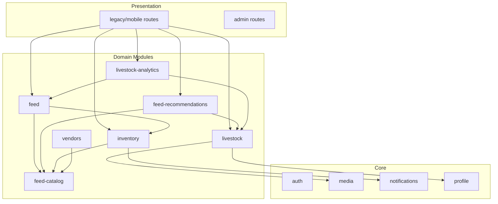

# Phase 4 — Backend Architecture

**Plan ID:** `PHASE_4_LIVESTOCK_FEED_ECOSYSTEM_MASTER_PLANNING_V1`  
**Status:** Planning only

---

## 1. Architectural Pattern

Prani Doctor backend is a **modular monolith** (Express + TypeScript + Prisma). Phase 4 adds **six bounded modules** under `src/modules/` while keeping **legacy mobile routes** in `src/legacy/web/routes/mobile/` as thin adapters until migration completes.

### Principles (inherited + Phase 4)

| ID | Rule |
|----|------|
| P-01 | One Prisma model → one owning module |
| P-02 | Cross-module reads via public service interfaces only |
| P-03 | No direct Prisma access from route handlers — delegate to services |
| P-04 | Zod validation at HTTP boundary; domain validation in services |
| P-05 | Domain events for loose coupling (inventory consumed → analytics invalidate) |
| P-06 | Legacy routes call new module services — no duplicate business logic |

---

## 2. Module Map (Target)

```
src/modules/
├── livestock/           # Animal registry evolution, groups, media, QR
├── feed/                # FeedRecord ops, cost/analytics queries
├── feed-catalog/        # Master catalog read + admin write (split from legacy)
├── inventory/           # EXISTS — extend lots, wastage, suppliers
├── feed-recommendations/ # NEW — rule engine, ration plans
├── livestock-analytics/ # NEW — cross-module aggregations, snapshots
├── vendors/             # NEW — marketplace prep (read-heavy V1)
└── (existing) auth, users, animals*, profile, media, notifications, ...
```

`*` **Migration note:** `src/modules/animals/` today owns `AnimalProfile`. Phase 4 either **renames to `livestock`** or **`livestock` re-exports animals** as compatibility layer. Recommended: **`livestock` module absorbs animals** with re-export aliases for one release.

---

## 3. Folder Structure (Per Module)

Standard layout (match `inventory/` and `animals/`):

```
src/modules/{module}/
├── index.ts                    # Public exports
├── {module}.module.ts          # DI wiring / factory
├── {module}.controller.ts      # HTTP handlers (if Express-native)
├── {module}.routes.ts          # Route registration
├── {module}.service.ts         # Business logic
├── {module}.repository.ts      # Prisma access
├── {module}.mapper.ts          # Entity ↔ DTO
├── {module}.dto.ts             # Response shapes
├── {module}.schemas.ts         # Zod request schemas
├── {module}.validator.ts       # Optional composed validators
├── {module}.events.ts          # Domain event emitters
├── {module}.types.ts           # Internal types
└── subdomains/                 # Optional (e.g. stock_engine/)
```

### Legacy adapter pattern

```
src/legacy/web/routes/mobile/{resource}/route.ts
  → import { getXService } from '@/modules/x'
  → map mobile envelope { ok, data, error }
  → auth: requireMobileCustomer (existing guard)
```

Web (`pranidoctor-web`) mirrors under `src/app/api/mobile/**` — proxy to backend or inline service during transition.

---

## 4. Service Responsibilities

### 4.1 `livestock` module

| Service | Responsibility |
|---------|----------------|
| `LivestockRegistryService` | CRUD on `AnimalProfile` + extension fields; deactivate vs hard delete policy |
| `LivestockBreedService` | Read `LivestockBreed`; filter by `animalType` |
| `LivestockGroupService` | Pen/farm grouping (`LivestockGroup` — new table) |
| `LivestockMediaService` | Gallery CRUD; delegates storage to `media` module |
| `LivestockIdentityService` | Ear tag uniqueness per customer; QR payload generation |
| `LivestockTimelineService` | Read-only aggregation: feed, milk, health, vaccine, weight, finance |

**Does not:** prescribe treatment, mutate inventory, calculate ROI (delegates).

### 4.2 `feed` module

| Service | Responsibility |
|---------|----------------|
| `FeedRecordService` | CRUD consumption logs; optional inventory deduct orchestration |
| `FeedCostService` | Daily/weekly/monthly cost rollups |
| `FeedAnalyticsService` | Consumption trends, per-animal breakdown |

**Integrates:** calls `inventory.FeedInventoryService.consumeForFeedRecord()` when `deductStock=true`.

### 4.3 `feed-catalog` module

| Service | Responsibility |
|---------|----------------|
| `FeedCatalogQueryService` | Mobile list/search; category filter; active only |
| `FeedCatalogAdminService` | Admin CRUD; soft archive; seed trigger |
| `FeedCatalogNutritionService` | Parse/validate `nutritionJson`; suitability lookups |
| `FeedCatalogSeedService` | Upsert from `prisma/seeds/feed_catalog.seed.ts` |

Shared constants: `src/shared/feed-catalog/` (already exists — category map, meta).

### 4.4 `inventory` module (extend existing)

| Service | Exists | Phase 4 extension |
|---------|--------|-------------------|
| `InventoryService` | Yes | Batch add from catalog multi-select |
| `StockEngineService` | Yes | Lot-aware deduction (FIFO by expiry) |
| `InventoryTransactionService` | Yes | WASTAGE type, supplier ref on RECEIPT |
| `FeedInventoryService` | Yes | Unit conversion on receipt |
| `MedicineInventoryService` | Yes | Unchanged |
| `InventoryLotService` | **New** | Expiry, batch number, supplier link |
| `InventorySupplierService` | **New** | Farmer-local supplier directory |
| `UnitConversionService` | **New** | kg/mon/seer/bag per item config |

### 4.5 `feed-recommendations` module

| Service | Responsibility |
|---------|----------------|
| `NutritionRequirementService` | Compute maintenance + production requirements from animal state |
| `RationBuilderService` | Compose catalog items into daily ration |
| `SeasonalAdjustmentService` | Apply monsoon/winter rule sets |
| `RecommendationCacheService` | Cache keyed by `(animalId, date, ruleVersion)` |

**V1:** deterministic rules in JSON/YAML config under `src/modules/feed-recommendations/rules/` — no external AI.

### 4.6 `livestock-analytics` module

| Service | Responsibility |
|---------|----------------|
| `FarmDashboardService` | Summary cards: animals, milk, feed spend, alerts |
| `ProfitLossService` | Income vs expense per farm/batch |
| `FeedEfficiencyService` | FCR, cost per kg gain, cost per liter milk |
| `AnalyticsSnapshotJob` | Nightly materialized aggregates (BullMQ optional) |

Reads from: `FinanceRecord`, `FeedRecord`, `MilkRecord`, `WeightRecord`, `FatteningBatchRoi`.

### 4.7 `vendors` module (marketplace prep)

| Service | Responsibility |
|---------|----------------|
| `VendorRegistryService` | Admin CRUD vendors |
| `VendorProductService` | Product catalog linked to `FeedCatalog` |
| `VendorPriceService` | Price history; no orders |
| `VendorDiscoveryService` | List vendors by district (read-only mobile) |

---

## 5. API Layer Split

| Surface | Path prefix | Auth | Handler location |
|---------|-------------|------|------------------|
| Mobile | `/api/mobile/*` | Customer JWT | Legacy routes → module services |
| Admin | `/api/admin/*` | Admin session | Web routes + backend admin adapters |
| Internal | N/A | Service-to-service | Direct module imports |

### Envelope conventions (mobile — existing)

```json
{ "ok": true, "data": { ... } }
{ "ok": false, "error": { "code": "VALIDATION_ERROR", "message": "..." } }
```

New module-native routes may use `{ "data", "meta" }` pagination — adapters normalize for Flutter.

---

## 6. Dependency Graph



**Forbidden:** `inventory` → `feed-recommendations` (recommendations may read inventory balances via public query interface only).

---

## 7. DTO Validation Strategy

| Layer | Tool | Example |
|-------|------|---------|
| HTTP body/query | Zod schemas in `*.schemas.ts` | `CreateFeedRecordSchema` |
| Prisma writes | Service-level invariants | sufficient stock before deduct |
| DB | Constraints + enums | `@@unique`, FK, check constraints |

Branded types for IDs:

```typescript
type CustomerId = string & { readonly __brand: 'CustomerId' };
type AnimalId = string & { readonly __brand: 'AnimalId' };
```

---

## 8. Events & Side Effects

| Event | Emitter | Consumers |
|-------|---------|-----------|
| `livestock.created` | livestock | analytics cache invalidate |
| `feed-record.created` | feed | inventory (optional), analytics |
| `inventory.low-stock` | inventory | notifications |
| `recommendation.generated` | feed-recommendations | optional audit log |
| `vendor.product.updated` | vendors | cache bust (future marketplace) |

Use existing event pattern from `inventory.events.ts` / `animals.events.ts`.

---

## 9. Role Permissions

| Role | Mobile livestock | Admin catalog | Admin vendors | Analytics |
|------|------------------|---------------|---------------|-----------|
| CUSTOMER | Own data CRUD | — | Read vendors | Own farm |
| ADMIN | — | CRUD + seed | CRUD | Aggregate |
| SUPER_ADMIN | — | + delete policy override | + verify vendors | Full |

Authorization: existing `requireMobileCustomer`, `requireAdmin` guards.

---

## 10. Audit Logging

| Domain | Mechanism |
|--------|-----------|
| Inventory | `InventoryAuditLog` (exists) |
| Admin catalog changes | New `FeedCatalogAuditEvent` |
| Livestock identity changes | `LivestockAuditEvent` (ear tag, status) |
| Auth | `AuthAuditEvent` (exists) |

---

## 11. Optimization Strategy

| Technique | Application |
|-----------|-------------|
| Indexed queries | All list endpoints: `(customerId, recordedDate)`, `(customerId, farmRef, isActive)` |
| Pagination | Cursor optional for timeline; offset for admin lists |
| Read replicas | Analytics snapshots — future |
| Redis cache | Feed catalog list (5 min TTL); recommendation results (24h) |
| Batch prefetch | Flutter list screens — include summary counts in list DTO |
| N+1 avoidance | Prisma `include` maps in repositories; `$transaction` for deduct + feed create |

---

## 12. Scaffold Cleanup Required

**Before implementation:** `pranidoctor-web/src/lib/livestock/livestock-service.ts` references Prisma models (`Livestock`, `LivestockGroup`) **not in schema**. Options:

1. **Recommended:** Rewire scaffold to call backend `livestock` module / `AnimalProfile` APIs.
2. Delete scaffold and implement from module plan.

Do not merge web-only livestock tables — single schema in `pranidoctor-backend/prisma/schema.prisma`.

---

## 13. Related Documents

- [database-schema-plan.md](./database-schema-plan.md)
- [api-contracts.md](./api-contracts.md)
- [feed-engine-plan.md](./feed-engine-plan.md)
