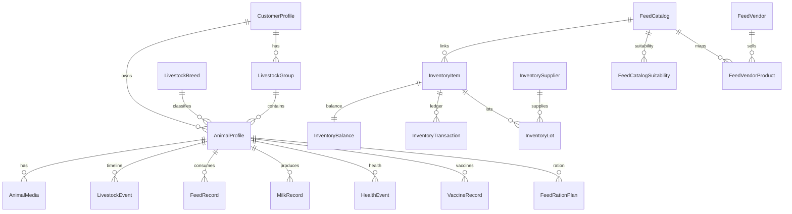

# Phase 4 — Database Schema Plan

**Plan ID:** `PHASE_4_LIVESTOCK_FEED_ECOSYSTEM_MASTER_PLANNING_V1`  
**Status:** Planning only  
**Source of truth:** `pranidoctor-backend/prisma/schema.prisma`

---

## 1. Schema Philosophy

| Rule | Detail |
|------|--------|
| Evolve, don't fork | Extend `AnimalProfile` — no parallel `Livestock` table |
| Additive migrations | New columns nullable or defaulted; no DROP in production phases |
| Single writer | Inventory balance updated only via `InventoryTransaction` |
| Master vs farm data | `FeedCatalog` = platform; `InventoryItem` = farmer stock |
| Enum extension | New enum values via `ALTER TYPE ... ADD VALUE` |

---

## 2. Existing Models (Baseline)

### Core livestock (partial)

**`AnimalProfile`** — primary animal registry today:

| Field | Status | Phase 4 action |
|-------|--------|----------------|
| `customerId`, `name`, `species`, `breed` | Exists | Keep; link `breedId` FK → `LivestockBreed` |
| `animalType`, `gender`, `weightKg` | Exists | Extend `AnimalType` enum |
| `photoUrl` | Exists | Keep as primary; gallery via new table |
| `microchipOrTag` | Exists | Rename display to ear tag; add QR field |
| `pregnancyStatus` | Exists | Keep |
| `category` | Exists | Default LIVESTOCK for farm animals |
| `active` | Exists | Maps to status ACTIVE/INACTIVE |

**`LivestockBreed`** — exists for semen; reuse for animals:

- Add mobile read API; optional `purpose` tag (dairy/meat/dual)

### Feed & inventory (production)

| Model | Purpose |
|-------|---------|
| `FeedCatalog` | Platform feed master |
| `FeedRecord` | Consumption logs |
| `InventoryItem` | Farm catalog row |
| `InventoryBalance` | On-hand quantity |
| `InventoryTransaction` | Immutable ledger |
| `InventoryAuditLog` | Audit trail |

### Production & finance

| Model | Purpose |
|-------|---------|
| `MilkRecord` | Dairy production |
| `FinanceRecord` | Income/expense |
| `FatteningBatch` + related | Batch fattening |
| `WeightRecord` | Weight tracking |

### Health

| Model | Purpose |
|-------|---------|
| `HealthEvent` | Symptom, diagnosis, disease |
| `VaccineRecord` | Vaccination schedule |
| `FarmTreatment` | Farmer-entered treatment notes |

---

## 3. New / Extended Models

### 3.1 AnimalProfile extensions (migration `phase4_livestock_v1`)

```prisma
// New columns on AnimalProfile
breedId           String?
breed             LivestockBreed? @relation(...)
livestockGroupId  String?
livestockGroup    LivestockGroup? @relation(...)
purpose           LivestockPurpose?   // DAIRY, MEAT, BREEDING, ...
lifecycleStatus   LivestockStatus?    // ACTIVE, SOLD, DECEASED, ...
healthStatus      LivestockHealthStatus? // HEALTHY, SICK, RECOVERING, ...
earTagNumber      String?             // normalized from microchipOrTag
qrCodePayload     String?             // deep link token
customSpeciesLabel String?            // when animalType = OTHER
purchaseDate      DateTime? @db.Date
purchasePriceBdt  Decimal?  @db.Decimal(12, 2)
saleDate          DateTime? @db.Date
salePriceBdt      Decimal?  @db.Decimal(12, 2)
lastWeightAt      DateTime?
lactationNumber   Int?
lastCalvingDate   DateTime? @db.Date
farmRef           String?             // explicit farm scope

@@index([customerId, farmRef, active])
@@index([customerId, animalType])
@@index([earTagNumber])
@@unique([customerId, earTagNumber]) // where earTagNumber not null
```

### 3.2 LivestockGroup (new)

```prisma
model LivestockGroup {
  id          String   @id @default(cuid())
  customerId  String
  farmRef     String
  name        String
  nameBn      String?
  description String?
  isActive    Boolean  @default(true)
  createdAt   DateTime @default(now())
  updatedAt   DateTime @updatedAt
  customer    CustomerProfile @relation(...)
  animals     AnimalProfile[]

  @@unique([customerId, farmRef, name])
  @@index([customerId, farmRef])
}
```

### 3.3 AnimalMedia (new)

```prisma
model AnimalMedia {
  id             String   @id @default(cuid())
  animalId       String
  uploadedFileId String?
  url            String
  sortOrder      Int      @default(0)
  caption        String?
  createdAt      DateTime @default(now())
  animal         AnimalProfile @relation(...)
  uploadedFile   UploadedFile? @relation(...)

  @@index([animalId, sortOrder])
}
```

### 3.4 LivestockEvent (new — lifecycle timeline)

```prisma
enum LivestockEventType {
  BIRTH
  PURCHASE
  SALE
  DEATH
  TRANSFER
  WEIGHT
  PREGNANCY
  CALVING
  NOTE
}

model LivestockEvent {
  id           String             @id @default(cuid())
  customerId   String
  animalId     String
  eventType    LivestockEventType
  eventDate    DateTime           @db.Date
  payloadJson  Json?
  notes        String?
  createdAt    DateTime           @default(now())
  animal       AnimalProfile      @relation(...)

  @@index([animalId, eventDate])
  @@index([customerId, eventType])
}
```

### 3.5 FeedCatalog extensions (migration `phase4_feed_master_v2`)

```prisma
// Extend FeedCatalog
moistureType      FeedMoistureType?  // DRY, WET, FRESH
isSeasonal        Boolean @default(false)
seasonNotesBn     String?
seasonNotesEn     String?
restrictionJson   Json?   // { maxPercentDaily, contraindications[], toxic: bool }
suitabilityJson   Json?   // { animalTypes[], minAgeMonths, maxAgeMonths, purposes[] }
vendorSkuCode     String?

model FeedCatalogPriceHistory {
  id            String   @id @default(cuid())
  feedCatalogId String
  priceBdt      Decimal  @db.Decimal(12, 2)
  effectiveFrom DateTime @db.Date
  source        String?  // ADMIN, SEED, VENDOR
  feedCatalog   FeedCatalog @relation(...)
  @@index([feedCatalogId, effectiveFrom])
}
```

Optional normalized suitability (if JSON insufficient):

```prisma
model FeedCatalogSuitability {
  id            String     @id @default(cuid())
  feedCatalogId String
  animalType    AnimalType
  minAgeMonths  Int?
  maxAgeMonths  Int?
  purpose       LivestockPurpose?
  isRecommended Boolean    @default(true)
  feedCatalog   FeedCatalog @relation(...)
  @@unique([feedCatalogId, animalType, purpose])
}
```

### 3.6 FeedRecord extensions

```prisma
feedCatalogId     String?   // direct link to master (optional V2)
feedCatalog       FeedCatalog? @relation(...)
wastageAmount     Decimal?  // if partial wastage logged with feed
```

### 3.7 Inventory extensions

```prisma
model InventorySupplier {
  id          String   @id @default(cuid())
  customerId  String
  farmRef     String
  name        String
  phone       String?
  address     String?
  notes       String?
  isActive    Boolean  @default(true)
  createdAt   DateTime @default(now())
  updatedAt   DateTime @updatedAt
  @@unique([customerId, farmRef, name])
}

model InventoryLot {
  id              String   @id @default(cuid())
  inventoryItemId String
  lotNumber       String?
  supplierId      String?
  quantityReceived Decimal @db.Decimal(12, 3)
  quantityRemaining Decimal @db.Decimal(12, 3)
  unit            FeedUnit // or medicine unit snapshot
  expiryDate      DateTime? @db.Date
  receivedAt      DateTime @default(now())
  receiptTxId     String?  // InventoryTransaction
  inventoryItem   InventoryItem @relation(...)
  supplier        InventorySupplier? @relation(...)
  @@index([inventoryItemId, expiryDate])
}

// InventoryItem extensions
defaultBagWeightKg Decimal? @db.Decimal(10, 3)  // for unit conversion
supplierId         String?
```

**Enum extension:**

```prisma
enum InventoryTransactionType {
  RECEIPT
  CONSUMPTION
  ADJUSTMENT
  WASTAGE      // NEW
  RESERVE
  RELEASE_RESERVE
  VOID
}
```

### 3.8 Feed recommendation (new)

```prisma
model FeedRationPlan {
  id          String   @id @default(cuid())
  customerId  String
  animalId    String
  planDate    DateTime @db.Date
  ruleVersion String
  totalCostBdt Decimal? @db.Decimal(12, 2)
  itemsJson   Json     // [{ feedCatalogId, amountKg, costBdt }]
  notes       String?
  createdAt   DateTime @default(now())
  animal      AnimalProfile @relation(...)
  @@unique([animalId, planDate, ruleVersion])
}
```

### 3.9 Vendors (marketplace prep)

```prisma
model FeedVendor {
  id            String   @id @default(cuid())
  name          String
  nameBn        String?
  phone         String?
  districtId    String?
  address       String?
  verificationStatus VendorVerificationStatus @default(PENDING)
  isActive      Boolean  @default(true)
  createdAt     DateTime @default(now())
  updatedAt     DateTime @updatedAt
  products      FeedVendorProduct[]
}

model FeedVendorProduct {
  id            String   @id @default(cuid())
  vendorId      String
  feedCatalogId String?
  displayName   String
  unit          FeedUnit
  unitWeightKg  Decimal? @db.Decimal(10, 3)
  isActive      Boolean  @default(true)
  vendor        FeedVendor @relation(...)
  feedCatalog   FeedCatalog? @relation(...)
  prices        FeedVendorProductPrice[]
}

model FeedVendorProductPrice {
  id              String   @id @default(cuid())
  vendorProductId String
  priceBdt        Decimal  @db.Decimal(12, 2)
  effectiveFrom   DateTime @db.Date
  vendorProduct   FeedVendorProduct @relation(...)
}
```

### 3.10 Analytics snapshots (optional — performance)

```prisma
model FarmAnalyticsSnapshot {
  id           String   @id @default(cuid())
  customerId   String
  farmRef      String
  periodStart  DateTime @db.Date
  periodEnd    DateTime @db.Date
  metricsJson  Json     // feedCost, milkLiters, fcr, animalCount, ...
  computedAt   DateTime @default(now())
  @@unique([customerId, farmRef, periodStart, periodEnd])
}
```

---

## 4. Enum Evolution

### AnimalType (extend)

```
CATTLE, GOAT, SHEEP, POULTRY, BUFFALO, DUCK, PIGEON, DOG, CAT, OTHER
```

Map legacy `species` string → enum on backfill migration.

### New enums

- `LivestockPurpose`, `LivestockStatus`, `LivestockHealthStatus`
- `FeedMoistureType` (DRY, WET, FRESH)
- `VendorVerificationStatus` (PENDING, VERIFIED, REJECTED)

---

## 5. Entity Relationship (Target)



---

## 6. Migration Strategy

### Phase ordering

| Migration ID | Content | Risk |
|--------------|---------|------|
| `phase4_livestock_v1` | AnimalProfile columns, LivestockGroup, AnimalMedia, enums | Low — additive |
| `phase4_feed_master_v2` | FeedCatalog extensions, suitability, price history | Low |
| `phase4_inventory_v2` | Supplier, Lot, WASTAGE enum | Medium — enum add |
| `phase4_recommendations_v1` | FeedRationPlan | Low |
| `phase4_vendors_v1` | Vendor tables | Low — isolated |
| `phase4_analytics_v1` | Snapshot table | Low |

### Backfill scripts

1. Copy `microchipOrTag` → `earTagNumber` where set
2. Set `category = LIVESTOCK` where `animalType` in (CATTLE, GOAT, POULTRY)
3. Link `breed` text → `LivestockBreed.id` where fuzzy match confidence > 0.9
4. Set `farmRef` from profile composite farm id

### Rollback policy

- Each migration reversible via down SQL in dev only
- Production: forward-fix migrations; never drop columns in Phase 4

---

## 7. Index & Performance Plan

| Query pattern | Index |
|---------------|-------|
| Customer animal list | `(customerId, active, updatedAt DESC)` |
| Farm scoped inventory | `(customerId, farmRef, inventoryType, isActive)` |
| Feed logs by date | `(customerId, recordedDate)` |
| Low stock scan | Balance join — materialized in service |
| Catalog search | GIN on `nameBn`, `nameEn` — Phase 4b if needed |

---

## 8. Prisma Best Practices

- Use `@db.Decimal(12, 3)` for weights/quantities
- `@updatedAt` on all mutable models
- Soft delete: `deletedAt` on inventory; `active=false` on animals
- `$transaction` for feed create + inventory deduct
- Avoid `@@map` renames unless preserving legacy tables

---

## 9. Conflicts with Web Scaffold

`pranidoctor-web/src/lib/livestock/livestock-service.ts` assumes models:

- `Livestock`, `LivestockGroup`, `LivestockImage`, etc.

**These must not be created.** Align web types to `AnimalProfile` + new tables above.

---

## 10. Related Documents

- [backend-architecture.md](./backend-architecture.md)
- [api-contracts.md](./api-contracts.md)
- [feed-engine-plan.md](./feed-engine-plan.md)
- Existing: `pranidoctor-backend/docs/plans/feed_catalog/02-db-design.md`
- Existing: `pranidoctor_user/docs/plans/farm_inventory/04-db-design.md`
