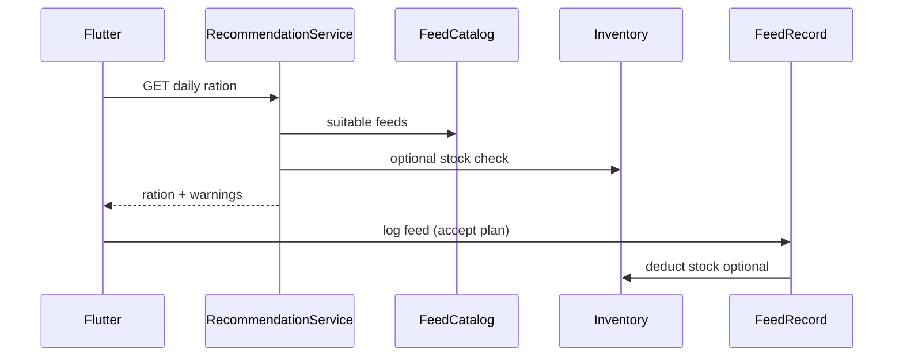

# Phase 4 — Feed Engine Plan

**Plan ID:** `PHASE_4_LIVESTOCK_FEED_ECOSYSTEM_MASTER_PLANNING_V1`  
**Status:** Planning only

---

## 1. Feed Engine Scope

The **Feed Engine** spans three subsystems:

```
┌─────────────────────────────────────────────────────────┐
│                    FEED ENGINE                           │
├─────────────────┬─────────────────┬─────────────────────┤
│  Feed Master    │  Feed Inventory │  Recommendation     │
│  (catalog)      │  (stock)        │  (ration builder)   │
└─────────────────┴─────────────────┴─────────────────────┘
         │                  │                  │
         └──────────────────┴──────────────────┘
                            │
                    FeedRecord (consumption)
```

---

## 2. Feed Master System

### 2.1 Purpose

Platform-wide Bangladesh feed database used for:

- Farmer inventory item creation (pick from master)
- Feed log labeling and analytics consistency
- Recommendation engine ingredient pool
- Future vendor product mapping

### 2.2 Data model (existing + planned)

**Core:** `FeedCatalog` — see [database-schema-plan.md](./database-schema-plan.md)

**Seed data target:** 120+ items covering:

| Category | Examples (BN) |
|----------|---------------|
| ROUGHAGE | পাইকার ঘাস, ভুসি, খড় |
| GREEN | নাপিয়ার, মেথি, শাক |
| CONCENTRATE | সরিষার খৈল, চালের কুড়া, ভুট্টার ভুসি |
| SUPPLEMENT | গুড়, চালের দুয়া |
| MINERAL | লবণ, খনিজ মিশ্রণ |
| SILAGE | ভুট্টা সাইলেজ |

Seed file: `prisma/seeds/feed_catalog.seed.ts` + JSON asset for Flutter offline.

### 2.3 Nutrition values

Stored in `nutritionJson`:

```json
{
  "cpPercent": 38.0,
  "tdnPercent": 75.0,
  "cfPercent": 12.0,
  "eePercent": 8.0,
  "caPercent": 0.8,
  "pPercent": 1.2,
  "dmPercent": 90.0,
  "source": "DLS-BD-2024"
}
```

Admin form validates ranges (0–100 for percentages).

### 2.4 Dry / wet / fresh

`FeedMoistureType`:

| Type | Examples | DM adjustment in engine |
|------|----------|-------------------------|
| DRY | straw, hay, concentrate | as-is |
| WET | silage, green chop | multiply by DM% |
| FRESH | grazing, green grass | high moisture adjustment |

### 2.5 Seasonal feed

| Field | Use |
|-------|-----|
| `isSeasonal` | Flag in UI |
| `seasonNotesBn` | Farmer-facing guidance |
| Rule engine | Monsoon (Jun–Oct): boost dry roughage; Winter: energy supplement |

Season rules live in recommendation module config — catalog provides metadata.

### 2.6 Feed pricing

| Layer | Mechanism |
|-------|-----------|
| Reference price | `FeedCatalog.approxPriceBdt` |
| History | `FeedCatalogPriceHistory` |
| Farmer actual | `FeedRecord.costBdt`, inventory receipt unit cost |
| Vendor | `FeedVendorProductPrice` |

Analytics prefers actual cost when available; falls back to reference.

### 2.7 Suitability matrix

**Option A (V1):** `suitabilityJson` on catalog  
**Option B (V2):** normalized `FeedCatalogSuitability` table

Dimensions:

- `animalTypes[]`: CATTLE, GOAT, POULTRY, ...
- `minAgeMonths`, `maxAgeMonths`
- `purposes[]`: DAIRY, MEAT, BREEDING
- `isRecommended`: boolean
- `maxPercentOfRation`: number

### 2.8 Feed restrictions

`restrictionJson`:

```json
{
  "toxic": false,
  "maxPercentDaily": 25,
  "contraindicationsBn": ["গাভীর গর্ভকালে সীমিত করুন"],
  "contraindicationsEn": ["Limit during late pregnancy"],
  "incompatibleWith": ["bd-urea-treated-straw-unprepared"]
}
```

Recommendation engine **must** filter toxic and apply caps.

---

## 3. Feed Inventory System

### 3.1 Architecture (existing)

Module: `src/modules/inventory/`

```
InventoryService
  └── StockEngineService (balance mutations)
  └── InventoryTransactionService (ledger)
  └── FeedInventoryService / MedicineInventoryService
```

**Invariant:** `InventoryBalance.quantityOnHand` updated only inside stock engine transactions.

### 3.2 Stock management flows

| Flow | Transaction type | Trigger |
|------|------------------|---------|
| Purchase / stock-in | RECEIPT | Manual UI, future finance link |
| Feed log deduct | CONSUMPTION | FeedRecord create when `deductStock=true` |
| Spoilage / loss | WASTAGE | Manual wastage UI |
| Correction | ADJUSTMENT | Admin/farmer correction with reason |
| Planned ration hold | RESERVE / RELEASE | Phase 4c |

### 3.3 Unit conversion engine

**Service:** `UnitConversionService`

| Unit | Conversion to kg |
|------|------------------|
| KG | 1 |
| BAG | `item.defaultBagWeightKg` or user prompt |
| BUNDLE | configurable per item |
| LITER | density factor (water=1 for molasses approx) |
| MON | 40 kg (BD standard) |
| SEER | 0.933 kg |

Conversion applied at:

- Receipt entry (store normalized kg in movement metadata)
- Consumption (feed log unit → inventory unit)
- Recommendation output (always kg internally; display localized)

Store conversion snapshot on `InventoryTransaction.unitSnapshot` + `normalizedKg`.

### 3.4 Purchase entries

Body ties to optional `InventorySupplier` + `InventoryLot`:

- quantity, unit, unit cost → total cost
- optional link `FinanceRecord` (category FEED) — Phase 4b auto-link

### 3.5 Consumption entries

Primary path: **FeedRecord** with optional deduct.

Secondary: manual `POST /inventory/consume` for non-logged usage.

Idempotency: `sourceType=FEED_RECORD`, `sourceId=feedRecord.id`.

### 3.6 Wastage

Explicit `WASTAGE` type — not buried in ADJUSTMENT.

Required: `reason` enum (SPOILAGE, SPILL, RODENT, EXPIRED, OTHER).

### 3.7 Low stock alert

Trigger when `quantityOnHand <= lowStockThreshold`.

Emit `inventory.low-stock` event → notification module:

- Push: "ভুসির মজুদ কম — মাত্র {qty} kg বাকি"
- In-app banner on inventory home

No auto-purchase.

### 3.8 Expiry tracking

`InventoryLot.expiryDate` — FIFO deduction:

1. Sort lots by expiry ASC
2. Deduct from earliest non-empty lot
3. Warn when lot within 7 days of expiry

### 3.9 Supplier tracking

Farmer-local `InventorySupplier` (distinct from platform `FeedVendor`):

- Local shopkeeper name + phone
- Linked on receipt and lot

---

## 4. Feed Recommendation Engine

### 4.1 V1 approach: rule-based (no ML)

**Module:** `src/modules/feed-recommendations/`

```
rules/
├── bd-cattle-dairy-v1.json
├── bd-cattle-fattening-v1.json
├── bd-goat-v1.json
├── bd-poultry-layer-v1.json
└── seasonal-bd-v1.json
```

Each rule file defines:

- Requirement formulas (maintenance + production)
- Ingredient priority lists by category
- Seasonal multipliers
- Cost optimization pass (cheapest feasible mix)

### 4.2 Inputs

| Input | Source |
|-------|--------|
| animalType, age, weight | AnimalProfile |
| purpose, pregnancy | AnimalProfile |
| milk yield (7-day avg) | MilkRecord aggregation |
| disease / health | HealthEvent flags (active SICK) |
| season | Server date → BD season map |
| available inventory | InventoryBalance (optional mode) |
| budget cap | User preference (optional) |

### 4.3 Outputs

| Output | Description |
|--------|-------------|
| Daily DM target (kg) | Dry matter requirement |
| Ration items | catalogId + amountKg + cost |
| Nutrition totals | CP, TDN, Ca, P |
| Warnings | restrictions, seasonal, deficiency |
| disclaimerBn | Not a substitute for vet advice |

### 4.4 Daily intake estimation

Formula example (cattle maintenance — simplified):

```
DM_kg = 0.02 * bodyWeightKg + 0.1 * milkKg
CP_percent_target = 16 (dairy) | 12 (maint) | 14 (growth)
```

Production add-ons from standard tables (NRC-inspired, calibrated for BD smallholder).

### 4.5 Nutrition estimation

Sum catalog `nutritionJson` weighted by amount.

Report gaps: "প্রোটিন ২% কম — সরিষার খৈল বাড়ান"

### 4.6 Caching

Key: `rec:{animalId}:{date}:{ruleVersion}`  
TTL: 24h or until animal weight/milk changes.

Persist accepted plans to `FeedRationPlan`.

---

## 5. Integration Points



---

## 6. Feed Engine vs Fattening Module

| Aspect | Feed Engine | Fattening |
|--------|-------------|-----------|
| Scope | All livestock | Batch cattle fattening |
| Plan | FeedRationPlan per animal | BatchFeedPlan per batch |
| Integration | Recommendation may suggest batch defaults | Batch feed dashboard uses FeedRecord |

Do not merge — fattening keeps batch ROI; engine provides per-animal baseline.

---

## 7. Flutter UX (summary)

| Screen | Engine touchpoint |
|--------|-------------------|
| Feed create | Catalog multi-select picker |
| Inventory create | Catalog → InventoryItem |
| Recommendation page | Daily ration + "Log this feed" CTA |
| Feed cost | Master prices vs actual |

Detail: [flutter-architecture.md](./flutter-architecture.md)

---

## 8. Risks

| Risk | Mitigation |
|------|------------|
| Nutrition data accuracy | Source tag + admin review queue |
| Rule complexity | Start cattle dairy + goat only |
| Unit confusion (mon vs kg) | Always show both in UI |
| Stock deduct failures | Clear 409 UX; allow log-without-deduct |

---

## 9. Related Documents

- [database-schema-plan.md](./database-schema-plan.md)
- [api-contracts.md](./api-contracts.md)
- [backend-architecture.md](./backend-architecture.md)
- `pranidoctor-backend/docs/plans/feed_catalog/`
- `pranidoctor_user/docs/plans/farm_inventory/`
