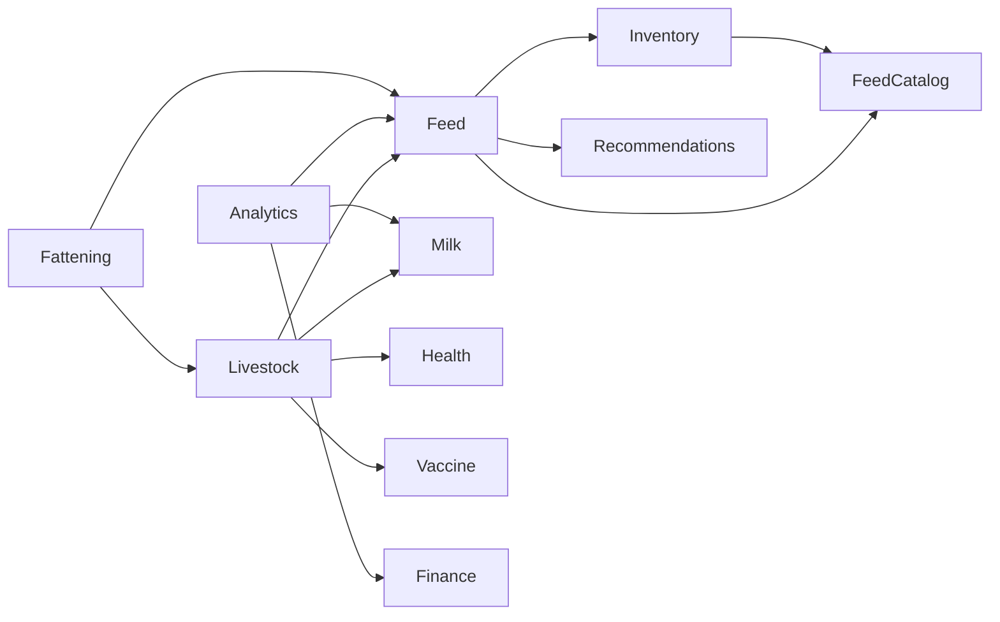

# Phase 4 — Flutter Architecture

**Plan ID:** `PHASE_4_LIVESTOCK_FEED_ECOSYSTEM_MASTER_PLANNING_V1`  
**Status:** Planning only

---

## 1. Current Flutter Architecture (Baseline)

The user app (`pranidoctor_user`) follows a **feature-first clean architecture**:

```
lib/
├── app/                    # Bootstrap, router, theme
├── config/                 # API endpoints, constants, environment
├── core/                   # Network, errors, localization, offline, session
└── features/
    └── {feature}/
        ├── data/           # api_paths, dto, validation, repository(_contract)
        └── presentation/   # providers, pages, widgets, navigation
```

### Established patterns (reuse — do not reinvent)

| Pattern | Reference implementation |
|---------|-------------------------|
| Repository + contract | `features/animals/data/animal_repository_contract.dart` |
| Riverpod list notifier | `animal_providers.dart` — `AsyncNotifierProvider` |
| Offline cache keys | `core/offline/local_cache_contract.dart` |
| Outbox sync | `features/offline/data/outbox_service.dart` |
| Feedback widgets | `*_feedback.dart` per feature |
| API envelope parsing | `core/network/dio_helpers.dart` + `ApiResult` |
| Localization | `core/localization/` — JSON assets `assets/i18n/bn.json`, `en.json` |
| Navigation helpers | `*_navigation.dart` + go_router routes in `app/router` |

---

## 2. Phase 4 Feature Map

### Existing features to extend

| Feature | Path | Phase 4 work |
|---------|------|--------------|
| Animals → **Livestock hub** | `features/animals/` | Rename UX to "পশু"; breed API; QR; gallery; timeline v2 |
| Farm | `features/farm/` | Multi-farm ready `farmRef`; link inventory |
| Feed | `features/feed/` | Catalog multi-select; link inventory item |
| Feed catalog | `features/feed_catalog/` | Recommendation picker integration |
| Inventory | `features/inventory/` | Lots, expiry, wastage, supplier |
| Milk | `features/milk/` | Link to analytics dashboard |
| Finance | `features/finance/` | Livestock expense categories |
| Health | `features/health/` | Unified animal timeline |
| Vaccine | `features/vaccine/` | Timeline + reminders |
| Fattening | `features/fattening/` | Keep as sub-flow for batch fattening |
| Batches | `features/batches/` | Align naming with fattening or deprecate duplicate |

### New features

| Feature | Path | Purpose |
|---------|------|---------|
| Livestock analytics | `features/livestock_analytics/` | Dashboard, charts, P/L summary |
| Feed recommendations | `features/feed_recommendations/` | Daily ration UI |
| Vendors (read-only) | `features/vendors/` | Nearby feed shops — Phase 4c |

---

## 3. Target Folder Structure

```
lib/features/livestock/                    # Evolve from animals/ (or alias export)
├── data/
│   ├── livestock_api_paths.dart
│   ├── livestock_dto.dart                 # extends Animal DTO
│   ├── livestock_validation.dart
│   ├── livestock_repository_contract.dart
│   ├── livestock_repository.dart
│   ├── breed_dto.dart                     # from LivestockBreed API
│   └── timeline_dto.dart
├── presentation/
│   ├── livestock_providers.dart
│   ├── livestock_list_page.dart
│   ├── livestock_detail_page.dart
│   ├── livestock_form_page.dart
│   ├── livestock_timeline_page.dart
│   ├── livestock_qr_page.dart
│   ├── widgets/
│   │   ├── livestock_card.dart
│   │   ├── livestock_feedback.dart
│   │   ├── breed_picker.dart
│   │   ├── species_picker.dart
│   │   └── health_status_chip.dart
│   └── livestock_navigation.dart

lib/features/feed_recommendations/
├── data/
│   ├── recommendation_api_paths.dart
│   ├── recommendation_dto.dart
│   └── recommendation_repository.dart
└── presentation/
    ├── recommendation_providers.dart
    ├── daily_ration_page.dart
    └── widgets/ration_item_tile.dart

lib/features/livestock_analytics/
├── data/
│   ├── analytics_api_paths.dart
│   ├── analytics_dto.dart
│   └── analytics_repository.dart
└── presentation/
    ├── analytics_providers.dart
    ├── livestock_dashboard_page.dart
    ├── feed_efficiency_page.dart
    └── widgets/analytics_chart.dart
```

**Migration strategy:** Keep `features/animals/` routes working; add `livestock_*` files; switch routes in one PR; deprecate `animals` folder name in Phase 4b.

---

## 4. State Architecture (Riverpod)

### Provider tiers

| Tier | Provider type | Use case |
|------|---------------|----------|
| Session | `Provider` | `dioProvider`, `sessionControllerProvider` |
| Repository | `Provider` | `livestockRepositoryProvider` |
| List | `AsyncNotifierProvider` | Paginated livestock, feed logs, inventory |
| Detail | `FutureProvider.family` | `livestockDetailProvider(id)` |
| Filters | `StateProvider` | Search, species, farmRef, date range |
| Derived | `Provider` | Filtered counts, low-stock badge |
| Optimistic | Notifier method | Create livestock, log feed (existing pattern) |

### Example provider graph

```
sessionControllerProvider
  └── livestockRepositoryProvider
        └── livestockListProvider (AsyncNotifier)
              ├── livestockFilterProvider (StateProvider)
              └── livestockSortProvider (StateProvider)

livestockDetailProvider(id)
  └── livestockTimelineProvider(id)

feedRecommendationProvider(animalId)
  └── depends on livestockDetailProvider + feedCatalogProvider
```

### Invalidation rules

| Action | Invalidate |
|--------|------------|
| Create/update livestock | list, detail, dashboard, home summary |
| Log feed w/ deduct | feed list, inventory summary, analytics |
| Receipt stock | inventory list, low-stock alerts |
| Record milk | milk summary, analytics |

Use existing `sync_invalidation.dart` patterns — extend with new entity kinds.

---

## 5. Navigation & Information Architecture

### Home quick actions (target)

```
হোম
├── আমার পশু (Livestock list)
├── খাবার ও মজুদ (Feed + Inventory hub)
├── দুধ (Milk) — if dairy animals exist
├── মোটা করা ব্যাচ (Fattening) — if cattle
├── স্বাস্থ্য (Health + Vaccine)
├── খরচ ও লাভ (Analytics)
└── চিকিৎসক (Doctor — existing)
```

### Route table (new + evolved)

| Route | Screen | Notes |
|-------|--------|-------|
| `/livestock` | List | Replaces `/animals` alias |
| `/livestock/create` | Form | Offline draft |
| `/livestock/:id` | Detail | Tabs: overview, timeline, feed, health |
| `/livestock/:id/edit` | Form | |
| `/livestock/:id/qr` | QR display/scan | |
| `/feed` | Feed history | Existing |
| `/feed/create` | Log feed | Catalog + inventory picker |
| `/inventory` | Inventory home | Existing |
| `/inventory/receipt` | Stock in | Extend for supplier |
| `/inventory/wastage` | Wastage entry | New |
| `/recommendations/:animalId` | Daily ration | New |
| `/analytics` | Farm dashboard | New |
| `/analytics/feed-efficiency` | FCR charts | New |
| `/vendors` | Vendor list | Phase 4c |

---

## 6. Offline & Sync

### Cache keys (extend `LocalCacheContract`)

| Key | Content |
|-----|---------|
| `livestock_list_snapshot` | Paginated list page 1 |
| `livestock_detail:{id}` | Detail + timeline summary |
| `livestock_draft:{uuid}` | Form draft |
| `feed_catalog_snapshot` | Master catalog (exists) |
| `inventory_summary:{farmRef}` | Exists |
| `recommendation:{animalId}:{date}` | Cached ration |
| `analytics_dashboard_snapshot` | Summary cards |

### Outbox kinds (extend `OutboxKind`)

| Kind | Payload |
|------|---------|
| `livestock_create` | Full create body + clientDraftId |
| `livestock_patch` | Partial update |
| `livestock_deactivate` | Soft delete |
| `feed_create` | Existing |
| `inventory_receipt` | Stock in |
| `inventory_wastage` | Wastage movement |

**Conflict policy:** Inventory movements reject on server if insufficient stock — surface `409` to user; feed log may retry without deduct per server policy.

---

## 7. UI/UX — Bengali-First

| Principle | Implementation |
|-----------|------------------|
| Primary labels | Bengali in `bn.json` |
| Feed names | Display `nameBn` from catalog; fallback `nameEn` |
| Units | Show Bengali unit labels (কেজি, বস্তা, মণ) |
| Numbers | Bengali digits optional in settings |
| Errors | `UserErrorMapper` + localized API codes |
| Empty states | Contextual BN copy per screen |

See [multilingual-plan.md](./multilingual-plan.md).

---

## 8. Image Upload

Reuse `features/shared/upload/` and existing endpoints:

| Use | Endpoint |
|-----|----------|
| Profile photo | `POST /api/mobile/uploads/profile-image` |
| Cover | `POST /api/mobile/uploads/cover-image` |
| Gallery (new) | `POST /api/mobile/uploads/livestock-image` → `AnimalMedia` |

Upload flow: pick → compress → upload → attach URL to save payload.

---

## 9. Search & Filter

### Livestock list filters

- Species (`animalType` expanded enum)
- Status (active/inactive/sold/deceased)
- Farm ref
- Breed
- Health status
- Pregnancy (female cattle/goat)
- Full-text search: name, ear tag

Client-side sort until server pagination ships; then migrate to query params.

---

## 10. Testing Strategy (Flutter)

| Layer | Tool |
|-------|------|
| DTO parsing | Unit tests — `test/livestock/` |
| Validation | Unit tests |
| Providers | `ProviderContainer` tests with mocked repository |
| Widgets | Golden tests for cards/chips (optional) |
| Integration | Manual QA checklist — [testing-checklist.md](./testing-checklist.md) |

Run: `dart analyze lib/features/livestock` before merge.

---

## 11. Dependencies Between Features



**Rule:** `feed_recommendations` must not import `inventory` presentation — use repository interfaces only.

---

## 12. Related Documents

- [api-contracts.md](./api-contracts.md)
- [multilingual-plan.md](./multilingual-plan.md)
- [implementation-roadmap.md](./implementation-roadmap.md)
- Existing: `pranidoctor_user/docs/plans/farm_inventory/FLUTTER_INTEGRATION_NOTES.md`
