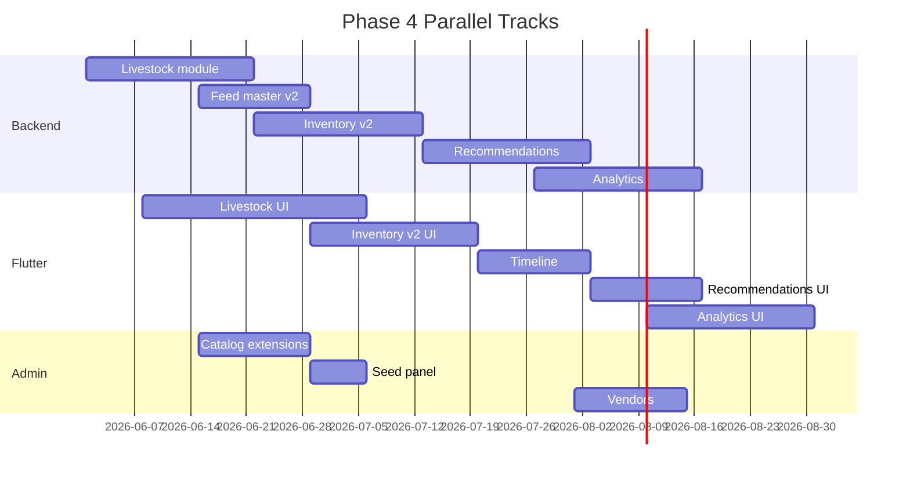

# Phase 4 — Implementation Roadmap

**Plan ID:** `PHASE_4_LIVESTOCK_FEED_ECOSYSTEM_MASTER_PLANNING_V1`  
**Status:** Planning only  
**Estimated duration:** 14–18 weeks (1–2 backend + 1 Flutter dev, parallel work)

---

## 1. Implementation Order (Summary)

```
Phase 4.0  Foundation & audit cleanup
Phase 4.1  Livestock registry evolution
Phase 4.2  Feed master extensions + seed expansion
Phase 4.3  Inventory v2 (lots, wastage, suppliers)
Phase 4.4  Unified timeline + Flutter livestock hub
Phase 4.5  Recommendation engine v1
Phase 4.6  Analytics dashboard
Phase 4.7  Vendors + admin analytics
Phase 4.8  Hardening + production rollout
```

---

## 2. Phase 4.0 — Foundation (Week 1–2)

### Goals

- Align teams on **AnimalProfile evolution** (kill web `Livestock` scaffold confusion)
- Module folder scaffolding
- Migration pipeline verified

### Tasks

| ID | Task | Repo | Owner |
|----|------|------|-------|
| 4.0.1 | Mark web `lib/livestock/*` as deprecated; document mapping to AnimalProfile | web | Backend lead |
| 4.0.2 | Create `src/modules/livestock/` skeleton | backend | Backend |
| 4.0.3 | Create `src/modules/feed-catalog/` — extract from legacy admin | backend | Backend |
| 4.0.4 | Create `src/modules/feed-recommendations/` skeleton | backend | Backend |
| 4.0.5 | Create `src/modules/livestock-analytics/` skeleton | backend | Backend |
| 4.0.6 | Create `src/modules/vendors/` skeleton | backend | Backend |
| 4.0.7 | Add Phase 4 routes to Flutter router (stubs) | user | Flutter |
| 4.0.8 | Extend `LocalCacheContract` + outbox enum placeholders | user | Flutter |

### Deliverables

- ADR: "AnimalProfile as livestock registry"
- No user-visible changes

---

## 3. Phase 4.1 — Livestock Registry (Week 2–4)

### Schema

- Migration `phase4_livestock_v1`: AnimalProfile extensions, LivestockGroup, AnimalMedia, LivestockEvent
- Extend AnimalType enum (SHEEP, DUCK, PIGEON, BUFFALO)

### Backend

- `LivestockRegistryService`, breed API, group CRUD, media, QR payload
- Dual routes: `/api/mobile/livestock/*` + `/api/mobile/animals/*` alias

### Flutter

- Evolve `features/animals/` → livestock UI (species picker, breed API, groups)
- QR page, gallery upload

### Admin

- Livestock breed CRUD polish

### Exit criteria

- Create cow/goat/chicken with breed, ear tag, photo gallery
- BN labels on all new UI

---

## 4. Phase 4.2 — Feed Master Extensions (Week 4–5)

### Schema

- Migration `phase4_feed_master_v2`: nutrition extensions, suitability, price history, moisture, seasonal

### Backend

- Extend FeedCatalogAdminService + mobile query filters (animalType suitability)
- Expand seed to 120+ items
- Admin seed run panel

### Flutter

- Enhance feed catalog picker with BN names, category chips
- Offline catalog cache refresh

### Exit criteria

- Admin can edit nutrition + suitability
- Seed run report succeeds on staging

---

## 5. Phase 4.3 — Inventory v2 (Week 5–7)

### Schema

- Migration `phase4_inventory_v2`: InventorySupplier, InventoryLot, WASTAGE enum, bag weight

### Backend

- UnitConversionService
- Wastage endpoint, lot FIFO in StockEngine
- Expiry warnings → notification event

### Flutter

- Wastage screen, supplier picker on receipt, lot/expiry display
- Low-stock banner

### Exit criteria

- Receipt → lot with expiry → FIFO deduct on feed log
- 409 insufficient stock handled in UI

---

## 6. Phase 4.4 — Timeline & Integration (Week 7–9)

### Backend

- LivestockTimelineService aggregation
- Link TreatmentCase to timeline

### Flutter

- Livestock detail tabs (timeline, health, feed)
- Home hub navigation: "পশু", "খাবার ও মজুদ"
- Deep links from notifications

### Exit criteria

- Single timeline shows feed, milk, health, vaccine events
- Pull-to-refresh + offline cache

---

## 7. Phase 4.5 — Recommendation Engine v1 (Week 9–11)

### Backend

- Rule files: cattle dairy, goat, poultry layer
- NutritionRequirementService + RationBuilderService
- APIs: daily, preview, accept

### Flutter

- `features/feed_recommendations/` daily ration page
- "Log this feed" → prefill feed create form

### Exit criteria

- Dairy cow with weight + milk gets daily ration with BN warnings
- Disclaimer displayed

---

## 8. Phase 4.6 — Analytics (Week 11–13)

### Backend

- FarmDashboardService, FeedEfficiencyService, ProfitLossService
- Optional snapshot job

### Flutter

- `features/livestock_analytics/` dashboard + charts
- Period picker, farm scope

### Admin

- Implement aggregate queries for feed + livestock analytics

### Exit criteria

- Dashboard matches manual calculation on test farm dataset
- Feed cost per liter displayed for dairy user

---

## 9. Phase 4.7 — Vendors & Marketplace Prep (Week 13–15)

### Schema

- Migration `phase4_vendors_v1`

### Backend + Admin

- Vendor CRUD, verification workflow, product catalog
- Mobile read-only vendor list by district

### Flutter

- Vendor list screen (Phase 4c — can slip if needed)

### Exit criteria

- Admin verifies vendor → appears on mobile

---

## 10. Phase 4.8 — Hardening & Rollout (Week 15–18)

| Task | Detail |
|------|--------|
| Performance | Index review, analytics cache |
| Security | RBAC audit, farmRef scoping tests |
| Migration | Production backfill scripts |
| QA | Full [testing-checklist.md](./testing-checklist.md) |
| Docs | User-facing help articles (BN) |
| Feature flags | Gradual rollout by district |
| Deprecation | Remove `/animals` alias after 2 releases |

---

## 11. Migration Strategy

### Database

1. **Additive migrations only** in production
2. Backfill scripts as separate npm tasks (`pnpm db:backfill:livestock-v1`)
3. Verify row counts before/after
4. Roll forward on failure — no column drops

### API

1. Ship new paths alongside old
2. Flutter switches to new paths behind flag
3. Monitor 404/usage on old paths
4. Remove aliases in Phase 4.8

### Flutter

1. Cache keys versioned (`livestock_list_v2`)
2. Outbox backward compatible — old clients sync until force upgrade

### Data migration specifics

| Data | Action |
|------|--------|
| microchipOrTag → earTagNumber | SQL update |
| breed text → breedId | Fuzzy match script + manual review queue |
| farmRef | Populate from profile composite id |

---

## 12. Optimization Strategy

| Phase | Optimization |
|-------|--------------|
| 4.1 | Indexes on customerId + farmRef |
| 4.3 | Batch inventory list query with balance join |
| 4.5 | Redis cache for recommendations |
| 4.6 | Monthly snapshots for historical charts |
| 4.8 | Load test 100 concurrent dashboard requests |

Target: list p95 < 500ms, dashboard < 2s.

---

## 13. Risk Analysis

| ID | Risk | Likelihood | Impact | Mitigation |
|----|------|------------|--------|------------|
| R-01 | Duplicate Livestock model created | Medium | High | ADR + schema review gate |
| R-02 | Feed cost double-counted in P/L | Medium | Medium | Dedup rules; finance link in 4b |
| R-03 | Recommendation gives harmful advice | Low | High | Disclaimers; restrictionJson; vet override flag |
| R-04 | Inventory race on concurrent deduct | Medium | Medium | Transaction isolation; idempotency keys |
| R-05 | BN translation inconsistency | High | Low | Glossary + CI key audit |
| R-06 | Offline sync conflicts on inventory | Medium | Medium | 409 UX; no offline wastage without confirmation |
| R-07 | Scope creep (marketplace checkout) | High | Medium | Vendors read-only only in Phase 4 |
| R-08 | Single-farm limitation frustrates users | Medium | Medium | farmRef + FarmUnit in 4b roadmap |
| R-09 | Seed data nutrition inaccuracy | Medium | Medium | Source tags; admin review |
| R-10 | Web/backend route drift | Medium | High | Shared Zod schemas; contract tests |

---

## 14. Team Parallelization



---

## 15. Definition of Done (Phase 4)

- [ ] All 10 module areas in scope delivered or explicitly deferred with ticket
- [ ] 120+ feed catalog seeds in production
- [ ] Livestock CRUD with timeline, QR, gallery
- [ ] Inventory with lots, wastage, suppliers, low-stock alerts
- [ ] Rule-based recommendations for cattle dairy + goat
- [ ] Analytics dashboard with feed cost and efficiency
- [ ] Admin vendor verification workflow
- [ ] BN-first UI complete for new screens
- [ ] Offline feed + livestock drafts sync reliably
- [ ] Production migrations applied with backfill report
- [ ] QA checklist signed off

---

## 16. Deferred to Phase 4b/5

| Item | Reason |
|------|--------|
| Multi-farm `FarmUnit` CRUD | Profile composite sufficient for MVP |
| Marketplace orders/checkout | Scope |
| ML-based recommendations | Rule engine first |
| IoT auto-consumption | Hardware dependency |
| Weight records for all species | Fattening-only initially |
| Vaccine master catalog | Free-text sufficient V1 |
| Finance auto-link on receipt | Manual optional V1 |

---

## 17. Related Documents

- [system-overview.md](./system-overview.md)
- [backend-architecture.md](./backend-architecture.md)
- [testing-checklist.md](./testing-checklist.md)
