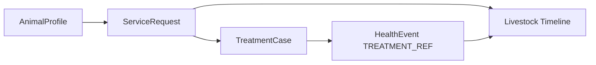

# Phase 4 — Livestock & Health Plan

**Plan ID:** `PHASE_4_LIVESTOCK_FEED_ECOSYSTEM_MASTER_PLANNING_V1`  
**Status:** Planning only

---

## 1. Scope

Unified **livestock lifecycle + health** design covering:

- Animal registry (evolve `AnimalProfile`)
- Breed master integration
- Farm grouping
- Identity (ear tag, QR)
- Health status and disease history
- Vaccination linkage
- Timeline / history aggregation
- Integration with doctor/emergency workflows

---

## 2. Livestock Registry Design

### 2.1 Entity strategy

**Primary entity:** `AnimalProfile` (not new `Livestock` table)

| User concept | Implementation |
|--------------|----------------|
| Livestock | `AnimalProfile` where `category=LIVESTOCK` |
| Pet | `category=PET` — same API, filtered UI |
| Custom species | `animalType=OTHER` + `customSpeciesLabel` |

### 2.2 Species support (target)

| animalType | User label (BN) | Notes |
|------------|-----------------|-------|
| CATTLE | গরু | Dairy + fattening |
| BUFFALO | মহিষ | Sub-type display |
| GOAT | ছাগল | |
| SHEEP | ভেড়া | **New enum** |
| POULTRY | মুরগি | Chicken default |
| DUCK | হাঁস | **New enum** |
| PIGEON | কবুতর | **New enum** |
| OTHER | স 기타 | + customSpeciesLabel |

### 2.3 Breed

- FK `breedId` → `LivestockBreed`
- Fallback free-text `breed` during migration
- Mobile breed picker: `GET /api/mobile/livestock/breeds?animalType=`
- Flutter: replace static `animal_breeds.dart` with API + cache

Bangladesh priority breeds:

- Cattle: Red Chittagong, Sahiwal, Crossbred
- Goat: Black Bengal, Jamunapari
- Poultry: Sonali, Cobb, Deshi

### 2.4 Gender & age

- `gender`: MALE, FEMALE, UNKNOWN, OTHER
- `dateOfBirth` → computed `ageMonths` in DTO
- Optional `purchaseDate` when DOB unknown

### 2.5 Weight

- `weightKg` on profile = latest snapshot
- `lastWeightAt` timestamp
- Historical weights: `WeightRecord` (fattening) — extend to all livestock types in Phase 4b

### 2.6 Pregnancy

- `pregnancyStatus`: existing enum
- Female cattle/goat only in UI validation
- Link to `LivestockEvent` type PREGNANCY, CALVING
- Recommendation engine adjusts ration when PREGNANT

### 2.7 Purpose & lifecycle

| Field | Values |
|-------|--------|
| `purpose` | DAIRY, MEAT, BREEDING, DRAFT, PET, MIXED, OTHER |
| `lifecycleStatus` | ACTIVE, SOLD, DECEASED, MISSING, TRANSFERRED |
| `active` | boolean — maps ACTIVE vs inactive/deceased |

Sold/deceased retain record for analytics; excluded from active counts.

---

## 3. Identity: Ear Tag & QR

### Ear tag

- Field: `earTagNumber` (normalized uppercase)
- Unique per `customerId` when set
- Validation: alphanumeric + hyphen, max 50 chars

### QR code

- `qrCodePayload`: signed token or stable URL slug
- Deep link: `pranidoctor://livestock/{id}` or universal link
- QR page in Flutter: display + share; scan opens detail (future)

### NFC (out of scope)

Phase 5+ consideration.

---

## 4. Farm Grouping

### Current state

- Animals tied to `customerId` only
- Farm is profile-derived composite (`farmRef` string)

### Phase 4a

- Add `farmRef` on `AnimalProfile`
- Optional `LivestockGroup` (pen/herd name)

### Phase 4b (optional)

- `FarmUnit` table for true multi-farm CRUD
- Migration from profile composite id

### Fattening integration

- `FatteningBatchAnimal` links batch ↔ animal
- Livestock detail shows active batch chip

---

## 5. Images & Media

| Capability | Phase |
|------------|-------|
| Single `photoUrl` | Exists |
| Gallery `AnimalMedia` | Phase 4a |
| Upload pipeline | Existing media service |

Gallery rules:

- Max 10 images per animal
- First image mirrors `photoUrl`
- Sort order for display

---

## 6. Health Status

### Field: `healthStatus`

| Value | BN label | Behavior |
|-------|----------|----------|
| HEALTHY | সুস্থ | Default |
| SICK | অসুস্থ | Show alert chip; affect recommendations |
| RECOVERING | সেরে ওঠছে | |
| UNDER_OBSERVATION | পর্যবেক্ষণে | |
| UNKNOWN | জানা নেই | |

Auto-suggest SICK when open `HealthEvent` type DISEASE within 14 days — server-side derived flag optional.

---

## 7. Disease History

### Existing: `HealthEvent`

| eventType | Use |
|-----------|-----|
| SYMPTOM | Farmer log |
| DIAGNOSIS | Vet/doctor |
| DISEASE | Named disease |
| CHECKUP | Routine |
| TREATMENT_REF | Link to TreatmentCase |

### Phase 4 enhancements

- Structured `diseaseCode` optional (ICD-like local list)
- Link `treatmentRefId` → `TreatmentCase.id` from doctor workflow
- Timeline surfaces all health events per animal

### Farmer vs doctor data

| Source | Model | Access |
|--------|-------|--------|
| Farmer | HealthEvent, FarmTreatment | Owner |
| Doctor visit | TreatmentCase, Prescription | Owner read via ServiceRequest |
| AI triage | AiAssistantSession | Summary in timeline (no diagnosis storage change) |

---

## 8. Vaccination Linkage

### Existing: `VaccineRecord`

Fields: vaccineName, scheduledDate, administeredDate, status, animalId

### Phase 4 integration

- Livestock detail tab: upcoming + history
- Timeline type `vaccine`
- Recommendation warnings if overdue (notification)
- Link health event `vaccineRefId` when administered

Common BD vaccines (master list — future `VaccineCatalog`):

- FMD, Anthrax, PPR (goat), Newcastle (poultry)

---

## 9. Unified Timeline

**Service:** `LivestockTimelineService`

Aggregates from:

| Source | Timeline type |
|--------|---------------|
| LivestockEvent | event |
| FeedRecord | feed |
| MilkRecord | milk |
| WeightRecord | weight |
| HealthEvent | health |
| VaccineRecord | vaccine |
| FinanceRecord | finance |
| ServiceRequest/TreatmentCase | treatment |

Sorted by date DESC; cursor pagination.

Flutter: `LivestockTimelinePage` with filter chips.

---

## 10. CRUD Operations

| Operation | Policy |
|-----------|--------|
| Create | Required: name, animalType, gender |
| Update | Partial PATCH |
| Delete | **Soft only** — deactivate / lifecycleStatus DECEASED/SOLD |
| Hard delete | Admin tooling only; breaks audit |

---

## 11. Doctor / Emergency Integration

- Service request requires `animalId`
- Completed treatment surfaces on animal timeline
- Emergency flag on request → priority notification (existing)

Feed recommendation **must not** override vet dietary orders — show conflict warning if active prescription notes exist.

---

## 12. Flutter Livestock UX

### Onboarding flow

1. Add first animal (species → breed → gender → photo)
2. Optional ear tag
3. Prompt: set up feed inventory (skip allowed)
4. Prompt: log today's feed (engagement)

### Detail tabs

| Tab | Content |
|-----|---------|
| Overview | Photo, stats, health chip, quick actions |
| Timeline | Unified history |
| Feed | Recent feed logs + recommend CTA |
| Health | Events + vaccines + request vet |
| Production | Milk (if dairy) / weight chart |

### Search/filter

See [flutter-architecture.md](./flutter-architecture.md)

---

## 13. API Summary

See [api-contracts.md](./api-contracts.md) § Livestock.

Legacy `/api/mobile/animals/*` maintained as alias for 2 releases.

---

## 14. Migration from Current Animals Module

| Step | Action |
|------|--------|
| 1 | Add schema columns (nullable) |
| 2 | Backfill farmRef, ear tag |
| 3 | Deploy backend with dual routes |
| 4 | Flutter: add livestock UI behind feature flag |
| 5 | Switch navigation labels to BN livestock terms |
| 6 | Deprecate animals route aliases |

---

## 15. Related Documents

- [database-schema-plan.md](./database-schema-plan.md)
- [feed-engine-plan.md](./feed-engine-plan.md) — health affects recommendations
- [multilingual-plan.md](./multilingual-plan.md)
- Existing: `pranidoctor_user/docs/user_app/USER_APP_07_ANIMAL.md`
