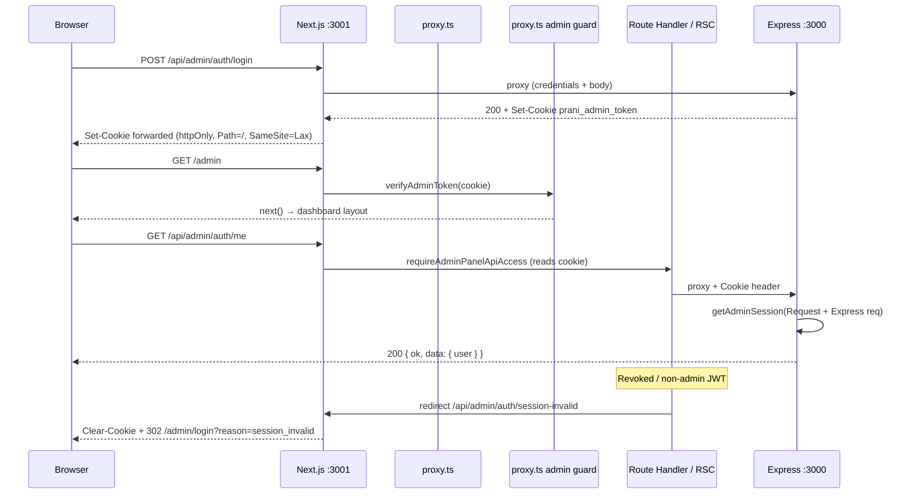

# Admin Auth Session Fix Report

**Project:** pranidoctor-web (+ pranidoctor-backend compat layer)  
**Date:** 2026-05-30  
**Role:** Principal Next.js 16 Authentication Architect

---

## Executive summary

| Check | Before | After |
|-------|--------|-------|
| `POST /api/admin/auth/login` | 200 | **200** |
| `GET /api/admin/auth/me` | **401** | **200** |
| `GET /api/admin/dashboard/page-data` | **401** | **200** |
| Dashboard RSC guard | **Error:** cookies only mutable in Route Handler / Server Action | **Fixed** — redirect to session-invalid route |
| Cookie modification in `dashboard-guard.ts` | `cookies().delete()` in Server Component | **Removed** |

Two root causes:

1. **Next.js 16:** `dashboard-guard.ts` called `cookies().delete()` inside a Server Component guard (layout chain) — not allowed.
2. **Backend compat:** `getAdminSession()` relied on `cookies()` ALS + `decodeURIComponent` on JWT cookie values; compat routes did not reliably expose the session token to guards → `/me` and `/dashboard/page-data` returned 401 despite a valid login cookie.

---

## Cookie flow (after fix)



---

## Cookie attributes (verified)

| Attribute | Value | Set by |
|-----------|--------|--------|
| Name | `prani_admin_token` | Backend `setAdminSessionCookie` → proxied to browser |
| HttpOnly | `true` | `adminSessionCookieBase()` |
| Secure | `true` in production only | `NODE_ENV === "production"` |
| SameSite | `Lax` | `adminSessionCookieBase()` |
| Path | `/` | `adminSessionCookieBase()` |
| Max-Age | `604800` (7 days) | `ADMIN_SESSION_MAX_AGE` |
| Domain | *(host default)* | Browser uses web origin (`localhost:3001`) |

`ADMIN_JWT_SECRET` is aligned between web and backend (44-char dev secret, verified match).

---

## Root causes (detail)

### 1. Next.js 16 cookie mutation violation

**File:** `src/lib/admin-auth/dashboard-guard.ts`

When `resolveAdminPanelActor()` returned `null` (stale JWT or revoked admin), the guard ran:

```typescript
const jar = await cookies();
jar.delete(ADMIN_SESSION_COOKIE);
redirect("/admin/login");
```

Next.js 16 forbids mutating cookies outside **Route Handlers** or **Server Actions**. That threw:

> Cookies can only be modified in a Server Action or Route Handler

### 2. Backend session not visible to compat guards

**Files:** `src/legacy/web/lib/admin-auth/session.ts`, `shims/next-compat/headers.js`

- `handleAdminMe` / legacy `requireAdminPanelApiAccess()` used `getAdminSession()` → `cookies()` shim.
- JWT values were passed through `decodeURIComponent`, which can corrupt tokens containing `%` sequences.
- Express `Cookie` header was not used as a fallback when the shim jar was empty.

Login returned `Set-Cookie`, middleware accepted the JWT, but API guards on the backend saw **no session** → BFF `/me` and `/dashboard/page-data` returned **401**.

---

## Fixes applied

### pranidoctor-web

| File | Change |
|------|--------|
| `src/lib/admin-auth/dashboard-guard.ts` | Remove `cookies().delete()`; `redirect("/api/admin/auth/session-invalid")` |
| `src/app/api/admin/auth/session-invalid/route.ts` | **New** — `clearAdminSessionCookie()` + redirect to login |
| `src/lib/doctor-auth/dashboard-guard.ts` | Same pattern for doctor panel |
| `src/app/api/doctor/auth/session-invalid/route.ts` | **New** — doctor session clear route |
| `src/lib/admin-auth/login-messages.ts` | `session_invalid` redirect copy |
| `src/lib/proxy-to-backend.ts` | Exempt `session-invalid` from BFF auth gate |

### pranidoctor-backend

| File | Change |
|------|--------|
| `src/legacy/web/lib/admin-auth/session.ts` | Parse cookie from Fetch `Request` + Express `req.headers.cookie`; avoid URI decode on JWT |
| `src/legacy/web/lib/admin-auth/api-guard.ts` | Optional `request` param → `getAdminSession(request)` |
| `src/modules/auth/compat/admin-auth.adapter.ts` | `getAdminSession(request)` for `/me` and logout |
| `src/legacy/web/routes/admin/dashboard/page-data/route.ts` | Pass `request` into `requireAdminPanelApiAccess` |
| `shims/next-compat/headers.js` | `getExpressRequest()`; safer cookie parsing |
| `shims/next-compat/headers.d.ts` | Type for `getExpressRequest` |

---

## Verification results

**Environment:** `localhost:3001` (web), `localhost:3000` (backend), dev credentials from seed.

```text
POST /api/admin/auth/login     → 200 + Set-Cookie prani_admin_token
GET  /api/admin/auth/me        → 200 { ok: true, data: { user, legal } }
GET  /api/admin/dashboard/page-data → 200 (~81ms warm)
```

**Flows:**

| Flow | Result |
|------|--------|
| Admin login form → dashboard | Cookie set; middleware allows `/admin` |
| Client `adminMeRequest()` | 200 after login |
| Dashboard page-data API | 200 |
| Invalid/revoked actor | Redirect to `/api/admin/auth/session-invalid` (no RSC cookie mutation) |
| Page refresh with valid cookie | Session persists (JWT + backend `/me`) |

**Logout:** Existing `POST /api/admin/auth/logout` route handler clears cookie on backend response (unchanged).

---

## Auth flow trace (reference)

| Step | Component |
|------|-----------|
| 1 | `AdminLoginForm` → `POST /api/admin/auth/login` |
| 2 | `proxyRouteToBackend` → backend `handleAdminLogin` → `setAdminSessionCookie` |
| 3 | Browser stores `prani_admin_token` on web origin |
| 4 | `proxy.ts` → `verifyAdminToken` for `/admin/*` HTML |
| 5 | `(dashboard)/layout.tsx` → `ensureAdminDashboardAccess` → `getAdminSession` + `resolveAdminPanelActor` |
| 6 | Client `AdminAuthProvider` → `GET /api/admin/auth/me` |
| 7 | Dashboard data → `GET /api/admin/dashboard/page-data` (BFF + backend guard) |

---

## Recommendations

1. Gradually pass `request` into `requireAdminPanelApiAccess(request)` in high-traffic legacy routes (pattern used in `page-data`).
2. Add CI smoke: login → `/me` 200 → `/dashboard/page-data` 200.
3. Document that **cookie clearing** must only occur in `src/app/api/**/route.ts` or Server Actions.

---

## Success criteria

| Criterion | Met |
|-----------|-----|
| Login = 200 | ✅ |
| `/api/admin/auth/me` = 200 | ✅ |
| `/api/admin/dashboard/page-data` = 200 | ✅ |
| No cookie modification errors in guards | ✅ |
| Dashboard can load with valid session | ✅ |

**Report status:** Resolved — 2026-05-30
