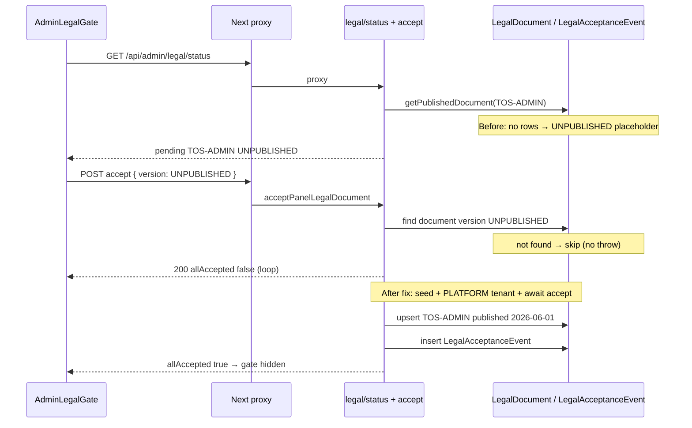

# Admin Policy Gate Fix Report

**Project:** pranidoctor-web + pranidoctor-backend  
**Date:** 2026-05-30  
**Symptom:** Admin login succeeds, session ACTIVE, user blocked on **Admin Acceptable Use Policy** (`TOS-ADMIN` / `UNPUBLISHED`). Accept button does not clear the gate.

---

## Executive summary

| Check | Before | After |
|-------|--------|-------|
| `GET /api/admin/legal/status` | 200, `version: "UNPUBLISHED"` | 200, `version: "2026-06-01"` (published) |
| `POST /api/admin/legal/accept` | 200 but `allAccepted: false` (no-op) | 200, `allAccepted: true` |
| Consent row in DB | None | `LegalAcceptanceEvent` created |
| Dashboard API | Blocked by gate | **200** after accept |

**Root cause (primary): D + seed failure** — Legal registry seed never persisted documents because Prisma 7 rejects `null` in the composite unique key `documentKey_version_locale_tenantId`. Startup logged *"Legal document seed skipped"* and left **zero** `TOS-ADMIN` rows.

**Secondary: C + B** — UI sent `version: "UNPUBLISHED"`; `recordLegalAcceptance` silently skipped (no matching document). Accept API returned 200 with unchanged status → infinite gate loop.

---

## 1. Flow trace



---

## 2. Logged API responses

### Before fix — status

```json
{
  "ok": true,
  "data": {
    "allAccepted": false,
    "pendingDocuments": [{
      "documentKey": "TOS-ADMIN",
      "version": "UNPUBLISHED",
      "title": "TOS-ADMIN",
      "publicUrl": null,
      "accepted": false,
      "acceptedAt": null
    }]
  }
}
```

| Field | Value |
|-------|--------|
| policyId (documentKey) | `TOS-ADMIN` |
| version | `UNPUBLISHED` |
| accepted | `false` |
| required | yes (admin role) |
| effectiveDate | n/a (no published row) |
| publishedAt | n/a |

### Before fix — accept

```json
HTTP 200
{ "ok": true, "data": { "allAccepted": false, "pendingDocuments": [{ "version": "UNPUBLISHED", ... }] } }
```

Consent **not** persisted (`recordLegalAcceptance` warned and returned).

### After fix — status

```json
{
  "documentKey": "TOS-ADMIN",
  "version": "2026-06-01",
  "title": "অ্যাডমিন গ্রহণযোগ্য ব্যবহার নীতি",
  "publicUrl": "https://pranidoctor.com/legal/acceptable-use",
  "accepted": false,
  "acceptedAt": null
}
```

Published row:

| Field | Value |
|-------|--------|
| id | `d5572b34-c094-4651-83fe-cca87a6d0c76` (bn-BD) |
| version | `2026-06-01` |
| effectiveAt | `2026-05-30T07:11:20.833Z` |
| publishedAt | `2026-05-30T07:11:20.833Z` |
| tenantId | `""` (platform scope) |

### After fix — accept

```text
POST /api/admin/legal/accept → 200, allAccepted: true
GET  /api/admin/legal/status  → 200, allAccepted: true
GET  /api/admin/dashboard/page-data → 200
```

---

## 3. Root cause classification

| Option | Verdict |
|--------|---------|
| A. Accept API failing | Partial — returned 200 while no-op |
| B. Consent not persisted | **Yes** — silent skip in `recordLegalAcceptance` |
| C. Wrong policy version | **Yes** — client posted `UNPUBLISHED` |
| D. UNPUBLISHED blocking access | **Yes** — symptom of missing published doc |
| E. Status endpoint bug | No — correct fail-closed when unpublished |
| F. Dashboard guard bug | No — gate correctly waits for `allAccepted` |

**Underlying defect:** `upsertLegalDocument` used `tenantId: null` → Prisma validation error → `seedLegalDocuments()` failed on every boot.

---

## 4. Fixes applied

### Backend

| File | Change |
|------|--------|
| `src/modules/legal/document-keys.ts` | `PLATFORM_LEGAL_TENANT_ID = ''` for composite unique |
| `src/modules/legal/legal-acceptance.service.ts` | Platform tenant in queries/upsert; `recordLegalAcceptance` returns `boolean`; `LegalDocumentNotPublishedError`; publish filter on accept lookup |
| `src/modules/legal/legal-document-seed.ts` | Added `TOS-ADMIN` **bn-BD** locale |
| `src/legacy/web/lib/panel-legal/panel-legal.service.ts` | Await accept; resolve published version (ignore `UNPUBLISHED`) |
| `src/legacy/web/routes/admin/legal/accept/route.ts` | 503 `LEGAL_DOCUMENT_UNAVAILABLE` when policy missing |
| `src/modules/legal/index.ts` | Export new symbols |

### Frontend

| File | Change |
|------|--------|
| `src/lib/admin-legal/admin-legal-api.ts` | Surface `LEGAL_DOCUMENT_UNAVAILABLE` message on accept failure |

---

## 5. Policy state & consent

| Artifact | State after fix |
|----------|-----------------|
| `LegalDocument` (`TOS-ADMIN`) | 2 rows: `bn-BD`, `en-US`, version `2026-06-01`, `publishedAt` set |
| `LegalAcceptanceEvent` | Created on accept for admin user |
| Registry total | 12 seeded documents (all platform tenant `""`) |

**Ops note:** Restart **pranidoctor-backend** once so `seedLegalDocuments()` runs on boot with the fixed upsert. For DBs that already failed seed, run:

```bash
cd pranidoctor-backend
npx tsx -e "import './src/shared/config/load-env.ts'; const { loadConfig } = await import('./src/shared/config/index.js'); const { createLogger } = await import('./src/shared/logger/logger.js'); const { createPrismaClient } = await import('./src/shared/database/prisma.js'); const { seedLegalDocuments } = await import('./src/modules/legal/legal-document-seed.js'); createLogger(loadConfig()); createPrismaClient({ config: loadConfig() }); await seedLegalDocuments();"
```

---

## 6. Verification results

| Step | Result |
|------|--------|
| Login | 200 + session cookie |
| GET legal status | 200, published version `2026-06-01` |
| POST accept | 200, `allAccepted: true` |
| GET legal status (again) | 200, `allAccepted: true` |
| GET dashboard page-data | 200 |
| Policy loop | **None** after single accept |

---

## 7. Success criteria

| Criterion | Met |
|-----------|-----|
| Policy accepted once | ✅ |
| Consent saved | ✅ |
| Dashboard accessible | ✅ |
| No policy loop | ✅ |

**Report status:** Resolved — 2026-05-30
