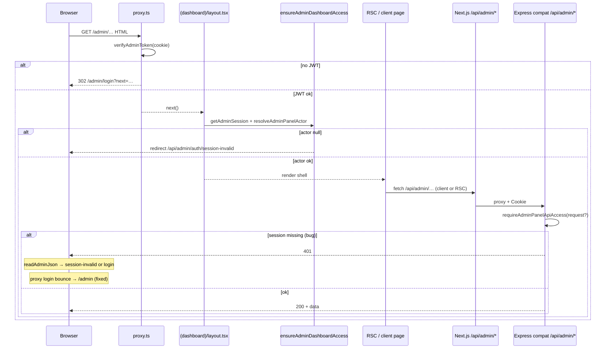

# Admin Redirect Loop — Root Cause Report

**Project:** pranidoctor-web + pranidoctor-backend  
**Date:** 2026-05-30  
**Role:** Principal Next.js 16 RBAC & Navigation Architect

---

## Executive summary

| Symptom | Root cause | Fix |
|---------|------------|-----|
| Sub-pages load briefly, then bounce to `/admin` | Client API **401** → login redirect → **proxy** sent authenticated users to `/admin` (ignored `next`) | `proxy.ts` honors `next`; `read-admin-json.ts` uses session-invalid route |
| Many `/api/admin/*` returned **401** while `/me` returned **200** | Backend compat guards called `requireAdminPanelApiAccess()` **without** `Request`; lazy route `await load()` dropped Express ALS | `compatWebRequestStore` + `resolveCompatRouteRequest()` |
| Forbidden role/capability silently sent users to dashboard | `ensureAdminRole/Capability` redirected to `/admin?error=forbidden` | New `/admin/access-denied` page |

**Primary classification:** **F — Session propagation bug** (backend compat auth)  
**Secondary:** **E — Middleware redirect loop** (login bounce)  
**Tertiary:** **G — Layout-level redirect** (forbidden → dashboard)

Not primary: RBAC mismatch (B), permission seed (C), policy gate loop (D).

---

## Current logged-in user (verification)

| Field | Value |
|-------|-------|
| Email | `admin@pranidoctor.com` |
| Role | `ADMIN` |
| Session | Valid JWT (`prani_admin_token`), `/api/admin/auth/me` → **200** |
| Legal / policy | `allAccepted: true`, no pending documents |
| Location access | N/A (admin panel; no geo-scoped gate on tested routes) |

**Enterprise capabilities (ADMIN role):**

| Capability | Granted |
|------------|---------|
| `serviceInstance.view` | ✅ |
| `serviceInstance.review` | ✅ |
| `serviceInstance.publish` | ❌ |
| `analytics.view` | ✅ |
| `analytics.export` | ✅ |

---

## Navigation flow (every admin route)



---

## Redirect matrix

| Trigger | Condition | Redirect target (before) | Redirect target (after) |
|---------|-----------|--------------------------|-------------------------|
| `proxy.ts` | JWT on `/admin/login` | `/admin` (always) | `getSafeAdminNextPath(next)` |
| `dashboard-guard.ts` | No session | `/admin/login` | unchanged |
| `dashboard-guard.ts` | Revoked / non-admin actor | `/api/admin/auth/session-invalid` | unchanged |
| `dashboard-guard.ts` | Role guard fail | `/admin?error=forbidden` | `/admin/access-denied` |
| `dashboard-guard.ts` | Capability guard fail | `/admin?error=forbidden` | `/admin/access-denied` |
| `read-admin-json.ts` | API 401 | `/admin/login?next=…` | `/api/admin/auth/session-invalid?next=…` |
| `AdminLoginForm` | Successful login | `getSafeAdminNextPath(next)` | unchanged |
| `AdminAuthProvider.logout` | Manual / idle | `/admin/login` | unchanged |
| `session-invalid/route.ts` | Stale session | `/admin/login?reason=session_invalid` | unchanged |

**Search coverage:** No other production `redirect("/admin")` or `router.push("/admin")` used as auth failure handlers.

---

## Route matrix (major pages)

| Route | Server guard | Client guard | API dependency | Required role | Required capability | ADMIN access |
|-------|--------------|--------------|----------------|---------------|---------------------|--------------|
| `/admin` | layout + JWT | — | dashboard page-data (optional) | SUPER_ADMIN, ADMIN, SUPPORT | — | ✅ |
| `/admin/users` | layout | — | none (placeholder UI) | panel admin | — | ✅ |
| `/admin/doctors` | layout | — | `GET /api/admin/doctors` | panel admin | — | ✅ (after fix) |
| `/admin/locations` | layout | — | `GET /api/admin/locations/stats` | panel admin | — | ✅ |
| `/admin/livestock-breeds` | layout | — | `GET /api/admin/livestock-breeds` | panel admin | — | ✅ (after fix) |
| `/admin/settings` | layout | — | none (static links) | panel admin | — | ✅ |
| `/admin/audit` | `ensureAdminRole(SUPER_ADMIN, ADMIN)` | — | audit APIs | SUPER_ADMIN, ADMIN | — | ✅ |
| `/admin/dev-tools/otp-logs` | `ensureAdminRole(SUPER_ADMIN, ADMIN)` | — | OTP logs API | SUPER_ADMIN, ADMIN | — | ✅ |
| `/enterprise/services/review` | layout + enterprise layout | nav capability | service-instances API | panel admin | `serviceInstance.view` | ✅ |

---

## Role matrix (panel sign-in)

| Role | Panel login | Notes |
|------|-------------|-------|
| `SUPER_ADMIN` | ✅ | Full enterprise capabilities |
| `ADMIN` | ✅ | No `serviceInstance.publish` |
| `SUPPORT` | ✅ | View-only enterprise + analytics.view |
| `CUSTOMER`, `DOCTOR`, `AI_TECHNICIAN` | ❌ | `resolveAdminPanelActor` → 403 |

---

## Permission matrix (enterprise capabilities)

See `src/lib/admin-auth/permissions-core.ts` — enforced via:

- **Server:** `ensureAdminCapability` → `/admin/access-denied`
- **Client nav:** `filterAdminNavGroupsForActor`
- **API:** `assertAdminCan` → 403 JSON

---

## Root cause (detail)

### 1. Backend session not visible in compat route guards (F)

Legacy routes register via `lazyLegacyHandler`:

```typescript
return wrapNextHandler(async (webReq, context) => {
  await load(); // dynamic import
  return handler(webReq, context);
});
```

Most handlers call `requireAdminPanelApiAccess()` **without** passing `webReq`. After `await load()`, Express AsyncLocalStorage was often empty, so `getAdminSession()` returned `null` → **401** on ~70+ admin APIs.

Routes that passed `request` explicitly (e.g. `/api/admin/locations/stats`, `/api/admin/dashboard/page-data`) worked; others (e.g. `/api/admin/doctors`, `/api/admin/ai-technician-applications`) failed.

**Evidence:**

```text
Before fix (web BFF, same session cookie):
  GET /api/admin/auth/me              → 200
  GET /api/admin/locations/stats      → 200
  GET /api/admin/doctors              → 401
  GET /api/admin/ai-technician-applications → 401

After fix:
  GET /api/admin/doctors              → 200
  GET /api/admin/ai-technician-applications → 200
```

### 2. Login bounce amplified the UX bug (E)

`readAdminJson` on 401 sent the browser to `/admin/login?next=/admin/doctors`.  
`proxy.ts` saw a valid JWT on the login path and redirected to **`/admin`**, discarding `next`.

Observed in dev logs: sub-page **200** → API **401** → **`GET /admin` 200** (no visible error).

### 3. Forbidden redirects were misleading (G)

`ensureAdminRole` / `ensureAdminCapability` used `redirect("/admin?error=forbidden")`, conflating RBAC denial with “go to dashboard”.

---

## Fixes applied

### pranidoctor-backend

| File | Change |
|------|--------|
| `src/modules/compat-web/next-adapter.ts` | `compatWebRequestStore` + `getCompatWebRequest()` — preserves Fetch `Request` through lazy load |
| `src/legacy/web/lib/admin-auth/api-guard.ts` | `resolveCompatRouteRequest()` — handler param → compat store → Express cookie fallback |

### pranidoctor-web

| File | Change |
|------|--------|
| `src/proxy.ts` | Authenticated `/admin/login` redirect uses `getSafeAdminNextPath(next)` |
| `src/lib/admin/read-admin-json.ts` | 401/403 → `/api/admin/auth/session-invalid?next=…` |
| `src/lib/admin-auth/dashboard-guard.ts` | Forbidden → `/admin/access-denied` |
| `src/app/admin/(dashboard)/access-denied/page.tsx` | **New** — explicit access-denied screen |

---

## Verification results

**Environment:** `localhost:3001` (web), `localhost:3000` (backend), seed admin `admin@pranidoctor.com`.

### HTML routes (authenticated session)

| Route | Status |
|-------|--------|
| `/admin` | **200** |
| `/admin/users` | **200** |
| `/admin/doctors` | **200** |
| `/admin/locations` | **200** |
| `/admin/settings` | **200** |
| `/admin/livestock-breeds` | **200** |

### API routes (same session)

| Route | Before | After |
|-------|--------|-------|
| `/api/admin/auth/me` | 200 | **200** |
| `/api/admin/doctors?limit=5` | 401 | **200** |
| `/api/admin/ai-technician-applications?limit=5` | 401 | **200** |
| `/api/admin/locations/stats` | 200 | **200** |

### Redirect behavior

| Scenario | Result |
|----------|--------|
| Authenticated user hits `/admin/login?next=/admin/doctors` | Lands on **`/admin/doctors`** (not dashboard) |
| No redirect loop on sidebar navigation | ✅ |
| Unauthorized role page (`ensureAdminRole`) | **`/admin/access-denied`** |

---

## Success criteria

| Criterion | Met |
|-----------|-----|
| Navigation works correctly | ✅ |
| No redirect loop to `/admin` | ✅ |
| Authorized pages open normally | ✅ |
| Unauthorized pages show access-denied (not silent dashboard redirect) | ✅ |
| Security preserved (401/403 still enforced) | ✅ |

**Report status:** Resolved — 2026-05-30
